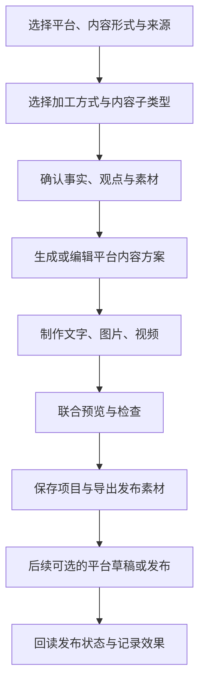

# AI 创作中心九平台调研整合与改造总方案

版本：1.1。初版日期：2026-09-07；拆分更新：2026-09-08。初版调研源码基线：`851f0691`；本次拆分核验基线：`3e0c39a7`。

文档状态：方案已整理，业务改造未实施。本文将现状、改造决策、拟新增契约与后续验证分开标注；不能把目标功能视为当前已上线功能。

整合范围：小红书、抖音、大众点评、快手、视频号、B站、公众号、知乎、朋友圈的创作逻辑；7 组 GitHub 项目；4 个 Linux.do 主题；2 个 V2EX 主题；平台公开要求及当前源码。原始调研保留为过程记录，后续评审与拆分开发任务以本文作为统一入口。

原始记录：[九平台评估](ai-creation-platform-review-2026-09-07.md)、[GitHub 与社区调研](ai-creation-community-research-2026-09-07.md)。本文已经包含改造所需的结论、证据和来源，不要求开发人员先拼接两份旧报告。

### 三任务执行入口（2026-09-08）

近期 W00-W08 拆成以下 3 个任务，按 1 → 2 → 3 衔接。任务文档给出范围、子项、验收与交接；具体卡的接口签名和精确写入清单在编码前按现有源码补齐。本次只拆分文档，未实施业务改造。

| 任务 | 主要交付 | 原方案归属 |
| --- | --- | --- |
| [1. 生成正确性与工作区加固](../任务书/AI内容中心改造-01-生成正确性与工作区加固.md) | 真实体验/身份、完整 Brief、保存冲突与恢复、公共契约 | W00-W03；W08 共享数据契约 |
| [2. 图文生产与平台交付](../任务书/AI内容中心改造-02-图文生产与平台交付.md) | 图卡身份/重试/任务绑定、已有正文加工、六类图文编辑稿、公共完成页和图文导出 | W04、W05、W07；W08 图文与共享组件 |
| [3. 视频素材创作与联合交付](../任务书/AI内容中心改造-03-视频素材创作与联合交付.md) | 自有媒体/脚本、平台视频策划、视频配文与素材包、九平台集成验收 | W06；W08 视频与整体集成 |

**当前代码补充：** #92 已有工作区和最近项目实现，实际入口包括 `src/lib/creation-workspace.ts`、`src/views/ai-center/creation/useWorkspaceAutosave.ts`、`RecentProjectsPanel.vue` 和后端 `CreationWorkspace.java`；迁移已到 V68。原文“拟新增工作区”“#92 待实施”等描述属于初版背景，任务 1 按差异加固，不重复建设。当前草稿与工作区分别有 1500ms、800ms 保存路径，需统一同一草稿的保存责任；不能只按初版把延时改掉。

**后续边界：** W09 精确图卡、W10 平台草稿/发布、W11 质量与效果复盘，以及 W07 的可选自动检索继续保留，按原有样稿/接入条件推进，不纳入近期三任务的完成条件。T01-T32 覆盖近期，T33-T38 留待对应扩展验收。W04 的操作记录与 T21 明确纳入任务 2。

## 1. 改造目标与执行原则

### 1.1 核心结论

保留“九平台入口 + 共用生成引擎 + 既有素材、草稿、计费和视频管线”。将平台差异落实到输入事实、内容结构、制作方式、字段检查、最终交付和发布状态。

用户应能从真实资料、现成文章、图片、脚本或实拍视频进入，完成一份可编辑、可恢复、可导出的平台内容。平台发布另设状态，生成完成与公开发布分别记录。

### 1.2 最先执行的改动

1. 纠正大众点评的默认好评方向，去除没有资料支持的作者资历和消费经历。
2. 修复独立视频的目标平台、行业、风格信息遗漏，保留全部创作来源的补充要求。
3. 修复图卡单卡重试的页面身份问题，将图卡接入正常完成和项目恢复流程。
4. 统一保存文章、回答、图片和视频的工作区，沿用现有草稿与版本机制。
5. 增加已有内容加工，补齐封面、摘要、图片顺序、视频配文、字幕和来源等平台成品。
6. 验证可编辑排版和资料检索，再按平台逐步接入草稿同步、发布回读与效果复盘。

### 1.3 范围与边界

- 第一批可以直接处理已确认的指令与字段问题，不等待完整工作区改造。
- 项目恢复与 [任务书 #92](../任务书/草场任务书-92-AI创作中心工作流闭环与最近项目.md#L47) 合并排期，先按第 6 节校正其源码与契约差异。
- 保留当前字图一体图卡方案。精确文字排版作为另一制作方式，以样稿比较后扩展。
- 第一阶段提供发布素材包。公众号草稿箱及其他平台发布连接器在后续批次单独建设。
- 自动排版、保存和下载不应触发 AI 生成；新的付费调用继续走现有执行、预算和结算体系。
- 调研中的推荐时长、字数、页数、口吻属于创作建议；平台硬限制必须注明适用入口、来源和核对日期。
- 本文不要求改造任务接单、资金、结算、信誉、治理台模型配置等其他业务。工作区已有的无关改动应保留。

### 1.4 阅读顺序

产品与运营重点阅读第 2-5、10-11 节；前后端开发重点阅读第 6-9 节；测试与发布重点阅读第 12-13 节；外部依据与许可证集中在第 14 节。

## 2. 当前系统已有能力

### 2.1 入口与技术边界

当前 [Vite 配置](../../vite.config.ts#L22) 有 `index.html`、`ops.html`、`ai.html` 三个构建入口。独立 AI 应用通过 [AI 路由](../../src/ai/router.ts#L1) 挂载现有创作视图；草场内也有创作交接。改造要同时覆盖独立入口、草场入口和工具深链。

| 领域 | 当前实现 | 改造时的处理 |
| --- | --- | --- |
| 平台与形式 | 9 个平台 ID，`graphic/video/image-text/video-text`；按来源分派工作流 | 保留 ID、别名与旧链接，扩展内容子类型和加工方式 |
| 来源交接 | 独立、任务、门店、热点、参考；交接有 revision、预填、快照与素材引用 | 保留来源语义，补充统一创作简报 |
| 文章 | 标题、大纲、正文、内容检查、配图；抖音有独立图集提示词 | 按短笔记、文章、回答调整步骤，不重复创建写作引擎 |
| 知乎 | 回答/文章双模式、目标问题锁定 | 修复开头字段、来源依据、声明与保存恢复 |
| 图卡 | 拆页、编辑、风格/布局/配色、逐卡生成、部分成功、重试、持久化 | 接通主流程、原始卡片身份和任务上下文 |
| 朋友圈 | 独立图片文字流程、风格、图片顺序和配文结构 | 保留现有能力，增加视频联合交付和已有素材路径 |
| 视频 | 分镜、镜头编辑、候选片段、TTS、字幕、合成、剪映/素材包导出 | 增加内容策划适配与素材入口，继续使用现有制作管线 |
| 草稿 | 服务端 CRUD、版本历史、乐观锁、前端自动保存与冲突状态 | 扩展为工作区，不新建另一套最近项目存储 |
| 素材 | 个人、商家、公共库及授权推荐，资源持久化与下载 | 复用权限校验，区分素材记录 ID 与媒体 ID |
| AI 执行 | 模型路由、BYOK、预算、运行记录、内容检查、任务冻结 | 新能力沿用这些控制，不能从前端直接绕过 |

主要证据：[平台矩阵](../../src/config/ai-platform-capabilities.ts#L28)、[交接类型](../../src/types/ai-creation.ts#L1)、[草稿接口](../../platform-java/services/intelligence-service/src/main/java/com/grassland/intelligence/creationassistant/CreationDraftController.java#L35)、[素材库](../../src/components/MediaLibraryPanel.vue#L19)。

### 2.2 九平台现状与目标差距

| 平台 | 当前主要路径 | 最需要改的部分 |
| --- | --- | --- |
| 小红书 | 共用文章步骤及图卡面板；视频共用管线 | 图卡没有接入正常完成交付；实拍与知识图卡需分流 |
| 抖音 | 专用图集提示词；视频共用管线 | 逐图文案、发布描述、口播分字段，补实际视频策划适配 |
| 大众点评 | 图片与感受生成初稿，再润色与个人风格优化 | 默认自然好评，与真实体验评价目标冲突 |
| 快手 | 店铺照片、分镜、生成片段和合成 | 增加人物、过程、演示与已有视频素材 |
| 视频号 | 共用视频流程，规则强调社交传播 | 补受众问题、可信案例和独立分享配文 |
| B站 | 默认横版；当前成片管线 15-180 秒 | 增加章节与证据，先支持专题脚本/素材包，再扩展渲染 |
| 公众号 | 长文生成、检查、配图 | 补完整编辑稿，区分活动通知、知识文章等子类型 |
| 知乎 | 回答与文章双模式 | 补依据与身份约束，修正开头校验、保存与声明 |
| 朋友圈 | 图片文字有专用流程，视频文字走共用视频 | 视频与短配文一起交付，优先使用现有媒体 |

以上是本产品的能力范围，不代表目标平台只支持这些内容形式。

## 3. 合并后的问题清单

P0/P1/P2 表示本次建议的改造顺序，不是生产事故定级。F01-F09 整合前两轮调研；F10-F12 是为形成可实施方案而补充核对的现状。

| 编号 | 优先级 | 已确认的现状或差距 | 目标行为 | 对应任务 |
| --- | --- | --- | --- | --- |
| F01 | P0 | 点评提示词默认自然好评，无感受时可仅按图片生成评价 | 评价仅表达确认的体验；负面观点保留；商家内容另分支 | W01 |
| F02 | P0 | 知乎提示词要求第一人称资历/经历交代，却没有对应证据输入约束 | 无资料时不生造身份、从业年限、购买/到店经历 | W01、W07 |
| F03 | P1 | 独立 `/storyboard` 指令未有效使用目标平台、行业、风格；任务模式另有规则注入 | 独立与任务都收到完整策划信息，任务约束仍以快照为准 | W02、W06 |
| F04 | P1 | 文章正文完成后自动到检查；小红书再跳过配图；图卡处于子面板局部状态 | 图文主流程包含所选图片/图卡，完成页和恢复后都能访问 | W03、W04 |
| F05 | P1 | 非首卡重试只发送一张卡，后端用请求索引 0 当作封面，且未注入传入的风格锚 | 重试保留原始卡片身份、页码、角色和风格 | W04 |
| F06 | P1 | 独立/热点交接只使用 `prefill.topic`，`instructions` 仅参考模式合并 | 所有来源的补充要求贯穿标题、正文、分镜和改写 | W02 |
| F07 | P1 | 知乎开头复用 `selectedTitle`，完成检查仍套文章标题上限 | 问题、回答开头、文章标题分语义存储与校验 | W03、W07 |
| F08 | P0 | 显式 AI 发布提醒集中在知乎文章分支 | 九平台交付包含适用的 AI、商业合作及原创声明信息 | W01、W08 |
| F09 | P1 | 公众号、视频号、朋友圈视频等缺少完整的发布素材组合 | 每种内容有清晰的交付清单及联合预览 | W05-W08 |
| F10 | P1 | 图卡计划和生图当前走独立调用；接口未携带任务绑定，不能假定图卡已继承冻结配置 | 任务图卡校验平台/快照并使用任务执行路径 | W04 |
| F11 | P1 | `useCreationDraft.savePatch` 未发送类型中已有的 `contentMode/questionText/questionRef`，后端缺省模式为 article | 自动保存和版本恢复保留回答模式、问题及新工作区字段 | W03 |
| F12 | P1 | #92 的草稿路径、部分目录、状态及自动保存描述与当前实现存在差异 | 先校正 #92，再复用其工作区任务；以当前真实端点兼容扩展 | W00、W03 |

证据位置：

- F01：[点评提示词](../../platform-java/services/intelligence-service/src/main/java/com/grassland/intelligence/imageanalysis/ImageAnalysisPrompts.java#L34)。
- F02：[知乎身份与资历指令](../../platform-java/services/intelligence-service/src/main/java/com/grassland/intelligence/article/ArticlePrompts.java#L182)。
- F03：[分镜消息](../../platform-java/services/intelligence-service/src/main/java/com/grassland/intelligence/videoproduction/StoryboardPrompts.java#L48)、[独立/任务分支](../../platform-java/services/intelligence-service/src/main/java/com/grassland/intelligence/videoproduction/StoryboardService.java#L64)。
- F04：[图卡挂载](../../src/views/article/ArticleCreationView.vue#L158)、[正文推进](../../src/composables/useArticleCreation.ts#L393)、[小红书跳过配图](../../src/views/article/ArticleCreationView.vue#L340)。
- F05：[单卡请求](../../src/composables/useCardSeries.ts#L165)、[后端请求索引](../../platform-java/services/intelligence-service/src/main/java/com/grassland/intelligence/cardseries/CardSeriesService.java#L100)、[封面分支](../../platform-java/services/intelligence-service/src/main/java/com/grassland/intelligence/cardseries/CardSeriesPrompts.java#L43)。
- F06：[交接初始主题](../../src/views/article/ArticleCreationView.vue#L348)。
- F07：[格式检查](../../src/views/article/composables/useArticleFormatRule.ts#L38)。
- F08：[发布提示分支](../../src/views/article/ArticleCreationView.vue#L405)。F09 为已检查结果出口与平台需要字段的产品差距，详见第 5 节。
- F10：[图卡独立执行](../../platform-java/services/intelligence-service/src/main/java/com/grassland/intelligence/cardseries/CardSeriesService.java#L81)、[图卡请求 DTO](../../platform-java/services/intelligence-service/src/main/java/com/grassland/intelligence/cardseries/CardSeriesController.java#L119)。
- F11：[草稿请求序列化](../../src/composables/useCreationDraft.ts#L168)、[后端模式缺省](../../platform-java/services/intelligence-service/src/main/java/com/grassland/intelligence/creationassistant/CreationDraftController.java#L180)。F12 详见第 6 节。

“只有照片不能证明口味和服务”“商家资料不能变成本人消费经历”“搜索资料不能证明作者资历”是本次事实约束的共同原则。用户确认属于用户自述，不等于平台或系统已经独立核实，但能明确 AI 的表达依据。

## 4. 统一的产品流程

### 4.1 把三个选择维度分开

| 维度 | 继续使用或拟新增的值 | 说明 |
| --- | --- | --- |
| 创作来源 | 现有 independent、task、store、hot-topic、reference | 表达内容从哪里来，以及是否涉及服务端任务快照 |
| 加工方式 | 拟新增 create、adapt、format | 分别表示从资料创作、改编已有内容、保留原文排版/整理素材 |
| 内容子类型 | 由平台配置，例如体验分享、知识图卡、经营介绍、回答、专题脚本 | 决定必要输入、步骤和交付物，不新增一批重复平台 ID |

“改写”“排版”不能塞进 `sourceType` 代替现有任务来源。任务素材同样可以进入不同加工方式，但冻结的平台、形式、任务要求和授权素材保持有效。

### 4.2 建议主流程



保存贯穿全部步骤，不应等到图中“保存项目”才首次落草稿。简单内容可减少可见步骤；必要的事实约束、任务校验和计费行为继续执行。

### 4.3 三种加工方式的具体行为

| 方式 | 用户输入 | 系统允许做什么 | 完成条件 |
| --- | --- | --- | --- |
| 从资料创作 | 目的、受众、观点、事实、素材 | 生成选题、文案和制作方案；缺少关键事实时提示补充 | 有可编辑的正文/脚本与所选交付素材 |
| 改编已有内容 | 原文或脚本、来源、目标平台、允许的改写范围 | 调整结构和表达，保留事实和来源，显示主要改动 | 用户确认改编结果，来源仍可追溯 |
| 原文排版/素材整理 | 定稿、已有图片/视频/音频 | 分页、排版、排序、字幕、裁剪与导出；改写需另选方式 | 文字内容保持约定不变，媒体处理结果可预览 |

原文排版需要保留内容顺序、数字、专有名词和引用。版面容量不足时增加页面或由用户决定删改。把长文总结为少数几张卡属于改编，不应自动标为“原文不变”。

### 4.4 进入条件与缺少资料时的行为

- 消费者评价：至少有真实体验的用户确认和可表达的实际感受；只有图片时先整理可观察信息，不补出服务、口味、价格和到店次数。
- 知识内容：有待回答的问题或核心观点；具体数据、引文和专业结论有来源，资料不足的部分显示待补充。
- 经营内容：有产品/门店事实或活动条件；优惠时间、金额、库存等未知字段保持待填。
- 已有素材制作：能读取本人可使用的素材记录，确认类型、时长和画幅。无店铺的个人创作可直接进入脚本或素材流程。
- 任务模式：先绑定快照再生成。新增素材需要走现有授权和快照流程，不能把任意上传替换为任务已授权素材。

## 5. 九个平台应如何改造

每个平台均包含输入、步骤、交付和验收。以下内容子类型为产品设计建议，实际开放范围通过能力矩阵控制。

### 5.1 小红书

**入口分支：** 实拍体验分享、知识/攻略图卡、视频。现有标题套路、体裁与文风保留，用户可不选，不强制采用单一人设口吻。

**输入：** 分享对象、目标读者、核心观点、已确认体验、照片或知识依据；涉及价格/地址/商业合作时记录对应事实。已有文章可以选择改编或原文排版。

**目标步骤：** 素材与事实 → 选题角度 → 标题与首图方案 → 实拍排序或逐页图卡 → 笔记正文/话题 → 图文联合检查 → 完成。

**具体改动：** 图卡从文章阶段的附属面板成为图文路径的正式步骤。文章正文结束后保留用户继续编辑的机会；选择了图文成品时，完成条件必须包含选定图片。允许明确选择仅交付文案草稿，但结果名称和状态要与完整图文区分。

**交付：** 标题、正文、独立话题数组、封面、有顺序的图片、来源与声明。实拍分支允许只排序和轻排版；知识图卡每页有明确的对比、步骤、清单或结论任务。

**验收示例：** 6 页计划中第 3 页失败，重试只替换第 3 页，仍按内容页生成；刷新后保留页序、选图和标题；最终可一次导出整组图片和文案。

### 5.2 抖音

**入口分支：** 图集、视频；视频再选口播、过程演示、真实探店、产品说明等题材。保留现有独立 `douyin` 图集提示词。

**输入：** 受众、要说明的问题或场景、事实、素材、预期行动和可调整时长。

**图集步骤：** 首图核心信息 → 逐图递进 → 图片制作/排序 → 发布描述与话题 → 预览。

**视频步骤：** 开场表达 → 脚本 → 素材匹配与分镜 → 口播/字幕/剪辑 → 封面和发布描述 → 预览。

**具体改动：** 图内文字、镜头旁白、发布描述和话题分别存储。把平台、行业、风格写入当前 `/storyboard` 路径；已有视频直接进入剪辑和发布配文步骤。开场吸引力可作为试验策略，不把所有题材强制写成冲突或夸张承诺。

**交付与验收：** 图集或视频、封面、描述、话题、字幕及适用声明。修改发布描述不改变口播；改变目标平台后实际策划指令变化，历史生成版本仍可查看。

### 5.3 大众点评

**入口分支：** 消费者真实评价、真实探店笔记、商家经营介绍。商家活动和商业推广不能自动套用消费者评价口吻；视频入口同样先确认内容身份。

**输入：** 用户是否实际到店/使用、消费项目、实际价格或未知、优点、不足、适合人群、实拍照片、利益关系。评分由用户决定，不由模型默认提高。

**目标步骤：** 确认身份与体验 → 核对可用事实 → 组织评价 → 润色 → 用户核对 → 按评价或笔记交付。

**具体改动：** 同时调整初稿、优化、风格优化三个阶段；删除“自然好评”默认方向。新增结构化体验字段，并同步 multipart 字段白名单、前端 FormData、JSON 润色请求和服务端提示词。保留 `feelings` 作为旧版兼容字段。

**交付：** 与用户感受一致的评价或笔记、实拍图片顺序、适用时的标题。商家经营介绍清楚表达发布身份与活动条件。

**验收示例：** 用户填写“等位较久，份量足”，润色后两项都保留；只上传菜品照片时不出现“味道好、服务热情、回购三次”；用户确认有商业利益，也不能据此绕过平台对利益换好评的限制。[S02]、[S03]、[S04]

### 5.4 快手

**入口分支：** 人物/经营日常、技能或产品演示、过程记录、适用时的直播预告。

**输入：** 创作者身份和服务对象、具体问题、可展示的过程与结果、自有素材；方言和口吻由用户选择。

**目标步骤：** 具体需求 → 人物/过程脚本 → 镜头与素材 → 结果展示 → 字幕、封面与配文。

**具体改动：** 平台适配增加过程、人物和真实结果的结构建议；复用已有视频/配音，提供素材缺口清单。避免用固定称呼代替平台适配。

**交付与验收：** 可拍摄脚本、素材清单、成片、字幕、封面和配文。仅需要脚本时允许先交付脚本；未来接入发布时必须先确认上传结束，遇到弹窗、过期登录和超时能够明确停止与恢复。[S07]、[S08]、[G5]

### 5.5 视频号

**入口分支：** 问题讲解、可信案例、实拍记录、经营动态；按需要关联公众号文章。

**输入：** 账号受众、要解决的问题、作者观点、真实案例、素材和分享场景。陌生观众也应能理解上下文。

**目标步骤：** 问题/结论 → 案例或演示 → 简洁归纳 → 视频制作 → 封面、描述与分享配文。

**具体改动：** 在现有社交分享规则上补充内容价值与可信案例。发布描述、群分享配文、朋友圈配文分别编辑；可选分享配文按用户选择生成，避免默认多次调用模型。

**交付与验收：** 视频、封面、字幕、平台描述和选定分享配文。修改朋友圈配文不会重生成视频；AI 声明与原创声明分别记录，素材使用权不能自动推导为可声明原创。[S09]、[S10]

### 5.6 B站

**入口分支：** 当前短片、知识讲解、测评/对比、过程记录。画幅按素材选择，不把全部 B站内容定义为长横版。

**输入：** 问题、核心论点、资料来源、对比对象、演示素材、章节深度和期望时长。

**目标步骤：** 选题与资料 → 章节大纲 → 论点/证据/演示 → 口播与拍摄脚本 → 按章节组织镜头 → 剪辑 → 简介与来源。

**具体改动：** 新增章节化脚本和来源记录。当前 15-180 秒、单镜 4-6 秒、最多 30 镜属于现有生成管线约束；先支持长专题脚本与素材包，超出当前渲染能力时明确交付范围，后续另行扩展合成能力。

**交付与验收：** 脚本、成片或可继续剪辑的工程、封面标题、简介、参考来源、适用的章节时间轴。时间轴取实际剪辑结果，不能让模型凭空编时间；涉及时事等内容按适用规则标注来源。[S14]、[S15]

### 5.7 公众号

**入口分支：** 知识文章、活动通知、品牌故事、产品说明；图片消息待交付和接口能力核实后开放。

**输入：** 目标读者、目的、观点、事实来源、文章类型、作者及品牌口吻。已有定稿可直接排版。

**目标步骤：** 资料 → 可选大纲 → 正文 → 文中配图 → 标题/摘要/封面 → 富文本预览 → 导出；草稿箱同步属于后续可选动作。

**具体改动：** 补 `digest`、封面及裁切预览、来源、富文本渲染。优先复用已有 `marked`、`DOMPurify` 等依赖；发布端图片上传、地址替换和素材 ID 由独立适配器处理。

**交付与验收：** Markdown 原稿、富文本、封面、摘要、正文图片及分享配文。短通知不会被强行扩成长文；图片在目标编辑器可用；平台返回草稿 ID 时显示“平台草稿已保存”，不显示“公开发布成功”。[S11]、[G3]

### 5.8 知乎

**入口分支：** 回答与文章，保留目前默认回答。默认回答有创作者指南依据，不推断推荐算法权重。

**输入：** 原问题与背景、作者观点、已确认经历、参考材料、利益关系。链接解析不能冒充已读取问题正文。

**目标步骤：** 理解问题 → 结论与依据 → 补资料 → 回答/文章 → 答题与引用核对 → 完成。

**具体改动：** `questionText`、`answerOpening`、`articleTitle` 独立表达。生成接口对旧 `title` 字段保留适配，编辑器和格式检查使用正确字段。保存时保留模式与问题；助手、文风和“去 AI 味”处理都不得添加资历或改变事实。

**交付与验收：** 回答所属问题、开头、正文、来源、适用边界和声明。回答开头超过文章标题的建议长度时不误报；保存并恢复仍是原问题下的回答；缺作者经历时采用基于资料的表达。[S13]

### 5.9 朋友圈

**入口分支：** 个人生活、真实体验、经营动态、活动通知；分别支持图片文字与视频文字。

**输入：** 已有媒体、真实感受、分享目的、希望采用的口吻。无需默认填写店铺，也无需为短表达强制走大纲。

**目标步骤：** 选素材 → 短文案候选 → 选图排序或视频裁剪 → 联合预览 → 导出。

**具体改动：** 保留当前多模态生成结果结构。“每图配文”定位为可选图片文字或编辑备注，共用短文案是普通图片帖的主要文字结果。视频路径补独立配文，允许直接选择自有视频。

**交付与验收：** 共用短文案、有顺序的图片或视频和适用声明。文案与媒体一起恢复；改文案不触发视频重做。不承诺固定字数必然不折叠，最终展示需要目标客户端验证。

## 6. 与任务书 #92 的衔接和修正

### 6.1 明确沿用的部分

继续使用 `creation_draft` 保存工作区；服务端列表提供最近项目；沿用账号隔离、乐观锁、版本历史、来源回跳、运行关联与成本摘要。首期一份草稿对应一个平台和内容形式。

跨平台改编创建另一份草稿，记录来源草稿 ID 和来源版本，原稿保留。这个做法支持同一份资料的多平台衍生，并保持各平台的保存冲突、生成费用和结果版本独立。后续可在列表中按来源分组，无需先建一张与草稿同步的项目表。

任务草稿换平台时不能沿用原平台快照。目标平台必须具备合法的任务上下文；若用户选择独立创作，则重新按独立来源建立草稿并校验素材授权，不自动保留“用于原任务交付”的状态。

### 6.2 #92 必须先校正的项目

下表保留 2026-09-07 初版对照。2026-09-08 已核实 #92 的工作区、最近项目和 `POST /api/creation-drafts/{id}/archive` 已存在；新的修正按任务 1 的现状表增量执行，并保留旧端点兼容及历史验收记录。

| #92 的相关描述 | 当前源码事实 | 本总方案的实施决策 |
| --- | --- | --- |
| `/api/creation/drafts` | 前后端与网关均使用 `/api/creation-drafts` | 沿用实际路径，新增字段在原 API 兼容扩展 |
| `src/views/ai-center/creation/*` | 当前创作视图分别位于 article、image、moments、video-production 等目录 | 以第 9 节真实文件清单为开发位置；新文件明确标记拟新增 |
| 自动保存 800ms、简化 saveState | 当前 `useCreationDraft` 是 1500ms，并有 pending/conflict 状态 | 可将延时按目标调到 800ms，但保留冲突状态及串行保存语义，调整对应测试 |
| 归档/删除索引与 GET 撤销 | 当前 DELETE 写 `deleted_at`；GET 不会恢复，PUT 可保存 status | 最近项目“归档”通过 PUT status=archived；撤销通过带版本的 PUT 恢复旧状态，DELETE 保持原有软删用途 |
| completed 至少需要一个结果资源 ID | 文章/回答可以只有文本，结果并非必须为媒体 | 文本确认或选定主结果后可 completed；完整发布包的就绪情况另行检查 |
| `resultAssetIds` 笼统保存结果 ID | 图卡 persist 返回 mediaId，素材库选择返回 content asset ID | 工作区采用带类型的结果引用，不能把两个 ID 当成一种；同步修订 #92 字段表 |
| 重试沿用幂等键 | 视频任务有操作幂等；当前独立生图每次请求在服务端新建 operationId | 保存重试与重新生成分开；图卡的网络重放能力按第 8.4 节补足后再开启自动重试 |

证据：[自动保存与请求构建](../../src/composables/useCreationDraft.ts#L10)、[软删 SQL](../../platform-java/services/intelligence-service/src/main/java/com/grassland/intelligence/creationassistant/CreationDraftRepository.java#L123)、[独立生图操作 ID](../../platform-java/services/intelligence-service/src/main/java/com/grassland/intelligence/articleimage/IndependentImageGenerationService.java#L77)。

这里只记录应如何修订 #92，本次没有直接改写它的任务卡或标记它已经实施。开发开始时先完成 W00 的文档与契约对齐。

### 6.3 迁移和兼容策略

1. 沿用草稿表已有的工作区列，补齐版本快照的工作区及新字段覆盖，确保历史版本恢复包含相应数据；仅对实际缺失的结构增加迁移。
2. 2026-09-08 核验 intelligence 迁移最大版本为 V68，`V68__creation_workspace.sql` 已增加工作区相关列。执行时重新检查最大版本并分配新迁移，不修改已落地的 V68，不重复新增已有列；本方案不预占迁移文件名。
3. 旧草稿无工作区时按原内容生成默认编辑状态，不推断消费经历、商业关系或 AI 标识已经核验。
4. 扩展 PUT 时，旧客户端未携带工作区字段表示保留现有值；显式清空必须有清楚的字段语义。不能让旧客户端自动保存清掉新版本的全部工作区。
5. 新前端读取未知的工作区 schemaVersion 时停止回写，提示当前版本无法编辑；保留查看原正文和下载已授权结果的路径。
6. 先发布兼容后端与迁移，再发布前端；回滚应用不删除新增列和已保存结果。

## 7. 数据模型与规则契约

本节是拟实施的数据设计。现有 DTO 只具备其中一部分，新字段不能直接由前端发送并假定服务端已经支持。

### 7.1 统一创作简报

拟增加 `CreationBriefInput` 类型及对应服务端解析器，作为各生成阶段的公共输入。它由已有草稿字段、补充输入和授权素材组装；任务的权威字段由服务端快照提供。

| 字段组 | 建议字段 | 持久化与信任边界 |
| --- | --- | --- |
| 来源 | 现有 source、taskId、contextSnapshotId、storeId | 客户端传引用，服务端确认归属和当前操作是否允许 |
| 平台/形式/主题 | 现有 platform、contentForm、topic；拟增加 contentSubtype | 统一使用规范平台 ID；文章 API 的 `wechat` 别名在边界映射 |
| 加工与交付 | processingMode、deliveryIntent | deliveryIntent 区分文字/脚本草稿与完整媒体内容，不能混用完成条件 |
| 目的与受众 | objective、audience | 用户可编辑，助手推断内容须先确认 |
| 作者表达身份 | authorRole、confirmedExperience | 用于文案身份与事实依据，不替代账号权限或实名认证 |
| 事实 | facts: id、statement、basis、sourceRef | 区分用户确认、素材可观察、引用资料、待确认；待确认事实不写成肯定经历 |
| 资料与素材 | sourceRefs、materialRefs | 保存来源与稳定引用，不保存 Cookie、签名 URL、data URL 或二进制 |
| 风格和限制 | extraInstructions、既有风格 code、长度/时长偏好 | 风格只影响表达，不覆盖事实和任务约束 |
| 利益与 AI 情况 | commercialRelationship、aiUsage | 商业合作由用户/任务事实确定；AI 使用以实际生成记录为依据 |

来源资料可以是公开链接或授权文档。引用应保留标题、原始链接、材料位置和获取时间。先支持用户提供资料，自动检索放到 W07 的后续扩展；检索摘要不是事实已核验的凭证。

拟定产品校验上限：`extraInstructions` 2000 字符，单条事实 500 字符，最多 30 条事实、20 个资料引用；整个工作区仍限制 64 KiB UTF-8 JSON。它们是本产品的输入上限，不是平台规则。超出时提示压缩或引用文档，不静默截断。旧 `feelings` 的 200 字限制暂时保留，结构化体验走新字段。

`deliveryIntent` 首期拟定为 `text-only`、`script-only`、`complete-content`。图文选择 complete-content 时需所选图片，视频选择 complete-content 时需可用视频；文案和脚本草稿按自身字段检查。服务端仍校验平台/形式允许的组合。

### 7.2 字段唯一来源

- `topic/platform/contentForm/contentMode/questionText/questionRef/articleTitle/outline/content` 继续以草稿的既有顶层字段为主要存储位置。
- `workspace.inputs` 保存原字段未覆盖的加工方式、受众、事实、风格选择、图卡计划等，不重复存一份完整正文。
- 回答开头新增 `workspace.inputs.article.answerOpening`；读取旧回答草稿时，可将原 `articleTitle` 的开头内容映射进来。新界面不再把回答开头当文章标题。
- 运行时组装完整 Brief，不把整个生成请求原样塞进工作区。
- `mediaId` 指媒体资源；`contentAssetId` 指素材库记录；`runId` 指 AI 运行；`storyboardId` 指分镜；`productionTaskId` 指制作任务；草场 `taskId` 指业务任务。字段命名和检查必须区分。

### 7.3 工作区建议结构

以下为说明字段关系的 JSON 示例，ID 是示例占位符，不可用于真实 API 请求：

```json
{
  "schemaVersion": 1,
  "capability": "article",
  "currentStep": "cards",
  "inputs": {
    "processingMode": "adapt",
    "contentSubtype": "knowledge-cards",
    "deliveryIntent": "complete-content",
    "brief": {
      "audience": "第一次使用该工具的人",
      "objective": "说明已验证的使用步骤",
      "extraInstructions": "保留原文中的产品名称和数值",
      "facts": [],
      "sourceRefs": []
    },
    "cards": {
      "renderMode": "image-integrated",
      "items": [
        {
          "cardId": "example-card-a",
          "position": 1,
          "role": "cover",
          "title": "已确认的标题",
          "bullets": [],
          "illustration": "用于说明主题的画面"
        }
      ]
    }
  },
  "resultRefs": [
    {
      "refType": "media",
      "id": "example-media-a",
      "role": "card",
      "cardId": "example-card-a",
      "position": 1
    }
  ],
  "runIds": ["example-run-a"],
  "runState": "succeeded",
  "delivery": {
    "version": 1,
    "description": "",
    "tags": [],
    "digest": "",
    "declarations": {}
  }
}
```

`resultRefs` 首期最多 20 个已选交付引用；视频镜头/候选保留在已有服务端表中，工作区记录其分镜和制作任务 ID，不把最多 30 个镜头的全部媒体重复展开。大型资料作为授权资源引用。

`resultRefs.refType` 首期限定 `media/content-asset`，服务端按类型校验归属和可用性。封面通过角色或卡片 ID 引用已有资源，避免复制相同图片。`delivery.version` 是交付版本，与草稿乐观锁 version 分开。

### 7.4 状态含义

| 层级 | 状态/字段 | 含义 |
| --- | --- | --- |
| 草稿生命周期 | 现有 draft、in_progress、completed、archived | completed 表示有用户选定的主要文字或媒体结果；不代表发布包完整或已经发布 |
| 保存 | 保留 idle、pending、saving、saved、conflict、error | 本地保存状态，不取代服务端草稿版本 |
| 最近生成运行 | workspace.runState 沿用 idle、running、succeeded、failed | 反映最近一次生成；部分成功通过各结果项表达 |
| 交付就绪 | 拟新增按平台计算的 readiness/checklist | 随输入、选定资源和交付字段变化重新检查，不能只看是否生成过 |
| 发布 | 第 8.7 节的独立发布记录 | 每个平台、账号、交付版本分别记录，不写进 DraftStatus |

编辑正文或数字后，依赖旧文本的卡片、字幕、摘要显示需要复核；保留旧结果，让用户选择更新哪一部分，不自动重做全部素材。

### 7.5 平台规则的分层

继续以 [规则 JSON](../../contracts/platform-format-rules.json) 作为共享规则来源，扩展时同时更新 [前端规则读取](../../src/config/platform-format-rules.ts#L1)、[后端规则目录](../../platform-java/services/intelligence-service/src/main/java/com/grassland/intelligence/creationcontext/PlatformCreationRuleCatalog.java) 及契约测试。

每条新增规则应说明适用平台、内容子类型、字段、级别、来源、核对时间和适用发布入口：

- 创作建议：结构、口吻、建议长度，可调整。
- 产品能力：当前模型画幅、镜头数、渲染时长等，由能力限制校验。
- 平台硬限制：经核实的发布字段或媒体限制，只对对应入口生效。
- 事实与任务约束：禁止擅自补造经历，必须遵守冻结任务要求。

新增规则版本不覆盖历史任务快照。按 `answerOpening/articleTitle/description/narration/digest` 等实际字段校验；不能用一个正文长度约束所有文字。

## 8. 后端和接口应如何调整

### 8.1 公共消息组装

拟在现有 `creationcontext` 领域增加简报校验与消息组装帮助类，由文章、点评、图卡、朋友圈、分镜各自服务调用。

生成前按顺序完成：账号/任务绑定 → 请求字段校验 → 授权素材解析 → 组装事实与平台要求 → 检查模型能力和预算 → 调用模型。未知平台或不支持组合应返回明确错误，不能默认落入公众号。

任务模式使用冻结的平台规则、业务资料、模型配置与授权素材；用户补充只能在允许范围内增加表达要求。独立模式使用当前选定简报和规则版本。外部参考只作为资料，参考作者的经历不能变成当前作者经历。

现有文风和 humanize 注入继续复用，明确它们不得新增事实、资历、消费经历或改变评价方向。

### 8.2 现有接口的兼容改动

| 现有接口 | 拟修改内容 | 兼容与失败行为 |
| --- | --- | --- |
| `POST /api/article-generation/titles` | 增加可选 Brief；回答开头独立语义 | 保留返回 titles 结构的旧客户端适配；验证通过后再调用/计费 |
| `POST /api/article-generation/outline`、`content` | 传入完整要求、事实与来源；回答模式正确映射 opening | 保留旧 title 入参适配；事实/任务约束在各阶段持续存在 |
| `POST /api/image-analysis/analyze`、`step/draft` | 增加内容身份及结构化真实体验 | multipart 白名单、大小校验和服务输入同时修改 |
| `POST /api/image-analysis/step/optimize`、`step/style-refine` | 传入同一体验依据，禁止改变情感方向 | 保留旧 feelings；缺关键体验时只整理已知信息或返回待补项 |
| `POST /api/card-series/plan`、`generate` | 增加卡片身份/角色及可选任务快照绑定 | 新 UI 必传身份；旧批量请求按旧顺序适配；新单卡重试不依赖请求数组索引 |
| `POST /api/moments-generation/generate` | 支持统一目的、事实和已有素材引用的兼容扩展 | 保留当前图片文字返回结构；视频配文另经合适文本路径，不伪装成图片输入 |
| `POST /api/video-production/storyboard` | 先补齐平台、行业、风格；再扩展脚本/素材输入分支 | 现有店铺照片分支继续可用；新增分支需要单独的输入校验 |
| `/api/creation-drafts` 的 CRUD/versions | 工作区、回答字段、交付引用与恢复 | 保留乐观锁、版本、权限和旧字段；归档使用 PUT，软删继续 DELETE |

当前文章控制器将 titles 作为现有计费入口，outline/content 有免费后续路径。快速创作首期采用自动串联已有步骤，保持现有计费语义；不能把跳过标题按钮变成直接调用免费 content 的新生成产品。若后续增加一步式端点，须在规格中明确执行环、预算和价格，不在 UI 内拼出绕行路径。

### 8.3 草稿 API 与保存算法

沿用 `/api/creation-drafts`，不新建 `/api/creation/drafts`。拟给列表增加可选 `status=active/archived/all` 和分页参数；无新增参数时保留旧客户端可用的列表语义，响应仍有 `items`，分页时附 `nextCursor`。

列表分页按 `(updatedAt DESC, id DESC)`，游标由服务端生成并校验；这是新目标，不是当前已具备的行为。

PUT 仍携带 `expectedVersion`。同一事务保存旧版本快照和新内容；补充 workspace 及回答字段的序列化。前端只保留一个负责保存的实例，助手和主工作流共享，不对同一草稿各自创建自动保存队列。

首次创建草稿也只允许一个进行中的请求，创建成功后后续编辑统一 PUT。创建结果超时时应保留待确认状态；若需要自动重试 POST，应新增服务端可去重的创建请求标识并验证，而不是重复生成多个最近项目。

保存前比较实际变化；无变化不创建新版本。普通网络失败保留待保存内容，可有限退避重试。409 进入冲突状态，停止自动覆盖，加载远端版本供用户合并；显式保留本地内容也必须使用读取到的新版本，不能绕过版本检查。

切换草稿前执行 flush；失败或冲突时保留本地修改与明确状态。请求返回后检查草稿 ID 和会话 revision，旧响应不得覆盖新项目。浏览器直接关闭时只能保证已成功保存的状态，不承诺尚未完成网络请求的数据一定恢复。

### 8.4 图卡生成、重试与持久化

1. `CardRequest` 增加 `cardId/position/role`，角色至少 cover、content、summary。数据校验包括 ID 唯一、位置有效、角色合法。
2. `cardPrompt` 接收原始角色和位置，不用本次请求索引判断封面；显式风格依据独立于是否为封面。
3. 重试请求只包含目标卡，但携带整组主题、必要事实、风格信息和原卡角色。结果按 cardId 合并，排序与删除不会让重试落到其他卡。
4. 生成成功后先使用现有 persist 能力取得永久媒体引用，再保存到项目；素材库登记失败可以独立重试。媒体持久化已经有幂等处理，素材库登记还需核对并避免重复条目。
5. 工作区保存失败不得触发重新生成。部分成功显示每页结果与错误，已有成功图片继续可用。
6. 当前图卡请求没有可靠的客户端操作重放契约。首期关闭“网络断开后自动重发生成”；优先查询运行和已有结果，查不到时显示待确认，用户显式重做属于新的生成操作。
7. 要实现自动恢复，新增服务端图卡操作记录：按 owner + requestId 唯一，保存请求摘要、cardId、状态、runId、结果引用；首次占位后才进入执行。相同 requestId 和相同摘要返回已有运行/结果；摘要不同返回 409。操作记录与 ai_run 的关联需在生成服务中实现，不能只依赖浏览器禁用按钮。

当前 cardseries 服务端最多 9 张卡，前端数量提示和增删限制应与之统一；如需支持 10 张，另行同步修改所有校验、计划解析、预算及边界测试，不只改输入框最大值。

2026-09-08 拆分明确将第 7 项纳入任务 2 的 W04 验收，复用现有执行与运行查询能力；实现并验证前保持关闭自动重放。操作请求记录属于生成生命周期，不是另一套最近项目存储。进程在供应商受理后中断且供应商不支持查询/幂等时，状态保持待确认，不自动认定失败并二次计费。

**任务图卡：** 计划阶段使用 `GraphicTaskCreationContext.bind` 与冻结文本执行；生图阶段可复用 [TaskImageGenerationService.generateForBoundContextTraced](../../platform-java/services/intelligence-service/src/main/java/com/grassland/intelligence/articleimage/TaskImageGenerationService.java#L64)，purpose 仍为 CARD_SERIES。记录 TASK 模式和快照 ID。独立模式保留当前服务。

目前生成请求未使用参考图片。后续增加封面图片参考时，应扩展授权引用解析、模型能力检查与图像适配器；任务模式还需定义生成封面作为派生素材的权限和来源。不能将临时 URL 当作可长期保存的风格锚。

### 8.5 视频输入和专题脚本

分两步实施：先改当前分镜消息组装，确保已有 `targetPlatform/industryType/videoStyle` 真正进入指令；再增加 `inputMode` 分支，避免一次性重写所有视频接口。

建议分支为店铺照片、自有媒体、已有脚本。不同分支独立校验：店铺照片沿用旧必填；自有媒体校验授权、类型、时长；脚本分支有脚本和交付目标即可开始，不再要求虚构店铺名称。

当前 `StoryboardRequest` 复用了 `ScriptRequest` 的店铺/图片校验，因此支持无店铺创作需要同步修改 DTO、前端验证、提示词、分镜解析和相应测试，单改 UI 不够。

镜头素材计划记录来源类型、原素材引用、裁剪范围及是否需要生成。素材方案确认后进入现有候选、配音、字幕和合成服务；不要把所有自有视频转换成照片后再生成。

专题脚本增加章节与来源引用，先提供脚本/素材包交付。超过当前渲染上限时不创建注定失败的制作任务。实际成片时长、字幕和章节时间轴从制作结果计算。

### 8.6 统一交付与导出

拟增加共享的交付数据类型与检查器，各领域负责产生自己的结果，完成页负责组合展示。

每份交付至少记录：平台、形式、子类型、交付版本、标题或回答开头、正文/描述、选定媒体及顺序、来源、声明、检查结果和相关运行 ID。按内容增加公众号摘要、视频字幕、B站章节、朋友圈配文等字段。

视频素材包与剪映继续调用现有 `GET /api/video-production/tasks/{id}/export/bundle` 和 `/export/jianying`。图文导出拟增加 `POST /api/creation-drafts/{id}/exports`，请求指定草稿版本和导出格式；返回经过授权校验的短期下载信息，过期可重新取得，不写入 workspace。

导出包建议包含文案、按顺序编号的图片、可用字幕、来源和声明说明；文件名采用有长度上限的安全标题及短 ID。格式化正文应使用结构化解析与已批准模板，清理外部 HTML，禁用脚本和不必要的远程资源加载。

AI 使用、商业合作、原创声明分别保存。生成文件与转码导出按适用规则处理显式/隐式标识，并检查裁切和转码后的保留情况。检测不到标识不能自动解释为“不是 AI 生成”。[S01]

### 8.7 发布连接器的后续边界

首期只做导出；之后优先评估公众号草稿，再对有明确接入条件的平台逐个扩展。朋友圈和大众点评没有经本次验证的自动发布能力，默认保持导出交付。

拟在独立发布领域保存发布记录，不将登录凭据、Cookie 放进草稿工作区。每条记录关联 owner、目标账号、平台、内容形式、交付版本、请求 ID、平台作品/草稿 ID、可用链接和最后核对时间。

| 状态 | 进入条件 | 允许的后续动作 |
| --- | --- | --- |
| queued | 已确认发布/同步意图，等待执行 | 取消、执行 |
| running | 正在传输或提交 | 查询执行情况，禁止重复提交同一操作 |
| draft_saved | 平台确认保存草稿并返回可定位 ID | 打开草稿、后续明确提交 |
| submitted | 平台确认受理提交 | 查询，不直接标记公开发布 |
| reviewing | 平台明确返回审核中 | 继续查询 |
| published | 平台明确确认已发布或公开结果可核验 | 保存链接、查看效果 |
| failed | 平台或本地明确拒绝/失败 | 修正原因后建立新操作 |
| uncertain | 超时、结果不可核对或信号冲突 | 优先查询/人工核对，避免重复发布 |
| cancelled | 排队任务被取消，或平台确认取消 | 保留历史 |

这些是拟新增的内部状态，不代表每个平台都暴露全部阶段。HTTP 200、页面跳转和草稿 ID 都不能单独证明公开发布。无法核验的人工登记链接标明其核验来源。

## 9. 前端改动位置与组件分工

### 9.1 现有文件与职责

下表目录和文件在本次核对时存在；拟新增项单列，避免把计划目录当成当前源码。

| 现有位置 | 具体改造职责 |
| --- | --- |
| [AiCreationCenter.vue](../../src/views/ai-center/AiCreationCenter.vue) | 装配来源、平台、加工方式、子类型与最近项目，不新增大段业务逻辑 |
| [AI 路由](../../src/ai/router.ts)、[AI 布局](../../src/ai/AiAppLayout.vue) | 恢复草稿入口、来源回跳和独立应用导航 |
| [ai-creation.ts](../../src/types/ai-creation.ts)、[能力矩阵](../../src/config/ai-platform-capabilities.ts) | 扩展加工方式、子类型和合法交接，保留已有平台 ID |
| [useCreationDraft.ts](../../src/composables/useCreationDraft.ts)、[草稿类型](../../src/types/creation-assistant.ts) | 补全保存字段、工作区 schema、冲突与归档操作 |
| [ArticleCreationView.vue](../../src/views/article/ArticleCreationView.vue)、[useArticleCreation.ts](../../src/composables/useArticleCreation.ts) | 文章/短笔记/回答的步骤装配、输入传递、结果选择 |
| [CardSeriesPanel.vue](../../src/views/article/components/CardSeriesPanel.vue)、[useCardSeries.ts](../../src/composables/useCardSeries.ts) | 项目级图卡状态、原卡身份、部分成功、重试与持久化 |
| [ArticleCompletedView.vue](../../src/views/article/components/ArticleCompletedView.vue)、[useArticleFormatRule.ts](../../src/views/article/composables/useArticleFormatRule.ts) | 平台完成页、字段级校验、交付包和声明 |
| [ImageAnalysisView.vue](../../src/views/image/ImageAnalysisView.vue)、[useImageAnalysis.ts](../../src/composables/useImageAnalysis.ts) | 点评身份、真实体验和三个处理阶段的数据一致性 |
| [VideoProductionView.vue](../../src/views/video-production/VideoProductionView.vue)、[useVideoProduction.ts](../../src/composables/useVideoProduction.ts) | 视频输入分支、平台策划、结果与配文联合交付 |
| [MomentsCreationView.vue](../../src/views/moments/MomentsCreationView.vue)、[useMomentsCreation.ts](../../src/composables/useMomentsCreation.ts) | 保留图片文字流程，补视频配文和恢复映射 |
| [CreationAssistantPanel.vue](../../src/components/CreationAssistantPanel.vue)、[AiRunHistoryPanel.vue](../../src/components/AiRunHistoryPanel.vue) | 共享当前草稿、回写编辑器、关联运行和成本，不再各自持有冲突的保存状态 |
| [MediaLibraryPanel.vue](../../src/components/MediaLibraryPanel.vue) | 复用素材选择与权限，不复制素材库 |

### 9.2 拟新增组件和帮助模块

建议在 `/Users/LXH/claude/y-1/src/views/ai-center/components/` 放置新增简报编辑、交付预览等跨工作流区块；最近项目复用已有 `src/views/ai-center/creation/RecentProjectsPanel.vue`，不为匹配初版建议而搬迁。只被文章使用的排版/卡片区块放在文章 `components` 目录。

2026-09-08 已存在 `src/lib/creation-workspace.ts` 中的 `useCreationWorkspace`，以及 `src/views/ai-center/creation/useWorkspaceAutosave.ts`。任务 1 复用这些模块，将工作流序列化/恢复接入 `useCreationDraft` 的统一保存队列，处理当前两条保存路径的字段与冲突差异，不再新增第三套引擎。公共类型放入 `src/types`，规则检查和字段适配放入已有领域目录。

URL 状态按 [AGENTS.md](../../AGENTS.md) 放进对应视图目录的 `use*UrlState.ts`；相关文件若尚不存在，标记为新增，不为了匹配旧任务书把整套视图搬到不存在的目录。

### 9.3 页面与交互

- 首屏保留实际创作操作与最近项目列表，显示清晰的当前平台、来源和内容形式。
- 加工方式用分段控件，内容子类型用选择菜单，数值使用输入/步进，素材使用可排序列表，工具按钮沿用 Lucide 图标与提示。
- 桌面展示编辑与结果预览；移动端用编辑/预览页签，避免狭窄双列。
- 显示已保存、保存中、保存失败、冲突、部分生成成功、运行待确认等真实状态。
- 完成页包含所选成品、可编辑的发布字段、检查项、导出、继续编辑和回到来源任务。
- 使用根 [DESIGN.md](../../DESIGN.md) 和现有全局 token，明暗主题成对；共用组件保持作用域一致。新增内容区采用工作区布局，避免营销式大标题和多层嵌套卡片。
- 视图只做装配，业务放 composable，区块拆子组件；遵守 Vue 800 行门禁和既有豁免只减不增规则。

## 10. 开发任务与先后依赖

W 编号保留为需求追踪，不等于需要独立派发 12 个开发任务。W00-W08 按文首三任务入口执行；其中 #92 已落地的基础按差异加固。W09-W11 根据样稿和接入条件推进，不计入近期三任务验收。

| 任务 | 目标 | 依赖 | 批次 |
| --- | --- | --- | --- |
| W00 | 校正 #92、冻结实际路径与新工作区契约 | 无 | A |
| W01 | 点评/知乎事实约束与全平台声明基础 | 无，可与 W00 同期 | A |
| W02 | 完整 Brief 和平台信息传递 | W00 的字段约定；现有字段遗漏可先修 | A |
| W03 | 工作区、回答保存、最近项目与恢复 | W00、W02 | B |
| W04 | 图卡身份、任务绑定与主流程交付 | 身份修复可先做；完整流程依赖 W02、W03 | B |
| W05 | 已有内容加工与短图文步骤 | W02-W04 | C |
| W06 | 自有媒体视频与专题脚本 | W02、W03 | C |
| W07 | 知乎/公众号的字段、依据和排版 | W01-W03 | C |
| W08 | 统一交付、声明、导出与来源回跳 | W03 及各领域结果协议 | C |
| W09 | 精确图卡排版与图片参考 | W04、W08；先通过样稿比较 | D |
| W10 | 平台草稿/发布与结果回读 | W08，目标平台接口条件具备 | D |
| W11 | 内容质量、成本与效果复盘 | W03、W08，发布数据按能力接入 | 持续 |

### 10.1 三任务的公共职责与验收交接

上表 A/B/C/D 是初版技术批次标签，实际排期以三份拆分任务为准。公共 W08 分段归属，防止重复实现或互相等待：

| 公共内容 | 主责 | 后续如何使用 |
| --- | --- | --- |
| Brief、工作区 schema、保存队列、带类型结果引用和交付基础类型 | 任务 1 | 任务 2/3 使用同一契约及合法夹具；不另建存储或保存队列 |
| 图卡操作记录、公共完成页/readiness、图文导出服务 | 任务 2 | 图文可先验收；任务 3 追加视频适配，不等待视频才允许图文导出 |
| 视频字段与导出适配、跨入口/九平台最终集成 | 任务 3 | 复用既有视频管线和任务 2 的交付组件，归并 T01-T32 的完整验收证据 |

T05、T10、T11、T15、T25、T28、T29 等跨任务用例按断言交接：基础任务验证事实/存储，领域任务验证真实页面与对应文件。各任务无需等待后续功能完成才验收自己的范围；整条用例只有所有相关断言完成才算通过。

### W00：先对齐实施契约

**动作：** 按第 6 节更新 #92 的真实路径、文件白名单、草稿/归档语义、回答字段、媒体引用与迁移安排。新增字段、接口信封、schemaVersion 和大小限制写入规格及类型后再编码。

**范围：** #92、共享类型/契约规格、真实代码清单及验证命令。只更新与本次工作区改造相关的部分。

**完成条件：** 每个计划文件能区分现有与新增；每个接口能区分已存在与拟新增；任何状态均只有一个定义；下一批没有依赖不存在的目录或接口。

### W01：先解决真实性与声明基础

**动作：** 修改点评三个阶段的提示词；添加结构化身份/体验表单与字段；修改知乎资历指令；检查既有文风/humanize 不再加入未经确认事实；将适用声明信息加入结果模型与所有完成分支。

**后端位置：** 现有 `imageanalysis/ImageAnalysisPrompts.java`、`ImageAnalysisController.java`、`ImageAnalysisService.java`，以及 `article/ArticlePrompts.java` 和共享声明帮助模块。

**异常处理：** 资料不足时返回待补项或仅输出已知事实；不以默认正面评价填补。跨平台声明字段不适用时明确不适用，不能伪造已经勾选平台声明。

**完成条件：** T01-T04、T05 的事实约束断言、T25 的完成页声明断言通过，且固定样稿中无新增资历、消费经历与反转评价方向。T05 的资料定位在 W07 验收，T25 的新导出标识在 W08 验收；此批无需等待自动检索或新导出功能上线。

### W02：补全创作意图和平台要求

**动作：** 将 `prefill.instructions` 保存到独立字段；从所有来源组装 Brief。修改当前分镜消息，使平台、行业、风格可追踪。文章标题/大纲/正文及后续改写都保留事实和补充要求。

**范围：** AI 中心交接类型与解析、各领域 composable、现有文章/分镜/点评消息组装；公共部分放在领域帮助类，不把字符串拼装堆回视图。

**异常处理：** 来源 revision 重复不覆盖用户编辑；平台或任务快照不匹配时在调用模型前拒绝。独立平台规则与冻结规则明确分支。

**完成条件：** T06-T09 通过；可从测试捕获的最终模型消息证明指定信息已使用，不能只检查 HTTP 请求里有字段。

### W03：将草稿扩展为可恢复工作区

**动作：** 同步扩展草稿表、版本表、Repository、Controller、TS 类型、保存序列化、版本恢复与界面状态。修复回答字段遗漏。基于现有保存队列增加工作区适配和最近项目。

**范围：** `creationassistant` 领域及一份兼容迁移；`useCreationDraft`、`useCreationDraftVersions` 和拟新增的工作区适配；各视图只提供自身输入/输出映射。

**异常处理：** 409 停止覆盖；旧响应不覆盖新草稿；媒体过期/权限变化时标明不可用但保留文字和结构；纯文字结果可完成；归档可通过写操作撤销。

**完成条件：** T10-T16 的草稿/工作区断言、T30 通过；关闭并重新进入能恢复最后成功保存的文本、回答模式、选图和视频引用；未保存的内容不显示成已保存。尚未接入的图卡/视频区块先用合法结构化夹具验证恢复，W04/W06 再验收实际页面；T15 的新导出权限在 W08 验收。

### W04：接通图卡并修复重试语义

**动作：** 新卡片 ID/位置/角色贯穿计划、编辑、生成、重试、持久化、结果与恢复；将图卡状态移出随阶段销毁的子面板。补任务图卡的文本和图像冻结执行。

**范围：** `useCardSeries`、`CardSeriesPanel`、文章步骤装配；后端 cardseries，复用 GraphicTaskCreationContext 和 TaskImageGenerationService。

**异常处理：** 单张失败不丢成功页；删除/排序后仍按 ID 合并；成功后保存失败只重试持久化/登记；网络断开后先查询。自动重放只有在第 8.4 节操作记录实现后开启。

**完成条件：** T17-T21 通过；第 3 张卡单独重试仍是内容页且带风格；任务图卡继承正确快照和配置；完成页可导出选定整组内容。

### W05：支持已有内容和短图文

**动作：** 增加 create/adapt/format；短笔记采用适合的信息收集与制作步骤；原文排版不调用改写；实拍排序与图卡生成分支共用成品协议。

**范围：** 能力矩阵、来源选择子组件、文章域 composable 和卡片/实拍编辑组件。

**异常处理：** 原文放不下时拆页或等待用户决定；改编显示来源和重要变更；快速路径保留现有计费和任务约束。

**完成条件：** T22-T23 通过；定稿中的价格/专有名词不变，用户能从已有正文直接制作，不必重新回答主题和标题问题。

### W06：支持自有媒体和有依据的专题视频

**动作：** 拆分视频输入校验，增加脚本/自有媒体入口；每镜选择素材来源；支持现成配音和字幕；专题脚本增加章节与证据；超出现有渲染范围时交付脚本/工程资料。

**范围：** VideoProductionView/useVideoProduction；视频 Controller、StoryboardPrompts/Service、素材适配与现有合成/导出模块。

**异常处理：** 无权素材不进入生成；媒体格式或时长不符给出具体原因；旁白修改使字幕和已合成版本待复核；不修改未受影响的镜头。

**完成条件：** T24、T26-T28 通过；已有视频路径不要求店铺照片；脚本、字幕、成片和配文之间的数据关系可验证。

### W07：补齐知乎与公众号编辑流程

**动作：** 回答开头独立字段和校验；问题、观点、来源相互关联；公众号补摘要、封面和富文本。资料侧先支持用户提供并确认的内容，再接可选检索。

**范围：** 文章域类型、步骤、格式检查与完成页；ArticleController/Prompts；拟新增资料引用及富文本适配模块。

**异常处理：** 引用无法核实标待核对；无依据的资历与数据不得自动补齐；活动通知按实际内容长度交付；来源无法访问不删除用户原文。

**完成条件：** T05、T11 及 T29 的编辑/排版断言通过；知乎回答恢复正确，公众号的摘要、封面、正文和富文本构成完整编辑稿。统一打包导出在 W08 验收。

### W08：统一完成页、导出与声明

**动作：** 定义各内容形式的交付清单；完成页按选定版本联合预览；图文导出复用媒体授权，视频继续调用既有导出；补齐来源回跳、声明与检查结果。

**范围：** 共享交付类型/检查器、各领域完成页、图文导出服务，复用视频 ExportBundleService。

**异常处理：** 草稿版本变化使旧导出显示版本信息；临时链接过期重新获取；缺封面或失效媒体时不能显示完整包已就绪；导出错误不触发生成。

**完成条件：** T15 的导出权限断言、T25、T28-T32 通过；九平台核心子类型均有可列举的交付物，文件、正文和素材顺序一致。

### W09：以样稿验证精确图卡与图片参考

**动作：** 增加模板排版模式，文字与视觉素材分层；用现有解析和渲染工具优先实现。新增溢出、字号、遮挡与导出尺寸检查；支持只重新排版。图片参考仅在模型适配与权限支持时启用。

**范围：** 文章图卡子组件和独立渲染模块，必要时复用服务端 Playwright；不直接导入有授权限制的外部模板代码。

**完成条件：** T33 通过；与现有字图一体样稿比较中文准确度、视觉密度、修改成本和首次可用率。攻略/价格表可精确修改，同时保留用户已认可的插画风格能力。

### W10：逐平台接入发布

**动作：** 先公众号草稿接口；其余平台逐个建立能力矩阵、账号绑定、发布意图、队列、幂等操作与回读。凭据放在专门账号连接模块，发布与创作项目分开存储。

**异常处理：** 上传未确认结束不得提交；登录过期可恢复；重试次数和时间有界；结果不确定先回读。不会因用户编辑文案或自动保存而自动发帖。

**完成条件：** T34-T37 通过，并有目标渠道的实际验证记录；没有权限或无法核实的渠道保持导出模式。

### W11：建立内容质量与成本复盘

**动作：** 记录来源、加工方式、模型/规则版本、用户是否采用、修改量、耗时、成本及运行失败。平台效果数据按目标账号可取得的字段接入，保留口径和观察周期。

**完成条件：** T38 通过；能比较每份被采用成品的成本、首次可用率、修改量和恢复成功率。播放/点赞/收藏等不能直接跨平台相加作为统一质量分。

## 11. 实际改造后的使用示例

### 11.1 一份真实到店素材，分别创作多平台内容

以下为测试用示例，不对应真实商家：用户确认到店，某餐品 28 元，份量足，等位较久；上传 5 张自摄照片和一段自摄视频。

1. 创建来源草稿，确认这些体验与素材，未提供的服务质量、消费次数和其他价格保持未知。
2. 小红书版本选择实拍分享，策划首图并排序照片，生成与体验一致的笔记。
3. 抖音或快手版本使用实际视频和部分照片，组织过程、餐品和真实感受，补字幕、封面及描述。
4. 大众点评版本由实际体验者确认评价，保留“份量足”和“等位较久”，不会因商家希望正面宣传而改变。
5. 朋友圈版本生成短表达，照片或视频与配文一起交付。
6. 各版本独立保存，衍生版本指向原素材版本。修改价格后提示相关版本需要复核，原图、原视频和历史成品不被自动覆盖。

该例不能机械套到所有平台：B站是否值得做成专题，取决于是否有足够的比较、过程和观点；公众号是否需要成文，取决于读者和文章目的。

### 11.2 一篇已定稿文章，改造成知识图卡

1. 导入正文和来源，用户选择“改编”时允许提炼重点；选择“原文排版”时保持内容。
2. 对改编模式先展示逐页方案，确认数字、专有名词和论点与原文一致。
3. 知识卡采用精确排版模式，插图使用已有截图或适用的生成素材。
4. 用户改动第 4 页一个数字，只更新该页文字和导出，不重新生成所有图片。
5. 完成页显示页序、封面、发布正文和话题；保存后重新打开仍可编辑该页文字。

### 11.3 一份有来源的知识内容，生成知乎回答与 B站脚本

1. 先确认具体问题、作者观点和参考资料，标出事实与推测。
2. 知乎版本按问题回答，开头独立存储；没有作者资历资料时，不使用虚构从业经历背书。
3. B站版本按论点拆章节，每章关联演示或资料；已有录屏直接进入素材计划。
4. 若目标时长超出当前合成能力，交付完整脚本、录制清单和可用素材包，页面明确尚未生成长视频成片。
5. 实际剪辑完成后再生成准确章节时间轴，资料引用随成片交付。

## 12. 验收与测试计划

### 12.1 按风险确定测试深度

| 风险 | 为什么要重点验证 | 验证方式 |
| --- | --- | --- |
| 事实与身份错误 | 可能生成虚构评价、资历或商业信息 | 提示词测试、真实边界样稿、人工核对 |
| 草稿丢失与错误恢复 | 多步骤、多资源、旧响应和版本冲突容易互相覆盖 | 序列化/版本测试、并发测试、页面刷新/切换 E2E |
| 任务与素材权限 | 客户端预填不能取代冻结上下文和素材授权 | 接口负向测试、跨账号/平台/形式错配测试 |
| 重复生成与重复提交 | 超时重发可能产生重复费用或重复发帖 | 操作幂等、故障注入、调用计数与状态回读 |
| 成品不可用 | 图片错序、缺封面、字幕不同步、文字溢出 | 交付契约测试、导出文件检查与实际预览 |

### 12.2 核心验收用例

用例以 W 任务作为需求追踪 ID。P0/P1 用例覆盖本批交付范围后才能宣布该批完成；P2 的依赖未实施时应标记未运行，不能以跳过代替通过。

跨任务用例分阶段记录断言完成情况：W01 验证事实约束和现有完成页声明，W03 验证存储与恢复，W07 验证资料和编辑稿，W08 验证新导出。只有相关任务全部完成，整条用例才标记通过；各任务出口按其章节约定，不因后续尚未实施的功能形成循环依赖。

| 用例 ID | 关联任务 | 前置条件 | 操作 | 预期结果 | 优先级 |
| --- | --- | --- | --- | --- | --- |
| T01 | W01 | 仅有菜品图片，无感受 | 发起点评初稿 | 不写口味、服务或到店经历；提示补体验或只整理可观察内容 | P0 |
| T02 | W01 | 已确认正面与负面体验 | 连续初稿、润色、风格优化 | 两类事实均保留，不自动转好评 | P0 |
| T03 | W01 | 商家推广或利益相关任务 | 选择消费者评价 | 要求按真实身份和合适内容类型处理，不能生成伪装消费者评价 | P0 |
| T04 | W01 | 无资历/经历材料 | 生成知乎内容并使用风格优化 | 不产生从业年限、回购、亲测等未经确认经历 | P0 |
| T05 | W01、W07 | 有问题与部分资料，存在未支持论点 | 生成并检查回答 | 回答针对问题，未支持部分待补充，引用可定位 | P1 |
| T06 | W02 | 同一输入分别选择抖音/快手/视频号/B站 | 捕获最终分镜模型消息 | 平台、行业、风格进入实际指令；不同平台策略可见 | P1 |
| T07 | W02 | 五种来源都带补充要求 | 逐步生成标题、大纲、正文/分镜 | 补充要求不丢；来源语义保持正确 | P1 |
| T08 | W02、W04 | 使用无权、不同平台或不同形式快照 | 请求任务创作 | 依现有绑定规则拒绝，模型调用和扣费均未发生 | P0 |
| T09 | W02 | 用户已编辑，重复收到同一 revision 交接 | 再次触发交接 | 不覆盖用户编辑；更换来源有明确的新会话语义 | P1 |
| T10 | W03 | 文章、图卡、视频、朋友圈各有已保存内容 | 刷新与重新进入 | 恢复最后成功版本、步骤与授权引用 | P1 |
| T11 | W03、W07 | 回答草稿带问题和开头 | 自动保存、打开历史版本、恢复 | contentMode、问题、开头不变回文章字段 | P1 |
| T12 | W03 | 保存中继续编辑并快速切换草稿 | 控制请求乱序返回 | 旧响应不覆盖新草稿，待保存修改不倒退 | P1 |
| T13 | W03 | 两个客户端同时编辑同一版本 | 分别保存 | 后一个收到冲突；不自动覆盖，合并后带新版本保存 | P1 |
| T14 | W03 | 工作区达到 64 KiB、超过上限、含禁止字段 | 分别保存 | 边界有效值可保存，超限/非法输入明确拒绝且不写库 | P1 |
| T15 | W03、W08 | 本人草稿和其他账号草稿 | 读取、版本读取、保存、导出 | 无权草稿统一按现有归属规则拒绝，不返回内容 | P0 |
| T16 | W03 | 已有项目 | 归档、撤销归档、普通 GET | 归档隐藏于活跃列表；撤销执行带版本写入；GET 无写入副作用 | P1 |
| T17 | W04 | 第 3 张内容卡失败 | 单独重试 | 指令仍为原内容页，含风格依据，其他图片不重做 | P1 |
| T18 | W04 | 卡片排序/删除后有生成结果 | 重试、增加至上限及超过上限 | 按 cardId 关联；数量上限前后端一致，不错位或静默截断 | P1 |
| T19 | W04 | 一组图片部分成功 | 模拟网络/供应商错误并恢复 | 保留成功页，明确失败页和待确认运行，不误报整组丢失 | P1 |
| T20 | W04 | 已生成图片，持久化或登记失败 | 重试保存/登记 | 不重新调用模型，媒体与素材库记录不重复 | P1 |
| T21 | W04 | 图卡操作记录已实现 | 相同 requestId 重放、改变请求体重放 | 相同请求返回原操作；变化请求返回冲突；超时未知不盲目重发 | P0 |
| T22 | W05 | 定稿包含数字、引文、长专有名词 | 原文排版与分页导出 | 内容顺序和关键文本不变；放不下有明确处理 | P1 |
| T23 | W05 | 相同原文分别选择改编/原文排版/快速创作 | 完成工作流并统计调用 | 模式行为不同；格式化不触发改写，快速创作沿用计费路径 | P1 |
| T24 | W06 | 已有自摄视频、无店铺信息 | 进入制作与配文 | 不要求虚构店铺照片；素材可用性先校验 | P1 |
| T25 | W01、W08 | 九平台核心形式含生成文字/图片/视频 | 查看并导出交付 | 适用声明完整；AI、商业合作、原创分开；输出标识按策略核验 | P0 |
| T26 | W06 | 目标专题超出现有合成上限 | 选择脚本/素材包交付 | 能交付脚本与资料，不伪称已生成长视频 | P1 |
| T27 | W06 | 已有口播、字幕和视频版本 | 修改一段旁白 | 提示关联字幕/成片待更新，未受影响素材可复用 | P1 |
| T28 | W06、W08 | 视频号或朋友圈视频已完成 | 改配文并导出 | 视频与正确配文一同交付，不重生成视频 | P1 |
| T29 | W07、W08 | 一篇长文与一则短通知 | 排版、设置摘要/封面、导出 | 两者各按内容目的交付；富文本和正文图片可用 | P1 |
| T30 | W03 | 旧草稿无 workspace、新草稿含新字段 | 用新/旧请求保存并恢复 | 老数据可读，新工作区不被缺省请求清空，未知 schema 不误写 | P1 |
| T31 | W08 | 交付媒体失效或权限撤销，下载链接过期 | 打开完成页/导出 | 明确标记缺项，按授权重新取链接；不自动重生成 | P1 |
| T32 | W08 | 草稿已更新，但导出引用旧版本 | 导出并比较包内容 | 导出版本明确，标题/正文/图序不混用新旧版本 | P1 |
| T33 | W09 | 长标题、中文、数字、密集图卡 | 多尺寸预览并修改一个数字 | 无溢出遮挡；精确文字可改；只重排需要的页面 | P2 |
| T34 | W10 | 公众号草稿接口成功 | 同步文章 | 记录草稿 ID，显示 draft_saved，未显示 published | P1 |
| T35 | W10 | 平台已受理但仍审核中 | 回读平台状态 | submitted/reviewing 与 published 区分，保留可定位 ID | P1 |
| T36 | W10 | 上传未完成、弹窗遮挡、登录过期 | 执行适配器 | 不提前提交，重试有界；给出可恢复的具体状态 | P1 |
| T37 | W10 | 提交后网络断开，结果不明 | 用户再次操作或任务恢复 | 同一操作先查询，保留 uncertain，不直接重复发布 | P0 |
| T38 | W11 | 生成多次但只采用一次，部分成本未知 | 查看复盘 | 成品采用率与生成次数区分，未知成本不记为 0 | P2 |

### 12.3 建议复用的已有测试位置

前端优先扩展：

- [平台能力测试](../../src/config/ai-platform-capabilities.test.ts)、[规则测试](../../src/config/platform-format-rules.test.ts)、[工作流交接测试](../../src/components/CreationWorkflowHandoff.test.ts)。
- [草稿测试](../../src/composables/useCreationDraft.test.ts)、[版本测试](../../src/composables/useCreationDraftVersions.test.ts)。
- [文章视图测试](../../src/views/article/ArticleCreationView.test.ts)、[回答模式测试](../../src/views/article/ArticleCreationView.answerMode.test.ts)、[格式检查测试](../../src/views/article/composables/useArticleFormatRule.test.ts)、[图卡面板测试](../../src/views/article/components/CardSeriesPanel.test.ts)。
- [视频制作测试](../../src/composables/useVideoProduction.test.ts)、[图片分析测试](../../src/composables/useImageAnalysis.test.ts)、[朋友圈测试](../../src/composables/useMomentsCreation.test.ts)。
- [AI 中心端到端测试](../../tests/e2e/ai-creation-center.spec.ts)。

后端重点覆盖 intelligence 的 `ImageAnalysisPromptsTest`、`ArticlePromptsTest`、`ArticleAnswerModeIT`、`ArticleTaskCreationContextIT`、`ImageTaskCreationContextIT`、`CreationDraftControllerIT`、`CardSeriesIT`、`StoryboardIT`、`VideoTaskCreationContextIT`、`VideoCompositionIT`、`VideoExportBundleIT` 及新契约的定向测试。新增测试与其领域代码放在对应测试包，不另造一套与既有接口脱节的模拟实现。

### 12.4 实施后的验证命令

下列是未来编码后的验证方法，本次文档整合没有执行这些应用检查。按改动模块选择测试；共享契约完成后进行完整回归。

前端工作目录：`/Users/LXH/claude/y-1`。

```bash
npm run typecheck
npm run lint
npm run build
npm run test -- src/config/ai-platform-capabilities.test.ts src/components/CreationWorkflowHandoff.test.ts src/composables/useCreationDraft.test.ts src/views/article/ArticleCreationView.answerMode.test.ts src/views/article/components/CardSeriesPanel.test.ts
```

上面最后一条只是入口/草稿/图卡批次的已有测试集合；其他批次须运行第 12.3 节对应测试及本批新增用例，不能把该集合当作全部功能覆盖。

Java 工作目录：`/Users/LXH/claude/y-1/platform-java`，需要 JDK 25、Gradle wrapper 所需依赖；IT 使用 Docker/Testcontainers 及其测试夹具。

```bash
./gradlew :services:intelligence-service:test --tests 'com.grassland.intelligence.imageanalysis.ImageAnalysisPromptsTest' --tests 'com.grassland.intelligence.article.ArticlePromptsTest'
./gradlew :services:intelligence-service:test --tests 'com.grassland.intelligence.creationassistant.CreationDraftControllerIT' --tests 'com.grassland.intelligence.cardseries.CardSeriesIT' --tests 'com.grassland.intelligence.videoproduction.StoryboardIT'
```

公共契约和主要流程合并后，再运行前端完整测试与 intelligence 服务完整测试：

```bash
npm run test
```

```bash
./gradlew :services:intelligence-service:test
```

两条命令分别在前端根目录、platform-java 目录执行。若涉及网关路由新增，另加 edge 的路由归属契约测试；本次优先在既有路由前缀下兼容扩展。

端到端测试需要站点、网关、后端、测试账号与夹具准备完成，浏览器已安装。当前 Playwright 默认 baseURL 为 `http://127.0.0.1:18080`；以下命令不会自动启动服务：

```bash
BASE_URL=http://127.0.0.1:18080 npm run e2e -- tests/e2e/ai-creation-center.spec.ts --project=chromium
```

涉及编辑器、下载和跨入口交接时，按变更范围补 Firefox/WebKit 验证。UI 每个改动页面按 AGENTS 要求留亮/暗主题截图，同时检查移动端和桌面文字、素材顺序、滚动与操作按钮。新图卡渲染检查导出图片本身，不能只看编辑器。

若修改设计规范，运行相应 lint；普通 UI 变更仍应依据对应规范检查：

```bash
npx @google/design.md lint DESIGN.md
npx @google/design.md lint src/ops/DESIGN.md
```

测试使用模拟供应商和专用夹具，避免意外真实计费或公开发布。确需真实模型验证时，记录模型、输入、调用数量和实际费用；平台发布验证另记录账号/内容形式及最终状态证据。

### 12.5 样稿评估与出口条件

固定样稿至少覆盖：只有图片无感受、正负混合体验、商家宣传、短通知、含价格的知识图卡、知乎回答、B站专题、自有视频、同素材跨平台版本和已定稿原文排版。

每份样稿记录事实错误、作者身份错误、是否答题/符合目的、可直接采用的程度、修改时间、缺失素材、文字可读性和被采用成品成本。相同题材保留旧版输出作对照；结果不能只由生成模型自评分决定。

本批出口要求：对应 P0/P1 用例通过；已发现问题完成处理；本批变更的实际 UI 与文件交付经检查；失败项明确记录原因及是否阻断，不能用跳过、空测试集合或历史通过记录替代。

## 13. 发布顺序与运行观察

### 13.1 三任务交付与后续扩展

| 排期 | 能给用户带来的变化 | 上线前条件 |
| --- | --- | --- |
| 任务 1 | 点评/知乎表达更可信，用户要求和平台策略完整传递，工作区保存与恢复可靠 | 事实样稿、字段传递、版本/权限/冲突测试，已有页面恢复 E2E |
| 任务 2 | 已有正文/图片直接加工，图卡重试正确，六类图文编辑稿与素材可导出 | 图卡操作幂等、图文成品、指定版本导出、素材/声明检查 |
| 任务 3 | 自有视频/脚本可创作，视频配文联合交付，九平台近期目标闭环 | 视频样例与文件检查、跨入口 E2E、T01-T32 的完整验收证据 |
| 后续扩展 | 精确图卡、可选检索、部分平台草稿/发布及复盘 | 各自样稿、数据或接入条件具备后单独细化，T33-T38 等未执行项不冒充已通过 |

不要为赶同一批发布而同时替换文本生成、图片供应商、视频合成、计费和平台发布五个领域。每批以可独立验收的行为为边界，继续复用已验证的基础服务。

### 13.2 迁移、兼容与回滚

1. 记录实际 Git 基线和工作区变更，确认本批文件范围，保留其他业务的未提交修改。
2. 先发布只增加字段的数据库与兼容后端，检查旧客户端仍能读写旧字段，并验证新字段不会被旧请求清空。
3. 再开放新前端流程，先用测试账号和已授权样稿走通主链。
4. 出现问题时回滚本批应用或关闭相应新增入口；保留已有草稿、媒体、运行和发布记录，不删除新增数据来回滚。
5. 外部发布任务回滚前先处理排队和进行中状态，禁止旧新适配器重复接管同一提交。

### 13.3 运行观察

按平台、来源、加工方式、内容子类型和规则版本观察：保存错误/冲突、恢复失败、部分生成成功、媒体持久化失败、待确认运行、交付缺项、发布待确认，以及每份被采用成品的成本。

告警阈值应在已有流量基线上设定，本文不虚构通过率和收益提升目标。缺少成本或发布状态时显示未知，不能默认为零成本或成功。

## 14. 调研依据、参考项目与适用限制

### 14.1 平台与公开规则来源

以下沿用 2026-09-07 两轮调研的读取记录，本次整合没有重新联网刷新全部页面。官方来源、媒体转述和较早指南的证据等级保持原样；接入发布接口时再核对当前入口。

| 编号 | 来源 | 日期与读取方式 | 本方案使用范围 |
| --- | --- | --- | --- |
| S01 | [国家网信办：人工智能生成合成内容标识办法](https://www.cac.gov.cn/2025-03/14/c_1743654684782215.htm) | 2025-03-14 发布，2025-09-01 施行；原文读取 | 标识、导出和用户发布声明，按实际服务角色与适用条件实施 |
| S02 | [大众点评用户服务条款](https://h5.dianping.com/app/m-static-base-page/dpuserservice.html) | 官方检索摘录 | 客观、真实、亲身体验，不据此推断禁止所有 AI 辅助写作 |
| S03 | [大众点评商户评价诚信管理总则](https://rules-center.meituan.com/m/detail/guize/191?activeRule=1) | 20260430 版本，2026-05-15 生效；官方检索摘录 | 虚假好评、利益干扰与操控评价 |
| S04 | [大众点评诚信举报申诉平台](https://trust.dianping.com/home) | 官方检索摘录；直接抓取曾返回 502 | 商家自评、雇佣好评、利益换评价等边界 |
| S05 | [小红书 AI 治理公告转述](https://news.qq.com/rain/a/20260427A05JSU00)、[南都：社区公约 2.0](https://m.mp.oeeee.com/a/BAAFRD0000202601191511349.html) | 2026-04-27、2026-01-19；媒体二手来源 | 真实分享、AI 标识、虚假人设与同质化治理 |
| S06 | [抖音 AI 标识功能公告](https://mp.weixin.qq.com/s/HPSWZs1niOv7KBlobBht9A) | 正文注明 2025-09-01 生效；检索摘录 | 主动声明及内容标识 |
| S07 | [快手社区管理规范](https://www.kuaishou.com/norm) | 官方检索摘录 | 多元内容、社区秩序与数据真实性 |
| S08 | [央广网：2026 快手光合创作者大会](https://tech.cnr.cn/techgd/20260831/t20260831_527799838.shtml) | 2026-08-31；媒体报道 | 专业垂类、多元特色、短视频与直播协同 |
| S09 | [微信视频号推荐指南](https://findeross.weixin.qq.com/cgi-bin/mmfindernodelivecrmwebbroker-bin/helper-center/pages/LHcP1QLoRHXEBvKl)、[视频号创作运营指南](https://developers.weixin.qq.com/community/business/doc/00002a74698f30dcae1da725d5b80d) | 2024-04-08、2021-11-26；较早官方资料摘录 | 原创、人格化、内容价值、结构与关键词，不推断当前推荐权重 |
| S10 | [视频号原创声明及相关功能使用须知](https://support.weixin.qq.com/cgi-bin/mmsupportacctnodeweb-bin/pages/s6zCQ8q4oR2FpRXe) | 官方摘录，日期未明确 | 原创权益条件，与普通发布能力分开 |
| S11 | [微信公众号：新增草稿](https://developers.weixin.qq.com/doc/subscription/api/draftbox/draftmanage/api_draft_add) | 官方 API 文档摘录 | 图文/图片消息、摘要、封面、正文、来源字段 |
| S12 | [微信 AI 标识公告报道](https://www.ithome.com/0/879/321.htm) | 2025-08-31；IT之家二手来源 | 微信内容主动声明与标识 |
| S13 | [知乎创作者手册](https://www.zhihu.com/knowledge-plan/manual) | 官方摘录 | 问答与文章分工、可信资料、来源及答题质量 |
| S14 | [B站整治 AI 应用乱象公告](https://www.bilibili.com/opus/1202507670848798745) | 2026-05-15；站内公告摘录 | AI 内容标识与违规生成内容治理 |
| S15 | [B站自媒体信息来源标注规范](https://www.bilibili.com/opus/1194416450727575574) | 2026-04-23；站内公告摘录 | 时事、公共政策、社会事件的信息来源 |
| S16 | [抖音创作者中心](https://creator.douyin.com/) | 官方首页摘录 | 区分图文、视频、作品管理与分析等能力 |

### 14.2 GitHub 项目的实现证据

GitHub 关键文件在社区调研中直接读取，下面固定到当时提交。未在本机运行这些项目，也未用 Star 数作为质量或收益评价。

| 编号 | 项目与已核对源码 | 借鉴内容 | 对应任务 |
| --- | --- | --- | --- |
| G1 | [RedInk 图片编排](https://github.com/HisMax/RedInk/blob/427efb1da0e90d0343debc7bee77142f556da813/backend/services/image.py)、[历史结果合并](https://github.com/HisMax/RedInk/blob/427efb1da0e90d0343debc7bee77142f556da813/backend/services/history_image_merger.py) | 先封面再逐页、图片参考、按页恢复和 partial 状态 | W04、W09 |
| G2 | [图卡内容策划](https://github.com/op7418/guizang-social-card-skill/blob/cf4b810fac1c73fb65a2bb31d8c9278d82cbc4c5/references/content-planning.md)、[排版检查脚本](https://github.com/op7418/guizang-social-card-skill/blob/cf4b810fac1c73fb65a2bb31d8c9278d82cbc4c5/validate-social-deck.mjs) | 每页的信息角色、可编辑文字、溢出/字号/遮挡检查 | W05、W09 |
| G3 | [Wenyan MCP](https://github.com/caol64/wenyan-mcp/blob/fa81c1d1879634dc41958b9177a57638d62d19eb/src/publish.ts)、[图片与封面处理](https://github.com/caol64/wenyan-core/blob/12bd55e158779753a8668bc0d3c67a54c1969625/src/node/publish.ts)、[草稿 API](https://github.com/caol64/wenyan-core/blob/12bd55e158779753a8668bc0d3c67a54c1969625/src/wechat.ts) | Markdown 排版、图片替换、封面、草稿 ID | W07、W10 |
| G4 | [MoneyPrinterTurbo 任务编排](https://github.com/harry0703/MoneyPrinterTurbo/blob/5ceffd02a267de2ede0bbdb0fab8d7d875ea9842/app/services/task.py) | 使用已有脚本、配音、本地素材，保留运行/产物关系 | W06、W11 |
| G5 | [social-auto-upload 抖音实现](https://github.com/dreammis/social-auto-upload/blob/0012d2c355f88f683cc38dde2a2db209e14091bc/uploader/douyin_uploader/main.py#L376)、[快手上传与重试](https://github.com/dreammis/social-auto-upload/blob/0012d2c355f88f683cc38dde2a2db209e14091bc/uploader/ks_uploader/main.py#L679) | 按平台适配，上传确认、弹窗处理和有界重试 | W10 |
| G6 | [deep_search_write 规划与检索](https://github.com/liangdabiao/deep_search_write/blob/ecd82ac9a80bab7f08024b1b7bcbea29771022a3/deep_search.py) | 不足资料触发补充搜索，累积参考后写作 | W07 |
| G7 | [social-push 工作流定义](https://github.com/jihe520/social-push/blob/f7cd0d0e5c634a9d9a7cc28ce5e35c8cc30440d1/skills/social-push/SKILL.md) | 平台步骤独立维护，最终停在草稿 | W08、W10 |

需要保留的限制：

- RedInk [Issue #62](https://github.com/HisMax/RedInk/issues/62) 报告特定模型中文错误、网络错误下部分成功；这是用户案例，适合转为验收场景，不能代表全部模型。
- social-auto-upload [Issue #275](https://github.com/dreammis/social-auto-upload/issues/275) 报告抖音标题输入文案变更造成超时；源码仍可见对应旧定位，本次未登录抖音验证页面现状。
- social-auto-upload [Issue #277](https://github.com/dreammis/social-auto-upload/issues/277) 已关闭，当前快手视频路径有有界重试；不能从一个已关闭 Issue 推断全部平台和内容形式都稳定。
- Wenyan 的 `publish_article` 返回公众号草稿，不能视为公开发布。其当前核心调用没有证明所有摘要能力已完整实现，本方案的摘要字段仍需自行完整处理。
- G2 的审美、页数和尺寸属于项目默认值，不作为平台规则；G6 的多智能体结构没有独立对照证明必然提升质量，不要求你的系统照搬智能体数量。

### 14.3 Linux.do 与 V2EX 的原帖反馈

| 编号 | 原帖 | 本次采用的信息 | 不能推出的结论 |
| --- | --- | --- | --- |
| C01 | [Linux.do：social-push](https://linux.do/t/topic/1680095)，2026-03-02；[回复 #3](https://linux.do/t/topic/1680095/3) | 用户有发布工具仍“不知道发什么”，提示选题和资料准备是独立需求 | 不能据一条回复估计市场规模 |
| C02 | [Linux.do：图文生成后观看不佳](https://linux.do/t/topic/2159368)，2026-05-12 | 作者自述每天追热点生成图文，基本几十次观看；回复对真实感和限流有不同解释 | 没有控制变量，不能确认 AI 限流或总结算法 |
| C03 | [Linux.do：RedInk Docker 版本](https://linux.do/t/topic/1223273)，2025-11-26 | 作者给出部署与项目入口 | 可部署不等于内容有效或已经盈利 |
| C04 | [Linux.do：知识库辅助写作](https://linux.do/t/topic/749120)，2025-06-25 | 展示知识不足时继续查询的写作流程 | 作者演示不等于独立准确率评测 |
| C05 | [V2EX：原文不改写的跨平台排版](https://www.v2ex.com/t/1218410)，2026-06-06 | 明确提出原文锁定、自动分页、富文本处理和导出需求 | 不据作者宣传保证所有平台粘贴格式完全一致 |
| C06 | [V2EX：桌面发布工具](https://www.v2ex.com/t/1233842)，2026-08-12，回复 #3 | 建议存平台回读结果，区分提交返回 200 与公开可见 | 回复中的具体平台入口/定时时限未经独立核实，不写成硬规则 |

C06 还出现“未看到源码”的质疑，作者承认开源标题未删除。因此本文仅把该主题作为用户反馈，不把其 GitHub 地址归类为已核对的开源实现。

论坛样本以定向搜索为主，存在作者自荐与选择偏差；没有据此证明自动化创作、追热点或批量发布能够带来稳定收益。

### 14.4 复用代码前的许可判断

| 项目 | 调研时许可 | 对本系统的建议 |
| --- | --- | --- |
| RedInk | CC BY-NC-SA 4.0，LICENSE 明确另有商业授权 | 学习工作流；商业产品直接复用代码前取得适用授权 |
| guizang-social-card-skill | AGPL-3.0 | 评估修改和网络提供服务时适用的源码提供义务；AGPL 不禁止收费 |
| wenyan-mcp / wenyan-core | Apache-2.0 | 可评估作为适配候选，保留许可要求并核对依赖 |
| MoneyPrinterTurbo | MIT | 可参考实现；媒体素材与模型服务授权另行核对 |
| social-auto-upload | MIT | 按具体平台适配器评估，不以许可替代接入可用性验证 |
| deep_search_write | 关键文件有火山方舟原型应用自用许可，未发现统一 LICENSE | 作为流程参考，不假定全部代码可宽松商用 |
| social-push | 当前树未发现 LICENSE | 作为流程参考，仓库公开不代表获得任意代码复用授权 |

本方案优先在 Vue/Java 现有架构内实现必要功能。研究外部 Skill 的文件属于读取参考资料，没有安装、执行或采纳它们对本工作区的操作指令。

### 14.5 验证记录与本次交付

第一轮调研曾运行 4 个前端测试文件、81 项测试通过；期间有两条 `127.0.0.1:3000` 连接拒绝日志，未导致断言失败。这是旧行为的定向基线，不是本改造方案的验收结果。

本次整合重新核对了关键源码、真实接口、工作区目录、测试命令与 #92 差异。只编写文档，并检查本地链接、章节/任务/用例引用和文本格式；未修改业务代码、运行新增功能测试、调用付费模型或发布平台内容。

前两轮联网调研使用 agent-reach 技能列出的 GitHub/检索工具及浏览器原文读取；本机 agent-reach 可执行命令缺失，未完成其版本检查。V2EX API 超时后已经用浏览器核实，Linux.do 原帖可以读取。

仍需在实施中验证的内容包括：模型真实输出质量、精确排版样稿、目标平台账号/API 权限、成片与客户端展示、发布状态回读，以及实际创作效果。这些验证均已对应到本方案的任务与用例。

[S01]: https://www.cac.gov.cn/2025-03/14/c_1743654684782215.htm
[S02]: https://h5.dianping.com/app/m-static-base-page/dpuserservice.html
[S03]: https://rules-center.meituan.com/m/detail/guize/191?activeRule=1
[S04]: https://trust.dianping.com/home
[S05]: https://news.qq.com/rain/a/20260427A05JSU00
[S06]: https://mp.weixin.qq.com/s/HPSWZs1niOv7KBlobBht9A
[S07]: https://www.kuaishou.com/norm
[S08]: https://tech.cnr.cn/techgd/20260831/t20260831_527799838.shtml
[S09]: https://developers.weixin.qq.com/community/business/doc/00002a74698f30dcae1da725d5b80d
[S10]: https://support.weixin.qq.com/cgi-bin/mmsupportacctnodeweb-bin/pages/s6zCQ8q4oR2FpRXe
[S11]: https://developers.weixin.qq.com/doc/subscription/api/draftbox/draftmanage/api_draft_add
[S12]: https://www.ithome.com/0/879/321.htm
[S13]: https://www.zhihu.com/knowledge-plan/manual
[S14]: https://www.bilibili.com/opus/1202507670848798745
[S15]: https://www.bilibili.com/opus/1194416450727575574
[S16]: https://creator.douyin.com/
[G3]: https://github.com/caol64/wenyan-mcp
[G5]: https://github.com/dreammis/social-auto-upload
