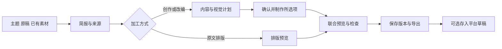

# baoyu-skills 与 AI 创作中心结合研究

日期：2026-09-12。草场源码基线：`7d5797756e3c0fb6df0e921637213eede384900e`。上游基线：[`JimLiu/baoyu-skills@1567581c`](https://github.com/JimLiu/baoyu-skills/commit/1567581c26ec29f4216c6e6835415bf30343b0e3)，该提交日期为 2026-09-10。

状态：研究与改造建议。本次核对了上游 21 个 skill 的能力说明，深读相关工作流、参考模板、图片供应商适配、Markdown 渲染、公众号草稿及 PPTX 导出实现，并对照当前前后端源码。未执行上游脚本、付费生成、账号接入或平台发布；未修改业务代码。文中“已有”指此基线的源码实现，不等于生产部署或实际出图质量已经验收。

## 1. 建议采用的方向

把 baoyu-skills 的内容策划、视觉计划和成品整理方法融入现有创作流程。用户应能带着已有资料开始，先看到可修改的内容方案，再按需要制作图片或视频，最后获得能直接使用的发布材料。

最值得先做的是一个完整的小红书／抖音图文场景：**导入或生成正文 → 推荐卡片方案 → 编辑逐页内容 → 确认封面与整组风格 → 制作图卡 → 保存与导出。** 接着把同一套视觉计划扩展到文章封面和正文配图，再接公众号排版及草稿箱。

四个判断决定本次方案：

1. **项目已经借鉴过这个仓库。** [图卡模板常量](../../src/constants/card-series-templates.ts#L1) 和[任务书 #54](../任务书/草场任务书-54-系列AI图卡.md#L1) 明确注明 baoyu-xhs-images 来源，已有 12 风格、8 布局、3 配色及 6 个场景预设。继续投入应集中在策划、视觉一致性、原稿加工与成品交付。
2. **上游主要提供 agent 操作流程与本地工具。** 一部分能力由模型按 `SKILL.md` 和参考文件完成，一部分调用 Bun／Node 脚本、图片 API 或本地 Chrome。安装到开发者的 skill 目录，不能自动让网页用户获得相应功能。
3. **现有基础足以承接。** 工作区、草稿版本、图卡身份、任务绑定、AI 执行、素材和交付契约已经存在。第一阶段只需要受控的创作模板配置与领域适配，不需要先建设通用 skill 市场或任意脚本执行平台。
4. **近期价值集中在图文。** 上游没有补齐草场视频剪辑、TTS、字幕、镜头任务、合成等完整管线；这些继续沿用现有视频生产与 #100 画布。漫画、PPT、X／微博发布等能力按新增业务需求另行评估。

## 2. 上游能力如何取舍

以下按当前仓库中的 21 个 skill 归类，优先级表示建议实施顺序。

| skill | 上游实际能力 | 对草场的用法 | 顺序 |
|---|---|---|---|
| `baoyu-xhs-images` | 分析内容、推荐叙事策略、拆页、逐页布局、参考图链与批量生成 | 升级现有图卡主流程 | 第一批 |
| `baoyu-cover-image` | 按主题、构图、配色、表现方式、文字量与情绪生成封面 | 封面作为文章／图卡／视频的交付项，复用现有图片生成 | 第一／二批 |
| `baoyu-article-illustrator` | 根据文章结构确定配图位置、目的、类型及统一风格 | 升级现有文章配图推荐，形成段落与图片绑定 | 第二批 |
| `baoyu-format-markdown` | 分析正文、整理标题摘要与 Markdown、修复中英文排版 | 拆为“编辑建议”和“仅排版”两类动作 | 第一／二批 |
| `baoyu-markdown-to-html` | Markdown 转带主题的 HTML、内联样式、引用及图表处理 | 公众号预览和可用 HTML 导出；评估其共享包 `baoyu-md` | 第二批 |
| `baoyu-compress-image` | 图片压缩、格式转换 | 融入导出处理，按目标渠道选择格式 | 第二批 |
| `baoyu-post-to-wechat` | API／浏览器公众号工作流；API 路径上传图片并写入草稿箱 | 首先提供“存入公众号草稿箱”，配合草场账号授权与状态回读 | 第二批后段 |
| `baoyu-infographic` | 信息结构化、布局与风格推荐、生成信息大图 | 对比图、流程图、活动说明、知识总结等内容子类型 | 第三批 |
| `baoyu-diagram` | 模型写 SVG，脚本转换 PNG | 需要准确节点与文字的知识图解；保留可编辑结构 | 第三批 |
| `baoyu-url-to-markdown` | `baoyu-fetch` 通过 Chrome CDP 和站点适配器采集网页 | 扩充资料导入；先支持粘贴／Markdown，再评估网页采集服务 | 第三批 |
| `baoyu-youtube-transcript` | YouTube 字幕、时间信息、封面提取 | 海外资料来源的可选扩展 | 按需求 |
| `baoyu-translate` | 术语表、分段翻译、审校润色 | 品牌术语统一与多语言改编 | 按需求 |
| `baoyu-image-gen` | 多供应商、参考图、画幅、批任务与模型差异适配 | 借鉴适配器契约，继续使用草场现有执行、密钥和计费体系 | 配套基础 |
| `baoyu-comic`、`baoyu-slide-deck` | 知识漫画；逐页生成图片并合并演示文件 | 后续知识创作扩展，暂不增加主导航 | 暂缓 |
| `baoyu-post-to-x`、`baoyu-post-to-weibo` | X／微博内容发布工作流 | 当前九平台范围之外，可参考连接器设计 | 暂缓 |
| `baoyu-danger-gemini-web`、`baoyu-danger-x-to-markdown` | 使用非官方 Web 接口与登录态 | 不纳入当前面向多用户的生产接入方案 | 不接入 |
| `baoyu-wechat-summary`、`baoyu-electron-extract` | 本地微信群摘要；Electron 安装包提取 | 与当前公开内容制作流程无直接关系 | 不接入 |

上游入口：[skill 目录](https://github.com/JimLiu/baoyu-skills/tree/1567581c26ec29f4216c6e6835415bf30343b0e3/skills)。能力依据以该提交的具体 skill 和脚本为准；README、skill 正文及 CHANGELOG 的部分数量和版本说明并不完全同步。

## 3. 当前代码已有基础与真实差距

### 3.1 已有能力继续复用

| 领域 | 当前证据 | 本次处理 |
|---|---|---|
| 平台与工作流 | [平台矩阵](../../src/config/ai-platform-capabilities.ts)、[AI 路由](../../src/ai/router.ts) | 保留九平台、既有路径及来源交接；模板不各建一个页面 |
| 来源、简报与交付 | [交接类型](../../src/types/ai-creation.ts)、[工作区与 Brief 类型](../../src/types/creation.ts) | 延伸 `processingMode/contentSubtype/sourceRefs/resultRefs/delivery` |
| 图卡计划及恢复 | [useCardSeries](../../src/composables/useCardSeries.ts)、[文章工作区](../../src/views/article/composables/useArticleWorkspace.ts) | 保留稳定 `cardId`、顺序、角色、成功结果和素材引用 |
| 图卡任务与操作记录 | [CardSeriesService](../../platform-java/services/intelligence-service/src/main/java/com/grassland/intelligence/cardseries/CardSeriesService.java) | 保留任务快照、执行记录、同请求回读和部分成功语义 |
| 写作风格配置 | [CreationStyleSkillCategory](../../platform-java/services/intelligence-service/src/main/java/com/grassland/intelligence/creationstyle/CreationStyleSkillCategory.java)、[启用校验](../../platform-java/services/intelligence-service/src/main/java/com/grassland/intelligence/creationstyle/CreationStyleSkillService.java) | 继续用于标题套路／体裁／文风，补足流程模板的独立语义 |
| 品牌要求 | [StoreBrandingPromptText](../../platform-java/services/intelligence-service/src/main/java/com/grassland/intelligence/creationcontext/StoreBrandingPromptText.java) | 延续已冻结的品牌语气、卖点和禁用表达，补视觉偏好 |
| 成品材料 | [DeliveryPanel](../../src/views/ai-center/components/DeliveryPanel.vue)、[CreationDraftExportService](../../platform-java/services/intelligence-service/src/main/java/com/grassland/intelligence/creationassistant/CreationDraftExportService.java) | 在已有字段与版本导出上增加实际发布文件 |
| 计划确认与应用 | [CanvasAgentPlanService](../../platform-java/services/intelligence-service/src/main/java/com/grassland/intelligence/creationcanvas/CanvasAgentPlanService.java) | 参考既有服务端计划、版本校验与幂等模式；保持视频领域边界 |

[9 月 7 日整合方案](ai-creation-center-integrated-upgrade-plan-2026-09-07.md)描述的是较早基线。现在可以在源码中看到图卡稳定身份、工作区序列化、任务快照绑定、操作记录及交付导出，不应再次把这些整项列为从零建设。

### 3.2 本次最应解决的六处差距

| 当前行为 | 对用户的影响 | 建议改变 |
|---|---|---|
| 图卡使用固定页数与一套计划，风格／布局主要靠用户选；每卡共用全局布局 | 用户先面对配置，不容易判断怎样表达内容更合适 | 按内容推荐一套方案，展示每页目的、布局和原文依据；可选比较其他叙事方案 |
| 图卡服务把首卡 `revisedPrompt` 当文字风格锚，构造图片命令时传入空参考图列表 | 整组人物、插画与色彩的一致性缺少实际视觉参考；供应商不返回 `revisedPrompt` 时锚更弱 | 首卡作为可追踪的参考图片传给支持对应能力的供应商 |
| `CreationBriefEditor` 已提供创作／改编／原文排版，但文章主流程仍调用标题、大纲、正文生成 | “我已有原稿，只想排版”仍缺少明确入口和执行分支 | 加入原稿输入，按加工方式调整步骤；仅排版不触发正文生成 |
| 文章配图提示词固定推荐 3–4 张，位置是“正文中间”等字符串 | 图片数量与解释需要未充分关联，正文改动后位置难维护 | 用段落 ID、配图目的、图形类型、来源事实和统一风格形成计划 |
| 图文导出服务当前仅接受 `bundle-manifest` | 已有机器可读清单和媒体下载链接，但还需要整理实际发布内容 | 追加正文 Markdown／TXT、公众号 HTML、按顺序命名的图片和可下载压缩包 |
| 当前“参考素材”入口只选抖音／B 站；矩阵把 `source=reference` 导向视频分析 | 不能直接把任意网页／文章 URL 接到这个来源选项 | 资料输入类型单独建模，保留任务／门店等来源语义，按材料类型分派解析 |

关键证据：

- [图卡策划提示词与风格锚](../../platform-java/services/intelligence-service/src/main/java/com/grassland/intelligence/cardseries/CardSeriesPrompts.java#L23)、[实际生图命令](../../platform-java/services/intelligence-service/src/main/java/com/grassland/intelligence/cardseries/CardSeriesService.java#L219)。
- [加工方式控件](../../src/components/CreationBriefEditor.vue#L11)、[模式约束](../../platform-java/services/intelligence-service/src/main/java/com/grassland/intelligence/creationcontext/CreationBriefInput.java#L109)、[当前文章生成调用](../../src/composables/useArticleCreation.ts#L280)。在所查文章主路径中，模式主要随 Brief 透传，未见独立的原稿导入与确定性排版分支。
- [文章配图推荐契约](../../platform-java/services/intelligence-service/src/main/java/com/grassland/intelligence/articleimage/ArticleImagePrompts.java#L11)、[位置模型](../../platform-java/services/intelligence-service/src/main/java/com/grassland/intelligence/articleimage/ImagePlacement.java)。
- [导出格式白名单](../../platform-java/services/intelligence-service/src/main/java/com/grassland/intelligence/creationassistant/CreationDraftExportService.java#L32)、[参考来源分派](../../src/config/ai-platform-capabilities.ts#L157)。

另外，图卡代码有旧注释仍描述“前端 canvas 叠字”，实际 [cardPrompt](../../platform-java/services/intelligence-service/src/main/java/com/grassland/intelligence/cardseries/CardSeriesPrompts.java) 与下载逻辑已采用字图一体。这次方案按实际实现及既有决策设计，不恢复旧默认。

## 4. 面向用户的流程设计

### 4.1 用创作目标组织入口

保留平台选择与最近项目，在“开始创作”中提供少量场景预设，例如：

- 做一组知识／攻略图卡。
- 用实拍图片写体验分享。
- 给现有文章制作封面和配图。
- 把原稿整理成公众号文章。
- 用已有脚本或视频继续制作。

这些预设只负责预填既有平台、形式、内容子类型和加工方式；图卡继续进入文章视图内的子流程，保持 #54 已确定的内嵌方式。快捷入口不能改掉工作台带入的任务平台或门店上下文。

资料输入独立于创作来源：同一个任务可以上传原稿，也可以使用门店素材；同一个独立项目可以从主题、Markdown 或图片开始。第一阶段实现粘贴正文／Markdown／已有素材引用，后续再支持通用 URL 获取。

### 4.2 根据用户已有内容减少步骤

| 情况 | 推荐步骤 | 需要调用 AI 的部分 |
|---|---|---|
| 只有主题或真实资料 | 简报 → 内容方案 → 写作 → 图片制作 → 交付 | 内容策划、写作、按需生图 |
| 已有文章，希望改成图卡 | 导入原稿 → 图卡方案 → 逐页编辑 → 生图 → 交付 | 原稿改编／拆卡、按需生图 |
| 已有定稿，只想公众号排版 | 导入原稿 → 选排版 → 预览 → 导出 | 基础排版无需 AI；生成摘要／补图作为单独动作 |
| 已有文章，只缺配图 | 导入原稿 → 配图计划 → 制作或选素材 → 联合预览 | 配图策划、按需生图 |
| 已有完整图片，只缺配文 | 排序选封面 → 编辑／生成配文 → 交付 | 用户选择生成配文时调用 |

“原文排版”需保留文字、数字、名称与顺序。自动改标题、增加摘要、缩写成长图卡属于额外编辑，应单独显示并允许确认。上游 format-markdown 的完整工作流会生成标题、摘要和结构建议，不能把整个流程直接当成草场的无改写排版。

### 4.3 一次计划确认承接多个制作动作

计划中展示：内容结构、所需图片、采用的素材、视觉预览或说明、预计调用数量和费用依据。默认给一套推荐方案；“比较方案”再生成其他候选。用户调整页数、布局、素材或文字后，确认本次制作范围。

沿用现有草稿自动保存。保留结果的操作——改图片顺序、改发布描述、选择已生成封面、再次下载——不重新调用模型。点击“重做第 3 张”只生成这一张，同时保留上一版用于比较。

## 5. 最值得借鉴的具体实现

### 5.1 图卡：从拆段落提升到逐页策划

[baoyu-xhs-images](https://github.com/JimLiu/baoyu-skills/blob/1567581c26ec29f4216c6e6835415bf30343b0e3/skills/baoyu-xhs-images/SKILL.md)把内容分析、叙事策略、逐页结构和出图分开。它的三种结构可转成草场可理解的选项：

| 策略 | 草场适用场景 | 输入约束 |
|---|---|---|
| 故事体验 | 有真实经历的体验分享、过程复盘 | 有用户确认的经历；商家资料不转写为作者亲历 |
| 信息清单 | 攻略、教程、对比、避坑说明 | 每项能定位到原文或确认事实 |
| 视觉展示 | 商品、环境、活动、生活场景展示 | 优先使用获授权的实拍素材；生成图保持相应内容声明 |

每页计划增加 `purpose`、`sourceBlockIds`、`layoutId` 和关键文字，保留已有 `cardId/position/role/title/bullets/illustration/caption`。封面、内容页、总结页可选择不同布局，整组共享视觉风格。

当前最多 9 张卡，先保持该能力范围。上游支持 1–10 张不构成直接放宽草场前后端限制的理由。当前拆卡会截取前 8000 字；新的原稿导入必须完整保存来源，对超长输入分段或明确提示，不能沿用静默截断作为原稿处理逻辑。

上游内容分析中有“首图决定 90% 互动”等经验性表述，也有“99% 的人不知道”等标题示例。这些不是草场的效果数据或可直接采用的事实。保留结构化分析方法，删去未经证实的数字、夸大收益及不适用的身份暗示。

### 5.2 图卡一致性：先补真实参考图能力，再调整并发

上游先生成封面，再将封面作为后续图片的 `ref`，后续页可以批量生成。草场当前 `CardSeriesService.generateCard()` 给 `GenerateCommand` 的参考图为 `List.of()`，主要依赖 `revisedPrompt` 文字锚。

更关键的是，当前 [ImageGenerationClient](../../platform-java/services/intelligence-service/src/main/java/com/grassland/intelligence/articleimage/ImageGenerationClient.java#L42) 对普通 OpenAI 兼容端点不直传参考图片；MiniMax 使用 `subject_reference`，语义是人物参考。**不能仅增加 `anchorMediaId` 字段，就宣称所有模型都支持整组视觉一致性。**

实施顺序：

1. 为供应商适配记录实际能力，区分图片编辑／通用参考、人物参考、支持尺寸及参考数量。先为已配置且验证可用的模型实现所需接口。
2. 保持首图与后续页的依赖关系。首图生成并保存为有效素材引用后，记录 `anchorMediaId`、计划版本、模型和风格版本。
3. 后续页通过服务端验证过的媒体引用加载参考图，不让前端提交任意本地路径或外部图片地址。
4. 模型不支持时，在执行前说明可用方式；明确采用文字风格约束时，按这一能力展示，避免虚假承诺。任务模式继续服从冻结模型配置。
5. 最后才考虑后续页的有限并发。并发数量按供应商限流、任务预算和服务容量决定，不直接复制上游默认批量数。

首图失败时后续页等待或终止该组；重做封面形成新版本，旧图保留。切换参考图后，由用户选择是否重做其余页。网络结果未知时先回读原操作；用户要求新的生成才建立新的计费操作。

草场现有三档图片尺寸与上游 `3:4`、`2.35:1` 等要求也不同。要区分目标画幅和供应商实际输出尺寸，提供裁切预览与内容安全区；改标签或在 prompt 写比例不能替代实际尺寸处理。

### 5.3 封面与正文配图：共享视觉计划，分别表达用途

[cover-image](https://github.com/JimLiu/baoyu-skills/blob/1567581c26ec29f4216c6e6835415bf30343b0e3/skills/baoyu-cover-image/SKILL.md)提供封面维度，[article-illustrator](https://github.com/JimLiu/baoyu-skills/blob/1567581c26ec29f4216c6e6835415bf30343b0e3/skills/baoyu-article-illustrator/SKILL.md)强调“哪里需要图、为什么需要、图表达什么”。

在现有 `ArticleImageSlots` 中增加：

- 稳定段落引用和插图目的，例如“解释第三节的三步操作”。
- 类型选择：实拍素材、场景插画、对比图、流程图、数据图。
- 统一风格与配色，支持同一门店／项目沿用已选偏好。
- 每图的关键文字及来源事实；正文变化后提示哪些配图计划需要重新核对。
- 封面单独记录标题、安全区与目标渠道画幅，并能回到联合预览中修改。

第一阶段不把封面的所有维度都做成必填项。系统推荐一组，展开后才调整。现有视频工坊封面工具可复用相关预设与生成适配，无需再新增一套封面页面。

### 5.4 知识图：按交付要求选择表达方式

[infographic](https://github.com/JimLiu/baoyu-skills/blob/1567581c26ec29f4216c6e6835415bf30343b0e3/skills/baoyu-infographic/SKILL.md)适合视觉化总结，[diagram](https://github.com/JimLiu/baoyu-skills/blob/1567581c26ec29f4216c6e6835415bf30343b0e3/skills/baoyu-diagram/SKILL.md)提供可保存的 SVG 结构，两者不要视为同一渲染能力。

现有字图一体图卡继续保留。对价目表、日期、参数、精确关系图等需求，可在后续增加独立的结构化排版方式，保留文本／节点源数据再导出。该分支需单独验证样稿和编辑能力，不在现有生成图上用覆盖文字的方式假装完成修复。

生成图内的关键数字、名称、日期仍需与原文核对。OCR 可以辅助发现问题，但不能将“识别成功”当作整张图正确的证明。

### 5.5 公众号：先交付好文章，再连接草稿箱

推荐分两步实施：

**先完成排版与导出。** 评估 [baoyu-md](https://github.com/JimLiu/baoyu-skills/tree/1567581c26ec29f4216c6e6835415bf30343b0e3/packages/baoyu-md)的 Markdown、图片与内联样式转换。在现有交付面板提供公众号预览、HTML、Markdown／纯文本和图片文件。正文与摘要分别存储，切换模板不改写正文。图表渲染失败应显示缺项，不能仅因为转换脚本返回成功就标记交付完成。

**再连接草稿箱。** [wechat-api.ts](https://github.com/JimLiu/baoyu-skills/blob/1567581c26ec29f4216c6e6835415bf30343b0e3/skills/baoyu-post-to-wechat/scripts/wechat-api.ts#L74)使用图片上传、永久素材和 `draft/add`。保存返回的是草稿 `media_id`，不构成公开发布完成。

草场应新增独立的渠道交付记录，关联草稿版本、目标账号、内容摘要、渠道草稿 ID 与同步状态。按钮命名为“存入公众号草稿箱”；确认目标账号和预览版本后执行。重复请求先查本地操作与渠道结果，网络超时保留“结果待确认”，不盲目重复新建草稿。公开发布及发布状态回读在后续渠道能力中实现。

上游有个人多账号和 `.env` 配置，但这不等同于草场的多租户授权。生产接入应走服务端凭据管理、账号归属、适用的官方授权方式与出口配置。具体账号权限、接口限制和发布能力需在集成阶段以官方资料及实测核对；本次只确认上游调用的实际接口与当前草场尚未出现该连接器。

### 5.6 来源导入和一稿多用

第一步可先让用户粘贴原文、上传 Markdown、选择已有素材，马上改善“已有内容继续加工”。后续再参考 [url-to-markdown](https://github.com/JimLiu/baoyu-skills/blob/1567581c26ec29f4216c6e6835415bf30343b0e3/skills/baoyu-url-to-markdown/SKILL.md)的来源保存、正文提取和失败识别。

来源记录沿用 `CreationBrief.sourceRefs`，补充正文文档引用、获取时间、内容摘要与稳定段落 ID。抓取失败、登录页或验证码页不进入写作上下文；允许改为手工粘贴。网页正文作为资料处理，不能变成执行指令。服务化采集还需限制网络目标、重定向和资源大小，并使用独立浏览器环境。

同一原稿生成小红书、公众号、朋友圈版本时，共享来源文档和已授权素材，各版本保留独立的正文、布局、平台检查和运行记录。任务项目已经冻结的平台保持不变；跨平台复用另建适用的创作版本，并重新校验素材权限。

## 6. 技术接法

### 6.1 接入方式选择

| 方式 | 适合用途 | 建议 |
|---|---|---|
| 开发环境安装少量 skill | 手工探索、制作参考样稿、迭代提示词 | 可用于研发验证，不作为网页功能实现 |
| 提炼模板／契约，接入现有领域服务；确定性工具按需封装 | 现有用户工作流、计费、恢复与交付 | 推荐作为生产接法 |
| 后端直接启动通用 agent 执行任意 `SKILL.md`／CLI | 实验性内部工作台 | 近期不采用；需另行解决进程、权限、交互、运行恢复和成本隔离 |

采用第二种方式时，把上游的操作说明转换为服务端可验证的数据和动作：

| 上游组织方式 | 草场对应物 |
|---|---|
| `SKILL.md` 的步骤 | 版本化创作模板定义与领域步骤 |
| `references/` 的风格、布局、示例 | 受控的提示词资源与视觉预设 |
| `EXTEND.md` | 用户／门店／项目的结构化偏好；任务约束优先 |
| `analysis.md`、`outline.md` | 草稿版本内的内容分析与视觉计划 |
| `prompts/*.md` | 服务端保存的提示词版本与运行输入记录 |
| 输出目录中的图片与文档 | 既有媒体引用、素材库、`resultRefs` 和导出产物 |
| 本地 Cookie／`.env` | 对应渠道的服务端授权与凭据管理 |

### 6.2 第一阶段最小契约

以下是拟新增设计，不是当前已存在的接口或类型。

| 对象 | 最小信息 | 存放及兼容策略 |
|---|---|---|
| 创作模板定义 | `id/version`、适用平台／形式／加工方式、输入约束、步骤、结果种类、所需模型能力 | 可从 `contracts/creation-recipes.v1.json` 起步；内部 prompt 放服务端资源，按选中模板读取 |
| 来源文档引用 | 文档 ID、输入类型、内容摘要、来源引用、段落 ID | 正文入服务端文档／素材存储；工作区保存引用，继续保留 `sourceRefs` |
| 视觉计划 | 计划版本、来源摘要、模板版本、策略、共享风格、逐项内容与段落关系 | 扩展 `workspace.inputs` 和现有卡片模型，保持旧草稿可读 |
| 制作项 | 现有卡片／图片 ID、版本、角色、参考素材 ID、运行 ID、产物引用及状态 | 沿用图卡操作与 `ai_run`；不新建并行的运行历史体系 |
| 渠道交付记录 | 草稿及版本、账号、内容摘要、外部 ID、同步状态、最近错误 | 独立于 `CreationProjectStatus`；初期只做公众号草稿同步 |

来源或正文修改后，比较内容摘要与计划基线，标记需要重新确认的制作项。保存旧计划和旧产物，避免把新正文与旧图片组合成一个不明版本的成品。

现有 `CreationStyleSkill` 只有标题套路、体裁、文风三类；多步骤模板应独立定义并引用这些风格。图卡现有本地 style ID 也不能直接替换为上游 ID，要保留旧值并建立显式映射。

先以固定、可测试的模板配置实现；确有运营维护需求时，再扩展现有管理配置。不要在第一批要求用户编写 `SKILL.md`、手工填模板版本或理解底层供应商参数。

### 6.3 执行、费用与恢复

- AI 调用继续经过现有 `FrozenTextExecutionService`、`IndependentImageGenerationService`、`TaskImageGenerationService`，保留 BYOK、预算、任务冻结和运行追踪。
- 将模板版本、上游来源版本、输入摘要、关键素材引用记录进生成输入／来源记录，以便比较提示词调整的效果。
- 同一操作重试沿用请求标识；请求内容变化产生新操作。针对已成功项的查看、排序和下载不触发新计费。
- 排版、压缩、裁切、文件打包是确定性处理；重新分析或生成才走 AI 计费。增加供应商调用前，先显示可解释的费用估算与范围。
- 只有在首图依赖已完成的前提下，才并发后续项。部分失败保留成功素材和可恢复的状态。
- 签名下载地址临时生成，工作区仍保存稳定媒体 ID。长期恢复不能依赖上游脚本的本地文件路径或临时 URL。

### 6.4 代码改动落点

| 改动 | 推荐位置 |
|---|---|
| 场景预设、材料输入、模板选择 | `src/views/ai-center/components/` 与 `creation/`；中心视图只装配 |
| 原稿导入、按加工方式跳步骤 | `src/views/article/components/`、文章域 composable 及工作区适配 |
| 图卡策略、逐页布局、计划编辑 | 现有 `CardSeriesPanel.vue`、`useCardSeries.ts`；增长的逻辑拆成域模块 |
| 服务端卡片计划及参考图链 | `intelligence/cardseries/` 与 `articleimage/` |
| 智能配图与段落绑定 | `ArticleImageSlots.vue`、`articleimage/ArticleImagePrompts.java`、`ImagePlacement` |
| 品牌视觉偏好与模板版本 | `creationcontext/`，必要时增加小型 `creationrecipe/` 模块 |
| HTML／文本／图片打包导出 | 现有 `creationassistant/CreationDraftExportService` 与 `DeliveryPanel`；按运行时需要封装独立渲染 worker |
| 公众号草稿连接器 | 新增独立渠道适配模块，通过既有交付契约读指定版本 |

`baoyu-md` 和 `baoyu-fetch` 声明 Bun 运行时，并涉及文件、CSS 和浏览器依赖。应先验证部署环境，再选取纯函数复用或独立 worker；不能直接将整个本地 CLI 塞进 Vue bundle，或假定 Java 服务可原样调用。没有必要为了模板推荐而引入浏览器进程。

遵循根 [AGENTS.md](../../AGENTS.md) 与 [DESIGN.md](../../DESIGN.md)：新区域拆子组件，URL 状态和取数归 composable，维持 SFC 行数限制；UI 复用现有 token、双主题和 Space Grotesk／Inter。上游 diagram 中的 Google Fonts 导入及固定深色样式不能原样进入产品。内容素材的品牌配色作为创作数据管理，和应用界面的设计 token 分开存放。

## 7. 分批执行与验收

### 第一批：完成一条可用的图卡创作流程

| 工作项 | 交付物 | 完成条件 |
|---|---|---|
| A1 原稿输入与流程分派 | 粘贴正文／Markdown、素材引用、按 create/adapt/format 进入步骤 | 已有原稿可以直接加工；仅排版不会生成新标题／大纲／正文；刷新保留来源 |
| A2 推荐式图卡策划 | 一套默认推荐、可选策略比较、逐页目的／布局／来源 | 用户可调整整套计划，旧图卡 ID、旧预设和旧草稿仍可用 |
| A3 模型能力与视觉参考 | 至少一种验证通过的实际参考图路径；明确其他模型能力 | 首图及后续图形成有版本的参考关系；不支持的模型不会静默丢弃参考图 |
| A4 成品交付加固 | 正文、发布文案、有序图卡、素材引用、实际文件导出 | 部分失败可恢复；重试不影响成功项；导出后能直接核对并使用 |

优先验证“小红书攻略图卡”与“抖音图集”两个现有平台分支。第一批不要求新的 skill 管理后台，也不等待公众号账号授权。

### 第二批：文章视觉与公众号交付

| 工作项 | 交付物 | 完成条件 |
|---|---|---|
| B1 文章视觉计划 | 封面＋正文插图，段落绑定和共享风格 | 修改正文后能定位受影响配图，现有图片可替换和复用 |
| B2 可用排版文件 | 公众号 HTML、Markdown／TXT、媒体处理与预览 | 标题、摘要、正文、引用和图片一致；基础排版不额外调用 AI |
| B3 公众号草稿箱 | 账号选择、预览确认、版本绑定、同步记录 | 在具备所需权限的账号完成真实草稿写入和回读；超时不重复发布；状态准确 |

### 第三批及后续

在前两批成品质量稳定后，再做知识信息图、可编辑图解、通用网页资料导入、品牌模板复用及关联的多平台版本。翻译、漫画、PPT、YouTube 与 X／微博扩展按业务量决定。

PPT 特别注意：[merge-to-pptx.ts](https://github.com/JimLiu/baoyu-skills/blob/1567581c26ec29f4216c6e6835415bf30343b0e3/skills/baoyu-slide-deck/scripts/merge-to-pptx.ts#L78)通过 `addImage()` 把整页图片放入幻灯片，并将 prompt 放进备注。它能导出 PPTX 文件，但这不意味着页面中的文字和图表可逐项编辑。

## 8. 验证方式与效果衡量

本次没有实际出图对比，以下为建议的实施验收，不是已经取得的测试结果。

先准备一组真实、可用且去除敏感信息的样稿，覆盖实拍体验、步骤教程、含数字的对比内容、公众号长文。在同一模型和相同来源下比较当前流程与新流程，记录：方案被采用比例、单份合格成品成本、重做次数、完成耗时与恢复成功率。视觉一致性和内容可读性由人工看成品，不只看 prompt 或生成接口状态。

| 验收场景 | 必须观察到的行为 |
|---|---|
| 原稿只排版 | 数字、专有名词、句子与顺序保留；额外标题／摘要编辑单独显示 |
| 来源不足 | 不生成虚构消费经历、作者资历、优惠金额、日期或统计数据 |
| 超长原稿 | 完整来源可恢复；超出模型处理容量时分段或明确提示 |
| 图卡单页重做 | 卡片身份和角色不变，成功页保留，新旧版本可比较 |
| 首图失败／更换首图 | 后续依赖明确；更换首图不会自动引发整组付费重做 |
| 不支持参考图的模型 | 生成前发现并显示能力限制，任务冻结配置保持有效 |
| 正文修改、计划过期 | 提示重新核对受影响项目，不将旧图隐式当成新正文的配图 |
| 重复点击、网络断开 | 同请求回读、不重复扣费；结果未知有独立提示 |
| 任务与素材权限 | 外部模板、导入材料和跨平台版本都不能绕过归属及快照校验 |
| 导出与恢复 | 指定版本一致，过期链接可重取，缺失媒体明确标记 |
| 公众号同步 | 草稿箱确实存在对应版本；成功显示“已存草稿”，不显示“已发布” |
| UI | 明暗两主题、移动端、键盘焦点及加载／空／错／提交中状态均核验并留截图 |

使用现有前后端测试与 E2E 覆盖这些跨层行为。只增加能防止业务回归的用例，模板颜色等低影响配置不另造一套镜像测试。网页或发布连接器还要验证正文提取、HTML／SVG 输出清理及资源访问限制。

## 9. 版本、许可与本次研究边界

- 上游根目录为 [MIT](https://github.com/JimLiu/baoyu-skills/blob/1567581c26ec29f4216c6e6835415bf30343b0e3/LICENSE)，允许按许可条件使用和修改。实际复制较完整的模板或代码时，保留版权与许可声明并记录修改；现有本地化模板的来源注释继续保留。
- [`baoyu-md/src/LICENSE`](https://github.com/JimLiu/baoyu-skills/blob/1567581c26ec29f4216c6e6835415bf30343b0e3/packages/baoyu-md/src/LICENSE)另外声明其 doocs/md 衍生代码的 WTFPL 来源。共享包、第三方代码与素材按各自声明处理，不能笼统认为所有内容只有根 MIT 一种来源。
- 按审核过的提交／依赖版本引入，记录来源和样稿结果；上游更新先比较模板、接口、依赖及输出，再升级。运行时不自动拉取并执行最新 `SKILL.md`。
- 上游的批次数、字体、默认风格、图片尺寸、个人目录、交互确认和账号方式都是其运行环境的选择，需转换成草场的产品及服务契约。
- 本次依据 GitHub 固定提交与本地源码作判断。未验证实际供应商出图质量、公众号账号权限、登录态采集成功率、生产启用情况或前端运行中的视觉效果。

建议后续开发以第一批 A1–A4 为首个完整交付，再按第二批扩展。这样既能补齐现有图文流程的操作缺口，也能复用这次引入的策划、版本和交付能力。
