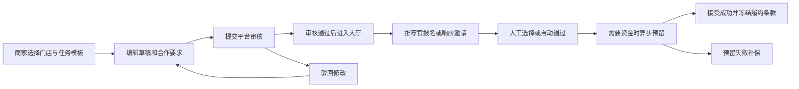
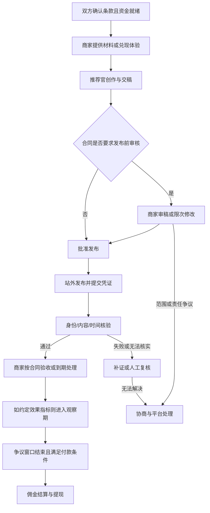
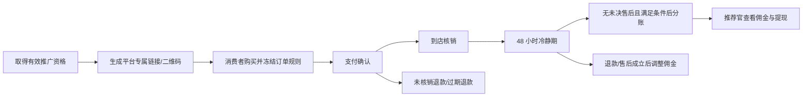

# 商家推广任务与推荐官接单：现状审查及业务改进方案

> 日期：2026-09-07。
> 基线：`main`，HEAD `851f06912c56ca3d4078c0c0cd44127eda491838`，以及读取时的未提交改动，包含任务书 #90 的实现。
> 性质：业务审查与产品设计建议。本文新增的时限、补偿、归因和运营规则均为建议，不代表已实施或已生效。
> 方法：检查当前 Vue/Java 源码、PRD、ADR 和相关任务书；通过 agent-reach 的 Exa/GitHub 路由研究，网页读取超时后用浏览器核对官方原文。未运行业务测试，未操作线上数据库或真实支付，不能据此认定生产链路已验收。

## 1. 核心判断

现有业务主干合理，已经具备任务撮合、版本快照、资金预留、凭证、核验、限次补证、超时确认、争议与退款等基础。主要问题在于不同商业模式沿用了部分相同的履约和统计口径，真实合作中的责任与退出规则又没有完全建模。

建议保留现有三种合作模板，底层收敛为两条明确的业务流程：

1. **内容合作**：固定报酬或阶梯报酬购买约定交付；体验换内容也走此流程，但另外记录商家是否实际提供了体验。
2. **套餐推广**：推荐官取得推广资格，消费者订单产生佣金；资格有效、订单结算和提现分别管理。

优先修正资金规则和声誉统计，再补齐履约期限与双方退出规则。功能扩展应围绕商家能判断投入产出、推荐官能判断承诺和收益展开。

## 2. 优先处理的问题

下表中的“代码事实”仅指本次读取的工作区。`P0` 表示真实资金或扩大交易前应解决，`P1` 表示主业务体验与公平性应优先补齐，`P2` 表示规模化阶段优化。

| 优先级 | 当前证据与问题 | 实际影响 | 建议 |
|---|---|---|---|
| P0 | 消费者的归因修改入口接收推荐官 ID 和分成比例；服务端仅检查订单属于本人、订单状态和分配总额，随后直接重算推荐官与商家金额。没有复用下单时的接单资格、自购排除和固定佣金规则。见 C01。 | 买家可以改变商家应收；“人工纠错”实际开放给买家，并可能绕开任务原定报酬。 | 买家只提交归因申诉；有权限的运营审核证据后纠错。佣金由冻结的订单规则计算，任何客户端都不能提交最终分成比例。 |
| P0 | 内容确认只阻断核验 `failed`，无核验记录或 `inconclusive` 可通过；自动确认先写确认，再由结算层阻断失败核验。阶梯金额来自商家申报指标。见 C02。 | “没有反对”“链接可达”“实际达标”被混用；可能在未证实交付时结算，或先显示已确认再陷入暂扣。 | 区分交付完整性、真实性核验、商家验收、效果观察和付款资格。自动通过必须具有相应证据与合同依据；无法核验进入有 SLA 的人工复核。 |
| P1 | 接受后缺少通用放弃/解约入口；撤回仅限 `pending/reconsent`。有发布起止字段，但本次检查未见接受后交付超时终结、补交期限和占用名额释放的完整规则。见 C03。 | 推荐官接了不做，名额和预留款可能长期占用；商家失联或推荐官临时有事缺少合理出口。 | 建立合作到期、延期、退出和责任认定；每个等待状态都有责任方、截止时间、提醒和超时动作。 |
| P1 | 商家取消时，已接受且没有任何 submission 的履约全额退回资金；此时还没有可记录脚本、拍摄进度的正式里程碑。见 C04。 | 已经沟通、到店、拍摄的推荐官可能拿不到补偿；平台无法区分“尚未开工”和“已经投入”。 | 增加可举证的履约阶段，按阶段结算已完成工作及约定取消补偿，不以“有没有公开发布链接”判断是否劳动。 |
| P1 | 声誉完成率分母包含所有 `accepted/refunded`，仅扣除商家取消；分子取 `confirmed_at`。套餐推广无需内容确认，却同样产生 accepted 报名。见 C05。 | 新接正常任务也会暂时降低完成率；持续推广套餐可能永远增加分母、不增加分子。 | 内容履约和分销绩效分开统计；进行中、未到期的合作不进入失败率分母，免责取消继续排除。 |
| P1 | 体验任务主要由押金字段表达，缺少独立的预约、到店/收样、实际权益兑现及商家失约事实。ADR 也记载无历史收益的新推荐官可能无钱交押金。见 C06。 | 商家没提供体验却要求交内容、用户未消费却被认定失败，都难处理；冷启动接单受钱包余额限制。 | 补体验权益单和兑现记录；押金只覆盖约定且可举证的损失，首轮试点可采用有限名额、低风险免押任务。 |
| P1 | 当前“末次点击”依据是下单请求携带的推荐官参数；不是完整的点击记录、跨访问归因窗口和优先级模型。新订单佣金读取下单时套餐版本。见 C07。 | 用户换入口、跨设备、套餐改佣或推广结束时，推荐官容易认为“带来的订单没算我”。 | 当前明确称为“下单链接归因”；逐步增加服务端推广链接和触达凭据，显式说明有效期、优先级与佣金生效版本。 |
| P1 | 产品提供付费点赞/收藏/关注/评论动作。见 C08；YouTube 的官方政策明确将唯一目的为经济收益的互动视为非法互动。 | 可完成截图要求，却损害商家和推荐官的站外账号，形成刷量导向。 | 停止把付费互动作为默认供给；转向真实内容交付、体验反馈和有效成交，逐平台校验允许的商业合作形式。 |
| P2 | 画像的粉丝数为自报；等级较多依赖累计完成数和单方商家评分。见 C09。 | 自报规模容易被当成已验证影响力，新人缺少机会，商家评分可能对推荐官形成单方约束。 | 显示数据来源与时间；匹配使用垂类、城市、作品和履约事实；商家也展示取消、确认时效和投诉结果。 |

还有两项规则一致性需要纳入验收：

- PRD 当前核销冷静期为 **48 小时**，`CommerceService` 默认也是 48 小时；部分旧 HLD/ADR 文本仍写 24 小时，不能继续当作当前事实。见 C10。
- 赏金结算计时按等级的 T+N，Lv5 默认 T+1；既有 D06 又要求不早于 48 小时争议窗口。本次读取的 `SettlementWindowPolicy` 只按 N 天计算。应统一为合同冻结的可支付时间，并核对争议窗口起算点，不能单独用等级缩短资金保护期。开发配置的商家确认窗口默认 5 秒，生产需明确覆盖并校验。见 C11。

## 3. 当前业务的真实链路

### 3.1 商家与推荐官准入

- 注册默认成为推荐官；商家由治理台初始化，经营权限按组织/门店范围授予。
- 商家有草稿、基础发布和资金交易等准入层级；内容与资金相关操作有不同权限。
- 推荐官填写城市、领域标签、社交账号和作品；平台履约事实计算声誉与等级。
- 任务按最低等级控制可见/报名，商家可人工筛选、批量接受或设置最低等级自动通过，也能邀请推荐官。

**评价**：准入分级、资源权限和邀请机制可以保留。实名认证、社交账号归属验证、履约信用和粉丝影响力应分别展示，它们证明的事情不同。

### 3.2 发布与招募



任务包含门店、平台、内容形式、描述、必须/禁止内容、指标及凭证要求、发布起止时间、报名截止、名额、等级和报酬方式。

已有任务版本、乐观锁、接受时快照、名额并发控制。任务书 #90 的当前改动进一步增加了修订后重新确认条款、取消报名终态化、固定系统身份、资金核对和后端动作集合。这些应作为本方案的基础继续验收，不重复建新模块。

**仍需明确**：报名截止、商家选人截止和交付截止是三个时间。当前关闭/截止会限制接受待处理报名，若商家习惯“招募结束后统一选人”，需要新增选择期，不能只改一个按钮名称。

### 3.3 三种报酬模式

| 现有模式 | 谁出钱/权益 | 什么事实产生权益 | 当前结算方式 |
|---|---|---|---|
| 任务量佣金 | 商家预留赏金；阶梯按最高需要金额预留 | 提交内容凭证、确认及相应指标 | 固定或最高达成档位；差额退商家；等级加成来自平台补贴 |
| 霸王餐/实物兑换 | 商家提供体验；推荐官从钱包预付押金 | 内容履约达标；失败按责任处理 | 达标退推荐官押金；有责未达标按规则补偿商家 |
| 套餐推广 | 消费者支付套餐款 | 有效归因的订单完成核销 | 核销后 48 小时冷静期，满足条件再三方分账；自购不计佣金 |

创建/修订的报酬方式是三选一。代码保留历史组合任务的双资金处理能力，并不表示当前产品仍允许新建组合任务。以当前 PRD 和 `TaskCatalogFundingRules` 为准。

### 3.4 内容履约与争议

接受成功后，可从冻结任务上下文进入 AI 创作，站外发布，再提交链接和附件。每次只有一份待处理提交，退回后可重交，默认补证上限为两次。已有确认窗口、到期提醒、自动确认、争议暂扣和对账。

争议已有客服直裁及小法庭两条通道，涉及举证、投票、上诉和终局资金处理。基础设施已经较重，下一步应优先减少因规则不清造成的争议，而不是继续增加裁判层级。

套餐推广已明确跳过内容凭证/确认流程。#90 正在落实“关闭招募不终止既有推广”，另以结束推广、取消或套餐下架控制新归因。这一分离方向合理，但普通任务列表、推广状态及收益统计还应统一口径。

## 4. 外部研究：哪些值得借鉴

以下只列与本项目直接相关的机制；竞品规则不自动成为草场规则。官方文档证明其公开规则，开源代码证明可观察的实现，论坛帖子只证明社区规则或个体反馈。

| 来源 | 本次核对的事实 | 对草场的启示 | 使用边界 |
|---|---|---|---|
| 巨量星图《结算管理规则》，页面更新 2026-06-02 | 指派、投稿、招募等任务验收条件不同；部分指派任务发布 7 天未验收视为验收；费用以约定任务页面为准。S01 | 按合作类型设计验收，不把每一种业务都强塞进商家确认；明确超时和收益条件。 | 不照搬其所有费率或 7 天窗口。 |
| 巨量星图《任务取消规则》，页面更新 2025-12-26 | 取消可用性与任务类型、执行阶段相关；短视频/图文在上传脚本、上传成品和确认等阶段采用不同赔付。S02 | 补偿必须依赖可记录的工作阶段；保护已投入的创作成本。 | 其 10%/50%/100% 等具体档位只作为规则结构参考。 |
| 有赞《分销员佣金结算规则》，页面日期 2024-09-09 | 以实际成交额计算，退款部分不计佣；提供交易完成结算和售后期后结算，并明确过早结算导致追回困难。S03 | 佣金区分预估、待结算、已结算；退款反向处理和暂存期属于主流程。 | 有赞该文的部分结算后退款依赖线下协商；草场已有账本冲正，应保留自身优势。 |
| 小红书蒲公英帮助中心 | 检索到官方关于信用等级、资金托管和异常赔付的说明。S04 | 用信用、规则和资金保障合作，而非只提供创作者名单。 | 本次只取得检索索引，未以此确认具体费率、改稿次数或审核时限。 |
| GitHub `dubinc/dub` | Commission 与 Payout 分表；佣金有 pending/hold/refunded/fraud 等状态，事件与发票有去重约束；存在重复身份/收款方式相关暂扣代码。S05 | 订单事实、佣金认定和真实付款分离；反作弊应能暂扣并留下可审计原因。 | 参考模型与约束，不据仓库热度断言实际反作弊效果；不直接替换本仓库资金系统。 |
| GitHub `soldatov-ss/django-referral-system` | Referral 保存创建时佣金比例，PromoterCommission 与 PromoterPayout 独立。S06 | 历史规则快照、佣金与提现对象分离适用于草场。 | 小型库作为模型参考，不能替代现有财务对账。 |
| GitHub `amicalhq/refref` | README 提供推荐归因、推广门户、人工/自动奖励批准等方向，并明确仍处于 alpha。S07 | 推广官应有专门的链接、素材和收益工作区。 | 不把 README 宣称当作成熟性保证。 |
| LinuxDo 站方公告《秘密花园园丁邀请函》 | 原文禁止公开 AFF，管理方集中帖存在例外；对 AI 生成/润色文字、自动发帖和不认真适配的自荐内容有明确限制。S08 | 渠道规则是任务可发布的前提；AI 内容不能被一键复制到所有论坛。 | LinuxDo 是此次研究样本，不能被推断为可直接开展批量推广的渠道。 |
| LinuxDo《高级推广有多高级？》讨论 | 帖子讨论推广资格、实际流量与售后响应之间的区别。S09 | 把“可接任务/可发布”与“效果保证”分开，商家响应与售后能力应进入信任展示。 | 个别回复与金额不是行业平均或正式政策依据。 |
| YouTube《虚假互动》政策 | 人为增加指标、唯一目的为经济收益的互动受到禁止；正常鼓励观众自然点赞被区别对待。S10 | 付费内容合作与购买互动数据应在产品层区分。 | 此规则直接证明 YouTube 的边界，其他平台需各自验证，不能外推为完全相同。 |

## 5. 建议的产品结构

### 5.1 面向用户保留三张清晰的合作模板

| 模板 | 商家购买的东西 | 推荐官明确获得什么 | 应出现的主要控制 |
|---|---|---|---|
| 内容合作 | 约定数量、形式与授权范围的内容 | 约定报酬；可选有可信数据支持的阶梯报酬 | 内容清单、报价、交付日期、审核次数、发布保留期、授权 |
| 体验合作 | 真实体验后的约定内容或反馈 | 清晰列明的免费权益；押金返还条件 | 权益清单、预约/配送、兑现确认、交付期限、押金与责任 |
| 套餐分销 | 有效消费订单带来的销售 | 每单佣金、结算条件、规则生效日期 | 套餐、推广资格、专属链接/二维码、订单与佣金 |

内容形式、渠道、招募方式分别作为独立维度。不要让“图文/视频”与“霸王餐/佣金/核销”出现在同一级类型选择中。

三种报酬模板继续互斥。短期不恢复历史组合付费，不增加多级分销、下级招募提成或奖池竞争，以控制解释、资金和争议复杂度。

### 5.2 招募、履约、推广与钱分别有自己的状态

| 维度 | 建议对用户展示 | 规则 |
|---|---|---|
| 招募 | 草稿、待审核、招募中、选人中、招募结束、已取消 | 招募结束不等于所有合作完结；保留独立选人截止。 |
| 报名/邀约 | 待处理、待确认条款、待确认合作、准备中、已接受、未入选、已撤回、已过期 | “资金准备中”不等于可以开始履约；邀请本身不等于接单。 |
| 内容履约 | 待准备、待交稿、待审核、待修改、待发布、观察期、已验收、已解约 | 默认简单任务可跳过未配置的里程碑；阶段来自任务合同。 |
| 体验权益 | 待预约/待寄样、待兑现、已兑现、已取消、兑现争议 | 体验兑现是商家履约事实，不能用押金冻结代替。 |
| 推广资格 | 待生效、推广中、已暂停、已结束 | 每笔历史订单保留当时归因；资格结束不消灭既有佣金。 |
| 资金 | 待预留、已保障、待结算、争议暂扣、可提现、提现处理中、已到账、退款/冲正 | 已验收、已入钱包、银行已到账是不同事实。 |

实现上优先增加后端统一读模型，并从现有事实派生展示状态，不要求立即为每个状态新增一张表或拆一个服务。

## 6. 推荐的完整合作流程

### 6.1 商家发布

1. 选择目标：获得内容、邀请体验或推广套餐。默认提供行业模板，商家只需修改必要项。
2. 确定门店/商品、渠道、作品数量、内容要求、使用权、时间及报酬。标出硬性验收条件与表达建议，不能混为一组任意否决条款。
3. 选择招募方式：公开报名或定向邀请；自动通过只适合条款标准化、低风险任务。
4. 预览完整合作条款：要做什么、何时交付、是否先审稿、可修改几次、实际到手金额、何时可提现、取消后如何处理。
5. 资金任务显示“每单需要保障金额”和“当前可保障名额”。接受前必须完成预留；预算不足暂停新的接受，并告知商家和等待中的推荐官。
6. 平台审核通过后发布。内容、报酬、授权或时间等关键条件变化时生成新版本、重新审核，并要求未接受的报名者确认新条款。

发布期可以先不冻结全部招募预算，但不得展示未经资金保障的“已接单”。如需要“预算已保障”标识，必须对应真实且专属的预留额度，不能只检查账户瞬时余额。

### 6.2 推荐官报名与确认

任务详情优先显示实际工作量、预计到手、交付日期、平台/城市、体验权益、资金保障与商家信用。报名提交作品、拟使用账号和可交付时间；对标准小额任务可用预填资料。

报名时记录条款版本及用户确认。若接受发生在其承诺有效期内且条款未变，可直接形成合作；跨越有效期、改变排期或涉及新的押金授权时，发出限时合作确认。推荐 **24 小时**为试点确认期，超时释放临时名额和资金，不算推荐官违约。

自动接受不能只看等级。还应检查当前并行履约数量、截止时间冲突、所需账号是否验证、必要材料与押金授权是否齐备。规则失败时给可理解的原因，不无限重试扣款。

### 6.3 内容交付与验收



发布前审核与发布后验收使用不同目的和凭证。当前提交接口要求 HTTP 链接，适合最终发布证明；增加草稿阶段时，使用附件和版本记录，不要求推荐官先公开发布才能送审。

建议默认商家审稿/验收期限 **72 小时**，保留现有 **两次**补充修改上限；补交期限由合同指定，试点可用 **48 小时**。新增要求、换产品、换脚本方向属于范围变更，应通过双方确认的新约定及相应资金保障处理。

内容合作购买的是合同约定的创作与发布，不默认保证销量或爆款。采用阶梯结算时，必须预先写清指标来源、观察起止、去重口径、付费流量是否计入、最高支出和数据不可用时的处理办法。商家手填指标只能作为申报证据，不能独占报酬裁定权。

### 6.4 体验权益兑现

每份体验合作生成权益记录，列明门店、套餐/商品、使用人数、预约要求、禁用时段、有效期、额外收费、邮寄或到店规则。由商家与推荐官确认实际兑现情况，争议时允许照片、预约记录等证据。

建议流程为“录取并确认 → 预约/寄样 → 体验/收样 → 创作 → 交付”。商家没提供样品、拒绝接待或临时改权益时，自动暂停推荐官交付计时；约定等待期后可无责退出，押金全退。

押金扣除必须经过责任与金额认定，不能因为低播放量、真实负面评价或 AI 判断就全额划给商家。未消费且未造成约定损失的退出，应与已消费但无故不履约分开。

### 6.5 套餐推广



这一流程继续不要求推荐官提交内容凭证。商家若额外购买必交内容，应发起对应的内容合作并保障费用，不能在纯按成交付佣的合同里要求无报酬的强制创作。

推广链接建议使用服务端生成的不透明 `referralLinkId`，绑定任务、套餐、推广资格和规则版本；下单再次验证资格。推荐官账号 ID 是归属信息，不能作为可信触达证明。

试点先做好当前下单会话的可解释归因。后续确需跨访问追踪时，再加入触达记录和例如 **7 天**的归因窗口，窗口长度是建议值；“最近一次有效触达”、优惠码优先级和跨设备是否支持必须进入版本化政策。未取得可信触达依据时不能宣称完整的末次点击归因。

结束推广停止接受新的推广触达，已创建订单沿用原快照；已触达但未下单是否享有尾期，只能按该任务事先公开的规则执行。当前任务的“结束后新订单不再归因”规则不可在迁移时悄悄改成新口径。

## 7. 资金与公平性规则

### 7.1 收益拆分

任务详情与账单分别展示任务报酬、平台服务费、平台补贴、依法需要的扣项、预计到手及预计可提现时间。押金退还单独展示，不记成新增收入；消费者成交额也不能记成推荐官收入。

建议比例佣金使用冻结的合格实付基数；部分退款按对应基数重算。固定佣金的部分退款规则也要冻结，例如按剩余合格实付占原合格实付比例折算，不能把固定佣任务在纠错时变成百分比分佣。

```text
订单初始金额 = 消费者累计退款 + 当前保留的订单价值
当前保留的订单价值 = 商家净额 + 平台费用 + 推荐官佣金
推荐官累计净收益 = 有效结算报酬 + 平台补贴 - 收益冲正 - 依法扣项
可提现金额 = 已到期钱包余额 - 提现中冻结 - 争议等冻结 - 本次应收抵扣
可支付时间 = max(验收后的合同结算时间, 争议窗口结束, 约定效果观察期结束)
```

这些是建议的对账不变量，各扣项须有独立记录且不得重复扣除。可提现金额最低为零，未抵扣应收单独保留。提现中的款项、暂扣款项及未决退款不能再次进入可提现余额。

晚到退款应复用既有退款/账本冲正机制；对于已经提现、钱包不足以追回的情况，本次未在 Finance 源码中找到完整的应收与未来收益抵扣实现，需补领域记录和处置流程。D06 已描述这套规则，但不能据此认定代码已具备。原始分录与结算事实继续保留，真实支付/提现及不可逆资金场景须另行验收。

### 7.2 退出与取消矩阵

| 情况 | 责任处理 | 钱和名额 |
|---|---|---|
| 未被接受，推荐官撤回 | 不记违约 | 不扣款，不占正式履约名额 |
| 合作确认超时 | 默认未形成合作 | 释放临时预留与名额 |
| 商家没按时供样/兑现体验 | 先暂停履约计时，通知限时补齐 | 到期允许推荐官无责退出；退押金与未使用预留 |
| 双方同意在开工前取消 | 记录协商取消 | 退还未使用资金；按合同处理已明确的预约成本 |
| 商家在已有成果后取消 | 按已完成里程碑和取消条款认定 | 支付已完成部分及约定补偿，返还余款 |
| 推荐官有责逾期 | 提醒、有限补救，再终结 | 按事实结算已有合格成果，释放余款；体验损失另行认定 |
| 站外平台故障/非本人过错下架 | 延期、替代交付或人工复核 | 不自动算违约，不自动没收押金 |
| 套餐停止招募/推广 | 分别结束招募或资格 | 历史订单和已赚佣金继续履行 |

试点可把内容合作金额分为可举证的阶段，例如“已确认脚本 20%、合格成品 60%、按约发布 20%”，仅作为讨论用的默认模板，不是行业标准。补偿上限不得超过合同约定且已保障的金额，损失证据和免责条款必须对称。

### 7.3 风控与争议

沿用现有客服/小法庭能力。发起争议前先允许提交结构化原因与解决方案，例如补交、延期、部分结算、全额退款；需要资金调整时进入明确的领域指令，不能只在说明文字里写“已协商”。

普通证据争议可保留小法庭；涉及金融异常、主体欺诈、隐私证据和复杂权利争议建议直接转专业运营。规则应明确待办负责人、补证截止、暂扣原因和预计处理时间。

核销是重要交易证据，但不能采纳 PRD 中“不存在申报造假空间”的绝对假设。需要考虑推荐官与买家或商家的关联、自购小号、重复收款账户、异常集中核销、退款率及补贴套取；异常信号先暂扣/复核，不能仅因共用 IP 自动判欺诈。

## 8. 声誉、匹配与工作台

### 8.1 把可信度和营销表现分开

- 内容按期履约率：只统计已经到期或终结、且属于推荐官责任范围的合同；进行中、未到期、平台故障及商家原因取消不计失败。
- 内容合格率：基于最终验收/争议结论；单纯 `confirmed_at` 不应自动等价于最终合格。
- 套餐分销表现：有效核销订单、净销售额、退款率、净佣金和异常订单比例，不计入内容完成率。
- 商家信用：材料/体验兑现率、验收响应时长、取消责任、最终成立的投诉和争议。
- 推荐官画像：区分自报、账号验证、官方数据和平台交易事实；每个外部指标显示采集日期。

例如一个推荐官已完成 10 单，又接到 5 个未到期的任务，不应该因此从 100% 掉到 66.7%。这既影响等级，也会影响后续可接单机会。

匹配先用平台、城市、垂类和可交付排期，再看近期作品与履约事实。保留少量新人试单名额；不把高粉丝和高累计单量视作唯一优势。当前“平均响应时长”实际是接受到首次交付的时长，应改名或采集真正的响应事件。

### 8.2 工作台围绕下一步行动组织

| 角色 | 优先入口 | 每行至少展示 |
|---|---|---|
| 商家 | 待选人、待供样/接待、待审核、异常资金/争议 | 当前阶段、截止时间、责任人、已保障/已支出金额、下一操作 |
| 推荐官 | 待确认合作、待交付、待修改、推广中、待结算 | 条款摘要、预计到手、交付时限、商家反馈、暂扣原因 |
| 推广官收益 | 链接与素材、推广订单、佣金明细 | 有效归因原因、订单/核销/退款状态、预估与净佣金 |
| 消费者 | 订单、核销码、退款与售后 | 应付金额、使用条件、权益、售后进度；不出现分成比例编辑 |
| 治理台 | 超时未处理、核验存疑、资金差异、归因申诉 | 案件依据、关联合同和订单、处理权限、下一截止 |

使用同一服务端动作契约提供 `allowedActions`、`blockedReason`、`nextActionDueAt` 和资金状态，延续 #90 的方向。前端负责展示，不自行拼多套业务判断。

## 9. 按现有代码落地

| 改动 | 现有模块 | 建议增量 |
|---|---|---|
| 条款与合作确认 | `taskcatalog`、`task_version`、`task_application` | 可确认期限、完整合同快照、关键条款差异、必要的确认记录 |
| 交付阶段 | `EngagementSubmissionService`、submission/attachment | 交付清单、草稿/发布证明类型、阶段版本与有界补交 |
| 履约超时与解约 | 现有 Temporal 工作流、dispatcher | 复用持久启动意图、行级条件迁移、确定性幂等键；增加到期/延期/取消领域命令 |
| 体验权益 | marketplace 的任务与门店上下文 | 独立权益/预约/兑现事实，关联 engagement；敏感地址限制访问 |
| 推广资格与归因 | `CommerceService`、`TaskRepository` | 资格读模型、平台链接 ID、受控归因申诉；客户端不传钱的最终规则 |
| 分阶段结算 | finance ledger、escrow、reconciliation | 有明确分配项的结算计划；保持余额守恒、退款与冲正幂等；补齐已提现不足追回时的应收/抵扣 |
| 声誉 | `ReputationRepository`、`ReputationStats` | 分内容/分销统计；责任与到期口径；历史数据重算及升级规则版本 |
| 工作台 | `src/views/grassland/composables`、同级 components | 待办和状态投影；视图只装配，URL 状态留 composable，维持 800 行门禁 |

无需为了这些改动新增微服务。资料归 Identity、履约事实归 Marketplace、账本归 Finance、争议终局归 Trust、AI/平台采集归 Intelligence，维持既有所有权。

迁移必须保留旧合同的付款和取消规则。历史组合任务按旧快照继续处理；已有套餐订单不追改比例；只有 accepted、没有真实履约阶段证据的历史记录，不能自动回填为“已开工”。新合同使用新 policy 版本，并通过新增迁移和兼容读路径逐步切换。

## 10. 实施顺序与验收

### 第一批：资金与状态基础

- 完成并验收 #90；确认资金权限、取消/预留并发、修订再确认、关闭招募与结束推广、刷新恢复。
- 关闭买家直接改比例的能力，归因申诉与受控纠错走独立入口；核对所有能够改变订单分成的路径。
- 统一自动确认的证据门槛、真实资金成功判定、T+N 与争议窗口、生产时限配置；真实提现前补齐不足追回的应收处置。
- 修正内容/CPS 声誉分母和“已完成/已结算/已到账”的含义。

验收重点：无资格、自购、固定佣金和比例佣金在下单、纠错、退款、重试路径具有一致规则；钱包/订单/佣金金额可对账；未到期任务不因接单而制造失败记录。

### 第二批：最小完整履约

- 上线三模板发布预览、承诺有效期、选择期、交付与补交期限、主动退出和延期。
- 上线发布前审核及必要的交付阶段；冻结取消/补偿与内容使用权。
- 体验合作增加权益兑现；金额保障与责任认定关联。
- 商家和推荐官提供统一待办、反馈、截止时间和资金状态。

验收重点：推荐官不交、商家不审、商家不接待、双方同意取消、发布失败、临时改要求，都有可恢复且可解释的结果；不能依赖运营手工改数据库。

### 第三批：可度量的推广增长

- 上线稳定推广链接、可解释归因、套餐改佣通知与生效版本；按需求引入跨访问窗口。
- 接入可授权的平台账号/发布/指标验证；无官方接入时保留人工证据标签。
- 双向信用、匹配改进、异常订单暂扣和经营看板。

验收重点：合法触达为什么被归因或未被归因可查询；退款影响佣金可解释；看板明确数据来源，不将归因销售额直接宣称为增量收益。

### 建议试点与经营指标

先集中一个城市或行业、少量商家和一个内容渠道，优先验证固定内容报酬及套餐分销；体验押金在兑现与退出机制齐备后扩大。可以用约 5 家商家、30 名推荐官作为试点规模假设，实际按现有运营资源调整。

观察招募转化、接受到首次交付时长、按期履约率、确认超时率、争议率、退款后净核销收入、实际结算时长、推荐官再次接单和商家再次发布。暂不设没有业务样本支撑的目标百分比。

核算单笔贡献：平台手续费与 AI 毛利减去推荐官等级补贴、支付费用、审核/客服成本和赔付。例如手续费 5% 而平台补贴 10% 时，仅两项就已亏损，不能靠订单量增长解决。等级补贴应有预算、有效期和成本归属，避免承诺无限期收益加成。

## 11. 关键验收场景

以下为业务接受条件，不代表本次已经执行测试。

| 场景 | 应有结果 |
|---|---|
| 买家在付款后提交任意高分成比例 | 拒绝修改资金规则，商家应收不变 |
| 买家为自己或未接任务者申诉归因 | 校验统一资格/自购规则，不能因纠错绕开 |
| 固定佣金订单部分退款后纠错 | 维持冻结的固定佣与退款政策，无金额重复分配 |
| 同一支付/退款/分账事件重放 | 同一经济事实只入账一次 |
| 取消与资金预留同时发生 | 只形成一种结果；未激活合作不要求推荐官开始工作 |
| 关键条款修改后自动通过运行 | 未重新确认的报名不得扣款或接受 |
| 截止后仍有待筛选报名 | 按独立选人期限处理，到期自动终结等待 |
| 接单后长期无交付 | 提醒、补救、终结及资金/名额释放均有规则 |
| 商家未兑现体验 | 暂停推荐官交付时钟，到期无责退出、退押金 |
| 商家要求第三次补证或新增范围 | 执行次数/范围约束，支持协商或争议，不无限拖延 |
| 核验失败或数据源不可用后确认超时 | 不把超时当作真实达标；进入适当补证/人工流程 |
| 阶梯任务无可信指标或指标迟到 | 暂扣并显示原因与处理期限，不按最高档默认付费 |
| 商家在已有草稿/成品后取消 | 按可证实阶段和冻结政策部分结算/补偿 |
| Lv5 的 T+1 早于争议窗口结束 | 可支付时间遵守双方冻结的保护窗口 |
| 满额关闭招募但推广资格有效 | 既有推广继续；显式结束后按原合同停止新归因 |
| 10 个完成任务加 5 个未到期合作 | 完结成功率不因新增进行中合作下降 |
| 仅接套餐推广并产生核销订单 | 不进入内容失败率；分销绩效正确增加 |

## 12. 源码与规则证据

| ID | 定位 | 用途 |
|---|---|---|
| C01 | [消费者归因表单](../../src/views/commerce/ConsumerCommerceView.vue#L120)、[纠错服务](../../platform-java/services/marketplace-service/src/main/java/com/grassland/marketplace/commerce/CommerceService.java#L235)、[金额重算](../../platform-java/services/marketplace-service/src/main/java/com/grassland/marketplace/commerce/CommerceRepository.java#L553) | 买家可直接改变分配规则 |
| C02 | [手动确认与指标申报](../../platform-java/services/marketplace-service/src/main/java/com/grassland/marketplace/taskcatalog/EngagementDecisionService.java#L83)、[自动确认](../../platform-java/services/marketplace-service/src/main/java/com/grassland/marketplace/workflow/saga/ConfirmationActivityImpl.java#L74)、[结算核验闸门](../../platform-java/services/marketplace-service/src/main/java/com/grassland/marketplace/workflow/saga/SettlementExecution.java#L64) | 核验三态、自动确认、阶梯金额来源 |
| C03 | [报名撤回范围](../../platform-java/services/marketplace-service/src/main/java/com/grassland/marketplace/taskcatalog/ApplicationLifecycleService.java#L116)、[发布时间字段](../../platform-java/services/marketplace-service/src/main/java/com/grassland/marketplace/taskcatalog/TaskRequirements.java#L8)、[补交规则](../../platform-java/services/marketplace-service/src/main/java/com/grassland/marketplace/taskcatalog/EngagementSubmissionService.java#L134) | 当前时限与退出能力 |
| C04 | [任务取消及退款](../../platform-java/services/marketplace-service/src/main/java/com/grassland/marketplace/taskcatalog/TaskController.java#L264)、[D03 既有决策](../adr/D03-merchant-confirmation-timeout.md#L15) | 接受未提交时无补偿 |
| C05 | [声誉聚合](../../platform-java/services/marketplace-service/src/main/java/com/grassland/marketplace/reputation/ReputationRepository.java#L48)、[完成率公式](../../platform-java/services/marketplace-service/src/main/java/com/grassland/marketplace/reputation/ReputationStats.java#L41) | 未到期/CPS 进入分母 |
| C06 | [体验押金 ADR](../adr/D12-freebie-escrow.md#L9)、[冷启动余额限制](../adr/D12-freebie-escrow.md#L25) | 押金资金方向及体验闭环问题 |
| C07 | [套餐订单创建与归因](../../platform-java/services/marketplace-service/src/main/java/com/grassland/marketplace/commerce/CommerceService.java#L154) | 请求参数归因、套餐版本、自购 |
| C08 | [互动动作选项](../../src/views/grassland/components/MerchantTaskForm.vue#L42) | 付费互动的业务风险 |
| C09 | [社交账号自报定义](../../src/types/grassland/recommender.ts#L3) | 外部指标来源及可信度 |
| C10 | [当前 PRD 三模式](../产品/草场产品需求文档.md#L183)、[核销冷静期实现](../../platform-java/services/marketplace-service/src/main/java/com/grassland/marketplace/commerce/CommerceService.java#L46)、[旧 HLD 口径](../架构/草场系统技术总体设计（HLD-v0.1）.md#L773) | 48 小时与旧文档漂移 |
| C11 | [等级结算计时](../../platform-java/services/marketplace-service/src/main/java/com/grassland/marketplace/workflow/saga/SettlementWindowPolicy.java#L12)、[配置时限](../../platform-java/services/marketplace-service/src/main/resources/application.yml#L110)、[D06 资金决策](../adr/D06-dispute-fund-handling.md) | 结算时间与保护窗口一致性 |
| C12 | [资金三选一](../../platform-java/services/marketplace-service/src/main/java/com/grassland/marketplace/taskcatalog/TaskCatalogFundingRules.java#L16)、[任务书 #90](../任务书/草场任务书-90-工作台业务逻辑修复与优化.md#L28) | 当前工作基线和正在补齐的能力 |
| C13 | [官方核验接入边界](../adr/D04-platform-verification-methods.md#L39)、[PRD 的核销假设](../产品/草场产品需求文档.md#L997) | 不能将适配骨架或核销动作当作充分真实性证明 |

## 13. 外部来源

所有来源在 2026-09-07 检索或读取，访问成功并不保证规则未来不变。

- **S01**：[巨量星图结算管理规则](https://www.xingtu.cn/help-center/demander/133056)。已用浏览器读取正文。
- **S02**：[巨量星图任务取消规则](https://www.xingtu.cn/help-center/demander/132896)。已用浏览器读取正文。
- **S03**：[有赞分销员佣金结算规则](https://help.youzan.com/displaylist/detail_4_4-2-905)。已用浏览器读取正文。
- **S04**：[小红书蒲公英帮助中心](https://pgy.xiaohongshu.com/help/list?id=22&userType=1)。本次为 Exa 官方页面索引，未逐项实测后台。
- **S05**：[Dub 佣金模型](https://github.com/dubinc/dub/blob/main/apps/web/prisma/schema/commission.prisma)、[付款模型](https://github.com/dubinc/dub/blob/main/apps/web/prisma/schema/payout.prisma)、[异常佣金暂扣](https://github.com/dubinc/dub/blob/main/apps/web/lib/api/fraud/hold-pending-commissions.ts)。已用 GitHub API 读取源码；分支链接会随上游变化。
- **S06**：[Django Referral System 模型](https://github.com/soldatov-ss/django-referral-system/blob/main/referrals/models.py)。已用 GitHub API 读取源码。
- **S07**：[RefRef](https://github.com/amicalhq/refref)。已读取 README，alpha 声明亦在原文中。
- **S08**：[LinuxDo 站方公告《秘密花园园丁邀请函》](https://linux.do/t/topic/847468)、[LinuxDo Wiki AFF](https://wiki.linux.do/Encyclopedia/Cant/AFF)。已用浏览器读取原文；以公告的例外说明为准。
- **S09**：[LinuxDo《高级推广有多高级？》](https://linux.do/t/topic/1463516)。本次通过 Exa 取得讨论摘要，仅作为用户理解与痛点样本。
- **S10**：[YouTube“虚假互动”政策](https://support.google.com/youtube/answer/3399767?hl=zh-Hans)。已用浏览器读取原文。

研究限制：Exa 曾返回限流，Jina Reader 与一次 V2EX 请求超时；已改用可访问的 GitHub API、官方网页和 LinuxDo 公告完成核心对照。没有把未读到的页面或未访问的平台列为已验证证据，也没有使用论坛个案推算市场规模或平均转化率。
