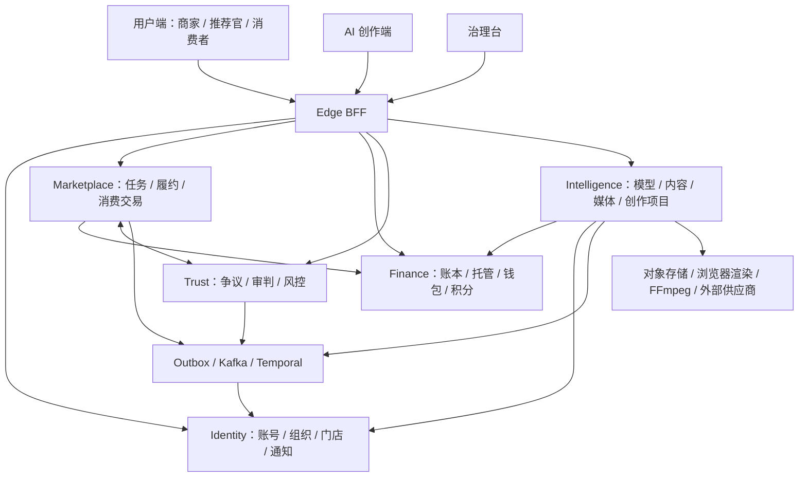

**草场全模块业务与代码审查 · 2026-09-15**

实施规格已整理为[任务书 #103：全模块业务一致性修复与工程优化](../任务书/草场任务书-103-全模块业务一致性修复与工程优化.md)，包含 27 张任务卡与 162 组验收用例。当前仅完成规格编写，业务修复尚未开始；下文保留审查时事实与验证结果。

代码基线：`2f27a40b885bc092c2034c223b22f181087d1f34`，审查开始时工作区干净。本报告对应这个版本；历史报告中的已修复问题先与当前代码核对，再判断是否仍然成立。

审查范围：三个前端入口、六个常驻 Java 服务、两个迁移应用、八个共享 Java 模块，以及测试、契约和部署配置。交付内容为模块梳理、问题定位、隔离复现和改进顺序。

本轮采用全仓结构扫描、关键业务链路代码审阅、前端全量测试与覆盖率、Java 全量测试与覆盖率门禁，以及针对发现的隔离探针。模块清单覆盖整个工程；深度审阅集中在权限、交易履约、资金、通知、创作状态和数据生命周期，不声称逐行穷尽全部代码。真实模型、公众号、支付渠道及生产环境没有在本轮调用。

**结论**

项目已具备较完整的商家推广、推荐官履约、消费者交易、AI 创作和治理运营能力。当前应优先改善跨模块的一致性：资金操作与业务状态的先后顺序、新事件与通知消费者的接线、新数据表与注销清理的接线，以及页面缓存与当前业务对象的绑定。

本轮确认 **9 类问题：5 项 P1、4 项 P2**，其中业务问题经 16 项隔离探针复现，工程门禁问题经原有检查复核。P1 表示应在扩大使用前修复的资金、错误业务操作或关键流程问题；P2 表示需要排期修复的业务正确性和工程问题。最终验证统计见文末。

| 编号 | 级别 | 问题 | 主要影响 |
|---|---|---|---|
| R01 | P1 | 无责退出先释放资金，后抢业务终态 | 资金已释放，但履约仍然有效 |
| R02 | P1 | 已结算不可退款只检查旧快照，SQL 缺少同一约束 | 并发时穿透结算后退款规则 |
| R03 | P1 | 注销流程遗漏新创作数据与排队任务 | 清理完成后仍保留原稿、画布和公众号凭据 |
| R04 | P1 | 争议详情缓存复用后不重新取案情 | 显示案件 A，却向案件 B 提交答辩 |
| R05 | P1 | 新履约事件未接入通知消费者 | 到期提醒、审稿提醒和协商请求不能抵达用户 |
| R06 | P2 | 经营分析仍按旧订单状态聚合收入 | 部分退款后 GMV 消失，未支付取消单计入收入 |
| R07 | P2 | 部分退款后不再返回核销码 | 仍可履约的订单无法在页面出示核销码 |
| R08 | P2 | 一店一店长检查不具备并发互斥 | 两个分配请求可同时创建新店长 |
| R09 | P2 | 文档改版未同步契约与密钥扫描规则 | 当前版本的两道 CI 门禁失败 |

**工程与模块地图**



统计采用 `git ls-files`，排除测试与构建产物后，前端有 **414 个源码文件、88,915 行**；Java 主源码有 **1,329 个文件、155,280 行**。SQL 迁移有 **237 个文件**。测试目录文件数为：前端就近测试 218、仓库工具与部署测试 11、Java 测试目录 592、Playwright spec 11。文件数不等于用例数，Java 数量包含测试基类和辅助代码。

完整的目录分组与计数保存在[模块清单 JSON](../../test-artifacts/project-audit-2026-09-15/inventory.json)。

| 服务/模块 | 主源码文件 / 行数 | 职责与本轮结论 |
|---|---:|---|
| `edge-bff` | 22 / 1,905 | 公共 API 路由、会话与移动 token、内部断言、CSRF、透传协议；入口隔离机制已建立 |
| `identity-service` | 244 / 23,255 | 账号、主体、品牌、门店、成员、KYB、准入、通知和合规；重点问题见 R05、R08 |
| `marketplace-service` | 281 / 30,577 | 任务、撮合、履约、商城、归因、声誉和分析；重点问题见 R01、R02、R06、R07 |
| `finance-service` | 76 / 8,556 | 双录账本、托管、押金、支付退款分账、钱包、积分；需与 Marketplace 一起修复 R02 |
| `trust-service` | 90 / 9,414 | 争议、证据、评审、上诉、客服裁决、判例和风险调查；前端案件生命周期见 R04 |
| `intelligence-service` | 565 / 77,468 | AI 控制面、创作、媒体、画布、导出和公众号；重点问题见 R03 |
| `database-bootstrap`、`release-migrator` | 4 / 404 | 空库基础表与发布迁移编排；迁移顺序、历史校验和测试需要持续保留 |
| 八个 `platform-*` 共享库 | 47 / 3,701 | 加密、存储、身份断言、HTTP、报表、消息、数据库、财务换算；应继续复用现有公共能力 |

前端源码主要在 [src/views](../../src/views)、[src/composables](../../src/composables)、[src/stores](../../src/stores)、[src/ai](../../src/ai) 和 [src/ops](../../src/ops)。以下按用户能完成的业务组织模块，目录中的子包归入对应行。

| 业务模块 | 功能范围 | 主要归属 / 审查重点 |
|---|---|---|
| 注册、登录与验证码 | 邮箱验证码、账号名/邮箱登录、密码校验、首登改密、绑邮箱、登出 | Identity `auth/security/user`；检查身份来源、失败语义和资源访问 |
| 会话与身份切换 | 多设备会话、会话撤销、商家/推荐官活动身份、移动 access/refresh token | Identity `session/identityprofile/mobile`，前端 account-session/bootstrap |
| 跨应用免登 | 草场与 AI 应用一次性 token、受众与 Origin 约束、核销后建会话 | Identity `auth`，两端布局；消费采用原子一次性 token |
| 主体与品牌 | 组织建立、主体更名、品牌、账号前缀、单店/多店归属 | Identity `organization/brand`；公开资料与内部管理分开 |
| 门店与成员 | 门店资料、成员池、店长/店员、分店调度、停用和删除子账号 | Identity `store/membership/organization/subaccount`；R08 |
| 商家认证与权限 | KYB 材料、审核、权限升级申请、额度、行业规则、审核 SLA | Identity `kyb/permission`，治理审核面板；真实材料与外部核验另验 |
| 推荐官画像 | 资料认证、平台账号、等级、权益、准入 | Identity `recommenderprofile`、Marketplace `reputation` |
| 通知中心 | 站内通知、未读数、邮件、外部 Push/SMS 网关、通知深链 | Identity `notification/notify`，前端 NotificationPanel；R05 |
| 个人数据 | 数据导出、注销检查、保留期、跨域清理、媒体删除 | 五域 `compliance`；R03 |
| 商家任务发布 | 草稿、三类合作模板、发布审核、条款修订、重新确认、关闭与取消 | Marketplace `taskcatalog`；保留冻结条款和版本检查 |
| 报名与撮合 | 报名、撤回、接受、拒绝、名额、批量操作、自动接受、推荐官邀请 | Marketplace `taskcatalog/matching/workflow`；资金预留 Saga 与名额同向恢复 |
| 交付期限 | 交付截止、提醒、补救期、延期申请和批准、超时终结 | Marketplace `taskcatalog/workflow`；R01、R05 |
| 体验权益 | 预约、到店/收样、兑现确认、商家失约主张、限时回应、押金退还 | Marketplace `benefit`；回应计时需连通真实通知 |
| 草稿审稿 | 草稿附件、审稿窗口、退改次数、补交、自动通过/转人工 | Marketplace `taskcatalog`；R05 |
| 履约凭证与核验 | 发布链接、截图、评论文字、链接可达性、AI 核验、人工覆盖、官方核验网关 | Marketplace `taskcatalog`、Intelligence `verification/contentsafety`；官方渠道是外部依赖 |
| 里程碑与退出 | 阶段确认、取消补偿、无责退出、双方协商退出、结算预演 | Marketplace `milestone/taskcatalog`；R01；协商失败后的自动恢复仍宜补齐 |
| 任务结算 | 商家确认、自动确认、争议挂起、结算窗口、财务回读与对账恢复 | Marketplace `settlement/workflow`、Finance `escrow`；保留财务事实确认后再完成业务状态 |
| 声誉与商家信用 | 完成率、评分、等级权益、商家信用标签、样本不足中性态 | Marketplace `reputation`；明确区分商家取消、推荐官失约和无责退出 |
| 套餐与库存 | 套餐版本、上下架、库存/时段、推广任务绑定 | Marketplace `commerce`；订单快照与库存释放已有独立路径 |
| 推广链接与归因 | 分享链接、归因窗口、贡献分配、归因申诉、运营纠错 | Marketplace `commerce/analytics`；纠错不得突破结算事实 |
| 消费者订单 | 下单、支付、超时关闭、取消、核销、部分/全额退款、售后争议、评价 | Marketplace `commerce`、Finance `commerce`；R02、R07 |
| 消费分账 | 冷静期、暂扣、退款净额、分账中状态、失败重放 | Marketplace `commerce/ops`、Finance `commerce`；R02 |
| 钱包与账单 | 商家托管余额、推荐官钱包、提现、月账单、流水导出 | Finance `account/wallet/report/escrow`；当前支付与提现为 Sandbox |
| AI 积分与套餐 | 免费额度、积分购买、预估预留、实际用量差额、失败补偿、人工调整 | Finance `credits/aicredits`、Intelligence `ai/run`；按操作键幂等和冻结换算政策 |
| 争议受理与证据 | 小法庭/客服直裁、举证、答辩、质证完毕、证据脱敏与访问审计 | Trust `dispute/audit`、前端 disputes；R04 |
| 审判与上诉 | 审判官考试、池管理、回避、抽签、投票、重新评审、上诉、客服终审 | Trust `judge/adjudication/workflow`；继续按当事方与后台职能分开授权 |
| 判例与风险 | 公开判例、风险信号、调查案件、审计、举报投诉 | Trust `precedent/risk`、Marketplace `complaint`；生产风控阈值需真实流量校准 |
| 经营分析与导出 | 任务/订单经营汇总、营收趋势、归因事件、Campaign、ROI、告警、CSV/XLSX | Marketplace `analytics/ops`、共享 reporting；R06 |
| AI 模型控制面 | 受信端点、供应商凭据、模型能力、协议、主备、价目、并发限制 | Intelligence `ai/controlplane/settings`；扩副本前补缓存失效传播 |
| 个人/组织 BYOK 与预算 | 密钥加密、组织授权、平台回退、个人与组织预算、阈值告警、运行记录 | Intelligence `ai/byok/ai/run`；保持免费额度、积分与金额口径清楚 |
| 创作入口与项目 | 平台/内容形式/来源选择、任务创作、自由创作、最近项目、草稿版本、自动保存 | Intelligence `creationassistant/creationcontext/creationlineage`，AI 中心与各工作流 |
| 热点与创作灵感 | 热榜、多源聚合、历史、筛选、主题带入、AI 助手 | Intelligence `homepage/hottopic/creationassistant`；外部来源可用性另验 |
| 文章与文案 | 选题、标题、大纲、正文、检查与修复；公众号、知乎、小红书、抖音图文等 | Intelligence `article/humanize/contentsafety`，文章工作台 |
| 朋友圈与脚本 | 图片/视频配文、朋友圈文案、风格化/喜剧脚本 | Intelligence `moments/comedy/creationstyle` |
| 图片分析与编辑 | 图片点评、风格偏好、提示词、生成/编辑、参考图 | Intelligence `imageanalysis/imagestudio/articleimage`，image 视图与 AI 中心 |
| 图卡与视觉内容 | 系列图卡、信息图、封面、文章配图、模板化成品 | Intelligence `cardseries/creationstudio`；新视觉工作台受 #101 开关控制 |
| 新图文工作台 | 原稿导入、文本建议、视觉计划、费用确认、生成任务、候选采用 | Intelligence `creationstudio/source/text/plan/visual`，article composables；R03 |
| 排版、导出与公众号 | 浏览器渲染、图文文件导出、公众号连接、上传、草稿同步、unknown 核实 | Intelligence `creationstudio/render/wechat/orchestration`；#101 默认关闭，真实渠道本轮未验 |
| 视频解析与分析 | 抖音/B站参考解析、媒体代理、分析、脚本改编、复刻 | Intelligence `douyin/bilibili/mediaplatform/videorecreation`；外部平台依赖单独验收 |
| 视频制作 | 脚本、分镜、镜头候选、配音、BGM、生成、FFmpeg 合成、下载、任务恢复 | Intelligence `videoproduction/videostudio/orchestration`；真实供应商状态与账单需联调 |
| 分镜画布 | 节点/连线、布局保存、素材参考、AI 方案预览/应用、方案派生、交付 | Intelligence `creationcanvas`，video-canvas composables；项目父锁与版本边界已建立；R03 |
| 媒体与素材库 | 上传票据/确认/下载签名、公共/个人/门店素材、授权、审核、媒体删除 | Intelligence `media/contentlibrary`，共享 storage；新类型需接入统一生命周期 |
| 语音与语义检索 | 语音转写、时长探测、嵌入、素材推荐与语义排序 | Intelligence `speech/embedding/contentlibrary`；外部模型质量和性能需实测 |
| 游客体验 | 有限体验入口、用量和限流 | Intelligence `guesttrial`，前端游客引导 |

治理台包含 **24 个管理页签**，单源登记在 [adminTabs.ts](../../src/ops/admin/adminTabs.ts)：KYB、主体更名、推荐官认证、任务审核、审判官准入、权限审核、门店媒体、公共素材、用户管理、账号前缀、等级权益、财务对账、积分套餐、订单核销、经营看板、经营分析、AI 模型、创作风格、去 AI 味、BGM、首页热点、视频任务、风险调查、统一审计。另有运营处置台的案件、DLT 和待处理队列。路由/页签可见性是体验层，服务端 `backend_role` 和资源授权是权限依据。

**需要修复的问题及验收方法**

**R01 · P1：无责退出应先持久化退出意图，再释放资金。**

位置：[ApplicationLifecycleService.java:194](../../platform-java/services/marketplace-service/src/main/java/com/grassland/marketplace/taskcatalog/ApplicationLifecycleService.java#L194)，以及 [TaskApplicationRepository.java:850](../../platform-java/services/marketplace-service/src/main/java/com/grassland/marketplace/taskcatalog/TaskApplicationRepository.java#L850)。

`exitNoFault` 先查没有提交/没有消费，随后调用 Finance 退押金、释放赏金，最后才执行带 `NOT EXISTS submission/milestone` 的状态更新。Finance 往返期间如果新增了交付或里程碑，最后的更新会返回 0 行并响应 409，但资金已经释放。此时报名仍是 `accepted`，后续履约无法按原资金快照结算。

现有测试验证了本地状态、名额和 outbox 一起回滚，但外部退款不在这个本地事务内。修复应增加持久化退出命令/处理中状态，与提交、确认、权益兑现争用同一个业务锁；成功领取后在事务外执行资金操作，最后持久化收尾，并用 dispatcher 恢复。不能只把 HTTP 放进数据库事务。

验收：用屏障让交付提交发生在 Finance 回复前，最终只能是“交付有效且钱仍被预留”或“退出已领取、交付被拒、资金最终退还”；进程退出后也应自动收敛。

**R02 · P1：退款写入必须原子检查 `split_completed_at`。**

位置：[CommerceService.java:535](../../platform-java/services/marketplace-service/src/main/java/com/grassland/marketplace/commerce/CommerceService.java#L535)、[CommerceRepository.java:435](../../platform-java/services/marketplace-service/src/main/java/com/grassland/marketplace/commerce/CommerceRepository.java#L435)、[ConsumerPaymentService.java:86](../../platform-java/services/finance-service/src/main/java/com/grassland/finance/commerce/ConsumerPaymentService.java#L86)。

一个有部分退款史、已核销且等待分账的订单，退款请求可能先读到 `splitCompletedAt=null`；另一执行者完成分账后，状态又回到 `partially_refunded`。原退款请求随后执行的 SQL 只检查状态和可退金额，没有检查 `split_completed_at IS NULL` 或快照版本，因此仍能进入 `refund_pending`。Finance 还保留 `refundAfterSplit` 冲销分支，不能依赖它阻止这次操作。

修复应把“未结算”和必要版本条件写入退款 CAS SQL，并在 Finance 服务明确落实当前“已结算不支持退款”的边界；历史冲销如果必须保留，应走独立、明确授权的命令。其他资金入口也需做相同的读快照/写事实检查。

验收：安排“退款读取 → 分账提交 → 退款写入”，退款必须 409，且不能调用 Finance 退款。正常的分账前退款和未知分账结果保护继续通过。

**R03 · P1：新创作模块没有加入账号注销生命周期。**

位置：[IntelligenceComplianceRepository.java:18](../../platform-java/services/intelligence-service/src/main/java/com/grassland/intelligence/compliance/PersonalDataErasureRepository.java)、[同文件:35](../../platform-java/services/intelligence-service/src/main/java/com/grassland/intelligence/compliance/PersonalDataErasureRepository.java)、[ComplianceService.java:144](../../platform-java/services/identity-service/src/main/java/com/grassland/identity/compliance/ComplianceService.java#L144)。

注销保留期结束后，`erasePii` 会删旧草稿、素材等，但没有清理 `creation_source_document`、`creation_canvas_document`、新视觉计划/同步载荷，也不撤销 `creation_wechat_account.encrypted_secret`。这些表没有关联删除外键，删除草稿不会顺带删除它们。Identity 仍会继续写入 `pii_erased` 并完成注销。

`activeJobCount` 也只统计旧 AI Run、旧视频生成表、转写和积分补偿，没有覆盖新工作台排队任务、公众号同步等。存在尚未产生 `ai_run` 的排队任务时，注销检查可错误返回无活动任务。

修复应按账号登记所有个人数据、密钥、衍生对象和异步任务的生命周期：注销前阻止/排空活动任务，撤销公众号连接和缓存，保留必要的脱敏审计，删除来源文稿/画布/个人计划和对象存储衍生文件。将新增数据表是否接入导出、注销、清理纳入模块验收。画布已在现有业务中使用；公众号相关影响适用于启用 #101 或已有对应数据的环境。

验收：包含旧草稿、新原稿、画布、公众号连接/同步的账号，在清理后不能残留个人正文与凭据；有活动任务时不能提前完成注销。

**R04 · P1：争议页必须随案件和会话变化重新装载。**

位置：[DisputeDetailView.vue:16](../../src/views/disputes/DisputeDetailView.vue#L16)、[同文件:137](../../src/views/disputes/DisputeDetailView.vue#L137)、[同文件:208](../../src/views/disputes/DisputeDetailView.vue#L208)、[DefaultLayout.vue:124](../../src/layouts/DefaultLayout.vue#L124)。

布局会缓存视图，详情只在 `onMounted` 调用 `loadDispute`。`route.params.id` 虽然是计算值，案情却没有监听它刷新。查看 A、返回列表、再打开 B 时，会复用 A 的视图；答辩/质证操作使用新的 `disputeId`，于是出现显示 A、提交到 B 的错误业务操作。

列表与详情还有首访问题：子页挂载时立即把 `isAuthenticated=false` 当作未登录，跳回首页，而父布局的 `/auth/me` 恢复尚未完成。这也是 9 月 15 日样式报告已登记、当前仍存在的问题。

修复宜抽出争议域 composable：等待账号 bootstrap，按 `accountId + epoch + disputeId` 装载并丢弃迟到响应，切案/失活时清空编辑表单，重新激活时刷新。提交应绑定已装载的案件 ID 和必要状态版本。

验收：A → 列表 → B、直接 A → B、登录态恢复、切账号、请求逆序、提交中切案均覆盖；显示的案件与写入目标始终一致。本轮 Vue 探针已覆盖缓存实例切 ID 的错案提交及两种首访跳转。两页在本次原有测试套件中的行覆盖率均为 0%，全局覆盖率达标没有覆盖到这项业务风险。

**R05 · P1：到期与协商事件发出了，但用户收不到通知。**

位置：[DeliveryLifecycleActivityImpl.java:86](../../platform-java/services/marketplace-service/src/main/java/com/grassland/marketplace/workflow/saga/DeliveryLifecycleActivityImpl.java#L86)、[NotificationEventProcessor.java:75](../../platform-java/services/identity-service/src/main/java/com/grassland/identity/notification/NotificationEventProcessor.java#L75)、[NotificationTemplates.java:67](../../platform-java/services/identity-service/src/main/java/com/grassland/identity/notification/NotificationTemplates.java#L67)、[NotificationRecipientResolver.java:83](../../platform-java/services/identity-service/src/main/java/com/grassland/identity/notification/NotificationRecipientResolver.java#L83)。

`DeliveryDeadlineExpiring`、`DeliveryExtensionRequested`、`DraftReviewExpiring`、`EngagementExitRequested`、`BenefitDefaultClaimed` 等事件已有生产者，却不在模板和收件人映射中。处理器遇到模板为空直接返回 `IGNORED`，不会插入站内通知，也不会入队邮件。事件出现在 outbox/Kafka 不能证明用户已经得到提醒。

[任务书 #96](../任务书/草场任务书-96-合作最小完整履约.md)明确要求提醒、补救、终结链。继续执行超时处置而没有提醒，会影响双方响应期限和责任判定。

修复应补齐新履约事件的通知策略、对方收件人和准确深链，核对延期、审稿、体验失约、协商退出整个事件族。测试应从生产者事件样本走到通知/邮件落库，并明确哪些事件有意不通知。

验收：真实事件载荷进入处理器后，正确账号收到可定位任务/合作的通知；重复投递只产生一次；操作者与对方的通知规则清楚。

**R06 · P2：经营分析需要从支付、退款、核销和分账事实聚合。**

位置：[AnalyticsRepository.java:132](../../platform-java/services/marketplace-service/src/main/java/com/grassland/marketplace/analytics/AnalyticsRepository.java#L132)。

该聚合只把 `paid/redeeming/redeemed/refunded` 计入已支付和 GMV，漏掉 `partially_refunded/refund_pending/splitting` 等后续新增状态；退款额只统计全额退款。另一方面，商家收入、平台费、推荐官收入使用 `status <> 'refunded'`，将未支付和取消单的预分配金额也算入收入。

例如支付 100 元后退款 30 元，订单仍有 70 元净额，但这里的总 GMV、退款额和已支付订单数会都变成 0；从未支付而取消的订单又会出现正的商家收入。经营看板、导出和派生告警会受影响，Finance 账本本身不因这项统计错误而变更。

修复应统一事实口径：支付用支付事实/`paid_at`，退款用实际退款流水和累计退款额，核销用 `redeemed_at`，已结算收入用分账事实，预估收入单独命名。日期口径也应明确为发生时间或订单 cohort，汇总、趋势、导出共同复用。

验收：未支付取消、支付中、部分退款、退款中、核销未分账、分账中、已结算都要进入同一张金标准样本表；100 元支付、30 元退款应持续体现 100/30/70 的对应事实。

**R07 · P2：部分退款的未核销订单需要继续签出核销码。**

位置：[CommerceService.java:914](../../platform-java/services/marketplace-service/src/main/java/com/grassland/marketplace/commerce/CommerceService.java#L914)、[同文件:574](../../platform-java/services/marketplace-service/src/main/java/com/grassland/marketplace/commerce/CommerceService.java#L574)、[ConsumerCommerceView.vue:80](../../src/views/commerce/ConsumerCommerceView.vue#L80)。

后端核销已经允许 `partially_refunded && redeemedAt == null`，但 `redeemCode()` 仍只对 `paid/redeeming` 返回码。退款后重新读取订单，前端没有 `redeemCode` 就不会显示二维码和文字码；消费者除非事先保存了旧码，否则难以完成剩余履约。

修复应复用同一个“当前可核销”判定来决定核销码和接口资格，包含未过期、未核销的部分退款状态。已使用、已退满等状态继续不暴露可用码。

验收：支付 → 部分退款 → 刷新订单 → 展示码 → 到店核销成功；核销后再次读取不再显示可用码。

**R08 · P2：门店分配的唯一性需要数据库并发保障。**

位置：[StoreAssignmentService.java:55](../../platform-java/services/identity-service/src/main/java/com/grassland/identity/store/StoreAssignmentService.java#L55)、[OrgSubAccountService.java:183](../../platform-java/services/identity-service/src/main/java/com/grassland/identity/organization/subaccount/OrgSubAccountService.java#L183)、[V3 门店成员表](../../platform-java/services/identity-service/src/main/resources/db/migration/V3__add_identity_profile_store_membership.sql)。

“一店一店长”通过 `countManagerRows` 查询判定，查询发生在写入事务之前，表中只有 `(store_id, account_id)` 唯一约束。两个不同账号同时分配到同一空门店，可以都读到 0，再分别成功插入店长。直接建子账号的路径也存在相同模式。

修复应让建号、分配、角色变更共同取得门店级锁，并对同一账号的调店操作串行化。V48 明确保留存量多店长，不能直接加会使存量迁移失败的唯一索引；可先用父行/事务 advisory lock 阻止新冲突，再制定历史数据收敛方案。

验收：同店并发分配两个新店长，必须最多一个成功；同账号并发调店也只能有一个有效归属；历史多店长的逐步移除不受阻。

**R09 · P2：文档改版同时触发契约测试与密钥扫描失败。**

位置：[edge-entrypoint.contract.test.ts:665](../../tests/deployment/edge-entrypoint.contract.test.ts#L665)、[CI 配置](../../.github/workflows/ci.yml)。

测试仍要求 README 包含固定字串 `` `API_UPSTREAM` 必须保持 `edge-bff:8080` `` 和旧的重建命令。最近文档重新组织后，该断言稳定失败。

`npm run security:secrets` 也以退出码 1 失败，定位到 README 第 126 行的 MinIO access key 示例，以及[移动 token 方案第 59 行](../../docs/架构/移动端刷新token认证方案设计.md#L59)的 `session_token` 示例。前者是文档内的应用访问标识，后者是 `refresh-token-row-uuid` 占位文本；本轮证据表明示例与扫描规则不兼容，没有据此判定生产密钥泄露。CI 的 Node 作业先执行密钥扫描，再执行完整覆盖率测试，两道门禁都需恢复。

修复应将文档断言指向当前实际承载部署约束的运行手册，并继续验证部署配置/启动守卫；将示例改成扫描器可识别的明确示例值，或针对非密钥字段收紧匹配并增加扫描器回归。避免把根 README 的具体措辞当作安全契约的唯一依据，也不要关闭扫描或大范围忽略文档。

验收：密钥扫描、部署入口契约、全量前端测试及覆盖率均通过；错误的 API 上游配置和真实凭据样本仍被相应测试拒绝。

**建议的改进顺序**

| 批次 | 内容 | 完成标准 |
|---|---|---|
| 第一批：业务正确性 | R01/R02 资金竞争、R03 注销生命周期、R04 错案操作、R05 到期提醒；并修复 R09 使质量门禁恢复 | 受控并发/延迟/重放测试通过；新旧个人数据清理完整；显示对象与写入对象相同；提醒实际落库 |
| 第二批：数据与功能补齐 | R06 经营事实口径、R07 核销码、R08 门店分配 | 统计与账务样本一致；剩余履约可完成；并发唯一性可证明 |
| 第三批：减少后续回归 | 统一命令恢复模型、通知契约、前端业务生命周期、跨模块验收矩阵；再拆大型类 | 新模块按同一接入清单交付，测试覆盖实际业务不变量 |

进一步的结构优化应服务于以上问题：

- 复用已有 `commerce_fund_operation`、acceptance command、outbox 和租约 dispatcher 的思想，补齐退出等跨服务动作的持久化意图、恢复状态和运营入口。`respondNegotiatedExit` 目前主要依赖再次调用确认端点续跑资金腿；应形成无需用户重复点击的恢复链。这是历史整体复核也提到的开放项。
- 将支付、退款、核销、结算分别作为事实维度；前端可执行动作、核销码、统计和运营筛选共享规则，减少新增状态后只修一半消费者的情况。
- 给每种持久化资源登记 owner、组织作用域、来源快照、生命周期、审计保留和对象存储清理规则，避免新表只实现 CRUD。
- 继续维持五个大视图的装配层约束。当前 `.vue` 体积门禁通过，四个历史豁免未增长；进一步拆分应放在域 composable 和子组件，不能把逻辑放回视图。
- Java 的 `TaskController` 1,769 行、`CommerceRepository` 1,274 行、`VisualPlanService` 1,126 行、`CommerceService` 1,047 行、`WechatDraftSyncService` 926 行是维护热点。按命令、读模型、外部适配和状态推进拆分；优先服务边界内整理，保留当前六服务结构。
- 提高测试的故障覆盖：复现本轮缺陷的价值高于继续堆正常路径数量。加入旧快照写入、两个操作者并发、响应丢失、切案、账号恢复、跨域通知落库和新模块注销测试。将 fixture 边界写清楚，特别是默认放行的授权 mock 与 WireMock 不能替代真实权限/供应商验收。
- `TrustedOriginService` 使用进程内失效事件，其他副本可能一直持有旧白名单；代码已注明单实例限制。扩副本前落实版本化共享失效或有界刷新与撤销策略。无需为单实例开发临时增加一套独立配置服务。

**验证记录**

本轮产物位于 [test-artifacts/project-audit-2026-09-15](../../test-artifacts/project-audit-2026-09-15)。该目录被 Git 忽略，用于当前工作区查看；本报告与审查索引可以入库。

| 检查 | 结果 |
|---|---|
| `npm run lint` | 通过；存量超长 composable 发出 WARN，Vue 硬门禁通过 |
| `npm run build:client` | 通过，包含 `vue-tsc` 与三个入口的 Vite 构建 |
| 前端首次全量覆盖率运行 | 1,992 通过 / 4 失败，另有 1 个 worker 通信超时；其中 3 项是超时，1 项为 R09 |
| 前端单 worker 全量复核 | 1,995 通过 / 1 失败；仅 R09 保留，前述超时未复现；共 229 文件、1,996 用例 |
| 前端覆盖率 | statements/lines 87.15%，branches 80.42%，functions 68.63%，均高于已配置阈值；因 R09，整体命令退出码仍为 1 |
| `npm run security:secrets` | 失败，2 处文档示例触发 `structured-credential`，见 R09 |
| Java 全量与覆盖率门禁 | 3,993 通过 / 0 失败 / 0 跳过；16 个模块本轮实跑，15 个已配置的指令覆盖率阈值全部通过；耗时 31 分 50 秒 |
| 隔离问题探针 | Java 13 / 13，Vue 3 / 3，全部复现对应缺陷；Java 探针运行耗时 1 分 25 秒 |
| 文档与迁移检查 | `docs:status` 通过；`docs:links` 1,249 本地链接、0 错误；已发布迁移 7 文件 checksum 校验通过 |

Java 结果按服务为：Edge 304、Identity 619、Marketplace 767、Finance 219、Trust 246、Intelligence 1,682，共享库与迁移应用 156，全部通过。六个常驻服务的指令覆盖率分别为 83.76%、83.42%、86.98%、88.34%、83.50%、82.87%。`release-migrator` 的指令覆盖率为 26.07%，没有配置阈值，应作为后续测试改进项。

完整计数及每模块覆盖率见 [Java 本次基线结果](../../test-artifacts/project-audit-2026-09-15/java-baseline-summary.json)，原始 JUnit XML 与 JaCoCo XML 已单独归档，避免专项探针覆盖构建目录后混淆证据。前端覆盖率快照见 [coverage summary](../../test-artifacts/project-audit-2026-09-15/frontend-coverage-summary.json)。

隔离复现的结果和用例名见 [probe-summary.json](../../test-artifacts/project-audit-2026-09-15/probe-summary.json)，原始结果在 [probe-xml](../../test-artifacts/project-audit-2026-09-15/probe-xml)。

| 问题 | 探针数 | 实际观察 |
|---|---:|---|
| R01 | 1 | 在 Finance 回复期间插入提交；退出 409，Finance 释放桩已成功，报名仍 accepted |
| R02 | 1 | 延迟的结算前快照进入真实退款 SQL；分账已完成后又退款 1,000 分 |
| R03 | 2 | 旧草稿删除 1 条，新原稿、画布、有效公众号凭据各残留 1 条；排队同步存在但活动任务计数为 0 |
| R04 | 3 | 显示 A 案情时答辩写入 B；列表/详情均在会话恢复前跳回首页 |
| R05 | 5 | 五类新事件均由真实通知处理器返回 IGNORED，站内和邮件模板均为空 |
| R06 | 2 | 100 元支付、30 元退款后报表变成 GMV 0 / 退款 0；从未支付的取消单仍计正收入 |
| R07 | 1 | 部分退款的 POST/GET 均不返回码，但保存的原核销码仍可成功核销 |
| R08 | 1 | 两个真实预检查都读到 0，两个写事务都提交，空门店出现 2 个新店长 |

Java 全量命令使用 JDK 25 和 Gradle Wrapper，显式关闭构建缓存并重新执行测试，避免把历史缓存结果当作本次实跑：

```bash
source scripts/lib/java-runtime.sh
ensure_java_runtime 25
./platform-java/gradlew -p platform-java test jacocoTestCoverageVerification \
  --console=plain --rerun-tasks --no-build-cache --max-workers=2
```

前端复核使用 `npm run test:coverage -- --maxWorkers=1 --coverage.reportOnFailure`。降低并发后 3 个超时消失，单独保留稳定的文档断言失败，没有修改产品代码或放宽测试断言。

隔离探针通过额外 Vitest 配置和 Gradle init script 加载，临时复现脚本位于 [scripts/local/project-audit-2026-09-15](../../scripts/local/project-audit-2026-09-15)，输出保存在本轮产物目录；探针断言的是“当前缺陷可以出现”，其通过不能理解为业务正确。Java 探针使用临时 Testcontainers PostgreSQL；Finance 出站由明确的桩代替，复现并发时序，不执行真实资金操作。Vue 探针装载当前视图，控制登录态与路由变化。

**验收边界与历史问题核对**

9 月 9 日、10 日报告中的分账错误回退、支付重试队列、角色回避、共享凭据清理、DNS 启动耦合及覆盖率门禁接线，均有后续修复记录；本报告没有把这些历史结论直接当作当前缺陷。R01 聚焦本地事务之外的资金先行，R02 聚焦分账完成后状态恢复带来的旧快照窗口，R07 聚焦前端核销码，分别与此前已修部分不同。

本轮没有重新部署已有 Docker 业务栈，没有将现有运行容器的行为当作当前 HEAD 的验收结果，也没有跑完整三浏览器 Compose E2E。近期全页面主题/响应式截图记录见[三端前端样式检查与修复](frontend-style-audit-2026-09-15.md)；本轮前端复核聚焦业务生命周期，不重复宣称视觉全量验收。

真实资金仍受 [D01](../adr/D01-psp-escrow-compliance.md) 和生产门禁约束。真实模型、官方履约数据、公众号草稿同步、视频供应商账单、公网回调、生产备份恢复及容量/故障演练需要各自的外部验收证据；测试通过仅能证明本报告记录的范围。
