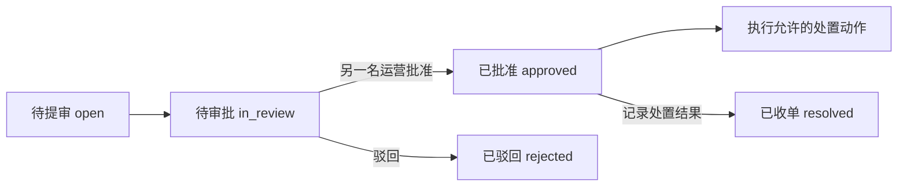

# 草场治理台：界面调整与业务审查

审查日期：2026-09-07。范围为治理台外壳、23 个页签的导航与权限装配，以及用户、审核、财务、运营处置的主要调用链。后端结论来自静态代码与现有契约测试阅读，未向真实业务服务提交审批或资金操作；不是全库安全审计。

> **2026-09-08 立项注记**：P1 两项与 P2「运营处置列表分页」及「后续代码优化 2（角色 N+1）」已立项任务书 #94（`docs/任务书/草场任务书-94-管理端积分调整安全修复与运营队列分页.md`），全部锚点当日复核属实。P2「专员角色矩阵」与「前往客服裁定接通」为入口/IA 级产品拍板项，待拍板后另行立项。

## 需要优先处理的问题

以下问题已确认调用证据，本次未改动其后端业务语义。

### P1：负数积分调整实际增加余额

界面允许“正数增加，负数减少”，但 `AdminUserController.adjustCredits` 对负数调用 `financeCredits.refund(userId, abs(amount), note)`。积分服务的 `refund` 明确执行 `deltaBalance = +amount`、`deltaSpent = -amount`。因此余额 100 时输入 -5，代码路径会使余额变成 105，并修改累计使用量。

证据：`src/ops/admin/components/AdjustCreditsDialog.vue` 的数量说明；`platform-java/services/identity-service/src/main/java/com/grassland/identity/admin/AdminUserController.java:132`；`platform-java/services/finance-service/src/main/java/com/grassland/finance/credits/CreditsService.java:159`。

建议：财务域提供独立的有符号积分调整命令，原子校验余额、积分单位和上下界，并记录操作者、原因和调整流水。扣减不可复用退款，也不可循环调用按 AI 配额计费的 consume。修复前应停止通过此入口执行负向调整。

验收：100 + (-5) = 95；正向调整正确；零、小数、越界数值被拒绝；余额不足行为明确；总额、累计字段和流水保持一致。当前 `AdminUserControllerTest` 只验证“调用了 refund”，会把错误业务映射固化成绿色测试，需改为验证余额方向的跨模块契约。

### P1：积分调整的超时重试没有幂等键

管理端调整积分没有传入 `operationId`，identity 的正向 award 使用默认 null，refund 请求也不带该字段；`FinanceCreditsAdminClient.postVoid` 却会对超时和连接错误重试一次。若上游已提交而响应丢失，重试可能重复入账。禁用前端按钮不能解决这一服务间重试问题。

证据：`platform-java/services/identity-service/src/main/java/com/grassland/identity/admin/FinanceCreditsAdminClient.java:68`、`:86`、`:105`；`platform-java/services/finance-service/src/main/java/com/grassland/finance/credits/CreditsService.java:560`。

建议：一次调整意图生成并持有一个幂等键，贯穿浏览器、identity 和 finance；重试复用同一键。服务端校验键与账号、金额、操作类型的绑定，重复请求返回原结果。将操作者写入财务审计记录。

验收：财务提交后模拟响应丢失，再重试，余额和流水只改变一次；同键不同参数拒绝；新的明确调整使用新键。

### P2：专员角色与可见入口不一致

| 角色 | 当前治理台 | 已有服务端能力 | 影响 |
|---|---|---|---|
| `finance` | 无治理入口 | 账本查询允许 FINANCE | 财务人员无法从 UI 进入对账 |
| `merchant_reviewer` | 无治理入口 | 推荐官认证允许 MERCHANT_REVIEWER | 审核职责有接口但无可达入口 |
| `content_reviewer` | 门店媒体、公共素材、账号前缀 | 推荐官认证也允许 CONTENT_REVIEWER | 推荐官认证页签不可见 |
| `risk` | 仅用户管理 | 风险调查接口允许 RISK | 风控人员无法进入风险调查页 |

证据：`src/ops/router.ts`、`src/ops/admin/adminTabs.ts`；`LedgerAdminController.java:55`、`RecommenderVerificationController.java:104`、`RiskController.java:58`。

这里存在任务书 #72 的既有前端收敛约定，不能只根据接口允许就擅自扩大页面权限。应先统一最终职责矩阵，再同时更新入口、页签、读写按钮和角色用例。平台管理员的通配授权不应被当成实际授予角色来展示，这个展示问题本次已修复。

### P2：“前往客服裁定”没有接通目的页面

`OpsConsole.vue` 的按钮只发出 `open-dispute` 事件，治理台宿主没有监听该事件，治理台路由也没有争议详情页面。组件测试仅断言事件发出，无法发现从真实入口点击后没有任何导航。

证据：`src/ops/ops-console/OpsConsole.vue` 的 `open-dispute` 声明和按钮；`src/ops/OpsApp.vue` 的路由视图装配；`src/ops/router.ts` 的路由表。

建议：将争议裁定能力接入治理台明确的路由或共享面板，保留当前处置单返回位置；若采用跨应用跳转，应使用已有受众校验和单点登录流程，不能拼接同源用户端路由。补宿主集成测试：从处置单打开争议并返回。

### P2：运营处置列表只有默认前 50 条，筛选可能漏单

`listOpsCases` 只传 status；后端默认 limit=50。来源和“仅看高危”在浏览器对这 50 条做过滤，UI 没有下一页或总数。第 51 条之后的高危单不会因为勾选筛选而出现，“没有处置单”不能代表全量没有。死信队列也存在默认条数限制。

证据：`src/composables/useGrasslandGovernance.ts:286`；`src/ops/ops-console/OpsConsole.vue` 的 `filteredCases`；`platform-java/services/marketplace-service/src/main/java/com/grassland/marketplace/ops/OpsCaseController.java:83`、`:177`。

建议：后端统一分页信封或游标，将来源、严重程度筛选下推；前端展示总量和分页，未完成加载时不宣称全量为空。只调大 limit 不能解决完整性。

## 本次已落地

界面截图使用模拟数据：[用户列表浅色](../../test-artifacts/ops-layout/users-light-1440.png)、[用户列表深色](../../test-artifacts/ops-layout/users-dark-1440.png)、[任务审核深色](../../test-artifacts/ops-layout/tasks-dark-1440.png)、[移动端导航](../../test-artifacts/ops-layout/sidebar-light-390.png)。

| 项目 | 调整后的行为 |
|---|---|
| 信息架构 | 固定应用顶栏，左侧五组业务导航，右侧面包屑、标题、筛选、列表、分页；23 个页签均保留 |
| 用户列表 | 昵称和邮箱合并为账号列，行操作固定布局，避免竖排姓名和过高表格行 |
| 主题 | 纯白与中性暗色工作区，品牌紫主操作和选中态；语义色成对定义，用户端仍使用自己的主题变量 |
| 移动端 | 侧栏改为抽屉，支持焦点管理和 Escape；宽表在自身容器横向滚动 |
| 登录状态 | 未认证、加载中、无权限分别展示；业务页不会在登录前挂载 |
| 会话隔离 | 账号 epoch 或实际后台角色变化时重建工作区，清除 KeepAlive 页面和私有弹窗 |
| 角色显示 | 显示实际授予角色的中文名称，不再把管理员通配能力列为多个已授予角色 |
| 深链接 | 由 Router 同步 `section`，保留其他 query 和 hash；支持前进、后退；按组记忆上次使用页签 |
| 请求顺序 | 用户、任务、推荐官、财务列表忽略迟到的旧结果，防止筛选条件和显示内容错配 |
| 审批提交 | 任务和推荐官审批有进行中状态，提交完成前锁定操作，防止连续提交相反结论 |
| 按钮权限 | “初始化商家账号”仅对平台管理员展示，客服查看页不再给出不可执行入口 |
| 分层 | URL 与权限导航放入 `useAdminUrlState.ts`；侧栏焦点交互放入 `useAdminNavigation.ts`；AdminView 仅装配 |
| 本地运行 | 新增 `npm run dev:ops`，治理台深链接刷新由 Vite 返回正确入口 |

## 业务流程核对

任务审核的操作已经带服务端 version，拒绝要求原因，已通过和已驳回视图隐藏再次审批入口；这些约束合理。KYB 先取审核详情，详情失败禁审，拒绝要求原因。推荐官自助开通与平台认证是两个状态，认证不应阻断普通身份开通。

运营处置的主状态流为：

后端对版本和双人审批有 SQL 条件与约束保护；前端权限显隐仅改善操作体验。后续可在同账号提审后直接禁用自审按钮，并展示“等待其他运营审批”。现有只读财务流水页面还不能完成差异定位、凭证查看和完整对账闭环，不宜将“能看流水”视为“已完成对账”。

## 后续代码优化

1. `adminTabs.ts` 静态导入全部面板，且面板反向导入徽标桥，形成循环依赖。将纯类型与注入 key 移到小型共享模块，再按组或页签异步加载组件，保持六个有状态面板的缓存与其他面板的卸载语义。
2. `AdminUserController.collectBackendRoles` 按账号逐个查询角色。余额已批量读取，角色仍是每页 N 次查询，可改为 `WHERE account_id IN (...)` 批量查询后分组。
3. 逐步将其他列表的请求顺序保护、失效状态和错误归属下沉到各自域 composable；不要把取数和业务流重新堆回大视图。
4. 审核队列徽标目前在相应面板被访问后才加载。若需要全局实时待办，应增加有权限过滤的轻量聚合接口，避免为计数启动所有业务页面。

## 验证与使用

- 治理台及关联管理面板回归：19 个测试文件、121 个用例通过。覆盖登录隔离、角色收敛、导航历史、异步响应顺序、重复审批和现有业务用例。
- TypeScript 检查、生产构建、ESLint 和组件体积门禁通过。Lint 仍有其他文件既有的 any 与大型 composable 告警。
- 两份 DESIGN.md lint 均无错误，仍有透明背景对比度、未被 YAML 组件引用的 token 等告警；用户端规范原有标签对比度告警未在本次修改。
- 浏览器检查使用合成数据，覆盖 KYB、用户、任务、推荐官、财务、运营处置；明暗两主题，1440px、768px、390px。截图与记录输出到 `test-artifacts/ops-layout/`，由 `node scripts/qa-ops-layout.mjs` 重现。
- 未执行 Java 服务测试或真实后端交易联调；财务和权限缺陷仍需独立修正并进行后端验收。

本地治理台：`npm run dev:ops -- --host 127.0.0.1 --port 5174`。业务 API 默认转发 `http://localhost:8081`，可通过 `VITE_API_TARGET` 指定。没有后端时会显示登录状态加载失败，不能将模拟数据截图当成真实线上记录。
