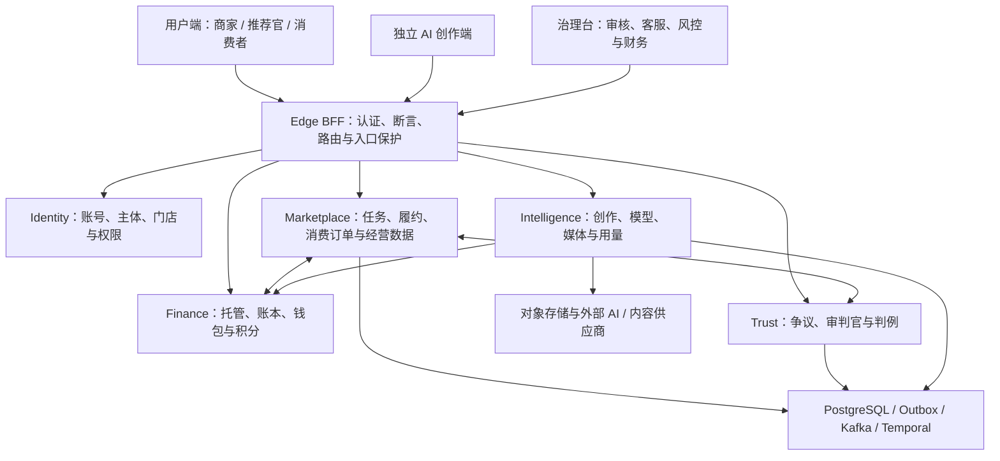

# 项目整体梳理与复核

日期：2026-09-10。代码基线：`0fa20962d7155f0f2c995c7b1b64a5a446f75b85`。本报告续接全项目梳理任务，并复查 9 月 9 日审查之后的四批修复。

**后续修复更新：当前工作区已完成两批修复。** A / B 资金问题新增 13 项永久回归，资金定向 38 项、Marketplace 全量 766 项实跑通过，见 [资金修复记录](资金异常恢复修复-2026-09-10.md)。C 的 DNS 启动耦合、D 中的共享凭据清理及 CI 覆盖率接线也已修复，Intelligence 1,466 项和前端 1,591 项实跑通过，见 [稳定性与 CI 修复记录](稳定性与CI门禁修复-2026-09-10.md)。最新 Java 全量命令与全部已配置覆盖率门禁通过。以下正文保留审查基线的发现和首轮测试记录；历史 Kafka 单次超时与生产门禁仍单独保留。

项目已经具备商家、推荐官、消费者、AI 创作和治理运营的完整业务骨架，代码和自动化测试的投入也较充分。它适合继续进行受控的 Sandbox 验收；真实资金上线仍有明确门禁，异常恢复、外部依赖验收和运维收口仍需完成。不能用页面数量或任务书的“已完成”直接推导出“可以全面上线”。

本轮最需要先处理的是 **分账成功回复丢失后仍允许退款（P1）** 和 **支付重试/待核对队列衔接不完整（P2）**，均已隔离复现。前端 1,591 项全量与覆盖率通过；后端首轮全量未通过，失败归因、定向复测和补跑结果详见第 7 节。

本次交付为代码与业务审查报告、验证记录和隔离复现材料，没有修改业务实现。测试产物在 [本轮验收目录](../../test-artifacts/project-audit-2026-09-10)。本地已运行的 Docker 业务服务没有重新部署，因此不能把它们的页面或接口表现等同于本次 HEAD。

## 1. 项目结构与代码规模



前端使用 Vue 3、TypeScript、Pinia、Vite；后端使用 Java 25、Spring Boot 4.1、WebFlux/R2DBC。三个 HTML 入口独立装配，AI 创作业务复用前端视图与组件；Node 运行时用于前端和工程工具，业务后端已迁入 Java。

按 `git ls-files` 统计，排除测试与构建目录，当前有 **343 个前端源码文件、76,145 行；1,232 个 Java 主源码文件、137,445 行**。另有 170 个就近前端测试文件、8 个仓库工具测试文件、551 个 Java 测试目录文件、8 个 Playwright spec、223 个迁移 SQL。这里统计文件，不把测试基类或工具类算作独立业务用例。详情见 [统计记录](../../test-artifacts/project-audit-2026-09-10/code-metrics-verified.json)。

| 服务 | 主源码文件 / 行数 | 主要职责 |
| --- | --- | --- |
| Edge BFF | 22 / 1,905 | 公共入口、会话与移动 token、身份断言、CSRF/路由隔离 |
| Identity | 244 / 23,115 | 统一账号、角色、商家主体、门店、成员、准入与合规 |
| Marketplace | 281 / 30,525 | 发任务、报名、履约、退出、消费交易、分销归因与统计 |
| Finance | 76 / 8,556 | 资金托管、账本、支付退款分账、钱包、积分结算 |
| Trust | 90 / 9,414 | 争议、质证、开庭、投票、上诉与判例 |
| Intelligence | 468 / 59,837 | 图文/视频/图片创作、模型控制面、BYOK、素材、预算与用量 |

其余代码是 8 个共享平台模块及 database-bootstrap、release-migrator。模块边界总体清楚。主要维护成本集中在 Marketplace 与 Intelligence；现阶段更适合收紧它们内部的职责边界，不宜为缩短文件而继续拆出新的微服务。

## 2. 主要业务链路是否闭合

| 业务链路 | 当前实现 | 完整性判断 |
| --- | --- | --- |
| 账号与商家组织 | 注册登录、身份切换、商家准入、主体/门店、子账号、首登改密、专业后台角色 | 基础链路已实现；登录与 `/me` 的角色响应已统一。资源权限仍应以服务端权威成员关系为准 |
| 商家任务与推荐官履约 | 发布、报名/选择、名额、冻结任务条件、交付、核验、确认、结算；延期、退出、里程碑与失约处置 | 正常与多种异常分支都有实现；协商退出资金腿的自动恢复仍值得专项补齐 |
| 消费交易 | 套餐版本、库存、下单、支付、关单、到店核销、冷静期、售后、退款、分账、暂扣与评价 | Sandbox 主干齐备；资金结果未知时的状态收敛仍是本次复核重点 |
| 分销与经营统计 | 推广链接归因、订单冻结分配、退款事实、净额佣金、商家信用、经营看板 | 四批修复已补齐主要口径问题；历史数据修复和真实营销流量校准未在本轮验证 |
| 争议治理 | 举证/质证、资格与利益冲突、随机面板、投票、上诉、客服终审和判例 | 当事人回避与开庭条件已有统一修复；需继续保留重审、补席及异常恢复覆盖 |
| AI 创作 | 独立创作入口、任务联动、图文、探店文案、图片、脚本、分镜、视频工作流、素材与草稿版本 | 主要创作链已实现；供应商代码存在不等于已完成公网、回调、账单和成片质量验收 |
| AI 商业化 | 平台模型/BYOK、预算、并发租约、积分预留/扣减/补偿、实际用量差额结算 | 内部账务能力已实现；真实换算政策与真实购买仍受财务和 PSP 门禁约束 |
| 治理后台 | 用户/组织/内容审核、客服与风控处置、退款与归因、模型/凭据/价目管理 | 有角色分工及服务端权限；待人工核对的资金操作还应形成可操作的处理队列 |

消费链路中的关键区别是：**“已核销”不等于“已分账”**。`redeemed_at`、`split_eligible_at`、`split_completed_at` 和累计退款额分别表达履约、冷静期、结算事实及资金变化。部分退款还可能保留继续核销或净额分账的义务。后续功能应围绕这些业务事实扩展，避免只判断一个 `status` 字符串。

同样，推荐官与商家是合作的两方；同一商家的两个账号仍属于同一方。审判资格和“能否参与这个案件”也应分开。上一轮 R04/R05/R06 的修复已按这一原则落地。

## 3. 上一轮问题的复核

不能继续把 [9 月 9 日报告](全项目审查-2026-09-09.md) 的 13 项问题全部列成当前未修复问题。当前代码已有以下修复：

| 原编号 | 当前代码与回归落点 | 本轮判断 |
| --- | --- | --- |
| R01/R02/R03/R07 | `CommerceFundOperationRepository`、支付取消补偿、`claimSplit`、`NetSplitAllocation`、LIMIT 前过滤 held；`CommerceFundRaceIT` | 已落地主要修复；分账回复丢失与资金调度衔接仍需本轮独立复核 |
| R04/R06 | `DisputeConflictContextResolver`、统一开庭条件、数据库面板约束 | 已有针对性修复与回归，不重复列成原缺陷 |
| R05 | `respondNegotiatedExit` 接收服务端解析的业务方，并在幂等分支前拒绝同侧确认 | 已有针对性修复与回归 |
| R08/R09/R10 | 无责退出事务边界、售后退款意图和统一收尾、退出原因与声誉口径 | 已有针对性修复与回归 |
| R11/R12 | `AuthUserResponseBuilder`、密码校验专用有界执行器 | 已有针对性修复与回归 |
| R13/T01 | 退款事实按发生时间入窗、实付归因与净额佣金、商家信用测试独立筛选数据 | 已有针对性修复与回归 |

修复代码仍不能替代历史数据诊断。三份已提交诊断脚本和交付记录明确保留了生产数据检查、真实浏览器验收等未完成事项。本轮没有连接生产数据库，也没有将历史测试记录冒充本轮重新执行结果。

## 4. 当前异常恢复问题

本轮确认 **2 项资金业务缺陷（1 项 P1、1 项 P2）**，用 3 个独立场景复现；另发现外部 DNS 引发的启动耦合及测试稳定性问题。资金测试使用真实 Marketplace HTTP、业务服务、事务和 Testcontainers PostgreSQL，远端 Finance 使用受控响应；没有调用真实支付，也没有声称发生线上资金损失。

### A. [P1] 分账结果未知时提前释放互斥状态

位置：[CommerceService.java:837](../../platform-java/services/marketplace-service/src/main/java/com/grassland/marketplace/commerce/CommerceService.java#L837)、[CommerceRepository.java:600](../../platform-java/services/marketplace-service/src/main/java/com/grassland/marketplace/commerce/CommerceRepository.java#L600)。

`attemptSplit` 对整个外部调用和本地收尾链使用同一个 `onErrorResume`，所有错误都会将 `splitting` 恢复为 `redeemed/partially_refunded`。其中既包含明确拒绝，也包含网络断开、回复丢失和本地提交失败。后几类不能证明 Finance 没有成功分账。

一旦返回可售后状态而 `split_completed_at` 仍为空，开售后及裁定退款就可能通过“尚未结算”的判断。Finance 仍保留结算后退款/冲销能力，因此不能依靠 Finance 自动实现 Marketplace 的“结算后禁止退款”产品规则。

复现：模拟远端分账已提交、成功回复丢失，本地回到 `redeemed` 且 `split_completed_at=null`；随后售后开案返回 **201**，裁定退 3,000 分返回 **200**，并实际调用了模拟 Finance 的退款入口一次。该问题属于原 R02 修复后仍未覆盖的异常分支；正常的“分账在途与售后并发”已有保护，不能将两者混为一谈。

证据：`splitSuccessWithLostReplyMustNotPermitARefund` 期望退款调用 0 次，实际 1 次；见 [专项 JUnit XML](../../test-artifacts/project-audit-2026-09-10/TEST-com.grassland.marketplace.commerce.ProjectAuditFundRecoveryIT.xml)。

建议：仅在确认未发生资金动作时归还占位；未知结果应保留可恢复状态、稳定操作键与租约，按键查询/重放并写回结算事实。外部成功后的本地收尾失败也走这一恢复路径。验收至少覆盖回复丢失、5xx、数据库提交失败、重启，以及每个窗口内的售后和暂扣。

### B. [P2] 普通支付调度没有完整使用资金操作状态

位置：[CommerceRepository.java:959](../../platform-java/services/marketplace-service/src/main/java/com/grassland/marketplace/commerce/CommerceRepository.java#L959)、[CommerceService.java:654](../../platform-java/services/marketplace-service/src/main/java/com/grassland/marketplace/commerce/CommerceService.java#L654)、[CommerceFundOperationRepository.java:112](../../platform-java/services/marketplace-service/src/main/java/com/grassland/marketplace/commerce/CommerceFundOperationRepository.java#L112)。

失败会持久化 `next_attempt_at` 和尝试次数，但 `pendingDispatch` 仍按订单状态和更新时间取批次，`attemptPayment` 也没有校验重试时间。进入 `needs_review` 的支付操作又会在执行层直接返回，订单仍可占据批次。

两个复现均成立：第一次失败后，下一次重试时间仍在未来，立即调度就再次调用支付，`attempts` 从 1 增为 2；将一笔较旧订单的资金操作置为 `needs_review`，批次设为 1，连续三轮都取到同一笔不可执行订单，后方正常订单一直停在 `pending_payment`。默认批次为 32 时，同类不可执行订单达到批次容量就有相同影响；未支付订单到期关单仍可收口，因此这里不声称队列永久停止。

证据：`pendingPaymentMustHonorPersistedRetryTime` 和 `needsReviewPaymentMustNotStarveAnEligibleOrder`；见同一份 [专项 JUnit XML](../../test-artifacts/project-audit-2026-09-10/TEST-com.grassland.marketplace.commerce.ProjectAuditFundRecoveryIT.xml)。

建议：在 LIMIT 之前按资金操作的可执行状态、到期时间和租约筛选；待人工处理项进入独立队列。统一“领取”和“失败”的尝试次数口径，并为待核对项提供审计、处理及恢复入口。需要覆盖“队头整批不可执行、后方仍有正常支付/退款/分账”的用例。

### C. [P2] 可选外部能力的 DNS 失败阻断 Intelligence 启动

位置：[FeishuClient.java:40](../../platform-java/services/intelligence-service/src/main/java/com/grassland/intelligence/imageanalysis/FeishuClient.java#L40)、[PinnedOutboundClients.java:34](../../platform-java/services/intelligence-service/src/main/java/com/grassland/intelligence/ai/PinnedOutboundClients.java#L34)。

本轮 Java 强制全量测试出现 `出站域名无法解析固定地址：open.feishu.cn`，使 `feishuClient` 构造失败并阻断整个 Spring 上下文。模型配置、预算、积分补偿等无关测试随后因上下文失败而跳过初始化。事后本机 DNS 可以解析该域名，说明测试受到真实外部解析状态影响；这些失败不能逐条计为相应业务功能的缺陷。

建议：测试对 DNS 使用确定性解析器；生产端将可选集成的可用性与主服务启动隔离，按需安全解析并允许受控重试。保留公网校验与 DNS 固定机制，不应通过关闭出站安全检查来消除失败。相关固定域名客户端也应一起检查。

### D. 测试稳定性：共享数据清理与 Kafka 恢复时序

Intelligence 的 4 个 `ShotAnchorImageIT` 用例在 `BeforeEach` 就因外键失败：清理代码只删除图片/视频能力的模型配置，却按共享 WireMock 的 `base_url` 删除更广范围的供应商凭据，其他能力仍可能引用它们。建议按用例所属的配置/凭据 ID 清理，避免共享 URL 被误用作数据隔离边界。位置：[ShotAnchorImageIT.java:91](../../platform-java/services/intelligence-service/src/test/java/com/grassland/intelligence/videoproduction/ShotAnchorImageIT.java#L91)。

Marketplace 的 `malformedPoisonGoesToDltWithOriginAndLaterValidEventProcesses` 在等待毒消息之后的正常事件时，45 秒内仍得到 0 而非 1。之后整个 Kafka 测试类 6 项通过；`ShotAnchorImageIT` 4 项及代表性的模型来源配置测试 6 项也在隔离复测中通过。由此将前者保留为时序波动，后者结合清理 SQL 定位为共享数据隔离问题，不据此声称相应生产功能失效。首轮失败见 [Java 汇总](../../test-artifacts/project-audit-2026-09-10/java-first-pass-summary.json)，复测见 [复测日志](../../test-artifacts/project-audit-2026-09-10/java-recheck.log)。

资金复现从仓库根目录执行以下命令。测试断言表达应满足的业务不变量，当前返回失败是缺陷证据；未通过删测试、放宽断言或修改实现把它变成绿色。

```bash
source scripts/lib/java-runtime.sh
ensure_java_runtime 25
./platform-java/gradlew -p platform-java \
  :services:marketplace-service:projectAuditFundRecovery \
  --init-script ../scripts/local/project-audit-2026-09-10/audit.init.gradle \
  --no-daemon --console=plain --max-workers=1
```

专项任务独立输出测试报告，不覆盖正常 `test` 任务的 XML。首轮正常测试报告也已在 `test-artifacts/project-audit-2026-09-10/java-first-pass-xml/` 归档。

## 5. 产品完整性与上线边界

| 优先级 | 仍需完成或补证据的事项 | 实现与验收的区别 |
| --- | --- | --- |
| 上线前阻断 | 真实 PSP/存管、资金合规结构 | 当前 `PaymentProviderAdapter` 的实现为 Sandbox，不发真实资金调用；D-01 明确禁止真实资金上线 |
| 上线前阻断 | 历史凭据轮换、供应商吊销、Secret Manager 与发布回退 | 当前跟踪文件扫描通过只能说明本次扫描范围，不能证明旧凭据已在供应商侧失效 |
| 上线前阻断 | 正式用户协议、隐私政策及保留规则 | `legal-docs.ts` 明确标记“未生效（占位预览）”；这是产品发布缺口，不是法律页面不存在 |
| 业务验证前 | 官方平台履约指标、真实归因数据 | 核验流程、人工复核、Webhook 与内部指标策略存在；真实数据源和计费依据仍需验收 |
| 业务验证前 | 真实视频/语音/Embedding 等供应商 | adapter、回调与工作流代码已存在；凭据、公网回调、成片质量、重试和供应商账单应分别留证 |
| 生产放量前 | TLS/LB、持久化 Kafka/Temporal/存储、告警送达与灾备 | 仓库有部署和门禁脚本；真实集群恢复、滚动发布、RTO/RPO 和资金对账演练不能由脚本存在替代 |
| 后续范围 | 原生 APP、小程序、原生扫码与端侧 E2E | 当前具备消费者 Web 与移动 token 协议，不代表已有原生客户端 |
| 后续范围 | 朋友圈参考来源创作 | `resolveWorkflow` 对 `moments + reference` 仍返回 `planned`；朋友圈其他已实现工作流不应一并误报缺失 |

依据包括 [权威开放项](../草场开发进度与续接指南.md#L1011)、[Sandbox 支付实现](../../platform-java/services/finance-service/src/main/java/com/grassland/finance/payment/SandboxPaymentProviderAdapter.java#L9)、[法律文档状态](../../src/views/legal/legal-docs.ts#L20)、[创作矩阵](../../src/config/ai-platform-capabilities.ts#L149)。外部验收状态按仓库记录判断，本轮没有调用真实支付或付费模型来更新这些状态。

## 6. 建议优化顺序

1. **先补资金异常恢复与队列前进性。** 明确区分“拒绝”“结果未知”“已成功待落库”，统一操作键、租约、退避与人工处理。把本轮隔离复现转为永久回归后，再扩展交易功能。
2. **补两类尚未完成专项验证的恢复路径。** 协商退出已支持重复确认后续传，但还应核查确认成功后资金失败的后台驱动；同步 AI run 的预算/积分预留应在进程被杀后能恢复。两项是代码路径评估与验证建议，本轮没有把它们计入已复现缺陷。
3. **让质量门禁真正覆盖 CI。** `platform-java/build.gradle.kts` 已为 `check` 接入 JaCoCo 阈值，但 CI 的 Java 命令是 `test + bootJar`，未调用 `check` 或 `jacocoTestCoverageVerification`。建议显式执行覆盖率门禁。前端测试明确限制并发，减少大视图编译、覆盖率和 JVM 同时抢资源引发的超时。
4. **继续按职责拆分大文件。** 五个重点视图目前为 619、88、591、646、618 行，分层和体积门禁均在；主要复杂度仍聚集在 `useVideoProduction`（1,059 行）、`useGrasslandGovernance`（945 行）及 `TaskController`（1,749 行）、`CommerceRepository`（1,270 行）。优先将取数、保存恢复、上传、生成、权限及不同领域端点拆开，保持现有 URL composable 和视图装配层。
5. **扩容前补跨实例配置刷新。** `TrustedOriginService` 明确使用进程内事件和缓存；其他副本可能一直保留旧配置到重启。单实例下这是已知边界，增加副本前应补共享事件/版本检查及停用配置生效测试。
6. **统一项目状态来源。** `docs/status.yaml` 仍限定 #22–#51，更新时间为 9 月 1 日；`docs:status` 通过只证明这个已声明范围自洽。建议扩展到实际任务范围，由一份结构化状态生成当前待办与摘要，历史证据保留但不再混作当前结论。
7. **安排开发依赖维护。** 本轮 npm audit 为 3 项 moderate、0 high/critical，集中于 Vitest 及其相关包。升级应一起验证 Vitest、coverage 和配置兼容性，避免直接强制修复造成测试链变化。

## 7. 本轮验证结果与证据

| 检查 | 结果 | 证据 |
| --- | --- | --- |
| 前端定向复测 | 3 文件、88 用例通过；原 5 个失败均为超时 | [定向日志](../../test-artifacts/project-audit-2026-09-10/frontend-recheck.log) |
| 前端全量与覆盖率 | 178 文件、1,591 用例通过，230.37 秒；语句/行 86.13%、分支 79.62%、函数 66.09%，达到现有阈值 | [全量日志](../../test-artifacts/project-audit-2026-09-10/frontend-verified.log) |
| lint / 文件体积 | 0 error、7 warning；体积门禁通过 | [lint 日志](../../test-artifacts/project-audit-2026-09-10/lint.log) |
| TypeScript | 通过 | [类型日志](../../test-artifacts/project-audit-2026-09-10/typecheck.log) |
| 三入口生产构建 | 通过；Vite 构建阶段 20.32 秒 | [构建日志](../../test-artifacts/project-audit-2026-09-10/build.log) |
| 文档状态 / 已发布迁移 / 敏感信息扫描 | 通过；迁移 manifest 7 文件，敏感信息扫描 3,104 文件 | [检查摘要](../../test-artifacts/project-audit-2026-09-10/checks-summary.txt)；文档状态范围限制见上文 |
| npm 依赖扫描 | 3 moderate，0 high/critical | [审计 JSON](../../test-artifacts/project-audit-2026-09-10/npm-audit.json) |
| Java 强制全量首轮 | 未通过：实际执行 3,483 项，通过 3,261 / 失败 222 / 跳过 0；34 分 31 秒。Intelligence 217 项上下文失败、4 项清理外键失败；Marketplace 1 项 Kafka 时序超时。Trust 和 release-migrator 未进入本轮执行 | [Java 日志](../../test-artifacts/project-audit-2026-09-10/java-tests.log)、[按模块汇总](../../test-artifacts/project-audit-2026-09-10/java-first-pass-summary.json) |
| Java 失败类定向复测 / 格式 | Kafka 6 项、模型来源配置 6 项、镜头锚定图片 4 项，共 16 项通过；Spotless 通过。此命令中的 Trust/迁移显示 UP-TO-DATE，不计为实际补跑 | [复测日志](../../test-artifacts/project-audit-2026-09-10/java-recheck.log)、[复测汇总](../../test-artifacts/project-audit-2026-09-10/java-recheck-summary.json) |
| Trust / release-migrator 强制补跑 | 使用任务级 `--rerun` 实际执行，Trust 246 项、release-migrator 2 项全部通过；3 分 9 秒 | [补跑日志](../../test-artifacts/project-audit-2026-09-10/java-remaining.log)、[补跑汇总](../../test-artifacts/project-audit-2026-09-10/java-remaining-summary.json) |
| 本轮资金专项复现 | 3 个场景均在业务不变量断言失败，确认 A/B 两项缺陷；67 秒 | [隔离测试源码](../../scripts/local/project-audit-2026-09-10/java/com/grassland/marketplace/commerce/ProjectAuditFundRecoveryIT.java)、[专项日志](../../test-artifacts/project-audit-2026-09-10/fund-recovery-probes.log) |
| Playwright | 发现 8 spec、三浏览器共 81 个测试；本轮仅检查用例发现 | [E2E 清单](../../test-artifacts/project-audit-2026-09-10/e2e-inventory.log) |

前端第一次全量并发运行曾出现 5 个 5 秒超时和 1 个 worker 通信超时；降低并发后定向与全量均通过，未修改测试超时、业务代码或断言。不能把第一次运行简单表述为“5 个功能坏了”，也不能把波动记录删掉。

Java 的定向复测只覆盖所列测试类，并没有重新执行全部初始化失败用例。因此本报告保留“Java 首轮全量未通过”，不以定向绿灯替代完整门禁结果。

所有检查结果另汇总为 [verification-summary.json](../../test-artifacts/project-audit-2026-09-10/verification-summary.json)。

本次覆盖模块结构、产品范围、关键状态机、四批修复、全量自动化执行及定向故障注入；不代表逐行审阅全部源码。未重新执行完整 Compose/Playwright E2E、当前 HEAD 的明暗主题和移动端视觉验收、生产数据诊断、真实供应商验收或灾备演练，因此没有作出生产发布通过的结论。
