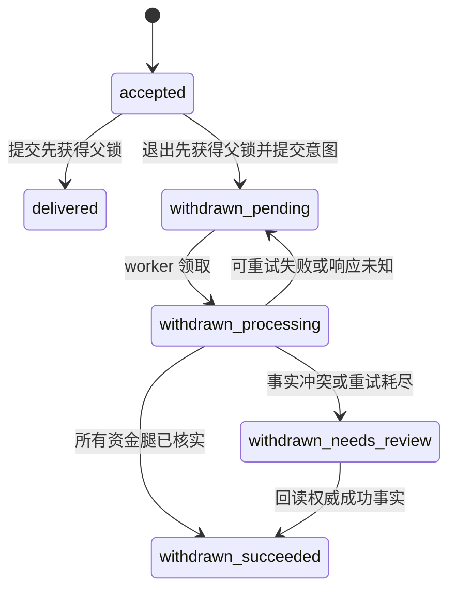

# 开发规格：全模块业务一致性修复与工程优化（草场任务书 #103）

> 任务书版本：1.1 ｜ 编写日期：2026-09-15 ｜ 复核修订：2026-09-17 ｜ 采用模板：2.4.1
> 规格作者、实施统筹与集成验收负责人：当前主程 Codex；后续执行者承接同一职责。
> 仓库：`/Users/LXH/claude/y-1` ｜ 核验分支：`main` ｜ 代码基线：`2f27a40b885bc092c2034c223b22f181087d1f34`。
> 文档状态：IMPLEMENTED ｜ 复核状态：COMPLETED（本地验证） ｜ 执行模式：AUTO_CHAIN。
> 原实施在 2026-09-16 标记收口；本轮用户要求复核时发现资金恢复、注销屏障、通知、指标与验收工具漏项，现已修复并完成本地回归。§10/§11 的 VERIFIED 为原实施记录，本次结论以新增复核记录与实跑证据为准。

依据：[本轮审查报告](../reviews/全模块业务与代码审查-2026-09-15.md)、[任务书模板](任务书模板.md)、[AGENTS.md](../../AGENTS.md)、[产品设计规范](../../DESIGN.md)、[治理台设计规范](../../src/ops/DESIGN.md)、[目录地图](../架构/目录结构.md)。

业务约束承接 [#52 成员池](草场任务书-52-成员池与门店分配.md)、[#96 履约](草场任务书-96-合作最小完整履约.md)、[#97 资金与退出](草场任务书-97-资金与规则收口.md)、[#98 经营度量](草场任务书-98-推广链接、数据来源与经营度量.md)、[#101 图文创作](草场任务书-101-AI创作工作流与图文交付升级.md)、[#102 画布修复](草场任务书-102-创作画布复盘修复与真实闭环验收.md)、[ADR D01](../adr/D01-psp-escrow-compliance.md) 与 [ADR D10](../adr/D10-data-retention-redaction.md)。旧任务书的历史迁移编号、旧目录和旧设计名称不能覆盖当前仓库事实。

阅读导航：§1 为全模块范围；§2 为已证实问题与基线；§3～§8 为已选定的行为、契约与数据设计；§9 为精确写入清单；§10～§11 为实施卡；§12 为逐用例验收；§13～§14 为阻塞与交接。执行某张卡时同时读取其引用的全局条款，不需要重新推导产品决策。

## 0. 执行协议

1. `FACT` 是已读源码、原有检查或隔离复现确认的事实；`DECISION` 是本书确定的未来实现；`FIXTURE` 是合成测试数据。未新增的符号和路径统一标为 `NEW`。
2. 本次编写只改变本任务书、任务书索引、进度指南与审查后续链接。保留已有审查报告和索引改动；不修改业务源码，不提交、推送或部署。
3. 用户启动实施后按 C103-01～C103-27 连续执行。每卡完成定向验证即转下一卡，不逐卡请求继续；普通编码、测试修正和本地可逆验证由执行者处理。未明确授权时不自动启动子代理。
4. 卡状态为 `NOT_STARTED → IN_PROGRESS → IMPLEMENTED → VERIFIED`；真实依赖阻塞时记 `BLOCKED`。`IMPLEMENTED` 只表示代码完成，全部 AC/TC/V 和证据满足后才是 `VERIFIED`。
5. 全仓模块盘点不等于每行代码都存在缺陷。九项已确认问题优先修复；没有确认缺陷的模块执行影响回归，不借机重写、重做视觉或添加业务能力。
6. 写入集合是 §9 与当前卡文件表的交集；路径引用使用仓库相对路径，最终对话链接使用绝对路径。新增必需文件须先在本书登记完整路径与归属，再继续；同一决策范围内的普通登记修订不要求额外用户审批。
7. 修复必须同时覆盖状态竞争、鉴权、幂等、未知结果、可恢复性和可观测性。不得以隐藏按钮、扩大超时、吞掉异常、降覆盖率或删除断言代替修复。
8. `scripts/local/project-audit-2026-09-15/` 的探针断言的是“缺陷可出现”。迁入正规测试后必须改为断言目标不变量；不能把原探针 PASS 当修复 PASS。
9. 保留测试原始证据与执行版本。常规完成信息在对话中汇报，不强制另写逐卡完成报告；临时日志、截图、数据库核对结果进入 `test-artifacts/task-103/`。
10. 本地隔离库、Sandbox 账本和合成账号可按实施范围验证。生产发布、生产历史数据写修复、真实资金、真实供应商计费和对外通知均不由本文自动授权；相关脚本先做成可审阅、默认只读的交付物。

## 1. 目标与范围

### 1.1 总目标与交付边界

使资金动作、履约状态、通知、个人数据生命周期和前端当前对象保持一致；使经营指标来自可解释的业务事实；通过可重放的并发与故障测试防止新增模块再次漏接。

交付包括九项缺陷修复、退出自动恢复、生命周期与事件接入门禁、受信端点缓存失效、五个 Java 热点类分层、测试资源治理、迁移器故障覆盖、历史诊断工具及三入口集成验收。27 张卡按正确性、接入、结构和收口四阶段执行，不以大量新增测试数作为唯一完成标准。

### 1.2 需求追踪入口

| 需求 | 内容 | 来源与风险 | 责任卡 |
|---|---|---|---|
| REQ103-01 | 无责/协商退出先取得业务终止权，再按冻结金额处理资金；自动恢复并可查询 | R01，P1；协商恢复为关联优化 | C103-02～04、18 |
| REQ103-02 | 买家、售后裁定、运营三条退款入口与分账原子互斥；Finance 拒绝新增结算后退款 | R02，P1 | C103-05～06、18 |
| REQ103-03 | 新旧创作资源、排队任务、派生对象和凭据接入注销；完成状态真实 | R03，P1 | C103-08～10、18 |
| REQ103-04 | 争议列表/详情等待身份恢复，切案和换号时读写对象一致 | R04，P1 | C103-11～12 |
| REQ103-05 | 新履约事件真正生成通知、邮件任务及可定位对象的链接 | R05，P1 | C103-13～14、18 |
| REQ103-06 | 汇总、趋势、排行、看板、导出和告警共享事实口径 | R06，P2 | C103-15～16、18 |
| REQ103-07 | 部分退款且仍可履约的订单能读取、展示并使用原核销码 | R07，P2 | C103-07 |
| REQ103-08 | 建号挂店、分配、调店、改角色共同防止新增多店长和多店归属 | R08，P2 | C103-17～18 |
| REQ103-09 | 修复文档示例扫描与部署契约两个 CI 失败，保持真实安全门禁 | R09，P2，但置于首卡 | C103-01 |
| REQ103-10 | 新资源/事件/后台任务必须登记生命周期、消费者和反例测试 | 审查工程建议，P2 | C103-19 |
| REQ103-11 | 多副本受信端点撤销有确定上界；陈旧策略不能无限放行 | 当前代码明确单实例限制，P2 | C103-20 |
| REQ103-12 | 拆分五个 Java 热点类，维持五个大视图装配层和共享能力 | 审查维护性建议，P2 | C103-21 |
| REQ103-13 | 测试消除资源争用和泄漏，稳定复现并发、乱序与崩溃 | 三项并发测试超时、迁移器低覆盖，P2 | C103-22～23 |
| REQ103-14 | 空库/升级/重跑/失败恢复与发布回退可验证 | 全部数据变更的交付要求 | C103-23、26 |
| REQ103-15 | 全模块覆盖有映射，九项缺陷有跨域、浏览器和证据收口 | 本次全项目审查的验收目标 | C103-18、24～27 |

### 1.3 全模块实施与回归地图

下表的“保持”表示维持已有产品决策并纳入回归，不表示代码逐行无缺陷。所有行都由 C103-24/27 汇总证据；重点列写明额外修复卡。

| 模块 | 用户能完成的功能 | 本书动作与边界 |
|---|---|---|
| Edge BFF / 三入口 | API 分发、会话、移动 token、内部断言、CSRF、应用隔离 | C01/03/24；新增路由登记，关闭路由继续 404，禁止回退到旧 Node 后端 |
| 注册登录与验证码 | 邮箱验证码、账号/邮箱登录、改密、绑邮箱、登出 | 保持；C11/24 验证恢复态、匿名和失效会话 |
| 身份与跨应用免登 | 商家/推荐官切换、多设备撤销、一次性 SSO | 保持；C04/10～13 验证 AccountTicket 和受众约束 |
| 主体/品牌/账号前缀 | 建主体、更名、品牌、单店/多店、账号命名 | 保持；C17 验证 owner/admin 与成员关系 |
| 门店与成员池 | 建号、分配、调店、改角色、回池、停用恢复 | C17；不恢复店长自行建号，不自动降职存量店长 |
| KYB / 权限审核 | 材料、审核、权限升级、额度、SLA | 保持；C09/24 验证组织材料保留与审核授权 |
| 推荐官资料与等级 | 画像、社交账号、认证、等级权益、准入 | 保持；不将自报数据升级为平台事实 |
| 通知与邮件 | 站内、未读、邮件、外部投递任务、深链 | C13～14；默认不启用未配置的 Push/SMS |
| 数据导出与注销 | 五域检查、保留期、PII 清理、审计 | C08～10；导出仍限个人资料与收支记录 |
| 任务草稿与发布 | 三类模板、审核、合同快照、修订、关闭 | 保持；C02/24 验证冻结合同与版本冲突 |
| 报名撮合与邀请 | 报名/撤回/接受/拒绝、名额、自动接受 | C02/03 验证名额只释放一次，不重写 acceptance Saga |
| 交付期限与延期 | 截止、提醒、补救、延期、超时终结 | C02/13/14；原合同期限不因通知补发而偷偷重置 |
| 体验权益 | 预约、兑现、确认、商家失约主张/回应、押金 | C02/13/24；已消费不能绕过无责退出限制 |
| 草稿审稿 | 附件、审稿窗口、限次退改、自动通过/转人工 | C02/13/14；提醒与真实审稿目标关联 |
| 履约凭证与核验 | 链接/截图/文本、AI 核验、人工覆盖、官方核验 | C02/24；不把 WireMock 结果当官方平台数据 |
| 里程碑与退出 | 阶段确认、取消补偿、无责/协商退出、预演 | C02～04；金额以终止时冻结快照为准 |
| 任务结算 | 验收、观察期、争议挂起、财务回读与恢复 | C03/24；保留原结算工作流及财务权威事实 |
| 声誉与商家信用 | 完成率、失败率、评分、等级、信用软排序 | C04/24；无责/协商退出不进入失败分母 |
| 套餐、时段与库存 | 上下架、版本、库存、推广任务关联 | C05/07/24；部分退款不额外释放完整库存 |
| 消费者订单 | 下单、支付、取消、核销、退款、售后、评价 | C05～07；区分支付、履约、退款和分账事实 |
| 归因与推广链接 | last-touch、链接失效、分配、申诉、纠错 | C15/16；不回填历史归因、不改变 7 天窗口 |
| 消费分账与暂扣 | 冷静期、人工暂扣、净分账、失败重放 | C05/06/15；flagged 仍不能自动阻断结算 |
| 钱包、托管与账单 | 双录账本、押金、提现、月账单、流水导出 | C03/06/24；不做应收追偿，不改已过账分录 |
| AI 积分、BYOK 与预算 | 免费额度、购包、预留/差额、个人/组织密钥和预算 | C08～10/24；账单事实保留，组织密钥不随个人删除 |
| 争议受理与举证 | 小法庭/客服直裁、答辩、质证完毕、证据授权 | C11/12；原证据不能迁写到其他案件 |
| 审判、上诉与判例 | 考试、池管理、回避、抽签、投票、上诉、公开判例 | C12/24；保留服务器 viewerRole 和证据脱敏 |
| 风控、投诉与运营处置 | 信号、调查、投诉、审计、DLT/对账 | C03/14/18；仅增加定位与安全重试，不加任意资金按钮 |
| 经营分析 | 汇总、趋势、排行、ROI、告警、CSV/XLSX | C15/16；指标来源、时间窗口与待结/已结分开 |
| AI 模型控制面 | 端点、凭据、能力、协议、主备、价目、并发槽 | C20/24；受信缓存有界，真实厂商容量另验 |
| 创作入口与项目 | 任务/自由创作、上下文、最近项目、草稿和自动保存 | C08～10/24；保持账号、任务来源与组织范围 |
| 热点与灵感 | 多源榜单、历史筛选、主题带入、助手 | 保持；公共缓存与个人原稿分开保留 |
| 文章与平台文案 | 标题、大纲、正文、检查修复、去 AI 味、多平台表达 | C09/21/24；不修改生成质量策略 |
| 朋友圈与创意脚本 | 图片/视频配文、朋友圈文案、风格和喜剧脚本 | C09/24；覆盖 generation 历史与输入残留 |
| 图片分析与编辑 | 点评、风格、提示词、参考图、生成和编辑 | C09/24；媒体与费用结果清理边界一致 |
| 图卡与视觉内容 | 系列图卡、信息图、封面、配图、模板成品 | C08～10/21；operation/item/artifact 全链纳入 |
| 新图文工作台 | 原稿导入、文本提案、视觉计划、报价、生成与采用 | C08～10/21；#101 默认开关保持关闭，专用测试显式打开 |
| 排版、导出与公众号 | 渲染、文件包、公众号连接、上传、草稿同步与核实 | C08～10/21；unknown 不重发 draft/add，第三方已生成草稿不擅自删除 |
| 视频解析与分析 | 抖音/B站来源、媒体代理、分析、脚本改编和复刻 | C09/24；外部平台真实可用性保持单独门禁 |
| 视频制作 | 分镜、镜头候选、配音/BGM、生成、合成、下载、恢复 | C08～10/24；识别排队、费用未结与供应商未知结果 |
| 分镜画布 | 节点连线、布局、AI 计划、应用、方案派生与交付 | C09/10/24；保持 #102 父锁与版本规则 |
| 媒体与素材库 | 上传票据、签名、个人/门店/公共库、授权、审核、删除 | C09/10；先记录对象清单再删引用，保留共享/证据租约 |
| 语音、嵌入与语义检索 | 转写、时长、Embedding、推荐检索 | C08/09/24；向量和原文同步清理 |
| 游客体验 | 有限入口、配额与限流 | 保持；不关联清除不可归属的公共/匿名数据 |
| 治理台 24 页签 | 审核、财务、订单、经营、AI、内容、风险等工作台 | C03/16/25；以 `adminTabs.ts` 为唯一页签清单，角色逐项冒烟 |
| 迁移与八个共享库 | bootstrap、release-migrator、HTTP/安全/财务/存储/消息等 | C19/22/23/26；不新增微服务、不复制基础库 |

### 1.4 范围外

真实 PSP/存管接入和真实提现；新移动 App/小程序；新增内容供应商；接入官方履约指标；付费互动重新开放；重做营销归因政策；改变法务保留期；生产历史数据自动修补；全站视觉改版；无证据的框架升级、数据库拆分或服务拆分。

### 1.5 不许顺手修

不改已发布 SQL；不重命名既有历史任务号；不扩大 `docs/status.yaml` 的 #22～#51 统计范围；不删除存量多店长；不强制迁移旧归因；不清理他人工作区；不因 R09 放宽所有文档扫描；不移除四个 Vue 豁免后以新豁免替代；不把 `unknown` 批量改成失败；不自动补发所有历史通知。

## 2. 仓库上下文与事实基线

### 2.1 已核验架构

`index.html` 为用户端，`ai.html` 为 AI 创作端，`ops.html` 为治理台。Java 25 / Spring Boot / WebFlux / PostgreSQL / R2DBC；六个常驻服务，两个迁移应用，八个共享 Java 模块。跨域通过现有 API、内部断言、outbox/Kafka/Temporal 协作。运行时代码不得跨服务直接 SELECT 或 UPDATE 其他域表。

模块清点为前端 414 个源码文件/88,915 行、Java 主源码 1,329 个/155,280 行、237 个 SQL 迁移；仅用于描述核验基线，不作为实施文件额度。稳定符号优于行号，开工先比较当前 HEAD 与该基线的实际漂移。

### 2.2 九项已确认问题 FACT

| 编号 | 关键源码锚点 | 已观察结果 | 目标不变量 |
|---|---|---|---|
| R01 P1 | `ApplicationLifecycleService.exitNoFault`、`TaskApplicationRepository.exitNoFault` | Finance 回复期间提交成功；资金释放后退出 409，报名仍 accepted | 业务竞争败方不能发起资金动作 |
| R02 P1 | `CommerceService.refund`、`CommerceRepository.requestRefund`、`ConsumerPaymentService.refundFresh` | 分账完成后旧快照仍推动新增 1,000 分退款 | 新退款与已结算事实互斥，两域都守住 |
| R03 P1 | `PersonalDataErasureRepository（原 IntelligenceComplianceRepository 职责已并入）.activeJobCount/erasePii`、`ComplianceService.eraseAccount` | 旧草稿已删而原稿/画布/有效凭据仍在；queued 同步未计阻塞 | 资源/任务全部接入；未清完不能完成 |
| R04 P1 | `DisputeDetailView`、`DisputeListView`、`DefaultLayout` KeepAlive | 案情 A 留在页面，答辩写到 B；冷启动会话未恢复就跳首页 | 可见案号、已加载案号和写入案号一致 |
| R05 P1 | `NotificationTemplates`、`NotificationRecipientResolver`、`NotificationEventProcessor` | 五个时间敏感事件进入真实 processor 后 IGNORED | 事件实际送达正确账号，重复消费不重复通知 |
| R06 P2 | `AnalyticsRepository.report/series/recommenderReport` | 100 元支付/30 元退款显示 0/0；未支付取消单计正收入 | 钱与人数取事实，不用状态白名单替代 |
| R07 P2 | `CommerceService.redeemCode/redeem` | 部分退款后 POST/GET 不给码，保存的旧码仍能核销 | 展示能力与实际核销资格同源 |
| R08 P2 | `StoreAssignmentService.assign`、`OrgSubAccountService.grantMembership` | 两次 count=0 的分配事务均成功，产生两个新店长 | 新增唯一性在事务内成立，存量只减不增 |
| R09 P2 | `edge-entrypoint.contract.test.ts`、文档、secret scan | 一项稳定前端契约失败，两个文档示例触发扫描 | 文档契约与权威说明一致，安全规则继续有效 |

R05 五个直接复现的事件为 `DeliveryDeadlineExpiring`、`DeliveryExtensionRequested`、`DraftReviewExpiring`、`EngagementExitRequested`、`BenefitDefaultClaimed`。§6.4 扩到完整关联事件族，是防止只接一半流程的目标范围；不把未逐项复现的事件一律描述为已证实故障。

### 2.3 已执行检查与复现证据

| 检查 | 审查基线结果 | 本书如何使用 |
|---|---|---|
| 前端 lint、三入口构建含 vue-tsc | PASS | 基线，不是未来改动的 PASS |
| 首次前端 coverage | 1,992 通过/4 失败，另有 worker 超时 | 三个超时受并发资源影响，C22 处理稳定性 |
| 单 worker 重跑 | 1,995 通过/1 失败；229 文件、1,996 用例 | 稳定失败为 R09；不能写“前端全绿” |
| 前端覆盖率 | lines/statements 87.15%、branches 80.42%、functions 68.63% | 既有阈值通过，但总命令仍失败 |
| Java 全量及已配置覆盖率门禁 | 3,993 通过、0 失败/跳过；16 模块，105 task 实执行，31 分 50 秒 | 不为写任务书重复长跑；实施收尾需重跑 |
| 六服务指令覆盖率 | Edge 83.76%、Identity 83.42%、Marketplace 86.98%、Finance 88.34%、Trust 83.50%、Intelligence 82.87% | 不削弱门禁；重点补故障与并发 |
| release-migrator | 指令覆盖率 26.07%，未配阈值 | C23 新增故障覆盖和阈值 |
| 隔离探针 | Java 13 个 + Vue 3 个全部复现缺陷 | FIXTURE 只证明问题，不证明渠道可用 |
| secret scan | FAIL，两个文档示例 | 不是本次发现生产密钥泄露的证据 |
| 文档/已发布迁移 | links 1,249/0 错；status PASS；7 个已登记迁移 checksum PASS | status 只覆盖旧范围，迁移检查不代表空库升级已验 |

证据根为 `test-artifacts/project-audit-2026-09-15/`；重点是 `inventory.json`、`java-baseline-summary.json`、`java-baseline-xml.tar.gz`、`frontend-coverage-summary.json`、`probe-summary.json` 和原始日志。Java 原始报告已在探针执行前归档。临时探针源码在 `scripts/local/project-audit-2026-09-15/`；这两个路径均被 Git 忽略，后续执行机若缺失，使用正式源码锚点重建合成反例，不把文件缺失当成必须访问生产的理由。

### 2.4 写作与实施的验证边界

本书编写不调用真实模型、支付、公众号、外部通知或生产库。C103-24/25 的“真实栈”指本次代码构建的本地/CI 服务、真实路由、数据库、队列和浏览器，外部不可逆服务仍用明确标识的 Sandbox/测试适配器；真实渠道验收单列，不能用前者替代。

## 3. 已选定的技术决策 DECISION

| 决策 | 唯一方案 | 原因与兼容要求 |
|---|---|---|
| D103-01 退出终止权 | 同一 `task_application` 父行锁下校验全部前提、冻结结算快照、写退出操作并终止合作；事务提交后才发 Finance | 不依靠远端调用后的本地回滚；保留 withdrawn/exit_kind 旧业务字段 |
| D103-02 退出资金恢复 | 新增专用 `engagement_exit_operation` 与资金腿表，复用现有租约 dispatcher 模式；同步接口只做一次有界尝试，后台持续收敛 | 不把订单的 `commerce_fund_operation` 硬塞进履约域；不再依赖用户反复确认 |
| D103-03 退款互斥 | Marketplace 订单行条件更新 + Finance payment 父行锁双层保证；已存在同键退款先匹配回读，新增结算后退款拒绝 | 不恢复追偿、不因旧退款重放改写已过账金额 |
| D103-04 经营时间轴 | 保留既有订单分析的 `created_at` cohort：选定时间内创建的订单，截至本次 asOf 的支付/退款/结算事实 | 避免未经说明把历史趋势改成资金日记账；退款发生时间保留在独立流水，不冒充 cohort 日退款 |
| D103-05 经营金额 | 未结只显示预估；已结取 Finance 确认的不可变净分配快照；订单冻结原始分配不覆盖 | 复用 `NetSplitAllocation`；引入缺失事实计数，禁止缺数据时伪造 0 收入 |
| D103-06 注销 | 沿用 D10 先结清、软删除、180 天可配置保留期；补 Intelligence 本地冻结屏障、分步清理清单和完成回执 | 不扩大个人导出范围；财务/争议/审计事实保留；组织资产按所有权保留 |
| D103-07 前端归属 | 复用 AccountTicket，叠加案件 ID、请求序号和激活代次；写目标在表单打开时捕获且提交前再次验证 | AbortSignal 只优化只读取消，不能证明服务端写未执行；保留 KeepAlive |
| D103-08 通知 | 事件契约矩阵 + 生产者样本 + 实际 processor；inbox、站内通知、邮件入队继续同事务 | 不写跨域 SQL 查任务；消费者不用 payload 中的任意 URL 跳转 |
| D103-09 成员分配 | 同组织成员变更统一锁组织父行，事务内再检查目标店与账号挂靠 | 每账号在同一组织至多一店；不同组织不互相拆关系；保留 V48 存量例外 |
| D103-10 受信缓存 | 同 JVM 写后刷新 + 所有副本每 5 秒刷新；快照最大有效期 30 秒，过期 fail-closed | 无需新配置服务；刷失败不能无限持有已撤销白名单；原 SSRF/HTTPS 规则保持 |
| D103-11 结构优化 | 在现有服务内提取命令、查询、纯策略和外部适配；先修行为再重排 | 不建第七个常驻服务，不新增通用 Saga 框架 |
| D103-12 历史处理 | 先只读分类；只对能从权威事实证明的本地投影做显式计划与同键重放 | 不猜历史钱流、不自动补偿；生产 apply 单独审阅授权 |

## 4. 目标行为与状态机

### 4.1 无责退出与协商退出

1. 无责退出仍要求本人报名、accepted、纳入交付政策、未确认、无任何草稿/正式提交、无确认里程碑、体验未兑现。校验必须在父行锁内重读，不能信任接口传入旧对象。
2. 同一父行锁覆盖提交、里程碑确认、体验兑现/确认、人工验收、超时终结、商家取消和退出；统一顺序为 task → application → 子资源，不能有路径反向持锁。跨域 RPC 不在该事务内。
3. 赢得终止权时，业务 `status=withdrawn`、`exit_kind=no_fault|negotiated` 与名额释放、失效 pending 申请、退出操作/金额快照原子提交。读模型新增 `exitFunds.state`，业务终态不再被文案等同于到账。
4. 协商申请 pending 不暂停交付/审稿计时；确认只由对方业务侧执行，原发起人和同侧其他账号都拒绝。72h 响应窗、拒绝/撤回/超时失效沿用 #97。
5. 协商确认事务冻结当时已确认里程碑、合同版本、补偿规则、金额及收款方。重试不得重新计算金额；预演仍可随确认前事实变化，确认后展示冻结结果。
6. 名额和声誉以一次业务终止事实为准；资金未完成不能重复释放名额。零金额腿标 `not_required`，不能调用零金额远端操作。



图中 `withdrawn_*` 是“业务终态 + 资金态”的组合读模型，不能直接新增为 `task_application.status` 枚举。

| 资金态 | 含义 | 允许动作 | 页面用语 |
|---|---|---|---|
| `pending` | 终止已提交，尚未完成资金尝试 | 自动领取/查询 | 合作已退出，资金处理中 |
| `processing` | 有有效租约正在核实/执行 | 查询；其他 worker 不重复领取 | 资金处理中 |
| `retry_wait` | 暂时故障/结果待核实，已有 nextAttemptAt | 到时自动重试原经济键 | 资金处理中，可稍后查看 |
| `needs_review` | 永久冲突、金额不符或达到 8 次尝试 | 财务回读，授权运营重新排队 | 合作已退出，资金待核对 |
| `succeeded` | 必需资金腿均由 Finance 确认完成 | 只读重放 | 资金处理完成 |

资金腿为 `deposit_refund`、`bounty_capture`、`bounty_release`；无责不需要 capture。顺序固定为退押金 → 按冻结阶段 capture → 释放剩余赏金；依赖腿不得并发，成功腿重放必须回读且不重复落账。网络中断先核实原键，不按“失败”重建键。

### 4.2 消费退款、分账与核销

| 输入/竞争 | 权威条件与结果 |
|---|---|
| 新退款对已结算订单 | Marketplace `split_completed_at IS NULL` 失败即 409 `settled_no_refund`；Finance 同样按 split 成功事实拒绝 |
| 新退款与正在分账 | 同一订单/payment 锁或 guarded UPDATE 单边胜出；败方 409 `fund_operation_in_progress`，不得再次扣钱 |
| 两笔退款竞争余额 | 已确认累计 + 本次金额不超过原支付额；一个锁内预留后写退款事实 |
| 同退款 operationId 重试 | 先鉴权和校验原参数；匹配则回读原退款，即使后来已结算；改金额/组织/订单返回 409 `idempotency_conflict` |
| 分账抢先、退款旧快照后到 | 不发新增退款；已有历史退款操作回读不算“新增” |
| Finance 已结、Marketplace 未回写 | 恢复读取 Finance split，补本地完成事实，订单不回退成可退款 |
| 未核销的部分退款 | 已支付、净额 >0、无资金操作在途、未过期时继续返回原 redeemCode；实际核销使用同一资格函数 |
| 全退/核销完成/过期/未支付 | 不给可用码；核销失败且不重复库存/履约更新 |

`cancel_compensation` 只处理取消后迟到支付的原有补偿链，不取得结算后追偿权限。订单 status 只是流程位置，不能代替 `paid_at/refunded_amount_cents/redeemed_at/split_completed_at`。

### 4.3 注销阶段

`检查 → 创建 preparing 注销意图 → Intelligence 冻结并复核任务 → 再检查其余域 → Identity 软删/撤销会话、进入 retention → 保留期到期 → manifest → 数据脱敏/删除 → 对象删除确认 → verified → completed`。

任一检查不可用均不得作为零阻塞。冻结前新任务先提交则本次注销被挡；冻结先提交则后来的新任务被挡。冻结操作以 `closureRequestId` 幂等；Identity 崩溃后用原请求恢复，不能靠租约到期自行解冻已注销账号。检查失败/放弃且尚未软删除时，由 Identity 对同一请求显式 release 冻结；release 不能对 retention/erasing/erased 生效。

个人内容保留期内仍不可登录或启动处理；到期后要把 DB、对象、派生物与可访问凭据全部完成后才记录 `pii_erased`。长留财务引用不等于保留原稿、指令、凭据或完整错误载荷。

### 4.4 争议页面

`auth_pending → anonymous | loading_case → ready | forbidden | not_found | error`。切换 ID、账号 epoch、退出页面时立即清掉旧案件数据、旧审判快照、表单、成功提示与可执行动作；新案加载完且票据仍有效才进入 ready。重激活同一案件重新验证，不只依赖 onMounted。

写入上下文为 `{accountId, epoch, disputeId, activationGeneration}`。只有上下文仍有效且 `loadedDispute.id === formDisputeId === routeDisputeId` 才提交；发送后切案不改变已发请求的目标，回包不更新新案件。结果未知时保留“原案件待核实”，读取该案件证据/动作事实后决定重试，禁止自动把原文转填新案件。

## 5. 业务规则、权限与不变量

| 规则 | 硬约束 | 需求/卡 |
|---|---|---|
| BR-01 | 业务终止权、名额、冻结金额、操作意图同事务；终止权未获得不调 Finance | REQ103-01 / C02～03 |
| BR-02 | 任一经济键只对应一份组织、受款方、原金额、结果；未知结果不新建键 | REQ103-01/02 / C03/05/06 |
| BR-03 | 新增结算后退款在所有入口和 Finance 拒绝；成功同键只回读 | REQ103-02 / C05～06 |
| BR-04 | 资金成功以 Finance 持久事实为准，不以 HTTP 200、空体或本地状态猜测 | REQ103-01/02/06 / C03/06/15 |
| BR-05 | 无责/协商退出不计失败；名额只能释放一次；等待协商不停止既有期限 | REQ103-01 / C02～04 |
| BR-06 | 看见的案件、已加载案件、动作绑定案件完全一致；账号 A→B→A 旧票失效 | REQ103-04 / C11～12 |
| BR-07 | 通知至少有明确处理策略；应通知事件不能静默 IGNORED；不可通知类型须登记原因 | REQ103-05/10 / C13/14/19 |
| BR-08 | inbox、通知、邮件入队要么全提交要么全回滚；外部投递独立重试 | REQ103-05 / C14 |
| BR-09 | 原支付额、已确认退款额、净额分别为事实；未支付金额和预估收入不算已实现收入 | REQ103-06 / C15～16 |
| BR-10 | 钱均用整数分，bps 沿用现值；三方净分配之和=支付额−累计已确认退款；前端不算分账 | REQ103-02/06 / C06/15 |
| BR-11 | 核销码资格与实际核销同源，保留原码、不扩大可读人群 | REQ103-07 / C07 |
| BR-12 | 一个账号在同一组织最多一店；新操作不得增加店长冲突；失败调店完整回滚 | REQ103-08 / C17 |
| BR-13 | 个人注销不能删除其他 owner、组织共享资产、组织 BYOK、财务/争议/审计事实 | REQ103-03 / C08～10 |
| BR-14 | 先记录完整删除清单再删父引用；物理删除待完成时 `erased=false` | REQ103-03 / C09～10 |
| BR-15 | 活动任务包含排队、待派发、已提交、未知、费用待结、待补偿；取消请求不等于取消完成 | REQ103-03 / C08 |
| BR-16 | 命令完成前后都核对资源所属范围；后台 worker 不能以用户已退出为由重复发单 | 全部业务卡 |
| BR-17 | secret scan、route manifest、授权断言、SSRF、覆盖率和已发布迁移 checksum 不降级 | REQ103-09～14 |
| BR-18 | 权威源缺失/跨域不一致必须可见并进入核对；禁止静默归零、补账或删历史 | REQ103-06/15 / C15/18 |
| BR-19 | 新资源、状态、事件必须更新接入目录和反例；枚举新增后“默认忽略”测试应失败 | REQ103-10 / C19 |
| BR-20 | UI 只装配；主题、组件复用、旧客户端缺字段和后台授权按现有规则处理 | C04/07/10～13/16/21/25 |

输入统一：ID 必须是当前接口规定的 UUID/不透明 ID；缺失、纯空白、非法枚举 400；未经登录 401；跨组织/门店 403 或既有隐藏资源的 404。新增重试接口 reason 为去空白后 5～500 字，金额不得接受浮点或负值，所有新列表默认 50、最大 100；错误只返回稳定 code/blockedReason、requestId 与可理解中文，不能回传 SQL、堆栈、凭据或原始证据。

时间统一：接口用 ISO-8601 UTC；数据库 timestamptz；统计展示 Asia/Shanghai 日/周/月，周一为周起点；范围为 `[from,to)`。截止恰好等于当前时间视为到期。Clock 可注入，测试不得依赖真实等待 72 小时/180 天。

## 6. 接口、函数与事件契约

### 6.1 通用信封和兼容原则

沿用各服务当前 `{success:true,data:...}` 与错误信封，不新增第三种包装。下面列出的是本书增量；原接口未列出的字段、鉴权和幂等语义保持。新增 `blockedReason` 放在既有错误/动作契约支持的位置，并由 `grassland-http` 统一解析；禁止各页面猜错误文本。

新字段前端先兼容缺省：缺少资金状态只显示“资金状态待查询”，缺少指标版本标“旧口径”，不能推断成功。部署顺序先兼容客户端、再双读服务、再打开写入；§12.6 对旧服务并行写的限制同样适用。

### 6.2 退出接口与函数

| API | 请求/鉴权 | 成功与错误 |
|---|---|---|
| `POST /api/tasks/{id}/applications/{appId}/exit`，existing | 无责 `{kind:"no_fault"}` 限本人；协商 `{kind:"negotiated",reason}` 沿用双方；任务/报名关系重新核实 | 保留原顶层结果，附 `exitFunds`；无责业务受理 200，协商新申请 201。业务已提交但资金待办仍是明确受理，不伪装 503 未受理 |
| `POST .../exit-requests/{exitId}/confirm`，existing | 对方业务侧；同侧/发起人即使重复确认也 403 | 200 申请 confirmed + `exitFunds`；重复同申请回同 operation；终态竞争败方 409 |
| `GET .../exit-requests`，existing | 双方；未确认用预演，确认后用冻结金额 | 原列表结构追加资金摘要，不在 GET 触发资金执行 |
| `GET /api/tasks/{id}/applications/{appId}/exit-funds`，NEW | 本人推荐官或该任务 manager 范围；其他用户不可查询 | 200 `{operationId,kind,state,amounts,updatedAt,nextAttemptAt,blockedReason}`；无操作 data=null；不暴露租约、堆栈或原始 Finance 回包 |
| `GET /api/admin/engagement-exit-operations`，NEW | FINANCE/RISK 可读；过滤 state、applicationId，keyset 游标，limit 1～100 | 返回操作摘要、账务引用、重试次数和更新时间；不含个人正文 |
| `POST /api/admin/engagement-exit-operations/{operationId}/retry`，NEW | FINANCE；reason + expectedVersion；只排队原键 | 202 当前摘要；已成功 200 回读；版本/资金冲突 409；不接受金额或新收款方 |

`exitFunds.amounts` 为 `{depositRefundCents,bountyCaptureCents,bountyReleaseCents}`；所有值整数分，零合法。读模型 `state` 只取 §4.1；`blockedReason` 为 `funds_pending|funds_reconciliation_required|null`。

函数目标（NEW，置于当前 Marketplace 服务内）：

```java
Mono<ExitClaim> claimNoFault(String taskId, String applicationId, Caller caller);
Mono<ExitClaim> claimNegotiated(String taskId, String applicationId, String exitRequestId, Caller caller);
Mono<ExitOperation> advance(String operationId); // 同步有界尝试与 worker 共用
Mono<ExitFundsView> findForParty(String taskId, String applicationId, Caller caller);
Mono<ExitOperation> requeue(String operationId, long expectedVersion, String reason, Caller financeCaller);
```

`ExitClaim` 必须包含已提交的应用终态与冻结快照；`advance` 从库读取快照，不能接受上层传入可变金额。沿用 Finance escrow 的 engagementRef 原经济键，新增操作 ID 用于编排，不为同一次 capture/release 发明第二个财务键。

NEW Finance 查询为 `GET /internal/engagements/{engagementRef}/exit-facts?organizationId=...`，仅允许 marketplace-service principal。响应 `data` 固定包含 `engagementRef,organizationId,bounty,deposit,observedAt`。bounty 含 `exists,originalReservedCents,payeeAccountId,capturedCents,releasedCents,operationReferences`；deposit 含 `exists,amountCents,refundedCents,compensatedCents,operationReferences`。金额全部取 Finance 本域托管/押金/分录的已提交事实，不能从 Marketplace 请求回显；没有对应腿时 exists=false、金额为0，调用方只有在冻结快照该腿为0时才可判 not_required。范围不符403/404，无法核实503，不调用任何资金命令。经济键在本地按原 Finance 动作名称+engagementRef 区分三腿，不改变远端现有幂等规则。

### 6.3 消费资金与核销契约

| API/能力 | 增量要求 |
|---|---|
| `POST /api/v2/orders/{id}/refund` | 请求仍为 amountCents/reason，沿用现有退款 operationId；新增权威守卫；settled_no_refund 和 fund_operation_in_progress 409 可解释 |
| `POST /api/v2/orders/{id}/after-sales-dispute/resolve` | 保留角色和裁定约束；退款分支使用同一 claimRefund，不能直接写 refund_pending |
| 当前运营资金动作 | 使用 `OpsCaseActionService` 既有权限/审计，再调用同一退款服务；不增加可绕过入口 |
| `POST /internal/commerce/payments/{orderRef}/refund` | 限既有允许的服务 principal；同键匹配先回读；新键在 split completed 后必拒绝 |
| `POST /internal/commerce/payments/{orderRef}/split` | payment 行内锁定已支付额、累计退款和分配；校验通过才过账；匹配重放不能再分配 |
| `GET /internal/commerce/payments/{orderRef}/facts`，NEW | 仅 marketplace-service，返回权威 payment/refunds/split；orderRef 与组织查询上下文匹配；404 无事实，503 依赖故障；不得开放公共路由 |
| 订单 GET/list、退款后响应 | 只向现有有权消费者返回原 redeemCode；新增 `redemptionEligibility:{allowed,blockedReason}`，由共享纯规则输出 |
| `POST /api/v2/merchant/redemptions` | 使用同一可核销规则与原 store 鉴权，核销写仍原子；在途/过期/全退拒绝 |

NEW facts 响应包含 `orderRef,organizationId,payment:{operationId,amountCents,status,paidAt},refunds:[{operationId,amountCents,occurredAt}],split:null|{operationId,status,completedAt,netTotalCents,merchantAmountCents,platformFeeCents,allocations:[{recommenderAccountId,amountCents}]}`。不含渠道凭据、完整用户资料；金额取 Finance 持久行。新增读接口不触发支付、退款或补账。

NEW `OrderRedemptionPolicy.evaluate(Order order, Instant now)` 返回 allowed/blockedReason；依次检查 paidAt、净额、redeemedAt、现有套餐有效期/时段、在途退款/分账/售后限制。正常可核销状态限定为 paid/redeeming 或未核销 partially_refunded；保留现有 redeem 对时段的真实校验，不能仅扩一个状态枚举。

### 6.4 履约事件通知矩阵

M=事件所属任务的有效商家负责人；R=该 application 的推荐官；O=本次操作者。新事件 payload 含 `taskId,applicationId,taskOwnerId,recommenderAccountId,organizationId,operatorAccountId(系统动作可空),occurredAt`；按行追加扩展 ID/截止。商家负责人不可用时，根据 organizationId 在 Identity 本域查有效 owner/admin 兜底，排除 O；R 无可用账号则记不可送达，不扩大到无关成员。双侧收件人去重。

| 事件族（existing，需核对全部生产者） | 收件人 | 追加事实 | 展示与动作目标 |
|---|---|---|---|
| `DeliveryDeadlineExpiring` | R | deadlineAt、提醒档位 | 交付即将到期；合作交付区 |
| `DeliveryExtensionRequested` | M | extensionId、days、respondDeadlineAt（若原流程无独立截止则省略） | 待处理延期申请；该合作延期区 |
| `DeliveryExtensionApproved/Rejected` | R | extensionId、新 deadlineAt/决定 | 延期结果；不显示旧截止 |
| `DeliveryTimeoutTerminated` | M、R | 原 deadline、终结原因、资金摘要 ID | 终结事实；资金未完成不写已到账 |
| `DraftSubmitted` | M | submissionId、reviewDueAt | 待审稿；该提交审稿区 |
| `DraftReviewExpiring` | M | submissionId、reviewDueAt | 审稿即将到期；复用当前审稿政策 |
| 原有 `DeliverableSubmitted/Rejected` | M / R | submissionId、决定 | 保留原通知，同时防止草稿/正式交付重复通知 |
| `EngagementExitRequested` | initiatedRole 的对方 | exitRequestId、respondDeadlineAt | 待退出确认；可查看服务端预演 |
| `EngagementExitRejected` | 原发起方 | exitRequestId | 退出被拒，合作继续 |
| `EngagementExitCancelled` | 原接收方（未自行操作） | exitRequestId、reasonCode | 申请已撤回/因其他终态失效 |
| `EngagementExitExpired` | M、R | exitRequestId、过期时间 | 申请失效，当前合作状态以回读为准 |
| `ApplicationExitedNoFault` | M、R 去除 O | exitOperationId、fundsState | 合作已退出，资金处理状态另列 |
| `EngagementExitedNegotiated` | M、R | exitOperationId、冻结 settlement | 仅资金核实完成后产生一次完成通知 |
| `BenefitBooked` | M | benefitId、预约时间 | 预约待接待/供样 |
| `BenefitFulfilled` | R | benefitId | 商家已标记兑现，待本人确认 |
| `BenefitFulfillmentConfirmed` | M | benefitId | 推荐官已确认兑现 |
| `BenefitDefaultClaimed` | M | benefitId、responseDueAt | 待回应商家失约主张，链接到该权益单 |
| `BenefitDefaultDenied` | R | benefitId、决定 | 失约主张的回应结果 |
| `BenefitDefaultEstablished` | M、R | benefitId、暂停/押金结果摘要 | 失约成立；不凭事件名称猜押金到账 |
| `BenefitCancelled` | M、R 去除 O | benefitId、取消原因码 | 权益单已关闭 |
| `MilestoneConfirmed` | R；非本人确认的另一方去重 | milestoneId、confirmedAt | 阶段已确认，不写全部报酬到账 |

以上通知均入站内；有可用邮箱且符合既有邮件策略时入 mail_outbox。未绑定邮箱不算站内失败；外部 Push/SMS 保持现有订阅/配置。不把 reason、证据原文和完整任务合同复制到邮件/事件。除五个已复现类型，其余行需从真实生产者生成样本并验证，不因名字相似创建不存在的新业务事件。

链接复用 `linkPath=/me/engagements` 与白名单 payload；`NotificationLinkTarget` 增 `applicationId,focus`，focus 限 `delivery|extension|draft-review|exit|benefit|milestone`。`useWorkbenchUrlState` 同步/恢复，找到具体合作才滚动与聚焦，资源不可读显示明确提示。争议事件仍走 `disputeId` 的正式详情；不允许任意 URL、脚本协议或拼接外站链接。

通知去重：沿用 `(consumer_name,event_id)` 与 `(source_event_id,account_id)`；同 eventId 不同 payloadHash 进入 DLT/核对，不静默覆盖。补发只接受显式事件 ID 计划：未过截止且对象仍等待时才发行动提醒；已结束只可在明确勾选“历史结果通知”后发无行动提示，绝不重新起计时。生产补发属于对外通知，需用户明确授权。

### 6.5 个人数据与生命周期接口

原 `GET /internal/compliance/accounts/{accountId}/closure-check` 和 `POST .../erase` 保留，仅 Identity principal 可用。check 新增按类别 blockers，兼容保留 RUNNING_AI_JOB 汇总；正文包含数量与脱敏任务引用，不包含原稿。全部检查使用 §7.3 活动规则。

NEW `POST /internal/compliance/accounts/{accountId}/prepare` body `{closureRequestId}`：锁本地账号屏障并复查，成功 200 `{prepared:true,closureRequestId,revision}`；有活动任务 409 `{prepared:false,blockers}` 且不冻结；同请求重试回同结果；不同仍活动的请求 409。NEW `POST .../release` body `{closureRequestId}`：仅取消尚未进入 retention 的相同 preparation；Identity 协调器证明未软删后调用，不作为用户公共端点。

erase 请求增可选 `{closureRequestId}`；过渡期旧客户端缺字段时从受控活跃清理任务推导，不能任意立即清理未到保留期账号。成功响应兼容现有 `erased/counts/retained`，新增 `state,manifestId,pendingObjects,failedSteps,verifiedAt`。`erased=true` 仅 state=completed；处理中 200 `erased=false`，Identity 必须检查该值并保持 processing/retry，不写 pii_erased。不可恢复的归属/事实冲突进入 needs_review；对象存储故障可重试。

个人公开注销接口追加 preparing 状态，前端显示“正在核对并停止新任务”；不是账号已注销。retention 的 `retentionUntil` 和当前原状态字段保持；已注销禁止重新登录。跨域或缓存故障不能让任务恢复可处理。

### 6.6 分析接口、指标定义与数值样本

现有 `/api/admin/analytics/business`、`/api/admin/analytics/recommenders`、两端 `/analytics/series`、CSV/XLSX 导出保持路径、角色与过滤字段。响应/导出元信息新增 `metricVersion=commerce-facts-v2,windowBasis=order_created_at,timezone=Asia/Shanghai,from,to,asOf,dataCompleteness,missingSettlementFactCount`。订单窗口沿用 `[from,to)` 创建批次；一笔订单次日退款会重述创建日的净额，界面明确写“创建于本窗口的订单，截至 asOf 的累计结果”。

| 字段 | 定义（同一订单 cohort，截至 asOf） |
|---|---|
| `orders` | 订单数，含未支付/取消，不等同于成交单 |
| `paidOrders` / `grossGmvCents` | 有权威支付成功事实的去重订单 / 原支付额；后续全退不抹掉支付历史 |
| `refundedOrders` / `refundedGmvCents` | 有成功退款且金额>0的去重订单 / 已确认累计退款；多笔退款不重复计人数 |
| `netGmvCents` | gross − refunded；退款请求/处理中金额不提前扣减 |
| `redeemedOrders` / `netRedeemedCents`（新增） | 有 redeemedAt 的去重订单 / 这些订单当前支付净额；全退仍保留曾核销人数，金额为0 |
| `merchantRevenueCents` / `platformFeeCents` / `recommenderRevenueCents` | 已完成分账的三方实际净额；未核销、仅核销、分账中均不算已实现收入 |
| `pendingMerchantCents/pendingPlatformCents/pendingRecommenderCents`（新增） | 已核销未结算且净额>0的冻结政策预估净额，包含 held 并单独标注暂扣额 |
| `settledBountyCents` | 原任务结算事实，保留独立任务时间/来源说明，不混入消费分账 |
| 归因 exposure/interaction/conversion | 继续按 marketing 事件 occurredAt；元信息单列 `attributionWindowBasis=event_occurred_at`，不拿不同时间轴直接算无解释 ROI |

推荐官排行用每人 allocation 聚合，不能把多推荐官订单全部挂主推荐官；一单退款与多分配 JOIN 前分别聚合以免金额倍增。Ops 看板保留 #98 的逐指标来源/窗口：期间销售按事实时间、当前待结/已结库存按截至 asOf；两类有不同 windowBasis 标签，不宣称可直接相加。共享同一事实/净额计算，不强迫不同业务视图伪装同一时间轴。

FIXTURE 金标准，金额均为分，三方原始分配固定为推荐官1,000/商家8,500/平台500：

| 情况 | paidOrders | gross/refund/net | 已结推荐官/商家/平台 | 待结推荐官/商家/平台 |
|---|---:|---|---|---|
| 10,000 分未支付后取消 | 0 | 0/0/0 | 0/0/0 | 0/0/0 |
| 已支付，未核销 | 1 | 10000/0/10000 | 0/0/0 | 0/0/0 |
| 退3,000，未核销 | 1 | 10000/3000/7000 | 0/0/0 | 0/0/0 |
| 上行已核销未分账 | 1 | 10000/3000/7000 | 0/0/0 | 700/5950/350 |
| 上行分账处理中或暂扣 | 1 | 10000/3000/7000 | 0/0/0 | 700/5950/350（注明处理中/暂扣） |
| 上行分账已完成 | 1 | 10000/3000/7000 | 700/5950/350 | 0/0/0 |
| 结算前全退 | 1 | 10000/10000/0 | 0/0/0 | 0/0/0 |
| 成功退款1,000，再请求2,000尚未成功 | 1 | 10000/1000/9000 | 按真实分账事实 | 不提前按7,000计算 |

尾差、固定佣金、多个推荐官和极小金额均使用 `NetSplitAllocation` 及冻结分配规则；不以 Double 运算钱。历史 split 投影缺失时报告 `dataCompleteness=partial`，金额字段不得把未知当已确认 0；C18 通过 Finance facts 补投影后再成为 complete。

对外兼容规则：成功响应中的既有金额字段保持整数类型。缺失权威分账事实而无法给出完整收入时，返回503 `analytics_facts_incomplete`，错误元信息附 `dataCompleteness=partial,missingSettlementFactCount,asOf`；界面显示“结算数据待核对”并可重试，不能返回一个假的完整零收入报表。补齐后恢复200完整报表。查询层可以保留已知计数供诊断，禁止告警据不完整分母自动处置。

### 6.7 争议函数与错误行为

NEW `useDisputeCaseSession()` 提供 `state,caseId,dispute,adjudication,error,captureAction,refresh,activate,deactivate`；复用 `useAuth/useAccountSessionStore`，不自建第三套登录状态。NEW `useDisputeEvidenceActions(session)` 只接收捕获的 ActionContext，内部冻结 URL/phase/items；不在 await 之后重取 route ID。

现有 `GET /api/trust/disputes/me`、`GET /api/trust/disputes/{id}`、`GET .../adjudication`、`POST .../evidence`、`POST .../evidence-done` 等路径不改变。本书不新增 Trust 写幂等协议；对原证据写入超时，显示待核实并回读原案，不能自动重 POST。答辩沿用服务端 phase/角色/窗口限制；表单保留现有服务端长度上限，由真实 DTO/validator 导出前端常量，不自行增加更宽上限。

已核验 `OpenDisputeRequest.EvidenceItem.validate`：kind限text/screenshot/link，contentRef非空且最多10,000个Java字符串长度单位，caption最多500；当前页面只提交text。前端正文trim后判空，长度边界测试为9,999/10,000/10,001与499/500/501，不能静默截断后提交。列表/上传数量的原有接口限制不因本书放宽。

403 清空私有案情并显示无权限；404 显示不存在/不可用；401 进入匿名态并按既有登录流程保留 returnTo；503/网络错误提供本案重试，不跳首页掩盖。旧请求的失败也必须过票据/代次闸后才可显示。

## 7. 数据结构、生命周期清单与迁移

### 7.1 迁移编号和兼容

FACT：当前 Identity 最高 V50，Marketplace V64，Finance V22，Trust V17，Intelligence V84。以下版本为本书未来预定；开工如已被其他改动占用，按 §13 先修订本书/测试引用为下一个未使用版本，不覆盖旧 SQL。

| 迁移（NEW） | 表/用途 | 写入卡 |
|---|---|---|
| Marketplace `V65__engagement_exit_operation.sql` | 退出主操作、资金腿与必要索引 | C02 |
| Marketplace `V66__commerce_settlement_fact.sql` | 成功分账净额与每推荐官快照，只存经确认事实 | C15 |
| Identity `V51__account_closure_progress.sql` | preparing 状态与注销准备/域回执步骤；租约、失败和完成元信息 | C08/09 |
| Intelligence `V85__personal_data_lifecycle.sql` | 账号处理屏障、清理 manifest/步骤/对象、必要写入防护与索引 | C08/09 |

Finance、Trust、Edge 本书不新增业务迁移。不得为测试重写 V48/V59/V62/V63/V77～V84。DDL 遵循现有幂等迁移约定；服务内逻辑外键保持现有 UUID/text 类型，不跨域加 FK。release-migrator 自动按原顺序打包并执行新文件。

### 7.2 新结构的最小字段与约束

| 结构 | 字段与约束 |
|---|---|
| `engagement_exit_operation` | id UUID PK；application_id UUID UNIQUE；task_id/organization_id UUID；kind no_fault/negotiated；exit_request_id 可空；business_version、contract_version；settlement_snapshot JSONB（里程碑ID/金额/受款方/政策）；state 五值；attempts>=0、next_attempt_at、lease_owner、lease_token UUID、lease_expires_at；version bigint；last_error_code；created_at/updated_at/completed_at；终态与时间 CHECK；只保存所需财务快照 |
| `engagement_exit_fund_leg` | PK(operation_id,leg_kind)；economic_key 唯一；amount_cents>=0；state not_required/pending/unknown/succeeded/needs_review；finance_reference、verified_at；params_hash；成功腿不可变更金额/收款方或回退 |
| `commerce_settlement_fact` | order_id PK、operation_id UNIQUE、organization_id；original_paid_cents、refunded_before_split_cents、net_total_cents、merchant_cents、platform_cents、recommender_total_cents；finance_completed_at；source_hash、verified_at；金额非负且三方相等；与订单原冻结额分开 |
| `commerce_settlement_allocation_fact` | PK(order_id,recommender_account_id)；amount_cents>=0；Finance snapshot 来源；每单总和等于 parent.recommender_total_cents |
| `account_closure_step` | PK(closure_request_id,domain,step)；state pending/processing/succeeded/retry_wait/needs_review；attempt_count、next_attempt_at、claim_token、claimed_until、receipt_json（仅计数/manifest/摘要）、last_error_code、completed_at；已有 closure 增 preparing 合法态 |
| `intelligence_account_lifecycle` | account_id text PK；closure_request_id UUID；state active/frozen/erasing/erased；revision bigint、frozen_at、erased_at；同请求幂等；锁序统一 account gate → draft/storyboard/job |
| `personal_data_erasure_manifest` | id UUID PK、closure_request_id UNIQUE、account_id、policy_version、retention_until、state planned/db_cleaning/objects_pending/verifying/completed/needs_review；counts JSONB、created_at/verified_at；不保存被删除正文 |
| `personal_data_erasure_step` | PK(manifest_id,resource_kind)；游标/批次、state、计数、claim_token/claimed_until、attempts、last_error_code；批量默认200条，可配置上限1000 |
| `personal_data_erasure_object` | PK(manifest_id,object_key_hash)；内部加密/受控 object_key、kind、owner_scope、retention_reason、state pending/deleted/retained/failed；对象回执、attempts；删除后清空原 key，只留摘要/统计 |

退出租约默认60秒、扫描批次50、最多8次自动尝试、退避60秒倍增至3600秒；同步有界尝试最多5秒，未完成返回当前持久态。续租/失败写必须匹配 lease_token；旧执行者的失败不能覆盖新租约或成功。已核实成功按原经济键可完成 needs_review，但不能改金额。

### 7.3 创作任务阻塞矩阵（不能只数 running）

| 任务事实 | 归属与活动判定 | 关闭前要求 |
|---|---|---|
| `ai_run` | account_id；running；终态但关联费用未结另计 | 结果与费用均可核实；保留费用事实 |
| `video_generation_job` | account_id；preparing/queued/submitted/processing，及未知供应商结果 | 不再可能派发/回写；unknown 必须核实 |
| `speech_transcription` | owner_account_id；processing | 转写结束且费用已结 |
| `ai_credit_compensation` / `ai_credit_usage_settlement` | account_id；pending 或失败但未核销的债务 | failed 不能仅因枚举终态就忽略；须完成补偿/对账 |
| `card_series_operation` v1/v2 | owner_account_id；状态非已核实终态，或 dispatch_state/settlement_state 未完成 | 检查 item/run/费用；partial 只有所有子项终结且费用收敛才非活动 |
| `creation_visual_item` | operation→owner；queued/dispatching/generated_unsettled/unknown 等非已核实终态 | cancelled 不等于款项已退；复用各状态常量 |
| `creation_text_proposal` / `creation_visual_plan` | owner_account_id；preparing/unknown | ready/applied 静态内容不阻塞；unknown 费用需核实 |
| `creation_canvas_agent_plan` | account_id；preparing 或 run 未核实 | clarify/ready 为可丢弃内容，不能因过期自动取消未结 run |
| `video_production_task` | account_id；phase 非 succeeded/failed/cancelled，或子任务/账单未完成 | 父终态不豁免活动 take/audio |
| `video_shot_take` / `video_shot_audio` | shot→storyboard→account；queued/submitted/processing，及未核实 run handle | 分镜删除前确认供应商与费用 |
| `creation_export` | owner_account_id；building 且持有有效 build token/未完成工作 | 完成或安全取消构建，不能遗漏临时包 |
| `creation_wechat_draft_sync` | **owner_account_id**；preparing/uploading/submitting/verifying/unknown，dispatch 未完成 | account_id 是公众号连接 ID，不是登录账号；unknown 不自动 draft/add |
| `creation_wechat_media_mapping` | owner_account_id/关联 sync；pending/uploading/失败待补偿 | 同步父任务未终结就仍活动；删除派生文件前停止写入 |
| `content_asset_embedding` | asset→personal owner；pending/processing 或有效租约 | 终止索引任务或完成；清理时防止重新写向量 |

只读 check 不自动取消任务。prepare 在 gate 行锁内复查上述事实；所有相关写入在同 gate 协议下注册/更新。`V85` 为有直接 owner 的个人内容/任务入口及通过 parent 可解析 owner 的子表增加明确的数据库写入防护：新建与重新派发必须先取该 gate 的共享锁并验证 active；冻结取排他锁。安全终态、财务回执和内容删空允许继续，恢复内容/重新派发不允许。无 gate 行首次注册用 INSERT ON CONFLICT 再取锁；不得把“无记录”当作永远可绕过屏障。每种表的 owner 解析与受保护动作写入 C19 登记文件并通过直接 SQL 反例检查。

### 7.4 资源、派生数据与保留规则

以下清单是 C08～10 必须实现的起点。personal 表示 owner 属本账号且其父资源组织/共享归属判定为个人；没有 organization_id 的子表必须沿父关系判定，不能仅按 account_id 一刀切。孤儿但仍含本人私有内容进入 manifest 并清理；无法证明归属的共享引用进入 needs_review。

| 资源/表族 | owner/父关系 | 到期清理 | 保留/异常规则 |
|---|---|---|---|
| `creation_draft`、`creation_draft_version` | owner，organization_id | 先枚举派生物，再删个人版本/正文/workspace_json/result_asset_ids | 组织项目保留，作者资料按注销显示 |
| `creation_source_document` | owner + draft_id | 原文、解析正文、来源载荷、标题、指纹映射 | 不因父草稿已删而漏孤儿行 |
| `creation_text_proposal` | owner + draft_id | 指令、输入/输出、建议、错误文本 | 账务 run 引用仅留必要摘要 |
| `creation_visual_plan`、`creation_visual_plan_revision` | owner/plan→draft | 全部输入、版本、项目项与上下文 | 没有 FK 也须显式反向清理 |
| `creation_visual_quote`、`creation_studio_apply` | owner/plan | 可识别内容与候选载荷；保留必要计费核对摘要 | quote 未消费不算已计费；不能删真实费用分录 |
| `card_series_operation`、`creation_visual_item` | owner/operation | snapshot_json/result/error_message 与生成项私有载荷 | 费用、经济键/状态证明另行脱敏保留 |
| `creation_visual_artifact` | owner + draft | 先登记 original/delivery media，再删描述、记录 | 共用媒体须引用/租约检查 |
| `creation_export` | owner + draft | manifest_json、正文/ZIP/HTML、缓存/构建临时目录 | building 先收敛；已发签名不延长原 TTL |
| `creation_wechat_account` | owner | 立即停止使用；到期清 encrypted_secret、key version、app/display/profile 信息与连接 | 凭据删除/断开要触发 token cache 失效；不能保留 active 密文 |
| `creation_wechat_draft_sync` | owner，account_id=连接 | payload_json、标题/HTML/作者/来源、外部可识别引用脱敏 | unknown 先核实；外部公众号已有草稿不擅自删改 |
| `creation_wechat_media_mapping` | owner + sync/account | media_url/media_id、derived_object_key 对象与缓存 | 共享 hash 缓存仍按连接/owner 鉴权，不能误删他人映射 |
| `video_storyboard_workspace`、`creation_canvas_document` | account + draft | 全部布局/节点/连线/临时状态 | 组织父草稿归组织规则 |
| `creation_canvas_agent_plan` | account + draft/storyboard | instruction/summary/clarification/action/apply_result | 保留必要 run 费用引用，不能整行费用证据一起删 |
| `video_storyboard_variant` | account + storyboard | 方案差异、来源、私有文案 | 沿父范围检查，不能只信请求 accountId |
| `video_storyboard`、`video_shot`、`video_shot_media_source` | storyboard.account + organization | 脚本、提示词、字幕、来源与私有参考；先登记媒体 | 子行按依赖顺序，父删级联不是对象删除证明 |
| `video_shot_take`、`video_shot_audio`、`video_production_task` | shot/storyboard 或直接 account | 私有结果/错误内容、成片/SRT/中间文件 | 供应商任务号/费用最小留存；未结不进入清理完成 |
| `video_generation_job`、`video_provider_webhook_inbox` | account 或 run/provider task 可证明关联 | 原始 prompt/result/webhook 个人载荷脱敏 | DLT、outbox、工作流历史中副本按同保留类别登记，不批量删账务事件 |
| `creation_generation`、`creation_context_snapshot` | owner/account + organization | input/output、任务来源个人快照 | 组织内容与履约证据保留例外须具体列出 |
| `intelligence_style_preferences`、`ai_provider_preference` | account | 偏好与个人模型选择 | 不影响平台模型配置 |
| Identity 管理的 `user_settings` 与个人资料 | account；由Identity本地清理负责 | 个人设置内的连接配置/凭据及资料按既有purgeLocalPii清理，并验证不会被后续回包重写 | 不在Intelligence跨域删表；个人导出仍只含既定资料与收支 |
| `ai_provider_key` | owner + organization | 只删除个人 BYOK | 组织 BYOK 不随创建者个人注销删除 |
| `content_asset`、version、grant、embedding | library_type=personal + owner | 文本、版本、对外授权、向量与索引 | shared/store/public 内容保留；他人授予该账号的 grant 撤销 |
| `speech_transcription`、`content_fingerprint` | owner + organization/上下文 | 原文、segments、指纹/嵌入 | 财务事实脱敏保留 |
| `media_reference`、`media_owner_quota` | owner + organization，附 purpose/租约 | 标 deleting，物理对象/上传暂存确认后 deleted；配额只释放一次 | KYB/履约/争议保留租约优先，不能提前物删 |
| `ai_run`、费用结算/补偿 | account；费用事实 | 删除/脱敏输入、输出、错误、可识别元数据 | 金额、模型、用量、原经济键、审计引用按 D10 保留 |
| 浏览器缓存 | 账号命名空间的 canvas restore、VideoStudio 暂存及新增相关缓存 | 当前端观察注销/登出/换号时清其私有值，广播同源标签页 | 不能清其他账号/主题偏好；无法控制离线第三方浏览器的缓存不能宣称远程已物删 |
| 对象/渲染/音视频缓存 | media key、export manifest、mapping、run/task 可关联 | 有界分页、按精确 manifest key 删除/TTL确认 | 不扫描桶全量删除，不删除共享 BGM、公共素材或 CDN 公共资产 |
| 公共/平台配置 | model/config/history/concurrency、price、style/humanize、hot topics、guest quota、BGM、词库 | 不因个人注销整表清理 | 若含操作者身份只脱敏个人展示信息，保留审计与公共功能 |

日志/Trace、Kafka 保留、Temporal history、备份中的残留采取既有分级保留、最小载荷与访问控制；本书实现能定位个人正文的副本清单与新写不泄露门禁，不宣称能够即时逐条抹除不可变账务/备份。`completed` 回执必须列出 retained 类别及保留依据，不能写“所有副本全部物理消失”。

### 7.5 迁移与历史兼容要求

1. 新操作表仅接新动作；已 confirmed 的协商退出但资金未完可按权威 Finance + 冻结里程碑补操作。无法证明当时金额时只列 needs_review，不按当前规则追算。
2. 已结算快照回填只能来自 Finance facts。旧的已结后退款被保留为历史事实，不能删掉退款掩盖；诊断列 `legacy_post_split_refund` 并阻止再次自动分账。
3. 旧成员多店长/重复挂靠不在 V51 自动修改，不能建导致历史升级失败的全量唯一索引；新增并发由父锁保证。
4. 既有 retention/failed 注销在新 worker 首次处理时幂等建立 manifest；曾被旧逻辑标 completed 的残留仅进入只读诊断，修复计划要再次核实保留期/归属，不能自动回溯删除。
5. 新迁移在空库、当前完整基线、带上述历史脏数据的基线都要通过；第二次迁移零新增执行；用故障注入验证中途失败可安全继续，不使用 Flyway repair 掩盖 checksum。

## 8. UI 实现规格

### 8.1 入口与结构

| 页面/组件 | 目标交互 | 状态要求 |
|---|---|---|
| 双方工作台 `EngagementExitActions/EngagementNextAction` | 退出/确认后保留该合作结果，展示冻结金额和资金态；查询入口可刷新 | 受理、处理中、待核对、完成分别显示；本案提交中禁重复点击 |
| 治理财务/运营处置 | 现有财务区域内显示退出资金队列、腿状态、账务引用和原键重排 | FINANCE 才可重排；RISK 只读；理由必填；不出现修改金额输入 |
| `ConsumerCommerceView` | 部分退款后刷新仍能出示原二维码/文字码，配合剩余净额说明 | 无资格显示服务端原因，不能生成新码“修复” |
| `PersonalDataComplianceCard` | preparing/retention/processing/needs_review/completed 的真实状态 | 保留期和未结任务可解释；erased=false 不能显示完成 |
| `DisputeListView` | 身份恢复时显示加载；本账号的进行中/已终局列表与重试 | 匿名、空、错误不同；返回保留列表位置 |
| `DisputeDetailView` 与证据子组件 | 标题固定显示案号、阶段、本人业务侧；表单明确案号，切案关闭并清空 | loading/forbidden/not_found/error 时无可写动作；角色来自 viewerRole |
| 通知中心/工作台目标 | 点击跳到具体 application 和功能区 | 标记已读失败可重试，不能误跳别的合作；历史失效动作有说明 |
| 商家分析、推荐官推广、治理看板 | 显示原支付、退款、净额、待结、已结、口径版本/窗口/来源 | 零、缺数、加载、失败分开；金额未到账不显示成功色 |

### 8.2 组件与样式约束

产品/AI 页面按根 `DESIGN.md`；治理区域按 `src/ops/DESIGN.md`。共享组件只保留一份，治理差异用 `[data-app="ops"]`。颜色/字体/字号/间距/圆角用已定义 token；触碰组件中的既有 hex 换成匹配 token；新 token 在全局明暗成对定义。仅 Space Grotesk + Inter，自托管，不添加字体 CDN。

复用已有 GlModal、EmptyState、表单/按钮/状态样式。DisputeDetailView 当前属于1024行豁免，本书通过提取 composable/证据区把它降到800行以内，不通过移动注释或压缩排版凑行数。五个既已拆分大视图仅装配；URL 逻辑进 `use*UrlState`，业务取数进域 composable。

### 8.3 响应式、键盘与状态验收

每个改过的页面至少保存 1440×900 桌面与390×844移动端，light/dark 各一张。两个主题都检查正文≥4.5:1、必要边界/焦点≥3:1；移动端无水平溢出，长案号/错误文案可换行，表格有明确可滚动容器。

Tab 顺序与可见操作一致，button 使用原生 disabled/aria-busy，错误 `role=alert`，加载有可感知标签；模态焦点进入/限制/返回以及 Escape 关闭按已有组件能力实测补齐。切案不把焦点留在旧表单，加载成功聚焦新案标题；发出写请求后不以关闭模态声称取消服务端写。截图之外保留键盘与状态断言。

## 9. 全局实施约束与精确文件清单

### 9.1 写入登记的使用方式

下方 W 编号代表一组**逐个列明的精确文件**；卡级列出的 W 集合即其可写范围，重复文件只按 C 编号顺序交接，不并行改写。`EXISTING` 在本书发布时已核验存在，`NEW` 为实施时新增，不能在作者核验中冒充现成文件。只读来源不需要列入写入白名单。

文档作者当前可写：本任务书、`docs/任务书/README.md`、`docs/草场开发进度与续接指南.md`、`docs/reviews/README.md`、本轮审查报告的实施链接。以下业务文件清单是未来实施授权范围，不代表本轮已改。
#### W01 · 文档和早期门禁
| 类型 | 精确文件 |
|---|---|
| EXISTING | [README.md](../../README.md) |
| EXISTING | [docs/架构/移动端刷新token认证方案设计.md](../../docs/架构/移动端刷新token认证方案设计.md) |
| EXISTING | [docs/运维/生产发布与灾备运行手册.md](../../docs/运维/生产发布与灾备运行手册.md) |
| EXISTING | [tests/deployment/edge-entrypoint.contract.test.ts](../../tests/deployment/edge-entrypoint.contract.test.ts) |
| EXISTING | [tests/security/tracked-secret-scan.test.ts](../../tests/security/tracked-secret-scan.test.ts) |

#### W02 · 退出原子仲裁
| 类型 | 精确文件 |
|---|---|
| EXISTING | [platform-java/services/marketplace-service/src/main/java/com/grassland/marketplace/taskcatalog/ApplicationLifecycleService.java](../../platform-java/services/marketplace-service/src/main/java/com/grassland/marketplace/taskcatalog/ApplicationLifecycleService.java) |
| EXISTING | [platform-java/services/marketplace-service/src/main/java/com/grassland/marketplace/taskcatalog/TaskApplicationRepository.java](../../platform-java/services/marketplace-service/src/main/java/com/grassland/marketplace/taskcatalog/TaskApplicationRepository.java) |
| EXISTING | [platform-java/services/marketplace-service/src/main/java/com/grassland/marketplace/taskcatalog/EngagementExitRequestRepository.java](../../platform-java/services/marketplace-service/src/main/java/com/grassland/marketplace/taskcatalog/EngagementExitRequestRepository.java) |
| EXISTING | [platform-java/services/marketplace-service/src/main/java/com/grassland/marketplace/taskcatalog/TaskAcceptanceCounterRepository.java](../../platform-java/services/marketplace-service/src/main/java/com/grassland/marketplace/taskcatalog/TaskAcceptanceCounterRepository.java) |
| EXISTING | [platform-java/services/marketplace-service/src/main/java/com/grassland/marketplace/taskcatalog/EngagementSubmissionService.java](../../platform-java/services/marketplace-service/src/main/java/com/grassland/marketplace/taskcatalog/EngagementSubmissionService.java) |
| EXISTING | [platform-java/services/marketplace-service/src/main/java/com/grassland/marketplace/taskcatalog/SubmissionRepository.java](../../platform-java/services/marketplace-service/src/main/java/com/grassland/marketplace/taskcatalog/SubmissionRepository.java) |
| EXISTING | [platform-java/services/marketplace-service/src/main/java/com/grassland/marketplace/taskcatalog/EngagementDecisionService.java](../../platform-java/services/marketplace-service/src/main/java/com/grassland/marketplace/taskcatalog/EngagementDecisionService.java) |
| EXISTING | [platform-java/services/marketplace-service/src/main/java/com/grassland/marketplace/taskcatalog/TaskController.java](../../platform-java/services/marketplace-service/src/main/java/com/grassland/marketplace/taskcatalog/TaskController.java) |
| EXISTING | [platform-java/services/marketplace-service/src/main/java/com/grassland/marketplace/milestone/EngagementMilestoneService.java](../../platform-java/services/marketplace-service/src/main/java/com/grassland/marketplace/milestone/EngagementMilestoneService.java) |
| EXISTING | [platform-java/services/marketplace-service/src/main/java/com/grassland/marketplace/milestone/EngagementMilestoneRepository.java](../../platform-java/services/marketplace-service/src/main/java/com/grassland/marketplace/milestone/EngagementMilestoneRepository.java) |
| EXISTING | [platform-java/services/marketplace-service/src/main/java/com/grassland/marketplace/benefit/ExperienceBenefitService.java](../../platform-java/services/marketplace-service/src/main/java/com/grassland/marketplace/benefit/ExperienceBenefitService.java) |
| EXISTING | [platform-java/services/marketplace-service/src/main/java/com/grassland/marketplace/workflow/saga/DeliveryLifecycleActivityImpl.java](../../platform-java/services/marketplace-service/src/main/java/com/grassland/marketplace/workflow/saga/DeliveryLifecycleActivityImpl.java) |
| EXISTING | [platform-java/services/marketplace-service/src/test/java/com/grassland/marketplace/taskcatalog/EngagementDeliveryLifecycleIT.java](../../platform-java/services/marketplace-service/src/test/java/com/grassland/marketplace/taskcatalog/EngagementDeliveryLifecycleIT.java) |
| EXISTING | [platform-java/services/marketplace-service/src/test/java/com/grassland/marketplace/taskcatalog/NegotiatedExitIT.java](../../platform-java/services/marketplace-service/src/test/java/com/grassland/marketplace/taskcatalog/NegotiatedExitIT.java) |
| EXISTING | [platform-java/services/marketplace-service/src/test/java/com/grassland/marketplace/taskcatalog/NegotiatedExitPartyIT.java](../../platform-java/services/marketplace-service/src/test/java/com/grassland/marketplace/taskcatalog/NegotiatedExitPartyIT.java) |
| NEW | `platform-java/services/marketplace-service/src/main/resources/db/migration/V65__engagement_exit_operation.sql` |
| NEW | `platform-java/services/marketplace-service/src/main/java/com/grassland/marketplace/taskcatalog/ApplicationMutationGuard.java` |
| NEW | `platform-java/services/marketplace-service/src/main/java/com/grassland/marketplace/taskcatalog/EngagementExitOperationRepository.java` |
| NEW | `platform-java/services/marketplace-service/src/main/java/com/grassland/marketplace/taskcatalog/EngagementExitOperation.java` |
| NEW | `platform-java/services/marketplace-service/src/test/java/com/grassland/marketplace/taskcatalog/EngagementExitRaceIT.java` |

#### W03 · 退出恢复、权威查询和运营接口
| 类型 | 精确文件 |
|---|---|
| EXISTING | [platform-java/services/marketplace-service/src/main/java/com/grassland/marketplace/taskcatalog/ApplicationLifecycleService.java](../../platform-java/services/marketplace-service/src/main/java/com/grassland/marketplace/taskcatalog/ApplicationLifecycleService.java) |
| EXISTING | [platform-java/services/marketplace-service/src/main/java/com/grassland/marketplace/taskcatalog/TaskController.java](../../platform-java/services/marketplace-service/src/main/java/com/grassland/marketplace/taskcatalog/TaskController.java) |
| EXISTING | [platform-java/services/marketplace-service/src/main/java/com/grassland/marketplace/taskcatalog/ApplicationEvents.java](../../platform-java/services/marketplace-service/src/main/java/com/grassland/marketplace/taskcatalog/ApplicationEvents.java) |
| EXISTING | [platform-java/services/marketplace-service/src/main/java/com/grassland/marketplace/workflow/FinanceEscrowClient.java](../../platform-java/services/marketplace-service/src/main/java/com/grassland/marketplace/workflow/FinanceEscrowClient.java) |
| EXISTING | [platform-java/services/marketplace-service/src/test/java/com/grassland/marketplace/workflow/FinanceEscrowClientTest.java](../../platform-java/services/marketplace-service/src/test/java/com/grassland/marketplace/workflow/FinanceEscrowClientTest.java) |
| EXISTING | [platform-java/services/finance-service/src/main/java/com/grassland/finance/escrow/ReservationRepository.java](../../platform-java/services/finance-service/src/main/java/com/grassland/finance/escrow/ReservationRepository.java) |
| EXISTING | [platform-java/services/finance-service/src/main/java/com/grassland/finance/freebie/FreebieEscrowRepository.java](../../platform-java/services/finance-service/src/main/java/com/grassland/finance/freebie/FreebieEscrowRepository.java) |
| EXISTING | [platform-java/services/marketplace-service/src/main/resources/application.yml](../../platform-java/services/marketplace-service/src/main/resources/application.yml) |
| NEW | `platform-java/services/marketplace-service/src/main/java/com/grassland/marketplace/taskcatalog/EngagementExitRecoveryWorker.java` |
| NEW | `platform-java/services/marketplace-service/src/main/java/com/grassland/marketplace/taskcatalog/EngagementExitFundsService.java` |
| NEW | `platform-java/services/marketplace-service/src/main/java/com/grassland/marketplace/taskcatalog/EngagementExitOperationController.java` |
| NEW | `platform-java/services/marketplace-service/src/test/java/com/grassland/marketplace/taskcatalog/EngagementExitRecoveryIT.java` |
| EXISTING | [platform-java/services/marketplace-service/src/test/java/com/grassland/marketplace/taskcatalog/ExperienceBenefitDefaultIT.java](../../platform-java/services/marketplace-service/src/test/java/com/grassland/marketplace/taskcatalog/ExperienceBenefitDefaultIT.java)（复核补登记：体验退出测试同步权威资金回读契约） |
| NEW | `platform-java/services/finance-service/src/main/java/com/grassland/finance/escrow/EngagementFundsQueryController.java` |
| NEW | `platform-java/services/finance-service/src/main/java/com/grassland/finance/escrow/EngagementFundsQueryService.java` |
| NEW | `platform-java/services/finance-service/src/test/java/com/grassland/finance/escrow/EngagementFundsQueryIT.java` |
| EXISTING | [platform-java/services/edge-bff/src/main/resources/application.yml](../../platform-java/services/edge-bff/src/main/resources/application.yml) |
| EXISTING | [platform-java/services/edge-bff/src/test/java/com/grassland/edge/proxy/JavaRouteManifestGateTest.java](../../platform-java/services/edge-bff/src/test/java/com/grassland/edge/proxy/JavaRouteManifestGateTest.java) |

#### W04 · 退出读模型和工作台
| 类型 | 精确文件 |
|---|---|
| EXISTING | [platform-java/services/marketplace-service/src/main/java/com/grassland/marketplace/taskcatalog/EngagementActionContract.java](../../platform-java/services/marketplace-service/src/main/java/com/grassland/marketplace/taskcatalog/EngagementActionContract.java) |
| EXISTING | [platform-java/services/marketplace-service/src/test/java/com/grassland/marketplace/taskcatalog/EngagementActionContractTest.java](../../platform-java/services/marketplace-service/src/test/java/com/grassland/marketplace/taskcatalog/EngagementActionContractTest.java) |
| EXISTING | [src/views/grassland/components/EngagementExitActions.vue](../../src/views/grassland/components/EngagementExitActions.vue) |
| EXISTING | [src/views/grassland/components/EngagementExitActions.test.ts](../../src/views/grassland/components/EngagementExitActions.test.ts) |
| EXISTING | [src/views/grassland/components/EngagementNextAction.vue](../../src/views/grassland/components/EngagementNextAction.vue) |
| EXISTING | [src/views/grassland/components/EngagementNextAction.test.ts](../../src/views/grassland/components/EngagementNextAction.test.ts) |
| EXISTING | [src/views/grassland/composables/useWorkbenchEngagements.ts](../../src/views/grassland/composables/useWorkbenchEngagements.ts) |
| EXISTING | [src/views/grassland/composables/useWorkbenchEngagements.test.ts](../../src/views/grassland/composables/useWorkbenchEngagements.test.ts) |
| EXISTING | [src/ops/admin/tabs/AdminFinancePanel.vue](../../src/ops/admin/tabs/AdminFinancePanel.vue) |
| EXISTING | [src/types/grassland/task.ts](../../src/types/grassland/task.ts) |
| NEW | `src/ops/admin/components/EngagementExitRecoveryPanel.vue` |
| NEW | `src/ops/admin/components/EngagementExitRecoveryPanel.test.ts` |
| NEW | `src/composables/useEngagementExitFunds.ts` |
| NEW | `src/composables/useEngagementExitFunds.test.ts` |
| EXISTING | [src/types/grassland/engagement.ts](../../src/types/grassland/engagement.ts) |
| EXISTING | [src/composables/grassland-http.ts](../../src/composables/grassland-http.ts) |
| EXISTING | [src/composables/grassland-http.protocol.test.ts](../../src/composables/grassland-http.protocol.test.ts) |

#### W05 · Marketplace 退款/分账互斥
| 类型 | 精确文件 |
|---|---|
| EXISTING | [platform-java/services/marketplace-service/src/main/java/com/grassland/marketplace/commerce/CommerceService.java](../../platform-java/services/marketplace-service/src/main/java/com/grassland/marketplace/commerce/CommerceService.java) |
| EXISTING | [platform-java/services/marketplace-service/src/main/java/com/grassland/marketplace/commerce/CommerceRepository.java](../../platform-java/services/marketplace-service/src/main/java/com/grassland/marketplace/commerce/CommerceRepository.java) |
| EXISTING | [platform-java/services/marketplace-service/src/main/java/com/grassland/marketplace/commerce/CommerceController.java](../../platform-java/services/marketplace-service/src/main/java/com/grassland/marketplace/commerce/CommerceController.java) |
| EXISTING | [platform-java/services/marketplace-service/src/main/java/com/grassland/marketplace/commerce/CommerceFundOperationRepository.java](../../platform-java/services/marketplace-service/src/main/java/com/grassland/marketplace/commerce/CommerceFundOperationRepository.java) |
| EXISTING | [platform-java/services/marketplace-service/src/main/java/com/grassland/marketplace/ops/OpsCaseActionService.java](../../platform-java/services/marketplace-service/src/main/java/com/grassland/marketplace/ops/OpsCaseActionService.java) |
| EXISTING | [platform-java/services/marketplace-service/src/test/java/com/grassland/marketplace/commerce/CommerceSettlementRefundGateIT.java](../../platform-java/services/marketplace-service/src/test/java/com/grassland/marketplace/commerce/CommerceSettlementRefundGateIT.java) |
| EXISTING | [platform-java/services/marketplace-service/src/test/java/com/grassland/marketplace/commerce/CommerceFundRaceIT.java](../../platform-java/services/marketplace-service/src/test/java/com/grassland/marketplace/commerce/CommerceFundRaceIT.java) |
| EXISTING | [platform-java/services/marketplace-service/src/test/java/com/grassland/marketplace/commerce/CommerceFundRecoveryIT.java](../../platform-java/services/marketplace-service/src/test/java/com/grassland/marketplace/commerce/CommerceFundRecoveryIT.java) |
| NEW | `platform-java/services/marketplace-service/src/main/java/com/grassland/marketplace/commerce/CommerceRefundClaimService.java` |
| NEW | `platform-java/services/marketplace-service/src/test/java/com/grassland/marketplace/commerce/CommerceStaleSnapshotIT.java` |
| EXISTING | [platform-java/services/marketplace-service/src/main/java/com/grassland/marketplace/commerce/FinanceCommerceClient.java](../../platform-java/services/marketplace-service/src/main/java/com/grassland/marketplace/commerce/FinanceCommerceClient.java) |

#### W06 · Finance 防线和事实读取
| 类型 | 精确文件 |
|---|---|
| EXISTING | [platform-java/services/finance-service/src/main/java/com/grassland/finance/commerce/ConsumerPaymentService.java](../../platform-java/services/finance-service/src/main/java/com/grassland/finance/commerce/ConsumerPaymentService.java) |
| EXISTING | [platform-java/services/finance-service/src/main/java/com/grassland/finance/commerce/ConsumerPaymentRepository.java](../../platform-java/services/finance-service/src/main/java/com/grassland/finance/commerce/ConsumerPaymentRepository.java) |
| EXISTING | [platform-java/services/finance-service/src/main/java/com/grassland/finance/commerce/ConsumerPaymentController.java](../../platform-java/services/finance-service/src/main/java/com/grassland/finance/commerce/ConsumerPaymentController.java) |
| NEW | `platform-java/services/finance-service/src/main/java/com/grassland/finance/commerce/ConsumerPaymentFacts.java` |
| NEW | `platform-java/services/finance-service/src/main/java/com/grassland/finance/commerce/ConsumerPaymentFactsService.java` |
| NEW | `platform-java/services/finance-service/src/test/java/com/grassland/finance/commerce/ConsumerPaymentSettlementGateIT.java` |

#### W07 · 核销能力
| 类型 | 精确文件 |
|---|---|
| EXISTING | [platform-java/services/marketplace-service/src/main/java/com/grassland/marketplace/commerce/CommerceService.java](../../platform-java/services/marketplace-service/src/main/java/com/grassland/marketplace/commerce/CommerceService.java) |
| EXISTING | [platform-java/services/marketplace-service/src/main/java/com/grassland/marketplace/commerce/CommerceModels.java](../../platform-java/services/marketplace-service/src/main/java/com/grassland/marketplace/commerce/CommerceModels.java) |
| EXISTING | [platform-java/services/marketplace-service/src/main/java/com/grassland/marketplace/commerce/CommerceController.java](../../platform-java/services/marketplace-service/src/main/java/com/grassland/marketplace/commerce/CommerceController.java) |
| EXISTING | [platform-java/services/marketplace-service/src/test/java/com/grassland/marketplace/commerce/CommerceControllerIT.java](../../platform-java/services/marketplace-service/src/test/java/com/grassland/marketplace/commerce/CommerceControllerIT.java) |
| EXISTING | [src/views/commerce/ConsumerCommerceView.vue](../../src/views/commerce/ConsumerCommerceView.vue) |
| EXISTING | [src/composables/useCommerce.ts](../../src/composables/useCommerce.ts) |
| EXISTING | [src/composables/useCommerce.test.ts](../../src/composables/useCommerce.test.ts) |
| EXISTING | [src/types/commerce.ts](../../src/types/commerce.ts) |
| NEW | `platform-java/services/marketplace-service/src/main/java/com/grassland/marketplace/commerce/OrderRedemptionPolicy.java` |
| NEW | `platform-java/services/marketplace-service/src/test/java/com/grassland/marketplace/commerce/OrderRedemptionPolicyTest.java` |
| EXISTING | [src/views/commerce/ConsumerCommerceView.test.ts](../../src/views/commerce/ConsumerCommerceView.test.ts) |

#### W08 · 注销准备与任务阻塞
| 类型 | 精确文件 |
|---|---|
| EXISTING | [platform-java/services/intelligence-service/src/main/java/com/grassland/intelligence/compliance/PersonalDataErasureRepository.java](../../platform-java/services/intelligence-service/src/main/java/com/grassland/intelligence/compliance/PersonalDataErasureRepository.java) |
| EXISTING | [platform-java/services/intelligence-service/src/main/java/com/grassland/intelligence/compliance/IntelligenceComplianceController.java](../../platform-java/services/intelligence-service/src/main/java/com/grassland/intelligence/compliance/IntelligenceComplianceController.java) |
| EXISTING | [platform-java/services/identity-service/src/main/java/com/grassland/identity/compliance/ComplianceService.java](../../platform-java/services/identity-service/src/main/java/com/grassland/identity/compliance/ComplianceService.java) |
| EXISTING | [platform-java/services/identity-service/src/main/java/com/grassland/identity/compliance/ComplianceRepository.java](../../platform-java/services/identity-service/src/main/java/com/grassland/identity/compliance/ComplianceRepository.java) |
| EXISTING | [platform-java/services/identity-service/src/main/java/com/grassland/identity/compliance/ComplianceDomainClient.java](../../platform-java/services/identity-service/src/main/java/com/grassland/identity/compliance/ComplianceDomainClient.java) |
| EXISTING | [platform-java/services/identity-service/src/main/java/com/grassland/identity/compliance/ComplianceWorker.java](../../platform-java/services/identity-service/src/main/java/com/grassland/identity/compliance/ComplianceWorker.java) |
| EXISTING | [platform-java/services/identity-service/src/main/java/com/grassland/identity/compliance/ComplianceModels.java](../../platform-java/services/identity-service/src/main/java/com/grassland/identity/compliance/ComplianceModels.java) |
| EXISTING | [platform-java/services/identity-service/src/main/java/com/grassland/identity/compliance/ComplianceController.java](../../platform-java/services/identity-service/src/main/java/com/grassland/identity/compliance/ComplianceController.java) |
| EXISTING | [platform-java/services/identity-service/src/test/java/com/grassland/identity/compliance/ComplianceControllerIT.java](../../platform-java/services/identity-service/src/test/java/com/grassland/identity/compliance/ComplianceControllerIT.java) |
| EXISTING | [platform-java/services/intelligence-service/src/test/java/com/grassland/intelligence/compliance/IntelligenceComplianceRepositoryIT.java](../../platform-java/services/intelligence-service/src/test/java/com/grassland/intelligence/compliance/IntelligenceComplianceRepositoryIT.java) |
| EXISTING | [src/components/PersonalDataComplianceCard.vue](../../src/components/PersonalDataComplianceCard.vue) |
| EXISTING | [src/components/PersonalDataComplianceCard.test.ts](../../src/components/PersonalDataComplianceCard.test.ts) |
| EXISTING | [src/types/grassland/compliance.ts](../../src/types/grassland/compliance.ts) |
| NEW | `platform-java/services/identity-service/src/main/resources/db/migration/V51__account_closure_progress.sql` |
| NEW | `platform-java/services/intelligence-service/src/main/resources/db/migration/V85__personal_data_lifecycle.sql` |
| NEW | `platform-java/services/intelligence-service/src/main/resources/db/migration/V86__serialize_personal_lifecycle_writes.sql`（复核：补齐注销屏障与写入的事务互斥） |
| NEW | `platform-java/services/intelligence-service/src/main/java/com/grassland/intelligence/compliance/IntelligenceAccountLifecycleRepository.java` |
| NEW | `platform-java/services/intelligence-service/src/main/java/com/grassland/intelligence/compliance/IntelligenceJobInventory.java` |
| NEW | `platform-java/services/intelligence-service/src/test/java/com/grassland/intelligence/compliance/IntelligenceClosureBarrierIT.java` |
| NEW | `platform-java/services/identity-service/src/test/java/com/grassland/identity/compliance/CompliancePreparationIT.java` |

#### W09 · 数据库清理与阶段回执
| 类型 | 精确文件 |
|---|---|
| EXISTING | [platform-java/services/intelligence-service/src/main/java/com/grassland/intelligence/compliance/PersonalDataErasureRepository.java](../../platform-java/services/intelligence-service/src/main/java/com/grassland/intelligence/compliance/PersonalDataErasureRepository.java) |
| EXISTING | [platform-java/services/intelligence-service/src/main/java/com/grassland/intelligence/compliance/IntelligenceComplianceController.java](../../platform-java/services/intelligence-service/src/main/java/com/grassland/intelligence/compliance/IntelligenceComplianceController.java) |
| EXISTING | [platform-java/services/identity-service/src/main/java/com/grassland/identity/compliance/ComplianceService.java](../../platform-java/services/identity-service/src/main/java/com/grassland/identity/compliance/ComplianceService.java) |
| EXISTING | [platform-java/services/identity-service/src/main/java/com/grassland/identity/compliance/ComplianceDomainClient.java](../../platform-java/services/identity-service/src/main/java/com/grassland/identity/compliance/ComplianceDomainClient.java) |
| EXISTING | [platform-java/services/intelligence-service/src/test/java/com/grassland/intelligence/compliance/IntelligenceComplianceRepositoryIT.java](../../platform-java/services/intelligence-service/src/test/java/com/grassland/intelligence/compliance/IntelligenceComplianceRepositoryIT.java) |
| NEW | `platform-java/services/intelligence-service/src/main/java/com/grassland/intelligence/compliance/PersonalDataErasureRepository.java` |
| NEW | `platform-java/services/intelligence-service/src/main/java/com/grassland/intelligence/compliance/PersonalDataErasureService.java` |
| NEW | `platform-java/services/intelligence-service/src/main/java/com/grassland/intelligence/compliance/PersonalDataErasureWorker.java` |
| NEW | `platform-java/services/intelligence-service/src/test/java/com/grassland/intelligence/compliance/PersonalDataErasureIT.java` |
| NEW | `platform-java/services/identity-service/src/test/java/com/grassland/identity/compliance/ComplianceErasureReceiptIT.java` |

#### W10 · 对象、派生缓存与本机私有状态
| 类型 | 精确文件 |
|---|---|
| EXISTING | [platform-java/services/intelligence-service/src/main/java/com/grassland/intelligence/media/MediaCleanup.java](../../platform-java/services/intelligence-service/src/main/java/com/grassland/intelligence/media/MediaCleanup.java) |
| EXISTING | [platform-java/services/intelligence-service/src/main/java/com/grassland/intelligence/media/MediaReferenceRepository.java](../../platform-java/services/intelligence-service/src/main/java/com/grassland/intelligence/media/MediaReferenceRepository.java) |
| EXISTING | [platform-java/services/intelligence-service/src/main/java/com/grassland/intelligence/creationstudio/render/CreationArtifactCleanupWorker.java](../../platform-java/services/intelligence-service/src/main/java/com/grassland/intelligence/creationstudio/render/CreationArtifactCleanupWorker.java) |
| EXISTING | [platform-java/services/intelligence-service/src/main/java/com/grassland/intelligence/creationstudio/wechat/WechatTokenService.java](../../platform-java/services/intelligence-service/src/main/java/com/grassland/intelligence/creationstudio/wechat/WechatTokenService.java) |
| EXISTING | [platform-java/services/intelligence-service/src/main/java/com/grassland/intelligence/creationstudio/wechat/WechatAccountService.java](../../platform-java/services/intelligence-service/src/main/java/com/grassland/intelligence/creationstudio/wechat/WechatAccountService.java) |
| EXISTING | [src/views/video-canvas/composables/useCanvasWorkspace.ts](../../src/views/video-canvas/composables/useCanvasWorkspace.ts) |
| EXISTING | [src/views/video-canvas/composables/useCanvasWorkspace.test.ts](../../src/views/video-canvas/composables/useCanvasWorkspace.test.ts) |
| EXISTING | [src/views/ai-center/components/VideoStudioView.vue](../../src/views/ai-center/components/VideoStudioView.vue) |
| EXISTING | [src/views/ai-center/components/VideoStudioView.test.ts](../../src/views/ai-center/components/VideoStudioView.test.ts) |
| EXISTING | [src/stores/account-session.ts](../../src/stores/account-session.ts) |
| EXISTING | [src/stores/account-session.test.ts](../../src/stores/account-session.test.ts) |
| NEW | `platform-java/services/intelligence-service/src/main/java/com/grassland/intelligence/compliance/PersonalDataObjectCleanup.java` |
| NEW | `platform-java/services/intelligence-service/src/test/java/com/grassland/intelligence/compliance/PersonalDataObjectCleanupIT.java` |
| NEW | `src/lib/account-private-cache.ts` |
| NEW | `src/lib/account-private-cache.test.ts` |
| EXISTING | [platform-java/services/intelligence-service/src/main/java/com/grassland/intelligence/creationstudio/wechat/WechatDraftSyncService.java](../../platform-java/services/intelligence-service/src/main/java/com/grassland/intelligence/creationstudio/wechat/WechatDraftSyncService.java) |

#### W11 · 争议读取生命周期
| 类型 | 精确文件 |
|---|---|
| EXISTING | [src/views/disputes/DisputeDetailView.vue](../../src/views/disputes/DisputeDetailView.vue) |
| EXISTING | [src/views/disputes/DisputeListView.vue](../../src/views/disputes/DisputeListView.vue) |
| NEW | `src/views/disputes/composables/useDisputeCaseSession.ts` |
| NEW | `src/views/disputes/composables/useDisputeCaseSession.test.ts` |
| NEW | `src/views/disputes/composables/useDisputeListSession.ts` |
| NEW | `src/views/disputes/composables/useDisputeListSession.test.ts` |
| NEW | `src/views/disputes/DisputeRouteLifecycle.integration.test.ts` |

#### W12 · 争议动作与视图分层
| 类型 | 精确文件 |
|---|---|
| EXISTING | [src/views/disputes/DisputeDetailView.vue](../../src/views/disputes/DisputeDetailView.vue) |
| EXISTING | [src/views/disputes/DisputeListView.vue](../../src/views/disputes/DisputeListView.vue) |
| EXISTING | [platform-java/services/trust-service/src/test/java/com/grassland/trust/dispute/DisputeEvidenceIT.java](../../platform-java/services/trust-service/src/test/java/com/grassland/trust/dispute/DisputeEvidenceIT.java) |
| NEW | `src/views/disputes/composables/useDisputeEvidenceActions.ts` |
| NEW | `src/views/disputes/composables/useDisputeEvidenceActions.test.ts` |
| NEW | `src/views/disputes/components/DisputeEvidenceForm.vue` |
| NEW | `src/views/disputes/components/DisputeEvidenceForm.test.ts` |
| NEW | `src/views/disputes/dispute-presentation.ts` |
| NEW | `src/views/disputes/DisputeDetailView.test.ts` |

#### W13 · 通知族和具体合作深链
| 类型 | 精确文件 |
|---|---|
| EXISTING | [platform-java/services/identity-service/src/main/java/com/grassland/identity/notification/NotificationTemplates.java](../../platform-java/services/identity-service/src/main/java/com/grassland/identity/notification/NotificationTemplates.java) |
| EXISTING | [platform-java/services/identity-service/src/main/java/com/grassland/identity/notification/NotificationRecipientResolver.java](../../platform-java/services/identity-service/src/main/java/com/grassland/identity/notification/NotificationRecipientResolver.java) |
| EXISTING | [platform-java/services/identity-service/src/main/java/com/grassland/identity/notification/MailTemplates.java](../../platform-java/services/identity-service/src/main/java/com/grassland/identity/notification/MailTemplates.java) |
| EXISTING | [platform-java/services/marketplace-service/src/main/java/com/grassland/marketplace/taskcatalog/ApplicationLifecycleService.java](../../platform-java/services/marketplace-service/src/main/java/com/grassland/marketplace/taskcatalog/ApplicationLifecycleService.java) |
| EXISTING | [platform-java/services/marketplace-service/src/main/java/com/grassland/marketplace/taskcatalog/ApplicationEvents.java](../../platform-java/services/marketplace-service/src/main/java/com/grassland/marketplace/taskcatalog/ApplicationEvents.java) |
| EXISTING | [platform-java/services/marketplace-service/src/main/java/com/grassland/marketplace/taskcatalog/DraftReviewDispatcher.java](../../platform-java/services/marketplace-service/src/main/java/com/grassland/marketplace/taskcatalog/DraftReviewDispatcher.java) |
| EXISTING | [platform-java/services/marketplace-service/src/main/java/com/grassland/marketplace/taskcatalog/EngagementSubmissionService.java](../../platform-java/services/marketplace-service/src/main/java/com/grassland/marketplace/taskcatalog/EngagementSubmissionService.java) |
| EXISTING | [platform-java/services/marketplace-service/src/main/java/com/grassland/marketplace/taskcatalog/EngagementExitExpireDispatcher.java](../../platform-java/services/marketplace-service/src/main/java/com/grassland/marketplace/taskcatalog/EngagementExitExpireDispatcher.java) |
| EXISTING | [platform-java/services/marketplace-service/src/main/java/com/grassland/marketplace/benefit/ExperienceBenefitService.java](../../platform-java/services/marketplace-service/src/main/java/com/grassland/marketplace/benefit/ExperienceBenefitService.java) |
| EXISTING | [platform-java/services/marketplace-service/src/main/java/com/grassland/marketplace/milestone/EngagementMilestoneService.java](../../platform-java/services/marketplace-service/src/main/java/com/grassland/marketplace/milestone/EngagementMilestoneService.java) |
| EXISTING | [platform-java/services/marketplace-service/src/main/java/com/grassland/marketplace/workflow/saga/DeliveryLifecycleActivityImpl.java](../../platform-java/services/marketplace-service/src/main/java/com/grassland/marketplace/workflow/saga/DeliveryLifecycleActivityImpl.java) |
| EXISTING | [src/stores/notifications.ts](../../src/stores/notifications.ts) |
| EXISTING | [src/composables/useNotifications.test.ts](../../src/composables/useNotifications.test.ts) |
| EXISTING | [src/types/notification.ts](../../src/types/notification.ts) |
| EXISTING | [src/views/grassland/composables/useWorkbenchUrlState.ts](../../src/views/grassland/composables/useWorkbenchUrlState.ts) |
| EXISTING | [src/views/grassland/composables/useWorkbenchNavigation.ts](../../src/views/grassland/composables/useWorkbenchNavigation.ts) |
| EXISTING | [src/components/NotificationPanel.vue](../../src/components/NotificationPanel.vue) |
| EXISTING | [src/components/NotificationPanel.test.ts](../../src/components/NotificationPanel.test.ts) |
| NEW | `platform-java/services/identity-service/src/test/java/com/grassland/identity/notification/EngagementNotificationContractTest.java` |
| NEW | `platform-java/services/marketplace-service/src/test/java/com/grassland/marketplace/taskcatalog/EngagementEventContractTest.java` |
| NEW | `src/views/grassland/composables/useWorkbenchNotificationTarget.test.ts` |
| EXISTING | [src/layouts/DefaultLayout.vue](../../src/layouts/DefaultLayout.vue) |
| EXISTING | [src/views/grassland/GrasslandWorkbench.vue](../../src/views/grassland/GrasslandWorkbench.vue) |

#### W14 · 通知可靠性
| 类型 | 精确文件 |
|---|---|
| EXISTING | [platform-java/services/identity-service/src/main/java/com/grassland/identity/notification/NotificationEventProcessor.java](../../platform-java/services/identity-service/src/main/java/com/grassland/identity/notification/NotificationEventProcessor.java) |
| EXISTING | [platform-java/services/identity-service/src/main/java/com/grassland/identity/notification/NotificationConsumerMetrics.java](../../platform-java/services/identity-service/src/main/java/com/grassland/identity/notification/NotificationConsumerMetrics.java) |
| EXISTING | [platform-java/services/identity-service/src/test/java/com/grassland/identity/notification/NotificationInboxIT.java](../../platform-java/services/identity-service/src/test/java/com/grassland/identity/notification/NotificationInboxIT.java) |
| EXISTING | [platform-java/services/identity-service/src/test/java/com/grassland/identity/notification/NotificationKafkaTestcontainersIT.java](../../platform-java/services/identity-service/src/test/java/com/grassland/identity/notification/NotificationKafkaTestcontainersIT.java) |
| NEW | `platform-java/services/marketplace-service/src/test/java/com/grassland/marketplace/ops/EngagementNotificationCrossKafkaIT.java` |
| NEW | `tests/fixtures/task-103/engagement-events.json` |

#### W15 · 经营事实与净分配
| 类型 | 精确文件 |
|---|---|
| EXISTING | [platform-java/services/marketplace-service/src/main/java/com/grassland/marketplace/analytics/AnalyticsRepository.java](../../platform-java/services/marketplace-service/src/main/java/com/grassland/marketplace/analytics/AnalyticsRepository.java) |
| EXISTING | [platform-java/services/marketplace-service/src/main/java/com/grassland/marketplace/analytics/AnalyticsModels.java](../../platform-java/services/marketplace-service/src/main/java/com/grassland/marketplace/analytics/AnalyticsModels.java) |
| EXISTING | [platform-java/services/marketplace-service/src/main/java/com/grassland/marketplace/analytics/AnalyticsAdvice.java](../../platform-java/services/marketplace-service/src/main/java/com/grassland/marketplace/analytics/AnalyticsAdvice.java) |
| EXISTING | [platform-java/services/marketplace-service/src/main/java/com/grassland/marketplace/commerce/CommerceRepository.java](../../platform-java/services/marketplace-service/src/main/java/com/grassland/marketplace/commerce/CommerceRepository.java) |
| EXISTING | [platform-java/services/marketplace-service/src/main/java/com/grassland/marketplace/commerce/CommerceService.java](../../platform-java/services/marketplace-service/src/main/java/com/grassland/marketplace/commerce/CommerceService.java) |
| EXISTING | [platform-java/services/marketplace-service/src/main/java/com/grassland/marketplace/commerce/NetSplitAllocation.java](../../platform-java/services/marketplace-service/src/main/java/com/grassland/marketplace/commerce/NetSplitAllocation.java) |
| EXISTING | [platform-java/services/marketplace-service/src/test/java/com/grassland/marketplace/analytics/AnalyticsSeriesIT.java](../../platform-java/services/marketplace-service/src/test/java/com/grassland/marketplace/analytics/AnalyticsSeriesIT.java) |
| EXISTING | [platform-java/services/marketplace-service/src/test/java/com/grassland/marketplace/analytics/AnalyticsControllerIT.java](../../platform-java/services/marketplace-service/src/test/java/com/grassland/marketplace/analytics/AnalyticsControllerIT.java) |
| NEW | `platform-java/services/marketplace-service/src/main/resources/db/migration/V66__commerce_settlement_fact.sql` |
| NEW | `platform-java/services/marketplace-service/src/main/java/com/grassland/marketplace/commerce/CommerceSettlementFactRepository.java` |
| NEW | `platform-java/services/marketplace-service/src/main/java/com/grassland/marketplace/analytics/CommerceFactsRepository.java` |
| NEW | `platform-java/services/marketplace-service/src/test/java/com/grassland/marketplace/analytics/CommerceFactsIT.java` |
| NEW | `tests/fixtures/task-103/commerce-facts.json` |
| EXISTING | [platform-java/services/marketplace-service/src/main/java/com/grassland/marketplace/commerce/FinanceCommerceClient.java](../../platform-java/services/marketplace-service/src/main/java/com/grassland/marketplace/commerce/FinanceCommerceClient.java) |

#### W16 · 指标消费者与导出
| 类型 | 精确文件 |
|---|---|
| EXISTING | [platform-java/services/marketplace-service/src/main/java/com/grassland/marketplace/analytics/AnalyticsController.java](../../platform-java/services/marketplace-service/src/main/java/com/grassland/marketplace/analytics/AnalyticsController.java) |
| EXISTING | [platform-java/services/marketplace-service/src/main/java/com/grassland/marketplace/commerce/OpsOrderHoldService.java](../../platform-java/services/marketplace-service/src/main/java/com/grassland/marketplace/commerce/OpsOrderHoldService.java) |
| EXISTING | [platform-java/services/marketplace-service/src/main/java/com/grassland/marketplace/commerce/OpsCommerceController.java](../../platform-java/services/marketplace-service/src/main/java/com/grassland/marketplace/commerce/OpsCommerceController.java) |
| EXISTING | [platform-java/services/marketplace-service/src/main/java/com/grassland/marketplace/commerce/CommerceController.java](../../platform-java/services/marketplace-service/src/main/java/com/grassland/marketplace/commerce/CommerceController.java) |
| EXISTING | [src/components/BusinessAnalyticsPanel.vue](../../src/components/BusinessAnalyticsPanel.vue) |
| EXISTING | [src/components/BusinessAnalyticsPanel.test.ts](../../src/components/BusinessAnalyticsPanel.test.ts) |
| EXISTING | [src/ops/admin/tabs/OpsCommercePanel.vue](../../src/ops/admin/tabs/OpsCommercePanel.vue) |
| EXISTING | [src/ops/admin/tabs/OpsCommercePanel.test.ts](../../src/ops/admin/tabs/OpsCommercePanel.test.ts) |
| EXISTING | [src/types/grassland/analytics.ts](../../src/types/grassland/analytics.ts) |
| EXISTING | [src/composables/useCommerce.ts](../../src/composables/useCommerce.ts) |
| EXISTING | [src/types/commerce.ts](../../src/types/commerce.ts) |
| NEW | `platform-java/services/marketplace-service/src/test/java/com/grassland/marketplace/analytics/AnalyticsFactConsumerIT.java` |
| NEW | `tests/fixtures/task-103/analytics-export-golden.json` |
| EXISTING | [src/composables/grassland-http.ts](../../src/composables/grassland-http.ts) |
| EXISTING | [src/composables/grassland-http.protocol.test.ts](../../src/composables/grassland-http.protocol.test.ts) |

#### W17 · 门店成员并发
| 类型 | 精确文件 |
|---|---|
| EXISTING | [platform-java/services/identity-service/src/main/java/com/grassland/identity/store/StoreAssignmentService.java](../../platform-java/services/identity-service/src/main/java/com/grassland/identity/store/StoreAssignmentService.java) |
| EXISTING | [platform-java/services/identity-service/src/main/java/com/grassland/identity/store/StoreMembershipRepository.java](../../platform-java/services/identity-service/src/main/java/com/grassland/identity/store/StoreMembershipRepository.java) |
| EXISTING | [platform-java/services/identity-service/src/main/java/com/grassland/identity/store/StoreMembershipController.java](../../platform-java/services/identity-service/src/main/java/com/grassland/identity/store/StoreMembershipController.java) |
| EXISTING | [platform-java/services/identity-service/src/main/java/com/grassland/identity/organization/subaccount/OrgSubAccountService.java](../../platform-java/services/identity-service/src/main/java/com/grassland/identity/organization/subaccount/OrgSubAccountService.java) |
| EXISTING | [platform-java/services/identity-service/src/test/java/com/grassland/identity/store/StoreAssignmentIT.java](../../platform-java/services/identity-service/src/test/java/com/grassland/identity/store/StoreAssignmentIT.java) |
| EXISTING | [platform-java/services/identity-service/src/test/java/com/grassland/identity/organization/subaccount/OrgSubAccountControllerIT.java](../../platform-java/services/identity-service/src/test/java/com/grassland/identity/organization/subaccount/OrgSubAccountControllerIT.java) |
| NEW | `platform-java/services/identity-service/src/main/java/com/grassland/identity/store/StoreAssignmentLock.java` |
| NEW | `platform-java/services/identity-service/src/test/java/com/grassland/identity/store/StoreAssignmentConcurrencyIT.java` |

#### W18 · 历史诊断和受控重放
| 类型 | 精确文件 |
|---|---|
| NEW | `scripts/acceptance/task-103-diagnostics.sql` |
| NEW | `scripts/acceptance/task-103-diagnose.ts` |
| NEW | `scripts/acceptance/task-103-replay.ts` |
| NEW | `tests/acceptance/task-103-diagnostics.test.ts` |
| NEW | `tests/fixtures/task-103/history-cases.json` |

#### W19 · 生命周期与事件接入门禁
| 类型 | 精确文件 |
|---|---|
| EXISTING | [package.json](../../package.json) |
| EXISTING | [.github/workflows/ci.yml](../../.github/workflows/ci.yml) |
| NEW | `docs/架构/资源与事件生命周期接入清单.md` |
| NEW | `tests/contracts/resource-lifecycle.registry.json` |
| NEW | `tests/contracts/event-consumers.registry.json` |
| NEW | `scripts/quality/check-lifecycle-contracts.ts` |
| NEW | `tests/contracts/lifecycle-registration.contract.test.ts` |

#### W20 · 受信端点缓存
| 类型 | 精确文件 |
|---|---|
| EXISTING | [platform-java/services/intelligence-service/src/main/java/com/grassland/intelligence/ai/controlplane/TrustedOriginService.java](../../platform-java/services/intelligence-service/src/main/java/com/grassland/intelligence/ai/controlplane/TrustedOriginService.java) |
| EXISTING | [platform-java/services/intelligence-service/src/main/java/com/grassland/intelligence/ai/controlplane/PlatformProviderPolicy.java](../../platform-java/services/intelligence-service/src/main/java/com/grassland/intelligence/ai/controlplane/PlatformProviderPolicy.java) |
| EXISTING | [platform-java/services/intelligence-service/src/main/java/com/grassland/intelligence/ai/controlplane/PlatformTrustedOriginRepository.java](../../platform-java/services/intelligence-service/src/main/java/com/grassland/intelligence/ai/controlplane/PlatformTrustedOriginRepository.java) |
| EXISTING | [platform-java/services/intelligence-service/src/test/java/com/grassland/intelligence/ai/controlplane/PlatformTrustedOriginControllerIT.java](../../platform-java/services/intelligence-service/src/test/java/com/grassland/intelligence/ai/controlplane/PlatformTrustedOriginControllerIT.java) |
| EXISTING | [platform-java/services/intelligence-service/src/main/resources/application.yml](../../platform-java/services/intelligence-service/src/main/resources/application.yml) |
| NEW | `platform-java/services/intelligence-service/src/main/java/com/grassland/intelligence/ai/controlplane/TrustedOriginRefreshWorker.java` |
| NEW | `platform-java/services/intelligence-service/src/test/java/com/grassland/intelligence/ai/controlplane/TrustedOriginCacheIT.java` |
| NEW | `platform-java/services/intelligence-service/src/test/java/com/grassland/intelligence/ai/controlplane/TrustedOriginRefreshTest.java`（复核：并发订阅、慢查询与刷新失败恢复） |

#### W21 · 五个热点类分层
| 类型 | 精确文件 |
|---|---|
| EXISTING | [platform-java/services/marketplace-service/src/main/java/com/grassland/marketplace/taskcatalog/TaskController.java](../../platform-java/services/marketplace-service/src/main/java/com/grassland/marketplace/taskcatalog/TaskController.java) |
| EXISTING | [platform-java/services/marketplace-service/src/main/java/com/grassland/marketplace/commerce/CommerceService.java](../../platform-java/services/marketplace-service/src/main/java/com/grassland/marketplace/commerce/CommerceService.java) |
| EXISTING | [platform-java/services/marketplace-service/src/main/java/com/grassland/marketplace/commerce/CommerceRepository.java](../../platform-java/services/marketplace-service/src/main/java/com/grassland/marketplace/commerce/CommerceRepository.java) |
| EXISTING | [platform-java/services/intelligence-service/src/main/java/com/grassland/intelligence/creationstudio/plan/VisualPlanService.java](../../platform-java/services/intelligence-service/src/main/java/com/grassland/intelligence/creationstudio/plan/VisualPlanService.java) |
| EXISTING | [platform-java/services/intelligence-service/src/main/java/com/grassland/intelligence/creationstudio/wechat/WechatDraftSyncService.java](../../platform-java/services/intelligence-service/src/main/java/com/grassland/intelligence/creationstudio/wechat/WechatDraftSyncService.java) |
| EXISTING | [platform-java/services/intelligence-service/src/test/java/com/grassland/intelligence/creationstudio/VisualPlanIT.java](../../platform-java/services/intelligence-service/src/test/java/com/grassland/intelligence/creationstudio/VisualPlanIT.java) |
| EXISTING | [platform-java/services/intelligence-service/src/test/java/com/grassland/intelligence/creationstudio/WechatDraftSyncIT.java](../../platform-java/services/intelligence-service/src/test/java/com/grassland/intelligence/creationstudio/WechatDraftSyncIT.java) |
| NEW | `platform-java/services/marketplace-service/src/main/java/com/grassland/marketplace/taskcatalog/EngagementLifecycleController.java` |
| NEW | `platform-java/services/marketplace-service/src/main/java/com/grassland/marketplace/taskcatalog/EngagementSubmissionController.java` |
| NEW | `platform-java/services/marketplace-service/src/main/java/com/grassland/marketplace/commerce/CommerceOrderCommandRepository.java` |
| NEW | `platform-java/services/marketplace-service/src/main/java/com/grassland/marketplace/commerce/CommerceOrderQueryRepository.java` |
| NEW | `platform-java/services/marketplace-service/src/main/java/com/grassland/marketplace/commerce/ConsumerRefundService.java` |
| NEW | `platform-java/services/marketplace-service/src/main/java/com/grassland/marketplace/commerce/ConsumerRedemptionService.java` |
| NEW | `platform-java/services/intelligence-service/src/main/java/com/grassland/intelligence/creationstudio/plan/VisualPlanBuildService.java` |
| NEW | `platform-java/services/intelligence-service/src/main/java/com/grassland/intelligence/creationstudio/plan/VisualPlanRevisionService.java` |
| NEW | `platform-java/services/intelligence-service/src/main/java/com/grassland/intelligence/creationstudio/wechat/WechatSyncPreparationService.java` |
| NEW | `platform-java/services/intelligence-service/src/main/java/com/grassland/intelligence/creationstudio/wechat/WechatSyncExecutionService.java` |
| NEW | `tests/contracts/task-103-layering.contract.test.ts` |

#### W22 · 测试资源与稳定性
| 类型 | 精确文件 |
|---|---|
| EXISTING | [vitest.config.ts](../../vitest.config.ts) |
| EXISTING | [tests/setup-env.ts](../../tests/setup-env.ts) |
| EXISTING | [platform-java/build.gradle.kts](../../platform-java/build.gradle.kts) |
| EXISTING | [.github/workflows/ci.yml](../../.github/workflows/ci.yml) |
| NEW | `scripts/quality/summarize-test-runtime.ts` |
| NEW | `tests/quality/summarize-test-runtime.test.ts` |
| NEW | `tests/contracts/task-103-resource-cleanup.test.ts` |
| EXISTING | [src/composables/useNotifications.test.ts](../../src/composables/useNotifications.test.ts) |
| EXISTING | [src/views/commerce/ConsumerCommerceView.test.ts](../../src/views/commerce/ConsumerCommerceView.test.ts) |

#### W23 · 发布迁移器验证
| 类型 | 精确文件 |
|---|---|
| EXISTING | [platform-java/services/release-migrator/src/main/java/com/grassland/releasemigrator/ReleaseMigratorApplication.java](../../platform-java/services/release-migrator/src/main/java/com/grassland/releasemigrator/ReleaseMigratorApplication.java) |
| EXISTING | [platform-java/services/release-migrator/src/test/java/com/grassland/releasemigrator/ReleaseMigratorMigrationTest.java](../../platform-java/services/release-migrator/src/test/java/com/grassland/releasemigrator/ReleaseMigratorMigrationTest.java) |
| EXISTING | [platform-java/services/release-migrator/build.gradle.kts](../../platform-java/services/release-migrator/build.gradle.kts) |
| EXISTING | [platform-java/build.gradle.kts](../../platform-java/build.gradle.kts) |
| NEW | `platform-java/services/release-migrator/src/test/java/com/grassland/releasemigrator/ReleaseMigratorFailureTest.java` |
| NEW | `platform-java/services/release-migrator/src/test/java/com/grassland/releasemigrator/ReleaseMigratorUpgradeIT.java` |

#### W24 · 真实栈业务验收
| 类型 | 精确文件 |
|---|---|
| EXISTING | [scripts/ci-e2e.sh](../../scripts/ci-e2e.sh) |
| EXISTING | [playwright.config.ts](../../playwright.config.ts) |
| NEW | `scripts/acceptance/ci-e2e-103-only.sh` |
| NEW | `scripts/acceptance/task-103-api-check.ts` |
| NEW | `tests/acceptance/task-103-api-check.test.ts`（复核：真实 bigint 返回、缺失证据与环境校验） |
| NEW | `tests/e2e/task103-consistency.spec.ts` |
| NEW | `tests/e2e/fixtures/task-103.ts` |
| NEW | `tests/deployment/task-103-fixture.contract.test.ts` |

#### W25 · 浏览器三入口与状态验收
| 类型 | 精确文件 |
|---|---|
| NEW | `tests/e2e/task103-ui.spec.ts` |
| NEW | `tests/e2e/task103-dispute-lifecycle.spec.ts` |

#### W26 · 发布计划与回退演练
| 类型 | 精确文件 |
|---|---|
| EXISTING | [docs/运维/生产发布与灾备运行手册.md](../../docs/运维/生产发布与灾备运行手册.md) |
| NEW | `scripts/acceptance/task-103-release-plan.ts` |
| NEW | `tests/deployment/task-103-release-plan.test.ts` |
| NEW | `tests/fixtures/task-103/upgrade-cases.json` |

#### W27 · 文档与最终追踪
| 类型 | 精确文件 |
|---|---|
| EXISTING | [docs/任务书/README.md](../../docs/任务书/README.md) |
| EXISTING | [docs/草场开发进度与续接指南.md](../../docs/草场开发进度与续接指南.md) |
| EXISTING | [docs/reviews/README.md](../../docs/reviews/README.md) |
| EXISTING | [docs/reviews/全模块业务与代码审查-2026-09-15.md](../../docs/reviews/全模块业务与代码审查-2026-09-15.md) |
| EXISTING | [docs/任务书/草场任务书-103-全模块业务一致性修复与工程优化.md](../../docs/任务书/草场任务书-103-全模块业务一致性修复与工程优化.md) |
| NEW | `scripts/quality/check-task-103-spec.ts` |
| NEW | `tests/quality/check-task-103-spec.test.ts` |

### 9.2 生成物、只读参考与禁止项

产物唯一根为 `test-artifacts/task-103/`，下设 `C103-NN/`（每卡日志）、`fixtures/`、`diagnostics/`、`migration/`、`e2e/`、`screenshots/`、`final/`。这是工具生成物白名单，不是业务源码目录通配授权；每张卡写自己编号的日志与对应产物子类。临时作者/调试脚本放 `scripts/local/`，正式可复用脚本只按上表放 `scripts/acceptance/` 或 `scripts/quality/`。

只读参考：AGENTS、两套 DESIGN、ADR D01/D10、前序任务书、审查证据、原测试基类、共享 HTTP/财务/身份/存储/消息实现、现有部署配置。黑名单：真实 `.env`/密钥物化文件、已发布 SQL、财务不可变分录、他人工作区和不属于任务 scope 的生产对象。涉及必要的同域调用方未列出时，先按§13登记精确增量，不能用“相关文件”扩成整目录。

### 9.3 运行与质量约束

| 类别 | 适用卡与要求 |
|---|---|
| UI / 两套规范 | C04/07/08/10/11/12/13/16/25；根/治理分别阅读，双主题token，截图/移动/键盘/状态全检 |
| 五大视图分层与Vue800行 | 全部前端卡及C21/25；四个历史豁免只减不增，DisputeDetail本轮降到800以内 |
| 入口与身份 | C03/06/08/11～14/24；新增公共路由登记Edge，internal路径不开放公共入口；AccountTicket保持单源 |
| Java运行面 | 所有Java卡：JDK25、Gradle Wrapper、WebFlux非阻塞；阻塞I/O使用既有boundedElastic模式 |
| 数据与钱 | C02/03/05/06/08～10/15/17/18/23/26；本地事务、原经济键、数据库竞争、integer cents、checksum |
| AI与媒体 | C08～10/20/21/24；#101默认关闭；unknown不可重复计费，禁绕过ProviderUrlGuard/SSRF |
| 测试与目录 | 所有卡；新增测试放tests或当前Java/test位置，禁止重建test目录；实测而非源码字串代替业务断言 |
| 安全与范围 | 所有卡；凭据不得入日志/截图/fixture，不清理未授权数据，生产与对外发送需已有具体授权 |
| 新依赖 | 本书无需新增运行时第三方依赖；复用Vue/Pinia/VTU/Vitest/Playwright、JUnit/Testcontainers/Kafka测试能力 |

每卡开工比较当前 HEAD/工作区与§2，不回滚他人改动。新增文件的 `NEW` 标记描述本书发布时状态，实施创建后不再视为异常；更新状态时保留这一历史含义。前置测试失败先查是否本卡引起；无关历史失败记录证据，但本书九项问题及门禁本身不能以“已知”豁免。

### 9.4 性能、保密与可观测性

退出/清理/通知worker不得无界collect全库；显式批量和租约，失败不饿死后续。统计SQL要避免refund×allocation笛卡尔倍增；用代表性fixture检查查询计划、行数、耗时，不能为指标快直接旁路Finance事实。同期时序验证以数据库事务和barrier为证据，不能用Thread.sleep碰运气。

日志只记录requestId、必要业务ID、operationId、phase、attempt、stable error code；原稿、证据、HTML、密文、token、签名URL与数据库连接串不输出。指标不把accountId/订单ID做高基数label；使用结构化日志关联个案。保留失败量、待办最老年龄、unknown/needs_review量、处理耗时、通知漏契约数与缓存age。

## 10. 任务总表、依赖与交接

实施默认严格按编号串行，表中依赖是最低必要前置；共享文件也以编号顺序交接。不存在“做完一张还等用户确认下一张”的默认暂停。C02/C05/C08/C11/C13先修核心风险，C21只在正确性通过后整理结构；C24/25是完整集成验收，不能由各卡单测替代。

| 卡 | 工作 | 前置 | 需求 | 可写组 | 状态 |
|---|---|---|---|---|---|
| C103-01 | 恢复文档、安全扫描与部署契约门禁 | 无 | `REQ103-09` | W01 | VERIFIED |
| C103-02 | 退出终止权、资金意图和所有竞争写入的原子仲裁 | C103-01 | `REQ103-01` | W02 | VERIFIED |
| C103-03 | 退出资金自动恢复、权威回读和可操作队列 | C103-02 | `REQ103-01` | W02 W03 | VERIFIED |
| C103-04 | 退出状态在双方工作台和财务队列真实呈现 | C103-03 | `REQ103-01` | W04 | VERIFIED |
| C103-05 | Marketplace 三退款入口与分账 SQL 统一守卫 | C103-01、C103-03 | `REQ103-02` | W05 | VERIFIED |
| C103-06 | Finance 支付父锁、结算后退款禁入与事实回读 | C103-05 | `REQ103-02` | W06 | VERIFIED |
| C103-07 | 统一核销资格并恢复部分退款后的原核销码 | C103-05、C103-06 | `REQ103-07` | W07 | VERIFIED |
| C103-08 | 完整活动任务清单与注销准备屏障 | C103-01 | `REQ103-03` | W08 | VERIFIED |
| C103-09 | 分阶段清理全部个人创作数据并核实完成回执 | C103-08 | `REQ103-03` | W08 W09 | VERIFIED |
| C103-10 | 对象删除、派生缓存、公众号凭据缓存与浏览器残留 | C103-09 | `REQ103-03` | W09 W10 | VERIFIED |
| C103-11 | 争议列表和详情的登录恢复、KeepAlive与读取代次 | C103-01 | `REQ103-04` | W11 | VERIFIED |
| C103-12 | 争议写目标捕获、未知结果核实与证据组件拆分 | C103-11 | `REQ103-04` | W11 W12 | VERIFIED |
| C103-13 | 完整履约事件通知与精确合作深链 | C103-03、C103-04、C103-11、C103-12 | `REQ103-05` | W13 | VERIFIED |
| C103-14 | 真实通知事务、重复投递、DLT与补发边界 | C103-13 | `REQ103-05` | W14 | VERIFIED |
| C103-15 | 经营事实查询、已结净额快照与金标准样本 | C103-06 | `REQ103-06` | W15 | VERIFIED |
| C103-16 | 看板、排行、导出和告警统一消费经营事实 | C103-15 | `REQ103-06` | W15 W16 | VERIFIED |
| C103-17 | 成员池全部写路径的组织级事务互斥 | C103-01 | `REQ103-08` | W17 | VERIFIED |
| C103-18 | 历史一致性只读诊断与可审阅重放计划 | C103-03、C103-06、C103-10、C103-14、C103-16、C103-17 | `REQ103-01`、`REQ103-02`、`REQ103-03`、`REQ103-05`、`REQ103-06`、`REQ103-08`、`REQ103-15` | W18 | VERIFIED |
| C103-19 | 持久化资源、后台任务和事件消费者接入门禁 | C103-08、C103-09、C103-10、C103-13、C103-14 | `REQ103-10` | W19 | VERIFIED |
| C103-20 | 受信端点白名单跨副本有界刷新 | C103-01 | `REQ103-11` | W20 | VERIFIED |
| C103-21 | 五个 Java 热点类按职责拆分并保持前端装配层 | C103-03、C103-05、C103-06、C103-09、C103-10、C103-13、C103-15、C103-16 | `REQ103-12` | W21 | VERIFIED |
| C103-22 | 测试资源治理与稳定执行证据 | C103-12、C103-14、C103-21 | `REQ103-13` | W22 | VERIFIED |
| C103-23 | release-migrator 故障、升级和最低覆盖率 | C103-08、C103-15、C103-21 | `REQ103-13`、`REQ103-14` | W23 | VERIFIED |
| C103-24 | 全模块与跨服务业务不变量真实栈验收 | C103-04、C103-07、C103-10、C103-12、C103-14、C103-16、C103-17、C103-19、C103-20、C103-21、C103-22、C103-23 | `REQ103-15` | W24 | VERIFIED |
| C103-25 | 三浏览器、双主题、移动端和真实切案验收 | C103-24 | `REQ103-15` | W24 W25 | VERIFIED |
| C103-26 | 升级、灰度前置与安全回退执行包 | C103-18、C103-23、C103-24、C103-25 | `REQ103-14`、`REQ103-15` | W26 | VERIFIED |
| C103-27 | 最终回归、证据归档与任务状态收口 | C103-26 | `REQ103-15` | W27 | VERIFIED |

每卡交接必须给出实际修改文件、API/schema/fixture版本、定向命令与退出码、未解决事项及后置卡可读取的产物路径。任务卡不允许“先写按钮，后面再补后端守卫”作为该卡 VERIFIED；阶段卡只在明确依赖的能力上继续。

风险排序使用1～5分的严重度S、发生可能L、难检测程度D作为排期辅助：R01=5×4×4，R02=5×4×4，R03=5×5×5，R04=5×4×4，R05=4×5×4，R06=3×5×3，R07=3×5×2，R08=4×3×4，R09=3×5×1。这个分数不是漏洞评级；R09虽分数较低，因阻断CI置首。P1卡未通过不得把结构优化/视觉细节当作主线完成。

## 11. 详细任务卡

每卡以下 AC 是完成闸门；每个 TC 在§12列出具体 Given/When/Then。边界 E01～E22 逐项登记；N/A 附理由，不要求为无关模块新增功能。各卡定向命令中的 NEW 测试文件只有实施后才存在，此处是执行契约，发布本书时均未运行。

### C103-01 · 恢复文档、安全扫描与部署契约门禁

**执行包**：v1.0；状态 VERIFIED；负责人/验收统筹为当前执行主程；需求 `REQ103-09`；规则 `BR-17`。

**输入与前置交付**：§2.3 的失败记录；当前真实 Nginx/Edge 路由配置；无业务卡前置。

**输出与移交**：权威部署说明、明确的 example 占位值、能拒绝错误上游与真实密钥形态的回归测试；后续卡可使用正常 Node 门禁。

**必读与锚点**：§0～§9、§12、§13～14；edge-entrypoint.contract.test.ts 的 README 断言；tracked-secret-scan.ts 的 isSyntheticMatch；README 部署与 MinIO 示例。文件逐个见§9.1 W01；符号按§2基线核验，行号不是定位唯一依据。涉及UI再读相应DESIGN。

**改动文件**：仅§9.1的 `W01` 中逐项文件；不得扩为目录写权限。生成物写 `test-artifacts/task-103/C103-01/` 与§9.2对应子类。

**开始前检查**：核实前置卡产物/当前工作区，确认迁移版本和调用方未漂移；先加载该卡TC fixture与实际业务守卫。前置未VERIFIED不得跳过其核心约束。

**函数/职责级要求**：

- 部署契约测试读权威运行手册并验证实际配置约束，不能只把缺失字符串贴回 README。
- scanner 测试使用合成字符串，涵盖合法 example 与不带 example 的凭据形态；本卡不修改 scanner 的规则。

**实施步骤**：

1. 先重现两类失败并保存退出码；确认两个命中仅为示例，不向日志输出凭据值。
2. 文档 access-key 示例改为 example-media-access-key，refresh 行示例改为 example-refresh-token-id；在运行手册写明 API_UPSTREAM 和实际 Edge 重建命令的适用条件。
3. 更新入口契约到当前权威位置，继续验证上游必须经 Edge、方法不符/路由关闭失败封闭。
4. 运行定向 Node 测试、secret scan、文档链接与状态检查；记录原稳定失败已消除。

**边界与异常处理**：

| 编号 | 场景 | 本卡处理 | 必测/用例 |
|---|---|---|---|
| E01 | 空输入 | 空文件/必需配置/缺输入按本卡TC明确通过或拒绝，不虚构业务请求 | 是，TC103-01-01 |
| E02 | 超长输入 | 长路径、长错误和大fixture保持可定位；不静默截断关键ID | 是，TC103-01-01 |
| E03 | 重复提交 | 同输入重跑确定；涉及迁移/重放不重复副作用 | 是，TC103-01-02 |
| E04 | 网络失败 | 本卡需要依赖时失败显式非零；无依赖的静态检查不联网 | 是，TC103-01-03 |
| E05 | 服务端错误 | 解析/执行/下游异常不得当PASS，保留失败阶段 | 是，TC103-01-03 |
| E06 | 未登录 | N/A：本卡不是新增公共登录接口；工具环境/角色边界由E07/E17覆盖 | N/A，原因见本行 |
| E07 | 无权限 | 只允许本卡环境/文件/服务能力，不能因工具身份扩大授权 | 是，TC103-01-04 |
| E08 | 数据为空 | 无数据输出空结果和元信息，不伪造已检查数量 | 是，TC103-01-01 |
| E09 | 数据过期 | 基线/plan/报告版本过期先核对，不拿旧证据证明新代码 | 是，TC103-01-05 |
| E10 | 页面刷新 | N/A：本卡不改变页面刷新语义；UI集成归C25 | N/A，原因见本行 |
| E11 | 用户快速切换 | N/A：本卡不处理用户切页；并发执行/状态竞争归E15 | N/A，原因见本行 |
| E12 | 组件卸载时请求未完成 | N/A：本卡无组件请求生命周期；进程中断由E04/E20覆盖 | N/A，原因见本行 |
| E13 | null/缺字段/空白/非法枚举 | 结构缺字段、空白枚举/配置按schema拒绝；有意退役必须写明 | 是，TC103-01-01 |
| E14 | 数值与长度边界 | 参数/计数/配置上下界与本卡TC一致，不用异常兜合法边界 | 是，TC103-01-01 |
| E15 | 多客户端并发/响应乱序 | 并发执行不破坏原锁/同键/隔离；过期结果不可覆盖当前证据 | 是，TC103-01-06 |
| E16 | 超时但服务端已提交 | 涉及写入先核对事实再续跑；纯只读检查重跑不改变状态 | 是，TC103-01-03 |
| E17 | 跨账号/组织/门店 | 文件/fixture/scope/环境隔离；禁止生产或其他账号副作用 | 是，TC103-01-04 |
| E18 | 请求中撤权/资源删除 | 执行期间权限/资源变化以重新检查为准；不能按过期计划继续 | 是，TC103-01-06 |
| E19 | 旧数据/旧客户端/缓存过期 | 兼容旧记录与已发布文件，禁止通过删历史消除差异 | 是，TC103-01-05 |
| E20 | 部分成功/补偿失败/事件重放 | 分清部分完成和完整PASS；同一计划/迁移从真实进度恢复 | 是，TC103-01-03 |
| E21 | 日期/时区/金额精度 | 本卡涉及时间/金额按§5；纯文档/结构检查N/A于金额运算 | 是，TC103-01-05 |
| E22 | 超大列表/文件/长文案 | 大fixture/日志/目录按有界读取，输出计数/引用不倾倒敏感正文 | 是，TC103-01-01 |

**本卡禁止**：不修改安全规则、不关闭扫描、不为通过测试恢复过时部署说明。

**验收 AC103-01-A**：Given 本卡正常/重复/权限fixture；When 执行 TC103-01-01、TC103-01-02、TC103-01-04；Then 与§12精确预期全部一致，文件范围和接口契约无遗漏。

**验收 AC103-01-B**：Given 故障/旧数据/时序竞争fixture；When 执行 TC103-01-03、TC103-01-05、TC103-01-06；Then 异常结果、恢复及安全边界全部一致；没有未解释的FAIL/NOT_RUN。

**验证**：`V01`、`V02`、`V05`，定义见§12.3。以下为该卡精确测试入口；Java先按V00准备运行时，仅跑本卡新增/受影响类，后置最终门禁再跑全量。

```bash
npm run test -- 'tests/deployment/edge-entrypoint.contract.test.ts' 'tests/security/tracked-secret-scan.test.ts'
```

**完成后**：按§14交接；证据索引注明 C103-01、AC/TC、HEAD与runId。满足本卡闸门后进入下一卡；C103-27最终收口还需全部跨域与浏览器证据。

### C103-02 · 退出终止权、资金意图和所有竞争写入的原子仲裁

**执行包**：v1.0；状态 VERIFIED；负责人/验收统筹为当前执行主程；需求 `REQ103-01`；规则 `BR-01`、`BR-02`、`BR-05`、`BR-16`。

**输入与前置交付**：§4.1 状态机、§7.2 V65 结构、原 1 个退出竞争探针；C01 门禁。

**输出与移交**：退出主操作/腿、父锁协议和冻结快照；C03 仅从已提交操作推进，C04 可读业务终止态。

**必读与锚点**：§0～§9、§12、§13～14；ApplicationLifecycleService.exitNoFault/respondNegotiatedExit；TaskApplicationRepository.exitNoFault/exitNegotiated；SubmissionRepository；ExperienceBenefitService；DeliveryLifecycleActivityImpl。文件逐个见§9.1 W02；符号按§2基线核验，行号不是定位唯一依据。涉及UI再读相应DESIGN。

**改动文件**：仅§9.1的 `W02` 中逐项文件；不得扩为目录写权限。生成物写 `test-artifacts/task-103/C103-02/` 与§9.2对应子类。

**开始前检查**：核实前置卡产物/当前工作区，确认迁移版本和调用方未漂移；先加载该卡TC fixture与实际业务守卫。前置未VERIFIED不得跳过其核心约束。

**函数/职责级要求**：

- ApplicationMutationGuard.withLockedApplication(taskId,applicationId,work)：统一 task→application 顺序，返回 Mono，整个 work 在本地事务中。
- claimNoFault/claimNegotiated：事务内重读前提、确认里程碑、写冻结快照和操作，释放名额一次；无远端调用。
- EngagementExitOperationRepository.insertOrRead：application 唯一，同经济事实核对摘要，不把唯一冲突统一吞成成功。

**实施步骤**：

1. 创建 V65 和仓储；锁内快照包括 owner、合同版本、每项已确认里程碑、押金/赏金/补偿及受款人。
2. 将无责/协商确认改为先原子 claim；原先先调用 fundsRelease 的路径完全移除。
3. 提交/审稿写入、里程碑确认、体验兑现、人工验收、超时终结和商家取消加入同一父锁与终态检查；检查名额计数更新的锁序。
4. 用 barrier 控制竞争双方顺序，验证只有赢家写业务事实；事务失败时不得留下任何资金调用或孤立意图。

**边界与异常处理**：

| 编号 | 场景 | 本卡处理 | 必测/用例 |
|---|---|---|---|
| E01 | 空输入 | 缺必需ID/金额/范围按接口400；有效空资源按本卡TC返回 | 是，TC103-02-01 |
| E02 | 超长输入 | reason/标识/载荷按§5与原DTO上限，禁止静默截断经济键 | 是，TC103-02-01 |
| E03 | 重复提交 | 同键同事实回读，参数冲突409；无重复副作用 | 是，TC103-02-02 |
| E04 | 网络失败 | 失败/超时保留持久进度，未知先核实原事实 | 是，TC103-02-03 |
| E05 | 服务端错误 | 本地事务回滚或分步恢复，不能部分成功后报全完成 | 是，TC103-02-03 |
| E06 | 未登录 | 公共接口401；内网接口必须合法service assertion | 是，TC103-02-04 |
| E07 | 无权限 | 按当前资源与角色重新鉴权，失败不产生写入 | 是，TC103-02-04 |
| E08 | 数据为空 | 不存在返回404/合法空态；不能通过空回包假定成功 | 是，TC103-02-01 |
| E09 | 数据过期 | 旧版本/已到期/已终态按本卡定义拒绝或只读回放 | 是，TC103-02-05 |
| E10 | 页面刷新 | N/A：本卡权威逻辑在服务端；刷新只能回读，不改变经济事实 | N/A，原因见本行 |
| E11 | 用户快速切换 | N/A于组件；同账号/资源多请求竞争由E15/E17覆盖 | N/A，原因见本行 |
| E12 | 组件卸载时请求未完成 | N/A：服务端不以组件存续决定已接收动作是否完成 | N/A，原因见本行 |
| E13 | null/缺字段/空白/非法枚举 | null/非法枚举/纯空白与缺字段按显式协议，不能默认高权限/成功 | 是，TC103-02-01 |
| E14 | 数值与长度边界 | 0、最小值、最大值、金额/长度边界保持既有规则和本卡金标准 | 是，TC103-02-01 |
| E15 | 多客户端并发/响应乱序 | 真实数据库barrier/多worker验证锁与版本，不以进程锁代替 | 是，TC103-02-06 |
| E16 | 超时但服务端已提交 | 按原operation/manifest/请求回读与恢复，不新建经济键 | 是，TC103-02-03 |
| E17 | 跨账号/组织/门店 | owner、组织、门店与parent关系核实；不得相信请求自报owner | 是，TC103-02-04 |
| E18 | 请求中撤权/资源删除 | 关键写入前持锁复验；失效资源不被旧请求恢复 | 是，TC103-02-06 |
| E19 | 旧数据/旧客户端/缓存过期 | 历史例外按本书策略；不能无依据补账/删数据/重置政策 | 是，TC103-02-05 |
| E20 | 部分成功/补偿失败/事件重放 | 成功部分持久可查，失败/事件重放幂等，needs_review不伪装完成 | 是，TC103-02-03 |
| E21 | 日期/时区/金额精度 | Clock可控、UTC存储、整数分；边界按§5/本卡TC | 是，TC103-02-05 |
| E22 | 超大列表/文件/长文案 | 批量默认/上限按§5/7；大数据分批，不做无界跨域扫描 | 是，TC103-02-01 |

**本卡禁止**：不能只给退出加锁而遗漏竞争写入；不得把 RPC 放进事务；本卡不提前执行资金腿。

**验收 AC103-02-A**：Given 本卡正常/重复/权限fixture；When 执行 TC103-02-01、TC103-02-02、TC103-02-04；Then 与§12精确预期全部一致，文件范围和接口契约无遗漏。

**验收 AC103-02-B**：Given 故障/旧数据/时序竞争fixture；When 执行 TC103-02-03、TC103-02-05、TC103-02-06；Then 异常结果、恢复及安全边界全部一致；没有未解释的FAIL/NOT_RUN。

**验证**：`V03`、`V08`，定义见§12.3。以下为该卡精确测试入口；Java先按V00准备运行时，仅跑本卡新增/受影响类，后置最终门禁再跑全量。

```bash
./platform-java/gradlew -p platform-java :services:marketplace-service:test --tests 'com.grassland.marketplace.taskcatalog.EngagementDeliveryLifecycleIT' --tests 'com.grassland.marketplace.taskcatalog.NegotiatedExitIT' --tests 'com.grassland.marketplace.taskcatalog.NegotiatedExitPartyIT' --tests 'com.grassland.marketplace.taskcatalog.EngagementExitRaceIT' --max-workers=2 --console=plain
```

**完成后**：按§14交接；证据索引注明 C103-02、AC/TC、HEAD与runId。满足本卡闸门后进入下一卡；C103-27最终收口还需全部跨域与浏览器证据。

### C103-03 · 退出资金自动恢复、权威回读和可操作队列

**执行包**：v1.0；状态 VERIFIED；负责人/验收统筹为当前执行主程；需求 `REQ103-01`；规则 `BR-01`、`BR-02`、`BR-04`、`BR-18`。

**输入与前置交付**：C02 的 V65/操作快照；§4.1 资金态与重试参数；§6.2/新增 Finance exit-facts 契约。

**输出与移交**：自动恢复 worker、查询/重排队接口、Finance 权威退出资金回读、观测指标；C04 对接状态；C18 可安全诊断。

**必读与锚点**：§0～§9、§12、§13～14；FinanceEscrowClient.captureVerified/release/freebieRefund；CommerceFundOperationRepository 的租约与失败模式；ReservationRepository/FreebieEscrowRepository。文件逐个见§9.1 W02 W03；符号按§2基线核验，行号不是定位唯一依据。涉及UI再读相应DESIGN。

**改动文件**：仅§9.1的 `W02`、`W03` 中逐项文件；不得扩为目录写权限。生成物写 `test-artifacts/task-103/C103-03/` 与§9.2对应子类。

**开始前检查**：核实前置卡产物/当前工作区，确认迁移版本和调用方未漂移；先加载该卡TC fixture与实际业务守卫。前置未VERIFIED不得跳过其核心约束。

**函数/职责级要求**：

- EngagementExitFundsService.advance(operationId)：领取租约，逐腿核实/执行，失败分类，不重算快照。
- EngagementFundsQueryService.find(engagementRef,organizationId)：Finance 本域读取 reservation/freebie 及账务引用，不触发资金变动。
- EngagementExitRecoveryWorker.tick：SKIP LOCKED 有界取50条，60秒租约；支持停机接管，错误不阻断整批。
- requeue：expectedVersion+reason+FINANCE 校验，仅原键重排；成功事实与事件原子收口。

**实施步骤**：

1. 补 Finance 对 reservation/freebie 的受控只读事实响应，既有客户端校验组织、原金额、受款方、已捕获/已释放/已退款事实。
2. 顺序执行 deposit_refund→bounty_capture→bounty_release；响应未知先回读，真正失败按§7.2退避，口径冲突进 needs_review。
3. 写资金完成事件/里程碑实结金额只一次；已成功不受旧失败回调回退；协商 confirmed 无需再次点击就可收敛。
4. 接入用户查询、运营列表/重排与 Edge 方法登记；记录 pending数量/最老年龄/重试/冲突/腿耗时，日志只含必要ID和错误码。

**边界与异常处理**：

| 编号 | 场景 | 本卡处理 | 必测/用例 |
|---|---|---|---|
| E01 | 空输入 | 缺必需ID/金额/范围按接口400；有效空资源按本卡TC返回 | 是，TC103-03-01 |
| E02 | 超长输入 | reason/标识/载荷按§5与原DTO上限，禁止静默截断经济键 | 是，TC103-03-01 |
| E03 | 重复提交 | 同键同事实回读，参数冲突409；无重复副作用 | 是，TC103-03-02 |
| E04 | 网络失败 | 失败/超时保留持久进度，未知先核实原事实 | 是，TC103-03-03 |
| E05 | 服务端错误 | 本地事务回滚或分步恢复，不能部分成功后报全完成 | 是，TC103-03-03 |
| E06 | 未登录 | 公共接口401；内网接口必须合法service assertion | 是，TC103-03-04 |
| E07 | 无权限 | 按当前资源与角色重新鉴权，失败不产生写入 | 是，TC103-03-04 |
| E08 | 数据为空 | 不存在返回404/合法空态；不能通过空回包假定成功 | 是，TC103-03-01 |
| E09 | 数据过期 | 旧版本/已到期/已终态按本卡定义拒绝或只读回放 | 是，TC103-03-05 |
| E10 | 页面刷新 | N/A：本卡权威逻辑在服务端；刷新只能回读，不改变经济事实 | N/A，原因见本行 |
| E11 | 用户快速切换 | N/A于组件；同账号/资源多请求竞争由E15/E17覆盖 | N/A，原因见本行 |
| E12 | 组件卸载时请求未完成 | N/A：服务端不以组件存续决定已接收动作是否完成 | N/A，原因见本行 |
| E13 | null/缺字段/空白/非法枚举 | null/非法枚举/纯空白与缺字段按显式协议，不能默认高权限/成功 | 是，TC103-03-01 |
| E14 | 数值与长度边界 | 0、最小值、最大值、金额/长度边界保持既有规则和本卡金标准 | 是，TC103-03-01 |
| E15 | 多客户端并发/响应乱序 | 真实数据库barrier/多worker验证锁与版本，不以进程锁代替 | 是，TC103-03-06 |
| E16 | 超时但服务端已提交 | 按原operation/manifest/请求回读与恢复，不新建经济键 | 是，TC103-03-03 |
| E17 | 跨账号/组织/门店 | owner、组织、门店与parent关系核实；不得相信请求自报owner | 是，TC103-03-04 |
| E18 | 请求中撤权/资源删除 | 关键写入前持锁复验；失效资源不被旧请求恢复 | 是，TC103-03-06 |
| E19 | 旧数据/旧客户端/缓存过期 | 历史例外按本书策略；不能无依据补账/删数据/重置政策 | 是，TC103-03-05 |
| E20 | 部分成功/补偿失败/事件重放 | 成功部分持久可查，失败/事件重放幂等，needs_review不伪装完成 | 是，TC103-03-03 |
| E21 | 日期/时区/金额精度 | Clock可控、UTC存储、整数分；边界按§5/本卡TC | 是，TC103-03-05 |
| E22 | 超大列表/文件/长文案 | 批量默认/上限按§5/7；大数据分批，不做无界跨域扫描 | 是，TC103-03-01 |

**本卡禁止**：不得假定 HTTP200 即到账；不得为重试换经济键；不暴露任意金额调整接口。

**验收 AC103-03-A**：Given 本卡正常/重复/权限fixture；When 执行 TC103-03-01、TC103-03-02、TC103-03-04；Then 与§12精确预期全部一致，文件范围和接口契约无遗漏。

**验收 AC103-03-B**：Given 故障/旧数据/时序竞争fixture；When 执行 TC103-03-03、TC103-03-05、TC103-03-06；Then 异常结果、恢复及安全边界全部一致；没有未解释的FAIL/NOT_RUN。

**验证**：`V03`、`V04`、`V07`、`V08`，定义见§12.3。以下为该卡精确测试入口；Java先按V00准备运行时，仅跑本卡新增/受影响类，后置最终门禁再跑全量。

```bash
./platform-java/gradlew -p platform-java :services:marketplace-service:test --tests 'com.grassland.marketplace.taskcatalog.EngagementDeliveryLifecycleIT' --tests 'com.grassland.marketplace.taskcatalog.NegotiatedExitIT' --tests 'com.grassland.marketplace.taskcatalog.NegotiatedExitPartyIT' --tests 'com.grassland.marketplace.taskcatalog.EngagementExitRaceIT' --tests 'com.grassland.marketplace.workflow.FinanceEscrowClientTest' --tests 'com.grassland.marketplace.taskcatalog.EngagementExitRecoveryIT' --max-workers=2 --console=plain
./platform-java/gradlew -p platform-java :services:finance-service:test --tests 'com.grassland.finance.escrow.EngagementFundsQueryIT' --max-workers=2 --console=plain
./platform-java/gradlew -p platform-java :services:edge-bff:test --tests 'com.grassland.edge.proxy.JavaRouteManifestGateTest' --max-workers=2 --console=plain
```

**完成后**：按§14交接；证据索引注明 C103-03、AC/TC、HEAD与runId。满足本卡闸门后进入下一卡；C103-27最终收口还需全部跨域与浏览器证据。

### C103-04 · 退出状态在双方工作台和财务队列真实呈现

**执行包**：v1.0；状态 VERIFIED；负责人/验收统筹为当前执行主程；需求 `REQ103-01`；规则 `BR-05`、`BR-06`、`BR-20`。

**输入与前置交付**：C03 的 exitFunds 和查询/队列端点；根/治理 DESIGN；现有 AccountTicket。

**输出与移交**：双方待办与终止结果、资金处理/核对提示、FINANCE重排入口和状态测试；不将资金等待视为合作失败。

**必读与锚点**：§0～§9、§12、§13～14；EngagementActionContract；EngagementExitActions/EngagementNextAction；useWorkbenchEngagements；AdminFinancePanel。文件逐个见§9.1 W04；符号按§2基线核验，行号不是定位唯一依据。涉及UI再读相应DESIGN。

**改动文件**：仅§9.1的 `W04` 中逐项文件；不得扩为目录写权限。生成物写 `test-artifacts/task-103/C103-04/` 与§9.2对应子类。

**开始前检查**：核实前置卡产物/当前工作区，确认迁移版本和调用方未漂移；先加载该卡TC fixture与实际业务守卫。前置未VERIFIED不得跳过其核心约束。

**函数/职责级要求**：

- useEngagementExitFunds：AccountTicket+applicationId 捕获查询，刷新合并只更新当前对象；可见时轮询，失活停止。
- EngagementActionContract：从后端资金态派生nextAction/blockedReason，不允许旧前端自行推断到账。

**实施步骤**：

1. 新增可选类型并兼容旧响应；确认前金额使用服务端预演、确认后显示冻结金额。
2. 原合作卡显示业务终止与资金态；pending/needs_review 使用信息或警示，不用已到账成功色。
3. 治理财务区域复用表格/模态，FINANCE填理由重排，RISK只读；5秒请求超时不能让按钮创建新退出。
4. 维持视图纯装配，测试换账号/换合作/后台返回/刷新；按§8保存主题与移动截图。

**边界与异常处理**：

| 编号 | 场景 | 本卡处理 | 必测/用例 |
|---|---|---|---|
| E01 | 空输入 | 匿名/空ID/空表单按目标状态显示，不能对旧对象发请求 | 是，TC103-04-01 |
| E02 | 超长输入 | 长案号/正文/错误不截断业务目标，表单遵循既有字段约束 | 是，TC103-04-05 |
| E03 | 重复提交 | 提交中防重复；刷新/再次查询沿用原操作，不创建新经济事实 | 是，TC103-04-02 |
| E04 | 网络失败 | 显示当前对象的错误/待核实，旧票错误不回写 | 是，TC103-04-03 |
| E05 | 服务端错误 | 401/403/404/409/503区分处理，不用空态掩盖故障 | 是，TC103-04-03 |
| E06 | 未登录 | 身份恢复中等待；确认匿名后走现有登录/returnTo | 是，TC103-04-01 |
| E07 | 无权限 | 前端不展示非法动作，后端授权仍是最终闸门 | 是，TC103-04-04 |
| E08 | 数据为空 | 空列表/null快照/无资金结果显示明确状态，清旧对象 | 是，TC103-04-01 |
| E09 | 数据过期 | 截止/版本变化后重新读取，已过时动作不得发送 | 是，TC103-04-05 |
| E10 | 页面刷新 | 恢复当前ID和账号范围，不依赖onMounted仅执行一次 | 是，TC103-04-02 |
| E11 | 用户快速切换 | 切账号/案件/合作立即清私有数据并作废旧票 | 是，TC103-04-06 |
| E12 | 组件卸载时请求未完成 | 只读取消；已发写结果仍可核实，不允许卸载后回写 | 是，TC103-04-06 |
| E13 | null/缺字段/空白/非法枚举 | 缺字段旧响应与非法字段区分；不推断成功/可执行 | 是，TC103-04-01 |
| E14 | 数值与长度边界 | 0/极值/长度/截止显示确定，不产生NaN或模糊金额 | 是，TC103-04-05 |
| E15 | 多客户端并发/响应乱序 | request序号+epoch+目标ID+activation共同防乱序 | 是，TC103-04-06 |
| E16 | 超时但服务端已提交 | 保留原写目标，回读原事实；不自动重发无幂等写 | 是，TC103-04-03 |
| E17 | 跨账号/组织/门店 | 不同账号/组织/门店不能共享私有数据或可写动作 | 是，TC103-04-04 |
| E18 | 请求中撤权/资源删除 | 撤权/资源失效清理旧可写状态，服务端拒绝后不改别页 | 是，TC103-04-04 |
| E19 | 旧数据/旧客户端/缓存过期 | 旧字段/缓存/旧案状态兼容但不恢复已失效操作 | 是，TC103-04-05 |
| E20 | 部分成功/补偿失败/事件重放 | 明确受理/处理中/待核对，重复事件/回包不重复提交 | 是，TC103-04-03 |
| E21 | 日期/时区/金额精度 | 使用统一时间/金额工具与服务端结果，前端不重算业务钱 | 是，TC103-04-05 |
| E22 | 超大列表/文件/长文案 | 移动端/长内容/列表有界展示，完整ID与可访问焦点保留 | 是，TC103-04-05 |

**本卡禁止**：不在组件计算补偿或分账；不加全局新身份状态；不把逻辑堆回 GrasslandWorkbench。

**验收 AC103-04-A**：Given 本卡正常/重复/权限fixture；When 执行 TC103-04-01、TC103-04-02、TC103-04-04；Then 与§12精确预期全部一致，文件范围和接口契约无遗漏。

**验收 AC103-04-B**：Given 故障/旧数据/时序竞争fixture；When 执行 TC103-04-03、TC103-04-05、TC103-04-06；Then 异常结果、恢复及安全边界全部一致；没有未解释的FAIL/NOT_RUN。

**验证**：`V05`、`V06`、`V10`，定义见§12.3。以下为该卡精确测试入口；Java先按V00准备运行时，仅跑本卡新增/受影响类，后置最终门禁再跑全量。

```bash
./platform-java/gradlew -p platform-java :services:marketplace-service:test --tests 'com.grassland.marketplace.taskcatalog.EngagementActionContractTest' --max-workers=2 --console=plain
npm run test -- 'src/views/grassland/components/EngagementExitActions.test.ts' 'src/views/grassland/components/EngagementNextAction.test.ts' 'src/views/grassland/composables/useWorkbenchEngagements.test.ts' 'src/ops/admin/components/EngagementExitRecoveryPanel.test.ts' 'src/composables/useEngagementExitFunds.test.ts' 'src/composables/grassland-http.protocol.test.ts'
```

**完成后**：按§14交接；证据索引注明 C103-04、AC/TC、HEAD与runId。满足本卡闸门后进入下一卡；C103-27最终收口还需全部跨域与浏览器证据。

### C103-05 · Marketplace 三退款入口与分账 SQL 统一守卫

**执行包**：v1.0；状态 VERIFIED；负责人/验收统筹为当前执行主程；需求 `REQ103-02`；规则 `BR-02`、`BR-03`、`BR-04`。

**输入与前置交付**：R02旧快照复现；原commerce_fund_operation和V63退款流水；§4.2规则。

**输出与移交**：统一退款claim函数与三入口调用、过期快照回归；C06承接Finance防线，C15承接成功分账投影。

**必读与锚点**：§0～§9、§12、§13～14；CommerceRepository.requestRefund、markSplitCompleted、claimSplit；CommerceService 退款/售后/恢复；OpsCaseActionService。文件逐个见§9.1 W05；符号按§2基线核验，行号不是定位唯一依据。涉及UI再读相应DESIGN。

**改动文件**：仅§9.1的 `W05` 中逐项文件；不得扩为目录写权限。生成物写 `test-artifacts/task-103/C103-05/` 与§9.2对应子类。

**开始前检查**：核实前置卡产物/当前工作区，确认迁移版本和调用方未漂移；先加载该卡TC fixture与实际业务守卫。前置未VERIFIED不得跳过其核心约束。

**函数/职责级要求**：

- CommerceRefundClaimService.claim：一个条件更新检查owner范围、可退余额、split_completed_at、在途状态；失败重读后分类409。
- 成功/失败回调按operation与版本收口，split完成事实不得被旧回调清除。

**实施步骤**：

1. 列出买家、售后裁定、运营、到期退款/取消补偿的全部写入口，标明允许场景；使新增业务退款都过同一claim。
2. SQL加入split_completed_at IS NULL与原金额条件；退款/分账/售后/暂扣竞争同订单行；查询预检只做友好提示。
3. 保留refund_pending、splitting与既有恢复逻辑；Finance已完成但本地滞后进入核对，不回退可退款态。
4. 用真实PG控制读快照后暂停，完成分账再放开请求；验证钱、退款流水、操作次数和状态。

**边界与异常处理**：

| 编号 | 场景 | 本卡处理 | 必测/用例 |
|---|---|---|---|
| E01 | 空输入 | 缺必需ID/金额/范围按接口400；有效空资源按本卡TC返回 | 是，TC103-05-01 |
| E02 | 超长输入 | reason/标识/载荷按§5与原DTO上限，禁止静默截断经济键 | 是，TC103-05-01 |
| E03 | 重复提交 | 同键同事实回读，参数冲突409；无重复副作用 | 是，TC103-05-02 |
| E04 | 网络失败 | 失败/超时保留持久进度，未知先核实原事实 | 是，TC103-05-03 |
| E05 | 服务端错误 | 本地事务回滚或分步恢复，不能部分成功后报全完成 | 是，TC103-05-03 |
| E06 | 未登录 | 公共接口401；内网接口必须合法service assertion | 是，TC103-05-04 |
| E07 | 无权限 | 按当前资源与角色重新鉴权，失败不产生写入 | 是，TC103-05-04 |
| E08 | 数据为空 | 不存在返回404/合法空态；不能通过空回包假定成功 | 是，TC103-05-01 |
| E09 | 数据过期 | 旧版本/已到期/已终态按本卡定义拒绝或只读回放 | 是，TC103-05-05 |
| E10 | 页面刷新 | N/A：本卡权威逻辑在服务端；刷新只能回读，不改变经济事实 | N/A，原因见本行 |
| E11 | 用户快速切换 | N/A于组件；同账号/资源多请求竞争由E15/E17覆盖 | N/A，原因见本行 |
| E12 | 组件卸载时请求未完成 | N/A：服务端不以组件存续决定已接收动作是否完成 | N/A，原因见本行 |
| E13 | null/缺字段/空白/非法枚举 | null/非法枚举/纯空白与缺字段按显式协议，不能默认高权限/成功 | 是，TC103-05-01 |
| E14 | 数值与长度边界 | 0、最小值、最大值、金额/长度边界保持既有规则和本卡金标准 | 是，TC103-05-01 |
| E15 | 多客户端并发/响应乱序 | 真实数据库barrier/多worker验证锁与版本，不以进程锁代替 | 是，TC103-05-06 |
| E16 | 超时但服务端已提交 | 按原operation/manifest/请求回读与恢复，不新建经济键 | 是，TC103-05-03 |
| E17 | 跨账号/组织/门店 | owner、组织、门店与parent关系核实；不得相信请求自报owner | 是，TC103-05-04 |
| E18 | 请求中撤权/资源删除 | 关键写入前持锁复验；失效资源不被旧请求恢复 | 是，TC103-05-06 |
| E19 | 旧数据/旧客户端/缓存过期 | 历史例外按本书策略；不能无依据补账/删数据/重置政策 | 是，TC103-05-05 |
| E20 | 部分成功/补偿失败/事件重放 | 成功部分持久可查，失败/事件重放幂等，needs_review不伪装完成 | 是，TC103-05-03 |
| E21 | 日期/时区/金额精度 | Clock可控、UTC存储、整数分；边界按§5/本卡TC | 是，TC103-05-05 |
| E22 | 超大列表/文件/长文案 | 批量默认/上限按§5/7；大数据分批，不做无界跨域扫描 | 是，TC103-05-01 |

**本卡禁止**：不得只在 Service if 中检查结算；不能删splitting或绕过原取消补偿恢复。

**验收 AC103-05-A**：Given 本卡正常/重复/权限fixture；When 执行 TC103-05-01、TC103-05-02、TC103-05-04；Then 与§12精确预期全部一致，文件范围和接口契约无遗漏。

**验收 AC103-05-B**：Given 故障/旧数据/时序竞争fixture；When 执行 TC103-05-03、TC103-05-05、TC103-05-06；Then 异常结果、恢复及安全边界全部一致；没有未解释的FAIL/NOT_RUN。

**验证**：`V03`，定义见§12.3。以下为该卡精确测试入口；Java先按V00准备运行时，仅跑本卡新增/受影响类，后置最终门禁再跑全量。

```bash
./platform-java/gradlew -p platform-java :services:marketplace-service:test --tests 'com.grassland.marketplace.commerce.CommerceSettlementRefundGateIT' --tests 'com.grassland.marketplace.commerce.CommerceFundRaceIT' --tests 'com.grassland.marketplace.commerce.CommerceFundRecoveryIT' --tests 'com.grassland.marketplace.commerce.CommerceStaleSnapshotIT' --max-workers=2 --console=plain
```

**完成后**：按§14交接；证据索引注明 C103-05、AC/TC、HEAD与runId。满足本卡闸门后进入下一卡；C103-27最终收口还需全部跨域与浏览器证据。

### C103-06 · Finance 支付父锁、结算后退款禁入与事实回读

**执行包**：v1.0；状态 VERIFIED；负责人/验收统筹为当前执行主程；需求 `REQ103-02`；规则 `BR-02`、`BR-03`、`BR-04`、`BR-10`。

**输入与前置交付**：C05调用契约；§6.3事实接口；Finance现有双录和provider operation规则。

**输出与移交**：支付父锁下退款/分账单边胜出；新增退款禁止refundAfterSplit，历史结果可同键读；C15/18可查询权威facts。

**必读与锚点**：§0～§9、§12、§13～14；ConsumerPaymentService.refund/refundFresh/refundAfterSplit/split；ConsumerPaymentRepository.reserveRefund/findSplit。文件逐个见§9.1 W06；符号按§2基线核验，行号不是定位唯一依据。涉及UI再读相应DESIGN。

**改动文件**：仅§9.1的 `W06` 中逐项文件；不得扩为目录写权限。生成物写 `test-artifacts/task-103/C103-06/` 与§9.2对应子类。

**开始前检查**：核实前置卡产物/当前工作区，确认迁移版本和调用方未漂移；先加载该卡TC fixture与实际业务守卫。前置未VERIFIED不得跳过其核心约束。

**函数/职责级要求**：

- ConsumerPaymentRepository.lockPayment(orderRef)：SELECT FOR UPDATE，退款与分账同事务首先获取。
- refund：先鉴权/范围验证，再同键参数匹配回读；fresh在父锁内查split，不允许completed后创建新退款。
- ConsumerPaymentFactsService.find：规范化只读payment/refunds/split与所有allocation；completed字段来自真实持久行。

**实施步骤**：

1. 把原父行读、split检查、余额预留和分账校验收进同一事务；禁止在锁外先读后按旧值过账。
2. 取消新请求进入refundAfterSplit的分支；保留旧退款/冲销分录、provider_operation和回读兼容，不做历史删除。
3. 修正同键不同参数/跨订单的回读检查；新增内网facts只读接口并验证服务断言。
4. 并发测试以数据库barrier证明两种胜出顺序；核对journal、wallet、merchant account、refund/split唯一键。

**边界与异常处理**：

| 编号 | 场景 | 本卡处理 | 必测/用例 |
|---|---|---|---|
| E01 | 空输入 | 缺必需ID/金额/范围按接口400；有效空资源按本卡TC返回 | 是，TC103-06-01 |
| E02 | 超长输入 | reason/标识/载荷按§5与原DTO上限，禁止静默截断经济键 | 是，TC103-06-01 |
| E03 | 重复提交 | 同键同事实回读，参数冲突409；无重复副作用 | 是，TC103-06-02 |
| E04 | 网络失败 | 失败/超时保留持久进度，未知先核实原事实 | 是，TC103-06-03 |
| E05 | 服务端错误 | 本地事务回滚或分步恢复，不能部分成功后报全完成 | 是，TC103-06-03 |
| E06 | 未登录 | 公共接口401；内网接口必须合法service assertion | 是，TC103-06-04 |
| E07 | 无权限 | 按当前资源与角色重新鉴权，失败不产生写入 | 是，TC103-06-04 |
| E08 | 数据为空 | 不存在返回404/合法空态；不能通过空回包假定成功 | 是，TC103-06-01 |
| E09 | 数据过期 | 旧版本/已到期/已终态按本卡定义拒绝或只读回放 | 是，TC103-06-05 |
| E10 | 页面刷新 | N/A：本卡权威逻辑在服务端；刷新只能回读，不改变经济事实 | N/A，原因见本行 |
| E11 | 用户快速切换 | N/A于组件；同账号/资源多请求竞争由E15/E17覆盖 | N/A，原因见本行 |
| E12 | 组件卸载时请求未完成 | N/A：服务端不以组件存续决定已接收动作是否完成 | N/A，原因见本行 |
| E13 | null/缺字段/空白/非法枚举 | null/非法枚举/纯空白与缺字段按显式协议，不能默认高权限/成功 | 是，TC103-06-01 |
| E14 | 数值与长度边界 | 0、最小值、最大值、金额/长度边界保持既有规则和本卡金标准 | 是，TC103-06-01 |
| E15 | 多客户端并发/响应乱序 | 真实数据库barrier/多worker验证锁与版本，不以进程锁代替 | 是，TC103-06-06 |
| E16 | 超时但服务端已提交 | 按原operation/manifest/请求回读与恢复，不新建经济键 | 是，TC103-06-03 |
| E17 | 跨账号/组织/门店 | owner、组织、门店与parent关系核实；不得相信请求自报owner | 是，TC103-06-04 |
| E18 | 请求中撤权/资源删除 | 关键写入前持锁复验；失效资源不被旧请求恢复 | 是，TC103-06-06 |
| E19 | 旧数据/旧客户端/缓存过期 | 历史例外按本书策略；不能无依据补账/删数据/重置政策 | 是，TC103-06-05 |
| E20 | 部分成功/补偿失败/事件重放 | 成功部分持久可查，失败/事件重放幂等，needs_review不伪装完成 | 是，TC103-06-03 |
| E21 | 日期/时区/金额精度 | Clock可控、UTC存储、整数分；边界按§5/本卡TC | 是，TC103-06-05 |
| E22 | 超大列表/文件/长文案 | 批量默认/上限按§5/7；大数据分批，不做无界跨域扫描 | 是，TC103-06-01 |

**本卡禁止**：不新增应收或冲销策略；不改已过账分录；不靠锁不同子表冒充同一父锁。

**验收 AC103-06-A**：Given 本卡正常/重复/权限fixture；When 执行 TC103-06-01、TC103-06-02、TC103-06-04；Then 与§12精确预期全部一致，文件范围和接口契约无遗漏。

**验收 AC103-06-B**：Given 故障/旧数据/时序竞争fixture；When 执行 TC103-06-03、TC103-06-05、TC103-06-06；Then 异常结果、恢复及安全边界全部一致；没有未解释的FAIL/NOT_RUN。

**验证**：`V04`，定义见§12.3。以下为该卡精确测试入口；Java先按V00准备运行时，仅跑本卡新增/受影响类，后置最终门禁再跑全量。

```bash
./platform-java/gradlew -p platform-java :services:finance-service:test --tests 'com.grassland.finance.commerce.ConsumerPaymentSettlementGateIT' --max-workers=2 --console=plain
```

**完成后**：按§14交接；证据索引注明 C103-06、AC/TC、HEAD与runId。满足本卡闸门后进入下一卡；C103-27最终收口还需全部跨域与浏览器证据。

### C103-07 · 统一核销资格并恢复部分退款后的原核销码

**执行包**：v1.0；状态 VERIFIED；负责人/验收统筹为当前执行主程；需求 `REQ103-07`；规则 `BR-11`、`BR-20`。

**输入与前置交付**：§4.2/6.3资格定义；原R07探针；已通过的退款防线。

**输出与移交**：共享OrderRedemptionPolicy、订单资格字段、刷新后正确显示码、对应前后端测试。

**必读与锚点**：§0～§9、§12、§13～14；CommerceService.redeemCode/redeem；ConsumerCommerceView 的码展示；现有套餐时段/订单授权。文件逐个见§9.1 W07；符号按§2基线核验，行号不是定位唯一依据。涉及UI再读相应DESIGN。

**改动文件**：仅§9.1的 `W07` 中逐项文件；不得扩为目录写权限。生成物写 `test-artifacts/task-103/C103-07/` 与§9.2对应子类。

**开始前检查**：核实前置卡产物/当前工作区，确认迁移版本和调用方未漂移；先加载该卡TC fixture与实际业务守卫。前置未VERIFIED不得跳过其核心约束。

**函数/职责级要求**：

- OrderRedemptionPolicy.evaluate(Order,Instant)：纯函数返回allowed与稳定blockedReason，展示码与核销端点共同调用。
- redeemCode只返回订单原码并维持原消费者可见范围；不生成替代码。

**实施步骤**：

1. 提取现有资格逻辑，保留时段/过期/状态条件并纳入未核销partially_refunded净额>0。
2. GET/list/退款POST统一序列化资格与原码；merchant/admin读模型不增加未授权的码访问。
3. 消费端按服务端字段显示码与原因，部分退款不隐藏剩余履约；按钮提交使用既有请求工具。
4. 跑支付→部分退款→刷新→核销→再次查询链，核对库存/核销次数和双主题状态。

**边界与异常处理**：

| 编号 | 场景 | 本卡处理 | 必测/用例 |
|---|---|---|---|
| E01 | 空输入 | 缺必需ID/金额/范围按接口400；有效空资源按本卡TC返回 | 是，TC103-07-01 |
| E02 | 超长输入 | reason/标识/载荷按§5与原DTO上限，禁止静默截断经济键 | 是，TC103-07-01 |
| E03 | 重复提交 | 同键同事实回读，参数冲突409；无重复副作用 | 是，TC103-07-02 |
| E04 | 网络失败 | 失败/超时保留持久进度，未知先核实原事实 | 是，TC103-07-03 |
| E05 | 服务端错误 | 本地事务回滚或分步恢复，不能部分成功后报全完成 | 是，TC103-07-03 |
| E06 | 未登录 | 公共接口401；内网接口必须合法service assertion | 是，TC103-07-04 |
| E07 | 无权限 | 按当前资源与角色重新鉴权，失败不产生写入 | 是，TC103-07-04 |
| E08 | 数据为空 | 不存在返回404/合法空态；不能通过空回包假定成功 | 是，TC103-07-01 |
| E09 | 数据过期 | 旧版本/已到期/已终态按本卡定义拒绝或只读回放 | 是，TC103-07-05 |
| E10 | 页面刷新 | N/A：本卡权威逻辑在服务端；刷新只能回读，不改变经济事实 | N/A，原因见本行 |
| E11 | 用户快速切换 | N/A于组件；同账号/资源多请求竞争由E15/E17覆盖 | N/A，原因见本行 |
| E12 | 组件卸载时请求未完成 | N/A：服务端不以组件存续决定已接收动作是否完成 | N/A，原因见本行 |
| E13 | null/缺字段/空白/非法枚举 | null/非法枚举/纯空白与缺字段按显式协议，不能默认高权限/成功 | 是，TC103-07-01 |
| E14 | 数值与长度边界 | 0、最小值、最大值、金额/长度边界保持既有规则和本卡金标准 | 是，TC103-07-01 |
| E15 | 多客户端并发/响应乱序 | 真实数据库barrier/多worker验证锁与版本，不以进程锁代替 | 是，TC103-07-06 |
| E16 | 超时但服务端已提交 | 按原operation/manifest/请求回读与恢复，不新建经济键 | 是，TC103-07-03 |
| E17 | 跨账号/组织/门店 | owner、组织、门店与parent关系核实；不得相信请求自报owner | 是，TC103-07-04 |
| E18 | 请求中撤权/资源删除 | 关键写入前持锁复验；失效资源不被旧请求恢复 | 是，TC103-07-06 |
| E19 | 旧数据/旧客户端/缓存过期 | 历史例外按本书策略；不能无依据补账/删数据/重置政策 | 是，TC103-07-05 |
| E20 | 部分成功/补偿失败/事件重放 | 成功部分持久可查，失败/事件重放幂等，needs_review不伪装完成 | 是，TC103-07-03 |
| E21 | 日期/时区/金额精度 | Clock可控、UTC存储、整数分；边界按§5/本卡TC | 是，TC103-07-05 |
| E22 | 超大列表/文件/长文案 | 批量默认/上限按§5/7；大数据分批，不做无界跨域扫描 | 是，TC103-07-01 |

**本卡禁止**：不复活全退订单，不将部分退款当作恢复整份库存，不扩大核销码读取人群。

**验收 AC103-07-A**：Given 本卡正常/重复/权限fixture；When 执行 TC103-07-01、TC103-07-02、TC103-07-04；Then 与§12精确预期全部一致，文件范围和接口契约无遗漏。

**验收 AC103-07-B**：Given 故障/旧数据/时序竞争fixture；When 执行 TC103-07-03、TC103-07-05、TC103-07-06；Then 异常结果、恢复及安全边界全部一致；没有未解释的FAIL/NOT_RUN。

**验证**：`V03`、`V05`、`V06`、`V10`，定义见§12.3。以下为该卡精确测试入口；Java先按V00准备运行时，仅跑本卡新增/受影响类，后置最终门禁再跑全量。

```bash
./platform-java/gradlew -p platform-java :services:marketplace-service:test --tests 'com.grassland.marketplace.commerce.CommerceControllerIT' --tests 'com.grassland.marketplace.commerce.OrderRedemptionPolicyTest' --max-workers=2 --console=plain
npm run test -- 'src/composables/useCommerce.test.ts' 'src/views/commerce/ConsumerCommerceView.test.ts'
```

**完成后**：按§14交接；证据索引注明 C103-07、AC/TC、HEAD与runId。满足本卡闸门后进入下一卡；C103-27最终收口还需全部跨域与浏览器证据。

### C103-08 · 完整活动任务清单与注销准备屏障

**执行包**：v1.0；状态 VERIFIED；负责人/验收统筹为当前执行主程；需求 `REQ103-03`；规则 `BR-13`、`BR-15`、`BR-16`。

**输入与前置交付**：D10已采纳决策；§4.3状态机、§6.5接口与V51/V85；所有新旧任务状态表。

**输出与移交**：按类别blockers、prepare/release屏障、preparing恢复与前端状态；C09只处理已到保留期并被冻结账号。

**必读与锚点**：§0～§9、§12、§13～14；IntelligenceComplianceRepository.activeJobCount；ComplianceService.requestClosure；§7.3各任务表与owner关系。文件逐个见§9.1 W08；符号按§2基线核验，行号不是定位唯一依据。涉及UI再读相应DESIGN。

**改动文件**：仅§9.1的 `W08` 中逐项文件；不得扩为目录写权限。生成物写 `test-artifacts/task-103/C103-08/` 与§9.2对应子类。

**开始前检查**：核实前置卡产物/当前工作区，确认迁移版本和调用方未漂移；先加载该卡TC fixture与实际业务守卫。前置未VERIFIED不得跳过其核心约束。

**函数/职责级要求**：

- IntelligenceJobInventory.countByKind(accountId)：父子关联避免遗漏，不用父终态掩盖子任务/费用未结。
- IntelligenceAccountLifecycleRepository.prepare(accountId,closureRequestId)：gate排他锁+同事务检查，成功才冻结；release按同请求/未软删证明执行。
- ComplianceService准备编排：先持久preparing意图，远端prepare后再核对原五域并软删；worker按步骤恢复。

**实施步骤**：

1. 把§7.3逐行变成fixture和SQL/状态策略，尤其Wechat的owner_account_id、visual item未结、failed补偿债务。
2. 实现gate行与受保护表的明确写入防护；新建/重新派发取共享锁，prepare排他锁，父资源归属按§7.4解析。
3. Identity持久化准备步骤，网络未知重试原request；全域检查失败仅释放未进入retention的同请求；禁止静默软删后解冻。
4. 公开响应新增preparing/blockers并兼容卡片；验证任务注册与注销竞态，不用“调用前再读一次”代替屏障。

**边界与异常处理**：

| 编号 | 场景 | 本卡处理 | 必测/用例 |
|---|---|---|---|
| E01 | 空输入 | 缺必需ID/金额/范围按接口400；有效空资源按本卡TC返回 | 是，TC103-08-01 |
| E02 | 超长输入 | reason/标识/载荷按§5与原DTO上限，禁止静默截断经济键 | 是，TC103-08-01 |
| E03 | 重复提交 | 同键同事实回读，参数冲突409；无重复副作用 | 是，TC103-08-02 |
| E04 | 网络失败 | 失败/超时保留持久进度，未知先核实原事实 | 是，TC103-08-03 |
| E05 | 服务端错误 | 本地事务回滚或分步恢复，不能部分成功后报全完成 | 是，TC103-08-03 |
| E06 | 未登录 | 公共接口401；内网接口必须合法service assertion | 是，TC103-08-04 |
| E07 | 无权限 | 按当前资源与角色重新鉴权，失败不产生写入 | 是，TC103-08-04 |
| E08 | 数据为空 | 不存在返回404/合法空态；不能通过空回包假定成功 | 是，TC103-08-01 |
| E09 | 数据过期 | 旧版本/已到期/已终态按本卡定义拒绝或只读回放 | 是，TC103-08-05 |
| E10 | 页面刷新 | N/A：本卡权威逻辑在服务端；刷新只能回读，不改变经济事实 | N/A，原因见本行 |
| E11 | 用户快速切换 | N/A于组件；同账号/资源多请求竞争由E15/E17覆盖 | N/A，原因见本行 |
| E12 | 组件卸载时请求未完成 | N/A：服务端不以组件存续决定已接收动作是否完成 | N/A，原因见本行 |
| E13 | null/缺字段/空白/非法枚举 | null/非法枚举/纯空白与缺字段按显式协议，不能默认高权限/成功 | 是，TC103-08-01 |
| E14 | 数值与长度边界 | 0、最小值、最大值、金额/长度边界保持既有规则和本卡金标准 | 是，TC103-08-01 |
| E15 | 多客户端并发/响应乱序 | 真实数据库barrier/多worker验证锁与版本，不以进程锁代替 | 是，TC103-08-06 |
| E16 | 超时但服务端已提交 | 按原operation/manifest/请求回读与恢复，不新建经济键 | 是，TC103-08-03 |
| E17 | 跨账号/组织/门店 | owner、组织、门店与parent关系核实；不得相信请求自报owner | 是，TC103-08-04 |
| E18 | 请求中撤权/资源删除 | 关键写入前持锁复验；失效资源不被旧请求恢复 | 是，TC103-08-06 |
| E19 | 旧数据/旧客户端/缓存过期 | 历史例外按本书策略；不能无依据补账/删数据/重置政策 | 是，TC103-08-05 |
| E20 | 部分成功/补偿失败/事件重放 | 成功部分持久可查，失败/事件重放幂等，needs_review不伪装完成 | 是，TC103-08-03 |
| E21 | 日期/时区/金额精度 | Clock可控、UTC存储、整数分；边界按§5/本卡TC | 是，TC103-08-05 |
| E22 | 超大列表/文件/长文案 | 批量默认/上限按§5/7；大数据分批，不做无界跨域扫描 | 是，TC103-08-01 |

**本卡禁止**：不自动取消未知任务，不更改D10保留期或导出范围，不把父任务完成当子任务完成。

**验收 AC103-08-A**：Given 本卡正常/重复/权限fixture；When 执行 TC103-08-01、TC103-08-02、TC103-08-04；Then 与§12精确预期全部一致，文件范围和接口契约无遗漏。

**验收 AC103-08-B**：Given 故障/旧数据/时序竞争fixture；When 执行 TC103-08-03、TC103-08-05、TC103-08-06；Then 异常结果、恢复及安全边界全部一致；没有未解释的FAIL/NOT_RUN。

**验证**：`V07`、`V08`、`V05`、`V06`、`V10`，定义见§12.3。以下为该卡精确测试入口；Java先按V00准备运行时，仅跑本卡新增/受影响类，后置最终门禁再跑全量。

```bash
./platform-java/gradlew -p platform-java :services:identity-service:test --tests 'com.grassland.identity.compliance.ComplianceControllerIT' --tests 'com.grassland.identity.compliance.CompliancePreparationIT' --max-workers=2 --console=plain
./platform-java/gradlew -p platform-java :services:intelligence-service:test --tests 'com.grassland.intelligence.compliance.IntelligenceComplianceRepositoryIT' --tests 'com.grassland.intelligence.compliance.IntelligenceClosureBarrierIT' --max-workers=2 --console=plain
npm run test -- 'src/components/PersonalDataComplianceCard.test.ts'
```

**完成后**：按§14交接；证据索引注明 C103-08、AC/TC、HEAD与runId。满足本卡闸门后进入下一卡；C103-27最终收口还需全部跨域与浏览器证据。

### C103-09 · 分阶段清理全部个人创作数据并核实完成回执

**执行包**：v1.0；状态 VERIFIED；负责人/验收统筹为当前执行主程；需求 `REQ103-03`；规则 `BR-13`、`BR-14`、`BR-15`、`BR-18`。

**输入与前置交付**：C08屏障、V51/V85；D10保留规则；已到期账号和个人/组织混合fixture。

**输出与移交**：manifest、DB清理批次、个人凭据/内容清除、retained声明及Identity状态检查；C10承接精确对象清单。

**必读与锚点**：§0～§9、§12、§13～14；IntelligenceComplianceRepository.erasePii；ComplianceService.eraseAccount；§7.4资源表族；原始孤儿原稿/画布/凭据探针。文件逐个见§9.1 W08 W09；符号按§2基线核验，行号不是定位唯一依据。涉及UI再读相应DESIGN。

**改动文件**：仅§9.1的 `W08`、`W09` 中逐项文件；不得扩为目录写权限。生成物写 `test-artifacts/task-103/C103-09/` 与§9.2对应子类。

**开始前检查**：核实前置卡产物/当前工作区，确认迁移版本和调用方未漂移；先加载该卡TC fixture与实际业务守卫。前置未VERIFIED不得跳过其核心约束。

**函数/职责级要求**：

- PersonalDataErasureService.plan(accountId,closureRequestId)：先枚举资源/对象/例外并落manifest，不把正文复制进manifest。
- eraseDatabaseBatch(manifestId,cursor)：按依赖删除/脱敏，每批与游标同事务提交；批次重跑幂等。
- verify(manifestId)：核对资源残留与pendingObjects，仅全部清理确认后erased=true；Identity严格解析回执。

**实施步骤**：

1. 将§7.4每种表及JSON/历史版本/孤儿路径纳入可测试资源清单，先保存对象key和保留租约再删父行。
2. 按个人/组织作用域删除内容，费用行仅清正文和可识别元数据；撤销个人密钥/连接并清密文，组织BYOK保留。
3. manifest记录每步计数、游标、错误码与claim token；异常可恢复、不重删别人的数据、不用全库DELETE。
4. Identity只有收到verified completed才写pii_erased，其他域已完成的步骤不重复；对象等待交C10而非提前完成。

**边界与异常处理**：

| 编号 | 场景 | 本卡处理 | 必测/用例 |
|---|---|---|---|
| E01 | 空输入 | 缺必需ID/金额/范围按接口400；有效空资源按本卡TC返回 | 是，TC103-09-01 |
| E02 | 超长输入 | reason/标识/载荷按§5与原DTO上限，禁止静默截断经济键 | 是，TC103-09-01 |
| E03 | 重复提交 | 同键同事实回读，参数冲突409；无重复副作用 | 是，TC103-09-02 |
| E04 | 网络失败 | 失败/超时保留持久进度，未知先核实原事实 | 是，TC103-09-03 |
| E05 | 服务端错误 | 本地事务回滚或分步恢复，不能部分成功后报全完成 | 是，TC103-09-03 |
| E06 | 未登录 | 公共接口401；内网接口必须合法service assertion | 是，TC103-09-04 |
| E07 | 无权限 | 按当前资源与角色重新鉴权，失败不产生写入 | 是，TC103-09-04 |
| E08 | 数据为空 | 不存在返回404/合法空态；不能通过空回包假定成功 | 是，TC103-09-01 |
| E09 | 数据过期 | 旧版本/已到期/已终态按本卡定义拒绝或只读回放 | 是，TC103-09-05 |
| E10 | 页面刷新 | N/A：本卡权威逻辑在服务端；刷新只能回读，不改变经济事实 | N/A，原因见本行 |
| E11 | 用户快速切换 | N/A于组件；同账号/资源多请求竞争由E15/E17覆盖 | N/A，原因见本行 |
| E12 | 组件卸载时请求未完成 | N/A：服务端不以组件存续决定已接收动作是否完成 | N/A，原因见本行 |
| E13 | null/缺字段/空白/非法枚举 | null/非法枚举/纯空白与缺字段按显式协议，不能默认高权限/成功 | 是，TC103-09-01 |
| E14 | 数值与长度边界 | 0、最小值、最大值、金额/长度边界保持既有规则和本卡金标准 | 是，TC103-09-01 |
| E15 | 多客户端并发/响应乱序 | 真实数据库barrier/多worker验证锁与版本，不以进程锁代替 | 是，TC103-09-06 |
| E16 | 超时但服务端已提交 | 按原operation/manifest/请求回读与恢复，不新建经济键 | 是，TC103-09-03 |
| E17 | 跨账号/组织/门店 | owner、组织、门店与parent关系核实；不得相信请求自报owner | 是，TC103-09-04 |
| E18 | 请求中撤权/资源删除 | 关键写入前持锁复验；失效资源不被旧请求恢复 | 是，TC103-09-06 |
| E19 | 旧数据/旧客户端/缓存过期 | 历史例外按本书策略；不能无依据补账/删数据/重置政策 | 是，TC103-09-05 |
| E20 | 部分成功/补偿失败/事件重放 | 成功部分持久可查，失败/事件重放幂等，needs_review不伪装完成 | 是，TC103-09-03 |
| E21 | 日期/时区/金额精度 | Clock可控、UTC存储、整数分；边界按§5/本卡TC | 是，TC103-09-05 |
| E22 | 超大列表/文件/长文案 | 批量默认/上限按§5/7；大数据分批，不做无界跨域扫描 | 是，TC103-09-01 |

**本卡禁止**：不将原稿复制到审计或manifest；不能只删creation_draft；不把跨域HTTP成功等同于清理完成。

**验收 AC103-09-A**：Given 本卡正常/重复/权限fixture；When 执行 TC103-09-01、TC103-09-02、TC103-09-04；Then 与§12精确预期全部一致，文件范围和接口契约无遗漏。

**验收 AC103-09-B**：Given 故障/旧数据/时序竞争fixture；When 执行 TC103-09-03、TC103-09-05、TC103-09-06；Then 异常结果、恢复及安全边界全部一致；没有未解释的FAIL/NOT_RUN。

**验证**：`V07`、`V08`，定义见§12.3。以下为该卡精确测试入口；Java先按V00准备运行时，仅跑本卡新增/受影响类，后置最终门禁再跑全量。

```bash
./platform-java/gradlew -p platform-java :services:identity-service:test --tests 'com.grassland.identity.compliance.ComplianceControllerIT' --tests 'com.grassland.identity.compliance.CompliancePreparationIT' --tests 'com.grassland.identity.compliance.ComplianceErasureReceiptIT' --max-workers=2 --console=plain
./platform-java/gradlew -p platform-java :services:intelligence-service:test --tests 'com.grassland.intelligence.compliance.IntelligenceComplianceRepositoryIT' --tests 'com.grassland.intelligence.compliance.IntelligenceClosureBarrierIT' --tests 'com.grassland.intelligence.compliance.PersonalDataErasureIT' --max-workers=2 --console=plain
npm run test -- 'src/components/PersonalDataComplianceCard.test.ts'
```

**完成后**：按§14交接；证据索引注明 C103-09、AC/TC、HEAD与runId。满足本卡闸门后进入下一卡；C103-27最终收口还需全部跨域与浏览器证据。

### C103-10 · 对象删除、派生缓存、公众号凭据缓存与浏览器残留

**执行包**：v1.0；状态 VERIFIED；负责人/验收统筹为当前执行主程；需求 `REQ103-03`；规则 `BR-13`、`BR-14`、`BR-16`、`BR-20`。

**输入与前置交付**：C09对象manifest、媒体purpose/租约；当前账号会话和两个已知浏览器私有缓存。

**输出与移交**：可恢复对象删除回执、共享引用保护、token失效及账号级缓存清理；C09 verified获得真实物理删除证据。

**必读与锚点**：§0～§9、§12、§13～14；MediaCleanup/MediaReferenceRepository；CreationArtifactCleanupWorker；WechatTokenService；useCanvasWorkspace；VideoStudioView.storageKey。文件逐个见§9.1 W09 W10；符号按§2基线核验，行号不是定位唯一依据。涉及UI再读相应DESIGN。

**改动文件**：仅§9.1的 `W09`、`W10` 中逐项文件；不得扩为目录写权限。生成物写 `test-artifacts/task-103/C103-10/` 与§9.2对应子类。

**开始前检查**：核实前置卡产物/当前工作区，确认迁移版本和调用方未漂移；先加载该卡TC fixture与实际业务守卫。前置未VERIFIED不得跳过其核心约束。

**函数/职责级要求**：

- PersonalDataObjectCleanup.advance(manifestId)：按精确key删除，404作已删除、5xx重试；保留租约项记retained并说明。
- account-private-cache.clearAccount(accountId)：只清登记的账号命名空间，注销/换号同源广播，不动主题/其他账号。
- WechatTokenService.invalidateAccount(connectionId,version)：连接停止后禁止继续用缓存token，新旧版本隔离。

**实施步骤**：

1. 补export包/渲染/音视频暂存/Wechat派生key收集与删除；不先删除唯一key记录再试图从桶猜找。
2. 复用MediaCleanup配额幂等和回执，租约保留对象不提前删；共享引用最后一个可删owner消失才删除。
3. 注销停止派发和token读取；在所有副本通过屏障/版本验证失效缓存，不能只清当前JVM Map。
4. 浏览器缓存注册owner、换号/注销清理与BroadcastChannel事件；旧异步写回先核AccountTicket；保留离线端无法远程控制的说明。

**边界与异常处理**：

| 编号 | 场景 | 本卡处理 | 必测/用例 |
|---|---|---|---|
| E01 | 空输入 | 缺必需ID/金额/范围按接口400；有效空资源按本卡TC返回 | 是，TC103-10-01 |
| E02 | 超长输入 | reason/标识/载荷按§5与原DTO上限，禁止静默截断经济键 | 是，TC103-10-01 |
| E03 | 重复提交 | 同键同事实回读，参数冲突409；无重复副作用 | 是，TC103-10-02 |
| E04 | 网络失败 | 失败/超时保留持久进度，未知先核实原事实 | 是，TC103-10-03 |
| E05 | 服务端错误 | 本地事务回滚或分步恢复，不能部分成功后报全完成 | 是，TC103-10-03 |
| E06 | 未登录 | 公共接口401；内网接口必须合法service assertion | 是，TC103-10-04 |
| E07 | 无权限 | 按当前资源与角色重新鉴权，失败不产生写入 | 是，TC103-10-04 |
| E08 | 数据为空 | 不存在返回404/合法空态；不能通过空回包假定成功 | 是，TC103-10-01 |
| E09 | 数据过期 | 旧版本/已到期/已终态按本卡定义拒绝或只读回放 | 是，TC103-10-05 |
| E10 | 页面刷新 | N/A：本卡权威逻辑在服务端；刷新只能回读，不改变经济事实 | N/A，原因见本行 |
| E11 | 用户快速切换 | N/A于组件；同账号/资源多请求竞争由E15/E17覆盖 | N/A，原因见本行 |
| E12 | 组件卸载时请求未完成 | N/A：服务端不以组件存续决定已接收动作是否完成 | N/A，原因见本行 |
| E13 | null/缺字段/空白/非法枚举 | null/非法枚举/纯空白与缺字段按显式协议，不能默认高权限/成功 | 是，TC103-10-01 |
| E14 | 数值与长度边界 | 0、最小值、最大值、金额/长度边界保持既有规则和本卡金标准 | 是，TC103-10-01 |
| E15 | 多客户端并发/响应乱序 | 真实数据库barrier/多worker验证锁与版本，不以进程锁代替 | 是，TC103-10-06 |
| E16 | 超时但服务端已提交 | 按原operation/manifest/请求回读与恢复，不新建经济键 | 是，TC103-10-03 |
| E17 | 跨账号/组织/门店 | owner、组织、门店与parent关系核实；不得相信请求自报owner | 是，TC103-10-04 |
| E18 | 请求中撤权/资源删除 | 关键写入前持锁复验；失效资源不被旧请求恢复 | 是，TC103-10-06 |
| E19 | 旧数据/旧客户端/缓存过期 | 历史例外按本书策略；不能无依据补账/删数据/重置政策 | 是，TC103-10-05 |
| E20 | 部分成功/补偿失败/事件重放 | 成功部分持久可查，失败/事件重放幂等，needs_review不伪装完成 | 是，TC103-10-03 |
| E21 | 日期/时区/金额精度 | Clock可控、UTC存储、整数分；边界按§5/本卡TC | 是，TC103-10-05 |
| E22 | 超大列表/文件/长文案 | 批量默认/上限按§5/7；大数据分批，不做无界跨域扫描 | 是，TC103-10-01 |

**本卡禁止**：不做桶级清空，不删除第三方公众号已存在草稿，不宣称离线浏览器或长期备份已即时物删。

**验收 AC103-10-A**：Given 本卡正常/重复/权限fixture；When 执行 TC103-10-01、TC103-10-02、TC103-10-04；Then 与§12精确预期全部一致，文件范围和接口契约无遗漏。

**验收 AC103-10-B**：Given 故障/旧数据/时序竞争fixture；When 执行 TC103-10-03、TC103-10-05、TC103-10-06；Then 异常结果、恢复及安全边界全部一致；没有未解释的FAIL/NOT_RUN。

**验证**：`V05`、`V07`、`V10`、`V06`，定义见§12.3。以下为该卡精确测试入口；Java先按V00准备运行时，仅跑本卡新增/受影响类，后置最终门禁再跑全量。

```bash
./platform-java/gradlew -p platform-java :services:intelligence-service:test --tests 'com.grassland.intelligence.compliance.IntelligenceComplianceRepositoryIT' --tests 'com.grassland.intelligence.compliance.PersonalDataErasureIT' --tests 'com.grassland.intelligence.compliance.PersonalDataObjectCleanupIT' --max-workers=2 --console=plain
./platform-java/gradlew -p platform-java :services:identity-service:test --tests 'com.grassland.identity.compliance.ComplianceErasureReceiptIT' --max-workers=2 --console=plain
npm run test -- 'src/views/video-canvas/composables/useCanvasWorkspace.test.ts' 'src/views/ai-center/components/VideoStudioView.test.ts' 'src/stores/account-session.test.ts' 'src/lib/account-private-cache.test.ts'
```

**完成后**：按§14交接；证据索引注明 C103-10、AC/TC、HEAD与runId。满足本卡闸门后进入下一卡；C103-27最终收口还需全部跨域与浏览器证据。

### C103-11 · 争议列表和详情的登录恢复、KeepAlive与读取代次

**执行包**：v1.0；状态 VERIFIED；负责人/验收统筹为当前执行主程；需求 `REQ103-04`；规则 `BR-06`、`BR-16`、`BR-20`。

**输入与前置交付**：3个Vue缺陷探针；§4.4状态机；真实Vue Router/Pinia测试能力。

**输出与移交**：两个域composable与真实Router/KeepAlive回归；C12从session.captureAction获得可靠动作上下文。

**必读与锚点**：§0～§9、§12、§13～14；DisputeListView/DisputeDetailView.onMounted；DefaultLayout KeepAlive；useAuthStore.loaded/loading；AccountSessionPort。文件逐个见§9.1 W11；符号按§2基线核验，行号不是定位唯一依据。涉及UI再读相应DESIGN。

**改动文件**：仅§9.1的 `W11` 中逐项文件；不得扩为目录写权限。生成物写 `test-artifacts/task-103/C103-11/` 与§9.2对应子类。

**开始前检查**：核实前置卡产物/当前工作区，确认迁移版本和调用方未漂移；先加载该卡TC fixture与实际业务守卫。前置未VERIFIED不得跳过其核心约束。

**函数/职责级要求**：

- useDisputeCaseSession：同步watch(accountId,epoch,routeCaseId,activationGeneration)，换目标立即清旧数据；统一generation闸。
- useDisputeListSession：等待auth.loaded且非loading，再决定匿名或读取；当前账号内分页/加载去重。
- 所有then/catch/finally更新前同时校验ticket、requestId和激活代次，旧错误也不得显示。

**实施步骤**：

1. 把取数/错误/加载从SFC移到域composable，保留原UI组合；移除身份恢复前router.push首页。
2. 失活停止轮询并失效代次，重激活同案重新读取；案件与adjudication同时以相同caseId上下文加载。
3. 定义401/403/404/503/空列表的本地状态，避免使用全局grassland.error串到别页。
4. 以真实路由组件复用重放A→B、离开回来、账号A→B→A和response逆序；mock网络可以延迟，但不mock掉路由/KeepAlive机制。

**边界与异常处理**：

| 编号 | 场景 | 本卡处理 | 必测/用例 |
|---|---|---|---|
| E01 | 空输入 | 匿名/空ID/空表单按目标状态显示，不能对旧对象发请求 | 是，TC103-11-01 |
| E02 | 超长输入 | 长案号/正文/错误不截断业务目标，表单遵循既有字段约束 | 是，TC103-11-05 |
| E03 | 重复提交 | 提交中防重复；刷新/再次查询沿用原操作，不创建新经济事实 | 是，TC103-11-02 |
| E04 | 网络失败 | 显示当前对象的错误/待核实，旧票错误不回写 | 是，TC103-11-03 |
| E05 | 服务端错误 | 401/403/404/409/503区分处理，不用空态掩盖故障 | 是，TC103-11-03 |
| E06 | 未登录 | 身份恢复中等待；确认匿名后走现有登录/returnTo | 是，TC103-11-01 |
| E07 | 无权限 | 前端不展示非法动作，后端授权仍是最终闸门 | 是，TC103-11-04 |
| E08 | 数据为空 | 空列表/null快照/无资金结果显示明确状态，清旧对象 | 是，TC103-11-01 |
| E09 | 数据过期 | 截止/版本变化后重新读取，已过时动作不得发送 | 是，TC103-11-05 |
| E10 | 页面刷新 | 恢复当前ID和账号范围，不依赖onMounted仅执行一次 | 是，TC103-11-02 |
| E11 | 用户快速切换 | 切账号/案件/合作立即清私有数据并作废旧票 | 是，TC103-11-06 |
| E12 | 组件卸载时请求未完成 | 只读取消；已发写结果仍可核实，不允许卸载后回写 | 是，TC103-11-06 |
| E13 | null/缺字段/空白/非法枚举 | 缺字段旧响应与非法字段区分；不推断成功/可执行 | 是，TC103-11-01 |
| E14 | 数值与长度边界 | 0/极值/长度/截止显示确定，不产生NaN或模糊金额 | 是，TC103-11-05 |
| E15 | 多客户端并发/响应乱序 | request序号+epoch+目标ID+activation共同防乱序 | 是，TC103-11-06 |
| E16 | 超时但服务端已提交 | 保留原写目标，回读原事实；不自动重发无幂等写 | 是，TC103-11-03 |
| E17 | 跨账号/组织/门店 | 不同账号/组织/门店不能共享私有数据或可写动作 | 是，TC103-11-04 |
| E18 | 请求中撤权/资源删除 | 撤权/资源失效清理旧可写状态，服务端拒绝后不改别页 | 是，TC103-11-04 |
| E19 | 旧数据/旧客户端/缓存过期 | 旧字段/缓存/旧案状态兼容但不恢复已失效操作 | 是，TC103-11-05 |
| E20 | 部分成功/补偿失败/事件重放 | 明确受理/处理中/待核对，重复事件/回包不重复提交 | 是，TC103-11-03 |
| E21 | 日期/时区/金额精度 | 使用统一时间/金额工具与服务端结果，前端不重算业务钱 | 是，TC103-11-05 |
| E22 | 超大列表/文件/长文案 | 移动端/长内容/列表有界展示，完整ID与可访问焦点保留 | 是，TC103-11-05 |

**本卡禁止**：不全局关闭KeepAlive；不在每页创建新的登录引导；不只比较caseId而漏epoch/activation。

**验收 AC103-11-A**：Given 本卡正常/重复/权限fixture；When 执行 TC103-11-01、TC103-11-02、TC103-11-04；Then 与§12精确预期全部一致，文件范围和接口契约无遗漏。

**验收 AC103-11-B**：Given 故障/旧数据/时序竞争fixture；When 执行 TC103-11-03、TC103-11-05、TC103-11-06；Then 异常结果、恢复及安全边界全部一致；没有未解释的FAIL/NOT_RUN。

**验证**：`V05`、`V06`，定义见§12.3。以下为该卡精确测试入口；Java先按V00准备运行时，仅跑本卡新增/受影响类，后置最终门禁再跑全量。

```bash
npm run test -- 'src/views/disputes/composables/useDisputeCaseSession.test.ts' 'src/views/disputes/composables/useDisputeListSession.test.ts' 'src/views/disputes/DisputeRouteLifecycle.integration.test.ts'
```

**完成后**：按§14交接；证据索引注明 C103-11、AC/TC、HEAD与runId。满足本卡闸门后进入下一卡；C103-27最终收口还需全部跨域与浏览器证据。

### C103-12 · 争议写目标捕获、未知结果核实与证据组件拆分

**执行包**：v1.0；状态 VERIFIED；负责人/验收统筹为当前执行主程；需求 `REQ103-04`；规则 `BR-06`、`BR-16`、`BR-20`。

**输入与前置交付**：C11 session；§6.7原接口/角色约束；根DESIGN；证据原始文本不入日志。

**输出与移交**：动作composable、证据表单子组件、争议大视图≤800行；不会向其他案件提交原案内容。

**必读与锚点**：§0～§9、§12、§13～14；DisputeDetailView.submitEvidence/markEvidenceDone/startAdjudication；Trust DisputeEvidenceController；现有useGrassland动作。文件逐个见§9.1 W11 W12；符号按§2基线核验，行号不是定位唯一依据。涉及UI再读相应DESIGN。

**改动文件**：仅§9.1的 `W11`、`W12` 中逐项文件；不得扩为目录写权限。生成物写 `test-artifacts/task-103/C103-12/` 与§9.2对应子类。

**开始前检查**：核实前置卡产物/当前工作区，确认迁移版本和调用方未漂移；先加载该卡TC fixture与实际业务守卫。前置未VERIFIED不得跳过其核心约束。

**函数/职责级要求**：

- captureAction：只在ready且route/loaded ID一致时产出不可变context；打开表单冻结context。
- submitAnswer/submitRebuttal/markDone/startAdjudication：提交前校验context；URL在await前冻结；结果更新再次校验。
- 核实模式：写超时后查原案证据/状态；已接受则收口，未能证明时不自动重发。

**实施步骤**：

1. 把证据输入/确认/关闭与纯标签格式拆出；表单展示绑定案号并保持原phase规则。
2. 所有写动作按相同票据协议，切案/换号清表单，失效上下文直接本地拒绝发请求。
3. 显示提交中/已受理/待核实/业务冲突；取消网络请求不能显示写已取消；错误后保留同案可恢复输入。
4. 测试C11真实路由下提交时切案，核对请求路径/DB证据归属；主题/键盘/移动验收，Trust角色测试不放行。

**边界与异常处理**：

| 编号 | 场景 | 本卡处理 | 必测/用例 |
|---|---|---|---|
| E01 | 空输入 | 匿名/空ID/空表单按目标状态显示，不能对旧对象发请求 | 是，TC103-12-01 |
| E02 | 超长输入 | 长案号/正文/错误不截断业务目标，表单遵循既有字段约束 | 是，TC103-12-05 |
| E03 | 重复提交 | 提交中防重复；刷新/再次查询沿用原操作，不创建新经济事实 | 是，TC103-12-02 |
| E04 | 网络失败 | 显示当前对象的错误/待核实，旧票错误不回写 | 是，TC103-12-03 |
| E05 | 服务端错误 | 401/403/404/409/503区分处理，不用空态掩盖故障 | 是，TC103-12-03 |
| E06 | 未登录 | 身份恢复中等待；确认匿名后走现有登录/returnTo | 是，TC103-12-01 |
| E07 | 无权限 | 前端不展示非法动作，后端授权仍是最终闸门 | 是，TC103-12-04 |
| E08 | 数据为空 | 空列表/null快照/无资金结果显示明确状态，清旧对象 | 是，TC103-12-01 |
| E09 | 数据过期 | 截止/版本变化后重新读取，已过时动作不得发送 | 是，TC103-12-05 |
| E10 | 页面刷新 | 恢复当前ID和账号范围，不依赖onMounted仅执行一次 | 是，TC103-12-02 |
| E11 | 用户快速切换 | 切账号/案件/合作立即清私有数据并作废旧票 | 是，TC103-12-06 |
| E12 | 组件卸载时请求未完成 | 只读取消；已发写结果仍可核实，不允许卸载后回写 | 是，TC103-12-06 |
| E13 | null/缺字段/空白/非法枚举 | 缺字段旧响应与非法字段区分；不推断成功/可执行 | 是，TC103-12-01 |
| E14 | 数值与长度边界 | 0/极值/长度/截止显示确定，不产生NaN或模糊金额 | 是，TC103-12-05 |
| E15 | 多客户端并发/响应乱序 | request序号+epoch+目标ID+activation共同防乱序 | 是，TC103-12-06 |
| E16 | 超时但服务端已提交 | 保留原写目标，回读原事实；不自动重发无幂等写 | 是，TC103-12-03 |
| E17 | 跨账号/组织/门店 | 不同账号/组织/门店不能共享私有数据或可写动作 | 是，TC103-12-04 |
| E18 | 请求中撤权/资源删除 | 撤权/资源失效清理旧可写状态，服务端拒绝后不改别页 | 是，TC103-12-04 |
| E19 | 旧数据/旧客户端/缓存过期 | 旧字段/缓存/旧案状态兼容但不恢复已失效操作 | 是，TC103-12-05 |
| E20 | 部分成功/补偿失败/事件重放 | 明确受理/处理中/待核对，重复事件/回包不重复提交 | 是，TC103-12-03 |
| E21 | 日期/时区/金额精度 | 使用统一时间/金额工具与服务端结果，前端不重算业务钱 | 是，TC103-12-05 |
| E22 | 超大列表/文件/长文案 | 移动端/长内容/列表有界展示，完整ID与可访问焦点保留 | 是，TC103-12-05 |

**本卡禁止**：不放宽Trust鉴权，不新增浏览器证据自动持久化，不靠:key重建掩盖动作目标未捕获。

**验收 AC103-12-A**：Given 本卡正常/重复/权限fixture；When 执行 TC103-12-01、TC103-12-02、TC103-12-04；Then 与§12精确预期全部一致，文件范围和接口契约无遗漏。

**验收 AC103-12-B**：Given 故障/旧数据/时序竞争fixture；When 执行 TC103-12-03、TC103-12-05、TC103-12-06；Then 异常结果、恢复及安全边界全部一致；没有未解释的FAIL/NOT_RUN。

**验证**：`V05`、`V06`、`V09`、`V10`，定义见§12.3。以下为该卡精确测试入口；Java先按V00准备运行时，仅跑本卡新增/受影响类，后置最终门禁再跑全量。

```bash
./platform-java/gradlew -p platform-java :services:trust-service:test --tests 'com.grassland.trust.dispute.DisputeEvidenceIT' --max-workers=2 --console=plain
npm run test -- 'src/views/disputes/composables/useDisputeCaseSession.test.ts' 'src/views/disputes/composables/useDisputeListSession.test.ts' 'src/views/disputes/DisputeRouteLifecycle.integration.test.ts' 'src/views/disputes/composables/useDisputeEvidenceActions.test.ts' 'src/views/disputes/components/DisputeEvidenceForm.test.ts' 'src/views/disputes/DisputeDetailView.test.ts'
```

**完成后**：按§14交接；证据索引注明 C103-12、AC/TC、HEAD与runId。满足本卡闸门后进入下一卡；C103-27最终收口还需全部跨域与浏览器证据。

### C103-13 · 完整履约事件通知与精确合作深链

**执行包**：v1.0；状态 VERIFIED；负责人/验收统筹为当前执行主程；需求 `REQ103-05`；规则 `BR-07`、`BR-08`、`BR-16`、`BR-20`。

**输入与前置交付**：§6.4完整矩阵；5个已忽略事件样本；C04/C11的目标页与当前URL状态composable。

**输出与移交**：真实事件→收件人→站内/邮件模板→应用落点的闭合表与合约测试；C14连接真实Kafka/数据库验证。

**必读与锚点**：§0～§9、§12、§13～14；ApplicationEvents/各履约producer；NotificationTemplates/RecipientResolver/MailTemplates；notifications.resolveLinkTarget；useWorkbenchUrlState。文件逐个见§9.1 W13；符号按§2基线核验，行号不是定位唯一依据。涉及UI再读相应DESIGN。

**改动文件**：仅§9.1的 `W13` 中逐项文件；不得扩为目录写权限。生成物写 `test-artifacts/task-103/C103-13/` 与§9.2对应子类。

**开始前检查**：核实前置卡产物/当前工作区，确认迁移版本和调用方未漂移；先加载该卡TC fixture与实际业务守卫。前置未VERIFIED不得跳过其核心约束。

**函数/职责级要求**：

- 通知策略选择纯函数：按eventType返回模板、收件人角色、白名单payload字段与focus；不能默认把全部成员当收件人。
- resolveLinkTarget：验证applicationId与focus白名单，输出类型化目标；URL恢复与实际合作定位由workbench composable负责。
- producer保留真实deadline/submission/benefit/exitRequest ID，系统动作O为空；所有既有payload重放读取原outbox字节。

**实施步骤**：

1. 逐行核对生产者现有payload，补足组织/动作目标/真实截止；已持久事件不重建载荷或改变eventId。
2. 补模板、resolver与邮件模板，处理M不可用的组织owner/admin兜底，去重并排除该事件规则中的O。
3. 新增applicationId/focus类型与URL状态，导航命中真实合作/子区；无权限/过期目标提示而不是打开相邻记录。
4. 用生产者实际序列化样本跑消费者纯合约；为有意不通知的相关事件写出明确策略和原因。

**边界与异常处理**：

| 编号 | 场景 | 本卡处理 | 必测/用例 |
|---|---|---|---|
| E01 | 空输入 | 缺eventId/必要目标字段的消息拒绝或DLT，不静默IGNORED | 是，TC103-13-01 |
| E02 | 超长输入 | 只保留白名单短摘要，长正文/证据不进通知 | 是，TC103-13-04 |
| E03 | 重复提交 | 同eventId同payload只产生一份收件人副作用 | 是，TC103-13-02 |
| E04 | 网络失败 | 依赖失败回滚/重试；外部发送失败不能假报送达 | 是，TC103-13-03 |
| E05 | 服务端错误 | 处理异常与不可投递分类可观测，正常消息继续 | 是，TC103-13-03 |
| E06 | 未登录 | N/A：Kafka消费者无浏览器登录；目标页授权由E07保障 | N/A，原因见本行 |
| E07 | 无权限 | 仅矩阵收件人与合法服务，深链重新鉴权 | 是，TC103-13-04 |
| E08 | 数据为空 | 无邮箱与无合法收件人不同，记录原因不能扩大收件人 | 是，TC103-13-03 |
| E09 | 数据过期 | 过截止事件不能重新触发行动提醒或重置计时 | 是，TC103-13-05 |
| E10 | 页面刷新 | 仅C13含UI落点恢复；C14消费端重启按同键恢复 | 是，TC103-13-06 |
| E11 | 用户快速切换 | C13切通知/账号隔离；C14消费者重平衡保持幂等 | 是，TC103-13-06 |
| E12 | 组件卸载时请求未完成 | N/A于服务消费；C13目标页异步归属同时受C11/C04闸门保护 | N/A，原因见本行 |
| E13 | null/缺字段/空白/非法枚举 | 未知focus/type与缺必要ID有明确策略，不拼任意URL | 是，TC103-13-01 |
| E14 | 数值与长度边界 | 去重计数与截止边界固定；不按消息重复次数累计用户通知 | 是，TC103-13-02 |
| E15 | 多客户端并发/响应乱序 | 并发consumer/重平衡与重复点击不产生跨对象通知 | 是，TC103-13-06 |
| E16 | 超时但服务端已提交 | 事务commit后ack丢失可重投，唯一键吸收重复 | 是，TC103-13-02 |
| E17 | 跨账号/组织/门店 | 跨组织payload不可突破resolver和目标资源权限 | 是，TC103-13-04 |
| E18 | 请求中撤权/资源删除 | 账号停用/对象失效按策略处理，不保留错误待办 | 是，TC103-13-04 |
| E19 | 旧数据/旧客户端/缓存过期 | 旧payload兼容读原字节，不能重建同ID不同hash | 是，TC103-13-05 |
| E20 | 部分成功/补偿失败/事件重放 | 站内/邮件入队同事务，外部发送独立重试，冲突可审计 | 是，TC103-13-03 |
| E21 | 日期/时区/金额精度 | 真实截止与发生时间UTC存储、上海展示，不用发送时间重开窗 | 是，TC103-13-05 |
| E22 | 超大列表/文件/长文案 | 每批有界，正文不无限复制，毒消息不占满队列 | 是，TC103-13-06 |

**本卡禁止**：不得只加模板不加resolver/邮件/落点；不得把原始证据或任意外部URL放入通知。

**验收 AC103-13-A**：Given 本卡正常/重复/权限fixture；When 执行 TC103-13-01、TC103-13-02、TC103-13-04；Then 与§12精确预期全部一致，文件范围和接口契约无遗漏。

**验收 AC103-13-B**：Given 故障/旧数据/时序竞争fixture；When 执行 TC103-13-03、TC103-13-05、TC103-13-06；Then 异常结果、恢复及安全边界全部一致；没有未解释的FAIL/NOT_RUN。

**验证**：`V05`、`V07`、`V03`、`V06`、`V10`，定义见§12.3。以下为该卡精确测试入口；Java先按V00准备运行时，仅跑本卡新增/受影响类，后置最终门禁再跑全量。

```bash
./platform-java/gradlew -p platform-java :services:identity-service:test --tests 'com.grassland.identity.notification.EngagementNotificationContractTest' --max-workers=2 --console=plain
./platform-java/gradlew -p platform-java :services:marketplace-service:test --tests 'com.grassland.marketplace.taskcatalog.EngagementEventContractTest' --max-workers=2 --console=plain
npm run test -- 'src/composables/useNotifications.test.ts' 'src/components/NotificationPanel.test.ts' 'src/views/grassland/composables/useWorkbenchNotificationTarget.test.ts'
```

**完成后**：按§14交接；证据索引注明 C103-13、AC/TC、HEAD与runId。满足本卡闸门后进入下一卡；C103-27最终收口还需全部跨域与浏览器证据。

### C103-14 · 真实通知事务、重复投递、DLT与补发边界

**执行包**：v1.0；状态 VERIFIED；负责人/验收统筹为当前执行主程；需求 `REQ103-05`；规则 `BR-07`、`BR-08`、`BR-18`。

**输入与前置交付**：C13生产者样本、策略和目标；既有Kafka与PostgreSQL测试夹具。

**输出与移交**：生产者→Kafka→Identity通知/邮件入队的测试与可观测失败分类；C18使用显式重放计划。

**必读与锚点**：§0～§9、§12、§13～14；NotificationEventProcessor.process/emit；InboxRepository；mail outbox/external delivery；VerificationNotificationCrossKafkaIT范式。文件逐个见§9.1 W14；符号按§2基线核验，行号不是定位唯一依据。涉及UI再读相应DESIGN。

**改动文件**：仅§9.1的 `W14` 中逐项文件；不得扩为目录写权限。生成物写 `test-artifacts/task-103/C103-14/` 与§9.2对应子类。

**开始前检查**：核实前置卡产物/当前工作区，确认迁移版本和调用方未漂移；先加载该卡TC fixture与实际业务守卫。前置未VERIFIED不得跳过其核心约束。

**函数/职责级要求**：

- process保持inbox+notifications+mail-outbox同事务，eventId/hash冲突按不可重试契约错误处理。
- 指标分开 processed/duplicate/intentionally_ignored/contract_rejected/recipient_unavailable/delivery_failed；日志不含正文。

**实施步骤**：

1. 使用真实outbox payload与Kafka记录，禁止把processor或mail enqueuer mock成恒成功。
2. 在通知插入和邮件入队之间注入失败，证明整个消费事务回滚且重投可以收敛。
3. 保留SMTP/external发送异步重试；无邮箱是可解释结果；poison payload进入现有DLT，正常后续消息仍推进。
4. 补发重放读取原事件；显式事件ID和时效判定由C18计划提供，不做全历史广播。

**边界与异常处理**：

| 编号 | 场景 | 本卡处理 | 必测/用例 |
|---|---|---|---|
| E01 | 空输入 | 缺eventId/必要目标字段的消息拒绝或DLT，不静默IGNORED | 是，TC103-14-01 |
| E02 | 超长输入 | 只保留白名单短摘要，长正文/证据不进通知 | 是，TC103-14-04 |
| E03 | 重复提交 | 同eventId同payload只产生一份收件人副作用 | 是，TC103-14-02 |
| E04 | 网络失败 | 依赖失败回滚/重试；外部发送失败不能假报送达 | 是，TC103-14-03 |
| E05 | 服务端错误 | 处理异常与不可投递分类可观测，正常消息继续 | 是，TC103-14-03 |
| E06 | 未登录 | N/A：Kafka消费者无浏览器登录；目标页授权由E07保障 | N/A，原因见本行 |
| E07 | 无权限 | 仅矩阵收件人与合法服务，深链重新鉴权 | 是，TC103-14-04 |
| E08 | 数据为空 | 无邮箱与无合法收件人不同，记录原因不能扩大收件人 | 是，TC103-14-03 |
| E09 | 数据过期 | 过截止事件不能重新触发行动提醒或重置计时 | 是，TC103-14-05 |
| E10 | 页面刷新 | 仅C13含UI落点恢复；C14消费端重启按同键恢复 | 是，TC103-14-02 |
| E11 | 用户快速切换 | C13切通知/账号隔离；C14消费者重平衡保持幂等 | 是，TC103-14-06 |
| E12 | 组件卸载时请求未完成 | N/A于服务消费；C13目标页异步归属同时受C11/C04闸门保护 | N/A，原因见本行 |
| E13 | null/缺字段/空白/非法枚举 | 未知focus/type与缺必要ID有明确策略，不拼任意URL | 是，TC103-14-01 |
| E14 | 数值与长度边界 | 去重计数与截止边界固定；不按消息重复次数累计用户通知 | 是，TC103-14-02 |
| E15 | 多客户端并发/响应乱序 | 并发consumer/重平衡与重复点击不产生跨对象通知 | 是，TC103-14-06 |
| E16 | 超时但服务端已提交 | 事务commit后ack丢失可重投，唯一键吸收重复 | 是，TC103-14-02 |
| E17 | 跨账号/组织/门店 | 跨组织payload不可突破resolver和目标资源权限 | 是，TC103-14-04 |
| E18 | 请求中撤权/资源删除 | 账号停用/对象失效按策略处理，不保留错误待办 | 是，TC103-14-04 |
| E19 | 旧数据/旧客户端/缓存过期 | 旧payload兼容读原字节，不能重建同ID不同hash | 是，TC103-14-05 |
| E20 | 部分成功/补偿失败/事件重放 | 站内/邮件入队同事务，外部发送独立重试，冲突可审计 | 是，TC103-14-03 |
| E21 | 日期/时区/金额精度 | 真实截止与发生时间UTC存储、上海展示，不用发送时间重开窗 | 是，TC103-14-05 |
| E22 | 超大列表/文件/长文案 | 每批有界，正文不无限复制，毒消息不占满队列 | 是，TC103-14-06 |

**本卡禁止**：不扩大邮件发送权限，不把入队说成真实SMTP送达，不吞解析错误后记录PROCESSED。

**验收 AC103-14-A**：Given 本卡正常/重复/权限fixture；When 执行 TC103-14-01、TC103-14-02、TC103-14-04；Then 与§12精确预期全部一致，文件范围和接口契约无遗漏。

**验收 AC103-14-B**：Given 故障/旧数据/时序竞争fixture；When 执行 TC103-14-03、TC103-14-05、TC103-14-06；Then 异常结果、恢复及安全边界全部一致；没有未解释的FAIL/NOT_RUN。

**验证**：`V07`、`V03`，定义见§12.3。以下为该卡精确测试入口；Java先按V00准备运行时，仅跑本卡新增/受影响类，后置最终门禁再跑全量。

```bash
./platform-java/gradlew -p platform-java :services:identity-service:test --tests 'com.grassland.identity.notification.NotificationInboxIT' --tests 'com.grassland.identity.notification.NotificationKafkaTestcontainersIT' --max-workers=2 --console=plain
./platform-java/gradlew -p platform-java :services:marketplace-service:test --tests 'com.grassland.marketplace.ops.EngagementNotificationCrossKafkaIT' --max-workers=2 --console=plain
```

**完成后**：按§14交接；证据索引注明 C103-14、AC/TC、HEAD与runId。满足本卡闸门后进入下一卡；C103-27最终收口还需全部跨域与浏览器证据。

### C103-15 · 经营事实查询、已结净额快照与金标准样本

**执行包**：v1.0；状态 VERIFIED；负责人/验收统筹为当前执行主程；需求 `REQ103-06`；规则 `BR-09`、`BR-10`、`BR-18`。

**输入与前置交付**：§6.6指标/时间轴与金标准；C06 Finance facts；V66预定结构。

**输出与移交**：统一CommerceFactsRepository、成功split净分配投影、cohort元数据与金标准fixture；C16只消费统一结果。

**必读与锚点**：§0～§9、§12、§13～14；AnalyticsRepository.report/series/recommenderReport；CommerceRepository推广统计；NetSplitAllocation；V63退款事实。文件逐个见§9.1 W15；符号按§2基线核验，行号不是定位唯一依据。涉及UI再读相应DESIGN。

**改动文件**：仅§9.1的 `W15` 中逐项文件；不得扩为目录写权限。生成物写 `test-artifacts/task-103/C103-15/` 与§9.2对应子类。

**开始前检查**：核实前置卡产物/当前工作区，确认迁移版本和调用方未漂移；先加载该卡TC fixture与实际业务守卫。前置未VERIFIED不得跳过其核心约束。

**函数/职责级要求**：

- CommerceFactsRepository.query(scope,window,asOf)：订单先定cohort，退款/分配分别聚合后连接，避免多表乘法。
- CommerceSettlementFactRepository.recordVerified：只写Finance已完成结果，按order/operation/hash幂等，冲突进入核对。
- 分账成功/恢复均调用recordVerified；pending金额复用NetSplitAllocation，已结金额不按当前政策重算。

**实施步骤**：

1. 创建V66及JSON金标准，明确paid/refund/redeemed/split四维、asOf与时间轴；历史缺数有标记。
2. 把summary/series/ranking和推广收入的状态白名单替换为共享事实读取；原订单分配列不覆盖。
3. 分账成功收尾持久化权威净额和每人allocation；缺投影不阻塞账本既有成功，但指标标partial并排核对。
4. 测试100/30/70、多退款、多推荐官、跨日与整数尾差；EXPLAIN检验代表性范围查询和索引使用。

**边界与异常处理**：

| 编号 | 场景 | 本卡处理 | 必测/用例 |
|---|---|---|---|
| E01 | 空输入 | 必需scope/反向window拒绝，空数据含元信息 | 是，TC103-15-01 |
| E02 | 超长输入 | 查询跨度/导出范围沿现有上限，错误不静默截数 | 是，TC103-15-05 |
| E03 | 重复提交 | 同事实/同窗口重复读取稳定，投影原键唯一 | 是，TC103-15-02 |
| E04 | 网络失败 | 依赖不可用显示错误/partial，不按零收入处理 | 是，TC103-15-03 |
| E05 | 服务端错误 | 查询/导出异常清楚返回，不丢失口径元数据 | 是，TC103-15-03 |
| E06 | 未登录 | 未登录按原接口401；不因报表是只读而开放 | 是，TC103-15-04 |
| E07 | 无权限 | 组织/门店/财务角色限制与现有接口一致 | 是，TC103-15-04 |
| E08 | 数据为空 | 零分母返回不可计算；空表不造告警/收入 | 是，TC103-15-01 |
| E09 | 数据过期 | asOf/快照缺失有标记，不能把旧缓存当当前完整结果 | 是，TC103-15-05 |
| E10 | 页面刷新 | C16刷新保留相同scope/window；C15仓储N/A页面语义 | 是，TC103-15-02 |
| E11 | 用户快速切换 | C16切scope结果有请求归属；C15事务数据隔离 | 是，TC103-15-06 |
| E12 | 组件卸载时请求未完成 | N/A于仓储；C16复用现有页面请求生命周期，不能回写失效scope | N/A，原因见本行 |
| E13 | null/缺字段/空白/非法枚举 | nullable数据缺失与0区分，非法granularity/scope拒绝 | 是，TC103-15-01 |
| E14 | 数值与长度边界 | 整数分、1分尾差、正负/上限与导出精度一致 | 是，TC103-15-05 |
| E15 | 多客户端并发/响应乱序 | 退款/分账/投影并发不倍增、不读取混合半事务 | 是，TC103-15-06 |
| E16 | 超时但服务端已提交 | 投影写回包丢失按operation/hash重放，不重复累加 | 是，TC103-15-02 |
| E17 | 跨账号/组织/门店 | 组织/店/每推荐官allocation的范围逐项核对 | 是，TC103-15-04 |
| E18 | 请求中撤权/资源删除 | 权限变化后重新鉴权，历史scope不能借导出越权 | 是，TC103-15-04 |
| E19 | 旧数据/旧客户端/缓存过期 | 旧客户端与历史缺快照明确兼容，不追改费率 | 是，TC103-15-05 |
| E20 | 部分成功/补偿失败/事件重放 | 部分facts不标complete，不用SUM DISTINCT掩盖重复 | 是，TC103-15-03 |
| E21 | 日期/时区/金额精度 | cohort和event轴按§6.6；上海日周月、from含to不含 | 是，TC103-15-05 |
| E22 | 超大列表/文件/长文案 | 预聚合/分页/索引；导出不以全部收内存的方式无界增长 | 是，TC103-15-05 |

**本卡禁止**：不改Finance历史金额，不用旧状态白名单补几个枚举了事，不用SUM DISTINCT掩盖JOIN倍增。

**验收 AC103-15-A**：Given 本卡正常/重复/权限fixture；When 执行 TC103-15-01、TC103-15-02、TC103-15-04；Then 与§12精确预期全部一致，文件范围和接口契约无遗漏。

**验收 AC103-15-B**：Given 故障/旧数据/时序竞争fixture；When 执行 TC103-15-03、TC103-15-05、TC103-15-06；Then 异常结果、恢复及安全边界全部一致；没有未解释的FAIL/NOT_RUN。

**验证**：`V03`、`V08`，定义见§12.3。以下为该卡精确测试入口；Java先按V00准备运行时，仅跑本卡新增/受影响类，后置最终门禁再跑全量。

```bash
./platform-java/gradlew -p platform-java :services:marketplace-service:test --tests 'com.grassland.marketplace.analytics.AnalyticsSeriesIT' --tests 'com.grassland.marketplace.analytics.AnalyticsControllerIT' --tests 'com.grassland.marketplace.analytics.CommerceFactsIT' --max-workers=2 --console=plain
```

**完成后**：按§14交接；证据索引注明 C103-15、AC/TC、HEAD与runId。满足本卡闸门后进入下一卡；C103-27最终收口还需全部跨域与浏览器证据。

### C103-16 · 看板、排行、导出和告警统一消费经营事实

**执行包**：v1.0；状态 VERIFIED；负责人/验收统筹为当前执行主程；需求 `REQ103-06`；规则 `BR-09`、`BR-10`、`BR-18`、`BR-20`。

**输入与前置交付**：C15统一facts和metricVersion；#98逐指标来源/窗口规则；产品与治理DESIGN。

**输出与移交**：商家/推荐官/治理指标、导出标题/单位、告警输入与缺数状态一致；原归因政策不变。

**必读与锚点**：§0～§9、§12、§13～14；AnalyticsController.enrich/export/series；OpsOrderHoldService.dashboard；BusinessAnalyticsPanel；OpsCommercePanel。文件逐个见§9.1 W15 W16；符号按§2基线核验，行号不是定位唯一依据。涉及UI再读相应DESIGN。

**改动文件**：仅§9.1的 `W15`、`W16` 中逐项文件；不得扩为目录写权限。生成物写 `test-artifacts/task-103/C103-16/` 与§9.2对应子类。

**开始前检查**：核实前置卡产物/当前工作区，确认迁移版本和调用方未漂移；先加载该卡TC fixture与实际业务守卫。前置未VERIFIED不得跳过其核心约束。

**函数/职责级要求**：

- AnalyticsController：响应透传metricVersion/windowBasis/asOf；CSV/XLSX元信息与同范围JSON同源，不二次单独算钱。
- AnalyticsAdvice/OpsOrderHoldService：率的分子/分母均用已确认事实，分母0返回不可计算；partial不触发自动财务处置。

**实施步骤**：

1. 统一所有消费者，pending明确标预估，revenue字段标已结；保留不同时间轴的归因事件和当前库存指标说明。
2. 导出加入口径、时间区间、数据完整度和单位，保留旧字段兼容；验证多推荐官汇总。
3. 退款率用累计成功退款事实和同口径支付分母，零分母不NaN；flagged仍需人工确认才held，不新增自动惩罚。
4. 前端显示缺数/旧口径/失败/空状态，权限和筛选保持；定向测试与双主题截图。

**边界与异常处理**：

| 编号 | 场景 | 本卡处理 | 必测/用例 |
|---|---|---|---|
| E01 | 空输入 | 必需scope/反向window拒绝，空数据含元信息 | 是，TC103-16-01 |
| E02 | 超长输入 | 查询跨度/导出范围沿现有上限，错误不静默截数 | 是，TC103-16-05 |
| E03 | 重复提交 | 同事实/同窗口重复读取稳定，投影原键唯一 | 是，TC103-16-02 |
| E04 | 网络失败 | 依赖不可用显示错误/partial，不按零收入处理 | 是，TC103-16-03 |
| E05 | 服务端错误 | 查询/导出异常清楚返回，不丢失口径元数据 | 是，TC103-16-03 |
| E06 | 未登录 | 未登录按原接口401；不因报表是只读而开放 | 是，TC103-16-04 |
| E07 | 无权限 | 组织/门店/财务角色限制与现有接口一致 | 是，TC103-16-04 |
| E08 | 数据为空 | 零分母返回不可计算；空表不造告警/收入 | 是，TC103-16-01 |
| E09 | 数据过期 | asOf/快照缺失有标记，不能把旧缓存当当前完整结果 | 是，TC103-16-05 |
| E10 | 页面刷新 | C16刷新保留相同scope/window；C15仓储N/A页面语义 | 是，TC103-16-02 |
| E11 | 用户快速切换 | C16切scope结果有请求归属；C15事务数据隔离 | 是，TC103-16-06 |
| E12 | 组件卸载时请求未完成 | N/A于仓储；C16复用现有页面请求生命周期，不能回写失效scope | N/A，原因见本行 |
| E13 | null/缺字段/空白/非法枚举 | nullable数据缺失与0区分，非法granularity/scope拒绝 | 是，TC103-16-01 |
| E14 | 数值与长度边界 | 整数分、1分尾差、正负/上限与导出精度一致 | 是，TC103-16-05 |
| E15 | 多客户端并发/响应乱序 | 退款/分账/投影并发不倍增、不读取混合半事务 | 是，TC103-16-06 |
| E16 | 超时但服务端已提交 | 投影写回包丢失按operation/hash重放，不重复累加 | 是，TC103-16-02 |
| E17 | 跨账号/组织/门店 | 组织/店/每推荐官allocation的范围逐项核对 | 是，TC103-16-04 |
| E18 | 请求中撤权/资源删除 | 权限变化后重新鉴权，历史scope不能借导出越权 | 是，TC103-16-04 |
| E19 | 旧数据/旧客户端/缓存过期 | 旧客户端与历史缺快照明确兼容，不追改费率 | 是，TC103-16-05 |
| E20 | 部分成功/补偿失败/事件重放 | 部分facts不标complete，不用SUM DISTINCT掩盖重复 | 是，TC103-16-03 |
| E21 | 日期/时区/金额精度 | cohort和event轴按§6.6；上海日周月、from含to不含 | 是，TC103-16-05 |
| E22 | 超大列表/文件/长文案 | 预聚合/分页/索引；导出不以全部收内存的方式无界增长 | 是，TC103-16-05 |

**本卡禁止**：不将归因销售称增量收益，不把待结当到账，不在前端复算分佣。

**验收 AC103-16-A**：Given 本卡正常/重复/权限fixture；When 执行 TC103-16-01、TC103-16-02、TC103-16-04；Then 与§12精确预期全部一致，文件范围和接口契约无遗漏。

**验收 AC103-16-B**：Given 故障/旧数据/时序竞争fixture；When 执行 TC103-16-03、TC103-16-05、TC103-16-06；Then 异常结果、恢复及安全边界全部一致；没有未解释的FAIL/NOT_RUN。

**验证**：`V03`、`V05`、`V06`、`V10`，定义见§12.3。以下为该卡精确测试入口；Java先按V00准备运行时，仅跑本卡新增/受影响类，后置最终门禁再跑全量。

```bash
./platform-java/gradlew -p platform-java :services:marketplace-service:test --tests 'com.grassland.marketplace.analytics.AnalyticsSeriesIT' --tests 'com.grassland.marketplace.analytics.AnalyticsControllerIT' --tests 'com.grassland.marketplace.analytics.CommerceFactsIT' --tests 'com.grassland.marketplace.analytics.AnalyticsFactConsumerIT' --max-workers=2 --console=plain
npm run test -- 'src/components/BusinessAnalyticsPanel.test.ts' 'src/ops/admin/tabs/OpsCommercePanel.test.ts' 'src/composables/grassland-http.protocol.test.ts'
```

**完成后**：按§14交接；证据索引注明 C103-16、AC/TC、HEAD与runId。满足本卡闸门后进入下一卡；C103-27最终收口还需全部跨域与浏览器证据。

### C103-17 · 成员池全部写路径的组织级事务互斥

**执行包**：v1.0；状态 VERIFIED；负责人/验收统筹为当前执行主程；需求 `REQ103-08`；规则 `BR-12`、`BR-16`。

**输入与前置交付**：R08 barrier探针；一组织内至多一店、存量多店长保留、owner/admin可挂店规则。

**输出与移交**：StoreAssignmentLock及创建/分配/调度/角色变化统一事务；真实PG并发用例。

**必读与锚点**：§0～§9、§12、§13～14；StoreAssignmentService.assign；OrgSubAccountService.grantMembership；StoreMembershipRepository；V48；#52决策D/F/I。文件逐个见§9.1 W17；符号按§2基线核验，行号不是定位唯一依据。涉及UI再读相应DESIGN。

**改动文件**：仅§9.1的 `W17` 中逐项文件；不得扩为目录写权限。生成物写 `test-artifacts/task-103/C103-17/` 与§9.2对应子类。

**开始前检查**：核实前置卡产物/当前工作区，确认迁移版本和调用方未漂移；先加载该卡TC fixture与实际业务守卫。前置未VERIFIED不得跳过其核心约束。

**函数/职责级要求**：

- StoreAssignmentLock.withOrganizationLock(orgId,work)：事务内锁组织父行，所有相关写同一顺序；不能用仅JVM synchronized。
- assign-or-move：锁内重读账号org membership、目标店manager排自身、已有归属；冲突时原归属不变。
- grantMembership：创建账号/组织关系/可选门店关系与闸门同事务，店员不受店长名额误拦。

**实施步骤**：

1. 列全create、assign、move、同店role change、remove与停用恢复路径；同组织成员写统一先组织锁再成员/门店。
2. 把countManagerRows等预检查移入事务，在组织锁后读取；同account调店同锁自然串行，禁止先删后锁。
3. 保留多店长存量：移除/降角色/调走可收敛，不允许新增；已有自身manager幂等操作不误拒。
4. 测试空店并发二店长、账号并发二目标、移除与分配、管理层挂店、跨组织scope和失败回滚。

**边界与异常处理**：

| 编号 | 场景 | 本卡处理 | 必测/用例 |
|---|---|---|---|
| E01 | 空输入 | 缺必需ID/金额/范围按接口400；有效空资源按本卡TC返回 | 是，TC103-17-01 |
| E02 | 超长输入 | reason/标识/载荷按§5与原DTO上限，禁止静默截断经济键 | 是，TC103-17-01 |
| E03 | 重复提交 | 同键同事实回读，参数冲突409；无重复副作用 | 是，TC103-17-02 |
| E04 | 网络失败 | 失败/超时保留持久进度，未知先核实原事实 | 是，TC103-17-03 |
| E05 | 服务端错误 | 本地事务回滚或分步恢复，不能部分成功后报全完成 | 是，TC103-17-03 |
| E06 | 未登录 | 公共接口401；内网接口必须合法service assertion | 是，TC103-17-04 |
| E07 | 无权限 | 按当前资源与角色重新鉴权，失败不产生写入 | 是，TC103-17-04 |
| E08 | 数据为空 | 不存在返回404/合法空态；不能通过空回包假定成功 | 是，TC103-17-01 |
| E09 | 数据过期 | 旧版本/已到期/已终态按本卡定义拒绝或只读回放 | 是，TC103-17-05 |
| E10 | 页面刷新 | N/A：本卡权威逻辑在服务端；刷新只能回读，不改变经济事实 | N/A，原因见本行 |
| E11 | 用户快速切换 | N/A于组件；同账号/资源多请求竞争由E15/E17覆盖 | N/A，原因见本行 |
| E12 | 组件卸载时请求未完成 | N/A：服务端不以组件存续决定已接收动作是否完成 | N/A，原因见本行 |
| E13 | null/缺字段/空白/非法枚举 | null/非法枚举/纯空白与缺字段按显式协议，不能默认高权限/成功 | 是，TC103-17-01 |
| E14 | 数值与长度边界 | 0、最小值、最大值、金额/长度边界保持既有规则和本卡金标准 | 是，TC103-17-01 |
| E15 | 多客户端并发/响应乱序 | 真实数据库barrier/多worker验证锁与版本，不以进程锁代替 | 是，TC103-17-06 |
| E16 | 超时但服务端已提交 | 按原operation/manifest/请求回读与恢复，不新建经济键 | 是，TC103-17-03 |
| E17 | 跨账号/组织/门店 | owner、组织、门店与parent关系核实；不得相信请求自报owner | 是，TC103-17-04 |
| E18 | 请求中撤权/资源删除 | 关键写入前持锁复验；失效资源不被旧请求恢复 | 是，TC103-17-06 |
| E19 | 旧数据/旧客户端/缓存过期 | 历史例外按本书策略；不能无依据补账/删数据/重置政策 | 是，TC103-17-05 |
| E20 | 部分成功/补偿失败/事件重放 | 成功部分持久可查，失败/事件重放幂等，needs_review不伪装完成 | 是，TC103-17-03 |
| E21 | 日期/时区/金额精度 | Clock可控、UTC存储、整数分；边界按§5/本卡TC | 是，TC103-17-05 |
| E22 | 超大列表/文件/长文案 | 批量默认/上限按§5/7；大数据分批，不做无界跨域扫描 | 是，TC103-17-01 |

**本卡禁止**：不直接加破坏V48的唯一索引，不删除/自动降职存量关系，不把“至多一店”扩大为跨所有组织。

**验收 AC103-17-A**：Given 本卡正常/重复/权限fixture；When 执行 TC103-17-01、TC103-17-02、TC103-17-04；Then 与§12精确预期全部一致，文件范围和接口契约无遗漏。

**验收 AC103-17-B**：Given 故障/旧数据/时序竞争fixture；When 执行 TC103-17-03、TC103-17-05、TC103-17-06；Then 异常结果、恢复及安全边界全部一致；没有未解释的FAIL/NOT_RUN。

**验证**：`V07`，定义见§12.3。以下为该卡精确测试入口；Java先按V00准备运行时，仅跑本卡新增/受影响类，后置最终门禁再跑全量。

```bash
./platform-java/gradlew -p platform-java :services:identity-service:test --tests 'com.grassland.identity.store.StoreAssignmentIT' --tests 'com.grassland.identity.organization.subaccount.OrgSubAccountControllerIT' --tests 'com.grassland.identity.store.StoreAssignmentConcurrencyIT' --max-workers=2 --console=plain
```

**完成后**：按§14交接；证据索引注明 C103-17、AC/TC、HEAD与runId。满足本卡闸门后进入下一卡；C103-27最终收口还需全部跨域与浏览器证据。

### C103-18 · 历史一致性只读诊断与可审阅重放计划

**执行包**：v1.0；状态 VERIFIED；负责人/验收统筹为当前执行主程；需求 `REQ103-01`、`REQ103-02`、`REQ103-03`、`REQ103-05`、`REQ103-06`、`REQ103-08`、`REQ103-15`；规则 `BR-02`、`BR-13`、`BR-18`。

**输入与前置交付**：各修复已通过，合成历史库；不使用生产账号/凭据作为默认fixture。

**输出与移交**：默认只读诊断、带version/hash/经济键的plan JSON、受限apply与重复执行测试；实际历史资金不自动修改。

**必读与锚点**：§0～§9、§12、§13～14；本书§7.5历史分类；Finance facts/exit-facts；原outbox、注销回执、成员关系；原审查报告。文件逐个见§9.1 W18；符号按§2基线核验，行号不是定位唯一依据。涉及UI再读相应DESIGN。

**改动文件**：仅§9.1的 `W18` 中逐项文件；不得扩为目录写权限。生成物写 `test-artifacts/task-103/C103-18/` 与§9.2对应子类。

**开始前检查**：核实前置卡产物/当前工作区，确认迁移版本和调用方未漂移；先加载该卡TC fixture与实际业务守卫。前置未VERIFIED不得跳过其核心约束。

**函数/职责级要求**：

- diagnose：按指定只读连接或服务facts导出最小字段；默认不写、不发通知，输出分类/计数/证据引用。
- replay：必须显式mode/plan hash/环境标识，执行前重读版本；仅支持事实回读收尾、投影补全、原键恢复、选定通知重放。
- 不支持自动选择店长、搬迁争议证据、猜测补偿金额或批量删用户内容；这些输出manual_review原因。

**实施步骤**：

1. 诊断退出后资金/名额不一致、结算后历史退款、旧completed注销残留、漏通知、缺快照、历史多店长；R04无充分历史证据不得倒推案意图。
2. plan记录runId、sourceHead、scope、beforeVersion/hash、action、originalOperationId、可核对前后条件；敏感数据只在受控本地产物。
3. fixture环境实现apply，前置版本变化即拒绝；资金只走已修服务原键；通知重放检查截止/对象状态。
4. 同plan执行两次，对账/投影/通知无重复；生产只交付plan，待具体授权，保留失败清单而非半成功报全完成。

**边界与异常处理**：

| 编号 | 场景 | 本卡处理 | 必测/用例 |
|---|---|---|---|
| E01 | 空输入 | 空文件/必需配置/缺输入按本卡TC明确通过或拒绝，不虚构业务请求 | 是，TC103-18-01 |
| E02 | 超长输入 | 长路径、长错误和大fixture保持可定位；不静默截断关键ID | 是，TC103-18-01 |
| E03 | 重复提交 | 同输入重跑确定；涉及迁移/重放不重复副作用 | 是，TC103-18-02 |
| E04 | 网络失败 | 本卡需要依赖时失败显式非零；无依赖的静态检查不联网 | 是，TC103-18-03 |
| E05 | 服务端错误 | 解析/执行/下游异常不得当PASS，保留失败阶段 | 是，TC103-18-03 |
| E06 | 未登录 | N/A：本卡不是新增公共登录接口；工具环境/角色边界由E07/E17覆盖 | N/A，原因见本行 |
| E07 | 无权限 | 只允许本卡环境/文件/服务能力，不能因工具身份扩大授权 | 是，TC103-18-04 |
| E08 | 数据为空 | 无数据输出空结果和元信息，不伪造已检查数量 | 是，TC103-18-01 |
| E09 | 数据过期 | 基线/plan/报告版本过期先核对，不拿旧证据证明新代码 | 是，TC103-18-05 |
| E10 | 页面刷新 | N/A：本卡不改变页面刷新语义；UI集成归C25 | N/A，原因见本行 |
| E11 | 用户快速切换 | N/A：本卡不处理用户切页；并发执行/状态竞争归E15 | N/A，原因见本行 |
| E12 | 组件卸载时请求未完成 | N/A：本卡无组件请求生命周期；进程中断由E04/E20覆盖 | N/A，原因见本行 |
| E13 | null/缺字段/空白/非法枚举 | 结构缺字段、空白枚举/配置按schema拒绝；有意退役必须写明 | 是，TC103-18-01 |
| E14 | 数值与长度边界 | 参数/计数/配置上下界与本卡TC一致，不用异常兜合法边界 | 是，TC103-18-01 |
| E15 | 多客户端并发/响应乱序 | 并发执行不破坏原锁/同键/隔离；过期结果不可覆盖当前证据 | 是，TC103-18-06 |
| E16 | 超时但服务端已提交 | 涉及写入先核对事实再续跑；纯只读检查重跑不改变状态 | 是，TC103-18-03 |
| E17 | 跨账号/组织/门店 | 文件/fixture/scope/环境隔离；禁止生产或其他账号副作用 | 是，TC103-18-04 |
| E18 | 请求中撤权/资源删除 | 执行期间权限/资源变化以重新检查为准；不能按过期计划继续 | 是，TC103-18-06 |
| E19 | 旧数据/旧客户端/缓存过期 | 兼容旧记录与已发布文件，禁止通过删历史消除差异 | 是，TC103-18-05 |
| E20 | 部分成功/补偿失败/事件重放 | 分清部分完成和完整PASS；同一计划/迁移从真实进度恢复 | 是，TC103-18-03 |
| E21 | 日期/时区/金额精度 | 本卡涉及时间/金额按§5；纯文档/结构检查N/A于金额运算 | 是，TC103-18-05 |
| E22 | 超大列表/文件/长文案 | 大fixture/日志/目录按有界读取，输出计数/引用不倾倒敏感正文 | 是，TC103-18-01 |

**本卡禁止**：不直接UPDATE账本，不自动发历史邮件，不替运营选择存量店长，不把推测当生产事实。

**验收 AC103-18-A**：Given 本卡正常/重复/权限fixture；When 执行 TC103-18-01、TC103-18-02、TC103-18-04；Then 与§12精确预期全部一致，文件范围和接口契约无遗漏。

**验收 AC103-18-B**：Given 故障/旧数据/时序竞争fixture；When 执行 TC103-18-03、TC103-18-05、TC103-18-06；Then 异常结果、恢复及安全边界全部一致；没有未解释的FAIL/NOT_RUN。

**验证**：`V02`、`V11`，定义见§12.3。以下为该卡精确测试入口；Java先按V00准备运行时，仅跑本卡新增/受影响类，后置最终门禁再跑全量。

```bash
npm run test -- 'tests/acceptance/task-103-diagnostics.test.ts'
```

**完成后**：按§14交接；证据索引注明 C103-18、AC/TC、HEAD与runId。满足本卡闸门后进入下一卡；C103-27最终收口还需全部跨域与浏览器证据。

### C103-19 · 持久化资源、后台任务和事件消费者接入门禁

**执行包**：v1.0；状态 VERIFIED；负责人/验收统筹为当前执行主程；需求 `REQ103-10`；规则 `BR-07`、`BR-13`、`BR-15`、`BR-19`。

**输入与前置交付**：C08～14清单与实现、仓库资源/事件现状；不把仅命名约定当完整发现机制。

**输出与移交**：版本化registry JSON、接入说明与CI检查；新增持久资源/事件/状态漏登记有可复现失败。

**必读与锚点**：§0～§9、§12、§13～14；237个迁移的表与状态；§7.3/7.4；§6.4；当前outbox producers和消费者switch；ci.yml。文件逐个见§9.1 W19；符号按§2基线核验，行号不是定位唯一依据。涉及UI再读相应DESIGN。

**改动文件**：仅§9.1的 `W19` 中逐项文件；不得扩为目录写权限。生成物写 `test-artifacts/task-103/C103-19/` 与§9.2对应子类。

**开始前检查**：核实前置卡产物/当前工作区，确认迁移版本和调用方未漂移；先加载该卡TC fixture与实际业务守卫。前置未VERIFIED不得跳过其核心约束。

**函数/职责级要求**：

- check-lifecycle-contracts：解析受管迁移/源码事件声明与登记，验证条目指向真实owner策略/清理步骤/测试；退役条目带说明。
- registry schema：resource含ownerResolver、scope、activeStates、terminalEvidence、retentionClass、eraseHandler、derivedObjects、TC；event含producer、recipientPolicy、consumer、delivery、ignoredReason、TC。

**实施步骤**：

1. 将所有持久表分类为personal/org-shared/financial-audit/platform-configuration/ephemeral；未知归属不能默认public。
2. 登记异步任务终态证明与费用债务，JSON正文/对象缓存不能因没有独立表就漏掉。
3. 事件清单登记业务通知与明确不通知类型；同类型多producer聚合，不能仅扫描NotificationTemplates的已覆盖子集。
4. 将检查接入Node CI早期阶段；添加故意漏表、漏状态、漏消费者、错误测试引用的合成负例。

**边界与异常处理**：

| 编号 | 场景 | 本卡处理 | 必测/用例 |
|---|---|---|---|
| E01 | 空输入 | 空文件/必需配置/缺输入按本卡TC明确通过或拒绝，不虚构业务请求 | 是，TC103-19-01 |
| E02 | 超长输入 | 长路径、长错误和大fixture保持可定位；不静默截断关键ID | 是，TC103-19-01 |
| E03 | 重复提交 | 同输入重跑确定；涉及迁移/重放不重复副作用 | 是，TC103-19-02 |
| E04 | 网络失败 | 本卡需要依赖时失败显式非零；无依赖的静态检查不联网 | 是，TC103-19-03 |
| E05 | 服务端错误 | 解析/执行/下游异常不得当PASS，保留失败阶段 | 是，TC103-19-03 |
| E06 | 未登录 | N/A：本卡不是新增公共登录接口；工具环境/角色边界由E07/E17覆盖 | N/A，原因见本行 |
| E07 | 无权限 | 只允许本卡环境/文件/服务能力，不能因工具身份扩大授权 | 是，TC103-19-04 |
| E08 | 数据为空 | 无数据输出空结果和元信息，不伪造已检查数量 | 是，TC103-19-01 |
| E09 | 数据过期 | 基线/plan/报告版本过期先核对，不拿旧证据证明新代码 | 是，TC103-19-05 |
| E10 | 页面刷新 | N/A：本卡不改变页面刷新语义；UI集成归C25 | N/A，原因见本行 |
| E11 | 用户快速切换 | N/A：本卡不处理用户切页；并发执行/状态竞争归E15 | N/A，原因见本行 |
| E12 | 组件卸载时请求未完成 | N/A：本卡无组件请求生命周期；进程中断由E04/E20覆盖 | N/A，原因见本行 |
| E13 | null/缺字段/空白/非法枚举 | 结构缺字段、空白枚举/配置按schema拒绝；有意退役必须写明 | 是，TC103-19-01 |
| E14 | 数值与长度边界 | 参数/计数/配置上下界与本卡TC一致，不用异常兜合法边界 | 是，TC103-19-01 |
| E15 | 多客户端并发/响应乱序 | 并发执行不破坏原锁/同键/隔离；过期结果不可覆盖当前证据 | 是，TC103-19-06 |
| E16 | 超时但服务端已提交 | 涉及写入先核对事实再续跑；纯只读检查重跑不改变状态 | 是，TC103-19-03 |
| E17 | 跨账号/组织/门店 | 文件/fixture/scope/环境隔离；禁止生产或其他账号副作用 | 是，TC103-19-04 |
| E18 | 请求中撤权/资源删除 | 执行期间权限/资源变化以重新检查为准；不能按过期计划继续 | 是，TC103-19-06 |
| E19 | 旧数据/旧客户端/缓存过期 | 兼容旧记录与已发布文件，禁止通过删历史消除差异 | 是，TC103-19-05 |
| E20 | 部分成功/补偿失败/事件重放 | 分清部分完成和完整PASS；同一计划/迁移从真实进度恢复 | 是，TC103-19-03 |
| E21 | 日期/时区/金额精度 | 本卡涉及时间/金额按§5；纯文档/结构检查N/A于金额运算 | 是，TC103-19-05 |
| E22 | 超大列表/文件/长文案 | 大fixture/日志/目录按有界读取，输出计数/引用不倾倒敏感正文 | 是，TC103-19-01 |

**本卡禁止**：不写只检查文件存在的空门禁，不靠大范围ignore通过，不给现有未知资源编造owner。

**验收 AC103-19-A**：Given 本卡正常/重复/权限fixture；When 执行 TC103-19-01、TC103-19-02、TC103-19-04；Then 与§12精确预期全部一致，文件范围和接口契约无遗漏。

**验收 AC103-19-B**：Given 故障/旧数据/时序竞争fixture；When 执行 TC103-19-03、TC103-19-05、TC103-19-06；Then 异常结果、恢复及安全边界全部一致；没有未解释的FAIL/NOT_RUN。

**验证**：`V01`、`V02`、`V12`，定义见§12.3。以下为该卡精确测试入口；Java先按V00准备运行时，仅跑本卡新增/受影响类，后置最终门禁再跑全量。

```bash
npm run test -- 'tests/contracts/lifecycle-registration.contract.test.ts'
```

**完成后**：按§14交接；证据索引注明 C103-19、AC/TC、HEAD与runId。满足本卡闸门后进入下一卡；C103-27最终收口还需全部跨域与浏览器证据。

### C103-20 · 受信端点白名单跨副本有界刷新

**执行包**：v1.0；状态 VERIFIED；负责人/验收统筹为当前执行主程；需求 `REQ103-11`；规则 `BR-16`、`BR-17`。

**输入与前置交付**：当前单实例限制说明；D103-10每5秒刷新/30秒最大陈旧；现有SSRF/HTTPS规则。

**输出与移交**：带加载时点的快照、单飞刷新与有界失败封闭、双实例撤销验证及指标。

**必读与锚点**：§0～§9、§12、§13～14；TrustedOriginService缓存与进程内事件；PlatformProviderPolicy.validate/validateBaseUrl；PlatformTrustedOriginRepository。文件逐个见§9.1 W20；符号按§2基线核验，行号不是定位唯一依据。涉及UI再读相应DESIGN。

**改动文件**：仅§9.1的 `W20` 中逐项文件；不得扩为目录写权限。生成物写 `test-artifacts/task-103/C103-20/` 与§9.2对应子类。

**开始前检查**：核实前置卡产物/当前工作区，确认迁移版本和调用方未漂移；先加载该卡TC fixture与实际业务守卫。前置未VERIFIED不得跳过其核心约束。

**函数/职责级要求**：

- refresh：单实例只允许一个在途刷新；记录查询起点/完成点，慢到超过maxAge的结果不可重新激活旧策略。
- enabledOrigins/validate：快照不存在或age>=30秒时拒绝新受信调用，抛可解释503 policy_unavailable；明确移除origin沿用现有不受信错误。
- TrustedOriginRefreshWorker：5秒定时、写后即时刷新、生命周期停止时释放timer；不在WebFlux事件线程block。

**实施步骤**：

1. 注入Clock与刷新配置，最小1秒、最大陈旧不小于刷新间隔；无效配置启动失败。
2. 增加定时全量小表刷新与age检查；失败保留尚有效快照但绝不无限续期；空集是有效撤销结果。
3. 所有调用继续经PlatformProviderPolicy，外部新请求/重试重新校验；不强杀已经完成的远端任务。
4. 两个服务实例共享PG，A撤销B无本地事件，在健康和断DB两种情形验证≤30秒封闭；记录age/refresh failure。

**边界与异常处理**：

| 编号 | 场景 | 本卡处理 | 必测/用例 |
|---|---|---|---|
| E01 | 空输入 | 缺必需ID/金额/范围按接口400；有效空资源按本卡TC返回 | 是，TC103-20-01 |
| E02 | 超长输入 | reason/标识/载荷按§5与原DTO上限，禁止静默截断经济键 | 是，TC103-20-01 |
| E03 | 重复提交 | 同键同事实回读，参数冲突409；无重复副作用 | 是，TC103-20-02 |
| E04 | 网络失败 | 失败/超时保留持久进度，未知先核实原事实 | 是，TC103-20-03 |
| E05 | 服务端错误 | 本地事务回滚或分步恢复，不能部分成功后报全完成 | 是，TC103-20-03 |
| E06 | 未登录 | 公共接口401；内网接口必须合法service assertion | 是，TC103-20-04 |
| E07 | 无权限 | 按当前资源与角色重新鉴权，失败不产生写入 | 是，TC103-20-04 |
| E08 | 数据为空 | 不存在返回404/合法空态；不能通过空回包假定成功 | 是，TC103-20-01 |
| E09 | 数据过期 | 旧版本/已到期/已终态按本卡定义拒绝或只读回放 | 是，TC103-20-05 |
| E10 | 页面刷新 | N/A：本卡权威逻辑在服务端；刷新只能回读，不改变经济事实 | N/A，原因见本行 |
| E11 | 用户快速切换 | N/A于组件；同账号/资源多请求竞争由E15/E17覆盖 | N/A，原因见本行 |
| E12 | 组件卸载时请求未完成 | N/A：服务端不以组件存续决定已接收动作是否完成 | N/A，原因见本行 |
| E13 | null/缺字段/空白/非法枚举 | null/非法枚举/纯空白与缺字段按显式协议，不能默认高权限/成功 | 是，TC103-20-01 |
| E14 | 数值与长度边界 | 0、最小值、最大值、金额/长度边界保持既有规则和本卡金标准 | 是，TC103-20-01 |
| E15 | 多客户端并发/响应乱序 | 真实数据库barrier/多worker验证锁与版本，不以进程锁代替 | 是，TC103-20-06 |
| E16 | 超时但服务端已提交 | 按原operation/manifest/请求回读与恢复，不新建经济键 | 是，TC103-20-03 |
| E17 | 跨账号/组织/门店 | owner、组织、门店与parent关系核实；不得相信请求自报owner | 是，TC103-20-04 |
| E18 | 请求中撤权/资源删除 | 关键写入前持锁复验；失效资源不被旧请求恢复 | 是，TC103-20-06 |
| E19 | 旧数据/旧客户端/缓存过期 | 历史例外按本书策略；不能无依据补账/删数据/重置政策 | 是，TC103-20-05 |
| E20 | 部分成功/补偿失败/事件重放 | 成功部分持久可查，失败/事件重放幂等，needs_review不伪装完成 | 是，TC103-20-03 |
| E21 | 日期/时区/金额精度 | Clock可控、UTC存储、整数分；边界按§5/本卡TC | 是，TC103-20-05 |
| E22 | 超大列表/文件/长文案 | 批量默认/上限按§5/7；大数据分批，不做无界跨域扫描 | 是，TC103-20-01 |

**本卡禁止**：不新增配置中心，不把maxAge设为无限，不仅依赖ApplicationEvent，不把缓存错误放行成全允许。

**验收 AC103-20-A**：Given 本卡正常/重复/权限fixture；When 执行 TC103-20-01、TC103-20-02、TC103-20-04；Then 与§12精确预期全部一致，文件范围和接口契约无遗漏。

**验收 AC103-20-B**：Given 故障/旧数据/时序竞争fixture；When 执行 TC103-20-03、TC103-20-05、TC103-20-06；Then 异常结果、恢复及安全边界全部一致；没有未解释的FAIL/NOT_RUN。

**验证**：`V07`，定义见§12.3。以下为该卡精确测试入口；Java先按V00准备运行时，仅跑本卡新增/受影响类，后置最终门禁再跑全量。

```bash
./platform-java/gradlew -p platform-java :services:intelligence-service:test --tests 'com.grassland.intelligence.ai.controlplane.PlatformTrustedOriginControllerIT' --tests 'com.grassland.intelligence.ai.controlplane.TrustedOriginCacheIT' --max-workers=2 --console=plain
```

**完成后**：按§14交接；证据索引注明 C103-20、AC/TC、HEAD与runId。满足本卡闸门后进入下一卡；C103-27最终收口还需全部跨域与浏览器证据。

### C103-21 · 五个 Java 热点类按职责拆分并保持前端装配层

**执行包**：v1.0；状态 VERIFIED；负责人/验收统筹为当前执行主程；需求 `REQ103-12`；规则 `BR-17`、`BR-20`。

**输入与前置交付**：前置正确性卡通过；现有公开HTTP/JSON/事务/计费行为；AGENTS视图分层约束。

**输出与移交**：五类热点内聚拆分，调用方兼容与路由唯一；复杂状态机仍可追踪，未新增业务能力。

**必读与锚点**：§0～§9、§12、§13～14；TaskController1769行、CommerceRepository1274行、CommerceService1047行、VisualPlanService1126行、WechatDraftSyncService926行（审查基线）。文件逐个见§9.1 W21；符号按§2基线核验，行号不是定位唯一依据。涉及UI再读相应DESIGN。

**改动文件**：仅§9.1的 `W21` 中逐项文件；不得扩为目录写权限。生成物写 `test-artifacts/task-103/C103-21/` 与§9.2对应子类。

**开始前检查**：核实前置卡产物/当前工作区，确认迁移版本和调用方未漂移；先加载该卡TC fixture与实际业务守卫。前置未VERIFIED不得跳过其核心约束。

**函数/职责级要求**：

- TaskController提取EngagementLifecycleController/EngagementSubmissionController；原路径只保留一处映射。
- Commerce拆command/query仓储与refund/redemption服务，原facade可委托；事务边界由业务命令拥有。
- VisualPlan拆构建/修订；Wechat拆准备/执行，保留unknown/draft_add_done和快照语义，不重复创建client。

**实施步骤**：

1. 先登记公开方法/依赖/事务边界与前置测试，按职责移动而非把代码复制到helper。
2. 目标原类行数：TaskController≤1200、CommerceRepository≤800、CommerceService≤700、VisualPlanService≤800、WechatDraftSyncService≤650；新增类≤600。（执行期修订见 §13.4-R1/R2：TaskController 实际边界 1423≤1450、CommerceService 760≤770——职责搬移已穷尽，剩余质量无归属类可去，不为凑行数做语义扭曲搬移；分层合约测试 tests/contracts/task-103-layering.contract.test.ts 按修订后边界断言）
3. 保持数据/权限/异常/注入方式；RPC不因提取进入事务，费用键和worker幂等不变；五大SFC仅装配。
4. 运行原业务契约和本书关键反例；检查重复路由/循环依赖/退化静态全局状态，记录移动与行为变化分离证据。

**边界与异常处理**：

| 编号 | 场景 | 本卡处理 | 必测/用例 |
|---|---|---|---|
| E01 | 空输入 | 空文件/必需配置/缺输入按本卡TC明确通过或拒绝，不虚构业务请求 | 是，TC103-21-01 |
| E02 | 超长输入 | 长路径、长错误和大fixture保持可定位；不静默截断关键ID | 是，TC103-21-01 |
| E03 | 重复提交 | 同输入重跑确定；涉及迁移/重放不重复副作用 | 是，TC103-21-02 |
| E04 | 网络失败 | 本卡需要依赖时失败显式非零；无依赖的静态检查不联网 | 是，TC103-21-03 |
| E05 | 服务端错误 | 解析/执行/下游异常不得当PASS，保留失败阶段 | 是，TC103-21-03 |
| E06 | 未登录 | N/A：本卡不是新增公共登录接口；工具环境/角色边界由E07/E17覆盖 | N/A，原因见本行 |
| E07 | 无权限 | 只允许本卡环境/文件/服务能力，不能因工具身份扩大授权 | 是，TC103-21-04 |
| E08 | 数据为空 | 无数据输出空结果和元信息，不伪造已检查数量 | 是，TC103-21-01 |
| E09 | 数据过期 | 基线/plan/报告版本过期先核对，不拿旧证据证明新代码 | 是，TC103-21-05 |
| E10 | 页面刷新 | N/A：本卡不改变页面刷新语义；UI集成归C25 | N/A，原因见本行 |
| E11 | 用户快速切换 | N/A：本卡不处理用户切页；并发执行/状态竞争归E15 | N/A，原因见本行 |
| E12 | 组件卸载时请求未完成 | N/A：本卡无组件请求生命周期；进程中断由E04/E20覆盖 | N/A，原因见本行 |
| E13 | null/缺字段/空白/非法枚举 | 结构缺字段、空白枚举/配置按schema拒绝；有意退役必须写明 | 是，TC103-21-01 |
| E14 | 数值与长度边界 | 参数/计数/配置上下界与本卡TC一致，不用异常兜合法边界 | 是，TC103-21-01 |
| E15 | 多客户端并发/响应乱序 | 并发执行不破坏原锁/同键/隔离；过期结果不可覆盖当前证据 | 是，TC103-21-06 |
| E16 | 超时但服务端已提交 | 涉及写入先核对事实再续跑；纯只读检查重跑不改变状态 | 是，TC103-21-03 |
| E17 | 跨账号/组织/门店 | 文件/fixture/scope/环境隔离；禁止生产或其他账号副作用 | 是，TC103-21-04 |
| E18 | 请求中撤权/资源删除 | 执行期间权限/资源变化以重新检查为准；不能按过期计划继续 | 是，TC103-21-06 |
| E19 | 旧数据/旧客户端/缓存过期 | 兼容旧记录与已发布文件，禁止通过删历史消除差异 | 是，TC103-21-05 |
| E20 | 部分成功/补偿失败/事件重放 | 分清部分完成和完整PASS；同一计划/迁移从真实进度恢复 | 是，TC103-21-03 |
| E21 | 日期/时区/金额精度 | 本卡涉及时间/金额按§5；纯文档/结构检查N/A于金额运算 | 是，TC103-21-05 |
| E22 | 超大列表/文件/长文案 | 大fixture/日志/目录按有界读取，输出计数/引用不倾倒敏感正文 | 是，TC103-21-01 |

**本卡禁止**：不按行数机械分文件，不重写六服务架构，不把业务逻辑回填五个大视图。

**验收 AC103-21-A**：Given 本卡正常/重复/权限fixture；When 执行 TC103-21-01、TC103-21-02、TC103-21-04；Then 与§12精确预期全部一致，文件范围和接口契约无遗漏。

**验收 AC103-21-B**：Given 故障/旧数据/时序竞争fixture；When 执行 TC103-21-03、TC103-21-05、TC103-21-06；Then 异常结果、恢复及安全边界全部一致；没有未解释的FAIL/NOT_RUN。

**验证**：`V03`、`V04`、`V07`、`V06`，定义见§12.3。以下为该卡精确测试入口；Java先按V00准备运行时，仅跑本卡新增/受影响类，后置最终门禁再跑全量。

```bash
./platform-java/gradlew -p platform-java :services:intelligence-service:test --tests 'com.grassland.intelligence.creationstudio.VisualPlanIT' --tests 'com.grassland.intelligence.creationstudio.WechatDraftSyncIT' --max-workers=2 --console=plain
npm run test -- 'tests/contracts/task-103-layering.contract.test.ts'
```

**完成后**：按§14交接；证据索引注明 C103-21、AC/TC、HEAD与runId。满足本卡闸门后进入下一卡；C103-27最终收口还需全部跨域与浏览器证据。

### C103-22 · 测试资源治理与稳定执行证据

**执行包**：v1.0；状态 VERIFIED；负责人/验收统筹为当前执行主程；需求 `REQ103-13`；规则 `BR-17`、`BR-19`。

**输入与前置交付**：原1,995/1基线和已消除R09；本书所有新测试的资源使用方式。

**输出与移交**：测试耗时/失败分类工具、Pinia/计时器/容器/请求清理、CI可预测并发；不牺牲断言。

**必读与锚点**：§0～§9、§12、§13～14；vitest.config.ts；tests/setup-env.ts；platform-java/build.gradle.kts；审查前端并发/串行日志及JUnit耗时。文件逐个见§9.1 W22；符号按§2基线核验，行号不是定位唯一依据。涉及UI再读相应DESIGN。

**改动文件**：仅§9.1的 `W22` 中逐项文件；不得扩为目录写权限。生成物写 `test-artifacts/task-103/C103-22/` 与§9.2对应子类。

**开始前检查**：核实前置卡产物/当前工作区，确认迁移版本和调用方未漂移；先加载该卡TC fixture与实际业务守卫。前置未VERIFIED不得跳过其核心约束。

**函数/职责级要求**：

- summarize-test-runtime：读Vitest/JUnit报告，按suite/test分类耗时/timeout/worker error/业务断言，输出无敏感数据JSON。
- tests/setup-env：每测试/作用域释放Pinia、fake timers、stub globals与挂载；不能干扰测试自有实例。
- CI只按有证据的资源限制设worker数，单worker作为诊断/低内存配置，不作为隐藏竞态的唯一修复。

**实施步骤**：

1. 解析原失败耗时并找资源泄漏/未await任务；将缺陷失败与资源超时分开，不能简单统一timeout加倍。
2. 修复共享测试环境生命周期，新增资源检查用真实挂载卸载证明timer/request/store不残留。
3. Java复用已有Testcontainers规范，限制max-workers=2并保持隔离；不绕过数据库并发真实测试。
4. 前端正常并发与单worker各跑一次对比；若同一环境均稳定，冻结配置，不为数字反复压测。

**边界与异常处理**：

| 编号 | 场景 | 本卡处理 | 必测/用例 |
|---|---|---|---|
| E01 | 空输入 | 空文件/必需配置/缺输入按本卡TC明确通过或拒绝，不虚构业务请求 | 是，TC103-22-01 |
| E02 | 超长输入 | 长路径、长错误和大fixture保持可定位；不静默截断关键ID | 是，TC103-22-01 |
| E03 | 重复提交 | 同输入重跑确定；涉及迁移/重放不重复副作用 | 是，TC103-22-02 |
| E04 | 网络失败 | 本卡需要依赖时失败显式非零；无依赖的静态检查不联网 | 是，TC103-22-03 |
| E05 | 服务端错误 | 解析/执行/下游异常不得当PASS，保留失败阶段 | 是，TC103-22-03 |
| E06 | 未登录 | N/A：本卡不是新增公共登录接口；工具环境/角色边界由E07/E17覆盖 | N/A，原因见本行 |
| E07 | 无权限 | 只允许本卡环境/文件/服务能力，不能因工具身份扩大授权 | 是，TC103-22-04 |
| E08 | 数据为空 | 无数据输出空结果和元信息，不伪造已检查数量 | 是，TC103-22-01 |
| E09 | 数据过期 | 基线/plan/报告版本过期先核对，不拿旧证据证明新代码 | 是，TC103-22-05 |
| E10 | 页面刷新 | N/A：本卡不改变页面刷新语义；UI集成归C25 | N/A，原因见本行 |
| E11 | 用户快速切换 | N/A：本卡不处理用户切页；并发执行/状态竞争归E15 | N/A，原因见本行 |
| E12 | 组件卸载时请求未完成 | N/A：本卡无组件请求生命周期；进程中断由E04/E20覆盖 | N/A，原因见本行 |
| E13 | null/缺字段/空白/非法枚举 | 结构缺字段、空白枚举/配置按schema拒绝；有意退役必须写明 | 是，TC103-22-01 |
| E14 | 数值与长度边界 | 参数/计数/配置上下界与本卡TC一致，不用异常兜合法边界 | 是，TC103-22-01 |
| E15 | 多客户端并发/响应乱序 | 并发执行不破坏原锁/同键/隔离；过期结果不可覆盖当前证据 | 是，TC103-22-06 |
| E16 | 超时但服务端已提交 | 涉及写入先核对事实再续跑；纯只读检查重跑不改变状态 | 是，TC103-22-03 |
| E17 | 跨账号/组织/门店 | 文件/fixture/scope/环境隔离；禁止生产或其他账号副作用 | 是，TC103-22-04 |
| E18 | 请求中撤权/资源删除 | 执行期间权限/资源变化以重新检查为准；不能按过期计划继续 | 是，TC103-22-06 |
| E19 | 旧数据/旧客户端/缓存过期 | 兼容旧记录与已发布文件，禁止通过删历史消除差异 | 是，TC103-22-05 |
| E20 | 部分成功/补偿失败/事件重放 | 分清部分完成和完整PASS；同一计划/迁移从真实进度恢复 | 是，TC103-22-03 |
| E21 | 日期/时区/金额精度 | 本卡涉及时间/金额按§5；纯文档/结构检查N/A于金额运算 | 是，TC103-22-05 |
| E22 | 超大列表/文件/长文案 | 大fixture/日志/目录按有界读取，输出计数/引用不倾倒敏感正文 | 是，TC103-22-01 |

**本卡禁止**：不写mirror实现的空测试，不扩大全部超时，不删并发测试，不盲目共享可变Testcontainers数据。

**验收 AC103-22-A**：Given 本卡正常/重复/权限fixture；When 执行 TC103-22-01、TC103-22-02、TC103-22-04；Then 与§12精确预期全部一致，文件范围和接口契约无遗漏。

**验收 AC103-22-B**：Given 故障/旧数据/时序竞争fixture；When 执行 TC103-22-03、TC103-22-05、TC103-22-06；Then 异常结果、恢复及安全边界全部一致；没有未解释的FAIL/NOT_RUN。

**验证**：`V05`、`V07`、`V13`，定义见§12.3。以下为该卡精确测试入口；Java先按V00准备运行时，仅跑本卡新增/受影响类，后置最终门禁再跑全量。

```bash
npm run test -- 'tests/quality/summarize-test-runtime.test.ts' 'tests/contracts/task-103-resource-cleanup.test.ts' 'src/composables/useNotifications.test.ts' 'src/views/commerce/ConsumerCommerceView.test.ts'
```

**完成后**：按§14交接；证据索引注明 C103-22、AC/TC、HEAD与runId。满足本卡闸门后进入下一卡；C103-27最终收口还需全部跨域与浏览器证据。

### C103-23 · release-migrator 故障、升级和最低覆盖率

**执行包**：v1.0；状态 VERIFIED；负责人/验收统筹为当前执行主程；需求 `REQ103-13`、`REQ103-14`；规则 `BR-17`。

**输入与前置交付**：V65/V66/V51/V85完整迁移；26.07%覆盖率基线；当前bootstrap→五域顺序。

**输出与移交**：真实迁移/启动故障用例与release-migrator指令覆盖率≥70%门禁；C26获得升级证据。

**必读与锚点**：§0～§9、§12、§13～14；ReleaseMigratorApplication.migrateInReleaseOrder/waitForDatabase；ReleaseMigratorMigrationTest；root JaCoCo门禁。文件逐个见§9.1 W23；符号按§2基线核验，行号不是定位唯一依据。涉及UI再读相应DESIGN。

**改动文件**：仅§9.1的 `W23` 中逐项文件；不得扩为目录写权限。生成物写 `test-artifacts/task-103/C103-23/` 与§9.2对应子类。

**开始前检查**：核实前置卡产物/当前工作区，确认迁移版本和调用方未漂移；先加载该卡TC fixture与实际业务守卫。前置未VERIFIED不得跳过其核心约束。

**函数/职责级要求**：

- waitForDatabase校验maxAttempts>=1、retryDelay>=0；有限重试，线程中断保留中断位并失败。
- migrateInReleaseOrder：每步失败即退出，不能继续后续服务；保留各域historyTable和transactional lock配置。
- 仅为可测性提取小的package可见等待/执行端口，不能模拟所有Flyway成功代替真实迁移。

**实施步骤**：

1. 补启动DB晚就绪、持续失败、线程中断、无效配置与中途迁移失败用例。
2. 用真实PG空库/旧完整库/含历史例外库执行打包迁移；核对payload与源SQL字节一致。
3. 保留七个已发布checksum登记，重放不改历史；失败恢复不使用repair强行变绿。
4. 达到≥70%指令覆盖率后在root门禁明确登记release-migrator；既有其他模块阈值保持。

**边界与异常处理**：

| 编号 | 场景 | 本卡处理 | 必测/用例 |
|---|---|---|---|
| E01 | 空输入 | 空文件/必需配置/缺输入按本卡TC明确通过或拒绝，不虚构业务请求 | 是，TC103-23-01 |
| E02 | 超长输入 | 长路径、长错误和大fixture保持可定位；不静默截断关键ID | 是，TC103-23-01 |
| E03 | 重复提交 | 同输入重跑确定；涉及迁移/重放不重复副作用 | 是，TC103-23-02 |
| E04 | 网络失败 | 本卡需要依赖时失败显式非零；无依赖的静态检查不联网 | 是，TC103-23-03 |
| E05 | 服务端错误 | 解析/执行/下游异常不得当PASS，保留失败阶段 | 是，TC103-23-03 |
| E06 | 未登录 | N/A：本卡不是新增公共登录接口；工具环境/角色边界由E07/E17覆盖 | N/A，原因见本行 |
| E07 | 无权限 | 只允许本卡环境/文件/服务能力，不能因工具身份扩大授权 | 是，TC103-23-04 |
| E08 | 数据为空 | 无数据输出空结果和元信息，不伪造已检查数量 | 是，TC103-23-01 |
| E09 | 数据过期 | 基线/plan/报告版本过期先核对，不拿旧证据证明新代码 | 是，TC103-23-05 |
| E10 | 页面刷新 | N/A：本卡不改变页面刷新语义；UI集成归C25 | N/A，原因见本行 |
| E11 | 用户快速切换 | N/A：本卡不处理用户切页；并发执行/状态竞争归E15 | N/A，原因见本行 |
| E12 | 组件卸载时请求未完成 | N/A：本卡无组件请求生命周期；进程中断由E04/E20覆盖 | N/A，原因见本行 |
| E13 | null/缺字段/空白/非法枚举 | 结构缺字段、空白枚举/配置按schema拒绝；有意退役必须写明 | 是，TC103-23-01 |
| E14 | 数值与长度边界 | 参数/计数/配置上下界与本卡TC一致，不用异常兜合法边界 | 是，TC103-23-01 |
| E15 | 多客户端并发/响应乱序 | 并发执行不破坏原锁/同键/隔离；过期结果不可覆盖当前证据 | 是，TC103-23-06 |
| E16 | 超时但服务端已提交 | 涉及写入先核对事实再续跑；纯只读检查重跑不改变状态 | 是，TC103-23-03 |
| E17 | 跨账号/组织/门店 | 文件/fixture/scope/环境隔离；禁止生产或其他账号副作用 | 是，TC103-23-04 |
| E18 | 请求中撤权/资源删除 | 执行期间权限/资源变化以重新检查为准；不能按过期计划继续 | 是，TC103-23-06 |
| E19 | 旧数据/旧客户端/缓存过期 | 兼容旧记录与已发布文件，禁止通过删历史消除差异 | 是，TC103-23-05 |
| E20 | 部分成功/补偿失败/事件重放 | 分清部分完成和完整PASS；同一计划/迁移从真实进度恢复 | 是，TC103-23-03 |
| E21 | 日期/时区/金额精度 | 本卡涉及时间/金额按§5；纯文档/结构检查N/A于金额运算 | 是，TC103-23-05 |
| E22 | 超大列表/文件/长文案 | 大fixture/日志/目录按有界读取，输出计数/引用不倾倒敏感正文 | 是，TC103-23-01 |

**本卡禁止**：不只写源码字符串断言，不提高报告数字却未接check，不用repair覆盖checksum差异。

**验收 AC103-23-A**：Given 本卡正常/重复/权限fixture；When 执行 TC103-23-01、TC103-23-02、TC103-23-04；Then 与§12精确预期全部一致，文件范围和接口契约无遗漏。

**验收 AC103-23-B**：Given 故障/旧数据/时序竞争fixture；When 执行 TC103-23-03、TC103-23-05、TC103-23-06；Then 异常结果、恢复及安全边界全部一致；没有未解释的FAIL/NOT_RUN。

**验证**：`V08`、`V14`，定义见§12.3。以下为该卡精确测试入口；Java先按V00准备运行时，仅跑本卡新增/受影响类，后置最终门禁再跑全量。

```bash
./platform-java/gradlew -p platform-java :services:release-migrator:test --tests 'com.grassland.releasemigrator.ReleaseMigratorMigrationTest' --tests 'com.grassland.releasemigrator.ReleaseMigratorFailureTest' --tests 'com.grassland.releasemigrator.ReleaseMigratorUpgradeIT' --max-workers=2 --console=plain
```

**完成后**：按§14交接；证据索引注明 C103-23、AC/TC、HEAD与runId。满足本卡闸门后进入下一卡；C103-27最终收口还需全部跨域与浏览器证据。

### C103-24 · 全模块与跨服务业务不变量真实栈验收

**执行包**：v1.0；状态 VERIFIED；负责人/验收统筹为当前执行主程；需求 `REQ103-15`；规则 `BR-01`、`BR-03`、`BR-07`、`BR-09`、`BR-12`、`BR-13`、`BR-16`。

**输入与前置交付**：全部业务修复、迁移器验证、真实服务构建；合成账号/套餐/媒体；明确Sandbox外部边界。

**输出与移交**：task-103专用真实栈/种子/API核对，六组跨域流程与全模块冒烟映射；C25从同环境验UI。

**必读与锚点**：§0～§9、§12、§13～14；scripts/ci-e2e.sh与#98专用入口；tests/e2e/task98-full-chain.spec.ts；本书§1.3/§12集成矩阵。文件逐个见§9.1 W24；符号按§2基线核验，行号不是定位唯一依据。涉及UI再读相应DESIGN。

**改动文件**：仅§9.1的 `W24` 中逐项文件；不得扩为目录写权限。生成物写 `test-artifacts/task-103/C103-24/` 与§9.2对应子类。

**开始前检查**：核实前置卡产物/当前工作区，确认迁移版本和调用方未漂移；先加载该卡TC fixture与实际业务守卫。前置未VERIFIED不得跳过其核心约束。

**函数/职责级要求**：

- fixture builder按runId创建自己的组织/账号/订单/媒体，并记录可清理ID；禁止全库truncate或无scope清理。
- task-103-api-check只读核对Finance/Marketplace/Trust/Identity/Intelligence事实，不直接改期望结果。
- ci-e2e-103-only复用现有隔离栈并显式列spec与外部Sandbox，不重用未知版本常驻容器。

**实施步骤**：

1. 构建当前HEAD，记录镜像/迁移版本；使用独立Compose项目与合成runId种子，时间缩短仅测试profile。
2. 执行主合作、退出恢复、退款分账、注销、通知、成员/统计六组；权威SQL/API只用于播种与核对。
3. 对§1.3每模块至少映射一条既有自动化测试或本卡检查；治理24页签逐项记录读权限，不只测Admin首页。
4. 记录trace/requestId/operationId、事件/账务摘要和截图索引；真实渠道未跑明确NOT_RUN，不能补一句“应当正常”算通过。

**边界与异常处理**：

| 编号 | 场景 | 本卡处理 | 必测/用例 |
|---|---|---|---|
| E01 | 空输入 | 按本卡六条跨域流程与§12集成矩阵，在真实栈验证该边界；不伪造服务成功 | 是，TC103-24-01 |
| E02 | 超长输入 | 按本卡六条跨域流程与§12集成矩阵，在真实栈验证该边界；不伪造服务成功 | 是，TC103-24-05 |
| E03 | 重复提交 | 按本卡六条跨域流程与§12集成矩阵，在真实栈验证该边界；不伪造服务成功 | 是，TC103-24-02 |
| E04 | 网络失败 | 按本卡六条跨域流程与§12集成矩阵，在真实栈验证该边界；不伪造服务成功 | 是，TC103-24-03 |
| E05 | 服务端错误 | 按本卡六条跨域流程与§12集成矩阵，在真实栈验证该边界；不伪造服务成功 | 是，TC103-24-04 |
| E06 | 未登录 | 按本卡六条跨域流程与§12集成矩阵，在真实栈验证该边界；不伪造服务成功 | 是，TC103-24-06 |
| E07 | 无权限 | 按本卡六条跨域流程与§12集成矩阵，在真实栈验证该边界；不伪造服务成功 | 是，TC103-24-06 |
| E08 | 数据为空 | 按本卡六条跨域流程与§12集成矩阵，在真实栈验证该边界；不伪造服务成功 | 是，TC103-24-05 |
| E09 | 数据过期 | 按本卡六条跨域流程与§12集成矩阵，在真实栈验证该边界；不伪造服务成功 | 是，TC103-24-03 |
| E10 | 页面刷新 | 按本卡六条跨域流程与§12集成矩阵，在真实栈验证该边界；不伪造服务成功 | 是，TC103-24-01 |
| E11 | 用户快速切换 | 按本卡六条跨域流程与§12集成矩阵，在真实栈验证该边界；不伪造服务成功 | 是，TC103-24-06 |
| E12 | 组件卸载时请求未完成 | 按本卡六条跨域流程与§12集成矩阵，在真实栈验证该边界；不伪造服务成功 | 是，TC103-24-06 |
| E13 | null/缺字段/空白/非法枚举 | 按本卡六条跨域流程与§12集成矩阵，在真实栈验证该边界；不伪造服务成功 | 是，TC103-24-02 |
| E14 | 数值与长度边界 | 按本卡六条跨域流程与§12集成矩阵，在真实栈验证该边界；不伪造服务成功 | 是，TC103-24-02 |
| E15 | 多客户端并发/响应乱序 | 按本卡六条跨域流程与§12集成矩阵，在真实栈验证该边界；不伪造服务成功 | 是，TC103-24-05 |
| E16 | 超时但服务端已提交 | 按本卡六条跨域流程与§12集成矩阵，在真实栈验证该边界；不伪造服务成功 | 是，TC103-24-02 |
| E17 | 跨账号/组织/门店 | 按本卡六条跨域流程与§12集成矩阵，在真实栈验证该边界；不伪造服务成功 | 是，TC103-24-06 |
| E18 | 请求中撤权/资源删除 | 按本卡六条跨域流程与§12集成矩阵，在真实栈验证该边界；不伪造服务成功 | 是，TC103-24-06 |
| E19 | 旧数据/旧客户端/缓存过期 | 按本卡六条跨域流程与§12集成矩阵，在真实栈验证该边界；不伪造服务成功 | 是，TC103-24-03 |
| E20 | 部分成功/补偿失败/事件重放 | 按本卡六条跨域流程与§12集成矩阵，在真实栈验证该边界；不伪造服务成功 | 是，TC103-24-04 |
| E21 | 日期/时区/金额精度 | 按本卡六条跨域流程与§12集成矩阵，在真实栈验证该边界；不伪造服务成功 | 是，TC103-24-05 |
| E22 | 超大列表/文件/长文案 | 按本卡六条跨域流程与§12集成矩阵，在真实栈验证该边界；不伪造服务成功 | 是，TC103-24-06 |

**本卡禁止**：不能用browser route伪造业务成功，不用裸API替代正在验的UI动作，不把常驻旧容器当当前HEAD。

**验收 AC103-24-A**：Given 本卡正常/重复/权限fixture；When 执行 TC103-24-01、TC103-24-02、TC103-24-04；Then 与§12精确预期全部一致，文件范围和接口契约无遗漏。

**验收 AC103-24-B**：Given 故障/旧数据/时序竞争fixture；When 执行 TC103-24-03、TC103-24-05、TC103-24-06；Then 异常结果、恢复及安全边界全部一致；没有未解释的FAIL/NOT_RUN。

**验证**：`V15`、`V16`，定义见§12.3。以下为该卡精确测试入口；Java先按V00准备运行时，仅跑本卡新增/受影响类，后置最终门禁再跑全量。

```bash
npm run test -- 'tests/deployment/task-103-fixture.contract.test.ts'
```

**完成后**：按§14交接；证据索引注明 C103-24、AC/TC、HEAD与runId。满足本卡闸门后进入下一卡；C103-27最终收口还需全部跨域与浏览器证据。

### C103-25 · 三浏览器、双主题、移动端和真实切案验收

**执行包**：v1.0；状态 VERIFIED；负责人/验收统筹为当前执行主程；需求 `REQ103-15`；规则 `BR-06`、`BR-20`。

**输入与前置交付**：C24隔离栈与合成账号；当前HEAD构建；根/治理DESIGN。

**输出与移交**：Chromium/Firefox/WebKit业务与键盘检查；每个修改页面desktop/mobile×light/dark截图、网络/案号证据。

**必读与锚点**：§0～§9、§12、§13～14；§8所有改动页面；真实Vue Router/KeepAlive；playwright三engine；AGENTS设计与分层规则。文件逐个见§9.1 W24 W25；符号按§2基线核验，行号不是定位唯一依据。涉及UI再读相应DESIGN。

**改动文件**：仅§9.1的 `W24`、`W25` 中逐项文件；不得扩为目录写权限。生成物写 `test-artifacts/task-103/C103-25/` 与§9.2对应子类。

**开始前检查**：核实前置卡产物/当前工作区，确认迁移版本和调用方未漂移；先加载该卡TC fixture与实际业务守卫。前置未VERIFIED不得跳过其核心约束。

**函数/职责级要求**：

- task103-dispute-lifecycle.spec：真实导航列表→A→B、失活重入、冷启动、不同账号，浏览器网络记录实际写target。
- task103-ui.spec：状态/主题/视口矩阵以可见行为断言；截图是补充，不替代状态/授权断言。

**实施步骤**：

1. 在三个引擎跑退出、退款码、争议、通知目标、经营口径与注销状态；外部服务使用已声明测试适配器。
2. 争议测试保留真实Router/KeepAlive与后端，A打开表单→切B→提交/回包核对，不靠仅单挂载测试。
3. 保存§8最低截图组合，检查键盘焦点、长内容、加载/空/错/提交中/待核实；共享组件在对应入口检查。
4. 浏览器控制台无新增未处理错误，下载内容与页面一致；每条证据记录engine/theme/viewport/HEAD/runId。

**边界与异常处理**：

| 编号 | 场景 | 本卡处理 | 必测/用例 |
|---|---|---|---|
| E01 | 空输入 | 匿名/空ID/空表单按目标状态显示，不能对旧对象发请求 | 是，TC103-25-01 |
| E02 | 超长输入 | 长案号/正文/错误不截断业务目标，表单遵循既有字段约束 | 是，TC103-25-05 |
| E03 | 重复提交 | 提交中防重复；刷新/再次查询沿用原操作，不创建新经济事实 | 是，TC103-25-02 |
| E04 | 网络失败 | 显示当前对象的错误/待核实，旧票错误不回写 | 是，TC103-25-03 |
| E05 | 服务端错误 | 401/403/404/409/503区分处理，不用空态掩盖故障 | 是，TC103-25-03 |
| E06 | 未登录 | 身份恢复中等待；确认匿名后走现有登录/returnTo | 是，TC103-25-01 |
| E07 | 无权限 | 前端不展示非法动作，后端授权仍是最终闸门 | 是，TC103-25-04 |
| E08 | 数据为空 | 空列表/null快照/无资金结果显示明确状态，清旧对象 | 是，TC103-25-01 |
| E09 | 数据过期 | 截止/版本变化后重新读取，已过时动作不得发送 | 是，TC103-25-05 |
| E10 | 页面刷新 | 恢复当前ID和账号范围，不依赖onMounted仅执行一次 | 是，TC103-25-02 |
| E11 | 用户快速切换 | 切账号/案件/合作立即清私有数据并作废旧票 | 是，TC103-25-06 |
| E12 | 组件卸载时请求未完成 | 只读取消；已发写结果仍可核实，不允许卸载后回写 | 是，TC103-25-06 |
| E13 | null/缺字段/空白/非法枚举 | 缺字段旧响应与非法字段区分；不推断成功/可执行 | 是，TC103-25-01 |
| E14 | 数值与长度边界 | 0/极值/长度/截止显示确定，不产生NaN或模糊金额 | 是，TC103-25-05 |
| E15 | 多客户端并发/响应乱序 | request序号+epoch+目标ID+activation共同防乱序 | 是，TC103-25-06 |
| E16 | 超时但服务端已提交 | 保留原写目标，回读原事实；不自动重发无幂等写 | 是，TC103-25-03 |
| E17 | 跨账号/组织/门店 | 不同账号/组织/门店不能共享私有数据或可写动作 | 是，TC103-25-04 |
| E18 | 请求中撤权/资源删除 | 撤权/资源失效清理旧可写状态，服务端拒绝后不改别页 | 是，TC103-25-04 |
| E19 | 旧数据/旧客户端/缓存过期 | 旧字段/缓存/旧案状态兼容但不恢复已失效操作 | 是，TC103-25-05 |
| E20 | 部分成功/补偿失败/事件重放 | 明确受理/处理中/待核对，重复事件/回包不重复提交 | 是，TC103-25-03 |
| E21 | 日期/时区/金额精度 | 使用统一时间/金额工具与服务端结果，前端不重算业务钱 | 是，TC103-25-05 |
| E22 | 超大列表/文件/长文案 | 移动端/长内容/列表有界展示，完整ID与可访问焦点保留 | 是，TC103-25-05 |

**本卡禁止**：不把一张静态截图当验收，不跳过WebKit/Firefox后写三浏览器通过，不替真实业务步骤伪造成功。

**验收 AC103-25-A**：Given 本卡正常/重复/权限fixture；When 执行 TC103-25-01、TC103-25-02、TC103-25-04；Then 与§12精确预期全部一致，文件范围和接口契约无遗漏。

**验收 AC103-25-B**：Given 故障/旧数据/时序竞争fixture；When 执行 TC103-25-03、TC103-25-05、TC103-25-06；Then 异常结果、恢复及安全边界全部一致；没有未解释的FAIL/NOT_RUN。

**验证**：`V10`、`V15`，定义见§12.3。以下为该卡精确测试入口；Java先按V00准备运行时，仅跑本卡新增/受影响类，后置最终门禁再跑全量。

```bash
npm run test -- 'tests/deployment/task-103-fixture.contract.test.ts'
```

**完成后**：按§14交接；证据索引注明 C103-25、AC/TC、HEAD与runId。满足本卡闸门后进入下一卡；C103-27最终收口还需全部跨域与浏览器证据。

### C103-26 · 升级、灰度前置与安全回退执行包

**执行包**：v1.0；状态 VERIFIED；负责人/验收统筹为当前执行主程；需求 `REQ103-14`、`REQ103-15`；规则 `BR-02`、`BR-13`、`BR-17`、`BR-18`。

**输入与前置交付**：C18只读诊断计划、C23升级报告、C24/25当前HEAD集成证据；无需生产授权即可写执行包。

**输出与移交**：默认plan-only发布脚本、兼容矩阵、测试环境升级/停机恢复/应用回退证据；生产发布仍未执行。

**必读与锚点**：§0～§9、§12、§13～14；生产发布与灾备运行手册；release-migrator；新表/状态兼容；§12.6部署顺序。文件逐个见§9.1 W26；符号按§2基线核验，行号不是定位唯一依据。涉及UI再读相应DESIGN。

**改动文件**：仅§9.1的 `W26` 中逐项文件；不得扩为目录写权限。生成物写 `test-artifacts/task-103/C103-26/` 与§9.2对应子类。

**开始前检查**：核实前置卡产物/当前工作区，确认迁移版本和调用方未漂移；先加载该卡TC fixture与实际业务守卫。前置未VERIFIED不得跳过其核心约束。

**函数/职责级要求**：

- task-103-release-plan：输入旧/新构建标识、迁移清单、待办计数与证据路径，输出确定步骤与阻断原因，不直接部署。
- 回退检查：有新退出/清理操作未完成时不能启旧worker；降级客户端只读兼容不等于业务写回退安全。

**实施步骤**：

1. 先停旧退出/退款/清理写入并排空旧worker，再跑迁移，部署新Finance/Identity/Intelligence/Marketplace与Edge兼容层，再启新worker/客户端。
2. 按§12.6在隔离旧基线库完成升级；注入新worker停机、租约过期、失败回执并恢复，历史SQL不修改。
3. 演练仅应用回退：保留新增表，危险写路径保持关闭或路由到修复版；不能让旧退出代码重新接流量。
4. 汇总发布前阻断（P1未验、needs_review未解释、checksum变化、unknown资金、无备份恢复证据）；生产动作留待具体授权。

**边界与异常处理**：

| 编号 | 场景 | 本卡处理 | 必测/用例 |
|---|---|---|---|
| E01 | 空输入 | 空文件/必需配置/缺输入按本卡TC明确通过或拒绝，不虚构业务请求 | 是，TC103-26-01 |
| E02 | 超长输入 | 长路径、长错误和大fixture保持可定位；不静默截断关键ID | 是，TC103-26-01 |
| E03 | 重复提交 | 同输入重跑确定；涉及迁移/重放不重复副作用 | 是，TC103-26-02 |
| E04 | 网络失败 | 本卡需要依赖时失败显式非零；无依赖的静态检查不联网 | 是，TC103-26-03 |
| E05 | 服务端错误 | 解析/执行/下游异常不得当PASS，保留失败阶段 | 是，TC103-26-03 |
| E06 | 未登录 | N/A：本卡不是新增公共登录接口；工具环境/角色边界由E07/E17覆盖 | N/A，原因见本行 |
| E07 | 无权限 | 只允许本卡环境/文件/服务能力，不能因工具身份扩大授权 | 是，TC103-26-04 |
| E08 | 数据为空 | 无数据输出空结果和元信息，不伪造已检查数量 | 是，TC103-26-01 |
| E09 | 数据过期 | 基线/plan/报告版本过期先核对，不拿旧证据证明新代码 | 是，TC103-26-05 |
| E10 | 页面刷新 | N/A：本卡不改变页面刷新语义；UI集成归C25 | N/A，原因见本行 |
| E11 | 用户快速切换 | N/A：本卡不处理用户切页；并发执行/状态竞争归E15 | N/A，原因见本行 |
| E12 | 组件卸载时请求未完成 | N/A：本卡无组件请求生命周期；进程中断由E04/E20覆盖 | N/A，原因见本行 |
| E13 | null/缺字段/空白/非法枚举 | 结构缺字段、空白枚举/配置按schema拒绝；有意退役必须写明 | 是，TC103-26-01 |
| E14 | 数值与长度边界 | 参数/计数/配置上下界与本卡TC一致，不用异常兜合法边界 | 是，TC103-26-01 |
| E15 | 多客户端并发/响应乱序 | 并发执行不破坏原锁/同键/隔离；过期结果不可覆盖当前证据 | 是，TC103-26-06 |
| E16 | 超时但服务端已提交 | 涉及写入先核对事实再续跑；纯只读检查重跑不改变状态 | 是，TC103-26-03 |
| E17 | 跨账号/组织/门店 | 文件/fixture/scope/环境隔离；禁止生产或其他账号副作用 | 是，TC103-26-04 |
| E18 | 请求中撤权/资源删除 | 执行期间权限/资源变化以重新检查为准；不能按过期计划继续 | 是，TC103-26-06 |
| E19 | 旧数据/旧客户端/缓存过期 | 兼容旧记录与已发布文件，禁止通过删历史消除差异 | 是，TC103-26-05 |
| E20 | 部分成功/补偿失败/事件重放 | 分清部分完成和完整PASS；同一计划/迁移从真实进度恢复 | 是，TC103-26-03 |
| E21 | 日期/时区/金额精度 | 本卡涉及时间/金额按§5；纯文档/结构检查N/A于金额运算 | 是，TC103-26-05 |
| E22 | 超大列表/文件/长文案 | 大fixture/日志/目录按有界读取，输出计数/引用不倾倒敏感正文 | 是，TC103-26-01 |

**本卡禁止**：不生成DROP新表式回滚，不把本地演练当生产部署，不在新操作存量存在时恢复旧有缺陷写路径。

**验收 AC103-26-A**：Given 本卡正常/重复/权限fixture；When 执行 TC103-26-01、TC103-26-02、TC103-26-04；Then 与§12精确预期全部一致，文件范围和接口契约无遗漏。

**验收 AC103-26-B**：Given 故障/旧数据/时序竞争fixture；When 执行 TC103-26-03、TC103-26-05、TC103-26-06；Then 异常结果、恢复及安全边界全部一致；没有未解释的FAIL/NOT_RUN。

**验证**：`V11`、`V14`、`V17`，定义见§12.3。以下为该卡精确测试入口；Java先按V00准备运行时，仅跑本卡新增/受影响类，后置最终门禁再跑全量。

```bash
npm run test -- 'tests/deployment/task-103-release-plan.test.ts'
```

**完成后**：按§14交接；证据索引注明 C103-26、AC/TC、HEAD与runId。满足本卡闸门后进入下一卡；C103-27最终收口还需全部跨域与浏览器证据。

### C103-27 · 最终回归、证据归档与任务状态收口

**执行包**：v1.0；状态 VERIFIED；负责人/验收统筹为当前执行主程；需求 `REQ103-15`；规则 `BR-17`、`BR-18`、`BR-19`。

**输入与前置交付**：前26卡实施/定向证据；最终HEAD、实际变更文件清单；不依靠早期探针覆盖后的build目录。

**输出与移交**：完整追踪与验证索引、最终门禁原始日志/报告、真实状态更新；对话中交付修复结果与剩余外部限制。

**必读与锚点**：§0～§9、§12、§13～14；本书REQ/BR/W/C/AC/TC/V编号；审查报告；任务书索引；docs/status.yaml旧范围。文件逐个见§9.1 W27；符号按§2基线核验，行号不是定位唯一依据。涉及UI再读相应DESIGN。

**改动文件**：仅§9.1的 `W27` 中逐项文件；不得扩为目录写权限。生成物写 `test-artifacts/task-103/C103-27/` 与§9.2对应子类。

**开始前检查**：核实前置卡产物/当前工作区，确认迁移版本和调用方未漂移；先加载该卡TC fixture与实际业务守卫。前置未VERIFIED不得跳过其核心约束。

**函数/职责级要求**：

- check-task-103-spec：校验依赖无环、文件存在或明确NEW、每REQ/BR/AC/TC/V有去向、卡写入属于白名单、无空占位。
- 最终汇总只读本次runId/HEAD的测试结果，聚合前归档JUnit/JaCoCo，不能混用审查与修复报告。

**实施步骤**：

1. 按影响范围跑最终前端全量coverage、lint/build和Java全量test+coverage门禁；对失败定位修复后只补必要重跑。
2. 收齐162组TC及集成矩阵证据，确认所有9问题有反例与目标结果；未执行不能勾VERIFIED。
3. 运行secret scan、docs links/status、released migrations与diff检查；未追踪文件直接扫描内容，防止git ls-files漏检。
4. 更新本书/索引/进度指南为实际状态，旧历史保留；向用户列实际变化、关键验证及真实渠道/生产未做事项，不默认新建报告。

**边界与异常处理**：

| 编号 | 场景 | 本卡处理 | 必测/用例 |
|---|---|---|---|
| E01 | 空输入 | 空文件/必需配置/缺输入按本卡TC明确通过或拒绝，不虚构业务请求 | 是，TC103-27-01 |
| E02 | 超长输入 | 长路径、长错误和大fixture保持可定位；不静默截断关键ID | 是，TC103-27-01 |
| E03 | 重复提交 | 同输入重跑确定；涉及迁移/重放不重复副作用 | 是，TC103-27-02 |
| E04 | 网络失败 | 本卡需要依赖时失败显式非零；无依赖的静态检查不联网 | 是，TC103-27-03 |
| E05 | 服务端错误 | 解析/执行/下游异常不得当PASS，保留失败阶段 | 是，TC103-27-03 |
| E06 | 未登录 | N/A：本卡不是新增公共登录接口；工具环境/角色边界由E07/E17覆盖 | N/A，原因见本行 |
| E07 | 无权限 | 只允许本卡环境/文件/服务能力，不能因工具身份扩大授权 | 是，TC103-27-04 |
| E08 | 数据为空 | 无数据输出空结果和元信息，不伪造已检查数量 | 是，TC103-27-01 |
| E09 | 数据过期 | 基线/plan/报告版本过期先核对，不拿旧证据证明新代码 | 是，TC103-27-05 |
| E10 | 页面刷新 | N/A：本卡不改变页面刷新语义；UI集成归C25 | N/A，原因见本行 |
| E11 | 用户快速切换 | N/A：本卡不处理用户切页；并发执行/状态竞争归E15 | N/A，原因见本行 |
| E12 | 组件卸载时请求未完成 | N/A：本卡无组件请求生命周期；进程中断由E04/E20覆盖 | N/A，原因见本行 |
| E13 | null/缺字段/空白/非法枚举 | 结构缺字段、空白枚举/配置按schema拒绝；有意退役必须写明 | 是，TC103-27-01 |
| E14 | 数值与长度边界 | 参数/计数/配置上下界与本卡TC一致，不用异常兜合法边界 | 是，TC103-27-01 |
| E15 | 多客户端并发/响应乱序 | 并发执行不破坏原锁/同键/隔离；过期结果不可覆盖当前证据 | 是，TC103-27-06 |
| E16 | 超时但服务端已提交 | 涉及写入先核对事实再续跑；纯只读检查重跑不改变状态 | 是，TC103-27-03 |
| E17 | 跨账号/组织/门店 | 文件/fixture/scope/环境隔离；禁止生产或其他账号副作用 | 是，TC103-27-04 |
| E18 | 请求中撤权/资源删除 | 执行期间权限/资源变化以重新检查为准；不能按过期计划继续 | 是，TC103-27-06 |
| E19 | 旧数据/旧客户端/缓存过期 | 兼容旧记录与已发布文件，禁止通过删历史消除差异 | 是，TC103-27-05 |
| E20 | 部分成功/补偿失败/事件重放 | 分清部分完成和完整PASS；同一计划/迁移从真实进度恢复 | 是，TC103-27-03 |
| E21 | 日期/时区/金额精度 | 本卡涉及时间/金额按§5；纯文档/结构检查N/A于金额运算 | 是，TC103-27-05 |
| E22 | 超大列表/文件/长文案 | 大fixture/日志/目录按有界读取，输出计数/引用不倾倒敏感正文 | 是，TC103-27-01 |

**本卡禁止**：不能把IMPLEMENTED写VERIFIED，不以覆盖率替代功能闭环，不自动提交/推送/部署。

**验收 AC103-27-A**：Given 本卡正常/重复/权限fixture；When 执行 TC103-27-01、TC103-27-02、TC103-27-04；Then 与§12精确预期全部一致，文件范围和接口契约无遗漏。

**验收 AC103-27-B**：Given 故障/旧数据/时序竞争fixture；When 执行 TC103-27-03、TC103-27-05、TC103-27-06；Then 异常结果、恢复及安全边界全部一致；没有未解释的FAIL/NOT_RUN。

**验证**：`V01`、`V02`、`V12`、`V18`，定义见§12.3。以下为该卡精确测试入口；Java先按V00准备运行时，仅跑本卡新增/受影响类，后置最终门禁再跑全量。

```bash
npm run test -- 'tests/quality/check-task-103-spec.test.ts'
```

**完成后**：按§14交接；证据索引注明 C103-27、AC/TC、HEAD与runId。满足本卡闸门后进入下一卡；C103-27最终收口还需全部跨域与浏览器证据。

## 12. 测试、验证命令与集成验收

### 12.1 测试分层与fixture约定

以下共162组可参数化TC、54个AC。编号组数不等于当前测试用例数，也不代表测试代码已存在；发布本书时全部 NOT_RUN。每组含正向/负向/边界或并发参数，实施不能只保留其中一个正常样本。

统一fixture为合成账号A/B、两个组织与门店、合法和无权业务侧、可控Clock、barrier/latch、可注入一次失败的外部适配器，以及§6.6金额表。个人内容使用明显合成句子，邮箱使用example.invalid域名；不复制真实密钥/原稿/证据。Java并发与事务使用Testcontainers PostgreSQL；消息可靠性使用真实Kafka；前端使用真实Router/KeepAlive/Pinia，网络延迟/失败允许明确mock；端到端成功链禁止browser route伪造。

除前端纯格式/编排单测外，核心金额/状态/唯一性至少有真实数据库IT。权威断言包含业务行、操作行、账本/退款/分配事实、outbox/inbox/通知/邮件任务及可见页面，不能只检查HTTP200。每组实际测试命名带TC编号或在证据索引明确映射，禁止“全部测试通过”替代对应场景证明。

### 12.2 逐用例 Given / When / Then

#### C103-01 的验收用例

| TC | 场景 / Given | When | Then（客观预期） | 验证 / 状态 |
|---|---|---|---|---|
| TC103-01-01 | **文档示例与参数**：两个已知示例及空文档/普通说明 | 运行 scanner 和文档检查 | 原两个误报消失；普通文字/空文件无伪报，明确 example 可识别 | V01 V02 V05；NOT_RUN |
| TC103-01-02 | **重复执行无漂移**：修订后的工作树 | 连续两次运行文档/入口契约 | 两次均通过且无源码/生成物新增变更 | V01 V02 V05；NOT_RUN |
| TC103-01-03 | **真实风险仍失败**：合成非 example 凭据形态、错误 API 上游、关闭路由 | 逐个运行安全/配置负例 | 仍拒绝；不得变成宽泛 allowlist | V01 V02 V05；NOT_RUN |
| TC103-01-04 | **文件范围**：仅 W01 文档和测试 | 检查 git diff 和扫描清单 | 无 .env/凭据读取或业务源码修改，未忽略 docs | V01 V02 V05；NOT_RUN |
| TC103-01-05 | **历史链接与命令**：移动后的文档、旧 README 链接和运行手册 | 运行 docs:links/status 并解析部署示例 | 链接均可解；status 仍仅旧范围；命令与当前服务名一致 | V01 V02 V05；NOT_RUN |
| TC103-01-06 | **CI 顺序**：当前 ci.yml 的扫描→覆盖率顺序 | 本地跑同等门禁 | 扫描和部署契约都通过，未绕过前置门禁 | V01 V02 V05；NOT_RUN |

#### C103-02 的验收用例

| TC | 场景 / Given | When | Then（客观预期） | 验证 / 状态 |
|---|---|---|---|---|
| TC103-02-01 | **退出资格和输入**：无提交的政策内 accepted 合作；空/非法 ID、零资金、非法 kind | 发起无责或协商确认 | 合法意图与终态同提交；不合法400/409；零腿 not_required | V03 V08；NOT_RUN |
| TC103-02-02 | **重复终止**：同一 application 已有操作 | 并发/顺序重复退出或确认 | 同 operation、一次名额释放、一次终止事实，参数冲突409 | V03 V08；NOT_RUN |
| TC103-02-03 | **提交点故障**：在写操作后但本地 commit 前注入异常 | 重试退出 | 原事务全部回滚，无 Finance 请求；重试只产生一个完整操作 | V03 V08；NOT_RUN |
| TC103-02-04 | **双方与范围**：本人、其他推荐官、商家同侧账号、外组织管理者 | 逐个执行退出/确认 | 合法一方通过；同侧确认/跨域拒绝；无数据泄露 | V03 V08；NOT_RUN |
| TC103-02-05 | **历史与业务边界**：旧政策、已提交草稿、已确认里程碑、已消费体验、截止恰好到期 | 尝试无责/协商确认 | 无责不越权；确认前预演与提交时快照区分；钱总额不超预留 | V03 V08；NOT_RUN |
| TC103-02-06 | **所有终态竞争**：accepted 合作，两线程依次争抢父锁 | 退出分别对提交/确认/兑现/取消/超时/争议并发 | 每组单边胜出；提交胜出时 Finance 调用数0；无死锁/名额下溢 | V03 V08；NOT_RUN |

#### C103-03 的验收用例

| TC | 场景 / Given | When | Then（客观预期） | 验证 / 状态 |
|---|---|---|---|---|
| TC103-03-01 | **合法执行与查询**：无责零补偿、协商有里程碑、无押金等组合 | advance 并读取双方/运营结果 | 金额等于快照；零腿无RPC；返回正确state和账务引用 | V03 V04 V07 V08；NOT_RUN |
| TC103-03-02 | **同键与重排**：已成功腿、重复worker、重复运营重排 | 重跑原 operation | 不重复capture/refund/release、不重复事件；改变expectedVersion409 | V03 V04 V07 V08；NOT_RUN |
| TC103-03-03 | **崩溃与未知结果**：每一腿成功后丢响应、worker崩溃、Finance503/空体/错误组织 | 停机重启并推进 | 先核实；已成功继续下一腿；不确定不显示成功，冲突入needs_review | V03 V04 V07 V08；NOT_RUN |
| TC103-03-04 | **接口权限**：本人/另一业务方/无关账号、FINANCE/RISK、错误service principal | 访问exit-funds/facts/retry | 合法最小授权；RISK不能重排；内网facts不经公共Edge暴露 | V03 V04 V07 V08；NOT_RUN |
| TC103-03-05 | **时间与兼容**：租约59/60/61秒、8次尝试、旧confirmed退出 | 以固定Clock推进并诊断历史 | 旧租约不能写失败；达到上限待核对；历史仅有证据才补操作 | V03 V04 V07 V08；NOT_RUN |
| TC103-03-06 | **多worker竞争**：两个worker和前台有界尝试同抢一操作 | 控制失败晚到和租约接管 | 每腿只有一个经济事实；旧失败不覆盖新成功；不因单条失败饿死队列 | V03 V04 V07 V08；NOT_RUN |

#### C103-04 的验收用例

| TC | 场景 / Given | When | Then（客观预期） | 验证 / 状态 |
|---|---|---|---|---|
| TC103-04-01 | **完整状态和输入**：五种exitFunds态及缺字段旧响应 | 打开合作与财务队列 | 文案/动作准确，未知字段不伪装成功；空列表可解释 | V05 V06 V10；NOT_RUN |
| TC103-04-02 | **连点与刷新**：退出已受理、正在轮询 | 连续点击并刷新/重新进入 | 始终同一operation；不能重复释放资金；轮询不叠加 | V05 V06 V10；NOT_RUN |
| TC103-04-03 | **请求失败与未知**：确认回包丢失、查询503、已受理但未到账 | 点击查询/重试 | 显示资金处理中/待核对；不提示合作仍有效或退出未发生 | V05 V06 V10；NOT_RUN |
| TC103-04-04 | **角色**：推荐官、合法商家、RISK、FINANCE、其他组织 | 渲染并尝试操作 | 按服务端动作/权限显示；RISK无重排；篡改请求仍403 | V05 V06 V10；NOT_RUN |
| TC103-04-05 | **兼容和展示边界**：旧响应无exitFunds、长错误、0分/大金额、近截止 | 各主题/移动端查看 | 格式正确、缺数明确、无截断关键金额，声誉分母不变 | V05 V06 V10；NOT_RUN |
| TC103-04-06 | **换对象与卸载**：A→B→A、快速切合作、失活后旧响应返回 | 控制请求乱序 | 旧数据/错误/提交态不污染新对象，读取消不冒充写取消 | V05 V06 V10；NOT_RUN |

#### C103-05 的验收用例

| TC | 场景 / Given | When | Then（客观预期） | 验证 / 状态 |
|---|---|---|---|---|
| TC103-05-01 | **入口与金额**：三入口、金额0/负/小数/超余额、正常部分退款 | 发起退款 | 非法400/409；合法结算前退款正确落一次V63事实 | V03；NOT_RUN |
| TC103-05-02 | **重试同操作**：退款已受理/完成，同键回包丢失 | 重复请求和恢复回调 | 同一退款金额/流水；不同参数冲突，旧回调不回退成功 | V03；NOT_RUN |
| TC103-05-03 | **下游故障**：Finance503/超时/成功但本地写失败 | 恢复同operation | 保持待核实并查询，不能因失败重新生成退款键 | V03；NOT_RUN |
| TC103-05-04 | **买家与运营权限**：订单非本人、错误组织、无财务权限运营 | 走所有退款入口 | 均拒绝且无Finance调用、无状态更新 | V03；NOT_RUN |
| TC103-05-05 | **旧/边界状态**：settled partially_refunded、全退、未付款、到期取消补偿 | 请求新退款或合法历史回读 | 已结必拒；补偿无新追偿权限；余额与钱精度守恒 | V03；NOT_RUN |
| TC103-05-06 | **过期快照与并发**：旧snapshot暂停，另一线程先完成split | 恢复退款并竞争两笔退款/暂扣/售后 | 原缺陷不可重现；只有合法单边推进，累计不超支付 | V03；NOT_RUN |

#### C103-06 的验收用例

| TC | 场景 / Given | When | Then（客观预期） | 验证 / 状态 |
|---|---|---|---|---|
| TC103-06-01 | **金额与facts**：正常支付/部分退款/净分账，非法金额与空键 | 调用内部接口和facts | 正常金额一致；非法400/409；facts不触发资金变更 | V04；NOT_RUN |
| TC103-06-02 | **同键不同载荷**：旧退款成功后已split；同operation但订单/组织/金额不同 | 分别重放 | 相同事实回读；不同事实409；不得返回别的订单退款 | V04；NOT_RUN |
| TC103-06-03 | **提交丢响应**：refund/split commit后网络断开、投影失败 | 重试同键 | 一次过账，成功事实可读，provider动作不重复 | V04；NOT_RUN |
| TC103-06-04 | **服务边界**：未签名、错误audience/principal、公开Edge请求 | 访问facts/refund/split | 仅既有授权服务可写，marketplace可读facts，公开访问失败封闭 | V04；NOT_RUN |
| TC103-06-05 | **历史与极值**：已结后旧退款、1分尾差、多推荐官、全退、累计部分退款 | 新增退款/同键回读/净分账 | 新退款拒绝；历史保留；合计守恒；不存在空余额追偿 | V04；NOT_RUN |
| TC103-06-06 | **父锁竞态**：refund和split均提前读取旧snapshot | 两种先后顺序各运行并发 | split先完成则refund409；refund先则split使用新累计或409，绝不用旧净额 | V04；NOT_RUN |

#### C103-07 的验收用例

| TC | 场景 / Given | When | Then（客观预期） | 验证 / 状态 |
|---|---|---|---|---|
| TC103-07-01 | **资格表**：paid/redeeming/partially_refunded及空/非法码 | 评估资格并请求码 | 仅合法未核销净额>0返回原码；非法输入按原400 | V03 V05 V06 V10；NOT_RUN |
| TC103-07-02 | **重复核销**：同一码已成功核销 | 连点/两客户端重试 | 不二次扣库存或确认履约，读模型不再展示可用码 | V03 V05 V06 V10；NOT_RUN |
| TC103-07-03 | **读写故障**：退款成功回包丢失、刷新503、核销响应未知 | 重新查询订单/核销事实 | 可恢复原码或已核销事实，不能生成新码 | V03 V05 V06 V10；NOT_RUN |
| TC103-07-04 | **码的读取权限**：本人消费者、其他消费者、非本店店员 | GET/list/redeem | 本人可见；其他人不得获码；非本店核销拒绝 | V03 V05 V06 V10；NOT_RUN |
| TC103-07-05 | **时间与净额边界**：全退、1分剩余、刚过期、时段边界、退款/分账在途 | 查询并核销 | 展示资格和实际资格一致；金额1分仍依真实规则，过期无可用码 | V03 V05 V06 V10；NOT_RUN |
| TC103-07-06 | **退款与核销并发**：先读取可用码，再发起全退/部分退款/核销竞争 | 控制事务顺序 | 权威状态决定一次结果，页面旧码不绕过退款或核销限制 | V03 V05 V06 V10；NOT_RUN |

#### C103-08 的验收用例

| TC | 场景 / Given | When | Then（客观预期） | 验证 / 状态 |
|---|---|---|---|---|
| TC103-08-01 | **任务状态全表**：§7.3每种任务及状态各一行、空账号/非法ID | closure-check/prepare | 所有排队/未知/费用债务计入；已核实静态终态不阻塞；坏ID400 | V07 V08 V05 V06 V10；NOT_RUN |
| TC103-08-02 | **prepare幂等**：同一和不同closureRequestId | 重复prepare/release | 同请求回同revision；不同活动请求409；不能释放已retention屏障 | V07 V08 V05 V06 V10；NOT_RUN |
| TC103-08-03 | **中途失败**：prepare成功后Identity崩溃、某域503、软删提交丢响应 | worker恢复原请求 | 不遗漏冻结、不错误解冻、不把依赖故障当可注销 | V07 V08 V05 V06 V10；NOT_RUN |
| TC103-08-04 | **归属与内网权限**：A/B个人任务、组织任务、公众号connectionId、伪服务断言 | 检查/准备/直接注册任务 | 正确归属；越权拒绝；不把connectionId当用户ID | V07 V08 V05 V06 V10；NOT_RUN |
| TC103-08-05 | **旧请求与保留期**：旧retention/failed、unknown、取消请求未完成、180天边界 | 升级后检查与继续 | 既有保留期不缩短；unknown仍阻塞；旧请求幂等接入 | V07 V08 V05 V06 V10；NOT_RUN |
| TC103-08-06 | **关闭注册竞态**：gate共享写锁与prepare排他锁，两种顺序 | 并发新建/重新派发与注销 | 任务先则closure阻塞；冻结先则新写拒绝，后台无新外部派发 | V07 V08 V05 V06 V10；NOT_RUN |

#### C103-09 的验收用例

| TC | 场景 / Given | When | Then（客观预期） | 验证 / 状态 |
|---|---|---|---|---|
| TC103-09-01 | **全资源与空数据**：§7.4全部个人资源、空账号数据、父已删孤儿、原稿/画布/凭据 | 生成manifest并执行DB批次 | 个人正文/密文应清项归零；无数据幂等；不丢对象清单 | V07 V08；NOT_RUN |
| TC103-09-02 | **重复与分批**：超200条资源、某批已commit | 重复worker/回执 | 游标单调、计数不重复、同manifest不重复副作用 | V07 V08；NOT_RUN |
| TC103-09-03 | **半成功与失败**：DB第N步失败、对象尚未删、Identity读到erased=false | 继续调度 | 保持未完成；旧成功步骤保留；不能记pii_erased | V07 V08；NOT_RUN |
| TC103-09-04 | **个人/组织/证据边界**：本人个人、同owner组织资产、他人资产、KYB/争议租约、组织BYOK | 清理个人账号 | 只删除个人可删项，长期事实/共享/证据保留并列依据 | V07 V08；NOT_RUN |
| TC103-09-05 | **保留期和历史完成**：未到期/刚到期、旧completed残留、字段缺失 | 请求清理/执行只读诊断 | 未到期拒绝；旧completed只诊断计划；不自动回溯删数据 | V07 V08；NOT_RUN |
| TC103-09-06 | **回写与接管**：gate已erasing、旧worker返回正文、清理租约换手 | 并发更新/重试 | 不能恢复已删私有内容，旧claim不能覆盖新步骤；verified前复核全清单 | V07 V08；NOT_RUN |

#### C103-10 的验收用例

| TC | 场景 / Given | When | Then（客观预期） | 验证 / 状态 |
|---|---|---|---|---|
| TC103-10-01 | **对象全类别**：媒体、上传暂存、导出ZIP/HTML、Wechat派生、视频缓存各一个及空key | 执行清理 | 只删manifest精确目标；无效key拒绝；对象清完才pendingObjects=0 | V05 V07 V10 V06；NOT_RUN |
| TC103-10-02 | **删除幂等**：对象已404、配额已释放、重复manifest批次 | 重复cleanup | 成功收口；配额仅释放一次；无重复财务/媒体事件 | V05 V07 V10 V06；NOT_RUN |
| TC103-10-03 | **存储和缓存故障**：第N个对象5xx、删除成功回执丢失、token cache失效失败 | 重试/换副本执行 | 继续原key；未verified不完成；已关闭连接不可再次调用渠道 | V05 V07 V10 V06；NOT_RUN |
| TC103-10-04 | **共享与账号隔离**：个人对象被证据租约引用、共享BGM、A/B浏览器缓存 | 注销A并清理 | 保留受保护对象和B缓存/主题；日志只key hash | V05 V07 V10 V06；NOT_RUN |
| TC103-10-05 | **TTL与旧缓存**：旧canvas sessionStorage、VideoStudio缓存、过期签名、180天边界 | 恢复页面/读取旧链接 | 已注销不可访问；旧本机缓存清除；未到保留期不物删受控资源 | V05 V07 V10 V06；NOT_RUN |
| TC103-10-06 | **晚写与多副本**：清理时旧渲染/缓存写回、两个worker、两个浏览器标签页 | 控制回包/广播顺序 | 旧结果不能复活数据；同源页面同步清本人状态，其他副本不使用旧凭据 | V05 V07 V10 V06；NOT_RUN |

#### C103-11 的验收用例

| TC | 场景 / Given | When | Then（客观预期） | 验证 / 状态 |
|---|---|---|---|---|
| TC103-11-01 | **登录恢复与空输入**：auth.loaded=false后变authenticated/anonymous，空或非法caseId | 冷启动争议列表/详情 | 等待恢复后取本账号案；匿名按登录流；非法ID不发私有请求 | V05 V06；NOT_RUN |
| TC103-11-02 | **KeepAlive重入**：缓存详情A、导航B、离开再回B | 真实Router复用组件 | 加载B且清A；同B重激活复验；不重复叠请求 | V05 V06；NOT_RUN |
| TC103-11-03 | **读取错误**：401/403/404/503、断网和旧请求异常 | 加载详情/审判快照 | 分类显示并清私有残留；可重试，不误跳首页掩盖故障 | V05 V06；NOT_RUN |
| TC103-11-04 | **账号与授权**：A账号含案A，切B账号及角色撤销 | 等待旧读取返回 | 不显示A案；viewerRole始终来自当前服务端 | V05 V06；NOT_RUN |
| TC103-11-05 | **数据边界**：open旧案、无adjudication、null截止、长案号/多行标题 | 渲染并刷新 | 空与旧形态正确；无NaN/旧审判快照，状态与时间可解释 | V05 V06；NOT_RUN |
| TC103-11-06 | **乱序和卸载**：A慢B快再A、激活代次变化、组件销毁 | 旧success/error/finally迟到 | 均不能覆盖新案/新loading，未销毁前的旧账号票失效 | V05 V06；NOT_RUN |

#### C103-12 的验收用例

| TC | 场景 / Given | When | Then（客观预期） | 验证 / 状态 |
|---|---|---|---|---|
| TC103-12-01 | **证据输入和绑定**：ready案A表单，空白正文/nullphase/合法文本/长文案 | 提交或取消表单 | 空白不发；合法固定A；长内容不静默截断；关闭焦点返回原入口 | V05 V06 V09 V10；NOT_RUN |
| TC103-12-02 | **重复提交与核实**：同案按钮连点、answer已存在、done已完成 | 重复动作或刷新 | 前端一次请求；服务端原409/幂等生效；不会重复写新证据 | V05 V06 V09 V10；NOT_RUN |
| TC103-12-03 | **写成功但丢响应**：A答辩已commit，客户端超时或关闭页面 | 恢复原案核实 | 显示待核实后收口，禁止自动POST和把失败提示写到B | V05 V06 V09 V10；NOT_RUN |
| TC103-12-04 | **业务侧与权限**：claimant/respondent/旁观者/跨组织、质证结束 | 尝试answer/rebuttal/done/start | 尊重viewerRole与后端授权/阶段，原始证据不越权 | V05 V06 V09 V10；NOT_RUN |
| TC103-12-05 | **旧案与布局**：open兼容案、旧缺字段、长证据、截止临界 | 两主题移动端及键盘操作 | 阶段兼容、错误不截断、无隐藏可写入口；视图≤800行 | V05 V06 V09 V10；NOT_RUN |
| TC103-12-06 | **显示A写B反例**：表单在A打开后路由转B，或A请求发出后转B再换号 | 触发/等待提交 | 未发则拒绝；已发只写A；B不显示A正文/成功/错误，原审查反例不可重现 | V05 V06 V09 V10；NOT_RUN |

#### C103-13 的验收用例

| TC | 场景 / Given | When | Then（客观预期） | 验证 / 状态 |
|---|---|---|---|---|
| TC103-13-01 | **全部关联事件**：§6.4每种真实事件和缺少必需ID/非法focus样本 | 模板/resolver/link解析 | 五个已复现事件不再空；全部矩阵有结果；坏载荷不拼任意URL | V05 V07 V03 V06 V10；NOT_RUN |
| TC103-13-02 | **收件人去重**：M=R异常防护、多个组织管理员、操作者重复 | 解析每种事件收件人 | 按矩阵去重/排O，商家侧与推荐官侧不互相错误发送 | V05 V07 V03 V06 V10；NOT_RUN |
| TC103-13-03 | **依赖与无法投递**：M停用/无邮箱、组织查询失败 | 解析并进入投递流程 | 合法兜底或可观测不可送达；故障可重试而非静默成功 | V05 V07 V03 V06 V10；NOT_RUN |
| TC103-13-04 | **深链权限**：通知含其他组织application、恶意linkPath、合法但失去权限 | 点击通知与回读资源 | 只走白名单；服务端鉴权；不暴露旁案/合作 | V05 V07 V03 V06 V10；NOT_RUN |
| TC103-13-05 | **历史与期限**：旧event v1、已过期协商/审稿、截止恰好now | 解析/显式补发计划 | 可兼容已知旧字段；过期不发行动提醒，不重置期限 | V05 V07 V03 V06 V10；NOT_RUN |
| TC103-13-06 | **切换与重复点击**：加载合作A期间点B通知、换账号、URL刷新 | 乱序回包与恢复导航 | 最终只定位当前通知对象/账号，taskId相同多个application仍准确 | V05 V07 V03 V06 V10；NOT_RUN |

#### C103-14 的验收用例

| TC | 场景 / Given | When | Then（客观预期） | 验证 / 状态 |
|---|---|---|---|---|
| TC103-14-01 | **完整到达**：五个直接复现事件+完整族代表、真实Kafka和DB | 发布并等待consumer | 准确账号各一条通知，适用账号一条mail任务；不能只有outbox | V07 V03；NOT_RUN |
| TC103-14-02 | **重复和hash冲突**：同event相同payload两次，同ID不同payload一次 | 多次消费/换consumer重放 | 站内与邮件不重复；冲突显式DLT/错误，不覆盖原通知 | V07 V03；NOT_RUN |
| TC103-14-03 | **事务故障**：通知后mail入队抛错、consumer重启、SMTP测试适配器失败 | 重投与发送重试 | 先全回滚后一次提交；投递失败不丢站内，不标邮件已送达 | V07 V03；NOT_RUN |
| TC103-14-04 | **隐私与收件人**：无邮箱/停用账号/组织兜底、含敏感原文输入 | 处理记录并检查存储/日志 | 不向无关账号送达，不复制敏感正文；未送达原因可见 | V07 V03；NOT_RUN |
| TC103-14-05 | **过期与旧事件**：已结束对象、过期提醒、v1旧payload、Kafka历史重放 | 执行显式选定计划 | 无错误行动提醒、无期限重置；历史结果发送必须显式选择 | V07 V03；NOT_RUN |
| TC103-14-06 | **并发和坏消息**：两个消费者抢同event、毒消息夹在正常事件中 | 重平衡/重试 | 幂等约束成立，毒消息不饿死后续；事务内无跨服务锁等待 | V07 V03；NOT_RUN |

#### C103-15 的验收用例

| TC | 场景 / Given | When | Then（客观预期） | 验证 / 状态 |
|---|---|---|---|---|
| TC103-15-01 | **金标准金额**：§6.6全部样本及非法scope/window/金额fixture | 查询summary/series/ranking | 支付/退款/净额和已结/待结完全匹配；无未支付收入 | V03 V08；NOT_RUN |
| TC103-15-02 | **去重和多表连接**：同单多退款+多推荐官allocation、重复split回执 | 聚合与重复recordVerified | 退款/订单计数不翻倍，分配总和正确，一份不可变事实 | V03 V08；NOT_RUN |
| TC103-15-03 | **缺失与失败**：Finance已结而本地snapshot缺失、facts503、hash冲突 | 查询并恢复 | partial/缺失数量明确；不伪造0或当前费率；冲突待核对 | V03 V08；NOT_RUN |
| TC103-15-04 | **统计范围**：组织A/B、多门店、推荐官多人 | 相同时间窗查询各scope | 仅授权范围，allocation归属准确，无跨店收入 | V03 V08；NOT_RUN |
| TC103-15-05 | **cohort和精度**：北京时间23:59:59/00:00创建、次日退款、1分/极值/全退 | 按日周月/不同from-to查询 | 创建批次不漂移，累计退款可重述，分组可加总，钱无Double误差 | V03 V08；NOT_RUN |
| TC103-15-06 | **读取一致性和写入竞争**：分账/退款回调并发、重复投影写、查询期间新事实 | 受控事务推进 | 每份响应asOf与快照自洽；唯一约束生效；不存在状态恢复导致GMV消失 | V03 V08；NOT_RUN |

#### C103-16 的验收用例

| TC | 场景 / Given | When | Then（客观预期） | 验证 / 状态 |
|---|---|---|---|---|
| TC103-16-01 | **端点参数与空数据**：有效/空scope、反向时间窗、无订单、全零分母 | 请求JSON/CSV/XLSX/图表 | 参数正确拒绝，空表带元数据，无NaN/Infinity或假收入 | V03 V05 V06 V10；NOT_RUN |
| TC103-16-02 | **所有消费者一致**：相同冻结fixture和筛选条件 | 比较summary、series、rank、promotion、export | 同语义指标精确一致；归因事件与cohort不同轴明确标识 | V03 V05 V06 V10；NOT_RUN |
| TC103-16-03 | **查询失败与缺数**：DB/导出失败、partial snapshot、页面网络超时 | 加载/重试 | 页面显示失败/缺失，不用0覆盖；partial不触发自动财务操作 | V03 V05 V06 V10；NOT_RUN |
| TC103-16-04 | **角色与过滤**：商家门店scope、FINANCE/RISK、非授权组织 | 查询和导出 | 范围相同且受鉴权；导出不能放大读权限 | V03 V05 V06 V10；NOT_RUN |
| TC103-16-05 | **历史与日期**：旧客户端无metricVersion、跨月退款、长表/大金额 | 刷新及导出 | 兼容字段并标口径；导出同样说明创建批次与asOf，分页不漏 | V03 V05 V06 V10；NOT_RUN |
| TC103-16-06 | **告警与状态竞争**：退款成功前后、同一告警重复评估、人工暂扣/解除 | 受控更新facts与刷新 | 只按已确认事实告警，零分母不报警；不重复持久告警或自动held | V03 V05 V06 V10；NOT_RUN |

#### C103-17 的验收用例

| TC | 场景 / Given | When | Then（客观预期） | 验证 / 状态 |
|---|---|---|---|---|
| TC103-17-01 | **合法分配与参数**：pool成员/owner/admin、staff/manager、空/非法role和不存在店 | 创建或assign | 合法同组织一次挂靠；坏参数400/404；staff不因已有manager被拦 | V07；NOT_RUN |
| TC103-17-02 | **重复与原子移动**：同账号同店同角色、跨店调动、失败目标 | 重复/故障调度 | 幂等或既有结果；失败保留原店，不产生双挂靠 | V07；NOT_RUN |
| TC103-17-03 | **数据库失败**：建号后门店写失败、事务中断、响应丢失 | 重试/查询成员 | 账号/组织/门店写一致，不能留下新孤儿关系 | V07；NOT_RUN |
| TC103-17-04 | **管理权限**：ADMIN+/店长/普通成员/跨组织管理员/owner | 执行分配移除和停用 | 仅组织管理者可分配；owner账号保护保留；同org规则不删除他org关系 | V07；NOT_RUN |
| TC103-17-05 | **存量兼容**：V48多店长、停用店长行、无店长店、旧孤儿关系 | 升级并移除/降职/调走/新增 | 历史保留且可减；不新增冲突；无最后店长保护回归 | V07；NOT_RUN |
| TC103-17-06 | **真实并发互斥**：两账号同店任manager、同账号调两店、建号与分配竞争 | barrier同时进入各事务 | 目标至多新增一manager；账号同组织最多一店；无死锁/半移动 | V07；NOT_RUN |

#### C103-18 的验收用例

| TC | 场景 / Given | When | Then（客观预期） | 验证 / 状态 |
|---|---|---|---|---|
| TC103-18-01 | **默认只读与坏计划**：合成九类历史样本、空范围/非法action/缺hash | diagnose及无--apply执行 | 只输出诊断；坏计划拒绝；任何写/外部发送次数0 | V02 V11；NOT_RUN |
| TC103-18-02 | **幂等重放**：有完整Finance成功事实的本地缺投影、同键退出 | fixture apply两次 | 第一次收敛，第二次no-op，账本/通知无重复 | V02 V11；NOT_RUN |
| TC103-18-03 | **中断与部分失败**：计划第N条失败、服务503、响应丢失 | 恢复同plan | 已成功保留，未成功单独重试；未知不换键 | V02 V11；NOT_RUN |
| TC103-18-04 | **环境与权限**：生产标识/非fixture连接、越权scope、篡改plan hash | 尝试apply | 缺明确环境/授权前提拒绝；只读账号不能写，不打印连接秘密 | V02 V11；NOT_RUN |
| TC103-18-05 | **证据不足与历史边界**：多店长、未知退出快照、旧注销残留、过期提醒 | 生成计划 | 人工核对而非自动删改/补偿/发提醒；历史事实不抹掉 | V02 V11；NOT_RUN |
| TC103-18-06 | **执行时版本变化**：plan后订单/角色/退出状态变化，两进程apply | 并发执行 | 重读版本/hash防过期计划，单条幂等；失败清楚且不越scope | V02 V11；NOT_RUN |

#### C103-19 的验收用例

| TC | 场景 / Given | When | Then（客观预期） | 验证 / 状态 |
|---|---|---|---|---|
| TC103-19-01 | **登记结构和必填**：有效registry、空owner/非法scope/无TC/重复ID | 执行checker | 有效通过，缺必需字段及非法值逐项失败并给路径 | V01 V02 V12；NOT_RUN |
| TC103-19-02 | **稳定重复**：相同仓库多次执行、表分散多迁移、事件多producer | 运行checker两次 | 结果确定，不重复条目；不修改生成的源码 | V01 V02 V12；NOT_RUN |
| TC103-19-03 | **不可读与解析错**：损坏JSON、迁移解析失败、缺测试文件 | 执行checker | 退出非零，不以忽略异常宣称全覆盖 | V01 V02 V12；NOT_RUN |
| TC103-19-04 | **隔离与隐私**：registry含真实凭据/用户正文、owner解析跨域 | 审阅并执行contract/security检查 | 不得把样本秘密入库；运行时登记不引入跨域SQL访问 | V01 V02 V12；NOT_RUN |
| TC103-19-05 | **旧/退役兼容**：旧表保留但功能退役、unknown状态、组织资源 | 迁移登记与checker | 明确保留理由/终态证明；未知状态不能默认已完成/可删 | V01 V02 V12；NOT_RUN |
| TC103-19-06 | **新功能漏接反例**：临时fixture新增表/后台状态/需通知事件但不登记 | 运行CI检查 | 每个漏接都失败；补齐策略和测试引用才通过 | V01 V02 V12；NOT_RUN |

#### C103-20 的验收用例

| TC | 场景 / Given | When | Then（客观预期） | 验证 / 状态 |
|---|---|---|---|---|
| TC103-20-01 | **配置和规范化**：HTTPS默认端口/大小写、空集、非法间隔/maxAge | 预热并validate | 归一化一致；非法配置失败；空白名单不放行 | V07；NOT_RUN |
| TC103-20-02 | **重复刷新**：周期和写后事件同时到达 | 反复触发refresh | 单飞无重叠，无timer泄漏，旧结果不覆盖新快照 | V07；NOT_RUN |
| TC103-20-03 | **DB故障/启动失败**：预热失败、已有缓存刷新失败到30秒 | 时间推进后发新调用 | 未预热即拒绝；过期必503；不无限沿用旧origin | V07；NOT_RUN |
| TC103-20-04 | **安全边界**：HTTP公网、私网/SSRF、未登记origin、Sandbox | 调用validate | 原安全规则不变；刷新不能扩大白名单/绕过ProviderUrlGuard | V07；NOT_RUN |
| TC103-20-05 | **TTL边界**：age=29.999秒/30秒、查询慢过30秒、时钟受控 | 检查可用性 | 临界点确定，慢结果不续命；错误状态可解释 | V07；NOT_RUN |
| TC103-20-06 | **两实例撤销**：A/B都缓存origin，A停用或删除，无B本地事件 | 推进周期并模拟B断DB | 健康B5秒左右获新表，任何情况下过30秒不再用旧策略 | V07；NOT_RUN |

#### C103-21 的验收用例

| TC | 场景 / Given | When | Then（客观预期） | 验证 / 状态 |
|---|---|---|---|---|
| TC103-21-01 | **公开契约**：提取前后API样本、空/非法输入、服务bean装配 | 运行同一契约集 | JSON/状态码/授权保持，目标类能启动，无重复路由 | V03 V04 V07 V06；NOT_RUN |
| TC103-21-02 | **幂等不变**：已完成退出/退款/视觉计划/Wechat同步 | 通过新facade重复调用 | 原操作键和一次性外部动作保持，不因新对象重建任务 | V03 V04 V07 V06；NOT_RUN |
| TC103-21-03 | **异常边界**：Finance/模型/Wechat/DB故障 | 走提取后流程 | 异常分类和恢复与前置卡一致，不能把事务拆断或吞错 | V03 V04 V07 V06；NOT_RUN |
| TC103-21-04 | **权限上下文**：服务断言、用户角色、组织任务来源 | 跨提取层调用 | Caller与冻结上下文不丢，默认授权mock不替代端点鉴权 | V03 V04 V07 V06；NOT_RUN |
| TC103-21-05 | **结构和兼容**：旧构造/DTO、原测试、视图装配、类行数 | 构建/lint/分层检查 | 边界内聚无复制，达到目标体积，无新大型SFC/循环依赖 | V03 V04 V07 V06；NOT_RUN |
| TC103-21-06 | **竞争和未知不回归**：C02/C05/C06竞态及Wechat submitting unknown | 重跑前置反例 | 所有不变量保留，不第二次draft/add、不重复扣费 | V03 V04 V07 V06；NOT_RUN |

#### C103-22 的验收用例

| TC | 场景 / Given | When | Then（客观预期） | 验证 / 状态 |
|---|---|---|---|---|
| TC103-22-01 | **报告解析**：有效/空/损坏JUnit与Vitest报告 | 汇总工具执行 | 有效分类统计正确；坏报告非零，不把缺数据当0失败 | V05 V07 V13；NOT_RUN |
| TC103-22-02 | **稳定重复**：同一报告、同一测试配置 | 重复汇总与执行资源探针 | 输出稳定，无残余timer/store/监听器增量 | V05 V07 V13；NOT_RUN |
| TC103-22-03 | **泄漏/超时可见**：未await请求、故意泄漏interval、worker异常fixture | 运行资源检查 | 能区分并失败；不吞unhandled rejection或改业务断言 | V05 V07 V13；NOT_RUN |
| TC103-22-04 | **环境隔离**：多个Pinia/组件实例、独立数据库fixture | 并发测试后检查 | 账号/状态/库不互相污染，无共享生产连接或真实凭据 | V05 V07 V13；NOT_RUN |
| TC103-22-05 | **兼容与预算**：normal workers与maxWorkers1、Java2 workers | 同HEAD运行定向/全量 | 结果一致，记录峰值/耗时；不降低覆盖率/重试掩盖红灯 | V05 V07 V13；NOT_RUN |
| TC103-22-06 | **并发真实性**：新增退款/退出/门店并发测试 | 限制测试进程并发但保留测试内部barrier | 业务竞争仍真实运行，不能将全部操作串行后称竞态已修 | V05 V07 V13；NOT_RUN |

#### C103-23 的验收用例

| TC | 场景 / Given | When | Then（客观预期） | 验证 / 状态 |
|---|---|---|---|---|
| TC103-23-01 | **配置与成功顺序**：有效配置、maxAttempts0/负、delay负、空库 | 启动migrator | 合法按bootstrap+五域顺序；非法配置清楚失败，不NullPointer兜底 | V08 V14；NOT_RUN |
| TC103-23-02 | **重复迁移**：已迁移完成的数据库 | 再次执行job | 零新增迁移/无业务数据变化，各历史表状态正确 | V08 V14；NOT_RUN |
| TC103-23-03 | **故障和中断**：DB晚起/一直不可用、中间迁移失败、线程中断 | 执行job | 有限重试；失败非零，后续服务不跑，中断位保留 | V08 V14；NOT_RUN |
| TC103-23-04 | **凭据与运行边界**：无写权限连接、错误DATABASE_URL、只读测试环境 | 执行迁移器 | 清楚失败，日志不泄露密码，不触碰生产库 | V08 V14；NOT_RUN |
| TC103-23-05 | **升级与历史例外**：基线V64/V50/V84、旧多店长、旧closed残留、历史退款 | 运行全部新迁移 | 数据保留、索引兼容，历史SQL不变，snapshot不编造 | V08 V14；NOT_RUN |
| TC103-23-06 | **并发job/覆盖率**：两个migrator竞争同测试库，打包资源检查 | 执行并比对JaCoCo | Flyway原锁生效，无重复迁移，payload同字节，覆盖率≥70%且门禁执行 | V08 V14；NOT_RUN |

#### C103-24 的验收用例

| TC | 场景 / Given | When | Then（客观预期） | 验证 / 状态 |
|---|---|---|---|---|
| TC103-24-01 | **任务与退出资金**：发布→报名→接受→草稿→审稿→凭证→验收→观察→结算，另建无责/协商退出 | 真实API/UI执行并断Finance一次 | 主流程保持；退出后台恢复，名额/声誉/金额对应，期间不得手改结果 | V15 V16；NOT_RUN |
| TC103-24-02 | **订单退款分账**：有归因订单支付→部分退款→核销→冷静期→分账 | 期间竞争退款、分账后再退 | 原码可用，分账净额守恒，晚退款409，钱包/流水/订单一致 | V15 V16；NOT_RUN |
| TC103-24-03 | **注销与创作数据**：#101开关测试启用，含source/canvas/Wechat/queued job与个人/组织混合 | 先检查阻塞，完成任务，再测试保留期到期清理 | 屏障生效，个人内容清除，组织/证据/费用保留，erased真实 | V15 V16；NOT_RUN |
| TC103-24-04 | **通知与错误恢复**：真实producer/Kafka/Identity/mail测试sink，延期/审稿/退出/失约 | 生产事件并模拟一次消费者失败 | 准确一次站内/邮件任务、深链到具体合作，无过期行动误发 | V15 V16；NOT_RUN |
| TC103-24-05 | **门店与经营核对**：并发店长/调店、100/30/70与多allocation fixture | 真实请求并导出报表 | 新唯一性成立，历史可保留；看板/导出/告警口径相同 | V15 V16；NOT_RUN |
| TC103-24-06 | **全部模块影响回归**：§1.3全部模块、三入口、24治理页签、八库、双迁移应用 | 运行映射到的既有/新增检查 | 每行有PASS/FAIL/明确外部门禁证据，未测不可写全模块通过 | V15 V16；NOT_RUN |

#### C103-25 的验收用例

| TC | 场景 / Given | When | Then（客观预期） | 验证 / 状态 |
|---|---|---|---|---|
| TC103-25-01 | **产品和治理状态**：退出五态、订单码资格、注销阶段、报表缺数 | 三个engine打开真实状态页面 | 文案/按钮/金额与API事实一致，无假成功/假零 | V10 V15；NOT_RUN |
| TC103-25-02 | **重入与刷新**：同案缓存、浏览器刷新、通知重复点击 | 真实路由返回和刷新 | 当前对象正确，读请求不叠加，滚动/焦点合理恢复 | V10 V15；NOT_RUN |
| TC103-25-03 | **错误与未知**：服务503、写回包丢失、无权限/404 | 真实界面操作恢复 | 错误可见、同对象可核实，不跨案转写或用假响应变绿 | V10 V15；NOT_RUN |
| TC103-25-04 | **键盘与角色**：Tab/Shift+Tab/Escape，FINANCE/RISK/两业务侧 | 完整键盘操作与角色切换 | 焦点可见且返回正确，权限受限动作没有可执行后门 | V10 V15；NOT_RUN |
| TC103-25-05 | **双主题与移动长内容**：1440×900/390×844、dark/light、长案号/金额/文本 | 截图和对比度/溢出检查 | 每个修改页至少4图；可读无横向溢出，加载/空/错有断言 | V10 V15；NOT_RUN |
| TC103-25-06 | **跨案和账号竞态**：A→B→A账号与案件切换，A请求晚到 | 真实多页导航/请求延迟后查证据 | 视觉与写入案号一致，旧结果不污染，原R04三探针全部反转为安全结果 | V10 V15；NOT_RUN |

#### C103-26 的验收用例

| TC | 场景 / Given | When | Then（客观预期） | 验证 / 状态 |
|---|---|---|---|---|
| TC103-26-01 | **计划参数**：完整/缺失buildId、证据、迁移清单/版本 | 生成release plan | 完整输出可执行顺序，缺证据阻断且不部署 | V11 V14 V17；NOT_RUN |
| TC103-26-02 | **重复生成/迁移**：相同输入plan、升级后重跑 | 在fixture环境执行 | 计划确定、迁移no-op，worker不重复执行经济事实 | V11 V14 V17；NOT_RUN |
| TC103-26-03 | **中途失败**：迁移失败、部署一半、worker停机、未知资金操作 | 执行回退/恢复演练 | 不启危险旧写路径，失败阶段明确，已成功资金不逆向修改 | V11 V14 V17；NOT_RUN |
| TC103-26-04 | **授权与环境**：生产环境输入但无部署授权、非fixture apply | 运行工具 | 只生成计划，不能写生产库/部署/通知 | V11 V14 V17；NOT_RUN |
| TC103-26-05 | **旧新兼容**：旧客户端读新资金/注销/报表字段、新客户端读旧字段 | 兼容测试与应用回退 | 读可解释，旧worker禁用；新增表保留，不做破坏性down迁移 | V11 V14 V17；NOT_RUN |
| TC103-26-06 | **混版和接管**：旧worker仍活、新worker并发、lease过期 | 发布前检查及恢复 | 明确阻断旧写者，只有修复版接管，发布后状态与钱核对一致 | V11 V14 V17；NOT_RUN |

#### C103-27 的验收用例

| TC | 场景 / Given | When | Then（客观预期） | 验证 / 状态 |
|---|---|---|---|---|
| TC103-27-01 | **追踪完整**：完整任务书与故意缺失REQ/W/TC/证据引用的fixture | 执行spec checker | 完整通过，悬空/缺失/不合法依赖逐项失败 | V01 V02 V12 V18；NOT_RUN |
| TC103-27-02 | **稳定归档**：同一HEAD的报告和既有审查报告混放 | 汇总两次 | 只认本次runId，重复不改变原始证据；不把探针PASS算修复PASS | V01 V02 V12 V18；NOT_RUN |
| TC103-27-03 | **真实红灯可见**：某测试FAIL/NOT_RUN/基础设施跳过、报告缺失 | 尝试完成状态更新 | 不能标全卡VERIFIED；失败和待外验边界清楚 | V01 V02 V12 V18；NOT_RUN |
| TC103-27-04 | **范围和秘密**：未追踪文档/fixture、白名单外改动、合成密钥负例 | diff与直接扫描 | 识别全部新内容；不泄露真实凭据、不自动重置他人改动 | V01 V02 V12 V18；NOT_RUN |
| TC103-27-05 | **旧状态与版本**：docs/status旧#22～51、已完成历史条目、current HEAD变化 | 更新索引与核对版本 | 不改旧任务结论；漂移影响重新核验；#103状态真实 | V01 V02 V12 V18；NOT_RUN |
| TC103-27-06 | **最终集成**：全部代码完成且前26卡证据齐 | 执行V18并核对完整图谱 | 九项缺陷关闭、门禁全绿、外部未验明确；满足DoD才完成 | V01 V02 V12 V18；NOT_RUN |

### 12.3 验证项与精确执行约定

所有命令默认在仓库根 `/Users/LXH/claude/y-1` 执行。下表是未来实施的门禁；本次文档作者仅执行文档/路径/编号/内容扫描检查。`NEW` 工具先由所属卡实现再调用，不能对不存在的脚本宣称已验证。

| V | 范围 / 命令 | 通过条件与证据 |
|---|---|---|
| V00 | Java运行准备：`source scripts/lib/java-runtime.sh`，再 `ensure_java_runtime 25` | `java -version` 为25；不使用系统旧JDK造成伪失败；Docker可用且测试容器隔离 |
| V01 | `npm run docs:links`；`npm run docs:status`；`git diff --check` | 均退出0；未改status旧范围；记录实际链接数量，不固定死基线1249 |
| V02 | `npm run security:secrets`；对新增未追踪文档/fixture调用 `findTrackedSecrets(path,content)` 同一函数 | 退出0、无新增秘密；R09修复后全仓也必须通过，不能仅扫新文件 |
| V03 | 各卡给出的 Marketplace `:services:marketplace-service:test --tests ... --max-workers=2` 精确命令 | 当前卡对应IT/纯规则全部通过；保存JUnit与PG并发证据 |
| V04 | 各卡给出的 Finance `:services:finance-service:test --tests ... --max-workers=2` | 锁/同键/金额守恒/查询鉴权全部通过，原账本回归保持 |
| V05 | 各卡给出的 `npm run test -- '精确测试路径'` | 对应VTU/Vitest用例通过；真实Router/KeepAlive未被mock消失 |
| V06 | `npm run lint`；`npm run build:client` | ESLint、Vue体积、vue-tsc、index/ai/ops构建通过；composable WARN记录原因 |
| V07 | 各卡给出的 Identity / Intelligence / 消息专项 Gradle测试命令 | 真实PG/Kafka适用处通过，不用mock恒成功代替事务/并发 |
| V08 | 变更DDL后执行 `./platform-java/gradlew -p platform-java :services:release-migrator:test --tests '*Migration*' --max-workers=2 --console=plain`；再 `bash scripts/validate-released-migrations.sh` | 新迁移与已发布checksum通过；C23再补全Upgrade/Failure场景 |
| V09 | `./platform-java/gradlew -p platform-java :services:trust-service:test --tests 'com.grassland.trust.dispute.DisputeEvidenceIT' --max-workers=2 --console=plain` | 证据角色/阶段/脱敏守卫不退化；缺新增场景时在W12同一测试文件补齐 |
| V10 | 每个修改页面执行§8浏览器检查；C25完整运行专用UI spec；`npx @google/design.md lint DESIGN.md`；`npx @google/design.md lint src/ops/DESIGN.md` | 主题、视口、键盘和加载/空/错/提交中证据齐；规范lint通过 |
| V11 | `npm run test -- tests/acceptance/task-103-diagnostics.test.ts`；`npx tsx scripts/acceptance/task-103-diagnose.ts --fixture tests/fixtures/task-103/history-cases.json --output test-artifacts/task-103/diagnostics/plan.json` | 默认只读、计划可审阅、同键幂等、版本变化拒绝；工具为NEW |
| V12 | `npm run quality:lifecycle`（C19 NEW script）；`npx tsx scripts/quality/check-task-103-spec.ts`（C27 NEW） | 漏登记/悬空ID/非法写入组的合成负例均能失败，真实登记通过 |
| V13 | `npm run test:coverage -- --coverage.reportOnFailure`；诊断对照 `npm run test:coverage -- --maxWorkers=1 --coverage.reportOnFailure`；C22汇总报告 | 业务结果一致；无worker泄漏/未处理拒绝；不降低现有阈值，无新改动时不反复长跑 |
| V14 | `./platform-java/gradlew -p platform-java :services:release-migrator:test :services:release-migrator:jacocoTestCoverageVerification --rerun-tasks --no-build-cache --max-workers=2 --console=plain` | 真实空库/升级/失败恢复+≥70%指令覆盖率；报告实跑，不能命中缓存后称本次实测 |
| V15 | `bash scripts/acceptance/ci-e2e-103-only.sh`（NEW；默认三引擎，复用ci-e2e栈） | 专用业务/争议/UI specs在Chromium、Firefox、WebKit全过；保存JUnit/trace/视频/截图和构建ID |
| V16 | C24新脚本 `npx tsx scripts/acceptance/task-103-api-check.ts --manifest test-artifacts/task-103/fixtures/run-manifest.json --output test-artifacts/task-103/e2e/fact-check.json` | 同runId事实/钱/状态一致；脚本不写业务结果、不打印令牌 |
| V17 | C26新脚本 `npx tsx scripts/acceptance/task-103-release-plan.ts --fixture tests/fixtures/task-103/upgrade-cases.json --output test-artifacts/task-103/migration/release-plan.json` | 计划默认不部署，缺证据/混旧worker拒绝；隔离库完成演练 |
| V18 | §12.5最终命令与完整追踪核验 | 所有九项问题关闭、所有卡AC通过、全量门禁和三入口集成证据齐；真实渠道/生产未验另列 |

V02的直接扫描需按当前导出签名调用，不把“git tracked scan没看到新文件”当安全证明。所有脚本使用结构化参数或文件传入计划，不能把不可信字符串拼成shell；fixture和命令示例里的凭据只能为显式example/环境变量引用。

定向UI卡可先在当前构建的本地页面用明确标注的合成fixture做视觉检查，不因此宣称跨服务链路已通过；C24/25再用真实服务闭合全链。真实浏览器验收不可用时如实保留待验，不以组件测试替代。

### 12.4 新脚本和证据接口

| 工具 | 固定接口和副作用 |
|---|---|
| `task-103-diagnose.ts` | `--fixture 文件 --output 文件` 为离线模式；真实环境只读连接从任务专用环境变量注入，输出plan与风险分类；无默认写入 |
| `task-103-replay.ts` | `--plan 文件 --plan-sha256 值 --environment fixture --apply` 才可执行合成环境；缺任一项默认拒绝写；计划项包含原经济键、beforeVersion/hash、scope、预期后置条件 |
| `task-103-api-check.ts` | `--manifest`提供本次runId、受控账号/资源ID与环境标记；凭据引用临时受控文件，检查只输出ID摘要和金额，不把凭据写回报告 |
| `ci-e2e-103-only.sh` | 默认选择本书3个spec，默认三engine；允许显式单引擎调试但结果标PARTIAL；遵循现有E2E_ENGINES格式，不修改原全量脚本默认行为 |
| `task-103-release-plan.ts` | fixture模式验证顺序/阻断；非fixture模式只生成计划；无ssh/docker部署/生产SQL写入副作用 |
| `summarize-test-runtime.ts` | `--input 报告路径 --output JSON路径`；只读本次报告，输出耗时/失败分类/资源上下文，不能修改阈值 |
| `check-lifecycle-contracts.ts` | 默认读仓库登记；测试可指定fixture根；缺项失败；package新增 `quality:lifecycle`，接入现有CI早期检查 |
| `check-task-103-spec.ts` | 默认校验本任务书；fixture测试用临时内容；检查编号/依赖/路径/状态与完整性，不替代业务测试 |

每卡证据索引最少包含：`cardId,tcIds,head,runId,environment,fixtureScope,startedAt,finishedAt,commands[{command,cwd,exitCode}],counts{passed,failed,skipped},status,artifacts`。status只能为PASS/FAIL/NOT_RUN/BLOCKED；截图补engine/theme/viewport；账务核对补operationId和脱敏事实摘要；数据删除补manifestId、已删除/保留/待处理数量及原因。

产物中保存原始JUnit/JaCoCo/Vitest报告、命令stdout/stderr和退出码，先归档再跑会覆盖build/reports的专项探针。图或摘要不能替代原始结果。链接指向被忽略目录时明确为本地证据；需要跨机器移交时打包合成/脱敏产物，不提交真实个人数据。

### 12.5 最终集成门禁与完成定义

所有代码完成后，执行以下命令；C22若已在相同最终HEAD完成相同全量且无后续变更，可复用该次原始证据，不为了形式重复长跑。Java只有在测试task实际执行后才记本次PASS。

```bash
npm run security:secrets
npm run docs:links
npm run docs:status
npm run quality:lifecycle
npm run lint
npm run build:client
npm run test:coverage -- --maxWorkers=1 --coverage.reportOnFailure
source scripts/lib/java-runtime.sh
ensure_java_runtime 25
./platform-java/gradlew -p platform-java test jacocoTestCoverageVerification --rerun-tasks --no-build-cache --max-workers=2 --console=plain
bash scripts/validate-released-migrations.sh
bash scripts/acceptance/ci-e2e-103-only.sh
npx tsx scripts/quality/check-task-103-spec.ts
git diff --check
```

前端既有覆盖率下限 statements/lines76%、branches76%、functions58% 不降低；新增/修改代码继续遵守仓库变更覆盖率要求≥80%。Java保留当前15个已配置模块门禁，release-migrator按本书新增≥70%。高覆盖率不豁免本书并发/未知/权限反例。总用例数变化需解释新增/替换/删废弃测试；不能删有效用例来缩短运行时间。

| 集成链 | 必须同时核对的事实 | 归属TC |
|---|---|---|
| 退出 | 业务终态、名额、pending申请作废、冻结里程碑、各资金腿、账本、最终事件/通知、双方页面 | TC103-02-06、TC103-03-03/06、TC103-24-01 |
| 退款/分账/核销 | 原支付、累计退款、净分账、每人allocation、旧码、库存/核销次数、同键重放、已结拒退 | TC103-05-06、TC103-06-06、TC103-07-06、TC103-24-02 |
| 注销 | 活动任务、屏障、保留期、manifest、DB/对象/缓存回执、组织/证据/费用保留、完成审计 | TC103-08-06、TC103-09-03/04/06、TC103-10-06、TC103-24-03 |
| 争议 | auth恢复、route/loaded/action ID、epoch、activation、可见案号、实际写路径、证据归属 | TC103-11-06、TC103-12-06、TC103-25-06 |
| 通知 | producer真实载荷、Kafka、inbox、收件人、通知、mail outbox、深链、时效与重放 | TC103-13-01/06、TC103-14-01/03/06、TC103-24-04 |
| 报表/成员 | 同scope/timeBasis的汇总/趋势/导出、缺数标志、分配金额；所有分配入口父锁、历史例外 | TC103-15-02/05、TC103-16-02/06、TC103-17-06、TC103-24-05 |
| 工程 | 新资源/事件漏接负例、两实例缓存撤销、热点类原契约、稳定测试、迁移顺序/故障、发布回退 | TC103-19-06、TC103-20-06、TC103-21-06、TC103-22-06、TC103-23-06、TC103-26-06 |

最终DoD：27卡均有实现与验证证据；162组TC及其参数覆盖有映射；九项原缺陷均有“旧版复现/新版不再发生”的对照；全模块地图每行有相应自动化/集成覆盖；受影响UI截图和键盘验收齐；迁移/历史处理/回退可重放；无未解释P1、资金未知或越权风险；索引状态与事实一致。真实PSP、真实模型/公众号/平台数据、生产演练等未做事项保持明确独立门禁，不因本书完成而自动通过。

### 12.6 发布顺序、历史处理与回退

1. **发布前盘点**：在获准的只读环境输出C18诊断，保留旧HEAD/镜像/迁移历史/可恢复备份标识。对needs_review、旧completed清理残留、历史多店长、缺分账快照逐类说明，不以全量SQL自动修复。
2. **阻止旧写者**：切换维护窗口或暂停相关入口/worker，确保旧版无责退出、退款、注销任务不再接新工作。路由开关只用现有受控开关；缺独立开关时采用维护窗口/停止旧服务，不虚构已存在的feature flag。
3. **先迁移再服务**：由release-migrator执行原bootstrap→Identity→Marketplace→Finance→Trust→Intelligence顺序。新表增量建立；V48/V59/V62/V63/V77～V84不修改。数据库变更先通过空库和旧数据fixture。
4. **兼容服务启用**：先部署能兼容新旧字段与错误态的客户端，再部署提供事实查询/新回执的Finance、Identity、Intelligence，随后部署Marketplace的守卫/恢复与Edge路由。旧worker不得继续处理新操作；全新版本就位再开启相关写入/worker。服务无变更者不必重新部署；分析缺少权威快照时按§6.6返回可解释503，不能向旧客户端伪造数字。
5. **恢复与核对**：用原键领取pending、读回Finance事实，完成可证明的投影；补发通知需明确事件计划与发送授权。不得重新评估旧合同金额或默认删除旧completed账号残留。
6. **发布观察**：检查退出资金最老年龄、needs_review、退款409原因、通知contract_rejected、清理pendingObjects、cache age与指标partial数量；达到异常条件先停相关新写入并诊断，不自动回滚财务记录。
7. **应用回退**：保留新表/事实/manifest，不执行DROP。可回退客户端到兼容只读版；旧代码会重现资金/清理缺陷的写路径继续关闭或留在修复版。存在新操作时禁止让旧worker接管。迁移失败保持失败现场，在测试环境修复后前向发布。
8. **上线限制**：本书完成不解除D01真实资金禁止上线，不扩大#101开关，不替代供应商账单、公网回调、真实SMTP、法律保留期确认与生产备份恢复。编写和本地演练无需为每一步询问；实际生产/对外副作用须有会话中明确的具体授权。

## 13. 阻塞、漂移与修订规则

### 13.1 需要记录真实阻塞的情况

- 权威Finance结果不可核实、历史经济键/冻结金额矛盾，继续执行将造成新的资金事实：停止该条写入，保留needs_review，继续其他不依赖项。
- 新迁移编号已被占用、既有已发布SQL出现checksum差异：先核对实际HEAD并修订本书版本；禁止覆盖/repair。普通未发布编号调整可以由主程自行登记，不额外询问用户。
- 必须改变用户已定业务政策，例如结算后退款、组织资产归属、法务保留期、付费互动、通知历史补发范围：现有授权不足时给出具体方案和差异后等待决定。
- 真实供应商/生产环境/外部账号不可用，无法完成对应真实验收：该项NOT_RUN/BLOCKED，继续本地与其他卡；不能用假证据勾通过。
- 发现当前分支已由他人改动，且直接实现会覆盖其工作或存在不能自行消解的产品冲突：保留现场，展示冲突文件/方案；普通merge/调用方适配不作为停止理由。

### 13.2 不应当阻塞的情况

常规编译/测试失败、需要修正import或精确文件登记、局部可逆重构、使用现有Testcontainers、调整测试fixture、补充文档链接和普通版本漂移核对，都由执行主程继续完成。不要用“任务大”“需要进一步研究”“某个非关键选项未问用户”结束整项工作。

### 13.3 阻塞与恢复信息

报告固定包含：卡号/需求、已完成步骤、阻塞命令/退出码、实际文件/事实、为何现有决策不能安全覆盖、可选的具体修复结果、最小待补信息/授权、仍可继续的独立工作。涉及审批限制时说清来源与具体行动；不得空泛要求“确认继续”。

修订须更新版本记录、受影响契约、W文件、卡、TC/V与迁移号；未改变政策的技术修订由主程记录后继续。恢复时从已有操作/manifest/证据接续，不重新开始全部审查或重复已通过长跑。

### 13.4 执行期技术修订记录（主程按 §13.3 自行登记）

- **R1（2026-09-16，C103-21）**：TaskController 行数目标 ≤1200 → **≤1450**（实际 1423）。理由：engagement 无责/协商退出、延期、体验权益、里程碑确认、草稿送审端点已按职责移尽（EngagementLifecycleController 363 行 + EngagementSubmissionController 71 行，路由唯一、行为零变更、taskcatalog 全量 IT 绿），剩余为申请/任务核心面（申请状态机、任务发布与审核、目录查询、附件等），再拆将制造无内聚边界的搬运。分层合约测试按修订边界断言。
- **R2（2026-09-16，C103-21）**：CommerceService 行数目标 ≤700 → **≤770**（实际 760）。理由：退款/售后（ConsumerRefundService 277 行）与核销/分账（ConsumerRedemptionService 222 行）已移尽且 commerce 全包+analytics IT 绿；剩余为支付引擎（attemptPayment/恢复驱动，为 dispatcher 与下单共用包 API 不可外移）、归因纠错、套餐目录与下单——W21 未授权第三服务类，不为凑行数把支付/归因塞进 refund/redemption。

## 14. 实施结果汇报与交付状态

每卡在对话中简报具体结果、变更文件、验证命令/退出码、相关AC/TC、证据位置、偏差和后置输入；无须默认写单独报告。最终向用户说明九项问题各自的修复结果、主要影响、实际验证范围与剩余真实渠道/生产门禁。

文件当前新增为规格，不应因“作者检查通过”把§10代码状态或§12用例状态改为VERIFIED/PASS。实施过程中可以把每卡状态推进，但最后只有§12.5 DoD全部满足才更新总体实施状态。

| 发布/执行记录 | 日期 | 事实 |
|---|---|---|
| 规格v1.0 | 2026-09-15 | 基于本轮9项缺陷和工程建议，27卡、162组TC；本轮未修改业务代码 |
| 业务实施 | 2026-09-16 | 27卡全部VERIFIED；V01/V02/V05/V06/V08/V11/V12/V13/V14/V17与三引擎V15/V16本地实跑通过（V15经 scripts/local/run-v15-staged.sh 分阶段拉栈变体，播种/AI配置/断言与 ci-e2e-103-only.sh 逐行一致）；真实渠道（PSP/模型/公众号）、生产发布与灰度未调用，保持独立门禁 |

### 14.1 完成后复核（2026-09-16～17）

复核基线为 `f2976aae`。上表“业务实施”是原实施记录；本次发现下列实际遗漏，不能沿用该记录作为当前修复版本的验收证据。修改保留在工作区，未提交、部署或写入历史生产数据。

| 范围 | 复核发现与修复 | 主要回归证据 |
|---|---|---|
| 退款与退出资金 | 同退款键并发首发在父支付锁内回读；幂等重放检查组织。退出恢复接管过期 processing 租约；读取精确金额、方向、组织和收款方事实，部分 capture 的剩余预留按原子返还核算，不重复 release；结算奖励不混入本金。空响应与错组织拒绝收口 | ConsumerPaymentSettlementGateIT、EngagementFundsQueryIT、EngagementExitRecoveryIT、FinanceEscrowClientTest |
| 注销冻结屏障 | prepare 锁纳入事务；新增 V86 以生命周期行锁串行化个人写入与冻结，覆盖 UPDATE 重启任务。并发首发注销锁账号；worker 恢复无步骤 preparing 意图，使用领取 token 防旧 worker；release 未确认保留重试，耗尽或最后一次领取后崩溃转步骤 needs_review | CompliancePreparationIT、IntelligenceClosureBarrierIT |
| 数据清理 | manifest/步骤/对象登记与生命周期迁移同事务；按依赖顺序清理并遵守退避；缺步骤不能宣称 erased；即使 media_reference 已被 GC，仍删除 manifest 登记的对象键 | PersonalDataErasureIT、PersonalDataObjectCleanupIT |
| 通知接收人 | 拒绝协商退出通知原发起方；体验失约通知双方；不可用任务负责人回退至有效组织 owner/admin | EngagementNotificationContractTest、NotificationInboxIT |
| 经营指标 | 趋势核销按 redeemed_at；汇总、排行、趋势和预估使用同一 asOf 与一致事务快照；缺结算投影统一拒绝返回假完整指标 | CommerceFactsIT、AnalyticsSeriesIT |
| 受信端点缓存 | 冷 Mono 改为真正共享的单次刷新，超时释放在途槽；缓存年龄从查询开始计时，超龄结果不安装；计数器预注册，避免首次刷新指标丢失 | TrustedOriginRefreshTest、TrustedOriginCacheIT |
| 争议页面 | action guard 同时绑定 generation，避免案件 A→B→A 后旧提交上下文重新有效 | useDisputeCaseSession.test.ts；真实路由三引擎矩阵 |
| 验收与历史诊断 | PostgreSQL bigint 用 BigInt 对账；核对支付净额、成功资金腿与 prepare 回执；错环境/账号不能跳过断言。诊断 SQL 从注释模板改为六组真实只读查询，并在迁移库执行；修正 order.id 关联 | task-103-api-check.test.ts、task-103-diagnostics.test.ts、ReleaseMigratorUpgradeIT |
| 发布与重放 | 发布计划拒绝缺证据、空解释、错误计数及未核实 checksum；纳入 e2e 证据。重放限制 fixture，dry run 不写执行账，按计划摘要隔离记录，版本冲突以失败退出 | task-103-release-plan.test.ts、task-103-diagnostics.test.ts |
| 浏览器验收入口 | 正式 wrapper 实际执行委托的 task98 订单全链；三引擎各重置隔离栈并归档 JUnit/事实/运行清单。采用通用脚本既有分阶段启动，避免只靠临时脚本才能启动；收紧注销、争议内容和跨账号断言 | task-103-fixture.contract.test.ts、四份真实栈 specs |

验证状态：前端全量 248 文件 / 2130 用例通过；lint、三入口构建与两套 DESIGN lint 通过。Java 全模块最终报告 4115 用例通过、0 失败、0 跳过，全部 JaCoCo 门禁通过；首轮全量发现的体验退出旧测试已修正并定向通过，最终全模块命令重跑受影响模块，未变模块复用本次首轮已通过结果（无构建缓存）。正式入口三浏览器各 14/14 通过，共 42 用例，0 失败、0 跳过；本轮发现的问题已修复并完成本地复核。原 §12 的历史 NOT_RUN 用例行保留，套件通过不自动等于 162 组人工验收逐条完成。

最终证据索引为 `test-artifacts/task-103/review-2026-09-16/evidence.json`（命令、退出码、源码 SHA-256、镜像 ID 与验证边界）。

| 最终验证 | 实际结果 | 原始证据（相对本轮证据目录） |
|---|---|---|
| 前端全量与覆盖率 | 248 文件、2130 用例通过；无失败 | `frontend-final.log` |
| Java 全模块与覆盖率 | 4115 用例通过；0 失败、0 跳过；JaCoCo 全部通过 | `java-final.log`、`java-final-reports/counts.json` 及各模块 JUnit/覆盖率报告 |
| Chromium / Firefox / WebKit | 每引擎 14 用例通过，分别 83.69 / 93.70 / 100.21 秒（不含构建和拉栈） | `e2e-final.log`、`e2e-final/<engine>/playwright-results.xml` |
| 同轮事实核对 V16 | 每引擎 7 PASS、0 FAIL、1 NOT_CHECKED；未登记到 #103 manifest 的订单由同轮 `task98-full-chain.spec.ts` 直接验证，不把 NOT_CHECKED 改成 PASS | `e2e-final/<engine>/fact-check.json` 与 `run-manifest.json` |
| 主题与视口 | #103 四页面 × 两主题 × 两视口 × 三引擎，共 48 图；另存最后一轮 #98 的 4 张补充图；争议详情 Chromium/WebKit 桌面与手机明暗截图已人工检查 | `e2e-final/screenshots/` |
| 静态与工程门禁 | lint 0 错误（7 条既有警告）、vue-tsc、三入口构建、双 DESIGN lint、文档链接/状态、生命周期、秘密扫描、spec checker、已发布迁移 checksum、diff 检查均通过 | 对应 `*-final.log`、`design-client.log`、`design-ops.log` |

复核 v1.1 增补 V86 和回归文件登记，历史迁移保持不变。首轮 Java 旧测试缺资金回读桩、首轮 WebKit 刷新后即时焦点检查的失败记录均保留。后者改为等待异步恢复稳定并轮询同一焦点断言，再重新执行三引擎全部用例，未扩大超时或跳过断言。成功用例沿用项目默认的失败时保留 trace/视频策略，不宣称生成了成功轮次的视频或 trace。

本轮原始证据目录：`test-artifacts/task-103/review-2026-09-16/`。真实 PSP、付费模型、公众号/SMTP、生产备份恢复、生产发布及历史用户数据修复未执行，仍按独立环境和授权验收。

### 附A：作者发布前核对

以下核对只证明规格可执行，不证明业务已修复。2026-09-15作者已完成路径、内容、编号、迁移与文档门禁，文档置为READY_FOR_IMPLEMENTATION，所有业务卡仍为NOT_STARTED。

- [x] 已核验当前代码基线、9项原缺陷和原始测试统计，没有把历史已修问题重复认定为当前缺陷。
- [x] 全模块功能地图、范围内/范围外/不许顺手修、角色与设计路由完整。
- [x] 关键状态、金额、权限、时间、幂等、未知结果、补偿/恢复和兼容只有一套明确方案。
- [x] 27张卡均有输入、输出、锚点、精确文件组、步骤、22项边界、AC/TC与验证命令。
- [x] 所有EXISTING路径实际存在，NEW明确登记；没有目录级业务代码写入授权；共享写入顺序明确。
- [x] REQ→BR→W/C→AC→TC→V→证据完整；依赖无环；前置卡不会依赖后置脚本才可完成局部验收。
- [x] 新迁移版本与当前最高版本对应；历史SQL不覆盖；旧多店长/旧退款/旧注销记录有明确处理方案。
- [x] 单测、真实数据库/Kafka、Router/KeepAlive、真实栈、三浏览器和双主题各有适用边界。
- [x] D10导出、保留期、组织/证据/账务保留和第三方副本边界保持；未私自扩大产品政策。
- [x] 文档链接/状态/diff检查和新增文档直接secret扫描完成；既有R09失败仍如实保留给C01。
- [x] 任务书、索引、进度指南与审查后续链接一致；代码NOT_STARTED与规格READY严格分开。
- [x] 未授权的生产、真实付费、对外通知/发布和历史用户数据写修复没有执行。

作者验证：27卡、54个AC、162组TC、594项卡级边界；252个精确文件中149个已存在、103个明确NEW，依赖与引用校验通过。文档链接检查为1,452条本地链接/0错误，docs:status和diff检查通过；本轮5个文档逐文件直接secret扫描0命中。校验摘要保存于 `test-artifacts/task-103/authoring/spec-validation.json`。未为编写规格重复运行32分钟Java业务基线，未来测试仍为NOT_RUN。

### 附B：交给执行者的启动指令

> 按草场任务书#103 v1.0实施。先读AGENTS及任务书§0、§2、§3～§9、§12～§14，再按C103-01～27执行。当前工作区已有审查和任务书文档，请保留。每张卡做完定向验证后继续下一张，不逐卡等待确认。九项缺陷必须从反例转为不变量测试；资金未知先核实原经济键；注销以manifest和真实回执完成；争议读写绑定同一账号/案件；不得把未执行写成已通过。所有业务、数据库、UI和集成验收完成后再汇总，生产/外部有副作用动作先按本书边界完成可审阅计划。
