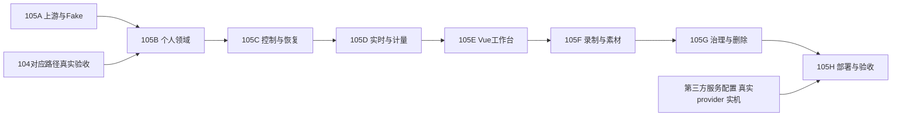
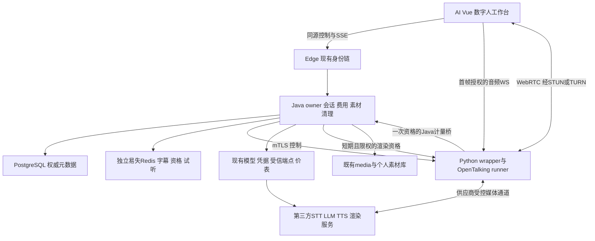

# 草场 #105：数字人工作台分阶段开发任务总纲

| 项目 | 内容 |
|---|---|
| 版本 / 日期 | 2.1 / 2026-09-22；落实所有模型第三方接入约束，替代v2.0本地渲染方案 |
| 本次交付 | 更新PRD、上游源码核验、共享契约、105A～105H共8份逐卡开发任务书 |
| 规模 | 41张详细卡、164组Given/When/Then验收用例（含v2.1参数化补充）、85项原卡级验证命令（修订新增门禁见K14.5）（另有阶段公共门禁）；20项一期需求+4项路线图 |
| 文档状态 | SPEC_READY v2.1；A v2.1已复验通过；B～H规格就绪，真实第三方服务仍为条件门禁 |
| 实施 / 测试 | A已有v2.0 Fake执行记录；v2.1 A修订待复验，B～H未实施；本次只修订规格，不表示第三方适配、真实性能或上线完成 |
| 本地研究基线 | 草场`f2976aaeb329ee17e9e08a8997bffaabde78d3ac`及已有#103/#104未提交修改 |
| 上游研究基线 | OpenTalking `8c739a5a6f114daf71aeace832a668c3ad60f536`，2026-09-21读取；固定源码而非自动追main |
| 前序依赖 | [#104生命周期修复](草场任务书-104-整体复核缺陷修复与生命周期门禁加固.md)对应路径的真实验收；当前已有V87等修改，不能按旧索引推断未实施 |

## 0. 本版如何使用

**2026-09-22确认的硬约束：所有模型均使用第三方服务，通过现有模型配置使用与扩展；不部署任何本地/自托管模型。** 适用于LLM、STT、TTS、数字人渲染、人脸检测等模型预处理。Python仅承担编排、媒体传输/编解码、录制与Fake测试，不加载模型权重。模型、地址、凭据、主备、版本与价格继续由现有AI控制面管理，数字人目录只引用已有配置及能力验收信息。

本版同步修正共享K02/K07/K08/K10及新增K14、A～H逐卡要求、PRD与运行交接。现有A实现仍含旧本地候选、重推理依赖和旧机器契约，**当前接手入口为B01；A v2.1修订复验已完成**；保留已有Fake证据，不把旧PASS当v2.1通过。本轮不修改运行时代码或凭据，具体待修文件与验收责任见K14.5。

这次将原来的16个概略工作包重新展开为八份不同阶段的执行规格。不要继续派发v1的P工作包；旧编号只属历史计划，不再是实施入口。每个阶段按本仓库任务书模板的0～14章节组织，给出准确文件白名单、真实源码锚点、目标签名、顺序步骤、输入边界、用例、命令、依赖与交接格式。

交给接手模型的最小材料是：**本总纲 + [共享契约](草场任务书-105-数字人工作台共享契约.md) + 当前阶段任务书 + [需求文档](../产品/数字人工作台需求文档.md)**。执行者按卡读取对应K节，不要求在一次提示里吞下八份全部细节，也不能跳过已指明的公共约束。

本轮用户只授权完善需求与任务书，因此此文档本身不触发代码开发、真实模型调用或生产发布。后续明确要求实施时，可按AUTO_CHAIN在指定阶段内自动推进，不为每个本地步骤重复确认。真实资源授权以该实施会话中已有授权为准；没有就只标条件项未运行并完成可独立本地工作。

## 1. 交付目录与执行顺序

| 执行书 | 阶段内容 | 卡数 | 用例组 | 计划人日 | 前置 |
| --- | --- | --- | --- | --- | --- |
| [#105A](草场任务书-105A-数字人工作台-阶段零-上游固定与可行性验证.md) | 上游固定与可行性验证 | 4 | 16 | 9～14 | 无；可在隔离本地环境开始 |
| [#105B](草场任务书-105B-数字人工作台-阶段一-领域数据与个人权限.md) | 领域数据与个人权限 | 5 | 20 | 13～18 | 105A v2.1修订复验FAKE_PASS与契约v1同步完成；#104个人生命周期相关修复已验证 |
| [#105C](草场任务书-105C-数字人工作台-阶段二-会话控制与可靠恢复.md) | 会话控制与可靠恢复 | 5 | 20 | 12～18 | 105B全卡通过；105A共享契约与Fake runtime可运行 |
| [#105D](草场任务书-105D-数字人工作台-阶段三-实时管道与用量结算.md) | 实时管道与用量结算 | 6 | 24 | 22～32 | 105C通过；105A固定补丁/Fake、105B领域类型可用；真provider实验另受A04门禁 |
| [#105E](草场任务书-105E-数字人工作台-阶段四-Vue工作台与交互闭环.md) | Vue工作台与交互闭环 | 6 | 24 | 17～25 | 105D Fake实时集成通过；105B类型/API可用；#104账号缓存与HTTP错误修复已验证 |
| [#105F](草场任务书-105F-数字人工作台-阶段五-形象录制与素材交接.md) | 形象录制与素材交接 | 5 | 20 | 14～23 | 105E S1本地闭环通过；105D音视频输出hook与费用桥可用；#104媒体引用/清理修复验证 |
| [#105G](草场任务书-105G-数字人工作台-阶段六-历史治理与数据生命周期.md) | 历史治理与数据生命周期 | 5 | 20 | 15～23 | 105F媒体闭环通过；#104个人与组织归属守卫、清理竞争修复有真实测试证据 |
| [#105H](草场任务书-105H-数字人工作台-阶段七-部署集成与试点验收.md) | 部署集成与试点验收 | 5 | 20 | 15～25 | 105A～G必需本地验收完成；真实实验需实际可用的批准模型/设备/测试额度；开放另有用户授权 |


人日是包含实现、测试和调试的规划区间，不是模型耗时，不是承诺日历工期。v2.0原估算合计 **117～178人日**；v2.1增加控制面扩展与第三方适配、移除本地模型部署，须在A复验后重估，原区间不能视为新方案已确认工期；与v1不同，纳入了真实计量协议、音视频录制、生命周期、故障与设备验证，不能拿旧概略估算直接排期。第三方服务条款、账号开通、供应商协议和实机等待不计在内。每完成一阶段用实际数据重估下一阶段，不为了赶进度删权限/账务/清理门禁。

配套资料：

- [数字人工作台需求文档v2](../产品/数字人工作台需求文档.md)：产品目标、24条需求、字段/交互、性能目标和范围。
- [共享契约K00～K14](草场任务书-105-数字人工作台共享契约.md)：40个公开端点、15个内部端点、6个管理端点，DTO/状态/错误/数据表/WS/RTC/计量/删除的唯一语义来源。
- [OpenTalking源码核验与接入差距](../reviews/OpenTalking源码核验与数字人接入差距-2026-09-21.md)：20条固定源码证据及本地复用修正。



默认串行推进，文件有前后扩展关系，不让不同模型同时重建同一文件。A04的真实实验是条件项：Fake基线+缺口清单通过即可继续B～G；缺真实证据会阻塞H的PERSONAL_BETA，不阻塞明确无依赖的本地实现。H04可在H03缺第三方服务或实机条件时继续隔离故障演练，H05可完成本地交接但不得将beta判通过。

## 2. 第二轮研究后的关键修正

下表FACT的逐项源证据见核验文档OT编号，DECISION为草场本版目标；没有把源代码阅读当性能实测。

| 项目 | 核实结果或差距 | 本版落地决定 |
|---|---|---|
| 音频WS与转写 | OT03/04：入口接PCM，但兼容STT会收全段后写临时WAV | 首期明确按键说话、停止后识别；受限内存WAV走Java，无原mic落盘 |
| 文本流与用量 | OT05：上游流仅读delta.content | Java新增计量流；usage缺失pending，不按字数猜真实token |
| 默认能力 | OT02/07：agent/knowledge默认开启，配置读取存在全局路径 | 只暴露wrapper受控入口；显式禁agent/记忆/知识；逐会话Binding |
| 原生录制 | OT11/12：视频帧封装无输出音轨，开始录制会清旧文件 | F新增输出AV分支，H264/AAC MP4+SRT，独立recordingId |
| 打断与RTC | OT14及runner：旧peer与disconnect自动close不匹配恢复目标 | 关闭旧peer/重协商mediaEpoch，补丁避免把整场误终结 |
| 幂等与恢复 | OT08/09/10：已有receipt不等于持久经济幂等、事件重放或孤儿回收 | Java操作表、稳定经济键、事件序号、30秒执行租约与回收器 |
| 模型与依赖 | OT15/16/19/20：真实backend值及重依赖，框架与权重许可分开 | 只锁定编排/媒体依赖；不安装本地推理栈；第三方模型统一走现有控制面；Fake全链禁外网 |
| 草场文本BYOK | 个人platform/own开关，own缺key不回退；个人BYOK预算豁免 | 原规则保留，禁止为了接数字人改变整个AI创作计费 |
| 草场配音资助 | TtsWorker现有video_tts、feature=null平台资助 | 配音/试听/开场白记平台成本但不扣用户积分；文本/转写依既有收费项，渲染补贴 |
| 浏览器麦克风 | 当前AI Nginx入口响应头禁止microphone | E06只开放AI入口self权限，H01核验最终HTTPS入口；用户端/治理台仍禁 |
| 本地版本 | V87及PersonalDataErasureScope已存在工作区 | 后续迁移执行时max+1，不抢占或改写历史SQL，不覆盖#104修复 |

## 3. 最终架构与责任归属



媒体帧不经Java普通HTTP代理；财务/owner不交给Python。上游React演示站不作为第二套产品UI引入。不把数字人塞进现有四项CreationCapability枚举，不给AiCreationCenter增加大块逻辑。用户AI与治理台各按对应DESIGN执行。

## 4. 实施前冻结的合同要点

| 维度 | 唯一口径 | 责任卡 |
|---|---|---|
| 对象归属 | 首期personal、organizationId=null；owner由身份链派生，跨账号统一404 | B02、G01/G02 |
| 并发与租约 | 每账号1场、默认全局1场/最多10排队；10分钟从首次ready计；隐藏30秒不被心跳延长；失联≤45秒释放目标 | C01/C02、D05、H04 |
| 音频 | 16kHz mono s16le，默认20ms块，帧带seq/sampleCount；≤60秒/1.92MB；2秒背压；WS不承载长期key | D02/D04、E04 |
| 费用 | stage独立operation/run；bindPrepared与run同事务；dispatch后未知不重放；取消沿现有规则；TTS补贴成本明确 | D01/D03/D04/D06、G03 |
| 默认成本授权 | 每场平台成本上限300分（不是预扣300分或300积分），含pending预留；试听每天30分补贴；渲染收费关闭 | C01、D01/D04；K08.1 |
| 同意与留存 | 默认不长期存聊天；结束后10分钟可主动保存；删除墓碑挡迟到写回；mic从不持久化 | C04、E05、G02/G05 |
| 录制 | 只数字人输出AV；单段5分钟/200MiB、每场2段；MP4带AAC；SRT用实际输出段钟；资产独立 | F01～F05 |
| 管理 | 只platform_admin配置/停止/核对；只看元数据；不能自由填provider URL或金额 | G03/G04 |
| 开放 | 默认开关关；Fake/真实/试点授权分列，缺任何真实必要项不可PERSONAL_BETA | A04、H03～H05 |

上述默认值是本版明确的开发基线，用户可要求修订；执行模型不得悄悄另选。涉及商业资费正式开放仍需确认实际价表和补贴承担，而非把该规划当已批准生产收费方案。

## 5. 逐卡任务清单

所有卡另必读K14；其v2.1修订责任与补充白名单见各阶段§9.1（有新增文件的B/D/F/G），验收按原TC参数化扩充，不因卡数不变而省略新增分支。

### 105A：阶段零-上游固定与可行性验证

| 任务卡 | 交付 | 共享契约 | 前置 | 测试/命令 |
| --- | --- | --- | --- | --- |
| C105A-01 | 锁定上游与建立独立依赖环境 | K00、K10、K13 | 无 | TC105A-01-01～TC105A-01-04；V105A-01-01、V105A-01-02 |
| C105A-02 | 固化共享契约、合成夹具与变更检查器 | K00、K01、K02、K03、K04、K05、K06、K07、K08、K09、K10、K13、K14 | C105A-01 | TC105A-02-01～TC105A-02-04；V105A-02-01、V105A-02-02 |
| C105A-03 | 建立受控wrapper与全链Fake探针 | K06、K07、K08、K10、K13 | C105A-02 | TC105A-03-01～TC105A-03-04；V105A-03-01 |
| C105A-04 | 形成真实候选验证门禁与阶段交接 | K09、K10、K12、K13 | C105A-03 | TC105A-04-01～TC105A-04-04；V105A-04-01、V105A-04-02 |

### 105B：阶段一-领域数据与个人权限

| 任务卡 | 交付 | 共享契约 | 前置 | 测试/命令 |
| --- | --- | --- | --- | --- |
| C105B-01 | 核心DDL与逐表生命周期登记 | K04、K05、K13 | C105A-02、C105A-03、C105A-04(local)、#104-personal-lifecycle | TC105B-01-01～TC105B-01-04；V105B-01-01 |
| C105B-02 | 个人鉴权、开关与域错误映射 | K01、K02、K03、K13 | C105B-01 | TC105B-02-01～TC105B-02-04；V105B-02-01、V105B-02-02 |
| C105B-03 | 目录、角色版本与操作幂等 | K01、K02、K03、K04、K13 | C105B-02 | TC105B-03-01～TC105B-03-04；V105B-03-01 |
| C105B-04 | 前端类型与API层先行 | K01、K02、K03、K11、K13 | C105B-03 | TC105B-04-01～TC105B-04-04；V105B-04-01、V105B-04-02 |
| C105B-05 | 基础注销、删除与阶段门禁 | K04、K05、K09、K13 | C105B-04 | TC105B-05-01～TC105B-05-04；V105B-05-01 |

### 105C：阶段二-会话控制与可靠恢复

| 任务卡 | 交付 | 共享契约 | 前置 | 测试/命令 |
| --- | --- | --- | --- | --- |
| C105C-01 | 预检查与原子创建会话 | K01、K02、K03、K04、K05、K13 | C105B-05 | TC105C-01-01～TC105C-01-04；V105C-01-01 |
| C105C-02 | 控制租约、暂停恢复与回收器 | K03、K04、K05、K07、K13 | C105C-01 | TC105C-02-01～TC105C-02-04；V105C-02-01、V105C-02-02 |
| C105C-03 | 有序事件与只读重连 | K04、K05、K06、K13 | C105C-02 | TC105C-03-01～TC105C-03-04；V105C-03-01 |
| C105C-04 | 保存同意、字幕导出与删除墓碑 | K03、K05、K06、K09、K13 | C105C-03 | TC105C-04-01～TC105C-04-04；V105C-04-01 |
| C105C-05 | 控制面故障注入与交付 | K04、K06、K07、K12、K13 | C105C-04 | TC105C-05-01～TC105C-05-04；V105C-05-01、V105C-05-02、V105C-05-03、V105C-05-04 |

### 105D：阶段三-实时管道与用量结算

| 任务卡 | 交付 | 共享契约 | 前置 | 测试/命令 |
| --- | --- | --- | --- | --- |
| C105D-01 | 稳定经济键与原子prepared绑定 | K05、K08、K13 | C105C-05 | TC105D-01-01～TC105D-01-04；V105D-01-01 |
| C105D-02 | 短期资格与受控内部执行接口 | K03、K07、K08、K13 | C105D-01 | TC105D-02-01～TC105D-02-04；V105D-02-01、V105D-02-02 |
| C105D-03 | 计量文本流、安全分段与上下文 | K02、K06、K08、K13 | C105D-02 | TC105D-03-01～TC105D-03-04；V105D-03-01 |
| C105D-04 | 按键音频转写与流式配音桥 | K01、K03、K07、K08、K13 | C105D-03 | TC105D-04-01～TC105D-04-04；V105D-04-01、V105D-04-02 |
| C105D-05 | OpenTalking媒体、真实后端适配与打断 | K04、K06、K07、K09、K13 | C105D-04 | TC105D-05-01～TC105D-05-04；V105D-05-01、V105D-05-02 |
| C105D-06 | 费用核对、取消与双会话集成 | K05、K06、K08、K12、K13 | C105D-05 | TC105D-06-01～TC105D-06-04；V105D-06-01、V105D-06-02、V105D-06-03 |

### 105E：阶段四-Vue工作台与交互闭环

| 任务卡 | 交付 | 共享契约 | 前置 | 测试/命令 |
| --- | --- | --- | --- | --- |
| C105E-01 | 独立路由、入口与URL恢复 | K02、K03、K11、K13 | C105D-06 | TC105E-01-01～TC105E-01-04；V105E-01-01、V105E-01-02 |
| C105E-02 | 角色配置、形象音色与开始确认 | K01、K02、K03、K11、K13 | C105E-01 | TC105E-02-01～TC105E-02-04；V105E-02-01、V105E-02-02 |
| C105E-03 | 会话状态、事件与媒体播放 | K04、K06、K07、K11、K13 | C105E-02 | TC105E-03-01～TC105E-03-04；V105E-03-01、V105E-03-02 |
| C105E-04 | 按键麦克风、发送与打断交互 | K01、K07、K11、K13 | C105E-03 | TC105E-04-01～TC105E-04-04；V105E-04-01、V105E-04-02 |
| C105E-05 | 字幕保存、历史入口与会话收尾 | K03、K06、K09、K11、K13 | C105E-04 | TC105E-05-01～TC105E-05-04；V105E-05-01、V105E-05-02 |
| C105E-06 | S1真浏览器与视觉矩阵验收 | K07、K11、K12、K13 | C105E-05 | TC105E-06-01～TC105E-06-04；V105E-06-01、V105E-06-02 |

### 105F：阶段五-形象录制与素材交接

| 任务卡 | 交付 | 共享契约 | 前置 | 测试/命令 |
| --- | --- | --- | --- | --- |
| C105F-01 | 自有图片授权、预处理与派生登记 | K02、K03、K05、K09、K13 | C105E-06 | TC105F-01-01～TC105F-01-04；V105F-01-01、V105F-01-02 |
| C105F-02 | 输出AV录制与分段时钟 | K04、K07、K09、K13 | C105F-01 | TC105F-02-01～TC105F-02-04；V105F-02-01、V105F-02-02 |
| C105F-03 | 下载、校验与幂等素材保存 | K03、K05、K09、K13 | C105F-02 | TC105F-03-01～TC105F-03-04；V105F-03-01 |
| C105F-04 | 图片、录制与素材交接UI | K02、K03、K09、K11、K13 | C105F-03 | TC105F-04-01～TC105F-04-04；V105F-04-01、V105F-04-02 |
| C105F-05 | S2媒体闭环与隐私回归 | K09、K12、K13 | C105F-04 | TC105F-05-01～TC105F-05-04；V105F-05-01、V105F-05-02、V105F-05-03 |

### 105G：阶段六-历史治理与数据生命周期

| 任务卡 | 交付 | 共享契约 | 前置 | 测试/命令 |
| --- | --- | --- | --- | --- |
| C105G-01 | 个人历史检索与异步删除 | K03、K04、K05、K09、K13 | C105F-05 | TC105G-01-01～TC105G-01-04；V105G-01-01、V105G-01-02 |
| C105G-02 | 完整注销与可验证物理清理 | K04、K05、K09、K10、K13 | C105G-01 | TC105G-02-01～TC105G-02-04；V105G-02-01、V105G-02-02 |
| C105G-03 | 管理员配置、终止与费用核对 | K02、K08、K10、K13 | C105G-02 | TC105G-03-01～TC105G-03-04；V105G-03-01、V105G-03-02 |
| C105G-04 | 治理台独立面板与权限可见性 | K10、K11、K13 | C105G-03 | TC105G-04-01～TC105G-04-04；V105G-04-01、V105G-04-02 |
| C105G-05 | 治理闭环与日志隐私门禁 | K08、K09、K10、K12、K13 | C105G-04 | TC105G-05-01～TC105G-05-04；V105G-05-01、V105G-05-02、V105G-05-03、V105G-05-04、V105G-05-05 |

### 105H：阶段七-部署集成与试点验收

| 任务卡 | 交付 | 共享契约 | 前置 | 测试/命令 |
| --- | --- | --- | --- | --- |
| C105H-01 | 隔离镜像、同源代理和网络配置 | K07、K10、K12、K13 | C105G-05 | TC105H-01-01～TC105H-01-04；V105H-01-01、V105H-01-02 |
| C105H-02 | 端到端全量回归与迁移兼容 | K01、K04、K05、K12、K13 | C105H-01 | TC105H-02-01～TC105H-02-04；V105H-02-01、V105H-02-02、V105H-02-03 |
| C105H-03 | 真实模型、设备、性能与成本测量 | K08、K09、K10、K12、K13 | C105H-02 | TC105H-03-01～TC105H-03-04；V105H-03-01、V105H-03-02、V105H-03-03、V105H-03-04 |
| C105H-04 | 故障演练、熔断与向前回滚 | K04、K08、K09、K10、K13 | C105H-02 | TC105H-04-01～TC105H-04-04；V105H-04-01、V105H-04-02、V105H-04-03、V105H-04-04 |
| C105H-05 | 证据追踪、运行手册与试点交接 | K00、K12、K13 | C105H-02、C105H-04、C105H-03(conditional-beta) | TC105H-05-01～TC105H-05-04；V105H-05-01、V105H-05-02、V105H-05-03 |

## 6. 需求→实现→验收追踪

表中只选主要验收责任卡，所有辅助卡和测试组仍是其阶段必需项。每项一期需求必须同时通过所列卡、对应TC/V及H全链验收；开发完成不等于真实模型性能通过。

| 需求 | 内容 | 主要责任卡 | 必需验收组 | 卡级V |
| --- | --- | --- | --- | --- |
| DH-R01 | 独立入口和功能开关 | C105B-02、C105E-01 | TC105B-02-01～TC105B-02-04；TC105E-01-01～TC105E-01-04 | V105B-02-01/V105B-02-02；V105E-01-01/V105E-01-02 |
| DH-R02 | 登录和个人归属 | C105B-02、C105E-03、C105G-02 | TC105B-02-01～TC105B-02-04；TC105E-03-01～TC105E-03-04；TC105G-02-01～TC105G-02-04 | V105B-02-01/V105B-02-02；V105E-03-01/V105E-03-02；V105G-02-01/V105G-02-02 |
| DH-R03 | 形象目录和状态 | C105B-03、C105F-01、C105H-03 | TC105B-03-01～TC105B-03-04；TC105F-01-01～TC105F-01-04；TC105H-03-01～TC105H-03-04 | V105B-03-01；V105F-01-01/V105F-01-02；V105H-03-01/V105H-03-02/V105H-03-03/V105H-03-04 |
| DH-R04 | 音色与兼容配置 | C105D-04、C105E-02 | TC105D-04-01～TC105D-04-04；TC105E-02-01～TC105E-02-04 | V105D-04-01/V105D-04-02；V105E-02-01/V105E-02-02 |
| DH-R05 | 人设编辑与版本 | C105B-03、C105D-03、C105E-02 | TC105B-03-01～TC105B-03-04；TC105D-03-01～TC105D-03-04；TC105E-02-01～TC105E-02-04 | V105B-03-01；V105D-03-01；V105E-02-01/V105E-02-02 |
| DH-R06 | 开始前检查与报价 | C105C-01、C105E-02 | TC105C-01-01～TC105C-01-04；TC105E-02-01～TC105E-02-04 | V105C-01-01；V105E-02-01/V105E-02-02 |
| DH-R07 | 文字对话 | C105D-03、C105D-05、C105E-06 | TC105D-03-01～TC105D-03-04；TC105D-05-01～TC105D-05-04；TC105E-06-01～TC105E-06-04 | V105D-03-01；V105D-05-01/V105D-05-02；V105E-06-01/V105E-06-02 |
| DH-R08 | 麦克风与转写 | C105D-04、C105E-04、C105H-03 | TC105D-04-01～TC105D-04-04；TC105E-04-01～TC105E-04-04；TC105H-03-01～TC105H-03-04 | V105D-04-01/V105D-04-02；V105E-04-01/V105E-04-02；V105H-03-01/V105H-03-02/V105H-03-03/V105H-03-04 |
| DH-R09 | 实时音视频与字幕 | C105C-03、C105D-05、C105H-03 | TC105C-03-01～TC105C-03-04；TC105D-05-01～TC105D-05-04；TC105H-03-01～TC105H-03-04 | V105C-03-01；V105D-05-01/V105D-05-02；V105H-03-01/V105H-03-02/V105H-03-03/V105H-03-04 |
| DH-R10 | 打断与顺序控制 | C105D-05、C105E-04、C105H-03 | TC105D-05-01～TC105D-05-04；TC105E-04-01～TC105E-04-04；TC105H-03-01～TC105H-03-04 | V105D-05-01/V105D-05-02；V105E-04-01/V105E-04-02；V105H-03-01/V105H-03-02/V105H-03-03/V105H-03-04 |
| DH-R11 | 会话生命周期与多页 | C105C-02、C105E-03、C105H-04 | TC105C-02-01～TC105C-02-04；TC105E-03-01～TC105E-03-04；TC105H-04-01～TC105H-04-04 | V105C-02-01/V105C-02-02；V105E-03-01/V105E-03-02；V105H-04-01/V105H-04-02/V105H-04-03/V105H-04-04 |
| DH-R12 | 字幕记录与主动保存 | C105C-04、C105E-05、C105G-01 | TC105C-04-01～TC105C-04-04；TC105E-05-01～TC105E-05-04；TC105G-01-01～TC105G-01-04 | V105C-04-01；V105E-05-01/V105E-05-02；V105G-01-01/V105G-01-02 |
| DH-R13 | 数字人输出录制 | C105F-02、C105F-05、C105H-03 | TC105F-02-01～TC105F-02-04；TC105F-05-01～TC105F-05-04；TC105H-03-01～TC105H-03-04 | V105F-02-01/V105F-02-02；V105F-05-01/V105F-05-02/V105F-05-03；V105H-03-01/V105H-03-02/V105H-03-03/V105H-03-04 |
| DH-R14 | 导出与素材库交接 | C105F-03、C105F-05 | TC105F-03-01～TC105F-03-04；TC105F-05-01～TC105F-05-04 | V105F-03-01；V105F-05-01/V105F-05-02/V105F-05-03 |
| DH-R15 | 用量、额度和取消结算 | C105D-01、C105D-06、C105G-03、C105H-03 | TC105D-01-01～TC105D-01-04；TC105D-06-01～TC105D-06-04；TC105G-03-01～TC105G-03-04；TC105H-03-01～TC105H-03-04 | V105D-01-01；V105D-06-01/V105D-06-02/V105D-06-03；V105G-03-01/V105G-03-02；V105H-03-01/V105H-03-02/V105H-03-03/V105H-03-04 |
| DH-R16 | 安全、许可和来源提示 | C105A-03、C105D-02、C105G-05、C105H-01 | TC105A-03-01～TC105A-03-04；TC105D-02-01～TC105D-02-04；TC105G-05-01～TC105G-05-04；TC105H-01-01～TC105H-01-04 | V105A-03-01；V105D-02-01/V105D-02-02；V105G-05-01/V105G-05-02/V105G-05-03/V105G-05-04/V105G-05-05；V105H-01-01/V105H-01-02 |
| DH-R17 | 数据清理与注销 | C105B-05、C105F-03、C105G-02、C105G-05 | TC105B-05-01～TC105B-05-04；TC105F-03-01～TC105F-03-04；TC105G-02-01～TC105G-02-04；TC105G-05-01～TC105G-05-04 | V105B-05-01；V105F-03-01；V105G-02-01/V105G-02-02；V105G-05-01/V105G-05-02/V105G-05-03/V105G-05-04/V105G-05-05 |
| DH-R18 | 运营和故障诊断 | C105G-03、C105G-04、C105G-05 | TC105G-03-01～TC105G-03-04；TC105G-04-01～TC105G-04-04；TC105G-05-01～TC105G-05-04 | V105G-03-01/V105G-03-02；V105G-04-01/V105G-04-02；V105G-05-01/V105G-05-02/V105G-05-03/V105G-05-04/V105G-05-05 |
| DH-R19 | 主题、移动和可访问性 | C105E-06、C105F-05、C105G-04、C105H-03 | TC105E-06-01～TC105E-06-04；TC105F-05-01～TC105F-05-04；TC105G-04-01～TC105G-04-04；TC105H-03-01～TC105H-03-04 | V105E-06-01/V105E-06-02；V105F-05-01/V105F-05-02/V105F-05-03；V105G-04-01/V105G-04-02；V105H-03-01/V105H-03-02/V105H-03-03/V105H-03-04 |
| DH-R20 | 配置、灰度与回退 | C105H-01、C105H-02、C105H-04、C105H-05 | TC105H-01-01～TC105H-01-04；TC105H-02-01～TC105H-02-04；TC105H-04-01～TC105H-04-04；TC105H-05-01～TC105H-05-04 | V105H-01-01/V105H-01-02；V105H-02-01/V105H-02-02/V105H-02-03；V105H-04-01/V105H-04-02/V105H-04-03/V105H-04-04；V105H-05-01/V105H-05-02/V105H-05-03 |

| 路线图需求 | 内容 | 本期状态 |
| --- | --- | --- |
| DH-R21 | 组织共享工作区 | ROADMAP；不入20项一期完成率，不写空实现冒充 |
| DH-R22 | 资料问答与知识引用 | ROADMAP；不入20项一期完成率，不写空实现冒充 |
| DH-R23 | 对外嵌入与直播 | ROADMAP；不入20项一期完成率，不写空实现冒充 |
| DH-R24 | 节点编排/多角色/长期记忆 | ROADMAP；不入20项一期完成率，不写空实现冒充 |

## 7. 模型执行纪律与文件边界

1. **一份阶段书内逐卡自动推进。** 前置未过不从UI或录制倒做；阶段要求不同应用/语言时按其命令测试，不凭编译成功推断全链通过。
2. **精确写入交集。** 各书§9是阶段上限，§11是当前卡上限；新文件列NEW，后卡扩展列MODIFY_AFTER。迁移编号唯一机械替换NEXT，不代表任意路径授权。
3. **保留前序改动。** 当前工作区有大量#103/#104实施内容，本系列本轮没有覆盖。执行者核实对应修复证据，不直接reset/clean，不复制历史旧实现。
4. **单一协议。** API/DTO/错误/状态以共享契约为准；每张卡引用K节与真实源码锚点。缺字段或协议冲突时给准确差异，不自行换名或并存两套commandId/requestId。
5. **不新开隐藏工作流。** 组织、知识库、真人克隆、任意工具/URL及发布不在当前范围。上游默认可用不等于草场已授权。
6. **原始证据可核验。** 失败不能吞，unknown不能0，NOT_RUN不能PASS，Fake不能替代第三方服务条款/配置/provider/实机；真实资源授权无需在已获同范围授权后重复询问。

## 8. 分层验收和明确退出门槛

| 门槛 | 必需结果 | 不足时动作 |
|---|---|---|
| A本地可行性 | 锁源/锁依赖，agent禁用，双Binding隔离，全链Fake零外网，实际音视频对象 | 不能进入B，先修对应A卡；条件real缺失另列 |
| B/C控制基础 | 个人owner/DB约束/版本/写屏障，租约与reaper，幂等事件和删除墓碑 | 不派发真实provider，不开放UI贵操作 |
| D/E内部闭环 | 带真实非零合成usage的账务流、受控音频/RTC、三浏览器基本流、换号释放 | 仍INTERNAL_ALPHA；不称个人正式试点 |
| F/G个人功能 | 实际有声音MP4/SRT/素材库；save-GC竞态；完整注销/治理/隐私负例 | 修复资源与权利缺口，不掩盖partial/cleanup failure |
| H本地验收 | 隔离部署+4组E2E×3引擎+迁移+故障/回滚+证据归档 | 仅LOCAL_ACCEPTED，真实条件独立 |
| H真实资格 | 第三方服务条款/配置/真实provider计量/720p与时延/桌面及移动真机全部达到目标 | 任一NOT_RUN/PARTIAL/不达标则REAL_QUALIFIED=false |
| 开放授权 | 上述通过、实际配置/成本归属可审阅、用户已授权该发布范围 | 默认不开生产，不以“任务完成”代替授权 |

测试产物统一`test-artifacts/task-105/`，当前文档编写检查在`test-artifacts/task-105-revision-20260921/`。业务实现TC/V初始全为NOT_RUN，本轮只执行文档链接/状态/敏感信息及结构核对。用例组中的边界值需要参数化，164组不是164个简单happy path断言。

## 9. 开发与运行风险的具体处理

| 风险 | 首次处理点 | 已写明的应对，不允许执行模型猜测 |
|---|---|---|
| 上游大依赖在Python环境不兼容 | A01/A03 | 独立3.11与最小编排/媒体uv.lock；禁止下载权重及安装推理依赖；上游强耦合通过有限适配解除 |
| 第三方模型服务/性能不可用 | A04/H03 | 固定候选、证据缺口列表；继续Fake可独立工作；真实开放阻塞，不擅自换模型 |
| provider协议无usage/PCM不真流式 | D03/D04 | 拒列批准目录/进入pending；不按字数冒实量、不将整WAV切片称低延迟 |
| 网络超时引起重建run/重复收费 | C/D/F/G | 持久request/operation、run原子绑定、先dispatch事实；不重放未知推理，只核对结算 |
| RTC旧缓存使打断后仍播放 | D05/E03 | 旧peer立即关闭、新mediaEpoch重协商；重连不重发上一轮 |
| 文件清理与入库竞态 | F03/G02 | 共享media引用claim、逐handle清单、删除墓碑与残留验证 |
| 全局配置使账号内容串线 | A03/D06/E03 | 不改env切用户；每Binding/AccountTicket/多epoch验证，双真实page测试 |
| 文档和代码现状漂移 | 每卡开工 | 基于符号重读；只调整局部实现，不改公开合同或覆盖前序修复 |

## 10. 启动给接手模型的提示词

```text
请执行 docs/任务书/草场任务书-105A-数字人工作台-阶段零-上游固定与可行性验证.md，从C105A-01开始。
先读#105总纲、数字人工作台需求文档v2、共享契约K00～K14，并按当前卡只读对应K节与源码。
采用AUTO_CHAIN完成105A本地必需卡和测试；遵守每卡白名单，保留现有#103/#104修改，不动业务生产配置。
不要将本书的目标签名误认为已有代码，不发明字段/状态/收费键。真实条件不足据实NOT_RUN，完成可独立的Fake与交接。
每卡汇报文件、TC/V、实际命令/退出码/证据和下一卡；不在普通本地步骤反复停下确认。
本阶段结束后汇总本地结果及真实缺口，不自动实施未指定的下一阶段或生产发布。
```

后续只需换成相应105B～H文件及起始卡；每本末尾已有该阶段可复制提示词。完整个人试点由20项需求与全部必需门槛决定，不以完成某一本作为全项目完成。
