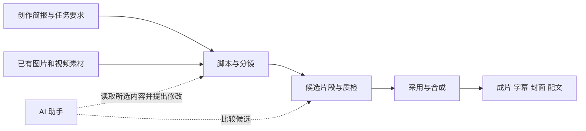

# infinite-canvas 调研与草场改造建议

日期：2026-09-11。性质：源码与交互调研、后续实施建议；本文不表示相关改造已经交付，也不修改当前 backlog。

**建议从现有 `/video-canvas` 增量建设：先完成可恢复的分镜生产流程，再扩展素材关系和能操作节点的 AI 助手。** 草场已经具备视频任务、候选、评分、合成、导出和创作草稿，最有价值的改造是把这些能力组织到同一个工作区。

**调研依据**

| 对象 | 核对范围 |
|---|---|
| infinite-canvas | `v0.7.0`，提交 `163771b8e6de5d8ea65225fc4d6340457eb45bca`，2026-09-09；已通过 GitHub API 核对 main 与本地检出一致 |
| 草场 | 调研结束时 HEAD 为 `6a8937a0b1ca5109f6c0a948712a2a263a503c52`；期间新增提交只改变 Java 依赖钉版，本文所引业务代码未变 |
| 源码 | 上游节点、连线、持久化、Agent、3D 导演台；草场画布、快速模式、草稿保存、素材、创作来源与视频服务 |
| 浏览器 | 查看上游项目库、空白画布、文本节点和 Agent 面板；查看本地现有分镜画布及属性栏 |
| 验证边界 | 本次以源码和界面核对为依据；未执行真实模型生成、计费、视频合成或跨设备恢复。下面的代码问题属于静态发现，实施时需要相应用例验证 |

既有[任务书 #66](../任务书/草场任务书-66-视频制作三期编排升级与生态打通.md)已经明确“借鉴设计、不搬代码”、Vue 实现及前端零新增依赖。上游采用 React 19 / Next.js 16 / Zustand，服务端为 Go，许可证为 [AGPL-3.0](https://github.com/tigerowo/infinite-canvas/blob/163771b8e6de5d8ea65225fc4d6340457eb45bca/LICENSE)。本建议沿用草场既有技术路线。

**上游最值得借鉴的能力**

上游的核心是“内容对象 + 来源关系 + 可执行操作”。图片、文本、视频、音频、生成配置、全景图、导演台和分组是不同节点；连线让生成配置收集上游内容，结果又成为可继续使用的节点。源码实际定义了八种节点，功能文档中“目前五类”的概括并不完整，以[类型定义](https://github.com/tigerowo/infinite-canvas/blob/163771b8e6de5d8ea65225fc4d6340457eb45bca/web/src/app/%28user%29/canvas/types.ts#L12-L20)为准。

| 能力 | 草场可采用的产品行为 | 适配要点 |
|---|---|---|
| 素材到结果的关系 | 选中镜头可看到所用素材、提示词、候选和采用结果 | 关联现有实体 ID；拖动布局不改变镜序或生成输入 |
| 节点内预览与候选组 | 在镜头旁播放候选、看评分、采用或重抽 | 复用草场候选与任务接口，保留 `selectable` 和失败原因 |
| 选中节点作为 AI 上下文 | “把这两镜旁白缩短”“按所选素材补一镜” | 限定选择范围，保留任务约束，明确修改目标 |
| 项目恢复、撤销与重做 | 回到上次视口，撤销一次拖拽或编辑 | 沿用草稿版本冲突处理；撤销布局不等于取消已提交的生成任务 |
| 素材库与结果复用 | 把已有作品插入当前创作，保留来源 | 接现有媒体库与内容资产，保存稳定引用 |
| 3D 导演台 | 摆机位、角色、姿势，输出参考构图 | 作为后续独立能力评估；与草场现有分镜面板职责不同 |

上游[项目 store](https://github.com/tigerowo/infinite-canvas/blob/163771b8e6de5d8ea65225fc4d6340457eb45bca/web/src/app/%28user%29/canvas/stores/use-canvas-store.ts#L20-L37)保存节点、连线、会话、视口和面板，使用浏览器存储，并通过账号接口按时间戳合并。上游也已有图片、视频和音频的服务端持久任务，不能把它概括成只靠浏览器运行的演示。

其 [Agent 上下文构建](https://github.com/tigerowo/infinite-canvas/blob/163771b8e6de5d8ea65225fc4d6340457eb45bca/web/src/app/%28user%29/canvas/agent/canvas-agent-context.ts#L77-L100)优先纳入选中、批准、引用及运行异常的节点，并限制摘要数量与文本长度；[工具协议](https://github.com/tigerowo/infinite-canvas/blob/163771b8e6de5d8ea65225fc4d6340457eb45bca/web/src/app/%28user%29/canvas/agent/canvas-agent-tools.ts)区分查询、编辑、生成等动作，校验参数并限制批次。草场值得采用这些边界设计，具体额度需根据自己的模型和业务确定。

上游 [3D 导演台桥接](https://github.com/tigerowo/infinite-canvas/blob/163771b8e6de5d8ea65225fc4d6340457eb45bca/web/src/app/%28user%29/canvas/components/canvas-director.tsx#L45-L128)通过同源 iframe 和消息通信交换场景、截图与视频。它包含场景树、机位和动画时间轴；草场 `DirectorPanel.vue` 则编辑画面、旁白、时长和分组，不能把二者当作同一个组件直接替换。

**草场的现状与改造缺口**

| 领域 | 已有实现 | 应补的连接 |
|---|---|---|
| 画布 | 分镜节点、缩放、平移、适配、顺序连线、属性编辑、分组与分支 | 媒体预览、选片、运行状态、持久布局与可靠编辑 |
| 视频生产 | 分镜生成、补锚定图、候选评分、选片、重抽、合成、取消和导出 | 在专业模式完成同一任务，避免另建执行系统 |
| 项目恢复 | 最近项目、自动保存、草稿版本、`storyboardId/productionTaskId` 恢复 | 专业模式与同一草稿保存队列连接 |
| 素材 | 媒体库、内容资产、自有媒体输入、稳定媒体引用 | 节点化呈现来源、用途和失效情况 |
| AI 助手 | 创作引导、评分、优化、任务覆盖检查 | 新增选择上下文和受校验的节点动作协议 |
| 交付 | 封面、发布描述、配文、声明、媒体引用、素材包/剪映导出 | 在画布展示同一个交付版本，并复用现有交付面板 |

当前[画布页面](../../src/views/video-canvas/VideoCanvasView.vue#L122-L124)明确提示“合成与候选挑选在快速模式第三步完成”；[镜头节点](../../src/views/video-canvas/ShotNode.vue#L55-L65)只呈现文字和候选编号。浏览器看到的界面与此一致。

可直接复用的入口包括 [TakePickCard](../../src/views/video-production/components/TakePickCard.vue)、[ComposeStage](../../src/views/video-production/components/ComposeStage.vue)、[MediaLibraryPanel](../../src/components/MediaLibraryPanel.vue)、[CreationBriefEditor](../../src/components/CreationBriefEditor.vue)、[DeliveryPanel](../../src/views/ai-center/components/DeliveryPanel.vue) 和 [WorkspaceSaveBadge](../../src/views/ai-center/creation/WorkspaceSaveBadge.vue)。需要适配画布尺寸时，优先提取现有组件中的共享部分。

还有一项必须准确表达：[AI 内容中心改造-03](../任务书/AI内容中心改造-03-视频素材创作与联合交付.md)已明确，自有媒体目前进入素材计划和分镜提示词，直接替代生成候选参与合成仍是后续增量。[StoryboardService](../../platform-java/services/intelligence-service/src/main/java/com/grassland/intelligence/videoproduction/StoryboardService.java#L94-L111)已有自有素材归属与类型校验；现有[合成服务](../../platform-java/services/intelligence-service/src/main/java/com/grassland/intelligence/videoproduction/VideoCompositionService.java#L109-L130)仍以分镜、候选和音轨构建成片。仅增加一个视频素材节点无法完成这条链路。

**用户应得到的工作区**

以制作一条门店短片为例：用户从任务或最近项目进入，看到来源要求和已有素材；生成分镜后，在每镜旁比较候选；采用、重抽和合成都留在当前工作区；完成后一起整理封面、配文和导出材料。



这个图表达创作关系。需要执行的动作仍由已有服务校验、提交和追踪，画一条线不会自动触发生成。

桌面建议采用“顶部来源/项目/保存状态 + 左侧可收起素材栏 + 中间画布 + 右侧属性/AI 切换面板 + 底部当前任务”。属性和 AI 面板共用右侧区域，避免同时挤占内容。用户日常仍从快速模式开始，专业模式面向需要比较和编排的任务。

移动端提供镜头列表、候选预览和底部属性抽屉，主要动作保持可触达。品牌、字体、实色工作区和明暗主题遵循根 [DESIGN.md](../../DESIGN.md)，不照搬上游配色与导航。

**第一阶段先处理的源码问题**

这些问题会直接影响后续画布的可信度；以下描述基于当前实现路径，不代表已经完成运行时复现或修复。

1. **逐镜选片可能覆盖此前选择。** [前端 `selectTake`](../../src/composables/useVideoProduction.ts#L777-L791)每次只提交一个镜头；[服务层](../../platform-java/services/intelligence-service/src/main/java/com/grassland/intelligence/videoproduction/VideoProductionTaskService.java#L242-L255)将本次选择序列化；[仓储](../../platform-java/services/intelligence-service/src/main/java/com/grassland/intelligence/videoproduction/VideoProductionTaskRepository.java#L241-L248)整列覆盖 `selection`。前端 `applyTask` 又与内存中的选择合并，会掩盖服务端缺失。应先明确局部更新契约并在服务端原子合并，或者统一全量提交及并发版本控制。验收要连续采用两镜的非推荐候选，再刷新并检查合成实际使用的片段。
2. **缩放后拖拽坐标换算缺失。** [ShotNode](../../src/views/video-canvas/ShotNode.vue#L14-L34)直接把屏幕位移加到画布坐标，未除以缩放比例；[useCanvasViewport](../../src/views/video-canvas/useCanvasViewport.ts#L54-L57)已有坐标换算函数。接入同一坐标系，覆盖 50%、100%、200% 的拖拽，并处理 `pointercancel`。
3. **布局只保存在内存。** [useVideoCanvas](../../src/views/video-canvas/useVideoCanvas.ts#L28-L30)明确坐标不落库；已有 KeepAlive 可维持部分会话内互切，但不能保证刷新和跨设备恢复。
4. **路由恢复与缓存激活需要一起处理。** [进入专业模式](../../src/views/video-production/components/StoryboardStage.vue#L42-L46)和[返回快速模式](../../src/views/video-canvas/VideoCanvasView.vue#L35-L39)只携带 `storyboard`；画布仅在 `onMounted` 取数，而[应用壳](../../src/ai/AiAppLayout.vue#L78-L89)使用 KeepAlive。必须验证从 A 分镜切到 B 再返回的取数、草稿绑定、陈旧响应隔离及编辑状态。
5. **分支不是独立内容版本。** [createBranch](../../src/views/video-canvas/DirectorPanel.vue#L64-L77)复制的是同一批 `shotIds`；[建任务请求](../../platform-java/services/intelligence-service/src/main/java/com/grassland/intelligence/videoproduction/VideoProductionTaskController.java#L76-L89)没有 `branchId`。目前的分支筛选不能承诺独立脚本、独立选片或按该分支合成。

属性编辑还应区分“载入所选镜头”与“用户实际修改”：`DirectorPanel` 的字段监听都会触发 `edit`，切换镜头也会重置输入。实施时补充切镜保稿、保存失败保留输入及保存中的明确反馈。

**数据如何接入现有系统**

业务记录、画布布局和媒体文件分别管理：

| 数据 | 归属 | 画布保存内容 |
|---|---|---|
| 分镜、镜头、候选、选片、生成阶段 | 现有 storyboard / shot / take / production task | 实体 ID；运行时重新读取权威状态 |
| 项目、Brief、来源、交付 | 现有 creation draft / workspace | 同一草稿 ID 与版本，复用共享保存队列 |
| 布局、视口、面板、分支筛选 | 画布展示状态 | 有版本的轻量布局 |
| 图片、视频、字幕、封面 | 媒体服务和内容资产 | `mediaId` / `assetId` 等稳定引用；访问时重新获取可用地址 |

[CreationWorkspace](../../platform-java/services/intelligence-service/src/main/java/com/grassland/intelligence/creationassistant/CreationWorkspace.java#L27-L42)限制整个序列化 workspace 为 **64 KiB**，拒绝 `secret/cookie/dataUrl/signedUrl` 等键，结果资产与运行 ID 列表各最多 20 项；顶层 schema 当前只接受版本 1。画布中的全部候选不能挤进“已选交付物”的列表。

对第一阶段最多 30 镜的分镜画布，建议在 `workspace.inputs.videoCanvas` 保存轻量布局，与已有 `inputs.video` 并列：

```ts
// 建议新增的布局契约；不是现有已实现字段。
interface VideoCanvasLayout {
  schemaVersion: 1
  storyboardId: string
  viewport: { panX: number; panY: number; scale: number }
  positions: Record<string, { x: number; y: number }>
  activeBranchId: string | null
}
```

该字段只容纳布局，保存前仍计算整个 workspace 的 UTF-8 字节数。保留顶层 schemaVersion 1，布局自己版本化。选择并列字段是为了避免现有[视频序列化](../../src/views/video-production/composables/useVideoWorkspace.ts#L36-L43)重建 `inputs.video` 时覆盖画布状态；两种模式的适配器仍须共同维护该契约。

复用 [useWorkspaceAutosave](../../src/views/ai-center/creation/useWorkspaceAutosave.ts#L94-L118) 和草稿 session 的串行保存与乐观锁，展示保存中、失败、只读和版本冲突。拖动结束产生一次布局变更，不按每个 pointermove 保存。第一阶段的 URL 建议保留 `storyboard`，增加 `draft`；已有 `productionTaskId`、来源和交付从该草稿恢复，服务端再次校验关联和归属。

扩展到通用多媒体画布后，再增加独立画布文档存储，例如 `creation_canvas_document`，关联既有草稿，独立维护 schema、修订号、节点引用和连线。workspace 只留画布引用及必要摘要。独立表与接口属于后续新增设计，不能直接沿用上游的整份项目 JSON 和时间戳覆盖来代替草场现有的冲突处理。

连线至少区分三类语义：`sequence` 表示镜序，`reference` 表示输入素材，`derived-from` 表示来源追踪。它们不应共同承担“改变合成顺序”“重新运行任务”和“只是标注来源”。第一阶段顺序线可继续从权威镜序派生。

如果要做真正的 A/B 内容方案，建议为每个独立方案创建可追溯的新分镜快照并关联父版本，分别绑定制作任务；跨平台改编继续遵守创建新草稿和合法来源快照的规则。现有 `grouping.branches` 适合保留为镜头集合/序列视图。

**执行与 AI 助手如何复用**

| 画布动作 | 当前可复用接口/实现 |
|---|---|
| 读取分镜 | `GET /api/video-production/storyboards/{id}` |
| 编辑镜头 | `PUT /api/video-production/shots/{id}/content` |
| 创建制作任务 | `POST /api/video-production/tasks`，复用 `storyboardId + operationId` 幂等语义 |
| 恢复进度 | `GET /api/video-production/tasks/{id}` 与 `/events`；保留现有 SSE 降级轮询 |
| 选片 | `POST /api/video-production/tasks/{id}/takes/select`，先解决上述保存契约问题 |
| 重抽、合成、取消 | 现有 `/shots/{shotId}/regenerate`、`/compose`、`/cancel`；沿用各操作的业务条件与计费语义 |
| 导出 | 现有 `/export/bundle`、`/export/jianying`；复用交付版本和可用性检查 |

[useVideoProduction](../../src/composables/useVideoProduction.ts)已经包含这些流程。建议抽取可共享的任务 session，让两种视图绑定同一制作任务，避免各自维护独立轮询、选片缓存和扣费逻辑。服务端继续使用现有 intelligence / AiExecution / Temporal 路径；打开或拖动画布不会创建一次新运行。

草场 [CreationAssistantPanel](../../src/components/CreationAssistantPanel.vue)与[助手控制器](../../platform-java/services/intelligence-service/src/main/java/com/grassland/intelligence/creationassistant/CreationAssistantController.java)目前侧重正文和创作引导，没有通用节点操作协议。因此“加一个聊天栏”不足以完成上游 Agent 的能力。

建议新增画布上下文适配与动作执行层：读取所选节点、必要上游引用、Brief、任务锁定条件和当前版本；只给模型有限摘要，缺详情再按真实 ID 查询。首批动作围绕读取、改旁白、修改镜头、提出分镜方案、准备生成参数。后端验证节点归属、可编辑阶段、字段范围和版本，失败保留原内容。

生成类动作呈现将影响的镜头、候选数量和费用，通过现有生成动作提交；用户要求已明确的范围内避免反复确认。AI 批量修改可预览差异并作为一次编辑撤销；已提交的生成通过既有取消接口处理，不能通过撤销节点伪造退款或完成状态。任务来源的锁定条件来自现有上下文绑定，模型输出不能覆盖它们。

媒体来源追踪复用已有 `contextSnapshotId`、`aiRunId`、`upstreamRunId` 等字段，见[创作记录类型](../../src/types/grassland/creation-generation.ts#L28-L37)。不要为画布再创建一套独立的密钥、积分和模型配置入口。

**实施批次与验收结果**

| 顺序 | 可独立交付的结果 | 主要验收 |
|---|---|---|
| A：可靠恢复与编辑 | 修正选片保存、缩放拖拽；补齐 URL/KeepAlive 恢复、布局保存及切镜保稿 | 两镜非推荐选择刷新仍保持；50%/200% 拖拽跟手；A→B→A 无错项目；失败与 409 不吞输入 |
| B：专业模式生产闭环 | 镜头媒体预览、候选采用/重抽、运行状态、合成与导出 | 在画布完成真实短片；切模式不重复创建任务；SSE 中断可恢复；导出版本和所选片段一致 |
| C：素材关系与联合交付 | Brief、素材、分镜、候选和结果可关联；封面/配文继续编辑 | 引用失效可定位；改配文不重生成视频；输出可追溯到来源和运行 |
| D：自有素材参与制作 | 在既有合成管线增加素材来源、裁剪和转码适配 | 自有片段实际出现在成片、音画与时长正确；不能仅凭画布连线验收 |
| E：AI 节点操作与独立方案 | 选中上下文、受校验的动作、必要的独立版本 | 只修改指定镜头；任务锁定有效；失败可恢复；方案之间脚本、选片与运行不串用 |

3D 场景、全景漫游、复杂动画时间轴和多人实时协作放到上述流程验证之后。先收集专业模式实际使用的场景和规模，再评估这些独立能力的成本。

前端继续在 `src/views/video-canvas/` 内分层：页面负责装配；URL 进入 `useVideoCanvasUrlState.ts`；取数、布局持久化、交互和 AI 动作分别进入域 composable；新增素材栏、候选预览和运行区进入 `components/`。这些名称是建议文件，当前尚未创建。先复用已有组件，遵守 `.vue` 800 行上限。上游画布主页面目前约 5,577 行，其文件组织不适合直接照搬。

媒体采用缩略图与按需播放，画布外节点避免持续加载视频；撤销历史限制数量与占用。移动端、键盘选择/移动、焦点返回，以及加载、空、失败、提交中和双主题都是每批的验收内容。测试扩展现有画布、视频生产、草稿保存和后端选片/合成用例；生成结果要核对文件与实际片段，不以按钮变成“成功”作为完成依据。

文档校验：本报告的 31 处本地链接、6 处固定提交的上游源码链接及行号范围均已核对，总索引已收录。`git diff --check` 通过。全库 `npm run docs:links` 未通过：断链数为 0，但既有《草场任务书-99-治理台权限审核筛选与详情》尚未被索引；该项不属于本次画布调研变更。
