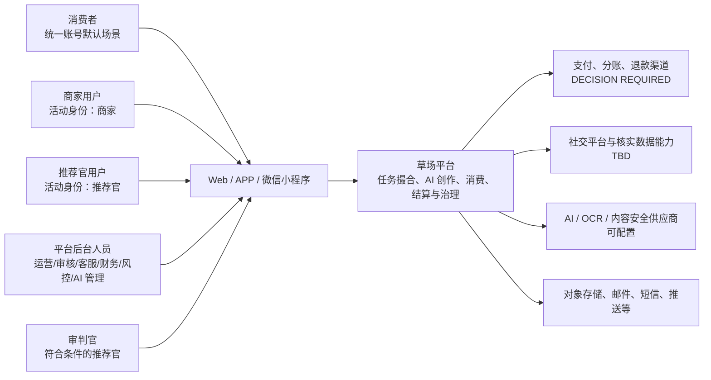
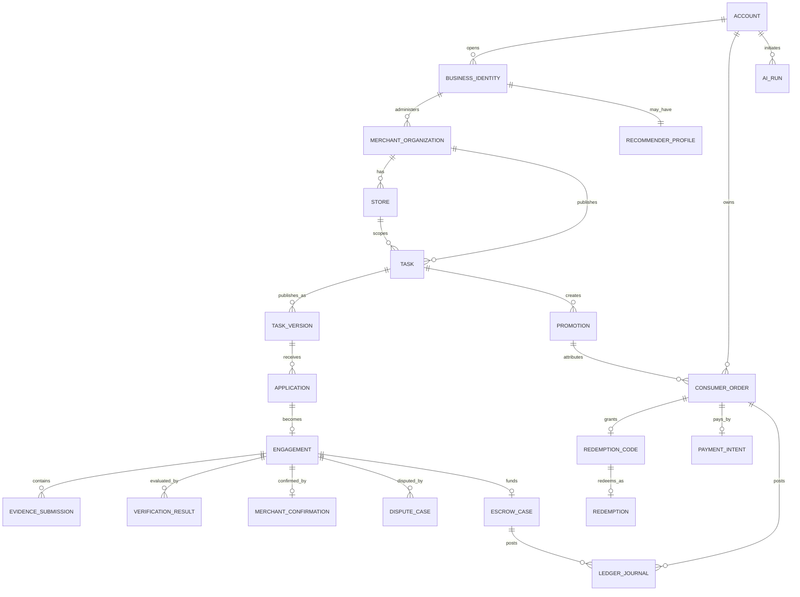
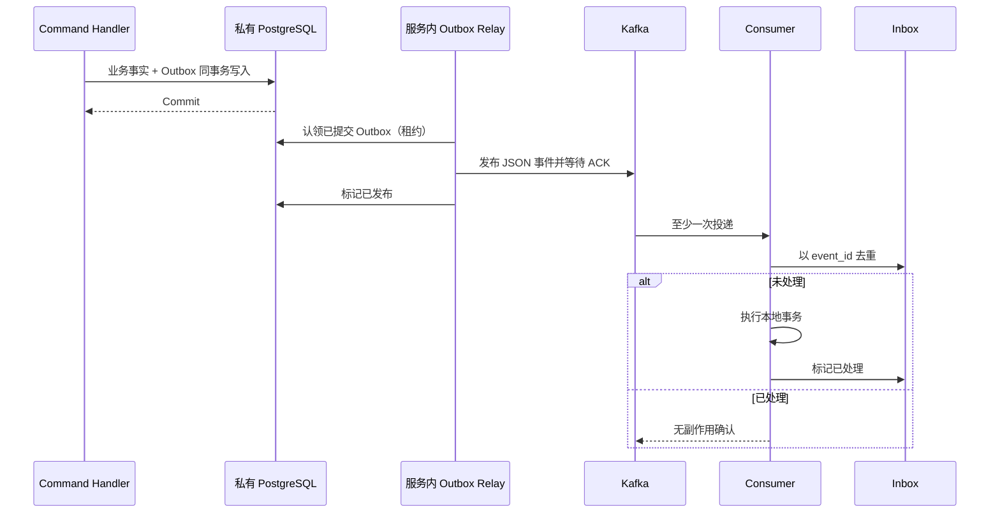
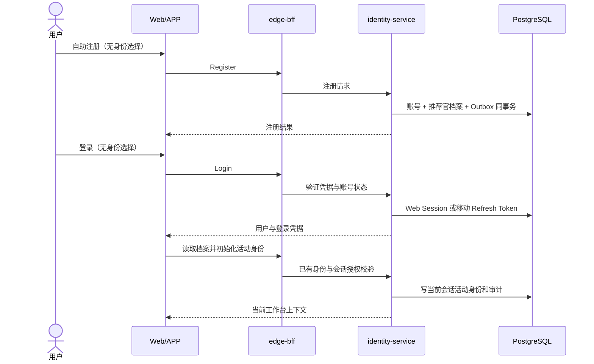
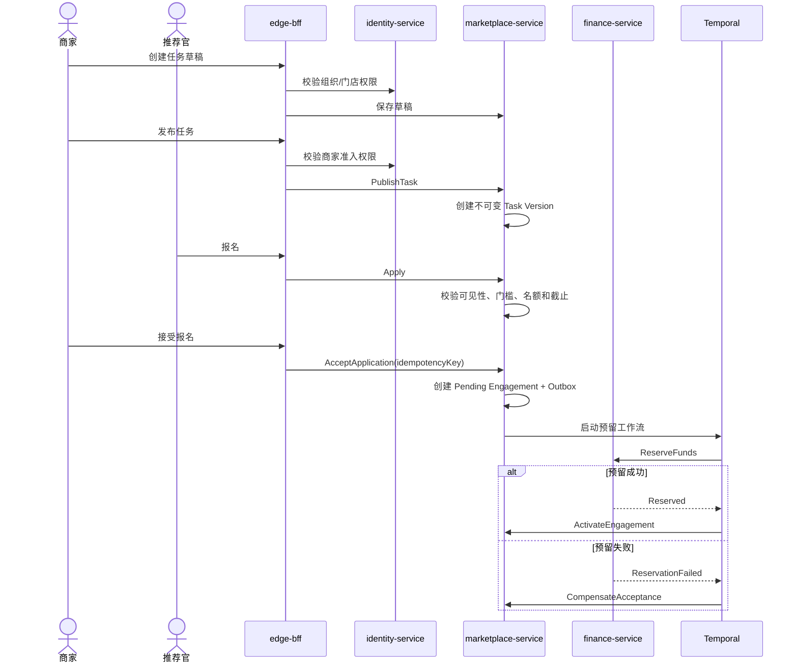
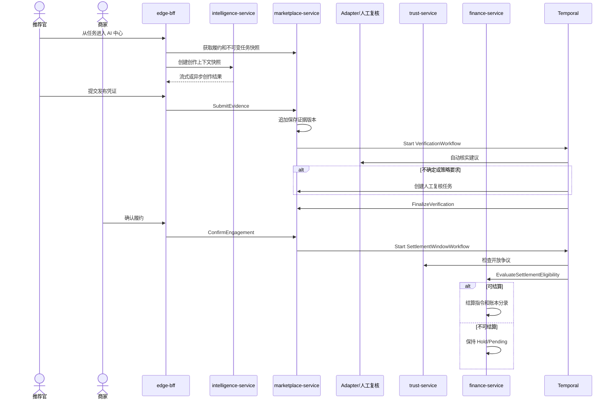
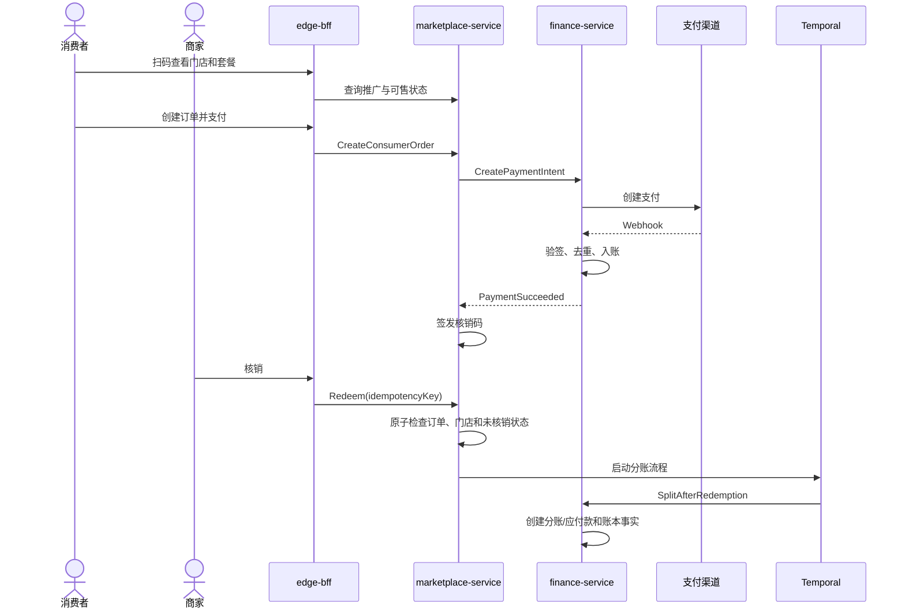
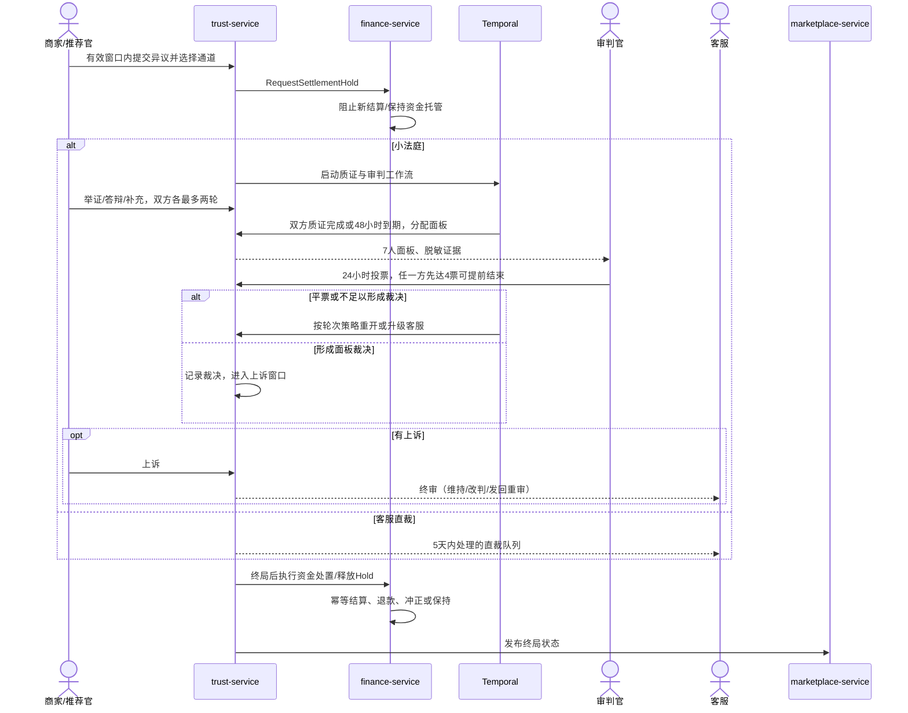
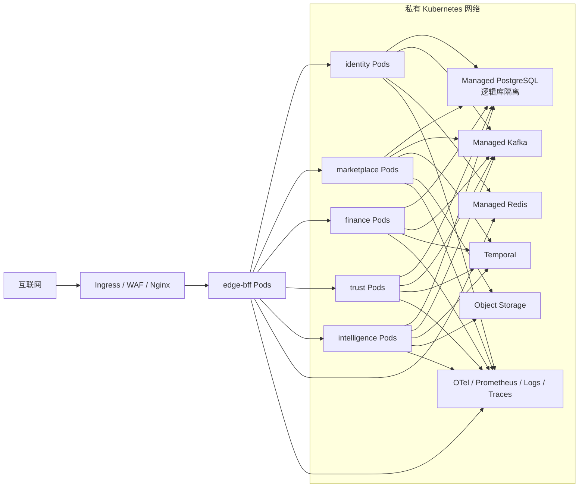

# 草场系统技术总体设计（HLD v0.2）

> 文档状态：**v0.2 条件批准的设计基线；目标项不等同于当前实现**
> 整理日期：2026-09-15。有效迁移原则与技术取舍从旧 Java 蓝图收敛至本文，产品流程按后续 PRD 与任务书校准；本次不作新业务决策或上线批准。文件名保留历史 `HLD-v0.1` 供现有引用使用。
> 产品基线：[《草场产品需求文档》](../产品/草场产品需求文档.md)；本 HLD 初始按 PRD v1.4 编写，链接指向持续更新的产品文档。
> 决策依据：[ADR](../adr/README.md)；运行时事实：[项目架构详解](项目架构详解.md)；历史来源：[Java 迁移蓝图原文](../归档/草场Java微服务技术架构与渐进迁移方案（合并前来源）.md)。
> 目标：为 ADR、TDD、LLD、OpenAPI、Protobuf 契约和渐进迁移实施提供系统级设计基线
> 批准范围：六服务边界、数据所有权、Sandbox 金融不变量，以及 ADR D-02、D-03、D-06、D-07、D-10、D-11 已采纳规则。
> 生产门禁：ADR D-01 仅部分采纳；真实 PSP、签约/合规主体、客户备付金/存管、真实退款/分账/付款与对账方案冻结前，消费者支付、核销分账和真实资金链路不得上线。

## 文档标记

本文以已采纳 ADR 定义架构约束，不提前冻结尚未确认的商业、合规或风控规则。图中的目标组件、概念模块名和设计接口不能直接当作部署清单；当前差异见 §2.4 和项目架构详解。未决内容统一使用以下标记：

- **ASSUMPTION**：为了完成架构推演采用的暂定假设，后续产品决策可以推翻。
- **TBD**：实现前仍需由产品、业务、合规或技术团队补充细节。
- **DECISION REQUIRED**：进入相关 LLD 或生产上线前必须完成的决策。

---

## 1. 文档范围

### 1.1 本版本覆盖范围

本 HLD 定义草场长期目标架构，以及从历史 Vue 3 + Express/TypeScript 后端契约迁移至 Java 微服务的总体方案，覆盖：

1. 统一账号、商家/推荐官活动身份和默认消费者场景。
2. 商家主体、多门店、成员关系和三级商家准入权限。
3. 推广任务、报名、履约、凭证、核实、商家确认和结算协作。
4. 消费者扫码下单、支付、核销、退款和推荐官/商家分账。
5. 争议、审判、客服终审和资金冻结协作。
6. 共用统一账号的独立 AI 内容创作应用，以及留在用户端的任务创作。
7. 六个 Java 部署单元，以及独立于后端的 Node 前端/测试工具链边界。
8. 数据所有权、同步 API、Kafka、Outbox、Inbox 和 Temporal。
9. 第三方支付、AI、社交平台核实、媒体、通知和对象存储边界。
10. 安全、部署、可观测性、韧性、测试和迁移策略。

### 1.2 本版本仍不冻结的内容

- 具体支付供应商和签约/合规主体。
- 每个社交平台的具体核实方法和 API 可用性。
- 商家三级权限所需材料、审核时效、额度和行业限制。
- 全量数据库字段、索引、事件 Payload 和错误码。
- AI/视频/图片供应商、模型路由算法、具体计费数值和内容审核阈值。
- APP 和微信小程序的具体页面及支付跳转交互。
- Service Mesh 的引入时机。

以下内容已通过 ADR 冻结，不再属于本节：D-02 资金模式合法组合、D-03 商家确认超时/拒绝/失联、D-06 争议资金处置、D-07 订单快照/库存/过期退款、D-10 数据保留框架和 D-11 AI 用量计费边界。D-10 的具体保留期阈值仍为 provisional，须经法务/财务校准。

### 1.3 已确认的产品事实

1. 草场使用一套统一账号体系。
2. 自助注册创建推荐官身份，商家账号由治理台初始化；已有身份档案的账号不再自助加开另一身份。存量双身份保留，登录时商家优先，用户界面不提供会话内身份切换。
3. 消费者是所有注册账号默认具有的使用场景，不是独立申请的身份。
4. AI 内容创作中心是独立应用，共用统一账号，任何注册账号可登录使用，游客可受限试用；它不是独立业务身份。任务创作仍留在草场 `/creation`。
5. 创作需确定目标平台、受支持的内容形式与规则版本，任务/门店来源带入相应上下文；详细流程以 PRD 和当前创作任务书为准。
6. 商家采用“商家主体 + 多门店”模型。
7. 商家准入分为草稿权限、基础发布权限和资金交易权限。
8. 新草场领域数据由 Java 服务持有并单写；兼容基础表仍在当前 PostgreSQL 中使用。领域所有权不等于已经完成物理拆库，落地边界见 §6.1。
9. 初始 Java 服务为 `edge-bff`、`identity-service`、`marketplace-service`、`finance-service`、`trust-service` 和 `intelligence-service`。
10. 后端全部由 Java 25 承载；Node 仅用于 Vue/Vite、Vitest、Playwright/E2E seed 和 Java Playwright driver，不直接提供 API 或领域 Worker。

---

## 2. 架构目标与原则

### 2.1 架构目标

- 在不破坏现有 Vue `/api/**`、Cookie、SSE、Multipart、签名媒体 URL 和 Range 流的前提下完成渐进迁移。
- 任务、报名、履约、凭证、核实和商家确认在同一服务边界内保持强一致。
- 资金托管、退款、结算和分账具有不可变、可审计、可对账的账本记录。
- 跨服务流程可重试、可补偿、可人工介入，不依赖 XA/2PC。
- AI、OCR、爬虫和外部平台数据只提供建议或候选事实，不能单独执行不可逆资金裁决。
- Web、APP 和小程序保持核心业务状态、权限与金融结果一致。
- 每一批路由和能力都可以单独灰度、切换和回滚。

### 2.2 非目标

- 不在首期将每个实体或业务名词拆成独立服务。
- 不为了全部 Java 化而牺牲业务连续性。
- 不使用跨库 JOIN、共享业务 Entity、共享 Repository 或分布式事务。
- 不让 BFF 保存任务、争议、支付和账本事实。
- 不将 Redis、缓存余额或 Temporal 历史作为金融事实来源。
- 不自动发布第三方平台内容。
- 不以 AI 自动核实直接触发结算、退款、没收、封禁或争议终审。

### 2.3 设计原则

|原则|落地约束|
|---|---|
|兼容优先、渐进绞杀|冻结旧 `/api/**` 契约；所有路由先经过 `edge-bff`，支持单路由切换和回滚。|
|按一致性边界拆分|任务、申请、履约、证据、核实和商家确认保留在 `marketplace-service`。|
|事实单写|每个领域事实只有一个权威写入服务。|
|本地事务 + 异步事件|业务数据与 Outbox 同事务；跨服务使用 Kafka、幂等 Command 和 Temporal。|
|金融不可变|已过账记录不能修改或删除，只能追加冲正；余额投影可以重建。|
|最小信任|浏览器只访问 BFF；内部身份头由 BFF 清除并重新签发；服务独立授权。|
|人工可介入|核实、争议、风险和资金不确定状态必须支持人工处理。|
|显式版本化|任务、平台规则、金融 Policy、证据、模型、创作上下文和事件 Schema 均版本化。|
|幂等和可恢复|外部回调、Command、Kafka Consumer、Temporal Activity、支付和核销均幂等。|
|配置不篡改历史|模型、平台规则、商家资料和素材更新不能覆盖历史任务和履约快照。|

---

### 2.4 技术选型与落地边界

本节合并旧迁移蓝图的选型与取舍，区分稳定约束、当前落地和后续选项；没有重新批准任何尚未决策的技术项。

| 主题 | 当前仓库落地 | 目标或后续选项 |
|---|---|---|
| Java 平台 | Java 25、Spring Boot 4.1、Gradle Kotlin DSL；Edge 使用 Gateway WebFlux | 保持统一版本，不再把旧方案的临时 JDK 21 选项当作现行基线 |
| SQL 与事务 | 业务走 R2DBC；JDBC/Flyway 只承担迁移；金融显式事务与约束 | 旧 jOOQ/HikariCP 业务栈未采用，不能按蓝图另起并行持久化体系 |
| 数据所有权 | 同库、各域独立迁移历史；Edge 有身份数据只读例外 | 独立逻辑库、独立账号；拆库前消除跨域表依赖与认证读耦合 |
| 事件 | Kafka + JSON，服务内 Outbox Relay，Inbox/操作号幂等 | Protobuf、Apicurio 与 Debezium 是原目标选项，需独立兼容性设计后引入 |
| 长流程 | Temporal 编排跨服务和媒体任务 | 数据库仍是领域事实来源；不引入 XA/2PC |
| 会话 | PostgreSQL Web Session；自有 HMAC Access Token + 不轮换的 Refresh Token | Redis 主会话、OAuth/OIDC、Refresh Token Family 未实现，不作为当前接入要求 |
| 媒体 | Java Intelligence、S3/MinIO、FFmpeg、Java Playwright driver | 仅按真实容量或团队边界拆出媒体/AI 服务，不以框架偏好拆服务 |
| 部署 | Compose 默认栈及生产/观测覆盖文件 | Kubernetes、独立 ServiceAccount/NetworkPolicy/PDB/HPA 与托管基础设施是目标形态 |
| 可观测性 | Micrometer、Prometheus、Alertmanager、Grafana、Loki、Tempo 与可选 OTel Collector | 生产投递、告警接收与容量/灾备演练需独立验收 |

旧蓝图的仓库重排建议（如 `apps/web-vue`）未采用，当前归位规则只以[目录结构](目录结构.md)为准。共享模块只提供横切能力和协议，不共享领域 Entity、Repository 或业务写入权。后续拆分必须有容量、合规、团队或独立发布需求依据。

---

## 3. C4 系统上下文



### 3.1 外部参与方

|参与方|主要行为|系统边界|
|---|---|---|
|商家|管理主体/门店/成员/素材，发布任务，筛选推荐官，确认履约，核销，查看资金|仅在有效商家身份和组织权限范围内操作。|
|推荐官|浏览和报名任务，创作内容，提交凭证，查看收益，提出争议|只能访问公开或明确授权的数据。|
|消费者|扫码、下单、支付、查看核销码、退款和售后|消费订单归统一账号，但不混入商家任务资金或推荐官收益。|
|平台后台人员|审核、客服、财务、风控、模型与平台配置|不能直接覆盖不可变任务版本、证据、投票和已过账账本。|
|审判官|处理被分配争议|仅能访问案件所需的脱敏证据，不拥有完整后台权限。|
|支付渠道|支付、退款、付款/分账、回调和对账|**DECISION REQUIRED**：确定供应商、持牌能力和责任边界。|
|社交平台/核实来源|链接、API、公开数据或授权数据|**TBD**：逐平台确认可用性、稳定性与合规性。|
|AI/媒体供应商|文本、视觉、语音、图片、视频和内容安全能力|输出为创作或核实建议，密钥只由服务端持有。|

---

## 4. C4 容器架构

下图表达目标边界。独立逻辑库、Schema Registry 和各域的完整 Temporal 接线不表示已经全部部署；当前拓扑见[架构详解](项目架构详解.md#2-总体拓扑)。

```mermaid
flowchart TB
  subgraph Public["公共网络与客户端"]
    Web["Vue 用户端 Web"]
    AICreation["Vue AI 创作端 Web"]
    Mobile["APP / 微信小程序\n后续"]
    Admin["平台后台 Web"]
  end

  subgraph Platform["草场受控运行环境"]
    Edge["edge-bff\nSpring Cloud Gateway WebFlux"]
    Identity["identity-service\n账号、身份、组织、成员、会话"]
    Marketplace["marketplace-service\n任务、报名、履约、证据、核实、核销"]
    Finance["finance-service\n支付、托管、账本、退款、结算、分账、对账"]
    Trust["trust-service\n争议、审判、声誉投影、风险"]
    Intelligence["intelligence-service\nAI、媒体、素材、模型、热点、核实 Adapter"]
    Kafka["Kafka + Apicurio Registry"]
    Temporal["Temporal"]
    Redis["Redis"]
    ObjectStore["S3 / MinIO"]
    Observability["OpenTelemetry / Metrics / Logs / Traces"]

    IdentityDB[("identity_db")]
    MarketplaceDB[("marketplace_db")]
    FinanceDB[("finance_db")]
    TrustDB[("trust_db")]
    IntelligenceDB[("intelligence_db")]
  end

  subgraph External["外部依赖"]
    Pay["支付与分账渠道\nTBD"]
    Social["社交平台/核实数据源\nTBD"]
    Models["AI / OCR / 媒体供应商"]
    Notify["邮件 / 短信 / 推送\nTBD"]
  end

  Web --> Edge
  AICreation --> Edge
  Mobile --> Edge
  Admin --> Edge

  Edge --> Identity
  Edge --> Marketplace
  Edge --> Finance
  Edge --> Trust
  Edge --> Intelligence

  Identity --> IdentityDB
  Marketplace --> MarketplaceDB
  Finance --> FinanceDB
  Trust --> TrustDB
  Intelligence --> IntelligenceDB

  Edge <--> Redis
  Identity <--> Redis
  Marketplace --> ObjectStore
  Intelligence --> ObjectStore

  Identity <--> Kafka
  Marketplace <--> Kafka
  Finance <--> Kafka
  Trust <--> Kafka
  Intelligence <--> Kafka

  Marketplace <--> Temporal
  Finance <--> Temporal
  Trust <--> Temporal
  Intelligence <--> Temporal

  Finance --> Pay
  Intelligence --> Social
  Intelligence --> Models
  Identity --> Notify

  Edge --> Observability
  Identity --> Observability
  Marketplace --> Observability
  Finance --> Observability
  Trust --> Observability
  Intelligence --> Observability
```



### 4.1 容器职责

|容器|核心职责|明确禁止|
|---|---|---|
|`edge-bff`|唯一外部入口、旧 API 兼容、`/api/v2`、会话解析、边缘安全、SSE/媒体代理和有限聚合|保存任务/资金/争议事实、将 §6.1 的身份只读例外扩大为任意跨域查询、缓冲完整流、自动重试非幂等写请求。|
|`identity-service`|账号、凭据、身份档案、商家组织、成员关系、会话、Token 和权限|保存金融余额、判断任务履约、作为推荐官等级权威来源。|
|`marketplace-service`|任务版本、报名、接受、履约、证据、核实、商家确认、推广关联、核销与声誉计算|直接记账、直接执行支付、作出争议终局裁决。|
|`finance-service`|金融 Policy、支付、托管、双录账本、退款、结算、分账和对账|直接改变任务或争议状态。|
|`trust-service`|争议、审判、上诉、客服终审、声誉投影和风险信号|直接写金融数据库或自行过账。|
|`intelligence-service`|AI 内容创作、模型配置、素材、热点、媒体任务和平台核实 Adapter|发布任务、接受报名、作出最终资金裁决。|
|Node 工具链（不属于后端容器）|Vue/Vite 开发构建、Vitest、前端 Playwright/E2E seed；Intelligence 镜像内的 Node 仅作为 Java Playwright driver|启动 Node HTTP 服务、Node 领域 Worker、Node 数据库迁移或重新引入 Express。|

---

## 5. 服务内部模块划分

以下名称表示职责划分，不要求创建同名 Java 包；真实包与模块入口由[架构详解](项目架构详解.md#4-服务职责与共享模块)维护。

### 5.1 `edge-bff`

- `route-manifest`：路由、上游、认证、限流、超时、Body 上限、响应模式和回滚开关。
- `legacy-compatibility`：旧 JSON Envelope、中文错误、`y1.sid`、CAPTCHA SVG、SSE 和 Range。
- `v2-api`：版本化接口、结构化错误、分页和幂等；OAuth/OIDC 属后续客户端选项。
- `session-token`：当前 PostgreSQL Session 与移动 Token 解析；不保留 Express/Redis 双读会话桥。
- `internal-assertion`：清除客户端伪造头，签发短时内部身份断言。
- `edge-security`：CSRF、CORS、限流、安全 Header 和上传保护。
- `read-composition`：只对低扇出、非金融页面做有限聚合。

### 5.2 `identity-service`

- `account`：账号、凭据和账号级状态。
- `authentication`：注册、登录、验证码、CAPTCHA、MFA 和登录审计。
- `session-token`：Web Session、移动 Access/Refresh Token、设备撤销和跨应用一次性免登；Family/OIDC 不是当前协议。
- `identity-profile`：商家与推荐官身份档案、活动身份。
- `merchant-organization`：商家主体、成员关系和权限委派。
- `store-membership`：门店范围成员和资源授权。
- `authorization`：资源级权限决策。
- `identity-projection`：身份展示所需的跨域读模型；推荐官声誉权威在 Marketplace，不能由 Identity 重算。

### 5.3 `marketplace-service`

- `task-catalog`：任务草稿、不可变版本、可见性、平台、内容形式和截止规则。
- `application`：报名、审核、接受、拒绝和名额控制。
- `engagement`：履约实例、任务快照、状态机和时限。
- `evidence`：凭证集合、追加补交、对象引用和访问控制。
- `verification-orchestration`：核实请求、建议汇总、人工复核和最终核实状态。
- `merchant-confirmation`：商家确认、拒绝和待处理状态。
- `promotion-commerce`：推广二维码、商品/套餐引用、订单关联和一次性核销事实。
- `reputation`：履约统计、等级、降级与版本化声誉规则。
- `read-models`：任务大厅和商家/推荐官工作台投影。

### 5.4 `finance-service`

- `product-policy`：三种资金模式的版本化 Policy。
- `payment-intent`：支付意图、支付尝试、Webhook Inbox 和未知状态恢复。
- `escrow`：预留、托管、冻结、释放和分配。
- `ledger`：账户、Journal、Posting、冲正和余额投影。
- `settlement`：结算指令、收款资格和 T+1/T+2 快照。
- `refund`：退款请求、状态和竞态处理。
- `split`：核销后的推荐官佣金和商家应收。
- `reconciliation`：支付、账本和供应商对账。
- `idempotency-audit`：命令、回调和供应商交易号审计。

### 5.5 `trust-service`

- `dispute-case`：争议受理、证据引用和期限。
- `adjudication`：审判官资格、冲突排除、抽取、投票、重开和上诉。
- `customer-service-decision`：客服最终裁决。
- `reputation-projection`：读取 Marketplace 的声誉结果，支持审判资格与风险判断。
- `risk`：风险信号和人工复核建议。
- `finance-integration`：发布 Hold、Release 和 Decision，不直接改账。

### 5.6 `intelligence-service`

- `creation-orchestration`：平台优先创作、流式/异步任务、取消和重试。
- `platform-capability`：平台 × 内容形式 × 规则版本。
- `context-snapshot`：独立、门店和任务创作上下文快照。
- `asset-library`：商家、个人、公共和 AI 素材及授权期限。
- `model-control-plane`：平台模型、Provider、能力路由、预算、健康和 BYOK。
- `usage-account`：AI 用量预留、扣减、退回和流水。
- `media-reference`：视频提取、预览、音频、分析和对象生命周期。
- `verification-adapter`：链接、API、OCR 和视觉核实建议。
- `media-provider-adapter`：由 Java Intelligence 调用媒体/AI provider，并记录审计、进度和取消传播；Node 仅作为 Java Playwright driver。

---

## 6. 数据所有权与概念模型

### 6.1 Database-per-service

**目标约束**：可共用 PostgreSQL Cluster，但领域数据库与凭据应独立，各有 Flyway 历史。

**当前差异**：Compose 共享 `DATABASE_URL`，尚未完成独立库/账号隔离。Edge 为认证只读身份表，范围包含 Session、Refresh Token、账号、活动身份、后台角色、组织与首次改密标记；不是“完全无 DB”，也不限于 `session` 一张表。现存兼容表引用与拆库前置条件见[架构详解 §6](项目架构详解.md#6-postgresql-与迁移)。下表数据库名是目标名称。

|服务|数据库|权威实体组|
|---|---|---|
|Identity|`identity_db`|Account、Credential、Session/Token、Identity Profile、Organization、Membership、Store Membership、Auth Audit|
|Marketplace|`marketplace_db`|Task、Task Version、Application、Engagement、Evidence、Verification Result、Merchant Confirmation、Promotion、Redemption、Reputation|
|Finance|`finance_db`|Product Policy、Payment、Escrow、Ledger、Settlement、Refund、Payout、Reconciliation|
|Trust|`trust_db`|Dispute、Decision、Judge Assignment/Vote、Appeal、Reputation Projection、Risk Signal|
|Intelligence|`intelligence_db`|Platform Capability、AI Run、Context Snapshot、Asset Metadata、Model Config、Usage Record、Media Job、Hot Topic Cache|
|兼容基础表|当前共享库|`app_users`、`session`、邮箱验证码由 Identity 使用；`user_settings` 由 Intelligence 使用；bootstrap 只负责基线建表与校验，不成为业务写入方|

### 6.2 跨服务数据规则

- 跨服务引用使用 UUID/ULID，不建立跨服务外键。
- 禁止跨服务数据库 JOIN 和共享 ORM Entity。
- 业务展示通过 BFF 有限组合或 Kafka 驱动的本地投影实现。
- 读模型记录 `source_event_id`、`aggregate_id`、`aggregate_version` 和 `projected_at`。
- 对象本体存入 S3/MinIO，领域服务只保存元数据、权限和引用。
- 任务、证据、金融 Policy、平台规则和模型必须保存使用时的版本快照。

### 6.3 概念实体关系



> 该图只表达跨领域概念关系，不代表单一物理 ER 模型，也不表示跨库外键。

### 6.4 金额和账本原则

- 金额在数据库中使用 `BIGINT` 最小货币单位和 ISO Currency。
- Java 使用受约束的 Money Value Object；新契约按字符串传输最小货币单位。既有 API 字段保持兼容，不能仅据目标要求直接改变响应类型。
- 每个 Ledger Journal 至少包含两个 Posting，同币种借贷合计必须为零。
- Finalized Journal 不允许 UPDATE 或 DELETE。
- 错误通过 Reversal Journal 修正。
- 每个业务 Command、供应商交易和 Webhook Event 必须唯一。
- 缓存余额只是投影，必须可以从 Posting 重建。

---

## 7. API 与 BFF 设计

### 7.1 API 分层

|API 面|使用方|契约原则|
|---|---|---|
|旧 `/api/**`|现有 Vue Web|冻结现有路径、Cookie、JSON、中文错误、SSE、Multipart 和媒体流语义。|
|新 `/api/v2/**`|新 Web 页面、APP、小程序和后台新能力|目标约定见 §7.3；当前消费接口以已实现 Controller 为准，不保证目标项已全部具备。|
|BFF → 内部服务|BFF 和领域服务|短时内部身份断言、服务身份和领域 Command/Query。|
|Kafka 事件|各领域服务|当前 JSON；Protobuf Envelope 和 Schema Registry 是演进选项，见 §8。|
|外部 Adapter|Finance、Intelligence、Identity|供应商 DTO 和错误不进入领域模型。|

### 7.2 旧接口兼容要求

兼容行为统一维护在[旧 API 兼容契约矩阵](草场旧API兼容契约矩阵.md)，包括 JSON/中文错误、Cookie、SVG、POST SSE、Multipart、签名媒体、Range 和限流 Header。当前由 Java Controller 与 Edge 契约测试定义，不再引用已退役的 Express 源码。

SSE 和 Binary Route 禁止完整缓冲到 Java Heap，非幂等 POST 禁止自动重试。路由开关只停用对应入口，不构成 Express 回退通道。

### 7.3 `/api/v2` 约定

以下是新接口设计目标，不是对现有每个 `/api/v2` Controller 的完成声明；客户端接入仍需核对实际请求/响应契约。

- 所有有副作用的写 Command 默认要求 `Idempotency-Key`。
- 金额以字符串形式的最小货币单位传输。
- 错误至少包含 `code`、`message`、`traceId` 和可选 `fieldErrors`。
- 列表默认 Cursor Pagination。
- `activeIdentity` 只是请求意图，服务端必须重新验证身份和资源权限。
- 上传采用“申请上传凭据 → 上传 → 确认对象引用”的三步模式。
- 上传完成不等于证据或素材已经通过业务接收和安全检查。
- **TBD**：APP/小程序 OAuth、微信绑定、支付跳转和回跳规范。

### 7.4 内部身份断言

BFF 清除客户端传入的内部身份 Header，基于已验证的 Session/Token 与当前账号状态签发目标服务断言。上下文覆盖账号、活动身份、后台角色、组织准入、会话、认证强度/重新认证时间，以及 issuer、audience、purpose、kid、jti 和有效期。

具体 Wire 字段由 `platform-identity-assertion` 共享类型和签名/验签器定义，不直接复用移动 Access Token 的 Payload。断言绑定目标服务并防重放；领域服务仍校验资源级权限，不能只信任 BFF 声明的角色。当前 Edge 需要只读身份库的实现例外见 §6.1。

---

## 8. Kafka、Outbox 与 Inbox

### 8.1 事件 Envelope

当前发布器发送 JSON，公共 Wire 字段为 `eventId`、`eventType`、`aggregateType`、`aggregateId`、`payload`；数据库 Envelope 的审计字段不保证全部进入消息。实际类型见 [EventEnvelope](../../platform-java/platform-messaging/src/main/java/com/grassland/messaging/EventEnvelope.java) 与发布器。

以下保留版本化事件 Envelope 的目标字段；若引入 Protobuf/Registry，需要先明确与现有 JSON 消费者的兼容迁移：

```text
event_id
event_type
schema_version
aggregate_type
aggregate_id
aggregate_version
occurred_at
correlation_id
causation_id
tenant_id / organization_id
payload
```

初始 Topic：

- `grassland.identity.events`
- `grassland.marketplace.events`
- `grassland.finance.events`
- `grassland.trust.events`
- `grassland.intelligence.events`

Kafka Message Key 使用 Aggregate ID，只保证同一 Aggregate 的顺序，不依赖不同 Key 的全局顺序。

### 8.2 Outbox/Inbox 模型



规则：

1. 禁止业务数据库与 Kafka 双写。
2. Consumer 使用 Inbox 和业务幂等键保证重复消息无副作用。
3. 失败进入有限重试和 DLQ，Replay 需要权限和审计。
4. 事件变更保持消费者兼容；未来引入 Schema Registry 时配置强制兼容检查，破坏性变更发布新事件版本。
5. 事件用于跨服务事实传播，不能替代金融账本。

### 8.3 初始事件目录

本表是设计层事件示例；不是当前事件名和消费者的完整注册表，真实发布/订阅与 JSON 字段需查服务代码。

|来源|事件示例|主要消费者|
|---|---|---|
|Identity|`AccountRegistered`、`IdentityOpened`、`ActiveIdentityChanged`、`MerchantPermissionGranted`、`StoreUpdated`|Marketplace、Intelligence、Trust|
|Marketplace|`TaskPublished`、`ApplicationAccepted`、`EngagementCreated`、`EvidenceSubmitted`、`VerificationFinalized`、`MerchantConfirmed`、`RedemptionSucceeded`|Finance、Trust、Intelligence|
|Finance|`FundsReserved`、`ReservationFailed`、`PaymentSucceeded`、`PaymentUnknown`、`EscrowHeld`、`SettlementCompleted`、`RefundCompleted`、`SplitCompleted`|Marketplace、Trust、读模型|
|Trust|`DisputeOpened`、`SettlementHoldRequested`、`DisputeDecided`、`SettlementHoldReleased`、`ReputationUpdated`|Finance、Marketplace、Identity|
|Intelligence|`AiRunCompleted`、`AiRunFailed`、`UsageAdjusted`、`VerificationSuggestionReady`、`AssetProcessed`|Marketplace、运营读模型|

---

## 9. Temporal 工作流

### 9.1 使用范围

- 报名接受后的资金预留和失败补偿。
- 长时间核实、第三方重试和人工复核等待。
- 商家确认后的 T+2 结算窗口。
- 48 小时异议窗口。
- 7 名审判官的 24 小时投票、平票重开和上诉等待。
- 支付未知状态的查询、对账和恢复。
- 未核销订单、退款和分账重试。
- AI/媒体异步任务的进度、取消和恢复。

### 9.2 原则

- Temporal 保存流程进度，PostgreSQL 保存领域和金融事实。
- Workflow 不直接写业务数据库，只调用幂等 Activity/领域 Command。
- Activity 执行前重新校验业务状态和版本。
- Timer 到期只触发 Command，不直接结算或退款。
- Worker 重启、Replay、重复 Signal 和超时必须纳入测试。

### 9.3 初始 Workflow

以下是设计职责与概念名称，可能由多个已实现 Workflow、调度器或领域服务共同承担；不能据此查找同名类。当前工作流清单见[架构详解 §8](项目架构详解.md#8-temporal-长流程)。

|Workflow|发起条件|结果|
|---|---|---|
|`AcceptApplicationReservationWorkflow`|商家接受报名且需要资金预留|预留成功激活履约；失败补偿名额和申请状态。|
|`VerificationWorkflow`|推荐官提交凭证|汇总自动建议，必要时转人工复核，产生最终核实状态。|
|`SettlementWindowWorkflow`|商家确认且具备基础结算条件|等待争议/结算窗口，触发结算或保持。|
|`DisputeAdjudicationWorkflow`|有效争议被提出|资金 Hold、审判、重开、上诉和终局裁决。|
|`ConsumerPaymentRedemptionWorkflow`|消费者支付成功|管理待核销、退款窗口、核销后分账和异常。|
|`PaymentRecoveryWorkflow`|支付/退款/付款处于未知状态|主动查询、等待回调和对账恢复。|
|`AiMediaJobWorkflow`|图片、视频、媒体生成或解析|调度 Java Intelligence Adapter，管理进度、取消和恢复；Playwright 的 Node driver 仅为进程依赖。|

---

## 10. 核心业务时序

时序图表达业务参与者与约束，不是逐个 HTTP 调用的实现追踪；核实、支付恢复等具体编排以当前服务代码为准。

### 10.1 注册、登录与活动身份



当前产品规则以 [PRD 第一章](../产品/草场产品需求文档.md)和[任务书 #71](../任务书/草场任务书-71-身份模型改版.md)为准：

- 自助注册创建推荐官；商家账号只由治理台初始化，首次登录强制改密，商家再完成主体与 KYB。
- 登录/注册不让用户选择身份，按已有档案自动初始化，存量双身份商家优先；界面换身份需退出后重新登录。底层活动身份读写接口仍服务于初始化、兼容与会话管理，不据此恢复旧自助切换产品流程。
- 消费者是统一账号的默认场景，无需开通或切换成消费者身份。AI 应用的创作上下文也不随草场活动身份自动改变。
- 活动身份记录按 Session 隔离。账号级活动身份会话上限默认 `0`（不限）；配置为正数时，超限的旧设备回到消费者场景，但不删除其登录会话。该策略与 Refresh Token 的设备数量上限不同。

实现核对入口：[IdentityProfileController](../../platform-java/services/identity-service/src/main/java/com/grassland/identity/identityprofile/IdentityProfileController.java)、[移动认证方案](移动端刷新token认证方案设计.md)。

### 10.2 任务发布、报名接受和资金预留



**资金规则与后续产品边界：**

- 当前新任务按霸王餐押金、任务佣金、套餐推广三选一，不开放组合付费；创建、更新与修订统一由 [TaskCatalogFundingRules](../../platform-java/services/marketplace-service/src/main/java/com/grassland/marketplace/taskcatalog/TaskCatalogFundingRules.java) 校验。D-02 与任务书 #46 中的组合探索是历史背景，已由 [PRD §2.2](../产品/草场产品需求文档.md) 的 2026-08-22/09-04 决策收回；存量组合任务的双腿结算只为兼容，不代表仍可创建组合任务。
- 阶梯佣金已提前纳入内部结算：单指标版本化 Policy 在任务要求/版本快照中冻结，Finance 预留最高档，结算捕获实际档位并释放差额；Sandbox 指标事实由商家在确认动作中申报（`confirmed_metric_value` 与 `confirmed_at` 同事务冻结，自动确认未申报 → 结算暂缓转运营）；真实平台指标 provider 与 PSP 仍是独立生产门禁。
- 霸王餐押金由推荐官预付，达标全额返还；失败、商家取消、争议与协商退出按责任和已有资金状态处置，不笼统归为“退商家”。历史决策见 [D-02](../adr/D02-fund-model-combinations.md)、[D-12](../adr/D12-freebie-escrow.md)，后续履约/退出规则见任务书 #96/#97。
- 赏金实施全局可配上限，具体阈值由产品/风控配置，不写死在 HLD。

**配套细化规格：**非资金合作、违约与履约见[任务书 #96](../任务书/草场任务书-96-合作最小完整履约.md)，自动通过见[任务书 #27](../任务书/草场任务书-27-报名批量处理与自动通过.md)。按任务书和当前进度核对，不再把早期 HLD 的这两项直接当作未启动决策。

### 10.3 AI 创作、凭证、核实、确认和结算



**确认规则（ADR D-03）与后续履约细化：**

- 商家确认窗口默认 3 个自然日且按任务类可配；到期无操作自动确认并进入结算。
- 商家拒绝进入客服/争议裁定，不直接返还商家；客服 SLA 默认 3 个工作日，超时按系统核实结果结算。
- 补证最多 2 次，超限强制进入确认窗口。
- 商家取消时，已核实通过的履约保留结算；对取消范围内的已接受履约，有已确认里程碑则按里程碑部分结算并释放余款，无确认里程碑则按资金来源退回；霸王餐押金退推荐官。以 [TaskController 的取消处置](../../platform-java/services/marketplace-service/src/main/java/com/grassland/marketplace/taskcatalog/TaskController.java) 和[任务书 #96](../任务书/草场任务书-96-合作最小完整履约.md)为准，不能再一律写“未提交凭证全部退商家”。
- 协商退出及其终态竞争、资金续传和声誉口径由[任务书 #97](../任务书/草场任务书-97-资金与规则收口.md)细化，沿用同一幂等资金入口。
- 确认窗口通知至少使用站内信和事务邮件；Push/SMS 按用户已验证端点与偏好补充，不改变资金时序。

**仍待细化：**

- 各平台核实信号与人工阈值；补证上限遵循上述已采纳规则。
- 指标采样时点和争议期内数据变化规则。

### 10.4 消费支付、核销和分账



**已冻结（ADR D-07）：**

- 商品采用可变草稿与不可变已发布版本；消费者订单保存商品、价格、有效期、门店、归因和分账计划快照，后续配置变更不得改写历史订单。
- 下单使用数据库条件更新原子扣减库存；取消/退款幂等回补。首期一个订单只归因一个推荐官。
- 过期未核销订单自动全额退款，过期核销码拒绝核销。

**生产硬门禁（ADR D-01）：**

- 支付渠道托管、分账、退款、付款和对账能力。
- 签约/合规主体、客户备付金或存管模式、支付回调与对账责任边界。
- 部分退款、拒付、已核销售后退款及供应商不可逆状态的实际能力矩阵。
- “实时分账”的产品展示和供应商实际结算口径。

### 10.5 争议和资金 Hold



通道选择、质证、垂类面板、投票与上诉以 [PRD 第七章](../产品/草场产品需求文档.md)和[任务书 #74](../任务书/草场任务书-74-争议小法庭重构.md)为准。商家核实通过后拒绝确认的 D-03 流程仍直送客服，不混同用户自选直裁；客服直裁的 5 天 SLA 也不覆盖 D-03 的专门时限。发回重审时仍保持争议与资金保护，不能视为已最终结清。

**资金约束（ADR D-06）：**赏金类出账时点取 T+2 与 48 小时争议窗口的较晚者；核销类在核销后保留 48 小时冷静期再分账（任务书 #75）。争议时资金仍在托管态则按裁决 release/reverse；已入钱包未提现则追加 Reversal Journal；已提现或已分账则登记应收并抵扣未来结算/提现；已退款或供应商不可逆时接受既成事实或转法务。具体清偿与可用余额校验见[任务书 #97](../任务书/草场任务书-97-资金与规则收口.md)，不在 HLD 重复维护金额算法。首期不开平台垫付。所有资金动作只追加账本与审计，禁止改写原账。

**生产硬门禁（ADR D-01）：**真实 PSP 对退款、分账撤回、付款止付、拒付和追偿的能力边界尚未冻结；D-06 冻结的是领域处置语义，不代表外部资金通道已经可用。

---

## 11. 安全和信任边界

### 11.1 信任边界

1. 客户端到 BFF：不可信输入，执行认证、CSRF、限流、Schema 校验和上传限制。
2. BFF 到内部服务：短时身份断言、服务身份、网络隔离和 Trace Context。
3. 服务到数据库：目标为独立凭据与网络策略；当前共享库和 Edge 只读例外见 §6.1，不能据目标声明已实现凭据隔离。
4. 服务到 Kafka/Temporal：按 Topic/Namespace 最小授权，Payload 避免敏感数据。
5. 服务到对象存储：服务端授权和短时签名 URL，访问前检查资源权限。
6. 服务到外部供应商：Adapter、超时、SSRF、签名验证、凭据隔离和审计。
7. 后台人员到平台后台：MFA/再认证、最小权限、审批和不可变审计。

### 11.2 基础安全要求

- 存量密码仅按已实现验证器兼容，成功登录时升级为 Argon2id；当前兼容 bcrypt，不把旧方案的 scrypt 设想当作支持承诺。
- Web 使用 BFF Cookie；当前移动认证使用自有 HMAC Access Token 和不轮换的 Refresh Token，字段与撤销规则见[认证方案](移动端刷新token认证方案设计.md)。OAuth/OIDC 与 Family 属后续选项。
- 内部身份断言必须绑定 issuer、audience、purpose、principal、`kid`、`jti` 和短 TTL；replay 使用 Redis 原子 `SET NX` 跨副本拦截并在存储故障时 fail-closed。签名与验签密钥分离，轮换按“预发布新验签键 → 切换 current signing key 并保留旧键 → 等待 TTL + leeway → 移除旧键”执行。
- 财务、收款设置、后台角色和终局裁决要求重新认证/MFA。
- 外部 URL 执行 Host Allowlist、DNS/IP 复核、私网禁止和重定向限制。
- 支付 Webhook 保存 Raw Body，验证签名、时间戳、Nonce，并进行 Event ID 去重。
- 浏览器不能获得 AI、支付和社交平台 Provider Key。
- BYOK 使用 Envelope Encryption，数据库只保存密文、Key Version 和掩码提示。
- 日志、Trace、事件和错误中不记录密码、Cookie、完整 Key、支付敏感数据和未脱敏证据。
- 系统不保存 PAN/CVV。
- 素材和证据保存来源、授权范围、有效期和访问审计。
- 数据按类别分级保留，支持结清后注销、主体数据导出和证据脱敏；财务与不可变审计长期保留，PII、证据、日志按最小必要期限清理。具体期限及高风险行业规则按 ADR D-10 标记为 provisional，须经法务/财务校准后才能作为生产合规口径。

---

## 12. 第三方依赖与 Adapter

### 12.1 依赖矩阵

|领域|内部端口|能力|未决事项|
|---|---|---|---|
|支付|`PaymentProviderAdapter`|支付、查询、退款、Webhook、付款/分账、对账|**DECISION REQUIRED**：供应商和合规模式。|
|社交核实|`VerificationDataAdapter`|链接、授权 API、指标、截图/OCR 建议|**TBD**：逐平台可用和合法方案。|
|AI|`AiCapabilityAdapter`|文本、视觉、图片、视频、语音、内容安全、Embedding|平台模型、组织模型和 BYOK 路由策略。|
|媒体|`MediaProcessingAdapter`|解析、转码、音频、预览、签名下载和生成|Java Intelligence 的真实 provider、FFmpeg/Playwright 运行稳定性和生产凭据门禁。|
|通知|`NotificationAdapter`|站内信、事务邮件、短信、推送和验证码|站内信、事务邮件及 provider-neutral Push/SMS outbox 已实现；生产供应商、凭据、模板备案、退订/送达 SLA 和容量演练仍属部署门禁。|
|对象存储|`ObjectStorageAdapter`|上传票据、受控下载、保留、删除和校验|生产存储与数据地域。|
|风控|`RiskSignalAdapter`|账号、交易、任务和内容风险信号|自动限制与人工复核边界。|

### 12.2 Adapter 示例接口

```text
PaymentProviderAdapter
- createPaymentIntent(command): ProviderPaymentSession
- queryPayment(providerTransactionId): PaymentStatus
- refund(command): RefundResult
- verifyWebhook(rawRequest): VerifiedWebhookEvent
- createTransferOrSplit(command): TransferResult
- importReconciliation(statementRef): ReconciliationRecords

VerificationDataAdapter
- verifyPublication(command): VerificationSuggestion
- fetchAuthorizedMetrics(command): MetricsSnapshot
- inspectEvidence(command): EvidenceAnalysisSuggestion

AiCapabilityAdapter
- startTextRun(command): StreamOrRunHandle
- startMediaRun(command): RunHandle
- cancel(runId): void
- validateCredential(command): CapabilityCheckResult
```

供应商 DTO、错误码、限流和重试策略停留在 Adapter 层，不进入领域模型。

### 12.3 平台 AI 模型配置

平台后台提供 AI 能力管理入口：

- 按文本、视觉、图片、视频理解、视频生成、语音、内容安全和检索配置能力。
- 为每项能力配置平台主模型、备用模型、健康检查、预算、并发和适用范围。
- 普通用户默认直接使用平台能力，无需配置 Key。
- 用户或商家组织可以选择 BYOK；可以按能力选择平台模型或自有模型。
- 用户模型不支持某能力时，是否回退平台模型必须由用户/组织策略明确授权，不能静默扣除平台额度。
- 模型凭据服务端加密保存，普通成员可使用但不能查看完整 Key。

---

## 13. 部署设计

### 13.1 环境

| 环境 | 当前依据 | 设计边界 |
|---|---|---|
| 本地 | 默认 Compose：PostgreSQL、Kafka/KRaft、Redis、MinIO、Temporal 与 Java 服务 | 可观测性按 profile/覆盖文件启用；无 Apicurio/Debezium 部署前提 |
| 测试/预发 | 按 Compose、测试容器或实际平台验证 | 契约、Sandbox、迁移与回退验证不能用文档存在代替 |
| 生产 | 仓库提供生产 Compose 覆盖配置和发布脚本 | 外部持久化 Kafka/Temporal、凭据与演练按运行手册验收；下方 Kubernetes 是目标拓扑 |

执行步骤只在[生产发布与灾备运行手册](../运维/生产发布与灾备运行手册.md)维护。

### 13.2 部署拓扑

下图为 Kubernetes 目标形态，不能据此认定当前仓库已有全部部署清单或资源隔离。



### 13.3 配置、密钥和发布

以下同时包含现有发布约束与生产目标要求；Secret Manager、Kubernetes 等能力的完成状态仍以实际部署和运行手册为准。

- 非敏感配置使用 Spring Config Data；当前由 Compose/环境变量装配，Kubernetes ConfigMap 属目标形态。
- 密钥使用 Vault 或云 Secret Manager + External Secrets。
- 每个服务只读取自己的数据库和必要供应商凭据。
- 发布先通过独立 `release-migrator` 作业执行同源 Flyway 迁移；服务仍保留启动期迁移检查，成功发布后应无待执行迁移。
- 数据库演进使用 Expand → Backfill → Switch → Contract。
- 镜像采用最小 JRE、非 Root、只读文件系统、SBOM 和镜像签名。
- `finance-service` 生产发布必须人工审批。
- 初期使用 Kubernetes DNS，不引入 Eureka。
- 初期不引入 Service Mesh，mTLS 实现根据平台能力后续评估。

---

## 14. 可观测性与 SLO

### 14.1 统一遥测字段

- `request_id`
- `trace_id`
- `correlation_id`
- `causation_id`
- `account_id`（脱敏/受控）
- `organization_id`
- `aggregate_id`
- `workflow_id`
- `provider_id`
- `idempotency_key`
- `event_id`

目标要求 HTTP、Kafka、Temporal、支付、AI、账本和核实调用传播 W3C Trace Context；当前接线与缺口按实现和部署验收，不由字段清单推断。

### 14.2 SLO 占位表

|服务/流程|指标|目标|
|---|---|---|
|BFF|成功率、p95/p99、5xx、限流|**TBD：以历史契约基线和 Java 当前流量建立基线**|
|SSE|首字节、流中断、取消传播|**TBD**|
|媒体|206 成功率、416 异常率、代理首包|**TBD**|
|Kafka|Consumer Lag、Outbox Age、DLQ|**TBD；Finance/Trust 高优先级**|
|Temporal|卡住 Workflow、重试耗尽、Replay 失败|**TBD**|
|支付|未知状态、验签失败、回调延迟、退款/付款失败|**DECISION REQUIRED 前不可上线**|
|总账|借贷不平衡、重复过账、对账差异|不平衡零容忍|
|核实|Inconclusive、人工积压、核实耗时|**TBD，按平台统计**|
|争议|处理时长、投票完成率、Hold 时长|**TBD**|
|AI|成功率、耗时、成本、额度拒绝、内容拦截|**TBD，按能力和组织统计**|

---

## 15. 迁移设计

### 15.1 绞杀策略

迁移历史采用先接入 Edge、冻结 Wire 契约、按路由族切入 Java 的顺序，避免前端和后端同时重写。**当前 Express 已退役**，仓库不再提供 Express 上游或 Node 业务 Worker；旧文档中的透明转发、Session 双读和“单路由切回 Express”仅属于历史方案。

后续维护保留以下原则：

1. 所有公开业务 API 经过 Edge，领域能力由对应 Java 服务拥有。
2. 路由族变更先验证兼容、权限、幂等、SSE/Range/Multipart 和故障恢复，再切流。
3. `EDGE_ROUTE_*` 是停用开关；需要回退时按运行手册回退兼容的已发布 Java 版本，不恢复 Node 后端。
4. 每张业务表只有一个权威写入方，不长期双写；新迁移遵守 expand/backfill/switch/contract。
5. 数据库问题向前修复，账本、凭证、证据与审计不能通过删数据回滚。

### 15.2 阶段与当前对应

Epic 编号保留用于阅读历史记录，不是当前待办或整阶段完成证明。

| 历史阶段 | 迁移主题 | 当前对应与边界 |
|---|---|---|
| Epic 0 | ADR、兼容矩阵、合成契约与格式核对 | ADR 与 Java 契约测试继续维护；真实环境格式/凭据另行核对 |
| Epic 1 | Java 平台与统一 Edge | 当前公开 API 入口；不存在 Express fallback |
| Epic 2 | Identity 与会话迁移 | PostgreSQL Session 与移动 Token 已有实现，未采用 Redis 双读/OIDC 方案 |
| Epic 3 | 事件、工作流、存储与审计 | 当前为服务内 Outbox + JSON/Kafka + Temporal；不预设 Debezium/Registry 已部署 |
| Epic 4 | Marketplace | 任务、报名、履约、核验、声誉和消费领域由该服务维护 |
| Epic 5 | Finance Sandbox | 双录、预留、Hold、退款/分账及对账代码；真实资金仍受 D-01 约束 |
| Epic 6 | Trust | 争议、审判、上诉、客服与风险投影；生产资金动作仍受 D-01 约束 |
| Epic 7 | 消费核销与真实支付 | Web 消费链与 Sandbox 不等于真实 PSP、存管和外部对账验收 |
| Epic 8 | Intelligence Java 化 | 媒体、AI、草稿和创作工作流由 Java 承载；真实供应商/渠道另验收 |
| Epic 9 | APP/小程序 | 移动 Token 服务端能力已有；原生客户端、微信绑定、支付回跳等不得据此宣称交付 |

当前计划统一看[续接指南第四节](../草场开发进度与续接指南.md#四当前未完成开发与生产门禁按优先级)与[任务书索引](../任务书/README.md)，不把原蓝图的“前 90 天”排期重新列入 backlog。

### 15.3 后端 Java 完成标准与 Node 边界

- 后端路由、领域异步任务、数据库迁移、Outbox/Inbox、定时任务与审计有 Java 权威实现；没有 Node HTTP/领域 Worker 或 Express 回退。
- 迁移的响应、错误、权限、SSE、Range、Multipart、取消、幂等与恢复由兼容/集成/E2E 验证。
- Node 的允许范围为 Vue/Vite、Vitest、前端 Playwright、E2E seed、质量工具与 Java Playwright driver；这些工具的存在不构成后端未迁移项。
- Java 运行面收敛与真实 Provider、正式计费、生产容量和回调验收分别记录。后者未通过时，不以“已迁移 Java”宣称可以生产上线。

### 15.4 合并前来源与维护分工

[Java 迁移蓝图原文](../归档/草场Java微服务技术架构与渐进迁移方案（合并前来源）.md)于 2026-09-15 归档，保留原始阶段、退出条件和候选技术用于追溯；不再维护第二套当前架构。

| 原蓝图内容 | 继续维护的位置 |
|---|---|
| 技术选型、部署与仓库布局 | 本文 §2.4、§13；真实目录见[目录结构](目录结构.md) |
| 服务拓扑与数据所有权 | 本文 §4–§6；实现入口见[架构详解](项目架构详解.md) |
| BFF 兼容、登录与会话 | 本文 §7、§11；细节见[兼容矩阵](草场旧API兼容契约矩阵.md)与[认证方案](移动端刷新token认证方案设计.md) |
| Kafka、Outbox、Saga 与金融规则 | 本文 §6.4、§8–§10、§16 及对应 ADR |
| AI/媒体边界与外部依赖 | 本文 §5.6、§12、§15.3 |
| 迁移阶段、测试、决策与实施原则 | 本文 §15、§17、§19；原 90 天排期仅留在归档 |

---

## 16. 韧性和故障处理

|场景|处理|
|---|---|
|接受报名后资金预留超时|Workflow 查询/有限重试；未确认成功前不激活履约；最终失败执行补偿。|
|支付回调重复或乱序|Webhook Inbox 去重，以供应商状态机和主动查询结果为准，不重复入账。|
|支付发起超时|标记 `UNKNOWN`，禁止无关联重复扣款，进入查询/对账恢复。|
|商家确认后争议开启|Trust 请求 Finance Hold，结算执行前重新检查 Hold。|
|核销和退款并发|Marketplace 条件更新 + Finance 幂等和状态校验，只允许一个终局成功。|
|Kafka 重复/乱序|Inbox 去重，依据 Aggregate Version 拒绝旧事件，必要时查询源服务。|
|Temporal Worker 重启|Workflow Replay、Activity 幂等，业务事实从私有数据库重新校验。|
|AI Provider 不可用|按授权策略切换备用模型或明确失败，保留已完成步骤和用量流水。|
|Java provider/媒体依赖不可用|按任务状态重试、延迟或明确失败；不向客户端暴露 provider 临时地址，也不启动 Node 后端回退。|
|对象存储不可用|阻断证据/素材确认并保留草稿，禁止创建无对象引用的已提交证据。|
|核实结果不确定|进入 `INCONCLUSIVE` 或人工复核，不自动判定失败或移动资金。|

---

## 17. 测试策略

### 17.1 契约与兼容

- 旧 Express/Supertest 契约已由 Java 代理与领域测试承接；继续维护前端 Vitest 和浏览器 E2E，具体入口见[兼容矩阵](草场旧API兼容契约矩阵.md)。
- 覆盖 JSON、状态码、Cookie、CAPTCHA、Multipart、SSE、取消、Range、下载 Header、签名 URL 和限流 Header。
- 读路由迁移前可使用 Shadow；有副作用的 Command 只在 Sandbox/Replay 比较，禁止生产双写。
- 新 `/api/v2` 与事件契约需要版本化兼容检查；OpenAPI/Protobuf/Registry 属相应演进设计，不能写成当前完整 CI 能力。

### 17.2 服务内测试

- JUnit + AssertJ：领域规则、状态机、Money、权限和事件映射。
- ArchUnit：领域层不依赖 Spring/HTTP/数据库；禁止跨服务共享业务模型。
- Testcontainers PostgreSQL：Flyway、事务、锁、唯一约束和并发。
- Testcontainers Kafka：Outbox、重复/乱序、Inbox、DLQ 和 Schema。
- Temporal：Timer、Signal、Retry、Compensation、Worker 重启和 Replay。
- Adapter Contract：支付 Sandbox、AI Provider、核实 Adapter 和对象存储。

### 17.3 E2E 与属性测试

- 注册创建推荐官、治理台初始化商家、登录自动确定活动身份；已有档案不能自助增开身份，消费者能力仍可用。
- 商家发布 → 推荐官报名 → 接受 → Sandbox 预留 → 激活或补偿。
- 任务内 AI 创作 → 发布 → 凭证 → 核实 → 确认 → 争议窗口 → 结算。
- 消费者扫码 → 支付 → 核销码 → 核销 → 分账。
- 未核销退款、核销/退款并发、重复 Webhook 和支付 UNKNOWN 恢复。
- 争议 → Hold → 投票 → 平票重开 → 上诉 → 最终资金执行。
- 双录属性测试：每个 Journal 借贷合计为零；冲正不修改原记录。
- AI/媒体失败、取消和重试后已完成步骤不丢失。
- BFF 前后旧 Vue 行为一致。

---

## 18. 主要风险

|风险|影响|缓解|
|---|---|---|
|支付和分账能力未确定|金融产品无法安全上线|真实资金前只使用 Sandbox；完成供应商和合规 ADR。|
|社交平台核实不稳定/不合规|无法承诺自动核实|Adapter + 人工复核 + `INCONCLUSIVE`，逐平台开放。|
|商家确认定时器或通知投递异常|自动确认、拒绝升级或结算可能延迟|D-03 已冻结默认规则；使用 durable dispatcher、幂等 Timer、事务通知 outbox 和运营告警。|
|资金模式误按旧组合方案开放|产生当前产品不支持的新任务|按当前 PRD 三选一校验；存量双腿只保留结算兼容，任务快照固定 Policy。|
|服务拆分过细|分布式单体|保持六个粗粒度服务，只按独立团队、容量或合规再拆。|
|旧 API 特殊语义丢失|Vue 回归|先契约冻结，SSE/Range/Cookie 使用 Golden Fixture。|
|Java 媒体依赖或 Provider 不稳定|提取、生成与合成失败|受控 Playwright/FFmpeg、超时与恢复测试；不重新引入 Node 业务 Worker。|
|事件重复和最终一致性误用|重复结算或错误投影|Outbox/Inbox、版本、幂等键和数据库唯一约束。|
|AI 建议被误当结论|错误资金动作和合规风险|AI 不拥有最终核实与资金权限。|
|活动身份和权限混淆|越权和数据泄露|服务端资源授权、身份切换审计和最小断言。|

---

## 19. 进入 LLD 前的决策清单

正式编号、采纳记录和例外以 [ADR 索引](../adr/README.md)及各 ADR 文首为准。业务流程还需核对后续 PRD/任务书修订，例如 §10.1 身份模型、§10.2 禁止新组合任务、§10.3 里程碑取消与 §10.5 争议双通道；不能把早期 ADR 的背景方案直接作为当前开放能力。本表不重新批准决策，也不替代当前 backlog。

| 决策 | 依据 | 阅读边界 |
|---|---|---|
| 支付、托管、分账、退款、付款与合规 | [D-01](../adr/D01-psp-escrow-compliance.md) | 部分采纳；真实 PSP、签约主体、存管与外部对账未冻结前不开放真实资金 |
| 资金模式、确认超时、争议处置、消费快照 | [D-02](../adr/D02-fund-model-combinations.md)、[D-03](../adr/D03-merchant-confirmation-timeout.md)、[D-06](../adr/D06-dispute-fund-handling.md)、[D-07](../adr/D07-commerce-order-snapshot.md) | 已采纳领域规则；不能解释为外部资金通道已经可用 |
| 平台核实方法与官方数据 | [D-04](../adr/D04-platform-verification-methods.md) | 部分采纳的 P1 骨架；逐平台授权与真实数据验收继续独立管理 |
| 数据保留、删除与脱敏 | [D-10](../adr/D10-data-retention-redaction.md) | 已采纳框架；具体保留期仍有 provisional 阈值 |
| AI 用量、游客、安全与组织 BYOK | [D-11](../adr/D11-ai-usage-billing.md)、[D-14](../adr/D14-guest-trial.md)、[D-16](../adr/D16-content-safety.md)、[D-17](../adr/D17-org-byok.md) | 按各自能力、授权、额度和回退规则实现 |
| 霸王餐与互动任务 | [D-12](../adr/D12-freebie-escrow.md)、[D-13](../adr/D13-interaction-tasks.md) | 资金流与核验边界以正式 ADR 为准 |
| 审判激励与现金佣金 | [D-15](../adr/D15-judge-incentive.md)、[D-18](../adr/D18-judge-cash-commission.md) | 积分与现金科目分别记录；真实付款仍依赖 D-01 |

早期 HLD 的 D-05（商家准入材料）、D-08（活动身份多端规则）、D-09（原生客户端/支付回跳）是设计问题编号，当前未有同编号的独立 ADR 文件；阅读旧引用时结合 PRD、身份实现与相应任务书。早期清单的 D-12 曾指 Java/Legacy 退出问题，该内容现归 §15，**不等同于正式 ADR-D12《霸王餐反向资金流》**。

---

## 20. 后续技术文档

已有技术资料按职责分工维护，避免重复编写第二份同主题说明：

- 当前模块与代码入口：[项目架构详解](项目架构详解.md)、[目录结构](目录结构.md)。
- 公共 HTTP 兼容：[旧 API 兼容矩阵](草场旧API兼容契约矩阵.md)；移动协议：[刷新 Token 认证方案](移动端刷新token认证方案设计.md)。
- 业务状态机、接口与交付约束：[PRD](../产品/草场产品需求文档.md)、[ADR](../adr/README.md)和[任务书索引](../任务书/README.md)。
- 创作渲染依赖：[第三方资源说明](AI创作第三方资源说明.md)。
- 迁移、密钥、发布、对账与灾备：[生产运行手册](../运维/生产发布与灾备运行手册.md)。
- 自动化验证：[测试说明](../../tests/README.md)、[测试文档索引](../测试/README.md)。

未来新增 OpenAPI、事件 Schema 或独立领域 LLD 时，先按具体任务确认范围，再从本索引建立链接；这里不把“建议产出文档”当成已经存在的交付物。

---

## 21. HLD 评审结论

|评审项|状态|备注|
|---|---|---|
|系统边界|已评审|五个粗粒度 Java 领域服务 + Edge，共六个在线服务；Node 仅为前端/测试工具链和 Java Playwright driver。|
|六服务划分|已评审|按事实所有权和一致性边界维持当前划分。|
|数据所有权|已评审|事实单写；独立库/账号是目标，当前共享库与 Edge 身份只读例外见 §6.1。|
|BFF 和迁移策略|条件批准|代码基线成立；生产 TLS/LB、canary、readiness 与回切演练仍是门禁。|
|Kafka/Outbox/Inbox|条件批准|本地事务与幂等基线成立；生产 Kafka、Schema、lag/DLT 告警仍需闭环。|
|Temporal 工作流|条件批准|领域时序已冻结；当前 dev-server/SQLite 不代表生产就绪。|
|金融不变量|条件批准|Sandbox 双录、冲正和已采纳 ADR 规则成立；D-01 阻塞真实资金。|
|身份与权限边界|已评审|资源级授权、跨副本 replay、`kid` 与轮换流程已形成实现基线。|
|第三方依赖边界|条件批准|Adapter 边界成立；真实 PSP、通知供应商和逐平台核实方案尚未冻结。|
|安全和可观测性|条件批准|安全基线成立；生产密钥托管、全平台观测与演练仍需补齐。|
|LLD 前决策清单|条件批准|正式 ADR 状态与早期 HLD 问题编号按 §19 区分；D-01 和逐平台/生产部署门禁仍需闭环。|

> 本文档为 v0.2 条件批准基线。它允许已采纳规则进入 LLD 和 Sandbox 实现，但不构成真实金融上线批准。D-01、真实 PSP/合规主体/备付金方案、生产密钥与基础设施、逐平台核实合法性未完成前，消费者支付、核销分账、真实退款/付款、自动金融裁决不得上线。
