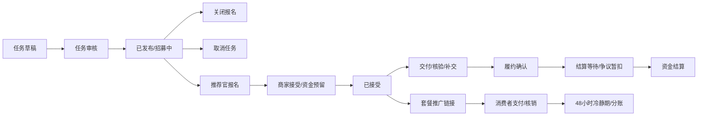

# 商家与推荐官工作台业务审查

- 日期：2026-09-06
- 代码基线：`f92f484e`，审查开始时工作区干净。
- 范围：任务发布与修订、报名与自动通过、取消、交付与确认、结算与钱包、套餐推广归因、工作台状态恢复。主体、门店、成员和 KYB 本轮梳理功能入口，未做完整权限专项测试。
- 方法：对照当前 PRD、任务书与前后端代码；对自动通过空操作者、账号切换迟到响应、报名映射截断做隔离运行验证。
- 边界：资金当前是 Sandbox 内部账本，本轮未操作真实资金、未执行数据库全链路或浏览器端到端测试，未修改业务代码。

## 1. 结论与修复顺序

核心业务链已经具备，但招募状态、履约状态和结算状态没有充分分离。几个模块各自成立的规则，组合后会出现“刚接单就失去佣金资格”“任务取消后还能扣款接单”“正常等结算却报失败”等结果。

| 编号 | 优先级 | 问题 | 证据级别 |
|---|---|---|---|
| WB-01 | P1 | 商家可直接操作资金释放/扣款，绕过履约和争议闸门；错误资金终态还可能被报告为已结算 | 代码可达路径 |
| WB-02 | P1 | 套餐推广任务满员自动关闭后，已接单推荐官立即失去新订单佣金归因 | 代码可达路径 |
| WB-03 | P1 | 取消任务没有封住 pending/reserving 报名的接受和激活，可能产生无法交付的托管款 | 代码可达路径 |
| WB-04 | P1 | 自动通过使用空操作者，查询阶段即抛异常 | 已隔离复现 |
| WB-05 | P1 | 已发布任务修订绕过任务审核策略 | 代码可达路径 |
| WB-07 | P1 | 切账号后，旧账号的任务响应仍会写入当前工作台 | 已隔离复现 |
| WB-06 | P2 | 报名列表与报名映射被固定条数截断，后面的报名/履约缺少可达入口 | 部分隔离复现 + 代码路径 |
| WB-08 | P2 | T+2 结算被 30 秒轮询报超时，已确认和可评分状态无法稳定恢复 | 代码可达路径 |
| WB-09 | P2 | 编辑任务切换付费模式时，前后端对空值的含义不同，导致合法切换被拒绝 | 代码可达路径 |

建议先处理 WB-01 至 WB-05、WB-07，再完善 WB-06、WB-08、WB-09。与之一起讨论“待处理报名遭遇条款变更”的产品规则，见第 4 节。

## 2. 当前业务地图

### 2.1 商家工作台

| 模块 | 当前功能 | 关键业务边界 |
|---|---|---|
| 入驻与组织 | 治理台初始化账号、首次改密、创建主体、默认门店、KYB、权限与额度、品牌资料 | 草稿/基础发布/资金交易三级权限；主体管理员与店长按资源范围管理 |
| 任务与报名 | 新建/存草稿/提交审核/修订/关闭报名/取消；推荐官推荐与邀请；报名等级/完成率筛选；单条与批量接受/拒绝；自动通过 | accepted/reserving 阻止修订；批量接口每批最多 50 条；资金预留为异步 |
| 履约管理 | 查看链接和附件、自动核验/重新核验、退回补交、确认履约、异议转客服、评分 | 确认需有交付物；核验 failed 阻止确认；补交次数有上限；确认窗口到期走自动路径 |
| 资金与经营 | 资金账户、Sandbox 充值、月度账单、套餐创建与上下架、核销、推广统计、经营分析 | 任务资金与消费订单资金是两条链；订单条款在下单时快照 |
| 个人设置 | 账号资料、投诉、判例等 | 账号级内容独立于当前组织 |

### 2.2 推荐官工作台

| 模块 | 当前功能 | 关键业务边界 |
|---|---|---|
| 身份与画像 | 注册即推荐官、资料与社交账号、等级与声誉 | 任务大厅按等级门槛过滤 |
| 任务大厅 | 搜索、平台/形式/最低赏金/距离筛选、详情、报名、撤销、创作入口 | pending 可以撤销；当前规则撤销后永久不能重新报名同一任务 |
| 我的任务 | 全部/待处理/报名成功/完成、分页、任务详情、交付、评分结果、争议 | 主列表用报名状态，完成依赖 EngagementSettled 事件；细分履约状态不足 |
| 套餐推广 | 已接受任务的专属链接、二维码、下单/核销/佣金统计 | 入口目前位于个人设置的“主页与分享”；新订单归因要求任务仍 published |
| 收益与结算 | 可提现余额、最近流水、导出、收入统计、Sandbox 提现 | 页面主要呈现已入账的钱，在途托管与预计到账缺少统一视图 |

### 2.3 三种资金模式

| 模式 | 出资方 | 当前收尾路径 | 必须区分的事实 |
|---|---|---|---|
| 固定/阶梯任务佣金 | 商家 | 接受时预留，交付/确认后按权益 T+N 结算；阶梯按达成值结算并返差额 | 接受、确认、待结算、已入账是不同状态 |
| 霸王餐/实物兑换 | 推荐官 | 接受时钱包预付托管；达标退推荐官；裁定未达标可补偿商家 | 押金不是收益；未到店、未交付、未达标不应混为一类 |
| 套餐推广 | 消费者 | 下单支付、到店核销、48 小时冷静期、三方分账 | PRD 明确无需推荐官提交凭证和商家确认；佣金来自消费订单 |

当前状态不是一条简单直线：



其中 C 应只影响新报名。当前套餐归因却把 C 同时当作推广结束，这是最直接的状态语义冲突。

## 3. 缺陷详情

### WB-01：资金操作可以绕过业务闸门

商家用户可以直接调用本组织 reservation 的 `release` 和无金额参数的 `capture`。这些端点只检查组织和资金状态，不核对交付、商家确认、争议或结算窗口。Edge 又将 `/api/finance` 整个前缀转发。

复现场景：商家接受一份有赏金的报名，预留成功后直接 release 该 application 对应的 reservation。商家余额恢复，marketplace 仍把报名视为 accepted。后续正常结算调用 capture 得到“预留已处理”409，`FinanceEscrowClient` 却把所有 404/409 当成功，继续发 `EngagementSettled`，形成“业务已结算、推荐官没有收到该笔钱”的记录。

直接 capture 也能提前于履约核验/争议窗口进行账内分账。本轮确认的是 Sandbox 账本控制漏洞，不代表已发生真实资金损失。

建议：资金原语限制为授权的编排服务；商家只提交业务命令。幂等成功必须核对目标状态、金额与收款人，不能把“已经 release”和“已经 capture”视作同一结果。

证据：[资金端点][escrow-control]、[Edge 前缀][finance-route]、[capture 的 404/409 映射][finance-client]、[结算事件发送][settlement-exec]。

### WB-02：满员关闭切断套餐推广佣金

复现场景：创建名额为 1 的套餐推广任务，接受第一位推荐官。非资金接受路径立即触发满员自动关闭，任务从 published 变成 closed。此后消费者经这位推荐官的链接购买时，归因查询只认 published，转为自然流量，佣金为零。任务表单默认名额就是 1，因此这会影响常规操作。

此外，closed 推广任务仍出现在推广列表，页面仍允许生成链接，只提示“任务已截止”。链接能下单但不计佣，用户难以发现差异。

建议：分开招募状态与推广有效期。满员/手动关闭报名保留已接受推荐官的推广资格；通过单独的“结束推广”命令或推广截止时间停止新订单归因，并明确通知。既有订单继续遵守下单快照。

套餐任务的详情还套用了普通任务交付/确认组件，而 PRD 第九节明确模式三无需凭证核实。应改成“生成链接、查看转化与结算”，完成状态也不能依赖普通交付的 EngagementSettled。

证据：[满员关闭并清关联][full-close]、[published 归因资格][promotion-gate]、[下单归因回退][commerce-order]、[默认名额][draft-default]、[链接生成按钮][share-card]、[统一交付插槽][detail-actions]。

### WB-03：取消后的报名仍可被接受，且补交会被阻断

复现场景一：任务有 pending 报名，商家取消任务，再展开该 cancelled 任务接受原报名。取消只处理“accepted 且未提交”的行，没有终结 pending；接受服务只验报名为 pending，名额计数器也不检查 task.status。资金 Saga 可继续预留并激活，但提交接口明确拒绝 cancelled 任务，形成无法交付的 accepted 履约。

同一缺口影响“资金预留中取消，随后 Saga 激活”的顺序。取消动作也没有把 reserving 纳入退款协调。

复现场景二：已提交的履约随任务取消保留，之后商家退回补交。旧交付物被退回，新提交又被 cancelled 闸门拒绝，原本承诺继续履约的链路中断。

建议：取消需与接受/预留共享可落库的状态闸门；pending 进入明确的任务取消终态，reserving 触发补偿并阻止激活；对取消前已提交的履约明确保留补交权限或进入裁定路径。关闭报名后的任务是否允许取消，也应独立于招募终态决定。

证据：[取消及退款范围][task-cancel]、[接受内核][accept-core]、[名额 claim][capacity]、[Saga 激活][saga-activate]、[取消后禁止提交][submission-controller]。

### WB-04：自动通过在空操作者查询处终止

自动接受构造 `accountId=null` 的系统 Caller，然后调用 `findByActorAndKey(null, key)`。仓储直接 `.bind("actor", null)`，Spring DatabaseClient 在构造查询时抛异常。即使仅改成 bindNull，命令表 `actor_account_id NOT NULL` 和使用等号比较 NULL 的查询也没有解决。

隔离验证使用当前仓储源码和项目 Spring 依赖，未连接数据库，实际输出：

```text
CONFIRMED: IllegalArgumentException: Value for parameter actor must not be null. Use bindNull(...) instead.
```

建议：正式定义系统操作者的存储与幂等语义，并同步调整读取、写入、审计和数据库约束。补一条从真实 acceptance service 到仓储的集成测试。当前 dispatcher 单测 mock 掉了 acceptance service，只能验证调度排序，抓不到此问题。

证据：[系统 Caller 与查询][auto-accept]、[直接绑定 actor][accept-repo]、[数据库约束][accept-migration]。

### WB-05：已发布任务可以通过修订绕过审核

复现场景：需全审的商家先发布一个通过审核的任务，在无人 accepted/reserving 时修改标题、描述和要求。`revise` 直接写新版本并保持 published，没有调用 TaskReviewService，所以即使该商家仍命中全审规则，新内容也立即公开。

建议：定义需要重新审核的字段。内容、平台、付费方式、目标链接和核心要求发生变化时，创建待审版本，审核通过后切换公开版本；纯展示修正可按明确白名单放行。避免在“重新审核”过程中抹掉现有报名对应的条款。

证据：[修订直接出版本][task-revise]、[审核策略入口][review-policy]、[审核编排][review-service]。

### WB-06：固定条数截断导致报名和履约不可达

商家报名接口默认取最早 200 条，前端不传分页参数也没有“更多”入口；声誉排序发生在截断之后。第 201 条及之后的报名不会进入商家列表。非商家路径更先对全任务做 LIMIT，再在 Java 内过滤本人，后报名者可能拿到空的本人报名列表。

推荐官大厅则只扫描最近 3 页、每页 50 条的历史报名，即使 hasMore=true 也结束。详情弹窗只使用这份映射，不直接使用“我的任务”当前行。因此一条较老但仍进行中的任务即使出现在主列表，打开详情后也可能没有交付、撤销或争议动作。

150 条截断已通过实际 composable 的隔离调用复现。批量操作还有相邻问题：全选可选中 51 至 200 条，但接口上限为 50，整批直接 400。

建议：报名列表采用服务端筛选、排序和分页，并返回总数/游标；本人筛选必须在 SQL LIMIT 之前。任务详情按 taskId 读取本人报名，或直接传当前列表行。批量操作明确最多 50 条，跨页选择与分批结果需要可见。

证据：[报名查询 LIMIT][application-limit]、[本人过滤与声誉排序][application-list]、[150 条映射][hall-map]、[详情使用映射][detail-map]、[批量上限][batch-limit]。

### WB-07：切账号后旧任务响应仍能写回

`useWorkbenchMyTasks.reset()` 只清数据，没有使请求序号失效，也没释放旧 loading。A 账号发请求后切到 B，B 的加载会被 loading 闸门跳过，随后 A 的迟到响应仍通过序号检查并写入当前列表。

隔离验证按 `load(A) -> reset -> load(B) -> A 回包` 的顺序调用实际 composable，确认 B 的请求未发出，A 的任务重新出现在 items 中。这证明前端私有数据展示的会话隔离不完整，不意味着服务端授权也被绕过。

相似检查缺口存在于大厅报名映射、任务选择后报名回包、钱包组件。组织任务 refreshTasks 已有账号票据，但没有覆盖这些请求的所有提交点。

建议：复用现有 accountId+epoch 票据；再按组织/任务增加上下文代次。reset 时作废请求，所有成功/失败/finally/续发请求都核验归属，不能只清数组。

证据：[我的任务 load/reset][mytasks]、[账号重置调用][account-reset]、[选择任务回包][select-task]、[钱包请求][wallet]。

### WB-08：正常结算等待被当超时，确认/评分状态仅存内存

标准结算是确认后 T+2，前端却等待 settled/held 最多约 30 秒，超时显示“结算结果轮询超时”。在正常 86400 秒/天的配置下，这是预期等待，不是结算失败。

评分入口又只在上述轮询得到 settled/held 后把 applicationId 放入内存集合。成功确认但仍在 T+2 等待中无法立即评分；刷新或重新选任务后集合被清空，后台实际已确认的任务仍提示“确认履约后可评分”。报名响应没有 confirmedAt 等字段供恢复。

建议：确认命令成功后立即显示“已确认，预计某时结算”，与结算结果分开；返回 confirmedAt、settlementEligibleAt、settlementStatus、holdReason 和 allowedActions。评分以 confirmedAt 为前置，结算在后台更新，浏览器短期轮询结束只停止刷新，不报业务失败。

证据：[T+N 规则][settlement-policy]、[轮询终态与超时][settlement-poll]、[确认后内存集合][confirm-ui]、[评分门槛][rating-ui]、[报名响应字段][application-body]。

### WB-09：编辑任务的付费模式切换被错误合并校验阻断

复现场景：编辑赏金为 100 元的草稿，切换到押金为 50 元的霸王餐。前端把不生效的 bountyCents 省略，后端校验却将 null 解释为保留原 100 元，于是判断为“赏金+押金组合”并拒绝。实际 SQL 更新对这些字段采用整份覆盖，null 又表示清空。

套餐推广切回赏金也有相同矛盾：前端显式传 commercePackageId=null 希望清关联，合并校验却保留旧关联，与新赏金冲突。

建议：统一 PUT/revise 的字段语义。当前表单是整份提交，可明确零金额为 0、清关联为 null；若要支持部分更新，应区分缺省与显式 null，并对合并后的同一个对象进行验证和落库。

证据：[前端保存载荷][draft-save]、[控制器空值保留逻辑][funding-merge]、[仓储整份覆盖][draft-update]。

## 4. 产品规则与功能优化

### 4.1 待处理报名遇到条款变更，需要再次确认

当前 PRD 第 2.3 节明确允许“仅有 pending 时修改，接受时冻结”，代码按此实现，因此这项不是代码偏离需求，而是规则本身的风险。

例：推荐官按 50 元押金报名，商家在接受前改为 500 元，接受时按 500 元扣其钱包；或者推荐官按 100 元赏金报名，接受时变成 10 元。内容要求和平台也可能改变，且接受后推荐官无法普通撤销。

建议：报名记录冻结申请时的任务版本和条款摘要；金额、押金、平台、门店、交付要求等关键字段变化后，将旧 pending 置为待重新确认并通知本人，重新同意后再接受和扣款。普通描述纠错走白名单。押金授权应明确金额上限与有效期。

### 4.2 先拆状态，再调整两端页面

建议服务端提供三组正交状态：

| 维度 | 建议状态 | 决定什么 |
|---|---|---|
| 招募 | 未发布、审核中、招募中、已停止招募 | 是否接受新报名 |
| 合作/推广 | 待选择、履约中、待补交、待确认、争议中、已结束、已取消 | 当前由谁做什么；已接单推广是否仍有效 |
| 资金 | 无资金、预留中、已托管、待结算、暂扣、已结算、退款中、已退款 | 钱在哪里、何时到账、异常由谁处理 |

前端按后端 allowedActions 展示按钮，减少各组件自行拼 status 条件。普通佣金/霸王餐的履约和套餐推广的消费转化分别呈现。

### 4.3 商家侧优先优化

1. 首页提供待办数量和临期排序：待筛选报名、待核验交付、即将自动确认、资金不足、争议和结算暂扣。每项能直接打开对应履约。
2. 报名列表显示昵称、留言、平台账号摘要与匹配原因；把交付、核验、确认、评分放在同一个履约详情里，避免列表与页底多个面板分离。
3. 接受前显示需要预留的总金额、可用余额和预计余额；批量逐项展示最终结果。押金不足需明确是推荐官余额不足，不能统一提示商家账户不足。
4. 草稿允许不完整保存。现在“存为草稿”也强制平台、门店、未来截止时间，削弱中途暂存用途；应在提交审核时做完整校验。
5. 经营分析区分已核销收入、退款、待结算、已支付佣金，以及有验证来源的营销指标，避免用单一“收益/ROI”掩盖口径差异。

### 4.4 推荐官侧优先优化

1. “我的任务”按下一步动作组织：等待商家、待交付、待补交、待确认、争议、待结算、完成。互动任务直接给提交截图，套餐任务直接给推广链接。
2. 任务详情同时展示报酬总额、预计服务费/净收益、押金冻结/返还、最晚交付、确认期限和预计结算时间；套餐佣金独立显示，避免 bounty=0 被呈现为“无”。
3. 推广链接与转化统计进入对应任务详情或业务页签。当前个人设置入口不符合日常推广操作频率。
4. 收益区拆分可提现、托管押金、待结算、争议暂扣、提现处理中；每笔可追到任务或订单及退款原因。
5. 明确误撤销是否允许重报、商家何时必须处理 pending、接受后无法按期履约如何退出或协商。当前“一人一报永久唯一”限制较重，应让业务政策与防重复提交约束分开。

### 4.5 必须补齐的异常闭环

- 接受后一直不提交：本轮未找到独立的履约截止计时器，确认计时在提交后才启动。需补履约时限、提醒、延期协商、逾期裁定和资金去向，避免资金无限托管。
- 阶梯任务自动确认但无指标：现有路径转运营暂扣。需要可见的指标补录/核证/处理时限，且数据不能仅由付款方单方面申报。
- 霸王餐零余额新用户：目前钱包页只有提现。需要明确合法的预付入口或先完成其他佣金任务的准入策略，并补“商家已提供服务”的事实，支撑退款/违约裁定。
- 提现网络超时：后端支持 operationId，前端仅传金额。后续应由前端为一次提现意图持有稳定键，重试读取同一结果；真实通道接入后还需处理中/失败返还/到账状态。

## 5. 验证与验收

本轮执行了三个隔离探针，均用于证明缺陷现象，而非证明业务通过：

1. 当前 AcceptanceCommandRepository + 实际 Spring R2DBC：空 actor 查询立即抛 IllegalArgumentException，无数据库连接。
2. 当前 useWorkbenchMyTasks：load(A)、reset、load(B)、A 回包，旧账号数据写回且 B 加载被跳过。
3. 当前 useWorkbenchTaskHall：持续返回 hasMore=true，仍固定只请求 3 页并保存 150 条。

未执行：完整 Java/Testcontainers 测试、真实服务全链路、浏览器视觉与交互回归。没有 UI 改动。

修复后的验收用例见 [.pi/pipeline/test-cases.md](/Users/LXH/claude/y-1/.pi/pipeline/test-cases.md)。优先用真实服务/数据库覆盖“自动通过落库”“取消与预留并发”“满员后的推广归因”“结算结果与钱包账一致”，不要只 mock 掉发生问题的服务边界。

[escrow-control]: /Users/LXH/claude/y-1/platform-java/services/finance-service/src/main/java/com/grassland/finance/escrow/EscrowController.java:142
[finance-route]: /Users/LXH/claude/y-1/platform-java/services/edge-bff/src/main/resources/application.yml:341
[finance-client]: /Users/LXH/claude/y-1/platform-java/services/marketplace-service/src/main/java/com/grassland/marketplace/workflow/FinanceEscrowClient.java:179
[settlement-exec]: /Users/LXH/claude/y-1/platform-java/services/marketplace-service/src/main/java/com/grassland/marketplace/workflow/saga/SettlementExecution.java:119
[full-close]: /Users/LXH/claude/y-1/platform-java/services/marketplace-service/src/main/java/com/grassland/marketplace/taskcatalog/TaskFullAutoCloser.java:45
[promotion-gate]: /Users/LXH/claude/y-1/platform-java/services/marketplace-service/src/main/java/com/grassland/marketplace/taskcatalog/TaskRepository.java:797
[commerce-order]: /Users/LXH/claude/y-1/platform-java/services/marketplace-service/src/main/java/com/grassland/marketplace/commerce/CommerceService.java:153
[draft-default]: /Users/LXH/claude/y-1/src/views/grassland/composables/useWorkbenchTaskDrafts.ts:217
[share-card]: /Users/LXH/claude/y-1/src/components/RecommenderShareCard.vue:27
[detail-actions]: /Users/LXH/claude/y-1/src/views/grassland/GrasslandWorkbench.vue:1439
[task-cancel]: /Users/LXH/claude/y-1/platform-java/services/marketplace-service/src/main/java/com/grassland/marketplace/taskcatalog/TaskController.java:233
[accept-core]: /Users/LXH/claude/y-1/platform-java/services/marketplace-service/src/main/java/com/grassland/marketplace/taskcatalog/ApplicationAcceptanceService.java:102
[capacity]: /Users/LXH/claude/y-1/platform-java/services/marketplace-service/src/main/java/com/grassland/marketplace/taskcatalog/TaskAcceptanceCounterRepository.java:18
[saga-activate]: /Users/LXH/claude/y-1/platform-java/services/marketplace-service/src/main/java/com/grassland/marketplace/workflow/saga/ApplicationReservationActivityImpl.java:164
[submission-controller]: /Users/LXH/claude/y-1/platform-java/services/marketplace-service/src/main/java/com/grassland/marketplace/taskcatalog/ApplicationController.java:127
[auto-accept]: /Users/LXH/claude/y-1/platform-java/services/marketplace-service/src/main/java/com/grassland/marketplace/taskcatalog/ApplicationAcceptanceService.java:220
[accept-repo]: /Users/LXH/claude/y-1/platform-java/services/marketplace-service/src/main/java/com/grassland/marketplace/taskcatalog/AcceptanceCommandRepository.java:47
[accept-migration]: /Users/LXH/claude/y-1/platform-java/services/marketplace-service/src/main/resources/db/migration/V25__task_acceptance_concurrency.sql:16
[task-revise]: /Users/LXH/claude/y-1/platform-java/services/marketplace-service/src/main/java/com/grassland/marketplace/taskcatalog/TaskController.java:301
[review-policy]: /Users/LXH/claude/y-1/platform-java/services/marketplace-service/src/main/java/com/grassland/marketplace/taskcatalog/TaskReviewPolicy.java:30
[review-service]: /Users/LXH/claude/y-1/platform-java/services/marketplace-service/src/main/java/com/grassland/marketplace/taskcatalog/TaskReviewService.java:30
[application-limit]: /Users/LXH/claude/y-1/platform-java/services/marketplace-service/src/main/java/com/grassland/marketplace/taskcatalog/TaskApplicationRepository.java:171
[application-list]: /Users/LXH/claude/y-1/platform-java/services/marketplace-service/src/main/java/com/grassland/marketplace/taskcatalog/ApplicationLifecycleService.java:126
[hall-map]: /Users/LXH/claude/y-1/src/views/grassland/composables/useWorkbenchTaskHall.ts:145
[detail-map]: /Users/LXH/claude/y-1/src/views/grassland/GrasslandWorkbench.vue:1425
[batch-limit]: /Users/LXH/claude/y-1/platform-java/services/marketplace-service/src/main/java/com/grassland/marketplace/taskcatalog/BatchOperationRequest.java:7
[mytasks]: /Users/LXH/claude/y-1/src/views/grassland/composables/useWorkbenchMyTasks.ts:56
[account-reset]: /Users/LXH/claude/y-1/src/views/grassland/GrasslandWorkbench.vue:534
[select-task]: /Users/LXH/claude/y-1/src/views/grassland/composables/useWorkbenchEngagements.ts:235
[wallet]: /Users/LXH/claude/y-1/src/components/MyWalletCard.vue:48
[settlement-policy]: /Users/LXH/claude/y-1/platform-java/services/marketplace-service/src/main/java/com/grassland/marketplace/workflow/saga/SettlementWorkflowStarter.java:23
[settlement-poll]: /Users/LXH/claude/y-1/src/composables/useGrasslandMarketplace.ts:491
[confirm-ui]: /Users/LXH/claude/y-1/src/views/grassland/composables/useWorkbenchEngagements.ts:486
[rating-ui]: /Users/LXH/claude/y-1/src/views/grassland/GrasslandWorkbench.vue:1078
[application-body]: /Users/LXH/claude/y-1/platform-java/services/marketplace-service/src/main/java/com/grassland/marketplace/taskcatalog/ApplicationBodies.java:36
[draft-save]: /Users/LXH/claude/y-1/src/views/grassland/composables/useWorkbenchTaskDrafts.ts:232
[funding-merge]: /Users/LXH/claude/y-1/platform-java/services/marketplace-service/src/main/java/com/grassland/marketplace/taskcatalog/TaskController.java:412
[draft-update]: /Users/LXH/claude/y-1/platform-java/services/marketplace-service/src/main/java/com/grassland/marketplace/taskcatalog/TaskRepository.java:270
