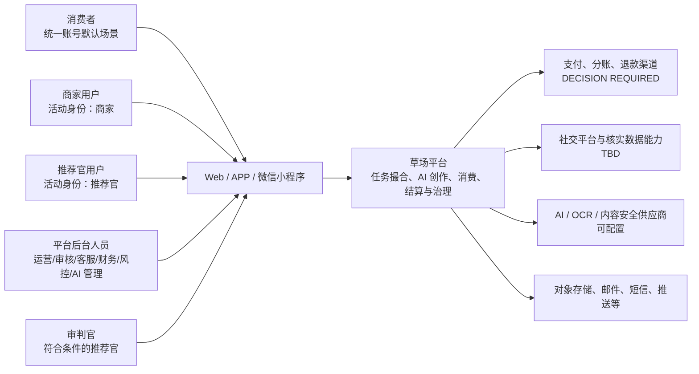
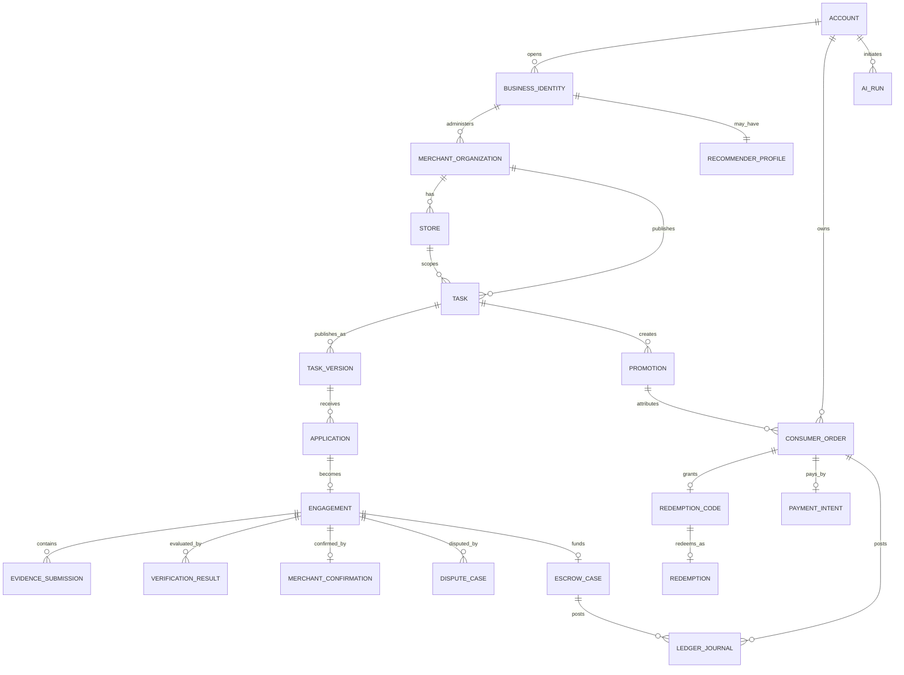
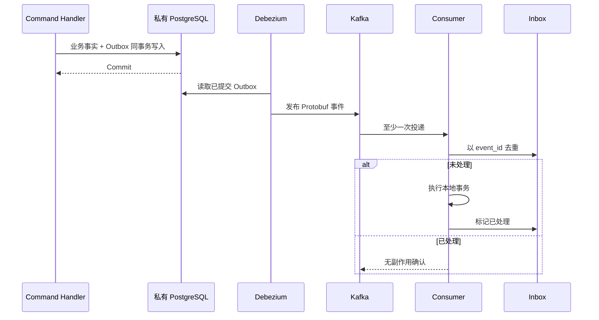
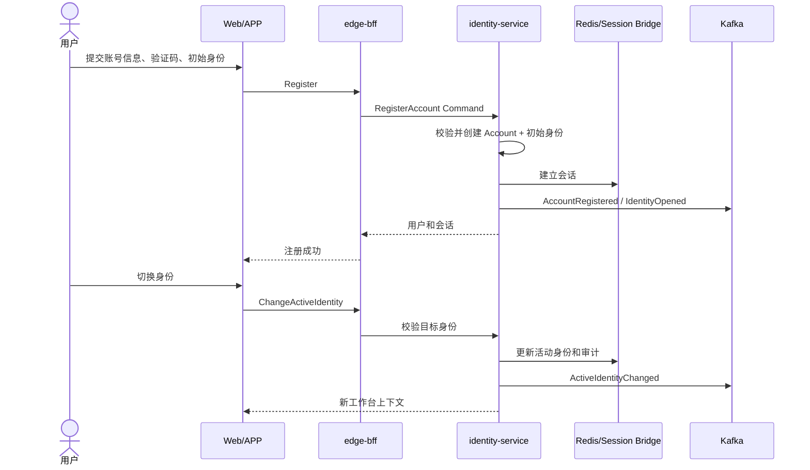
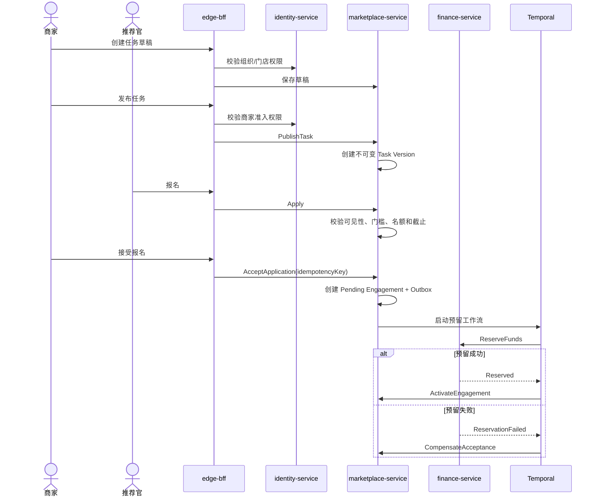
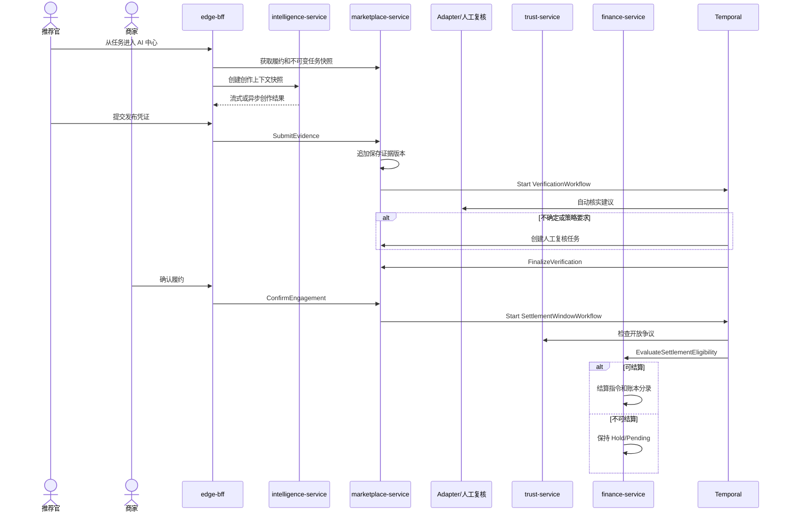
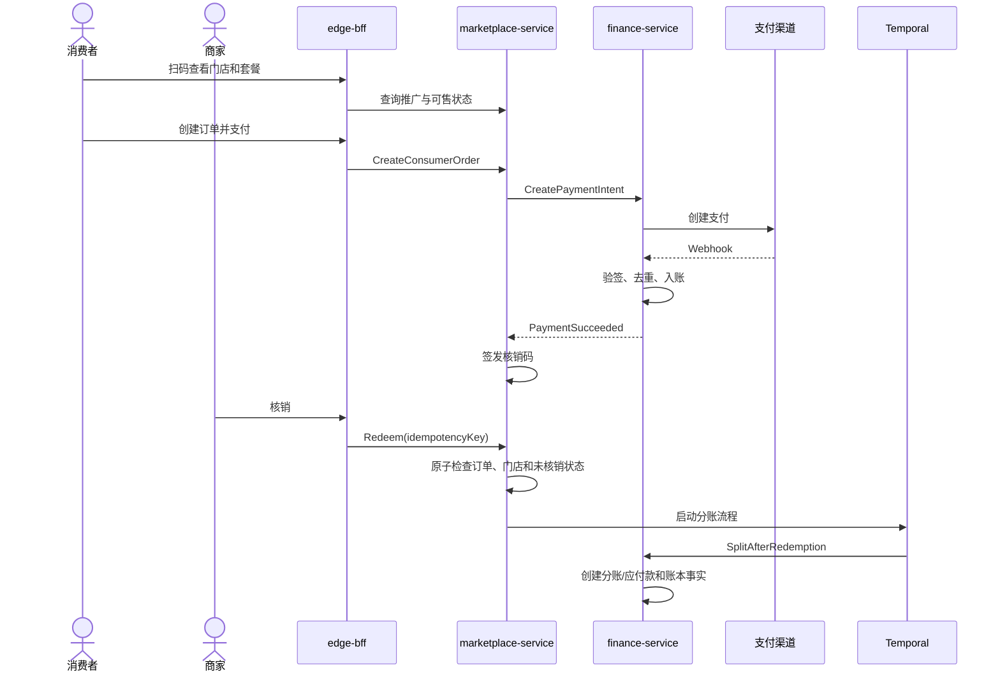
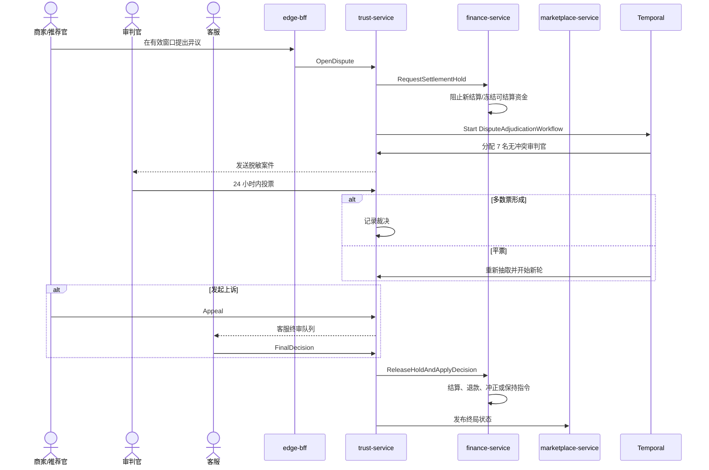
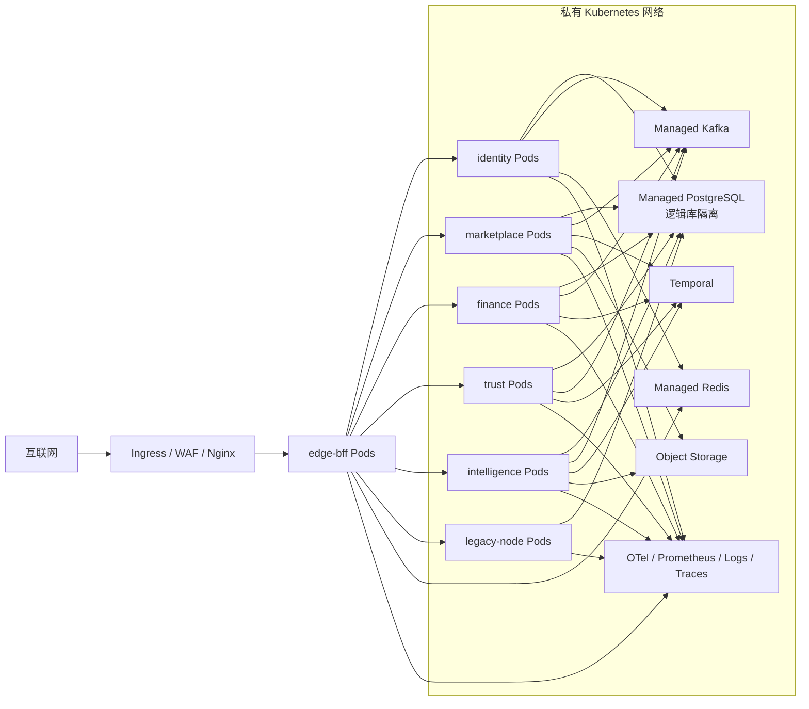

# 草场系统技术总体设计（HLD v0.2）

> 文档状态：**条件批准 / 当前实现基线**
> 产品基线：[《草场产品需求文档（PRD v1.4）》](./草场产品需求文档.md)  
> 架构基线：[《草场 Java 微服务技术架构与渐进迁移方案》](./草场Java微服务技术架构与渐进迁移方案.md)  
> 目标：为 ADR、TDD、LLD、OpenAPI、Protobuf 契约和渐进迁移实施提供系统级设计基线
> 批准范围：六服务边界、数据所有权、Sandbox 金融不变量，以及 ADR D-02、D-03、D-06、D-07、D-10、D-11 已采纳规则。
> 生产门禁：ADR D-01 仅部分采纳；真实 PSP、签约/合规主体、客户备付金/存管、真实退款/分账/付款与对账方案冻结前，消费者支付、核销分账和真实资金链路不得上线。

## 文档标记

本文以已采纳 ADR 冻结当前实现规则，不提前冻结尚未确认的商业、合规或风控规则。未决内容统一使用以下标记：

- **ASSUMPTION**：为了完成架构推演采用的暂定假设，后续产品决策可以推翻。
- **TBD**：实现前仍需由产品、业务、合规或技术团队补充细节。
- **DECISION REQUIRED**：进入相关 LLD 或生产上线前必须完成的决策。

---

## 1. 文档范围

### 1.1 本版本覆盖范围

本 HLD 定义草场长期目标架构，以及从当前 Vue 3 + Express/TypeScript 系统迁移至 Java 微服务的总体方案，覆盖：

1. 统一账号、商家/推荐官活动身份和默认消费者场景。
2. 商家主体、多门店、成员关系和三级商家准入权限。
3. 推广任务、报名、履约、凭证、核实、商家确认和结算协作。
4. 消费者扫码下单、支付、核销、退款和推荐官/商家分账。
5. 争议、审判、客服终审和资金冻结协作。
6. 商家与推荐官共享的 AI 内容创作中心。
7. 六个 Java 部署单元和迁移期 Legacy Node。
8. 数据所有权、同步 API、Kafka、Outbox、Inbox 和 Temporal。
9. 第三方支付、AI、社交平台核实、媒体、通知和对象存储边界。
10. 安全、部署、可观测性、韧性、测试和迁移策略。

### 1.2 本版本仍不冻结的内容

- 具体支付供应商和签约/合规主体。
- 每个社交平台的具体核实方法和 API 可用性。
- 商家三级权限所需材料、审核时效、额度和行业限制。
- 全量数据库字段、索引、事件 Payload 和错误码。
- AI/视频/图片供应商、模型路由算法、具体计费数值和内容审核阈值。
- APP 和微信小程序的具体页面及支付跳转交互。
- Service Mesh 的引入时机。

以下内容已通过 ADR 冻结，不再属于本节：D-02 资金模式合法组合、D-03 商家确认超时/拒绝/失联、D-06 争议资金处置、D-07 订单快照/库存/过期退款、D-10 数据保留框架和 D-11 AI 用量计费边界。D-10 的具体保留期阈值仍为 provisional，须经法务/财务校准。

### 1.3 已确认的产品事实

1. 草场使用一套统一账号体系。
2. 一个账号可以开通商家和推荐官身份，同一时间仅启用一个活动身份。
3. 消费者是所有注册账号默认具有的使用场景，不是独立申请的身份。
4. AI 内容创作中心是商家和推荐官共享能力，不是独立身份或注册入口。
5. 内容创作先选择发布平台，再选择该平台支持的图文或视频形式。
6. 商家采用“商家主体 + 多门店”模型。
7. 商家准入分为草稿权限、基础发布权限和资金交易权限。
8. 新草场领域数据直接进入 Java 服务数据库，不先写入 Legacy 数据库。
9. 初始 Java 服务为 `edge-bff`、`identity-service`、`marketplace-service`、`finance-service`、`trust-service` 和 `intelligence-service`。
10. Legacy Node 在迁移期作为受控 API/Worker，不再直接暴露给浏览器。

---

## 2. 架构目标与原则

### 2.1 架构目标

- 在不破坏现有 Vue `/api/**`、Cookie、SSE、Multipart、签名媒体 URL 和 Range 流的前提下完成渐进迁移。
- 任务、报名、履约、凭证、核实和商家确认在同一服务边界内保持强一致。
- 资金托管、退款、结算和分账具有不可变、可审计、可对账的账本记录。
- 跨服务流程可重试、可补偿、可人工介入，不依赖 XA/2PC。
- AI、OCR、爬虫和外部平台数据只提供建议或候选事实，不能单独执行不可逆资金裁决。
- Web、APP 和小程序保持核心业务状态、权限与金融结果一致。
- 每一批路由和能力都可以单独灰度、切换和回滚。

### 2.2 非目标

- 不在首期将每个实体或业务名词拆成独立服务。
- 不为了全部 Java 化而牺牲业务连续性。
- 不使用跨库 JOIN、共享业务 Entity、共享 Repository 或分布式事务。
- 不让 BFF 保存任务、争议、支付和账本事实。
- 不将 Redis、缓存余额或 Temporal 历史作为金融事实来源。
- 不自动发布第三方平台内容。
- 不以 AI 自动核实直接触发结算、退款、没收、封禁或争议终审。

### 2.3 设计原则

|原则|落地约束|
|---|---|
|兼容优先、渐进绞杀|冻结旧 `/api/**` 契约；所有路由先经过 `edge-bff`，支持单路由切换和回滚。|
|按一致性边界拆分|任务、申请、履约、证据、核实和商家确认保留在 `marketplace-service`。|
|事实单写|每个领域事实只有一个权威写入服务。|
|本地事务 + 异步事件|业务数据与 Outbox 同事务；跨服务使用 Kafka、幂等 Command 和 Temporal。|
|金融不可变|已过账记录不能修改或删除，只能追加冲正；余额投影可以重建。|
|最小信任|浏览器只访问 BFF；内部身份头由 BFF 清除并重新签发；服务独立授权。|
|人工可介入|核实、争议、风险和资金不确定状态必须支持人工处理。|
|显式版本化|任务、平台规则、金融 Policy、证据、模型、创作上下文和事件 Schema 均版本化。|
|幂等和可恢复|外部回调、Command、Kafka Consumer、Temporal Activity、支付和核销均幂等。|
|配置不篡改历史|模型、平台规则、商家资料和素材更新不能覆盖历史任务和履约快照。|

---

## 3. C4 系统上下文



### 3.1 外部参与方

|参与方|主要行为|系统边界|
|---|---|---|
|商家|管理主体/门店/成员/素材，发布任务，筛选推荐官，确认履约，核销，查看资金|仅在有效商家身份和组织权限范围内操作。|
|推荐官|浏览和报名任务，创作内容，提交凭证，查看收益，提出争议|只能访问公开或明确授权的数据。|
|消费者|扫码、下单、支付、查看核销码、退款和售后|消费订单归统一账号，但不混入商家任务资金或推荐官收益。|
|平台后台人员|审核、客服、财务、风控、模型与平台配置|不能直接覆盖不可变任务版本、证据、投票和已过账账本。|
|审判官|处理被分配争议|仅能访问案件所需的脱敏证据，不拥有完整后台权限。|
|支付渠道|支付、退款、付款/分账、回调和对账|**DECISION REQUIRED**：确定供应商、持牌能力和责任边界。|
|社交平台/核实来源|链接、API、公开数据或授权数据|**TBD**：逐平台确认可用性、稳定性与合规性。|
|AI/媒体供应商|文本、视觉、语音、图片、视频和内容安全能力|输出为创作或核实建议，密钥只由服务端持有。|

---

## 4. C4 容器架构

```mermaid
flowchart TB
  subgraph Public["公共网络与客户端"]
    Web["Vue Web"]
    Mobile["APP / 微信小程序\n后续"]
    Admin["平台后台 Web"]
  end

  subgraph Platform["草场受控运行环境"]
    Edge["edge-bff\nSpring Cloud Gateway WebFlux"]
    Identity["identity-service\n账号、身份、组织、成员、会话"]
    Marketplace["marketplace-service\n任务、报名、履约、证据、核实、核销"]
    Finance["finance-service\n支付、托管、账本、退款、结算、分账、对账"]
    Trust["trust-service\n争议、审判、等级、风险"]
    Intelligence["intelligence-service\nAI、媒体、素材、模型、热点、核实 Adapter"]
    Legacy["legacy-node\n迁移期 Express API / Node Worker"]

    Kafka["Kafka + Apicurio Registry"]
    Temporal["Temporal"]
    Redis["Redis"]
    ObjectStore["S3 / MinIO"]
    Observability["OpenTelemetry / Metrics / Logs / Traces"]

    IdentityDB[("identity_db")]
    MarketplaceDB[("marketplace_db")]
    FinanceDB[("finance_db")]
    TrustDB[("trust_db")]
    IntelligenceDB[("intelligence_db")]
    LegacyDB[("legacy_db")]
  end

  subgraph External["外部依赖"]
    Pay["支付与分账渠道\nTBD"]
    Social["社交平台/核实数据源\nTBD"]
    Models["AI / OCR / 媒体供应商"]
    Notify["邮件 / 短信 / 推送\nTBD"]
  end

  Web --> Edge
  Mobile --> Edge
  Admin --> Edge

  Edge --> Identity
  Edge --> Marketplace
  Edge --> Finance
  Edge --> Trust
  Edge --> Intelligence
  Edge --> Legacy

  Identity --> IdentityDB
  Marketplace --> MarketplaceDB
  Finance --> FinanceDB
  Trust --> TrustDB
  Intelligence --> IntelligenceDB
  Legacy --> LegacyDB

  Edge <--> Redis
  Identity <--> Redis
  Marketplace --> ObjectStore
  Intelligence --> ObjectStore

  Identity <--> Kafka
  Marketplace <--> Kafka
  Finance <--> Kafka
  Trust <--> Kafka
  Intelligence <--> Kafka

  Marketplace <--> Temporal
  Finance <--> Temporal
  Trust <--> Temporal
  Intelligence <--> Temporal

  Finance --> Pay
  Intelligence --> Social
  Intelligence --> Models
  Identity --> Notify

  Edge --> Observability
  Identity --> Observability
  Marketplace --> Observability
  Finance --> Observability
  Trust --> Observability
  Intelligence --> Observability
  Legacy --> Observability
```



### 4.1 容器职责

|容器|核心职责|明确禁止|
|---|---|---|
|`edge-bff`|唯一外部入口、旧 API 兼容、`/api/v2`、会话桥、边缘安全、SSE/媒体代理和有限聚合|保存业务事实、访问业务数据库、缓冲完整 SSE/媒体响应、自动重试非幂等写请求。|
|`identity-service`|账号、凭据、身份档案、商家组织、成员关系、会话、Token 和权限|保存金融余额、判断任务履约、作为推荐官等级权威来源。|
|`marketplace-service`|任务版本、报名、接受、履约、证据、核实、商家确认、推广关联和核销事实|直接记账、直接执行支付、作出争议终局裁决。|
|`finance-service`|金融 Policy、支付、托管、双录账本、退款、结算、分账和对账|直接改变任务或争议状态。|
|`trust-service`|争议、审判、上诉、客服终审、等级和风险信号|直接写金融数据库或自行过账。|
|`intelligence-service`|AI 内容创作、模型配置、素材、热点、媒体任务和平台核实 Adapter|发布任务、接受报名、作出最终资金裁决。|
|`legacy-node`|迁移期承接 Playwright、FFmpeg、视频提取和未迁移 AI/SSE 能力|成为新草场领域权威写入方，继续直接对公网暴露。|

---

## 5. 服务内部模块划分

### 5.1 `edge-bff`

- `route-manifest`：路由、上游、认证、限流、超时、Body 上限、响应模式和回滚开关。
- `legacy-compatibility`：旧 JSON Envelope、中文错误、`y1.sid`、CAPTCHA SVG、SSE 和 Range。
- `v2-api`：OAuth/OIDC、结构化错误、Cursor Pagination 和幂等接口。
- `session-bridge`：Redis 优先、Legacy Session 回退和同名 Cookie 迁移。
- `internal-assertion`：清除客户端伪造头，签发短时内部身份断言。
- `edge-security`：CSRF、CORS、限流、安全 Header 和上传保护。
- `read-composition`：只对低扇出、非金融页面做有限聚合。

### 5.2 `identity-service`

- `account`：账号、凭据和账号级状态。
- `authentication`：注册、登录、验证码、CAPTCHA、MFA 和登录审计。
- `session-token`：Web Session、Refresh Token Family、OAuth/OIDC。
- `identity-profile`：商家与推荐官身份档案、活动身份。
- `merchant-organization`：商家主体、成员关系和权限委派。
- `store-membership`：门店范围成员和资源授权。
- `authorization`：资源级权限决策。
- `identity-projection`：消费来自 Trust 的推荐官等级投影。

### 5.3 `marketplace-service`

- `task-catalog`：任务草稿、不可变版本、可见性、平台、内容形式和截止规则。
- `application`：报名、审核、接受、拒绝和名额控制。
- `engagement`：履约实例、任务快照、状态机和时限。
- `evidence`：凭证集合、追加补交、对象引用和访问控制。
- `verification-orchestration`：核实请求、建议汇总、人工复核和最终核实状态。
- `merchant-confirmation`：商家确认、拒绝和待处理状态。
- `promotion-commerce`：推广二维码、商品/套餐引用、订单关联和一次性核销事实。
- `read-models`：任务大厅和商家/推荐官工作台投影。

### 5.4 `finance-service`

- `product-policy`：三种资金模式的版本化 Policy。
- `payment-intent`：支付意图、支付尝试、Webhook Inbox 和未知状态恢复。
- `escrow`：预留、托管、冻结、释放和分配。
- `ledger`：账户、Journal、Posting、冲正和余额投影。
- `settlement`：结算指令、收款资格和 T+1/T+2 快照。
- `refund`：退款请求、状态和竞态处理。
- `split`：核销后的推荐官佣金和商家应收。
- `reconciliation`：支付、账本和供应商对账。
- `idempotency-audit`：命令、回调和供应商交易号审计。

### 5.5 `trust-service`

- `dispute-case`：争议受理、证据引用和期限。
- `adjudication`：审判官资格、冲突排除、抽取、投票、重开和上诉。
- `customer-service-decision`：客服最终裁决。
- `reputation`：统计、等级、降级、徽章和权益资格。
- `risk`：风险信号和人工复核建议。
- `finance-integration`：发布 Hold、Release 和 Decision，不直接改账。

### 5.6 `intelligence-service`

- `creation-orchestration`：平台优先创作、流式/异步任务、取消和重试。
- `platform-capability`：平台 × 内容形式 × 规则版本。
- `context-snapshot`：独立、门店和任务创作上下文快照。
- `asset-library`：商家、个人、公共和 AI 素材及授权期限。
- `model-control-plane`：平台模型、Provider、能力路由、预算、健康和 BYOK。
- `usage-account`：AI 用量预留、扣减、退回和流水。
- `media-reference`：视频提取、预览、音频、分析和对象生命周期。
- `verification-adapter`：链接、API、OCR 和视觉核实建议。
- `legacy-worker-adapter`：调用 Legacy Node 能力并记录审计、进度和取消传播。

---

## 6. 数据所有权与概念模型

### 6.1 Database-per-service

初期可共用同一个 PostgreSQL Cluster，但必须使用独立逻辑数据库、独立账号和独立 Flyway 历史。

|服务|数据库|权威实体组|
|---|---|---|
|Identity|`identity_db`|Account、Credential、Session/Token、Identity Profile、Organization、Membership、Store Membership、Auth Audit|
|Marketplace|`marketplace_db`|Task、Task Version、Application、Engagement、Evidence、Verification Result、Merchant Confirmation、Promotion、Redemption|
|Finance|`finance_db`|Product Policy、Payment、Escrow、Ledger、Settlement、Refund、Payout、Reconciliation|
|Trust|`trust_db`|Dispute、Decision、Judge Assignment/Vote、Appeal、Reputation、Badge、Risk Signal|
|Intelligence|`intelligence_db`|Platform Capability、AI Run、Context Snapshot、Asset Metadata、Model Config、Usage Record、Media Job、Hot Topic Cache|
|Legacy|`legacy_db`|尚未迁移的旧账号设置、Session 和工具数据，仅迁移期保留|

### 6.2 跨服务数据规则

- 跨服务引用使用 UUID/ULID，不建立跨服务外键。
- 禁止跨服务数据库 JOIN 和共享 ORM Entity。
- 业务展示通过 BFF 有限组合或 Kafka 驱动的本地投影实现。
- 读模型记录 `source_event_id`、`aggregate_id`、`aggregate_version` 和 `projected_at`。
- 对象本体存入 S3/MinIO，领域服务只保存元数据、权限和引用。
- 任务、证据、金融 Policy、平台规则和模型必须保存使用时的版本快照。

### 6.3 概念实体关系



> 该图只表达跨领域概念关系，不代表单一物理 ER 模型，也不表示跨库外键。

### 6.4 金额和账本原则

- 金额在数据库中使用 `BIGINT` 最小货币单位和 ISO Currency。
- Java 使用受约束的 Money Value Object；API 使用字符串输出金额。
- 每个 Ledger Journal 至少包含两个 Posting，同币种借贷合计必须为零。
- Finalized Journal 不允许 UPDATE 或 DELETE。
- 错误通过 Reversal Journal 修正。
- 每个业务 Command、供应商交易和 Webhook Event 必须唯一。
- 缓存余额只是投影，必须可以从 Posting 重建。

---

## 7. API 与 BFF 设计

### 7.1 API 分层

|API 面|使用方|契约原则|
|---|---|---|
|旧 `/api/**`|现有 Vue Web|冻结现有路径、Cookie、JSON、中文错误、SSE、Multipart 和媒体流语义。|
|新 `/api/v2/**`|新 Web 页面、APP、小程序和后台新能力|OpenAPI 3.1、结构化错误、Cursor、OAuth/OIDC、`Idempotency-Key`。|
|BFF → 内部服务|BFF 和领域服务|短时内部身份断言、服务身份和领域 Command/Query。|
|Kafka 事件|各领域服务|Protobuf Envelope 和 Schema Registry。|
|外部 Adapter|Finance、Intelligence、Identity|供应商 DTO 和错误不进入领域模型。|

### 7.2 旧接口兼容要求

`edge-bff` 在迁移期间必须保持：

- `{success:true,data}` 和 `{success:false,error:string}`。
- 当前 HTTP 状态、中文错误和字段名。
- `y1.sid`、HttpOnly、SameSite=Lax、Secure 和滚动 Session。
- CAPTCHA 原始 SVG。
- Multipart 字段 `images` 和当前数量/大小限制。
- POST Fetch SSE：`data: JSON\n\n` 和 `data: [DONE]\n\n`。
- `X-Accel-Buffering: no`、及时 Flush 和断开取消传播。
- 签名媒体路径、Range `200/206/416`、`Content-Range` 和 `Content-Disposition`。
- `RateLimit-Limit`、`RateLimit-Remaining` 和 `RateLimit-Reset`。

SSE 和 Binary Route 禁止完整缓冲到 Java Heap，非幂等 POST 禁止自动重试。

### 7.3 `/api/v2` 约定

- 所有有副作用的写 Command 默认要求 `Idempotency-Key`。
- 金额以字符串形式的最小货币单位传输。
- 错误至少包含 `code`、`message`、`traceId` 和可选 `fieldErrors`。
- 列表默认 Cursor Pagination。
- `activeIdentity` 只是请求意图，服务端必须重新验证身份和资源权限。
- 上传采用“申请上传凭据 → 上传 → 确认对象引用”的三步模式。
- 上传完成不等于证据或素材已经通过业务接收和安全检查。
- **TBD**：APP/小程序 OAuth、微信绑定、支付跳转和回跳规范。

### 7.4 内部身份断言

BFF 必须清除所有外部传入的内部身份 Header，并基于 Session/Token 签发短时断言。断言至少包含：

- `account_id`
- `active_identity_id`（消费者请求可为空）
- 组织/成员上下文（仅在明确请求中携带）
- 认证方式、认证强度和重新认证时间
- `request_id` 和 `trace_id`
- Audience、Expiry 和签名信息

领域服务仍需进行资源级授权，不能只信任 BFF 声明的角色。

---

## 8. Kafka、Outbox 与 Inbox

### 8.1 事件 Envelope

所有领域事件使用 Protobuf Envelope：

```text
event_id
event_type
schema_version
aggregate_type
aggregate_id
aggregate_version
occurred_at
correlation_id
causation_id
tenant_id / organization_id
payload
```

初始 Topic：

- `grassland.identity.events`
- `grassland.marketplace.events`
- `grassland.finance.events`
- `grassland.trust.events`
- `grassland.intelligence.events`

Kafka Message Key 使用 Aggregate ID，只保证同一 Aggregate 的顺序，不依赖不同 Key 的全局顺序。

### 8.2 Outbox/Inbox 模型



规则：

1. 禁止业务数据库与 Kafka 双写。
2. Consumer 使用 Inbox 和业务幂等键保证重复消息无副作用。
3. 失败进入有限重试和 DLQ，Replay 需要权限和审计。
4. Schema Registry 强制兼容检查，破坏性变更发布新事件版本。
5. 事件用于跨服务事实传播，不能替代金融账本。

### 8.3 初始事件目录

|来源|事件示例|主要消费者|
|---|---|---|
|Identity|`AccountRegistered`、`IdentityOpened`、`ActiveIdentityChanged`、`MerchantPermissionGranted`、`StoreUpdated`|Marketplace、Intelligence、Trust|
|Marketplace|`TaskPublished`、`ApplicationAccepted`、`EngagementCreated`、`EvidenceSubmitted`、`VerificationFinalized`、`MerchantConfirmed`、`RedemptionSucceeded`|Finance、Trust、Intelligence|
|Finance|`FundsReserved`、`ReservationFailed`、`PaymentSucceeded`、`PaymentUnknown`、`EscrowHeld`、`SettlementCompleted`、`RefundCompleted`、`SplitCompleted`|Marketplace、Trust、读模型|
|Trust|`DisputeOpened`、`SettlementHoldRequested`、`DisputeDecided`、`SettlementHoldReleased`、`ReputationUpdated`|Finance、Marketplace、Identity|
|Intelligence|`AiRunCompleted`、`AiRunFailed`、`UsageAdjusted`、`VerificationSuggestionReady`、`AssetProcessed`|Marketplace、运营读模型|

---

## 9. Temporal 工作流

### 9.1 使用范围

- 报名接受后的资金预留和失败补偿。
- 长时间核实、第三方重试和人工复核等待。
- 商家确认后的 T+2 结算窗口。
- 48 小时异议窗口。
- 7 名审判官的 24 小时投票、平票重开和上诉等待。
- 支付未知状态的查询、对账和恢复。
- 未核销订单、退款和分账重试。
- AI/媒体异步任务的进度、取消和恢复。

### 9.2 原则

- Temporal 保存流程进度，PostgreSQL 保存领域和金融事实。
- Workflow 不直接写业务数据库，只调用幂等 Activity/领域 Command。
- Activity 执行前重新校验业务状态和版本。
- Timer 到期只触发 Command，不直接结算或退款。
- Worker 重启、Replay、重复 Signal 和超时必须纳入测试。

### 9.3 初始 Workflow

|Workflow|发起条件|结果|
|---|---|---|
|`AcceptApplicationReservationWorkflow`|商家接受报名且需要资金预留|预留成功激活履约；失败补偿名额和申请状态。|
|`VerificationWorkflow`|推荐官提交凭证|汇总自动建议，必要时转人工复核，产生最终核实状态。|
|`SettlementWindowWorkflow`|商家确认且具备基础结算条件|等待争议/结算窗口，触发结算或保持。|
|`DisputeAdjudicationWorkflow`|有效争议被提出|资金 Hold、审判、重开、上诉和终局裁决。|
|`ConsumerPaymentRedemptionWorkflow`|消费者支付成功|管理待核销、退款窗口、核销后分账和异常。|
|`PaymentRecoveryWorkflow`|支付/退款/付款处于未知状态|主动查询、等待回调和对账恢复。|
|`AiMediaJobWorkflow`|图片、视频、媒体生成或解析|调度 Adapter/Legacy Worker，管理进度、取消和恢复。|

---

## 10. 核心业务时序

### 10.1 注册和身份切换



约束：

- 未开通目标身份时先进入资料完善和开通流程。
- 消费者操作不要求切换到消费者身份。
- 活动身份按 Session 隔离，多标签页共享同一 Session；不同设备可保持不同活动身份。账号级活动 Session 上限默认 `0`（不限），配置为正数时，在同账号数据库事务锁内淘汰最旧活动 Session 并回到消费者场景；切换、策略回退均写审计。

### 10.2 任务发布、报名接受和资金预留



**已冻结（ADR D-02）：**

- 首期任务按资金拓扑分为赏金类与核销类，禁止跨类组合；赏金类内部允许“霸王餐 + 达标即给佣金”，各自独立预留、统一结算触发。
- 阶梯佣金延后；合法组合及资金处置必须进入版本化 Finance Product Policy，任务发布快照固定 Policy 版本。
- 霸王餐未达标按责任归因：系统/商家原因导致的推荐官无过错超时返还推荐官，其余未达标释放给商家；具体归因规则由 LLD 落地。
- 赏金实施全局可配上限，具体阈值由产品/风控配置，不写死在 HLD。

**仍待决策：**

- 非资金型任务的合作、违约和争议规则。
- 自动接受推荐官时的资金预留和风控要求。

### 10.3 AI 创作、凭证、核实、确认和结算



**已冻结（ADR D-03）：**

- 商家确认窗口默认 3 个自然日且按任务类可配；到期无操作自动确认并进入结算。
- 商家拒绝进入客服/争议裁定，不直接返还商家；客服 SLA 默认 3 个工作日，超时按系统核实结果结算。
- 补证最多 2 次，超限强制进入确认窗口。
- 商家取消时，已核实通过的履约照常结算；已接受但未提交凭证的履约首期无补偿、全额返还商家并记录商家信誉。
- 确认窗口通知至少使用站内信和事务邮件；Push/SMS 按用户已验证端点与偏好补充，不改变资金时序。

**仍待细化：**

- 各平台核实信号、人工阈值和补证次数。
- 指标采样时点和争议期内数据变化规则。

### 10.4 消费支付、核销和分账



**已冻结（ADR D-07）：**

- 商品采用可变草稿与不可变已发布版本；消费者订单保存商品、价格、有效期、门店、归因和分账计划快照，后续配置变更不得改写历史订单。
- 下单使用数据库条件更新原子扣减库存；取消/退款幂等回补。首期一个订单只归因一个推荐官。
- 过期未核销订单自动全额退款，过期核销码拒绝核销。

**生产硬门禁（ADR D-01）：**

- 支付渠道托管、分账、退款、付款和对账能力。
- 签约/合规主体、客户备付金或存管模式、支付回调与对账责任边界。
- 部分退款、拒付、已核销售后退款及供应商不可逆状态的实际能力矩阵。
- “实时分账”的产品展示和供应商实际结算口径。

### 10.5 争议和资金 Hold



**已冻结（ADR D-06）：**赏金类出账时点取 T+2 与 48 小时争议窗口的较晚者；核销类在核销后保留 24 小时退款窗口再分账。争议时资金仍在托管态则按裁决 release/reverse；已入钱包未提现则追加 Reversal Journal；已提现或已分账则登记应收并全额抵扣未来结算/提现；已退款或供应商不可逆时接受既成事实或转法务。首期不开平台垫付。所有资金动作只追加账本与审计，禁止改写原账。

**生产硬门禁（ADR D-01）：**真实 PSP 对退款、分账撤回、付款止付、拒付和追偿的能力边界尚未冻结；D-06 冻结的是领域处置语义，不代表外部资金通道已经可用。

---

## 11. 安全和信任边界

### 11.1 信任边界

1. 客户端到 BFF：不可信输入，执行认证、CSRF、限流、Schema 校验和上传限制。
2. BFF 到内部服务：短时身份断言、服务身份、网络隔离和 Trace Context。
3. 服务到数据库：独立凭据和 NetworkPolicy，禁止共享账号。
4. 服务到 Kafka/Temporal：按 Topic/Namespace 最小授权，Payload 避免敏感数据。
5. 服务到对象存储：服务端授权和短时签名 URL，访问前检查资源权限。
6. 服务到外部供应商：Adapter、超时、SSRF、签名验证、凭据隔离和审计。
7. 后台人员到平台后台：MFA/再认证、最小权限、审批和不可变审计。

### 11.2 基础安全要求

- 核实 Legacy 密码格式后支持 bcrypt/scrypt 验证，成功登录时升级为 Argon2id。
- Web 使用 BFF Cookie；APP/小程序使用 OAuth/OIDC Access Token 和 Refresh Token Family。
- 内部身份断言必须绑定 issuer、audience、purpose、principal、`kid`、`jti` 和短 TTL；replay 使用 Redis 原子 `SET NX` 跨副本拦截并在存储故障时 fail-closed。签名与验签密钥分离，轮换按“预发布新验签键 → 切换 current signing key 并保留旧键 → 等待 TTL + leeway → 移除旧键”执行。
- 财务、收款设置、后台角色和终局裁决要求重新认证/MFA。
- 外部 URL 执行 Host Allowlist、DNS/IP 复核、私网禁止和重定向限制。
- 支付 Webhook 保存 Raw Body，验证签名、时间戳、Nonce，并进行 Event ID 去重。
- 浏览器不能获得 AI、支付和社交平台 Provider Key。
- BYOK 使用 Envelope Encryption，数据库只保存密文、Key Version 和掩码提示。
- 日志、Trace、事件和错误中不记录密码、Cookie、完整 Key、支付敏感数据和未脱敏证据。
- 系统不保存 PAN/CVV。
- 素材和证据保存来源、授权范围、有效期和访问审计。
- 数据按类别分级保留，支持结清后注销、主体数据导出和证据脱敏；财务与不可变审计长期保留，PII、证据、日志按最小必要期限清理。具体期限及高风险行业规则按 ADR D-10 标记为 provisional，须经法务/财务校准后才能作为生产合规口径。

---

## 12. 第三方依赖与 Adapter

### 12.1 依赖矩阵

|领域|内部端口|能力|未决事项|
|---|---|---|---|
|支付|`PaymentProviderAdapter`|支付、查询、退款、Webhook、付款/分账、对账|**DECISION REQUIRED**：供应商和合规模式。|
|社交核实|`VerificationDataAdapter`|链接、授权 API、指标、截图/OCR 建议|**TBD**：逐平台可用和合法方案。|
|AI|`AiCapabilityAdapter`|文本、视觉、图片、视频、语音、内容安全、Embedding|平台模型、组织模型和 BYOK 路由策略。|
|媒体|`MediaProcessingAdapter`|解析、转码、音频、预览、签名下载和生成|Legacy Node 退出标准。|
|通知|`NotificationAdapter`|站内信、事务邮件、短信、推送和验证码|站内信、事务邮件及 provider-neutral Push/SMS outbox 已实现；生产供应商、凭据、模板备案、退订/送达 SLA 和容量演练仍属部署门禁。|
|对象存储|`ObjectStorageAdapter`|上传票据、受控下载、保留、删除和校验|生产存储与数据地域。|
|风控|`RiskSignalAdapter`|账号、交易、任务和内容风险信号|自动限制与人工复核边界。|

### 12.2 Adapter 示例接口

```text
PaymentProviderAdapter
- createPaymentIntent(command): ProviderPaymentSession
- queryPayment(providerTransactionId): PaymentStatus
- refund(command): RefundResult
- verifyWebhook(rawRequest): VerifiedWebhookEvent
- createTransferOrSplit(command): TransferResult
- importReconciliation(statementRef): ReconciliationRecords

VerificationDataAdapter
- verifyPublication(command): VerificationSuggestion
- fetchAuthorizedMetrics(command): MetricsSnapshot
- inspectEvidence(command): EvidenceAnalysisSuggestion

AiCapabilityAdapter
- startTextRun(command): StreamOrRunHandle
- startMediaRun(command): RunHandle
- cancel(runId): void
- validateCredential(command): CapabilityCheckResult
```

供应商 DTO、错误码、限流和重试策略停留在 Adapter 层，不进入领域模型。

### 12.3 平台 AI 模型配置

平台后台提供 AI 能力管理入口：

- 按文本、视觉、图片、视频理解、视频生成、语音、内容安全和检索配置能力。
- 为每项能力配置平台主模型、备用模型、健康检查、预算、并发和适用范围。
- 普通用户默认直接使用平台能力，无需配置 Key。
- 用户或商家组织可以选择 BYOK；可以按能力选择平台模型或自有模型。
- 用户模型不支持某能力时，是否回退平台模型必须由用户/组织策略明确授权，不能静默扣除平台额度。
- 模型凭据服务端加密保存，普通成员可使用但不能查看完整 Key。

---

## 13. 部署设计

### 13.1 环境

|环境|方式|内容|
|---|---|---|
|本地|Docker Compose|PostgreSQL、Kafka/KRaft、Apicurio、Redis、MinIO、Temporal、OTel 和必要服务。|
|测试/预发|Kubernetes 或等价环境|契约测试、Sandbox 支付、影子流量、Canary 和迁移演练。|
|生产|Kubernetes + 优先托管基础设施|独立 Deployment、ServiceAccount、NetworkPolicy、PDB、HPA 和资源限制。|

### 13.2 部署拓扑



### 13.3 配置、密钥和发布

- 非敏感配置使用 Spring Config Data 和 Kubernetes ConfigMap。
- 密钥使用 Vault 或云 Secret Manager + External Secrets。
- 每个服务只读取自己的数据库和必要供应商凭据。
- Flyway 由独立 Release Job 执行，应用实例不竞争运行生产迁移。
- 数据库演进使用 Expand → Backfill → Switch → Contract。
- 镜像采用最小 JRE、非 Root、只读文件系统、SBOM 和镜像签名。
- `finance-service` 生产发布必须人工审批。
- 初期使用 Kubernetes DNS，不引入 Eureka。
- 初期不引入 Service Mesh，mTLS 实现根据平台能力后续评估。

---

## 14. 可观测性与 SLO

### 14.1 统一遥测字段

- `request_id`
- `trace_id`
- `correlation_id`
- `causation_id`
- `account_id`（脱敏/受控）
- `organization_id`
- `aggregate_id`
- `workflow_id`
- `provider_id`
- `idempotency_key`
- `event_id`

所有 HTTP、Kafka、Temporal、支付、AI、账本和核实调用传播 W3C Trace Context。

### 14.2 SLO 占位表

|服务/流程|指标|目标|
|---|---|---|
|BFF|成功率、p95/p99、5xx、限流|**TBD：先建立 Legacy 基线**|
|SSE|首字节、流中断、取消传播|**TBD**|
|媒体|206 成功率、416 异常率、代理首包|**TBD**|
|Kafka|Consumer Lag、Outbox Age、DLQ|**TBD；Finance/Trust 高优先级**|
|Temporal|卡住 Workflow、重试耗尽、Replay 失败|**TBD**|
|支付|未知状态、验签失败、回调延迟、退款/付款失败|**DECISION REQUIRED 前不可上线**|
|总账|借贷不平衡、重复过账、对账差异|不平衡零容忍|
|核实|Inconclusive、人工积压、核实耗时|**TBD，按平台统计**|
|争议|处理时长、投票完成率、Hold 时长|**TBD**|
|AI|成功率、耗时、成本、额度拒绝、内容拦截|**TBD，按能力和组织统计**|

---

## 15. 迁移设计

### 15.1 绞杀策略

1. 将 `/api` 入口切换到 `edge-bff`。
2. BFF 初始透明代理全部 Express 路由。
3. 按路由族冻结契约、实现 Java、进行影子验证和 Canary。
4. 切换 Route Manifest，不要求前端同时改造。
5. 新草场业务直接进入 Java 服务数据库，不长期双写旧库。
6. Node 逐渐变成内部 Worker/Adapter，最后按能力退出。

### 15.2 阶段

|阶段|内容|退出条件|回滚|
|---|---|---|---|
|Epic 0|ADR、API Matrix、Golden Fixture、生产 Session/Hash/Token 核实|契约自动执行，登录和媒体格式无未知项|无业务切换|
|Epic 1|Java 平台和 BFF，全部旧 API 透明代理|Cookie、SVG、SSE、Multipart、Range 和错误兼容通过|Nginx 直连 Express|
|Epic 2|Identity 和 Session 绞杀|认证路由分批迁移，Redis 双读稳定|单路由切回 Express|
|Epic 3|Kafka、Outbox、Inbox、Temporal、对象存储和审计|事件和 Workflow 基础验证完成|不承载真实资金|
|Epic 4|Marketplace MVP|任务、报名、履约、证据和核实骨架完成|Route 回退，新数据不回写旧库|
|Epic 5|Finance Sandbox|双录、预留、Hold、退款/分账模拟和对账演练通过|不接真实资金|
|Epic 6|Trust|争议、客服裁决和等级投影；审判后续开放|人工客服兜底|
|Epic 7|消费者核销和真实支付|供应商、合规、退款/核销竞态和对账完成|停止新交易，继续处理存量|
|Epic 8|Intelligence 迁移和 Node 缩减|路由族兼容、性能和稳定性达标|切回 Node Adapter|
|Epic 9|APP/小程序 `/api/v2`|OAuth、端侧能力矩阵和 E2E 完成|旧 Web API 保留|

### 15.3 Legacy Node 退出标准

- Java 实现通过 Golden Contract、故障注入和 E2E。
- SSE、媒体、Range、取消和错误语义经过真实流量验证。
- 成本、成功率和延迟达到设定阈值。
- 无未关闭依赖路由或后台任务。
- 数据、对象存储和审计迁移完成。
- Playwright/FFmpeg 替代没有降低安全、合法性和稳定性。

---

## 16. 韧性和故障处理

|场景|处理|
|---|---|
|接受报名后资金预留超时|Workflow 查询/有限重试；未确认成功前不激活履约；最终失败执行补偿。|
|支付回调重复或乱序|Webhook Inbox 去重，以供应商状态机和主动查询结果为准，不重复入账。|
|支付发起超时|标记 `UNKNOWN`，禁止无关联重复扣款，进入查询/对账恢复。|
|商家确认后争议开启|Trust 请求 Finance Hold，结算执行前重新检查 Hold。|
|核销和退款并发|Marketplace 条件更新 + Finance 幂等和状态校验，只允许一个终局成功。|
|Kafka 重复/乱序|Inbox 去重，依据 Aggregate Version 拒绝旧事件，必要时查询源服务。|
|Temporal Worker 重启|Workflow Replay、Activity 幂等，业务事实从私有数据库重新校验。|
|AI Provider 不可用|按授权策略切换备用模型或明确失败，保留已完成步骤和用量流水。|
|Legacy Worker 不可用|回退 Route/Adapter 或延迟任务，不向客户端暴露内部 Node。|
|对象存储不可用|阻断证据/素材确认并保留草稿，禁止创建无对象引用的已提交证据。|
|核实结果不确定|进入 `INCONCLUSIVE` 或人工复核，不自动判定失败或移动资金。|

---

## 17. 测试策略

### 17.1 契约与兼容

- 保留现有 Vitest/Supertest，并形成 Golden Wire Fixture。
- 覆盖 JSON、状态码、Cookie、CAPTCHA、Multipart、SSE、取消、Range、下载 Header、签名 URL 和限流 Header。
- 读路由迁移前可使用 Shadow；有副作用的 Command 只在 Sandbox/Replay 比较，禁止生产双写。
- `/api/v2` 使用 OpenAPI；Kafka 使用 Protobuf 和 Schema 兼容 CI。

### 17.2 服务内测试

- JUnit 5 + AssertJ：领域规则、状态机、Money、权限和事件映射。
- ArchUnit：领域层不依赖 Spring/HTTP/数据库；禁止跨服务共享业务模型。
- Testcontainers PostgreSQL：Flyway、事务、锁、唯一约束和并发。
- Testcontainers Kafka：Outbox、重复/乱序、Inbox、DLQ 和 Schema。
- Temporal：Timer、Signal、Retry、Compensation、Worker 重启和 Replay。
- Adapter Contract：支付 Sandbox、AI Provider、核实 Adapter 和对象存储。

### 17.3 E2E 与属性测试

- 注册 → 开通双身份 → 不重新登录切换 → 消费能力仍可用。
- 商家发布 → 推荐官报名 → 接受 → Sandbox 预留 → 激活或补偿。
- 任务内 AI 创作 → 发布 → 凭证 → 核实 → 确认 → 争议窗口 → 结算。
- 消费者扫码 → 支付 → 核销码 → 核销 → 分账。
- 未核销退款、核销/退款并发、重复 Webhook 和支付 UNKNOWN 恢复。
- 争议 → Hold → 投票 → 平票重开 → 上诉 → 最终资金执行。
- 双录属性测试：每个 Journal 借贷合计为零；冲正不修改原记录。
- AI/媒体失败、取消和重试后已完成步骤不丢失。
- BFF 前后旧 Vue 行为一致。

---

## 18. 主要风险

|风险|影响|缓解|
|---|---|---|
|支付和分账能力未确定|金融产品无法安全上线|真实资金前只使用 Sandbox；完成供应商和合规 ADR。|
|社交平台核实不稳定/不合规|无法承诺自动核实|Adapter + 人工复核 + `INCONCLUSIVE`，逐平台开放。|
|商家确认定时器或通知投递异常|自动确认、拒绝升级或结算可能延迟|D-03 已冻结默认规则；使用 durable dispatcher、幂等 Timer、事务通知 outbox 和运营告警。|
|资金模式实现偏离已采纳组合|状态和退款规则再次膨胀|D-02 禁止赏金类与核销类跨类组合，任务快照固定版本化 Policy。|
|服务拆分过细|分布式单体|保持六个粗粒度服务，只按独立团队、容量或合规再拆。|
|旧 API 特殊语义丢失|Vue 回归|先契约冻结，SSE/Range/Cookie 使用 Golden Fixture。|
|Node 媒体能力过早重写|视频能力不稳定|保留内部 Worker，按能力逐个替换。|
|事件重复和最终一致性误用|重复结算或错误投影|Outbox/Inbox、版本、幂等键和数据库唯一约束。|
|AI 建议被误当结论|错误资金动作和合规风险|AI 不拥有最终核实与资金权限。|
|活动身份和权限混淆|越权和数据泄露|服务端资源授权、身份切换审计和最小断言。|

---

## 19. 进入 LLD 前的决策清单

|编号|决策|状态|阻塞范围|
|---|---|---|---|
|D-01|支付、托管、分账、退款、付款和对账供应商及合规模式|**部分采纳**|真实支付、退款、结算、核销分账仍被阻塞|
|D-02|三种任务资金模式是否组合及合法组合规则|**已采纳**|约束 Finance Product Policy 与任务快照|
|D-03|商家确认超时、拒绝和失联规则|**已采纳**|约束 Marketplace、Trust、Finance、Temporal|
|D-04|各发布平台 P0/P1 核实方法和合法性|待决策|Verification LLD|
|D-05|商家三级权限材料、审核、额度、行业和申诉规则|待决策|Identity、Marketplace、Finance|
|D-06|争议对已付款、已分账或已退款资金的处置|**已采纳**|约束 Trust、Finance；真实通道依赖 D-01|
|D-07|商品/套餐、定价、库存、有效期和订单快照归属|**已采纳**|约束 Marketplace/Commerce；真实支付依赖 D-01|
|D-08|活动身份在 Session、多标签页和多设备中的规则|实现基线已冻结|BFF、Identity、客户端|
|D-09|`/api/v2` 首批客户端、OAuth/微信绑定和支付回跳|待决策|BFF、Identity、APP/小程序|
|D-10|数据保留、删除、导出、审计、证据脱敏和地域要求|**已采纳（阈值 provisional）**|所有服务；具体阈值待法务/财务校准|
|D-11|AI 用量单位、预留/退回、平台模型和 BYOK 计费边界|**已采纳**|约束 Intelligence、Finance|
|D-12|Legacy Node 各能力退出优先级和验收阈值|待决策|BFF、Intelligence、部署|

---

## 20. 后续技术文档

HLD 评审后建议按以下顺序产出：

1. 领域术语、聚合与权威数据所有权说明。
2. 商家准入、任务、履约、核实、争议、资金、订单和 AI Run 状态机。
3. Legacy `/api/**` Contract Matrix 和 Golden Fixture。
4. `/api/v2` OpenAPI 初稿。
5. Protobuf 事件目录和 Temporal Workflow 设计。
6. 各服务逻辑数据模型和数据生命周期设计。
7. `edge-bff` 和 `identity-service` LLD。
8. `marketplace-service` 和 Finance Sandbox LLD。
9. `trust-service` 与 `intelligence-service` LLD。
10. 威胁模型、运行手册、对账手册和灾难恢复设计。

---

## 21. HLD 评审结论

|评审项|状态|备注|
|---|---|---|
|系统边界|已评审|六个粗粒度领域服务 + Edge + 受控 Legacy Worker。|
|六服务划分|已评审|按事实所有权和一致性边界维持当前划分。|
|数据所有权|已评审|事实单写，禁止跨库 JOIN 和共享 Repository。|
|BFF 和迁移策略|条件批准|代码基线成立；生产 TLS/LB、canary、readiness 与回切演练仍是门禁。|
|Kafka/Outbox/Inbox|条件批准|本地事务与幂等基线成立；生产 Kafka、Schema、lag/DLT 告警仍需闭环。|
|Temporal 工作流|条件批准|领域时序已冻结；当前 dev-server/SQLite 不代表生产就绪。|
|金融不变量|条件批准|Sandbox 双录、冲正和已采纳 ADR 规则成立；D-01 阻塞真实资金。|
|身份与权限边界|已评审|资源级授权、跨副本 replay、`kid` 与轮换流程已形成实现基线。|
|第三方依赖边界|条件批准|Adapter 边界成立；真实 PSP、通知供应商和逐平台核实方案尚未冻结。|
|安全和可观测性|条件批准|安全基线成立；生产密钥托管、全平台观测与演练仍需补齐。|
|LLD 前决策清单|条件批准|D-02/03/06/07/10/11 已采纳；D-01 部分采纳，D-04/05/09/12 待决策。|

> 本文档为 v0.2 条件批准基线。它允许已采纳规则进入 LLD 和 Sandbox 实现，但不构成真实金融上线批准。D-01、真实 PSP/合规主体/备付金方案、生产密钥与基础设施、逐平台核实合法性未完成前，消费者支付、核销分账、真实退款/付款、自动金融裁决不得上线。
